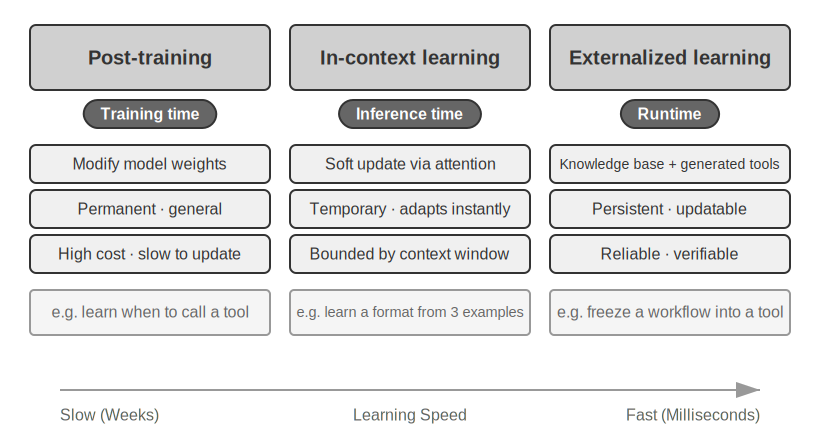
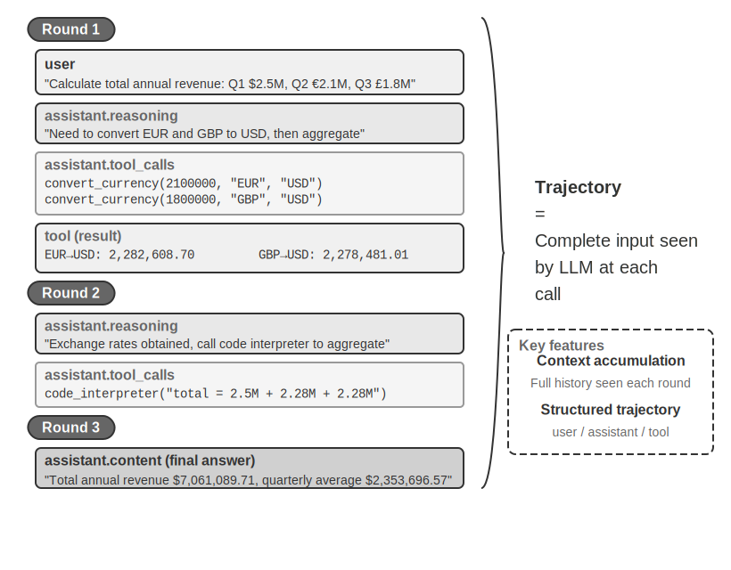
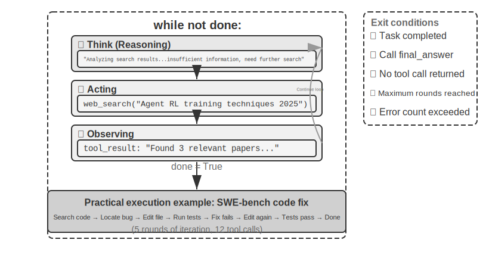

# Getting Started with AI Agents

If you have watched Cursor search a codebase, edit several files, and rerun tests until they pass, you have already used an AI Agent. The same is true if you have asked Deep Research to investigate a topic through repeated searching and reading, had Manus control a browser, asked the Doubao phone assistant to book tickets or send messages, or sent Pine AI to negotiate a lower telecom bill.

These products take many forms, but they share a common trait: they are no longer passive "you ask, it answers" conversations. They plan their own execution steps, call the tools each task requires, and adjust their strategy as results come in. AI Agents are becoming a new way to interact with computers.

This chapter begins with practical examples and then works backward to the core components of an AI Agent. Readers will see what modern Agents can do, understand the architecture behind them, and learn design patterns and best practices for building Agent systems.

> **Reading Tip**: This chapter is the conceptual map for the whole book: a concise tour of the core formula, operating loop, engineering framework, and Agent design patterns. It establishes the shared vocabulary and reference points used throughout later chapters. Do not try to memorize every concept on your first read; aim for the big picture. Each later chapter expands on one aspect introduced here, and you can return to this chapter whenever you need to reorient.

## Modern Agent = LLM + Context + Tools

The essence of a modern Agent system fits into one concise formula: **Agent = LLM (Large Language Model) + Context + Tools**. The formula is simple and practical—provided each term is read broadly:

- **The LLM is the Agent's reasoning engine, or "brain"**: It is not merely a set of model parameters, but the Agent's entire decision-making core: it understands intent, reasons, plans, and makes judgments. Just as the human brain is more than a collection of neurons and includes ways of thinking shaped by experience, an LLM's capabilities come from two sources: world knowledge and language ability acquired during **pre-training**, and decision-making strategies developed during **post-training**. Chapter 7 covers post-training techniques such as supervised fine-tuning and reinforcement learning.
- **Context is the Agent's working context, or "eyes"**: It is not merely the text supplied to the model, but all the information available to the Agent at each decision point: the environment, user memory, domain knowledge, its own state, and task progress. Just as a person needs to assess the situation, recall relevant experience, and consult references before making a decision, the Agent's context window contains everything it can use at that moment.
- **Tools are the Agent's action interfaces, or "hands and feet"**: They are not merely a few callable API functions, but the complete set of ways the Agent can act: predefined tool calls, Skills loaded on demand, generated code that creates new capabilities, delegation to sub-agents, requests for user input, and responses to external events.

Put more intuitively: **Agent = Brain + Eyes + Hands and Feet**. The LLM provides the reasoning engine, or brain; context provides the working context, or eyes; and tools provide the action interfaces, or hands and feet, through which decisions affect the outside world.

These three components correspond exactly to three core concepts in RL (see Chapter 7). The following table is **optional reading**—if you do not have an RL background, feel free to skip it; nothing later depends on it. It exists only to help readers who do know RL map that knowledge onto this book's terminology:

| Intuitive Understanding | Implementation Component | Academic Concept (Optional) | Meaning |
|---------------|----------------|------------------|---------------------------------------------|
| **Brain** | LLM | **Policy** | The decision-making logic that determines "what to do next"—given the current information, choose the most appropriate action from all available options |
| **Eyes** | Context | **Observation Space** | All the information available to the Agent—what it can observe, read, remember, and which systems it can access |
| **Hands and Feet** | Tools | **Action Space** | The complete set of things the Agent can do—what "means" are available, from sending messages to executing code to controlling interfaces |

Understanding what each component does and how they fit together is the foundation for building effective Agent systems. We will begin with the most concrete of the three—the Agent's tools, or "hands and feet"—and then move inward to the LLM and context. First, consider how different kinds of Agents compare across these three dimensions:

| Agent Product | Eyes (Working Context) | Hands and Feet (Action Interfaces) | Strategy |
|-----------------|------------------------|--------------------------|-----------------------------|
| **Coding Agents (e.g., Cursor)** | Requirements documents, codebase, terminal environment | Open-ended (internal reasoning, code search, file read/write, command execution, etc.) | Incremental development: understand requirements → search relevant code → edit code → test and verify → debug and fix |
| **Search Agents (e.g., Deep Research)** | Web resources, academic databases, local files | Open-ended (internal reasoning, search queries, web reading, summary generation) | Iterative deepening: adjust search direction based on existing information, gradually synthesize a complete report |
| **Computer Control Agents (e.g., Manus)** | Computer screen, browser pages, file system | Open-ended (internal reasoning, clicking, typing, scrolling, screenshots, code execution, etc.) | Visual perception + operation: observe screen → identify target elements → perform actions → verify results |
| **Phone Assistant Agents (e.g., Doubao)** | Phone screen, installed apps | Open-ended (internal reasoning, clicking, swiping, typing, opening apps, etc.) | Intent understanding + app control: understand user needs → locate target app → perform actions → confirm completion |
| **Personal Task Agents (e.g., Pine AI)** | User account information, historical bills, service provider knowledge base | Open-ended (internal reasoning, making calls, sending emails, filling forms, confirming with user) | Multi-step task execution: gather information → formulate negotiation strategy → contact service provider → negotiate → report results |

These systems share three features: an **open-ended action space**—not picking from a fixed set of buttons but generating arbitrary natural language and code; **internal reasoning**—planning before acting; and **continuous interaction**—adjusting strategy based on environmental feedback. These capabilities come from the interplay of the Agent's brain, eyes, and hands and feet: the LLM, context, and tools.

### Tools: The Agent's Action Interfaces, or "Hands and Feet"

Tools are the bridge through which an Agent interacts with the outside world. Like human hands and feet, they turn the Agent from a passive observer into an active executor. Without tools, an Agent can only theorize; with them, it can act on and change external systems.

To discuss tools systematically, we can sort them into five types according to how the Agent interacts with the world. For now, a brief overview of the typical uses of each type is enough; later chapters examine them in depth.

**Perception Tools** allow the Agent to access information: search engines provide real-time web data, file systems read local documents, and APIs and databases connect to external services and enterprise core data.

**Execution Tools** allow the Agent to change the world: code execution, file operations, system commands, and external API calls turn decisions into concrete actions.

**Collaboration Tools** allow the Agent to divide work with other Agents: delegating specialized tasks to sub-agents, requesting human confirmation at key decision points, or coordinating actions in multi-agent systems.

**Event Trigger Tools** differ fundamentally from the first three categories. The Agent does not call them; instead, external events activate the Agent. A new email, a scheduled time, or a webhook callback can initiate reasoning and action. Although the Agent does not invoke these events itself, they remain a channel through which it interacts with the outside world, so they belong to the broader tool system.

**User Communication Tools** are the channels through which the Agent communicates with the user. Unlike execution tools, which change external systems, communication tools deliver progress updates and proactive check-ins through text messages, voice calls, email, and similar channels.

Chapter 4 covers the full taxonomy and design principles for these five types. Tool quality directly affects what an Agent can accomplish reliably. Vague interfaces invite misuse, poor error handling can leave the Agent stuck after a failed call, and overly broad permissions can turn a single mistake into an irreversible action. As the MCP (Model Context Protocol) standard spreads, tool integration is becoming more like installing a plugin. The ecosystem is expanding rapidly, but the design principles will remain relevant.

**Tool Calling** (also known as Function Calling) is a core capability of modern LLM Agents: it lets the model invoke external tools in a structured way, transforming the LLM from a pure text generator into an intelligent system that can act through external interfaces. This book uses the term "tool calling" throughout.

Tool calling proceeds in four steps: first, the context tells the model which tools are available (names, purposes, parameters); then the model decides on its own whether to call a tool, which tool to call, and with what arguments; next, once the tool has run, its result is appended to the context; finally, the model decides its next move based on that result. This loop is the foundation of ReAct, introduced later in the chapter.

For a weather query, the simplified representation of the four-step process at the API level is as follows:

```
Step 1: Declare tools                  Step 2: Model decides to call
tools: [{                             assistant: {
  name: "get_weather",                  tool_calls: [{
  parameters: {                           function: "get_weather",
    city: "string"                        arguments: {city: "Beijing"}
  }                                      }]
}]                                    }

Step 3: Result appended to context    Step 4: Model responds based on result
tool: {                               assistant: {
  tool_call_id: "call_1",               content: "Today in Beijing: 28°C, sunny."
  content: '{"temp":28,"sky":"clear"}'      }
}
```

The developer only defines the tools and executes the calls; the model itself decides whether to call, which tool to call, and what arguments to pass. Chapter 2 examines this API structure in detail.

When designing tools for an Agent, keep them general-purpose and give the LLM flexibility. Instead of a dedicated calculator tool, provide a Python code interpreter and a secure sandbox to run it in. Instead of a special tool for logging work notes, provide file read/write tools and a virtual file system. General-purpose tools let the Agent combine basic capabilities to solve problems creatively.

### LLM: The Agent's Reasoning Engine, or "Brain"

The Large Language Model (LLM) is the Agent's decision-making core, or "brain." Given a user request, it must first infer the user's actual intent, then break a vague or complex task into executable steps. Throughout execution, it continues making decisions: what to do next, whether to call a tool, which tool to use, and what arguments to pass. Its ability to understand, plan, and execute comes from knowledge acquired during pre-training, and both workflows and autonomous Agents depend on it.

A distinctive capability of LLM Agents is **internal reasoning**: before acting, the Agent can plan and reason through the task. This does not change the external environment, but it can substantially improve the actions that follow. Pre-training—the initial training on large amounts of text through which the model learns language patterns and world knowledge—makes this reasoning possible. The model draws on reasoning patterns encoded in human knowledge, including mathematical principles, causal relationships, and strategies for decomposing problems. An Agent's reasoning is therefore not blind trial and error; it builds on a structured body of knowledge.

This structured reasoning lets an LLM Agent handle entirely new tasks without prior examples. Two concepts illustrate this ability: **zero-shot generalization** and **few-shot adaptation**. In zero-shot generalization, the Agent handles an unfamiliar task by recombining existing knowledge without being given examples. The model may never have been explicitly taught to write a poem about quantum physics, yet it can produce a reasonable one from its existing knowledge of language and physics.

With a few examples, an LLM Agent can also perform **Few-shot Adaptation**: two or three demonstrations in the prompt are enough for it to learn a new task pattern. If shown a few "user comment -> sentiment label" examples, it can classify the sentiment of new comments. In short: zero-shot means solving a task with no examples; few-shot means learning the pattern from a small number of examples.

#### Model as Agent: When the Model Itself Becomes the Product

The "Model as Agent" paradigm is the newest direction in AI Agent development. Advanced models internalize tool calling as a native ability through post-training, especially reinforcement learning: the model decides when to call a tool, which one to use, and what arguments to pass, without manual orchestration. That does not make the framework layer less important. On the contrary, the stronger the model, the more the surrounding Harness matters. The word *harness* originally refers to the reins and other tack fitted to a horse—not to limit the horse's ability to run, but to direct its power. In the Agent context, the model is the powerful but unpredictable horse, while the Harness is the engineering shell that channels its capabilities into reliable task execution. It can also be compared to the safety system surrounding a race-car driver: the seat belt, track barriers, and pit crew. The faster the driver—the model—the more important this system becomes. An Agent's Harness includes context management, tool interfaces, safety constraints, and verification and correction mechanisms (see the final section of this chapter).

The more decision authority a model has, the greater the impact of a wrong decision—which calls for finer-grained constraint, verification, and correction to keep it reliable. The real advantage of model providers is not "making the framework thinner" but being able to co-optimize the model and its surrounding Harness, iterating continuously.

But a deeper question follows: as models grow stronger, will they absorb today's Harness? In "The Bitter Lesson," Rich Sutton identified a recurring pattern in seventy years of AI research: systems built around human domain knowledge may work well in the short term, but general methods that scale with compute and data—search and learning—eventually outperform them.[^ch1-1] From that perspective, how much of today's Harness consists of prior knowledge that models will eventually internalize? This book's position is: **endorse the direction, but remain pragmatic about the pace**. Models will continue to absorb Harness functions; tool calling and long-horizon planning have already moved partly from external orchestration into the model. Yet this process is slower than it may appear. Training takes months, and no single training run can capture every real-world business constraint and preference. The Harness adds value precisely at the model's current capability boundary: it covers what the model cannot yet do reliably, sheds functions as the model internalizes them, and moves on to the next frontier. Chapter 2 examines this trade-off through context engineering, Chapter 8 explores how Agents can discover knowledge and capabilities, and the Afterword revisits whether models will ultimately absorb the Harness.

[^ch1-1]: Sutton, Rich. “The Bitter Lesson”, 2019. http://www.incompletenessideas.net/IncIdeas/BitterLesson.html

#### Agent Learning Mechanisms: Post-training, In-Context Learning, and Externalized Learning

The previous section showed how reinforcement learning lets a model internalize the decision of when and how to call tools. But an Agent's learning is not confined to the training phase. When people ask how an Agent learns from experience, they often assume that the model must be retrained. In fact, Agents can learn through three complementary paradigms (Figure 1-1):



- **Post-training**: Encodes experience into the model’s parameters through reinforcement learning—the strongest cross-task generality, at the highest update cost (see Chapter 7).
- **In-Context Learning**: Adapts on the fly by identifying patterns in the current context through the attention mechanism. For example, after seeing several "customer complaint → response strategy" demonstrations, the model can follow the same pattern in a new conversation. This adaptation is fast but temporary: it disappears when the context is removed. Despite its name, in-context learning is closer to **pattern matching than genuine learning**: it lets the model apply patterns it has already seen, but not discover genuinely new rules. If a fourth problem requires an entirely new approach, three similar solved examples will not be enough. This fundamental difference from post-training is examined in Chapter 2 through the attention mechanism.
- **Externalized Learning**: Stores knowledge and procedures in knowledge bases and executable tool code, making them both persistent and interpretable.

The three paradigms complement each other on different time scales: post-training provides foundational capability, in-context learning provides rapid adaptation, and externalized learning provides reliability and efficiency. Chapter 8 systematically compares how the three work in concert.

An analogy: post-training is like studying a textbook—it can produce lasting improvement, but at high cost; in-context learning is like consulting a reference—you perform well while it is available, but the adaptation disappears when it is removed; externalized learning is like maintaining a personal notebook—it remains available but requires deliberate upkeep.

### Context: The Agent's Working Context, or "Eyes"

Context is the Agent's working context: all the information available to it at each decision point—its "eyes." Just as a person making a decision needs the right materials on the table—task instructions, reference manuals, earlier correspondence, and the latest data—an Agent's context window defines its field of view. From the API's perspective (detailed in Chapter 2), the context of each LLM call consists of five parts:

- **System Prompt**: Unlike user prompts, the system prompt is written by the developer and defines the Agent's identity, permissions, and operating rules. Its core instructions usually remain stable throughout a conversation, although the framework may also inject user memory that persists across sessions (preferences, past behavior, and background settings; see Chapter 3) and dynamic environmental state into the system-level context.
- **Tool Definitions**: Declare the names, functional descriptions, and parameter formats of the tools available to the Agent. Without tool definitions, the Agent cannot recognize or call any tools—an ablation study (Experiment 1-1) will verify this. Tool definitions, together with the system prompt, form the **static prefix** that remains unchanged throughout the conversation. (This is the foundational pattern; since 2026, production frameworks can also load full tool schemas on demand at the end of the context without breaking the prefix—see the tool definitions section of Chapter 2 and Chapter 4.)
- **User Messages**: Input from the user. User messages may also contain **external knowledge** dynamically retrieved via RAG (Retrieval-Augmented Generation, see Chapter 3 for details)—covering information beyond the training data cutoff or private domain knowledge.
- **Assistant Messages**: Responses previously generated by the model, which can contain up to three parts—`reasoning` (the internal chain of thought, maintaining coherence and decision interpretability), `content` (the response to the user), and `tool_calls` (the way the Agent takes action). In a specific response, these three parts may not all appear simultaneously: for example, when the Agent decides to call a tool, it usually only has `reasoning` + `tool_calls`; when giving a final answer, it usually only has `reasoning` + `content`.
- **Tool Results**: The output returned after the Agent framework executes a tool. These results provide the evidence for the Agent's next reasoning step, allowing it to learn from outcomes rather than repeat the same mistakes.

The first two items (system prompt + tool definitions) form the static prefix; the last three (user messages + assistant messages + tool results) form the dynamic message history that grows with every interaction. Together, these five parts make up the context of each LLM inference.

Is every component truly indispensable? An **ablation study** answers this question by removing one component at a time and measuring the effect, much like a doctor ruling out possible causes one by one. Experiment 1-1 applies this method to the five components above; the detailed results appear below.

### Experiment 1-1 ★★: The Critical Role of Context

We probed how each context component shapes Agent behavior with a systematic **ablation study**. Of the five components above, four were tested—the system prompt, as the Agent's basic identity definition, was exempt because without it the Agent has no role awareness and the test would be meaningless. As Figure 1-2 shows, the experiment used five conditions: one complete baseline and four ablation variants, each missing a different component.


The experimental results revealed the irreplaceable role of each context component. **Tool Definitions** (part of the static prefix) are the foundation of the Agent’s action capability; without them, the Agent cannot recognize or call any tools. **Tool Results** are key to closed-loop control; their absence deprives the Agent of execution feedback and causes it to fall into an infinite loop. The **reasoning process** (the reasoning part of assistant messages) preserves the reasons for the Agent’s previous decisions, making the overall reasoning more coherent and preventing contradictory decisions. **Message history** (user messages, assistant messages, and tool results from previous rounds) prevents redundant operations, maintains task execution coherence, and avoids repeating the same mistakes.

The experiment's core insight is that **context determines what information the Agent has at decision time, and the Agent can make decisions only from that information**. Just as a person whose eyes are covered cannot make a sound judgment, an Agent missing any context component suffers a severe loss of decision-making ability: without tool definitions, it does not know what tools exist; without previous execution results, it does not know what has already been done.

### The ReAct Loop

With the three components in hand, a natural question follows: how do they work together? The ReAct loop is the core mechanism that connects LLM, context, and tools into one system. We can examine it step by step.

The core pattern by which an Agent executes a task is called **ReAct** (Reasoning + Acting). The name mentions only reasoning and acting, but the actual loop has three stages: the model first **reasons** about what to do next, then calls a tool to **act**, then **observes** the tool’s result and reasons about the subsequent step. This “reason → act → observe → reason → act → observe” loop repeats until the task is done.

Consider a concrete example—aggregating revenue across several currencies—to see an Agent's **trajectory** in action. The trajectory is the dynamic message history accumulated during execution: user messages, assistant messages, and tool results. On each LLM call, the model receives the static prefix—system prompt and tool definitions—followed by the current trajectory (Figure 1-3). The model's response is then appended to that trajectory for the next call. In short: **Agent context = static prefix + trajectory**.



Here is the structure of a trajectory, in pseudocode:

```
trajectory = [
  {role: "user", content: "Based on the company's quarterly revenue: Q1 2.5M USD, Q2 2.1M EUR, Q3 1.8M GBP, Q4 380M JPY, calculate the company's total annual revenue and average quarterly revenue"},
  
  # First iteration - LLM receives the above trajectory and generates a response
  {role: "assistant",
   reasoning: "Need to convert all currencies to USD...",
   content: "",  # No direct reply to the user
   tool_calls: [
     {name: "convert_currency", args: {amount: 2100000, from: "EUR", to: "USD"}},
     {name: "convert_currency", args: {amount: 1800000, from: "GBP", to: "USD"}},
     {name: "convert_currency", args: {amount: 380000000, from: "JPY", to: "USD"}}
   ]},
  
  # Agent framework executes tools, adds results to trajectory
  {role: "tool", content: "EUR->USD: 2282608.7"},
  {role: "tool", content: "GBP->USD: 2278481.01"},
  {role: "tool", content: "JPY->USD: 2541806.02"},
  
  # Second iteration - LLM receives the complete trajectory, including tool results
  {role: "assistant",
   reasoning: "Conversion results obtained, now need to aggregate and calculate...",
   content: "",
   tool_calls: [
     {name: "code_interpreter", args: {code: "total = 2500000 + 2282608.7 + ..."}}
   ]},
  
  {role: "tool", content: "Total: $9,602,895.73, Average: $2,400,723.93..."},
  
  # Third iteration - LLM receives the complete trajectory and generates the final answer
  {role: "assistant",
   reasoning: "All calculations complete, summarizing results...",
   content: "FINAL ANSWER: Total revenue $9,602,895.73..."}
]
```

Note that the system prompt and tool definitions are not shown in the trajectory—they serve as the static prefix and are automatically prepended to the trajectory before each LLM call.

In our experiment, this loop was clearly visible. In the first round, the Agent analyzed the task and called three currency conversion tools in parallel; in the second, it fed the conversion results to a code interpreter for the more computationally intensive calculation; in the third, having confirmed all calculations were complete, it produced the final answer. A complex multi-step task was completed in three iterations and four tool calls.

The elegance of this design lies in the **cumulative nature of the context**. Every LLM call receives the complete trajectory, so the model knows the current stage of the task, the actions already attempted, and their outcomes. Just as people review and summarize their progress while solving a problem, the Agent maintains a global view of the task through its trajectory. Because that trajectory is structured—user messages, assistant messages (reasoning + tool calls), and tool results are clearly separated—the system is highly interpretable and debuggable.

The trajectory is more than an execution record; it is evidence of the Agent's capability. Analyzing trajectories at scale can reveal behavioral patterns, identify more effective decision paths, and inform better tool design. Trajectory data can even be distilled into a knowledge base or used to train stronger Agent models through reinforcement learning, closing the loop of learning from experience.


Now that we understand the Agent's operating loop, we examine two experiments to see how different models drive it.

#### Experiment 1-2 ★: Kimi K3 Native Agent Capability

This experiment demonstrates the native Agent capabilities of **Kimi K3**, an example of the "Model as Agent" paradigm. Released by Moonshot AI in 2026, Kimi K3 is a Mixture-of-Experts (MoE) model with approximately 2.8 trillion parameters. An MoE model resembles a team of experts: for each problem, the system activates only the experts best suited to answer it rather than the entire model, preserving capability while improving efficiency. Kimi K3 has a one-million-token context window, native visual understanding, and an always-on "thinking mode." Reinforcement learning has made tool-call selection a native capability: the model decides when to call a tool, which tool to use, and what arguments to pass. The tools themselves, such as `web_search` and `code_runner`, still run server-side through Kimi's Formula script engine.

The key observation is that RL teaches the model the policy for using tools: when to call one, which one to choose, what arguments to pass, whether to continue after receiving a result, and how to link dozens or hundreds of calls into coherent reasoning. These decisions are encoded in the model's weights. **The tools and execution infrastructure remain outside the model**, in the Agent framework or API: the implementations of `web_search` and `code_runner`, the code sandbox, and the infrastructure that issues each call and returns its result. RL optimizes the decision policy; it does not embed a search engine or code sandbox in the model's weights. In short, the orchestration loop has moved from the client to the server, while tool-use decisions have moved into the model[^ch1-2].

[^ch1-2]: Thanks to reader asdlem for pointing out and clarifying, via GitHub Issue #30, the distinction that what RL internalizes is the tool-calling decision policy, not the tool execution mechanism. See https://github.com/bojieli/ai-agent-book/issues/30

Kimi K3's notable advantage in Agent tasks is **the stability of long-chain tool calls**. It can sustain coherent reasoning across 200–300 consecutive tool calls, well beyond the point—often after only a few dozen calls—at which many models begin to degrade. K3 is optimized for long-horizon programming and Agent workloads, and was released in two variants: K3 Max (for dialogue and Agent tasks) and K3 Swarm Max (for large-scale parallel processing). As an open-source model, it matches top-tier closed-source systems on software engineering and Agent benchmarks, demonstrating that reinforcement learning can give a model native Agent capabilities.

#### Experiment 1-3 ★: GPT-5.6 Native Deep Research Capability

The second experiment uses **OpenAI GPT-5.6** to show how an advanced model and API-level built-in tools can run the "search → read → analyze" loop server-side for Deep Research. GPT-5.6 has three variants: Sol (the flagship frontier model), Terra (a balanced model for everyday work), and Luna (a fast, economical lightweight model). Each lets the model make tool-calling decisions natively, so the client does not need its own orchestration framework. One useful feature is **free-form tool calling**. Traditional tool calls serialize parameters as strict JSON, much like filling out a rigidly formatted form. A custom tool (`type: "custom"`) can instead accept raw text, such as Python code or a SQL query, avoiding JSON escaping. This changes the API argument format, not the model architecture: the client still detects the tool call, executes it, and returns the result. GPT-5.6 also exposes `verbosity` and `reasoning_effort` parameters, allowing developers to tune response detail and reasoning depth; Sol adds a `max` level for the deepest reasoning.

Paired with the Responses API's built-in **web search and code interpreter** tools, GPT-5.6 can perform the core Deep Research loop: search, read, analyze, and search again. For example, it can find the coordinates of the capitals of the 10 ASEAN countries, write Python code to calculate all pairwise great-circle distances, and identify the closest pair. For a Bitcoin analysis task, it can gather recent price data from multiple financial sources, calculate indicators such as moving averages, RSI, and MACD, generate charts, and provide trading recommendations.

More importantly, GPT-5.6 incorporates the design philosophy of **OpenAI Deep Research** through an **intent clarification process**. Given a research request, it does not begin immediately; it first asks questions to clarify the user's intent. For "Search for Bitcoin's trend over the past month and perform technical analysis," it might ask: "Which data source do you prefer? Which technical indicators would you like analyzed?" This interaction produces research reports that are more precise and better aligned with the user's actual needs.

GPT-5.6 is a mature example of "Model as Agent." Because the Responses API runs built-in tools such as web search and code interpreter in a server-side loop, clients do not need to implement the research orchestration themselves. The model still emits standard tool calls, but the API handles the loop. Intent clarification complements this execution model by confirming the user's needs before the model formulates its research strategy.

Figure 1-4 illustrates the complete architecture of native tool calling under the "Model as Agent" paradigm, along with the ReAct execution process of Kimi K3 and GPT-5.6 in real-world tasks.


## Harness Engineering: Competitiveness Beyond the Model

By now you understand how an Agent works at its core: an LLM runs the ReAct loop, guided by context, using tools to complete the task. The experiments above show that the basic mechanism works—and also expose how fragile it is. The model may hallucinate (invent tools or parameters that do not exist), pick the wrong tool, or fail to recover from an error. Between a working demo and a reliable product lies a substantial gap, and those fragilities are exactly what Harness Engineering exists to fix. The first half of this chapter answered what an Agent is; the second half answers how an Agent runs reliably in production.

The preceding sections established the core formula: **Agent = LLM + Context + Tools**. It describes the Agent's **internal composition**: reasoning engine, working context, and action interfaces—the brain, eyes, and hands and feet. Harness Engineering adds a complementary, **implementation-level** view of the same system: the LLM is the Model, and all supporting code around it is the Harness. The two views are not rivals; they describe the same system at different levels of abstraction. We use the more general word "Model" because Harness Engineering applies to any model that can reason and call tools, not only to a particular type of LLM. The Harness contains the original formula's "Context + Tools," plus three layers of safeguards: **Constrain** (what the Agent may and may not do), **Verify** (whether it acted correctly), and **Correct** (how to recover when it did not).

Expanded as an equation, the complete production-grade composition is:

> **Agent = LLM + [Context + Tools + Constrain + Verify + Correct] = Model + Harness**

A minimal working Agent needs only an LLM, context, and tools. To operate reliably in sustained production workloads, it also needs three outer engineering layers: Constrain to prevent overreach, Verify to catch errors, and Correct to recover from failures. These layers are not standalone modules added after the fact; they are safeguards wrapped around "Context + Tools." Put differently, the minimal formula is the demo view, while the expanded formula is the production view: it contains the former and adds a safety net around it.

An example clarifies the boundaries: embedding a refund policy in the context falls under **Context**, while checking that the refund amount does not exceed the order total falls under **Constrain**. Using a tool to execute an API call falls under **Tools**, while automatically retrying after an API timeout falls under **Correct**. The model supplies the underlying understanding and reasoning; the Harness guides, constrains, and amplifies those capabilities into reliable task execution. The engineering practice of designing and optimizing this infrastructure outside the model is **Harness Engineering**.

A concrete example shows the value of the Harness. Suppose you ask an Agent to refund a user's order placed 3 days ago. **Without a Harness**: the model does not receive the refund policy (no context), does not know which API to call (no tools), fabricates a refund result for the user (no verification), and the user discovers the refund never happened (no correction). **With a Harness**: the system prompt specifies the 7-day refund policy (context), the Agent calls the `query_order` and `process_refund` tools to perform the operation (tools), the framework checks that the refund does not exceed the order total (constrain), confirms against the database that the refund went through (verify), and automatically retries if the API call times out (correct). Same model, substantially different results.

Returning to the harness metaphor introduced earlier, a model without a Harness is like a runaway horse: astonishingly capable, but unable to complete tasks reliably.

More precisely, all infrastructure outside the model belongs to the Harness. The core of the Harness is Context and Tools, around which three types of engineering safeguards are built:

| Function | One-Sentence Responsibility | Relationship with Context/Tools |
|----------|-------------------------------------------|------------------------------------------|
| **Context** | Provides the model with relevant information | Core capability |
| **Tools** | Provides the model with action interfaces | Core capability |
| **Constrain** | Sets behavioral boundaries—what can and cannot be done | Safety boundary built around context and tools |
| **Verify** | Automatically judges the correctness of tool execution results | Checking mechanism built around tool execution results |
| **Correct** | Automatically recovers or rolls back when problems are found | Recovery mechanism built around tool call failures |

Context and Tools enable the Agent to understand a task and act on it. Constrain, Verify, and Correct are the engineering safeguards that make those capabilities reliable and safe in production. As Agent products mature, the emphasis shifts between these two groups.

Early Agent frameworks concentrated on supplying Context and Tools: give the model tools and context, then let it complete tasks. Production systems increasingly focus on Constrain, Verify, and Correct: keeping tool calls safe, managing context reliably, and making failures recoverable.

Claude Code provides a useful example. Most of its Harness code implements Constrain, Verify, and Correct rather than the basic Context and Tools functions. The tools themselves—file operations, command execution, and search—form only a small part; the safeguards built around them are the true core. These mechanisms include:

- **Process State Management**: Tracks which step the Agent is currently executing
- **Multi-Layer Context Compression**: Automatically prunes information when there is too much
- **Permission Classification**: Controls which operations require user confirmation
- **Circuit Breaker**: Automatically "trips" and stops retrying after consecutive errors, like a household fuse that blows during a short circuit to protect the larger system
- **Error Recovery Mechanisms**: Catches exceptions, rolls back to the last stable state, retries, or hands off to a human

**The industry is shifting from task completion to reliable task completion, making Harness Engineering the core competitive advantage of Agent systems.**

### From Prompt Engineering to Loop Engineering: The Evolution of Engineering Paradigms

Looking back at the development of AI application engineering, a clear evolutionary arc emerges:

AI application engineering has expanded through five nested layers. **Software Engineering** provides the foundations of system design, architecture, testing, and deployment. **Prompt Engineering** improves output by refining the natural-language instructions given to the model. **Context Engineering** manages the model's entire working context, including system instructions, tool definitions, conversation history, and external knowledge. **Harness Engineering** broadens the scope to all infrastructure outside the model, including constraints, verification, feedback loops, and error recovery. **Loop Engineering** extends the view from a single run to sustained autonomous operation across runs: how new work is discovered, when results are verified, and when a task is truly complete (Chapter 10 develops this alongside multi-agent collaboration systems).

These five stages do not replace one another; they form nested layers. Prompt Engineering is a subset of Context Engineering, which is a subset of Harness Engineering, which is a subset of Loop Engineering. Each layer expands the engineer's scope of concern and influence. **As models converge in capability and stop being the decisive differentiator, competitive advantage shifts to the engineering outside the model.** Recent engineering practice supports this view. LangChain's work on Terminal Bench 2.0 (a benchmark evaluating an Agent's ability to complete complex tasks in a terminal environment) is a striking example: its Coding Agent improved from 52.8% to 66.5%, moving from outside the top 30 to the top 5. The model did not change; the Harness did. The Agent learned to check its own results, detect repetitive loops, and refine its reasoning strategy. OpenAI's engineering team reported a similar experience: three engineers delivered approximately one million lines of code across nearly 1,500 PRs in five months, at roughly ten times the traditional development speed. The main driver was not a stronger model; it was getting the Harness right.

### Core Principles of the Five Harness Functions

The earlier table listed the Harness's five functions. The table below adds each function's core design principle and where this book treats it, mapping concept to practice:

| Function | Core Principle | Practical Example | See Chapter |
|----------|------------------------------------------|----------------------------------|---------|
| **Context** | Information Sufficiency: Ensure the Agent makes decisions based on sufficient information at every decision point | System prompts, knowledge bases, Agent status bars, Sidecar bypass queries | Chapters 2 & 3 |
| **Tools** | Clear Interface: Tool names are intuitive, parameters have examples, boundaries are explained | MCP tools, code interpreter, search tools | Chapter 4 |
| **Constrain** | Fail-Safe Defaults: All capabilities are off by default and must be explicitly enabled (similar to mobile app permission management) | In Claude Code, every tool requires user authorization by default before execution | Chapter 4 |
| **Verify** | Input Isolation: Security checks only look at structured data (e.g., JSON fields returned by tools), not free-form text generated by the model (because attackers might manipulate model output through prompt injection) | Linter checks, type systems, tool call result validation | Chapters 5 & 6 |
| **Correct** | Do not expose intermediate states until a failure is confirmed unrecoverable (e.g., silently retry a failed tool call instead of showing the user a half-finished result) | Silent retries, continuation generation, fallback to human judgment upon consecutive failures (circuit breaker mechanism) | Chapters 2 & 5 |

The five functions form a closed loop: Context and Tools support decision-making, Constrain prevents errors, Verify detects deviations, and Correct closes the cycle. If any link is missing, the system develops a reliability gap. Before examining specific orchestration patterns and guardrail designs, we first lay out the core principles for building effective Agents and for choosing a model—the foundation for every design decision that follows.


### Core Principles for Building Effective Agents

Based on Anthropic's experience, successful Agent systems follow three core principles.

**Keep it simple.** Start with the simplest solution and add complexity only when truly necessary. Direct API calls are preferable to complex frameworks; clear code is preferable to clever abstraction—every extra layer of abstraction is a new blind spot during debugging.

**Keep it transparent.** Show the Agent's planning steps, execution logs, and decision trajectory clearly. This is more than a debugging convenience; it is essential to user trust, because an opaque system makes errors difficult to locate and correct.

**Design a well-structured tool interface (ACI, Agent-Computer Interface).** ACI means designing an interface from the Agent's perspective rather than the programmer's. Tool names and parameters should be intuitive, and the design should prevent likely errors wherever possible—the way a USB connector's shape prevents it from being inserted incorrectly. Manufacturing calls this approach **Poka-yoke**, or mistake-proofing. Even a strong model can fail repeatedly when a tool interface is vague, because that interface is the model's only channel for understanding and using the tool.

The next three sections cover three important cross-cutting topics in Harness Engineering: model selection, orchestration patterns, and guardrails and safety. None is itself one of the five Harness functions, but all are essential in practice.

### How to Choose a Model

Before discussing orchestration patterns, we first need to answer a practical question: what kind of model should drive your Agent?

The model is the foundation of the Agent's intelligence, and choosing the right one often matters more than any amount of prompt tuning. The model landscape changes too quickly for specific version recommendations to remain useful, so this section focuses on general selection criteria.

**Know the "Big Three."** The three most commonly used closed-source model providers in current Agent development are OpenAI (GPT/o series), Anthropic (Claude series), and Google (Gemini series). Each has its strengths: Claude excels in complex reasoning, coding, and tool calling, making it a popular choice for Agent development; Gemini offers an ultra-long context window and powerful multimodal capabilities, making it suitable for long texts and multimedia scenarios such as images and videos; the GPT/o series offers broadly balanced capabilities and has the largest user base. When selecting a model, do not rely only on leaderboards; **evaluate it on your own tasks** (see Chapter 6).

**Chinese Models.** If your application is deployed in China or you are on a tight budget, models from Chinese vendors are a pragmatic choice. ByteDance's Doubao series offers extremely low latency within China, making it suitable for real-time interaction; Moonshot AI's Kimi is among the stronger Chinese models for agentic tasks; open-source models such as Qwen and DeepSeek offer advantages in cost and customizability. Models differ widely in tool-calling ability, so test them in your specific scenario before committing. Chinese models are typically accessed through APIs from platforms such as Volcano Engine (Doubao) and SiliconFlow (open-source models), while non-Chinese models can be accessed through aggregator services such as OpenRouter.

**Open-Source vs. Closed-Source.** Closed-source models generally lead in capability but are more expensive and constrained by the vendor's API policies. Open-source models cost less, support private deployment, and allow fine-tuning, making them suitable for cost-sensitive scenarios or those with data compliance requirements.

**Most Agents Need a Model That Supports Reasoning.** Agents make complex decisions involving multi-step reasoning and tool selection, and models without reasoning tend to perform poorly on these tasks. There are few exceptions: a non-reasoning model may suffice for a single simple step or for a GUI task that requires clicking a fixed location. Once a task requires multiple steps or dynamic decisions, a reasoning model becomes essential.

**Consider Output Speed and Multimodal Capabilities.** Beyond cost, two dimensions are easy to overlook. One is **output token speed**: Agents typically run many rounds of inference, and each round must finish before the next can start, so output speed directly determines end-to-end latency. If each round takes two additional seconds, a 20-round Agent task takes an extra 40 seconds overall. The other is **multimodal support**: if your Agent needs to understand images, audio, or video, multimodal capability is a hard requirement, and models differ widely here.


### Orchestration Patterns: Workflow vs. Autonomous

Orchestration patterns govern how the Harness organizes its "Context and Tools" layer: how context flows between LLM calls, how tools are scheduled, and whether the execution path is predefined or generated dynamically. Agent orchestration ranges from simple to complex, and each pattern has appropriate uses and trade-offs. In Anthropic's experience working with dozens of teams building LLM Agents, the most successful implementations rarely use complex frameworks; they use simple, composable patterns.

When building an LLM application, progress from simple to complex. Start with a single LLM call—if better prompts and in-context examples solve the problem, do not build an Agent system. When multiple steps are needed and the task decomposes cleanly into fixed sub-tasks, use a workflow. Use an autonomous Agent only when you need dynamic decisions and a flexible execution path. And remember: Agent systems typically trade latency and cost for better task performance—evaluate carefully whether that trade is worth it.

#### Workflow Pattern: Deterministic Orchestration

A **workflow** is a system that orchestrates LLMs and tools through predefined code paths. Its execution path is deterministic and designed in advance: the operation of each step and the transitions between steps are defined in code, while the LLM handles only the understanding and generation within each node.

For example, a flight-booking Agent can use a workflow with four fixed nodes:

1.  **Verify User Identity**—Call the identity verification API to confirm who the user is.
2.  **Search for Available Flights**—Query the flight database based on user requirements.
3.  **Complete Payment**—Call the payment interface to deduct the amount.
4.  **Confirm Booking**—Call the booking API to lock the seat and send a confirmation to the user.

An LLM can be used within each node (e.g., using natural language to understand the user's travel needs), but the flow sequence between nodes is fixed by code—the system will not book a seat before payment is completed, nor will it start searching for flights before identity verification.

The workflow pattern has two core advantages. First, **strict process control**: the developer can guarantee that critical steps are never skipped or run out of order—business rules like "no booking before payment" are enforced by code, not left to the LLM's judgment. Second, **security**: because the execution path is deterministic, prompt injection or a model error can at most affect the processing inside the current node; it cannot make the Agent jump to a branch it should not reach. The attack surface is confined to a single node.

The main limitation of a workflow is its **lack of flexibility**. When an unanticipated event occurs—such as a user changing the booking during payment or a flight being canceled—the fixed path cannot adapt unless the developer has provided an exception branch. Otherwise, the system must return control to a human.

#### Autonomous Agent: Runtime Decision-Making

When the fixed path of a workflow is insufficient, we need an **autonomous Agent**. The core difference between an autonomous Agent and a workflow is that the execution path is not predefined but is determined at runtime by the Agent based on **environmental feedback**.

Returning to the flight example, an autonomous Agent needs no four predefined nodes. The user says, "Book me a flight to Shanghai next Wednesday," and the Agent determines the sequence dynamically. It may search for flights, discover that login is required, verify the user's identity, and then resume the search. If the cheapest flight has a layover, it can ask whether that is acceptable and adjust the search criteria based on the answer.

An autonomous Agent therefore has to plan for itself, choose its own execution steps, recognize failure, and change strategy rather than simply halt on error. But autonomy is not unbounded: explicit **stopping conditions** must be built in, such as task completion, reaching the maximum number of iterations, or encountering an unrecoverable error. Without them, the Agent can enter an infinite loop or continue executing after the task is complete.

From an implementation perspective, an autonomous Agent is essentially an LLM using tools in a loop and continuously obtaining environmental feedback to advance the task. This is the ReAct loop introduced earlier. Common exit conditions include calling a final-output tool, returning a response with no tool calls, encountering an error, or reaching the maximum number of rounds.



Autonomous Agents are well suited to open-ended problems for which the required number of steps is difficult or impossible to predict. Typical use cases include Coding Agents working on SWE-bench tasks (Software Engineering Benchmark, which evaluates an Agent's ability to fix real GitHub issues), Computer Use Agents operating graphical interfaces, and research Agents conducting iterative searches and analyses.

Autonomy also costs more and lets errors compound. Deploying an autonomous Agent therefore demands thorough testing in a sandbox, appropriate guardrails and monitoring, and human-in-the-loop checkpoints at critical decision points.

#### Choosing and Mixing the Two Patterns

In practice, workflows and autonomous Agents are not mutually exclusive. Many systems combine the two: compliance-critical processes use workflows for reliability, while components requiring flexible decisions operate autonomously. For example, n8n lets developers arrange functional components on a visual canvas, with workflow nodes and autonomous Agent nodes coexisting in the same system.


#### Brief Comparison of Mainstream Agent Frameworks

The following table summarizes widely used Agent frameworks and platforms to help readers identify the right one for their scenario:

| Framework/Platform | Core Positioning | Orchestration Pattern | Development Approach | Applicable Scenarios |
|-------------------|--------------------|----------------|----------------|-------------------------|
| **OpenAI Agents SDK** | Lightweight Agent development library | Autonomous (tool loop) | Code-first | Rapid prototyping, single-agent applications |
| **Claude Agent SDK** | Production-grade Agent development framework | Autonomous (tool loop + sub-agents) | Code-first | Complex autonomous tasks, Coding Agent |
| **LangChain / LangGraph** | General-purpose LLM application framework | Workflow + Autonomous | Code-first | Complex chain-of-thought, multi-step workflows |
| **n8n** | Visual workflow automation | Workflow + Autonomous | Low-code (visual drag-and-drop) | Business automation, non-technical teams |
| **Dify** | LLM application development platform | Workflow + Conversational | Low-code (visual + API) | Enterprise-grade RAG, knowledge base applications |
| **CrewAI** | Role-based multi-agent orchestration | Multi-Agent collaboration | Code-first | Team-based task decomposition and execution |
| **OpenClaw** | Open-source all-in-one personal Agent | Autonomous + Event-driven | Configuration + Code (self-hosted) | Personal assistant, Deep Research, Computer Use, multi-platform message integration |

As the "Model as Agent" trend continues, a framework's core value is no longer limited to orchestrating LLM calls; models are increasingly capable of making decisions autonomously. What has become more important is the Harness engineering around the model: context management, the tool ecosystem, security constraints, and error recovery. When choosing a framework, the question is not how sophisticated it is, but whether it lets you focus on business logic through the thinnest practical layer of abstraction.

Orchestration patterns govern how context, tools, LLM calls, and data flows connect within the Harness. But task completion is not enough; tasks must also be completed correctly and safely. We therefore turn to the primary way the Constrain, Verify, and Correct functions are implemented in practice: guardrails.

### Guardrails and Safety

This section provides a high-level overview of guardrails. Implementation details and practical guidance appear in Chapter 2 (prompt injection protection), Chapter 4 (tool permission control), and Chapter 5 (code execution security); first-time readers do not need to follow every detail.

Guardrails are the primary means of implementing the Harness's Constrain, Verify, and Correct functions. Together, they form a layered defense that keeps Agent behavior safe and controllable. Well-designed **guardrails** help manage data privacy risks, such as system prompt leakage, and reputational risks, such as model behavior that conflicts with the brand. Start with guardrails for known risks, then add new ones as vulnerabilities emerge.

Think of guardrails as defense in depth. No single guardrail is likely to be sufficient on its own, but several specialized ones combined make a far more resilient Agent system.

#### Types of Guardrails

Based on where they sit in the execution flow, guardrails fall into three types: input-side, execution-side, and output-side.

**Input-side** guardrails intercept requests before they reach the Agent, typically through four mechanisms. **Relevance classifiers** flag off-topic queries—for example, a coding assistant being asked, "How tall is the Empire State Building?" **Safety classifiers** detect jailbreaks (inducing the model to bypass its safety restrictions) and prompt injections (embedding malicious instructions in input). The key difference: in a jailbreak, the user tries to bypass the model's restrictions directly; in prompt injection, an attacker manipulates model behavior indirectly through external data (web content, documents). **Content moderation** flags harmful or inappropriate input, such as violent or discriminatory content. **Rule-based protections** apply deterministic measures—blacklists, input length limits, regular-expression filters—against known threats like SQL injection.

**Execution-side** guardrails validate tool calls. The core is **tool risk rating**: based on whether an operation is reversible, its permission level, and financial impact, each tool is assigned a risk level (low/medium/high). High-risk operations require additional review or human confirmation.

**Output-side** guardrails check the response before it is returned to the user. **PII filters** review the output for personally identifiable information (e.g., ID numbers, phone numbers) to prevent unnecessary exposure; **output validation** ensures the reply aligns with brand values through content checks.

Note that some mechanisms (e.g., rule-based regex filtering) can be used on both the input and output sides; the above categorization follows the most common deployment locations.

#### Human Intervention

**Human-in-the-loop** intervention is a key protective measure: it lets an Agent improve real-world performance without degrading the user experience. It matters most in early deployment, when it helps identify failure modes, surface edge cases, and establish a robust evaluation cycle.

With a human-in-the-loop mechanism, an Agent that cannot complete a task can hand over control gracefully. In customer service, this may mean escalating to a human representative; for a Coding Agent, it may mean returning control to the developer.

There are typically two main situations that trigger human intervention:

**Exceeding Failure Thresholds**
Set caps on the Agent's retries and operations. If the Agent exceeds those caps (for example, it still cannot infer the customer's intent after several attempts), escalate to a human.

**High-Risk Operations**
Sensitive, irreversible, or high-risk operations should trigger human oversight, at least until the team has built enough confidence in the Agent's reliability. Examples include canceling an order, authorizing a large refund, and processing a payment.

The following section returns to the five Harness functions and shows how they structure the rest of the book.

### This Book as a Practical Guide to Harness Engineering

From the perspective of Harness Engineering, each chapter develops one component of the Harness. Security is a cross-cutting concern rather than a topic confined to one chapter; like logging in conventional software, it affects every part of the system. The table below presents the Harness functions, security concerns, and corresponding chapters in a single view:

| Harness Focus | Corresponding Chapter | Core Content | Security Concerns |
|--------------------|--------------------|-------------------------------|------------------------|
| Context Design | Chapter 2 (Context Engineering) | Prompt engineering, Agent status bar, context compression, Agent Skills | Prompt injection and information leakage |
| Context Expansion (Knowledge Persistence) | Chapter 3 (Knowledge Base) | User memory, RAG, structured indexing, agentic RAG | Sensitive information exposure, privacy protection |
| Tool Design and Security Constraints | Chapter 4 (Tool Design) | Tool classification, permission control, MCP standard, asynchronous architecture | Misoperation, unauthorized access, irreversible operations |
| Tool Verification and Correction | Chapter 5 (Code Generation) | Coding Agent's Harness, test-driven development, codified rules | Impersonation, accountability |
| System-Level Verification | Chapter 6 (Evaluation) | Evaluation environment, datasets, automated evaluation, observability | — |
| Model-Level Correction | Chapter 7 (Post-Training) | SFT (Supervised Fine-Tuning), Reinforcement Learning—encoding feedback signals accumulated by the Harness into model parameters, as an extension of Harness engineering | Goal misalignment, alignment and robustness |
| System-Level Correction | Chapter 8 (Self-Evolution) | Externalized learning, tool creation, experience accumulation | — |
| Multimodal Context and Tools | Chapter 9 (Multimodal and Real-Time Interaction) | Voice Agent, Computer Use, robotic operation | Security filtering of multimodal input, permission control in real-time interaction |
| Constraints and Corrections Among Multiple Agents | Chapter 10 (Multi-Agent Collaboration) | Collaboration architecture, failure modes, Agent society | Trust boundary violations between Agents, shared resource conflicts |

Anthropic's work on long-running Agents shows how Harness design can address problems that the model alone cannot solve. An **Initialization Agent** prepares the environment and decomposes the task, while an **Execution Agent** makes incremental progress and leaves clear handover artifacts after each session. This structure addresses two common failure modes in long tasks: exhausting the context window and declaring completion prematurely. The chapters ahead examine each Harness component in turn. Chapter 2 begins with context engineering, and Chapter 5 presents Harness Engineering practices for Coding Agents.

## Chapter Summary

This chapter has built a practice-first framework for understanding and constructing AI Agents.

**Agent = Brain + Eyes + Hands and Feet**: The LLM is the brain, or reasoning engine; context is the eyes, or working context that determines what the Agent can see; and tools are the hands and feet, or action interfaces that determine what it can do. None of the three is dispensable.

**Context, or the Agent's Eyes, Is the Decisive Factor**: Context consists of a static prefix (system prompt + tool definitions) and a dynamic trajectory (message history). The ablation study shows that removing any component markedly degrades the system. The ReAct loop works by repeatedly appending new actions and results to the trajectory, allowing the model to advance the task while retaining continuity.

**Harness Is the Competitive Advantage**: Model capabilities are becoming commoditized; the real differentiator is the Harness—the Constrain, Verify, and Correct mechanisms built around context and tools that enable reliable task completion. In production-grade Agent systems, most Harness code implements these safeguards rather than the basic context and tools alone.

**From Workflow to Autonomous Agent**: Optimize prompts first, then consider workflows, and introduce autonomous Agents only as the final step. This is the most practical order for reducing unexpected behavior. Every orchestration pattern has situations where it fits; no single pattern is best everywhere.

**Security Is an Architectural Issue**: Guardrails, human-in-the-loop intervention, and alignment mechanisms must be designed into the system from the first line of code rather than added shortly before launch. Security spans five levels: model, context, tools, collaboration, and society.

The next chapter examines the Harness's most central component in depth: context engineering. Chapter 7 examines both the reinforcement-learning roots of the Agent concept and the relationship between traditional RL and modern LLM Agents.

The following questions invite you to explore the chapter's core concepts more deeply.

## Thought Questions

1. ★★ If you could only add one capability to an Agent system—a stronger model, richer context, or more tools—which would you choose? Under what conditions would your choice change?
2. ★★★ In the ReAct loop, every LLM call receives the full trajectory. As that trajectory grows, the total processing cost grows quadratically. Can that quadratic growth be broken without losing critical information?
3. ★★ The "Model as Agent" paradigm means models are becoming more autonomous in tool-calling decisions. However, this chapter argues that the importance of Harness engineering is actually increasing. How can these two trends coexist? Where does the future core value of Agent frameworks lie?
4. ★★ In the ablation experiment, the absence of "tool result feedback" caused the Agent to fall into an infinite loop. In a production environment, besides missing tool results, what other situations could cause an Agent to loop? What detection and termination mechanisms would you design?
5. ★ This chapter analyzed five Agent products along three dimensions: working context, action interfaces, and strategy. Pick an AI product you use daily, analyze it along the same three dimensions, and judge whether its architecture is appropriate. If you were designing it, what would you improve?
6. ★★ If you were to design a customer service system specifically for booking flights, would you choose a workflow pattern or an autonomous Agent pattern? Can the two patterns be combined in the same system?
7. ★★★ The guardrails section mentioned tool risk ratings. If a tool is generally low-risk but becomes high-risk with specific parameter combinations (e.g., `delete_file` deleting a normal file vs. deleting a system file), how would you design dynamic risk assessment?
8. ★★ In the Agent product table in this chapter, all Agents have an "open-ended" action space. In what scenarios would a constrained action space—for example, one that allows only predefined choices—be superior to an open-ended one?
9. ★★ The human-in-the-loop intervention mechanism requires the Agent to "gracefully hand over control." However, in practice, the user might be offline, respond slowly, or give vague instructions. What should the Agent do in such cases?
10. ★★★ This chapter suggests that good design principles should outlast individual model generations. Give an example of a current Agent design principle that might become obsolete as models improve, and explain your reasoning.
