# マルチ Agent 協調

OpenAI がかつて提示した AI 能力の 5 段階（Level 1 対話者、Level 2 思考者（Reasoners）、Level 3 エージェント、Level 4 イノベーター、Level 5 組織 Organizations）において、マルチ Agent 協調はしばしば第 5 段階へ至る経路の一つになぞらえられます。ただし補足しておくと、ここでの Organizations とは「AI が組織全体の仕事をこなせる」という能力レベルを指すのであって、システムアーキテクチャに対する要件ではありません。十分に強力な単一 Agent も理論上はここに到達できます。しかし今日のエンジニアリングの現実に照らせば、単一 Agent はどこまでいっても自身のモデルの能力境界とコンテキストウィンドウに制約されます。

複数の Agent を協調させて働かせることの意義は、専門の異なる Agent に「互いの短所を補い合わせる」ことにとどまりません。より根本的なのは次の点です。**群体の知能は個体を上回りうる**。人類文明がその証左です。個人の知力には限りがありますが、分業・協業・討論・世代を超えた知識の蓄積を通じて、人類社会が全体として示す知能は、どんな天才個人をもはるかに凌駕します。Agent の群体もまた、こうした集団知能を創発しうるのです。たとえ一つひとつの Agent が人間の専門家の水準に相当するにすぎなくとも、適切に組織されさえすれば、その全体としての能力はすべての人間の専門家の総和を超える可能性があります。Google DeepMind は『AGI から ASI へ』の中で、まさに「大規模なマルチ Agent 集団」を超知能（ASI）へ至る鍵となる経路の一つに挙げています。人類の汎用知能が個体を超えた社会・組織という実体へと集約されうるのと同じように、多数の AGI 級 Agent が協調して形成する「群体知能」もまた、その構成員を単純に足し合わせた以上の認知能力を示しうるのです[^agi-asi]。したがって、マルチ Agent 協調とは単に単一モデルのコンテキストウィンドウと能力境界を突破するエンジニアリング手段であるだけでなく、「専門家級の AI」から「人類全体を超える」ものへと歩み出す根本的な一つの経路でもありうるのです。

[^agi-asi]: 「大規模なマルチ Agent 集団」を汎用人工知能から超知能へ至る鍵となる経路の一つに挙げたものとして、Google DeepMind, *From AGI to ASI.* arXiv:2606.12683, 2026 を参照。

## マルチ Agent 協調の分類枠組み

マルチ Agent システムを構築するには、まず 2 つの中核的な設計次元を理解する必要があります。この 2 つが、システムの基本アーキテクチャと実装方式をともに決定づけます。

### 次元一：コンテキストを共有するか

これは最も基礎的なアーキテクチャ上の意思決定であり、複数の Agent の間でどのように情報を受け渡すかを決めます。

**コンテキスト共有**とは、後続の Agent が前の Agent の完全な対話履歴と軌跡（第 1 章で定義した trajectory）を受け取ることを意味します。各段階でシステムプロンプトとツールセットを切り替えると、それはもう新しい Agent になります（その身分・職責・能力がすべて変化するため）が、前任者の記憶をすべて保持しています。たとえばあるチームで、要件アナリストが要件定義書を書き上げたあと、開発者は文書を受け取るだけでなく、アナリストとユーザーのすべてのやり取りの記録まで見ることができます。彼は新しい役割ですが、それまでのコンテキストを完全に保持しているのです。強みは情報が失われないことで、各 Agent はそれ以前のどの段階の細部でも振り返ることができます。課題はコンテキストが急速に膨張しうることです。

**コンテキスト非共有**とは、各 Agent が完全に独立したコンテキストと対話履歴を維持し、互いに相手の「思考過程」に直接アクセスできないことを意味します。これは異なる部署間の協業に似ています。各人が自分の席で独立して働き、共有文書と議事録を通じて情報を交換するのであって、四六時中他人の画面をのぞき込んでいるわけではありません。この方式はモジュール性と隔離性がより優れており、各 Agent は自身の職責に関連する情報だけに注意を向ければよくなります。システムも拡張・保守がしやすくなります。新しい Agent を追加しても既存 Agent の内部ロジックを変更する必要はなく、インターフェースとデータ形式を定義するだけで済むからです。

Agent 間でコンテキストを共有しないため、明示的な通信メカニズムを通じて情報を伝えなければなりません。よくあるものは 3 種類あります。

- **ツール呼び出しの引数**：上流の Agent が構造化データを引数として下流の Agent のツールに渡す方式で、型が確定し構造が明確であることを要する場面に適します。
- **共有ファイルシステム**：Agent 間で共有ディレクトリ下の文書やコードなどの中間生成物を読み書きすることで情報を交換する方式で、生成物が比較的大きい、あるいは永続化が必要な場面に適します。
- **メッセージバス（Message Bus）**：Agent 間でメッセージを受け渡すことを専門に担う中継所。Agent は互いを直接呼び出すのではなく、メッセージをメッセージバスに送り、バスがそれを目標の Agent に転送します。

メッセージバスは本質的に**非同期通信**をサポートします。送信側と受信側が同時にオンラインである必要はなく、まるで会社内部のメールシステムのようです。同僚にメールを送るとき、相手が今この瞬間パソコンの前にいることを要求しません。メールはまずサーバー上に保存され、同僚がオンラインになってから処理します。この方式は、複数の Agent が並列に働き、互いに調整を必要とする場面に特に適しています（本章「並列協調」の節を参照）。


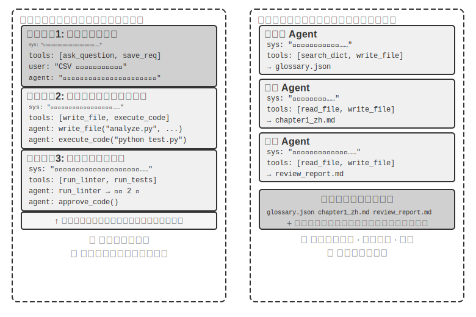


明確にしておくべきなのは、どちらのアーキテクチャも本物のマルチ Agent システムだということです（各段階のシステムプロンプトとツールセットが異なる以上、それは異なる Agent だからです）。違いは協調方式にあります。**コンテキスト共有**は暗黙的な協調に依存します。後続の Agent が前の Agent の完全なコンテキスト履歴を継承し、それ以前の思考過程を「見る」ことができ、情報はコンテキストそのものを通じて伝わります。**コンテキスト非共有**は明示的な協調に依存します。Agent 間はファイル、メッセージ、あるいは構造化データインターフェースを通じて情報を交換し、各 Agent は自分に関連する内容だけを見ます。

たとえて言えば、前者は一つのテーブルを囲んで議論するチームに近く、全員がすべての発言を耳にします。後者は異なる部署がメールと文書を通じて協業するのに近く、各自が自分の作業空間を持っています。

表10-1 はサブタスク数、コンテキストウィンドウ、並列度、情報隔離、コスト予算という 5 つの観点から 2 つのアーキテクチャの選択根拠をまとめたもので、初期のアーキテクチャ選定のチェックリストとして使えます。

表10-1 コンテキスト共有と非共有の選択根拠

| 選択根拠 | コンテキスト共有 | コンテキスト非共有 |
|----------|-------------------------------------|------------------------------------------------|
| サブタスク数 | 少ない（2〜3 の役割） | 多い（並列処理が必要） |
| コンテキストウィンドウ | すべての役割の情報を収められる | 単一ウィンドウに収まらない |
| 並列度 | 直列が主体（役割が同一の軌跡に沿って順にバトンを渡す） | 大規模に並列化可能（コンテキストが互いに独立し、ブロックし合わない） |
| 情報隔離 | 不要（すべての役割が情報を共有） | 必要（セキュリティ審査は元の思考過程を見るべきではない、など） |
| コスト予算 | 一本の軌跡でリレー、token は段階に応じて累積 | 複数 Agent が各自展開、総 token は通常数倍から一桁多い |

**簡単な判断**：累積コンテキストがウィンドウの 50%（これは経験則であって正確な閾値ではありません）を超えると予想されるなら、非共有にすべきです。情報のゼロ損失がタスクの正確性にとって必須の制約なら、共有にすべきです。多くの実際のシステムは「段階切り替え式」の方式を採ります。最初のいくつかの Agent は共有し、情報が飽和点に達したところで、非共有コンテキスト＋明示的な handoff（移譲、すなわち上流の Agent が主体的にどの情報を下流に引き継ぐかを決めること）へと切り替えます。

### 次元二：協調トポロジー

2 つ目の次元は協調トポロジーです。Agent 間で制御権と情報がどのような構造で流れるか、ということです。協調トポロジーとコンテキストを共有するかどうかは、**概念上は独立、実践上は関連**しています。概念上独立だというのは、コンテキストを共有するシステムにもトポロジーが存在するからです。たとえば本章で後ほど紹介する `transfer_to_agent`（実験 10-2）は、本質的には共有コンテキスト下での連鎖的な移譲（handoff）の一形態です。実践上関連するというのは、いったんコンテキストを共有すると、トポロジーがしばしば退化してしまう（後述）からで、2 つの次元の取りうる値は自由に組み合わせられるわけではありません。ただコンテキストを共有するときは、移譲にあたって「何を伝えるか」を決める必要がありません。完全な履歴が本質的に保持されるからです。そのためトポロジーは通常、役割が切り替わっていく一本の系列へと退化し、アーキテクチャ上の意思決定の余地はあまり残りません（両者の中間にある例外は group chat 式の多者協調で、本章後半の去中心化の節を参照）。ところがいったんコンテキスト非共有を選ぶと、「情報がどう流れるか、誰が協調するか」が、明示的に設計しなければならない問題になります。

言い換えれば、この 2 つの次元は原理的には 2×3 の組み合わせ行列（共有／非共有 × 3 種類のトポロジー）を構成しますが、コンテキスト共有のこの行では、トポロジーはたいてい役割の切り替え系列へと退化し、アーキテクチャ上の意思決定の余地はあまりありません（これがまさに後述の「多段階役割転換」で論じる形態です）。そのため本章はコンテキスト非共有の 3 マスだけを詳しく展開します。以下で紹介するのは、コンテキスト非共有のときの協調トポロジーの 3 つの典型的な形態で、複雑さの順に並べています。

- **対等協調パターン**（Peer Collaboration Pattern）：少数の Agent（通常 2〜3 個）が対等な身分で相互作用し、反復的な改善ループを形成します。論文を書くときに一人が草稿を作り、もう一人が注釈をつけて修正し、何ラウンドか繰り返すうちに品質が一人で黙々と書くよりはるかに高くなるのと同じです。
- **管理者パターン**（Orchestration Pattern）：中心化された Manager Agent がタスクの計画と調度を担い、複数のサブ Agent がそれぞれ特定のサブタスクを担当します。プロジェクトマネージャーが何人かの専門エンジニアを率いてプロジェクトを進めるのと同じです。
- **去中心化パターン**（Decentralized Pattern）：実行時の中心的な制御者が存在せず、Agent 同士が人間のように互いにコミュニケーションを取り、協調してタスクを完成させます。

各パターンの詳細な設計と適用場面については、後の専門の小節で展開して論じます。

## マルチ Agent が本当に単一 Agent に勝るのはいつか

具体的な協調アーキテクチャに入る前に、まずより根本的な問いに答えておきます。**どんなときに本当に複数の Agent が必要で、どんなときは 1 つの Agent で十分なのか？** この問いの答えは、後述のあらゆるエンジニアリング方針の全体的な参照点になります。近年の一連の研究は明確な判断枠組みを与えています。中核の判定基準はただ一つ。**協調の過程が、単一 Agent が生成時には得られない新しい情報を導入しているか？**

表10-2 は、異なる協調パターンが新しい情報を導入するかどうかをまとめたもので、マルチ Agent 協調が単一 Agent に対して実質的な価値を持つかを判断するのに使えます。

表10-2 マルチ Agent 協調パターンの情報増分の対比

| 協調パターン | 新しい情報を導入するか | 効果 |
|---|---|---|
| 同一モデルの自己審査（自分の出力を読み返す） | 否 | 通常は無効、むしろ有害 |
| 異なる Agent が同一のテキストを議論する | 否 | 同等の計算量では単一 Agent と同水準 |
| Reviewer がテスト実行結果を使ってコードを審査 | 是（実行フィードバック） | 顕著に向上 |
| Reviewer がレンダリング後のスクリーンショットでフロントエンド／PPT コードを審査 | 是（視覚フィードバック） | 顕著に向上 |
| Reviewer が外部ツールを使って事実を検証 | 是（ツールフィードバック） | 顕著に向上 |

2025 年の RLEF（Reinforcement Learning from Execution Feedback）[^rlef-2025] はこれを裏付けました。強化学習によってモデルにコード実行フィードバックを利用して反復的にコードを改善させると、その効果はモデルに独立して何度もサンプリングさせるよりはるかに優れていました。鍵は、反復のたびに**本物の実行結果**（コンパイルエラー、テスト失敗、ランタイム例外）が導入されることにあります。これらの情報はモデルがコードを書く時点では存在しません。2025 年の WebGen-Agent [^webgen-agent-2025] は Web ページ生成タスクにおいて、多層的な視覚フィードバック（スクリーンショット＋視覚言語モデルの記述）から成るフィードバックの足場を通じて、報告によれば Claude 3.5 Sonnet の当該ベンチマークでの成績を 26.4% から 51.9% へ、ほぼ倍増させました。

[^rlef-2025]: Gehring, J., et al. *RLEF: Grounding Code LLMs in Execution Feedback with Reinforcement Learning.* arXiv:2410.02089, 2025.
[^webgen-agent-2025]: Lu, Z., et al. *WebGen-Agent: Enhancing Interactive Website Generation with Multi-Level Feedback and Step-Level Reinforcement Learning.* arXiv:2509.22644, 2025.

この「新しい情報」という枠組みは、一見矛盾した現象を説明します。学術研究は「単一 Agent で十分」と言うのに、エンジニアリング実践ではマルチ Agent の方が確かに効果が高い、という矛盾です。矛盾の根源は、両者が論じているのが異なる種類の「マルチ Agent」だという点にあります。学術研究で比較されるのは多くが「複数の Agent が同一のテキストを見ながら互いに議論する」パターン（辯論など）ですが、エンジニアリング実践で有効なマルチ Agent システムは往々にして外部フィードバックのループ（コード実行、視覚レンダリング、ツール呼び出し）を含みます。前者は新しい情報を導入しておらず、後者は導入しています。本章の後半で紹介する対等協調、管理者、去中心化という 3 つのアーキテクチャは、本当に有効な使い方であれば、ほぼすべてこの判定基準の上に着地点を見つけられます。

**ステップ予算と Agent の性能。** 関連する研究方向の一つはこうです。Agent に異なるステップ予算（すなわち許容されるツール呼び出し回数や反復ラウンド数）を割り当てると、その表現にどう影響するか？ 直感的には、ステップが多いほど良い結果をもたらすはずです。30 ステップの予算では Agent は中核機能を素早く実装することしかできませんが、300 ステップの予算があれば、まず計画を立て、次に実装し、テストし、改善することもできます。しかし 2025 年の Google の論文『Budget-Aware Tool-Use Enables Effective Agent Scaling』は反直感的な結論を発見しました。**Agent が使えるステップ数を単純に増やしても、性能向上は保証されない**のです。標準的な Agent には「予算意識」が欠けており、たとえ 300 ステップの予算があっても、依然として浅い探索を実行する傾向があり、すぐに「飽和」してしまいます。より多くのステップを本当により良い結果へと転化させるには、Agent には残りのリソースに応じて動的に戦略を調整する明示的な予算感知メカニズムが必要です。前半は幅広く探索し、後半は最も有望な方向に集中する、というように。2026 年の BAVT（Budget-Aware Value Tree Search）はさらにステップレベルの価値評価を提案し、各ステップで残り予算の割合に応じて探索と活用の重みを調整します。予算が減るにつれ、Agent は「広く網を張る」から次第に「深く掘る」へと切り替わっていきます。

これらの発見は、マルチ Agent システムの設計に直接的な指導的意義を持ちます。たとえば管理者パターンにおいて、Manager Agent は単にタスクをサブ Agent に配ってから結果を待つのではなく、タスクの複雑さに応じて**ステップ予算を動的に割り当てる**べきです。単純なサブタスクには少ないステップを、複雑なサブタスクには十分なステップを。同時に、サブ Agent がこれらの予算を合理的に活用する（まず計画、次に実装、テスト、改善）よう導き、いきなり突っ込んで手を動かし始めることのないようにする必要があります。

さらにもう一つ、あらゆる設計の前に据えておかねばならないことがあります。**コスト**です。マルチ Agent の並列探索と反復はいずれもお金がかかります。Anthropic はかつて、そのマルチ Agent 研究システムの token 消費が通常の対話の約 15 倍であり、token 使用量そのものが性能差の約 80% を説明できると明かしました。これは、マルチ Agent の効果的な便益が、数倍から一桁にも及ぶ追加コストをカバーできるほど十分に大きくなければならないことを意味します。さもなければ、うまく調整された単一 Agent の方が往々にして割の良い選択になります。

## コンテキスト共有のマルチ Agent 協調

コンテキスト共有のマルチ Agent 協調では、各段階が独立した Agent（自身のシステムプロンプトとツールセットを持つ）でありながら、前の Agent の完全な軌跡を継承します。引き継ぎで入った同僚が、前任者が残したすべての業務日誌を読めるのと同じです。この「継承式協調」の中核的な強みは情報のゼロ損失にあり、各 Agent はそれ以前のどの段階の細部でも振り返ることができます。課題は、いかに現在の Agent を自身の中核的な職責に集中させ、継承した大量の履歴情報に惑わされないようにするかにあります。

### 多段階役割転換

まず定義をめぐる論点を明るみに出しておきましょう。第 1 章の言葉で言えば、多段階役割転換は**ワークフロー式のオーケストレーション**です。実行経路（たとえば要件明確化→実装→審査）があらかじめ定義されています。本章がこれをマルチ Agent の枠組みの下で改めて捉え直すのは、Agent の身分とコンテキストの観点からです。各段階のシステムプロンプト、ツールセット、関心事がいずれも異なるとき、それらを同一の軌跡を共有する複数の Agent と見なすことは、実際の設計上の便益をもたらします。各「身分」のプロンプトとツールセットを独立して磨き上げることができ、段階の境界が自然と品質のゲート点にもなるのです。

複雑なタスクでは、Agent の役割と職責が異なる段階で著しく変化することがあります。もし終始同一の静的なシステムプロンプトを使えば、あまりに大まかで的を絞れないか、あるいはすべての段階の指示を一緒くたに詰め込んで冗長になりすぎるかのどちらかになります。多段階役割転換のやり方はこうです。現在の段階に応じてシステムプロンプトとツールセットを動的に切り替え、Agent が各段階で最も適した「身分」で働けるようにするのです。この転換は新しいインスタンスを作ったり新しいプロセスを起動したりする必要はなく、同一の実行セッションの中でコンテキストを更新するだけです。鍵は、役割が切り替わっても対話履歴とタスク状態は終始連続して共有される点にあります。Agent は新しい役割の下でも、それ以前の段階で蓄積したすべての情報にアクセスできます。


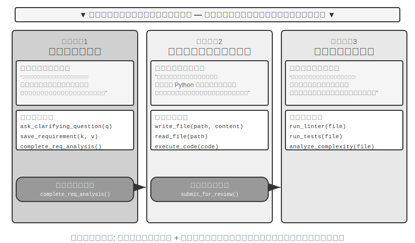


> **実験 10-1 ★★：実行段階に応じてシステムプロンプトを決める**
>
> 本実験は、ある Coding Agent の完全なワークフローを通じて、段階化されたシステムプロンプトがいかに Agent の表現を高めるかを示します。
>
> **タスク場面**：ユーザーがソフトウェア開発の要件を提示し、Agent は順に 3 つの段階を経ます。要件明確化、コード実装、品質審査です。
>
> **第一段階：要件明確化**（役割：要件アナリスト）
>
> システムプロンプトが強調するのは：
> - 「あなたの職責は、ユーザーの要件を十分に理解することです。曖昧なところは質問を投げかけて明確化し、ユーザーが期待する機能・利用場面・性能要件を完全に理解できるようにしてください。」
> - 「実装を急がないでください。この段階では、あなたのタスクは質問と確認であって、コードを書くことではありません。」
> - 「すべての鍵となる要件が明確になったと確認できたら、`complete_requirements_analysis()` ツールを呼び出してこの段階を終えてください。」
>
> ツールセットは限られています。`ask_clarifying_question(question)` はユーザーに明確化のための質問をするために、`save_requirement(key, value)` は確認済みの要件項目を記録するために、`complete_requirements_analysis()` は段階の完了を示すために使います。
>
> Agent はユーザーと複数ラウンドの対話を展開します。「このスクリプトはどんな種類のファイルを処理する必要がありますか？」「サブフォルダを再帰的に処理しますか？」「ファイルを移動したあと、元のファイル名を保持しますか？」こうした質問を通じて、Agent は徐々に完全な要件理解を築き上げ、構造化して保存します。要件が十分に明確になったと Agent が判断したら、`complete_requirements_analysis()` を呼び出して役割転換をトリガーします。システムは段階完了の信号を検知し、自動的に次の段階の設定へと切り替えます。
>
> **第二段階：コード実装**（役割：ソフトウェアエンジニア）
>
> 新しいシステムプロンプトが強調するのは：
> - 「あなたの職責は、確認済みの要件に基づいて高品質な Python コードを書くことです。」
> - 「ベストプラクティスに従ってください。コードはモジュール化され、適切なエラーハンドリングを持ち、必要なコメントを含むべきです。」
> - 「コードの記述を終え、基本的なテストを通したら、`submit_for_review()` を呼び出して審査段階に入ってください。」
>
> ツールセットは著しく変化します。それまでの要件明確化ツールは取り除かれ、代わりに `write_file(path, content)`、`read_file(path)`、`execute_code(code)` などの開発ツールが入ります。Agent は第一段階で保存した要件に基づいてコードを書き始めます。まず主要なロジックを書き、次にエラーハンドリングを加え、最後にテストを書いて検証します。この過程を通じて Agent は依然として第一段階の対話履歴にアクセスして要件の細部を振り返ることができますが、行動パターンはもはや一変しています。もう質問はせず、実装に集中します。完了したら `submit_for_review()` を呼び出します。
>
> **第三段階：コード審査**（役割：コードレビュアー）
>
> 新しいシステムプロンプトが強調するのは：
> - 「あなたの職責は、たった今書かれたコードを審査し、機能の正しさ・コード規約・エラーハンドリング・性能最適化・セキュリティという複数の観点からその品質を評価することです。」
> - 「批判的思考を用い、コードに存在しうる問題と改善の余地を見つけ出そうとしてください。」
> - 「重大な問題を発見したら `request_revision(issues)` を呼び出して実装段階に戻して修正させ、品質が受け入れ可能なら `approve_code()` を呼び出してタスクを完了してください。」
>
> ツールセットは再び変化し、`run_linter(file)`、`run_tests(file)`、`analyze_complexity(file)` などのコード品質分析ツールに置き換わります。Agent は審査者の視点でコードを見直し、静的解析を実行し、潜在的なバグ・性能問題・セキュリティ上の隠れたリスクを洗い出します。
>
> この三段階設計により、Agent は各段階で当面の中核タスクに集中できます。さらに重要なのは、明確な段階転換メカニズムがタスク実行の完全性を保証することです。Agent は要件分析を飛ばしていきなりコードを書くこともなければ、審査を経ないまま成果を引き渡すこともありません。
>
> **実験の要件**：
> 1. 三段階のシステムプロンプトを実装し、各段階に明確な役割定義と行動指針を持たせる
> 2. 各段階にマッチしたツールセットを設定する
> 3. 段階転換のトリガーメカニズム（特定のツール呼び出しによる）を実装する
> 4. 段階間でのコンテキストの連続性を確保する
> 5. 差し戻しの状況に対処する。コード審査で問題が見つかったときに実装段階へ戻せるようにする
> 6. 各段階の実行ログを記録し、異なるプロンプトがいかに異なる行動パターンを生むかを示す
>
### 領域横断の役割転換

先ほどの多段階役割転換が示したのは、単一のタスク種別（ソフトウェア開発）における段階化された実行でした。領域横断の役割転換は、さらに一歩進んで、複数のタスク種別の間での Agent の自律的な切り替えを探ります。もはやあらかじめ計画された線形のフローではなく、ユーザーの要件の変化に応じて、どの専門役割に切り替えるべきかを Agent が自律的に判断するのです。

> **実験 10-2 ★★：複数役割の転換**
>
> **前提要件**：先に第 2 章の Agent Skills メカニズムを理解しておくことを推奨します。
>
> **システムアーキテクチャ**：5 種類の役割——
>
> - **triage（フロント受付・トリアージ、デフォルトの入口）**：ユーザーの全体的な要件を理解し、それを先後関係のあるサブタスクに分解し、適切な専門役割へ順に移譲し、すべてのサブタスクが完了したら締めくくりの確認を行います。自身に専門ツールはなく、transfer だけを持ちます
> - **research（情報検索の専門家）**：`web_search` を使ってデータ・事実・資料を探します
> - **coding（プログラミングの専門家）**：`execute_python` を使ってコードを書き実行し、プログラムのロジックやスクリプト類の問題を解決します
> - **data_analysis（データ分析の専門家）**：`calculate` / `descriptive_stats` を使って定量的な計算と統計（前年同期比成長率、年平均複合成長率 CAGR、平均値など）を行います
> - **writing（執筆の専門家）**：検索したデータと計算結論を、指定された読者に向けた通りの良い成稿に磨き上げます（`count_characters` で分量をざっと確認できます）
>
> **中核メカニズム：transfer_to_agent ツール**
>
> すべての役割に `transfer_to_agent(target_role, reason)` ツールが備わっています。呼び出すとシステムは順に、1）現在の対話履歴を保存し、2）目標役割のプロンプトとツールセットをロードし、3）対話履歴を新しい役割に渡してコンテキストを理解させ、4）新しい役割の身分で実行を続けます。
>
> **実験場面**：システムはデフォルトで triage（フロント受付・トリアージ）の身分で動きます。ユーザーが領域横断の複合タスクを投げかけます。「投資家向けの資料を準備しているのですが、中国の 2021、2022、2023 の 3 年間の新エネルギー車の販売台数を調べて、この 3 年の年平均複合成長率を計算し、さらに投資家向けの 120 字以内の中国語のまとめを書いてください。」triage はこれを「データを調べる → 指標を計算する → 成稿にする」に分解し、第一歩としてまず検索に移譲します。
>
> ```python
> transfer_to_agent(target_role="research", reason="需要先查三年的新能源汽车销量数据")
> ```
>
> research は `web_search` で販売台数を調べたあと、鍵となるデータを対話に書き込み、データ分析に移譲します。
>
> ```python
> transfer_to_agent(target_role="data_analysis", reason="数据已就绪，需要计算三年 CAGR")
> ```
>
> data_analysis は `calculate` で成長率を計算し、writing に移譲して文章にします。writing は書き上げたあと triage に移譲し直して締めくくりの確認をします。経路全体は triage → research → data_analysis → writing → triage で、各役割はすべて完全な対話履歴を見られるため、後の役割は前の役割が何をしたかを自然と把握しています。
>
> 役割転換の意思決定はシステムプロンプトの指針に依存します。triage のプロンプトにはルーティング規則が明示的に列挙されています。データや資料を調べるなら research へ、コードを書いて実行するなら coding へ、定量的な計算と統計なら data_analysis へ、成稿に磨くなら writing へ。判断基準はごく単純です。タスクが特定領域の深い知識や専門ツールを必要とするなら、対応する専門役割へ移譲します。専門役割のプロンプトにも同様に、自分の担当部分を終えたら誰に移譲するか、あるいは triage に戻すかが指針として書かれています。
>
> **実験の要件**：
> 1. 少なくとも 3 種類の専門役割のシステムプロンプトと専用ツールセットを実装する
> 2. `transfer_to_agent` ツールを実装し、動的な切り替えをサポートする
> 3. 役割切り替え後のコンテキストの連続性を確保する
> 4. 循環的な切り替えの問題に対処する。Agent が役割間で行ったり来たり繰り返し切り替えるのを避ける
> 5. 複数の領域にまたがる複雑なタスクフローを設計し、役割転換の価値を示す
>
## コンテキスト非共有のマルチ Agent 協調

コンテキスト非共有は本物のマルチ Agent 協調を代表します。このアーキテクチャの下では、各 Agent は独立した実体であり、自身のコンテキスト・軌跡・状態を持ちます。Agent 同士は互いの「内心の活動」に直接アクセスできず、協調は完全に明確な構造化されたデータ受け渡しのメカニズム、すなわち本章冒頭で紹介した 3 種類の通信メカニズム（ツール呼び出しの引数、共有ファイルシステム、メッセージバス）に依存します。

この隔離はいくつかの実際的なエンジニアリング上の利点をもたらします。各 Agent を独立して開発・テストでき、能力の追加に既存コードの変更が不要で、ある Agent が故障しても誤った状態を他の Agent に感染させることがなく、しかも複数の Agent が真に並行実行できます。コンテキストが完全に独立しているため、リソースの競合が存在しないのです。

しかしコンテキスト非共有には代償もあります。最も明白なのは情報同期の問題です。各 Agent はどうやってタスク状態について一致した理解を保つのか？ 情報は受け渡しの過程で失われたり重複したりしないか？ デバッグもいっそう難しくなります。問題が起きたら複数の Agent のログを見比べて、初めて完全な実行過程を組み立てられます。これらの問題により、インターフェース仕様・データ形式・通信プロトコルの設計がきわめて重要になります。

コンテキスト非共有の明示的協調は、トポロジーに依存しない 2 つのインフラに依存します。一つは**共有ファイルシステム**で、Agent 間で生成物を交換し、ユーザーとファイルを交換する永続的な媒体として、協調のデータプレーンを構成します。もう一つは**通信・制御メカニズム**で、Agent 間のメッセージ受け渡し・状態照会・実行終了をサポートし、協調のコントロールプレーンを構成します。以下の 3 種類のトポロジーはいずれもこの 2 つの上に築かれます。

### Agent から見たファイルシステム

本章の冒頭では「共有ファイルシステム」をコンテキスト非共有の 3 種類の通信メカニズムの一つに挙げました。実際のシステムでは、Agent がアクセスするのは単一のストレージではなく、**仮想ファイルシステム**（virtual filesystem）です。出所・ライフサイクル・権限がそれぞれ異なるストレージが同一のディレクトリツリーの下にマウント（mount）され、Agent は統一された `read_file`/`write_file`/`list_dir` インターフェースを通じてアクセスし、その下層はローカルの一時ディスク、永続的なオブジェクトストレージ、サードパーティのクラウドストレージの API、あるいは読み取り専用のシステムリソースパックだったりします。このディレクトリツリーの構成——各領域の可視性とライフサイクル——を明確にすることは、マルチ Agent 協調設計の前提です。相当な割合の並行競合と情報漏洩は、本来隔離すべき領域を混在させたことに由来します。成熟したマルチ Agent システムでは、そのファイルシステムは通常、以下の 4 種類の領域から構成されます。

**一、Agent 専用ワークスペース（Scratchpad）**。各 Agent インスタンスが専有する私的ディレクトリで、中間生成物・一時ファイル・下書き・デバッグログを置きます。ライフサイクルはインスタンスに紐づき、他の Agent やユーザーには不可視です。scratchpad を隔離することには二重の役割があります。複数の Agent の一時ファイルが互いに上書きし合うのを避けること、そしてメイン Agent のコンテキストを簡潔に保つことです。サブ Agent の試行錯誤の過程は自身のワークスペースに残し、最終生成物だけを共有空間に提出します。これは第 4 章「サブ Agent は全量の軌跡ではなく構造化された要約を返す」のストレージ層における体現に対応します。

**二、マルチ Agent 共有空間（Shared Workspace）**。複数の Agent が共同で読み書きし、かつ**ユーザーに可視**な協調領域で、コンテキスト非共有アーキテクチャの下で Agent 間が生成物を交換する主要な媒体です。Glossary Agent が用語表を書き込み、Translation Agent がそこから読み取ります。ユーザーもここで元ファイルをアップロードし、最終成果物をダウンロードできます。そのライフサイクルはタスク全体に紐づき、永続化が必要です。多者が並行して読み書きする領域として、並行競合が多発する箇所であり、楽観ロックやワーキングコピー隔離（worktree）などのメカニズムはいずれもここに作用します。詳しくは本章後半の「失敗モード一」を参照してください。第 4 章でボリュームマウント `/workspace/shared` によってメイン Agent・仮想パソコン・仮想スマホをつないだのが、まさにこの層の典型的な実装です。

**三、外部マウントリソース（Mounted External Resources）**。ユーザーが認可して接続したサードパーティの情報源——Google Drive、Notion、Dropbox、企業 Wiki など——を、アダプター（adapter）を通じてファイルシステム内のマウントポイント（`/mnt/gdrive` など）にマッピングします。Agent は Notion 文書一篇をファイルを読む形でアクセスし、下層ではアダプターが相手の API を呼び出して処理します。この層がローカルストレージと異なる 3 つの特性は、設計時に明示的に扱う必要があります。**アクセスが外部権限に制約される**（ユーザーが源システムで持つ権限が Agent の可視範囲を決める）、**遅延がより大きく整合性がより弱い**（読み取りごとに 1 回のネットワーク往復であり、データはすでに外部で変更されている可能性がある）、**オンデマンドの読み取り専用が主体**（外部源への書き戻しは慎重を要し、誤った書き込みはユーザーの実データを汚染しかねない）。統一されたファイルインターフェースにより Agent は各データソースごとに専用ツールをあつらえる必要がなくなりますが、同時に上述の性能とセキュリティの差異を覆い隠してしまうため、マウント層で読み取り専用／書き込み可能、タイムアウト、認証情報の境界を明示的に管理する必要があります。

**四、システム組み込みリソース（Built-in System Resources）**。システムが事前配置し、すべての Agent に対して読み取り専用で共有されるリソースパックで、典型的な代表は第 2 章・第 4 章で紹介した **Skills** です。ファイルの形で組織された知識文書とスクリプトで、`/skills` などのパスにマウントされ、漸進的開示（まずインデックス、次にオンデマンドで展開）で取り出されます。ほかに参考マニュアル、テンプレートライブラリ、共有ツール定義も含まれます。この層はグローバルに共有され、読み取り専用で、セッションをまたいで安定しており、すべての Agent が並行制御なしに並行して読み取れます。

図10-3 は、これら 4 種類の領域が同一のディレクトリツリーに統一的にマウントされる構造を示しています。Agent は統一インターフェースを通じてツリー全体にアクセスし、ユーザーは共有空間からファイルをアップロード・ダウンロードし、外部データソースはアダプター経由でマウントされ、システム組み込みリソースは読み取り専用で提供されます。


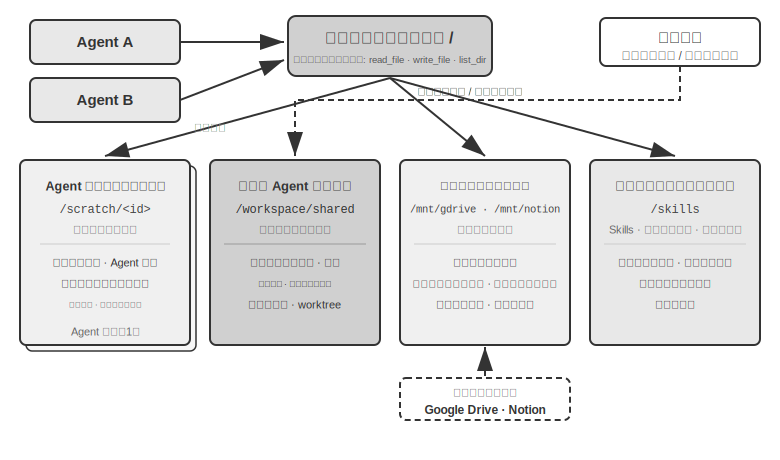


表10-3 は可視性、ライフサイクル、読み書き権限、並行制御という 4 つの次元からこの 4 種類の領域を対比したもので、ファイルシステムのレイアウト設計のチェックリストとして使えます。

表10-3 Agent 仮想ファイルシステムの 4 種類の領域

| 領域 | 可視性 | ライフサイクル | 読み書き | 並行制御 |
|----------------|--------------------|-------------------|-----------------|------------------------|
| Agent 専用ワークスペース | その Agent のみ | Agent インスタンスとともに破棄 | 読み書き | 不要（私的） |
| マルチ Agent 共有空間 | すべての協調 Agent + ユーザー | タスク継続中、要永続化 | 読み書き | 必要（楽観ロック / worktree） |
| 外部マウントリソース | 外部認可による | 外部源が決定 | 多くは読み取り専用、書き込みは慎重に | 外部源が担当 |
| システム組み込みリソース | すべての Agent | セッションをまたいで安定 | 読み取り専用 | 不要（読み取り専用） |

4 種類の領域を同一のディレクトリツリーに統一することこそ、「**ファイルパスを汎用インターフェースとする**」というこの設計の価値の所在です。Agent 間で生成物を受け渡し、メイン Agent がサブ Agent に入力を引き継ぎ、さらには組織をまたぐ A2A 協調で Artifact を交換する際、受け渡されるのはいずれも軽量なパス文字列であって、内容をコンテキストウィンドウに読み込むわけではありません（第 4 章）。これは第 5 章「ファイルシステムを Agent の中枢とする」と一脈相通じます。後者は単一 Agent がいかにファイルシステムで記憶と能力を担うかを論じましたが、ここでは同じ抽象をマルチ Agent へ拡張しています。私的・共有・外部・組み込みの 4 種類のストレージをマウントした仮想ディレクトリツリー、それがマルチ Agent 協調のストレージの土台です。

### Agent 間の通信と制御

ファイルシステムは Agent 間の**生成物交換**の問題を解決しますが、協調にはもう一つ**コントロールプレーン**が必要です。Agent 間のメッセージ受け渡し・状態照会・実行終了をサポートするものです。第 4 章ではすでにこのプレーンのツールのプリミティブ——作成（`spawn_subagent`）、メッセージ送信（`send_message_to_subagent`）、キャンセル（`cancel_subagent`）——および同期／非同期／ストリーミング／マルチターンの 4 種類の協調形態を示しました。本節はインターフェース定義を繰り返さず、マルチ Agent 協調が依存しながらもしばしば見過ごされる 3 つの能力に焦点を当てます。

**一、メッセージ受け渡し。** 最も単純な形態はポイントツーポイントです。Agent A が直接 `send_message_to_agent_b(content)` を呼び出すもので、トポロジーが固定で Agent 数が少ない場面（本章の実験 10-4 の電話＋パソコンの 2 Agent など）に適します。Agent 数が増え、非同期並列が必要になると、ポイントツーポイントの接続数は Agent 数に対して二乗で増え、しかも送受信の双方が同時にオンラインであることを要します。このときは**メッセージバス**に切り替えるべきです（本章後半の「並列協調形態」を参照）。Agent はメッセージをバスに発行し、バスが購読関係に従って転送するので、送信側は消費者を知る必要がありません。ポイントツーポイントであれバス経由であれ、メッセージは通常、構造化された**エンベロープ**（envelope）を携えるべきです。送信者 ID、宛先（指定 Agent かブロードキャストか）、メッセージ種別（`task_assigned`/`status_update`/`result`/`terminate` など）、および JSON ペイロードです。統一されたエンベロープ形式は、受信側が確実にルーティング・解析できることを保証し、協調経路を追跡可能にします。これはマルチ Agent システムのデバッグの鍵です。

**二、状態照会。** これはコントロールプレーンで最も過小評価されがちな一環です。メイン Agent がサブ Agent を送り出したあと、その進捗を知る術がなければ、待ち続けるべきか判断することも、ブロックしたときに適時介入することもできません。状態取得には 2 つのパラダイムがあります。**プル（pull）**：メイン Agent が `get_subagent_status(agent_id)` を呼び出し、サブ Agent の現在の状態（実行中／入力待ち／完了済み／失敗）、進捗、直近の活動時刻を返します。**プッシュ（push）**：サブ Agent が実行中に主体的にメッセージバスへ状態更新を報告し、メイン Agent がタスク状態表を維持してリアルタイムに更新します（本章の実験 10-6 の「リアルタイム監視」がこのパラダイムです）。両者には各々トレードオフがあります。プルは実装が単純ですが、ポーリングが密すぎると token を浪費し、疎すぎると適時性を欠きます。プッシュはリアルタイム性が良い一方、サブ Agent が自発的に報告することに依存します。エンジニアリング上はしばしばサブ Agent の状態を**状態機械**（提出済み、実行中、入力必要、完了済み、失敗）としてモデル化します。本章後半の A2A プロトコルは、まさにタスクのライフサイクルをこの種の状態へと標準化しています。加えて、**タイムアウトとハートビート検知**を最後の砦として用意する必要があります（第 4 章の Heartbeat と monitor_shell に呼応）。たとえサブ Agent が報告も返答もしなくとも、メイン Agent は「N 分を超えて活動がなければ失敗と判定する」に従って、ブロックしたサブ Agent にシステムが足を引っ張られるのを避けられます。

**三、実行終了。** 並列協調ではしばしば「一者が成功し、他者は無効になる」状況が生じます。複数の Agent が手分けして探索し、一者が目標に命中したら残りは直ちに停止すべきです（本章の実験 10-6 のカスケード終了）。終了には 2 つの強度があります。**優雅な終了（graceful）**が第一選択です。メイン Agent が `terminate` 信号を発し、サブ Agent が現在のステップの安全点で応答し、まずリソースを片づけ（ブラウザセッションを閉じる、未完了ファイルを書き込む、ロックを解放する）、確認（ack）を返してから終了します。**強制終了（forced）**は最後の砦です。プロセスを直接終了させるもので、サブ Agent が優雅な信号に無応答のときにのみ使い、その代償として宙ぶらりんのリソースや未完了の書き込みを残しうることです。2 つのエンジニアリング上の要点を扱う必要があります。第一に、優雅な終了はサブ Agent がループの中で定期的に終了信号をチェックすること（第 4 章の中断メカニズムに類似）を要し、さもなければ信号は応答されようがありません。第二に、カスケード終了には競合が存在します。複数のサブ Agent がほぼ同時に成功を報告しうるため、メイン Agent はロックまたは冪等な設計で、清算を一度だけ、終了のブロードキャストを一巡だけ行うことを保証しなければなりません。詳しくは本章の実験 10-6 の競合状態に関する議論を参照してください。

生成物交換（データプレーン）と、メッセージ受け渡し・状態照会・実行終了（コントロールプレーン）が、ともにコンテキスト非共有のマルチ Agent システムを支えます。以下の 3 種類の協調トポロジーは、本質的にいずれもこの 2 つのプレーンの上で、制御権の帰属と情報の流れの向きについて異なる選択をしたものです。

Agent 間の協調関係と制御フローの特徴に応じて、コンテキスト非共有の協調は 3 種類の主要なアーキテクチャに分けられます。対等協調パターン、管理者パターン、去中心化パターンで、それぞれ異なる種類のタスクに適します。

### 対等協調パターン：相互チェックと反復改善

対等協調は通常 2〜3 個の対等な身分の Agent が関わり、複数ラウンドの反復を通じて互いにフィードバックを提供します。中核的な価値は認知的多様性を導入することにあります。異なる Agent が異なる角度から同じ問題を検討し、革新と堅牢の間でバランスを取り、どの単一 Agent よりも高品質な結果を生み出します。

管理者パターンや去中心化パターンと比べ、対等協調の実装の複雑さははるかに低く、2 つの Agent の役割・通信メカニズム・反復終了条件を定義するだけで動かせます。アイデアを素早く検証し、プロトタイプを構築するのに理想的な選択肢です。

対等協調の最も典型的な用途は、Agent の実践できわめてよく見られる一類の失敗を解決することです。**早すぎる終了**——仕事を半分やったところで止まってしまうことです。それには 3 つの典型的な形態があり、以下では Coding Agent と、筆者のチームが作り上げた Pine AI（引言で紹介した、ユーザーに代わって電話をかけ商家や通信事業者と交渉して用事を片づける Agent）でそれぞれいくつか例を挙げます。一つは**手抜き式の偽完成**です。一部だけやって全部やり終えたと宣言するもので、Coding Agent がコードを書き終え、テストも走らせず、デプロイも試さずに「タスク完了」と報告したり、ユーザーが Pine AI に 2 件頼んだのに、1 件目を片づけたら 2 件目を忘れて、そのまま「全部片づきました」と報告したりします。二つ目は**早すぎる諦め**です。一つの道が行き詰まったら事全体が成し得ないと宣言するもので、Pine AI が商家に連絡するのに電話・フォーム記入・メール送信など複数の手段があるのに、一本の電話を断られただけでユーザーに「これは無理です」と直接告げ、実は別のチャネルでもう一度試せば成功した可能性が高い、というものです。三つ目は**偽の成功**です。Agent は成し遂げたつもりでも、実際にはループが閉じ切っていないもので、電話口で相手が口頭で返金に同意したものの、ユーザーはまだスマホの App 上で一段階確認する必要があるのに、Agent は「済みました」と報告し、ユーザーはまだ後続の動作があると知らず、返金は実際には実現していない、というものです。3 つの形態はいずれも同じ根源を指しています。**検証の前では、「完了」はモデルの一言の宣言にすぎず、証明ではない**のです。

宣言を証明に変えること、それこそが第 1 章の進化の弧の末端にある **Loop 工程**（Loop Engineering）の課題です。Agent を絶えず回し続けるループを設計する——次にやるべきことを見つけ、実行し、検証し、進捗を記録する——モデル自身ではなく検証器によって「本当に止まってよいか」を判定させ、人間の役割は「Agent にプロンプトを書く操作者」から「ループを設計するエンジニア」へと変わります。この用語は 2026 年 6 月に Addy Osmani によってまとめ提示されました[^loop-engineering-2026]。Anthropic の Claude Code 責任者 Boris Cherny の言い方はもっと率直です。「私はもう Claude を直接 prompt していない。私の仕事は loop を書くことだ。」業界がこの議論の中で形成した中核的な共通認識はこうです。**ループのボトルネックは検証器にあって、モデルにはない**——検証が信頼できなければ、ループがどれだけ速く回っても、質の低い産出をより速く完了とマークするだけです。そして引言でも述べたように、実践が先、命名が後です。この用語が流行する前から、Pine AI を含むトップ Agent チームはとうに「ループ＋検証」で早すぎる終了の問題を解決していました。そして検証の最も効果的な組織方式こそ、以下で述べる提議者・審査者パラダイムです。

[^loop-engineering-2026]: Osmani, Addy. "Loop Engineering: Designing Loops that Prompt Coding Agents", 2026. https://addyosmani.com/blog/loop-engineering/

**提議者・審査者パラダイム。**


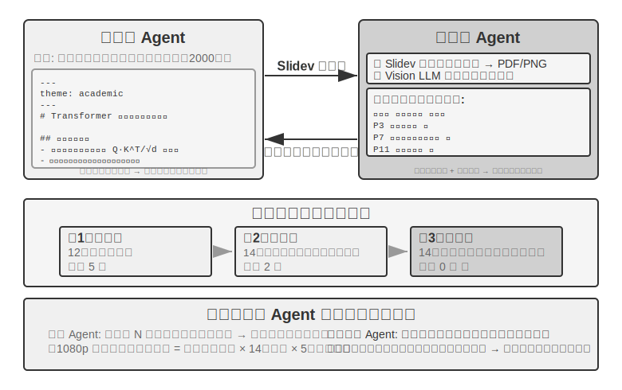


提議者・審査者は最も典型的な対等協調パラダイムです。第 5 章ではすでに PPT 生成、動画編集、ログ可視化という 3 つの実験で、このパラダイムの設計原則と実戦応用を詳しく紹介しました。Proposer Agent がコード生成を担い、Reviewer Agent がレンダリング実行結果を Vision LLM で品質評価して構造化された改善提案を出し、両者が効果が基準に達するまで反復します。

このパラダイムはセキュリティ審査（Proposer が操作案を生成し、Reviewer がコンプライアンスと潜在的リスクをチェックする）、コンテンツモデレーション（Proposer が返信を起草し、Reviewer が業務ルールと言葉遣いの規範をチェックする）、コード審査（Proposer がコードを書き、Reviewer がセキュリティとベストプラクティスをチェックする）などの場面にも同様に適用できます。

**なぜ 1 つの Agent に自分で生成させて自分で審査させてはいけないのか？** これこそ先ほどの「マルチ Agent が本当に単一 Agent に勝るのはいつか」の節のあの判定基準の具体的な着地点です。審査が新しい情報を導入しないなら、それは「モデルにもう一度考えさせる」だけです。関連研究はこれに明確な答えを与えています。Huang らは ICLR 2024 の論文『Large Language Models Cannot Self-Correct Reasoning Yet』で、GPT-4 に外部フィードバックのない状況で自分の回答を審査・修正させると、正答率がかえって下がることを発見しました。モデルが正しい答えを誤りに変える回数が、誤った答えを正しく直す回数よりも多かったのです。

2024 年に TACL 誌に発表された総説論文『When Can LLMs Actually Correct Their Own Mistakes?』（arXiv:2406.01297）はこの結論をさらに裏付けました。信頼できる外部フィードバック（テストケースの実行結果、外部ツールの検証出力など）を与えない限り、純粋にモデル自身の「自己修正」に依存してもほとんど効果がない、というものです。

ICLR 2024 の CRITIC 論文は直感的な対比実験を提供しました。CRITIC はモデルに外部ツール（検索エンジン、Python インタプリタ）を使って自分の回答を検証させ、効果が顕著に向上しました。しかし実験者がツール検証のステップを取り除き、モデルの自己評価だけを残すと、大部分の向上は消えました。これは、審査の価値が「モデルにもう一度考えさせる」ことにあるのではなく、**モデルが生成時には持たない新しい情報を導入する**ことにある——テスト結果、レンダリング後のスクリーンショット、コンパイルエラー、外部検索結果——ことを示しています。

これこそが提議者・審査者パラダイムの中核的な設計原理です。第 5 章の PPT 生成実験では、Reviewer Agent の価値は「同じモデルでもう一度コードを見る」ことではなく、**PPT をレンダリングしてスクリーンショットを撮った**ことにあります。このスクリーンショットには、Proposer Agent がコード生成時にはまったく得られない視覚情報が含まれています。同様に、コード生成の場面では、テストケースを実行して生じる合格／不合格の結果もまた、コードを書く時点では存在しない新しいシグナルです。Reviewer の独立した価値は、まさにそれが Proposer には得られないこれらの外部フィードバックに触れられることに由来します。

Loop 工程の視点から見ると、業界がまとめたいくつかのループのスタイルは、いずれも本書に対応するものが見つかります。閉ループ＋人手による承認は、第 4 章の事前承認（人が最終審査者）に対応します。開ループ＋予算やラウンド数の上限は、第 5 章 PPT 生成の複数ラウンド反復（最大 5 ラウンド）に対応します。オーケストレーション型のサブ Agent は、次節の管理者パターンに対応します。言い換えれば、Loop 工程が記述しているのは新しいアーキテクチャではなく、これらの協調パターンを「ループ＋検証＋終了条件」というこの一つの枠組みの下に統一することです。そのうち検証を担うのが、まさにここでの提議者・審査者パラダイムなのです。

**発展：その他の対等協調パターン。**

**Debate（辯論）**：複数の Agent がそれぞれ異なる立場を持ち、敵対的な対話を通じて問題空間を深く探ります。たとえばある技術案を評価するとき、Agent A が「賛成者」を演じて案の利点と機会を列挙し、Agent B が「反対者」を演じてリスクと限界を指摘し、各ラウンドの辯論が相手の論点に対して反論や補足を提示します。単一 Agent が分析するとき、モデルは往々にしてある観点に傾き反対の証拠を見落としがちですが、辯論パターンは制度化された敵対を通じて、賛否両面がともに十分に論証されることを保証し、意思決定者がよりバランスの取れた判断を下すのを助けます。

ただし、辯論パターンの実際の効果は学術界でなお論争があります。2026 年の Tran と Kiela の研究 [^single-agent-2026] は、マルチホップ推論タスクで単一 Agent と 5 種類のマルチ Agent アーキテクチャ（逐次、辯論、アンサンブル、並列役割、サブタスク並列）を比較し、**思考 token 予算が厳密に同一に制御されたとき、単一 Agent の表現がマルチ Agent と同水準、あるいはそれ以上ですらある**（コンテキスト利用率がある程度まで削がれない限り）ことを発見しました。研究者は情報理論のデータ処理不等式に基づいて説明を与えています。辯論における複数の Agent が処理するのは完全に同一のテキスト情報であり、Agent 間で中間結論を直列に受け渡すたびに、情報は失われうるだけで、無から生み出されることはありえない、というものです。辯論パターンが一部の学術論文で示す便益は、複数の Agent がより多くの総計算量を消費したことに由来する可能性が高いのです。この論証の境界を明確に画す必要があります。それが対象とするのは「マルチ Agent が中間結論を直列に受け渡す」ことによる情報のボトルネックであって、別の一類のやり方——同じ問題を**複数回独立にサンプリングして集約する**（self-consistency、多数決など）、あるいは**生成と検証の難易度の非対称性**（答えを書くのは難しく、答えを検証するのは易しい）を利用して生成・検証の分業を行う——を否定するものではありません。これらの場面は、追加の独立サンプリングを導入しているか、タスク自体の非対称な構造を利用しているかのどちらかであり、いずれもデータ処理不等式の適用範囲には入りません。

[^single-agent-2026]: Tran, D., Kiela, D. *Single-Agent LLMs Outperform Multi-Agent Systems on Multi-Hop Reasoning Under Equal Thinking Token Budgets.* arXiv:2604.02460, 2026.

**Brainstorm（ブレインストーミング）**：複数の Agent が独立してアイデアを生成し、それから互いに共有し、啓発し合います。たとえば製品革新のタスクで、Agent 1 が「ソーシャル共有機能の追加」を提案し、Agent 2 が触発されて「ソーシャルネットワークへの共有だけでなく、パーソナライズされた共有ポスターの生成も」と提案し、Agent 3 が前二者を統合して「ユーザーがポスターテンプレートをカスタマイズしてテンプレート市場を形成する」と提案します。異なる Agent が異なる「思考の嗜好」（異なるプロンプトやモデルで実現）を持ち、互いに刺激し合うことでより広い解空間を探索し、単一 Agent では思いつきにくいアイデアの組み合わせを見つけます。

**Panel Discussion（専門家パネル）**：複数の Agent がそれぞれ一つの専門領域の視点を代表し、共同で学際的な問題を議論します。たとえば新製品の実現可能性を評価するとき、エンジニア Agent が技術的な角度から実装の難しさを分析し、プロダクト Agent がユーザー体験の角度から市場の魅力を評価し、運営 Agent がコストとリソースの角度から事業としての実現可能性を分析します。これらの Agent の間は敵対関係ではなく補完関係であり、共同で問題の全貌を組み立て、領域横断的な制約と機会を識別します。

### 管理者パターン：中心化された協調

タスクが 5 個以上のサブタスクを含む、動的な調度を要する、あるいはサブタスク間に複雑な依存が存在するとき、対等協調では手に負えなくなり、管理者パターンを導入する必要があります。Manager Agent の職責はプロジェクトマネージャーのようなものです。まず全体タスクを理解し、次に割り当て可能なサブタスクに分解し、実行に適した Agent を選び、進捗を追跡して異常を処理し（リトライ、Agent の交代、計画の調整）、最後に各 Agent の出力を最終結果へと統合します。

システム設計の角度から見ると、管理者パターンは各専門 Agent を Manager が呼び出せるツールとしてモデル化します。Manager のツールセットには、従来の外部ツール（検索、ファイル操作など）だけでなく、他の Agent の呼び出しインターフェースも含まれます。Manager はツール呼び出しのメカニズムを通じて対応する Agent を起動し、タスク引数と必要なコンテキストを渡し、完了を待って返り値を受け取ります。Manager の視点からは、ある Agent を呼び出すことと普通のツールを呼び出すことに本質的な違いはありません。いずれもリクエストを発し、レスポンスを得るのです。この統一された抽象は、管理者パターンに優れた拡張性を与えます。能力の追加は対応する Agent を開発してツールとして登録するだけで済み、Manager の中核ロジックを変更する必要はありません。同時に、それは本質的に異種性をサポートします。異なる Agent が異なるモデル・プロンプト・ツールセットを使い、さらには異なるハードウェア環境で動くことさえできます。

「Agent が互いにツールになる」という抽象は、第 4 章「協調ツール」の節ですでに確立されています。spawn_subagent / send_message / cancel_subagent のインターフェース設計、およびサブ Agent のコンテキスト準備の 4 種類の戦略（最小限の受け渡し、手動での選別、自動での切り詰め、LLM によるコンテキスト生成）は、いずれもここでの Manager によるサブ Agent の呼び出しにそのまま適用できます。第 4 章が解決したのは「Manager → サブ Agent」方向で何を伝えるかです。対称的な問題は「サブ Agent → Manager」方向で何を返すかです。答えは**全量の軌跡ではなく構造化された要約**です。サブ Agent はタスクの結論、鍵となる発見、生成物のファイルパス、遭遇した問題を返すべきで、完全な実行軌跡は自身のログに残します。そうして初めて、Manager のコンテキストはサブタスク数に応じてゆっくりと線形に増え、爆発的に膨張しなくて済みます。これが後述の実験 10-3 で Manager が「ファイルインデックスだけを維持し、翻訳内容は保存しない」という方法論の根拠でもあります。2 つの章の分業はこうです。第 4 章はメカニズム（ツールインターフェースとコンテキスト受け渡しの実装）を、本章はアーキテクチャ（トポロジー構造と職責の分け方）を語ります。

しかし管理者パターンにも固有の課題があります。Manager がシステムの単一のボトルネックになります。すべてのサブタスクの性質を理解し、正しい Agent を選び、コンテキストを正確に伝えなければならず、どんな意思決定のズレも全体のフローに影響します。加えて、Manager はタスク全体のグローバルなコンテキストを維持する必要があり、タスクが深まり Agent の呼び出しが増えるにつれ、コンテキストが急速に膨張しうります。そのため Manager のプロンプト品質、コンテキスト管理戦略、そして合理的なタスク分解の粒度に特に注意する必要があります。

2025 年の Plan-and-Act 論文 [^plan-and-act-2025] はこれについて実証分析を行いました。Planner-Executor の 2 Agent アーキテクチャにおいて、**弱い計画者こそがシステム全体で最も鍵となるボトルネック**です。Planner の計画品質が十分に高ければ、たとえ Executor が比較的単純でも良い結果を出せます。逆に、Planner のタスク分解が誤っていれば、後続のすべての Executor の仕事は誤った前提の上に築かれます。この研究は WebArena-Lite ベンチマークで 54% の成功率を達成しましたが、その中核的な貢献はまさに Executor の実行能力ではなく Planner の計画能力を改善したことにあります。この発見の示唆はこうです。最も強力なモデルと最も入念に設計されたプロンプトを Manager（計画者）に割り当てるべきであって、リソースをすべての Agent に均等に配分すべきではない、ということです。

これは第 4 章のある論点と矛盾しません。第 4 章は提議モデルと審査モデルを論じる際、両者の能力は近いべきだと指摘しましたが、あれが言っていたのは**審査の場面**です。審査者は被審査者の推論についていけて初めてその破綻を発見しうるので、能力の落差が大きすぎるとそもそも審査になりません。一方、管理者パターンが論じているのは別のことです——**計画と実行の分業**です。計画者がいったんタスク分解を誤れば、実行者がどれだけ強くても救いようがないので、最も強力なモデルと最も入念なプロンプトを優先的に計画者に与えるべきなのです。実行者同士に能力の均衡が必要かどうかは、サブタスクの結合度合いによります。複数の実行者の生成物が最終的に一つの全体に組み上げられるとき、最も弱い一環が往々にして全体の品質の足を引っ張ります。

[^plan-and-act-2025]: Erdogan, L. E., et al. *Plan-and-Act: Improving Planning of Agents for Long-Horizon Tasks.* arXiv:2503.09572, 2025.

**逐次協調形態。**


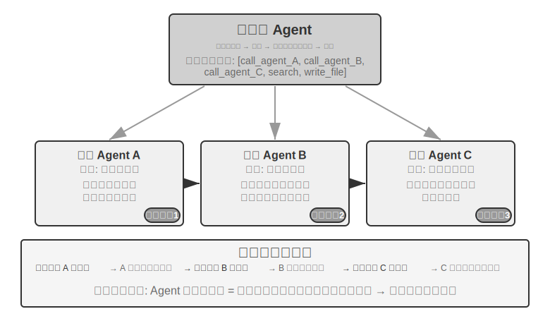


Manager が順番に専門 Agent を次々と呼び出し、各 Agent が完了後に結果を返し、Manager が次のステップを決めます。制御フローは線形で、シンプルで分かりやすく、サブタスク間に明確な先後依存がある場面に適します。

> **実験 10-3 ★★：書籍翻訳 Agent**
>
> 書籍翻訳は、マルチ Agent 協調を必要とする典型的な複雑タスクです。技術書を一冊翻訳するのは、単に文字をある言語から別の言語へ変換するだけでなく、専門用語が全書で一貫し、文脈が正確で、全体の読み心地が滑らかであることを保証する必要があります。たとえば大規模言語モデル関連の英語の本を一冊翻訳すると、大量の用語が繰り返し登場し、複数の慣用的な言い方がありうるので、全書で統一しなければなりません。第 1 章で agent を「智能体」と訳したなら、後で「代理」に変えてはいけないのです。
>
> もし単一 Agent でこれをやると、深刻なコンテキストの問題に直面します。Agent が章ごとに内容を処理していくにつれ、コンテキストが絶えず累積します。全書の用語表、翻訳済みの章、現在の段落、翻訳の思考過程、ツール呼び出しの結果。数百ページの技術書に翻訳の中間生成物を加えれば、たやすくコンテキストウィンドウを超えます。さらに深刻なのは、長すぎるコンテキストの中で Agent は「迷子」になりやすいことです。それ以前の用語の取り決めを忘れ、第 8 章で第 2 章と一致しない訳し方を使ってしまう。校正段階では重複したチェックがリソースを浪費する。さらには注意の分散によってハルシネーションを起こし、実際には存在しない用語規則を「思い出す」ことすらあります。
>
> 管理者パターンはタスク分解と責任分離を通じてこれらの問題を解決します。
>
> - **Glossary Agent**（用語対照表 Agent）：全書の内容を受け取り、繰り返し登場する専門用語を識別し、専門辞書と翻訳規範を検索し、構造化された用語対照表（JSON/CSV 形式で、英語用語、中国語訳、品詞、使用文脈を含む）を生成します。完了後は共有ファイルシステムに書き込み、Agent はそのまま破棄してリソースを解放できます
> - **Translation Agent**（章翻訳 Agent）：現在の章、用語対照表、翻訳ガイド（対象読者の水準、言語スタイル）を受け取り、滑らかな中国語に翻訳します。対照表にある用語に出会えば規定の訳語を厳格に使い、新しい用語に出会えば訳を推定して要審査とマークします。各インスタンスは独立したコンテキストで働き、互いに干渉しません。訳文はファイルシステム（`chapter1_zh.md` など）に書き込みます。Manager は複数のインスタンスを並列または直列に起動できます
> - **Proofreading Agent**（全文校正 Agent）：すべての訳文と用語表を受け取り、一貫性チェックを実行します。用語翻訳が統一されているかを一つずつ検証し、前後の不一致を識別し、全体の滑らかさと読みやすさをチェックします。校正レポートを生成してファイルシステムに書き込みます
> - **Manager Agent**：コンテキストには主にタスクの記述、実行計画、各 Agent の呼び出し記録と進捗状態を保存します。完全な翻訳内容（これらはファイルシステムに存在します）は保存せず、ファイルインデックスだけを維持します。校正レポートに基づき、Manager は特定の章を Translation Agent に差し戻して修訂させることができます
>
> このアーキテクチャでは、Manager Agent のコンテキストは終始管理可能な範囲に保たれます。タスクの全体的な記述と目標、各段階の実行計画、各 Agent の呼び出し記録と返り値、そして現在の進捗状態を知っていればよく、各章の完全な翻訳内容を収める必要はありません。
>
> 鍵となる強みは**コンテキスト隔離**にあります。Glossary Agent は用語抽出に必要な内容だけを見て、Translation Agent は現在の章と用語表だけを見て、Proofreading Agent は全文へのアクセスが必要とはいえ一貫性チェックだけに注目します。各 Agent は簡潔で集中したコンテキストの中で働くので、効率が高いだけでなく、誤りの可能性も低くなります。Agent が情報過多で注意を分散させることがないからです。
>
> **実験の要件**：
> 1. 図と文が豊富で、コードを含む技術書を翻訳対象として選ぶ
> 2. Manager、Glossary、Translation、Proofreading の 4 種類の Agent を実装する
> 3. 各 Agent のコンテキスト消費を記録し、管理者パターンがコンテキスト膨張を抑える有効性を検証する
> 4. 単一 Agent と管理者パターンを、翻訳品質・実行効率・リソース消費の面で対比する
>
>
> 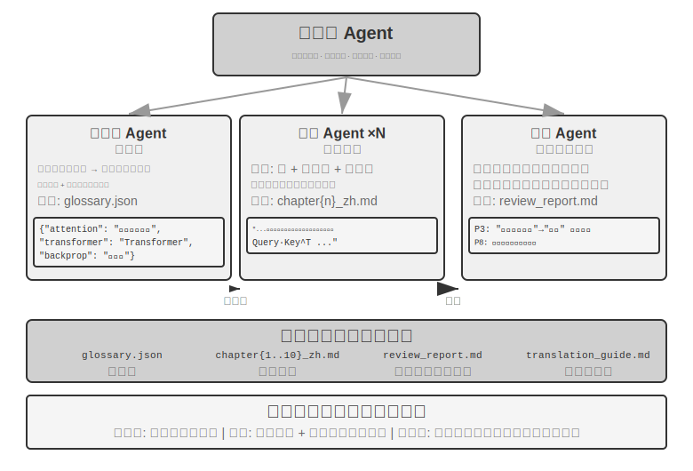
>
>

**並列協調形態。**


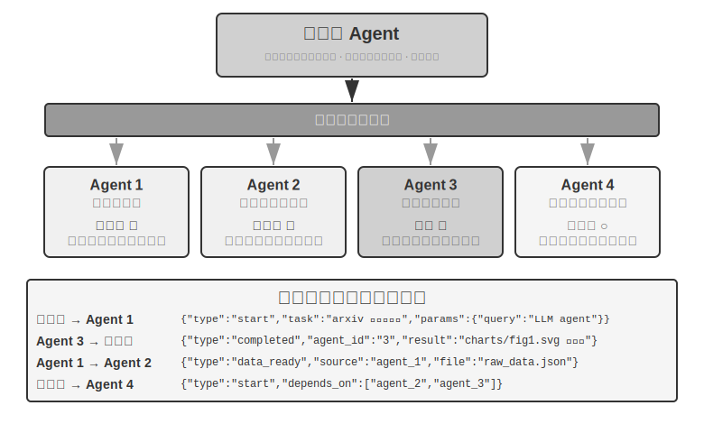


複数のサブタスクを並列に実行できるとき、逐次モードは効率が悪く見えてきます。並列協調は複数の Agent を同時に働かせ、スループットを大幅に高めます。Manager Agent は並列タスクを計画するだけでなく、実行中のすべての Agent をリアルタイムに監視し、通信の協調を処理し、Agent が成功または失敗したときにグローバルな意思決定を下さなければなりません。これには通常、インフラとして**メッセージバス**（Message Bus）が必要です。これは「公共の掲示板」のようなものと理解できます。Agent はそこにメッセージを貼る（発行する）ことも、自分が関心のあるメッセージ種別をフォローする（購読する）こともでき、非同期通信を実現して互いにブロックしません。よくある実装案は複雑さの順に 2 種類あります。**Redis Pub/Sub** は軽量で、メッセージは発行と同時に受信され、シンプルで使いやすいものの、永続化しないのが欠点です。受信側がそのときオンラインでなければ、メッセージは失われます。**RabbitMQ** などのメッセージキューはメッセージをディスク上に保存するので、受信側が一時的にオフラインでも失われません。メッセージ形式は通常、送信者 ID、宛先 Agent（または全員へのブロードキャスト）、メッセージ種別、そして JSON 形式のデータ内容を含みます。

**灵台（Lingtai）：管理者パターンの一つのプロダクト化された実例。** 灵台はローカルで動く、ファイルを本位とした長期的な Agent の住処です[^lingtai]。その 3 種類の役割は、まさに本節の概念のほぼ完全な地に足の着いた実装です。**主器灵**（main agent）はユーザーと対話する常駐の中枢で、計画と記憶を司り、仕事を他の役割に派生させます。まさに Manager Agent の位置です。**分神**（daemon）は騒がしくも境界のある一つの仕事のために分け出された短時間の並列ワーカーで、完了後は捨てられ、結論だけを主器灵に持ち帰ります。これはまさに「サブ Agent は全量の軌跡ではなく構造化された要約を返す」と並列協調形態のプロダクト化です。**分身**（avatar）は自身の記憶・メールボックス・職責を持つ持続的な専門化された仲間で、複数のセッションをまたいで保持する価値のある専門的な分業に使われます。その他の設計も前文と一つひとつ呼応しています。知識は各器灵に固有の持続的な記憶ファイルであり、技能はすべての器灵が共有する Markdown マニュアル（「Agent から見たファイルシステム」の節のシステム組み込みリソースに対応）です。コンテキストウィンドウがまもなく満杯になると、器灵は「凝蜕」（molt）します。自分に要約を一部書き、持続的な記憶を携えてクリーンなコンテキストで仕事を続けるのです（第 2 章のコンテキスト圧縮に対応）。下層のモデルは差し替え可能でも器灵は存続します。身分・記憶・能力はいずれも普通のファイルの形でプロジェクトディレクトリに置かれる、すなわち「器灵はそのファイルである」のです。

[^lingtai]: 灵台公式チュートリアル：https://lingtai.ai/zh/tutorial/

> **実験 10-4 ★★★：電話をかけながらパソコンを使う Agent**
>
> **前提要件**：本実験は第 9 章の Computer Use と音声 Agent の技術を総合的に活用します。先に第 9 章の関連実験を終えておくことを推奨します。
>
> 現実の多くの場面では、複数の能力が同時に動くことが必要で、列に並んで一つずつというわけにはいきません。人間のアシスタントは電話で顧客とやり取りしながら、パソコンで文書を調べ、要点をメモするかもしれません。この「一心多用」は単一 Agent にはきわめて厳しい挑戦です。一つの Agent にリアルタイムの音声対話とパソコン画面の操作の両方を処理させると、必然的に 2 つのタスクの間で行ったり来たり切り替え、対話が止まったり操作が中断したりします。マルチ Agent 並列実行の中核的な考え方はこうです。**異なる Agent がそれぞれリアルタイム性要求の高い一つのタスクに集中し、非同期のメッセージ受け渡しで協調して、真の並列処理を実現する**。2 つの Agent はさらに異なる対話モダリティに向けて専用の最適化もしています。電話 Agent は低遅延の音声認識と合成を必要とし、パソコン Agent は強力な視覚理解と操作計画の能力を必要とします。
>
> **場面**：AI Agent がユーザーのために複雑なフライト予約フォームを記入します。Web ページを操作しながら、電話でユーザーに個人情報（氏名、証明書番号、フライトの好みなど）を尋ねて確認する必要があります。両端ともに高いリアルタイム性が求められ、まさに単一 Agent ではあちらを立てればこちらが立たず、2 Agent なら各自が役割を分担できる典型例です。
>
> **2 Agent アーキテクチャ**：
>
> **Phone Agent**：ASR + LLM + TTS に基づく音声通話 Agent。ユーザーの自然言語の回答を理解し、鍵となる情報を抽出してメッセージ枠組みを通じて Computer Agent に送ります。同時に Computer Agent のメッセージ（「ユーザーの証明書番号が必要」「ページの読み込みでエラー」など）を受け取り、それに基づいて適切な話し方を生成してユーザーに尋ねます。
>
> **Computer Agent**：ブラウザ操作の枠組み（Anthropic Computer Use、browser-use など）に基づきます。Web ページの構造を理解し、フォームのフィールドを識別し、受け取った情報に基づいて記入を実行し、問題に出くわしたら Phone Agent に助けを求めます。
>
> **通信メカニズム**には 2 つの案があります。
> - **シンプル案**：ツール呼び出しによるポイントツーポイント通信、`send_message_to_computer_agent(message)` / `send_message_to_phone_agent(message)` など
> - **完全案**：メッセージバス + Manager Agent、統一されたメッセージ形式で、送信者・受信者・種別・内容を含む
>
> **並列協調メカニズム**（本章の 2 つの「電話 + パソコン」実験で共用）：2 つの Agent は独立したスレッドまたはプロセスで動き、各自が独立した ReAct ループを維持します。Phone Agent のループ：音声を受信 -> ASR で転写 -> LLM で理解して応答を生成 -> TTS で合成 -> 再生 -> Computer Agent のメッセージをチェック。Computer Agent のループ：スクリーンショット -> Vision LLM でページを理解 -> 操作を計画 -> 実行（クリック、入力など） -> Phone Agent のメッセージをチェック。鍵は両者が真に並列でなければならないことです。Computer Agent が要素を探し、テキストを入力している間、Phone Agent はオンラインを保ってユーザーと対話し続けます（「はい、お名前を記入しております……証明書番号をお願いできますか？」）。そのために、各 Agent の入力は相手からのマーカーフィールドを携えます。たとえば Phone Agent のコンテキストには `[FROM_COMPUTER_AGENT] 「次へ」ボタンが見つかりません。ユーザーの確認が必要かもしれません` が現れ、Computer Agent には `[FROM_PHONE_AGENT] ユーザーが氏名は「張三」、証明書番号は 123456 だと言っています` が現れます。
>
> **実験の要件**：
> 1. ASR/TTS API とブラウザ操作の枠組みに基づいて 2 Agent アーキテクチャを実装する
> 2. 効率的な双方向通信メカニズムを実装する
> 3. 真の並列動作を確保し、情報収集とフォーム記入を同期して進める
> 4. 異常状況に対処する
>
> **実験 10-5 ★★★：自律的にオーケストレーションする電話とパソコンの Agent**
>
> 実験 10-4 の 2 Agent の協調アーキテクチャはあらかじめ設計されたものでした。本実験はさらに一歩進んで、**Agent の自律的なオーケストレーション能力**を探ります。人間があらかじめ協調フローを計画するのではなく、いつ新しい協調 Agent を起動する必要があるかを Agent 自身が判断するのです。
>
> **場面**：ユーザーが「このサイトで登録を完了させてほしい」とリクエストし、URL は提供したものの、どんな情報を記入する必要があるかは説明しませんでした。Manager Agent は Computer Use ツールでサイトにアクセスし、登録ページを読み込みます。
>
> 操作の過程で、Computer Use Agent は登録フォームが非常に複雑で、大量の必須フィールドを含むことを発見します。個人の基本情報（氏名、性別、生年月日）、連絡先（携帯番号、メール、住所）、本人確認情報（証明書の種類、証明書番号）、好みの設定など。Agent はコンテキストをチェックして、これらの情報が手元にないことに気づきます。ユーザーは「登録して」と言っただけで、具体的なデータを何も提供していないのです。
>
> 従来の Agent はこういう状況に出くわすと、テキストメッセージを送ってユーザーにタイプ入力させます。これは非効率（大量の情報を手入力する必要がある）で、しかも間違いが起きやすい（形式の問題、情報の抜け）ものです。より賢い Agent はこう気づくべきです。**これは電話でのやり取りを通じて情報を収集するのに適した場面だ**——電話での対話はテキストチャットよりはるかに効率的で、一つずつ尋ねて確認でき、ユーザーの曖昧な表現にも対処できます。
>
> 鍵となる革新は、この意思決定があらかじめプログラムされたものではなく、**Agent が自律的に下した**ものである点にあります。Computer Use Agent のプロンプトにはこう書かれています。「ユーザーから大量の構造化された情報を収集する必要があり、かつ対話を通じて段階的に進められるとき、Phone Agent を補助ツールとして呼び出すことを検討してください。」ツールセットには `initiate_phone_call_agent(purpose, required_info)` が含まれます。
>
> 呼び出すと、システムは Phone Agent を作成し、明確なタスクコンテキストを与えます。それはフォーム記入を補助するために起動されたこと、どんな情報を収集する必要があるか、そして各フィールドの形式要件です。
>
> 2 つの Agent はすぐさまリアルタイム協調モードに入り、実験 10-4 のあの非同期並列メカニズムを踏襲します。Phone Agent はユーザーに電話をかけ、一つずつ尋ねます。「こんにちは、登録フォームの記入をお手伝いしています。まず、お名前をお願いできますか？」ユーザーが答えると即座に `{"type": "info_collected", "field": "姓名", "value": "张三"}` を Computer Agent に送り、後者はすぐさま Web ページ上で「氏名」フィールドを見つけて記入します。同時に、Phone Agent はパソコン操作の完了を待たず、次の質問を続けます。この**一つ尋ねて、一つ記入する**、対話の流れが操作の遅延にブロックされないパターンが、本実験の中核的な要件です。すべての情報の収集が完了したら、Phone Agent は `{"type": "task_completed"}` を送り、Computer Agent がフォームを送信します。
>
> **実験の要件**：
> 1. 自律的に Phone Agent の起動を意思決定できる Computer Use Agent を実装する
> 2. リアルタイムの双方向通信と真の並列動作を実装する
> 3. 異常に対処する（情報の形式が正しくないときにフィードバックして尋ね直す）
> 4. 協調過程のメッセージの時系列と Agent の意思決定の鍵となる点を記録する
>
>
> 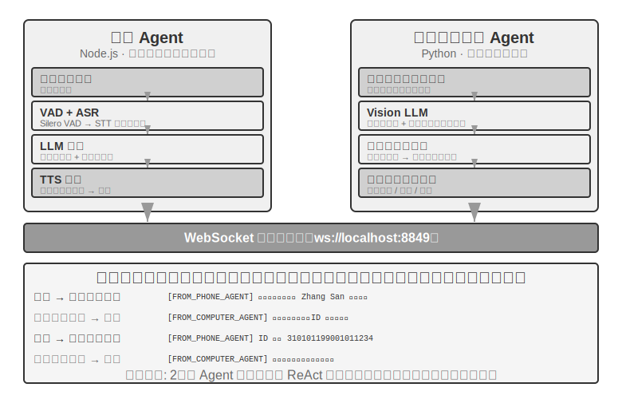
>
>
> **実験 10-6 ★★★：複数のサイトから同時に情報を集める Agent**
>
> **前提要件**：先に第 4 章のイベント駆動と中断メカニズムを理解しておくことを推奨します。
>
> 本実験はマルチ Agent 並列実行の、情報収集の場面での応用を探ります。実験 10-4 と実験 10-5 が 2 つの異種 Agent の協調に注目したのと異なり、本実験が注目するのは**複数の同種 Agent の並列検索**、そして中心的な協調を通じていかに効率的なタスク完成とリソース最適化を実現するかです。
>
> **問題**：ある大学の複数の学部サイトが与えられ、各学部の教員名簿ページで指定された教員（「張偉」など）を探し、見つかったらその所属学部・職位・研究方向などの情報を返すことが求められます。
>
> **中核的な挑戦**：
>
> **1. 並列起動**：Manager Agent はタスクの需要に応じて動的に 10 個の Computer Use Agent インスタンスを作成し、各インスタンスが一つの学部サイトに対応します。各インスタンスは独立したプロセスまたはスレッドであるべきで、独立したブラウザセッションを持ち、互いにブロックせず同時に実行できます。起動時に、対象サイトの URL、検索する教員の氏名、タスク識別子（メッセージのルーティングに使う）を渡します。
>
> **2. リアルタイム監視**：各 Agent は実行の過程で定期的に状態更新を送ります（「サイトを読み込み中」「教員名簿を解析中」「対象が見つからず、タスク完了」「一致を発見、詳細情報は以下」）。Manager Agent はメッセージバスを通じてこれらの更新を受け取り、タスク状態表を維持し、どの Agent がまだ実行中で、どれが完了し、どれがエラーに出くわしたかをリアルタイムに把握します。
>
> **3. カスケード終了**：計算機学部を担当する Agent が対象の教員を見つけたとします。それは `{"type": "target_found", "agent_id": "agent_3", "data": {...}}` を送ります。Manager Agent は受け取ると直ちに、まだ実行中の他のすべての Agent に `{"type": "terminate", "reason": "target_found_by_agent_3"}` を送り、終了メッセージを受け取った各 Agent は優雅に停止して確認を送ります。Manager Agent はすべての確認（またはタイムアウト）を待ってから結果を集約します。要件：Agent はいつでも終了信号に応答できること（第 4 章の中断メカニズムに類似）、終了は必ず優雅であること——宙ぶらりんのプロセスや閉じられていないリソースを残さない。同時に競合状態（Race Condition）に対処する必要があります。
>
> **概念の補足：競合状態とは何か？** Agent A と Agent B がほぼ同一ミリ秒内にそれぞれ対象の教員を見つけ、同時に Manager Agent に「見つけた！」と報告したとします。もし Manager Agent の処理が不適切なら——たとえば A の報告を受けて結果の集約を始めたのに、すぐ後に B の報告を受けて 2 回目の集約がトリガーされる——重複した結果や互いに矛盾する状態が生じかねません。解決方法は通常「ロック」メカニズムを使うことです。最初の報告が到着したら直ちに状態をロックし、後続の報告は重複と識別して無視します。
>
> **4. 失敗処理**：実際の運用では多様な異常に出くわしえます。ある学部のサイトにアクセスできない（ネットワークエラー、サーバーダウン）、あるサイトの構造が想定と合わず Agent が正しく解析できない、あるいはすべての Agent が検索し終えても対象が見つからない。Manager Agent の処理戦略：各 Agent にタイムアウト（2 分など）を設定し、タイムアウトは失敗とみなす。エラーを隔離し、他の Agent の実行継続に影響させない。すべて完了後に集約する——一つでも Agent が成功すれば情報を返し、すべて失敗すればユーザーに「対象の教員が見つかりませんでした」と各失敗原因の統計を報告する。
>
> **実験の要件**：
> 1. 複数の並列 Agent を動的に起動できる Manager Agent を実装する
> 2. browser-use などのオープンソースプロジェクトに基づいて Computer Use Agent を実装する
> 3. メッセージバスを実装し、Manager Agent と複数のサブ Agent の双方向通信をサポートする
> 4. 成功後のカスケード終了メカニズムを実装し、対象が見つかったら他のすべての Agent が素早く停止することを確保する
> 5. さまざまな異常状況（サイトアクセス失敗、解析エラー、すべて未発見）に対処する
> 6. 並列実行と直列実行の時間差を記録・対比し、並列化がもたらす性能向上を検証する
>
>
> 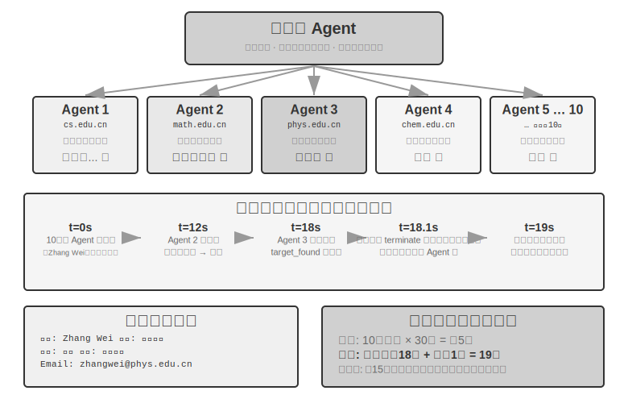
>
>
### 去中心化パターン：対等な移譲


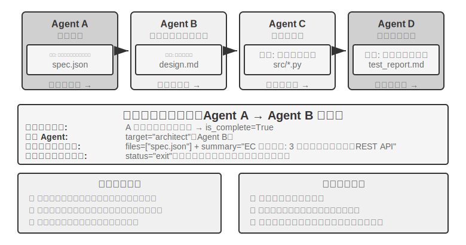


管理者パターンは明確な制御構造とグローバルな視野を提供するとはいえ、中心化という特性は固有の限界ももたらします。Manager がシステムのボトルネックと単一障害点になり、すべての協調上の意思決定が Manager の判断に依存し、その Manager はまたすべてのサブタスクについて十分な理解を持たなければなりません。タスクの複雑さが増し、Agent の数が増えると、拡張性が挑戦にさらされます。

去中心化パターンは別のアーキテクチャの考え方を提供します。**単一の中心的な制御者を持たず、Agent 同士が対等な方式で協調する**のです。各 Agent は自身の専門的な判断に基づいて、いつ他の Agent にコミュニケーションを起こすかを自律的に決めます。タスクの移譲（「私の部分は終わったので、あなたに渡します」）かもしれないし、フィードバックの要求（「この案は技術的に実現可能ですか？」）かもしれないし、問題の報告（「あなたがくれた要件には矛盾がある、議論し直す必要がある」）かもしれません。

以下の 3 つの事例は、意図的に「偽から真へ」の漸進的な筋道に並べてあります。MetaGPT の制御フローは実は固定のパイプライン（偽の去中心化で、通信メカニズムの上でだけ疎結合）であり、AutoGen group chat は共有された対話記録に中心化された調度を加えた混合形態であり、OpenAI Swarm に至って初めて制御フロー上で真に対等な去中心化を成し遂げます。

**コンテキスト非共有下の移譲は何を伝えるか？** 図 10-10 の Handoff 連鎖パターンと実験 10-2 の `transfer_to_agent` は直接的な対照をなします。後者はコンテキスト共有下で移譲し、新しい役割が完全な履歴を自動的に継承するので、何の設計もいりません。前者はコンテキスト非共有下で移譲し、移譲側が何を伝えるかを明示的に決めなければなりません。実践上、有効な「移譲パック」は通常 3 つの部分を含みます。**タスクの記述**（受け手が何をするか、受け入れ基準は何か）、**確認済みの事実と制約**（ユーザーの好み、業務ルール、前段階で確定した決定）、そして**構造化された生成物への参照**（ファイルの内容ではなくファイルパスで、受け手が必要に応じて読む）です。あえて伝えないのは全量の軌跡です。移譲側の試行錯誤の過程、中間の思考、失敗した試みは、受け手にとってはたいていノイズです。これが 2 種類の移譲の本質的な違いでもあります。コンテキスト共有の移譲は完全な履歴を保持し、情報はゼロ損失ですがコンテキストが持続的に膨張します。コンテキスト非共有の移譲は精製された移譲パックを伝え、情報は損なわれますが、各 Agent はクリーンで集中したコンテキストの中で働きます。各 Agent は他の Agent の「思考過程」を理解する必要はなく、移譲パックと産出物の形式と意味を理解すればよいのです。このインターフェースに基づく協調は、ソフトウェア工学における契約による設計の原則を借用しています。

**MetaGPT：SOP 駆動のソフトウェア会社シミュレーション（パイプラインから疎結合通信への過渡的事例）。**


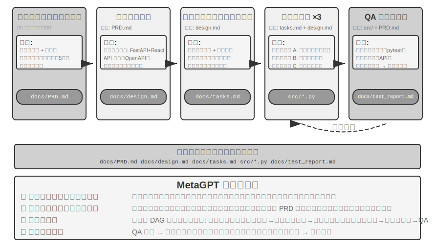


MetaGPT の中核的な洞察はこうです。人間のソフトウェア会社が蓄積した**標準作業手順**（SOP、Standard Operating Procedure）そのものが、繰り返し検証されてきた協調プロトコルである——SOP をマルチ Agent システムにコード化し、各役割をパイプライン上の専門職種のように標準化された成果物を産出させれば、成果物が本質的に役割間の通信インターフェースを構成する、というものです。

MetaGPT では、各役割は固定された順序に沿って働き（Product Manager → Architect → Project Manager → Engineer → QA）、各役割が構造化された成果物を出力します。

- **Product Manager Agent**：要件の記述を受け取り、構造化された PRD（製品要件定義書、機能リスト、ユーザーストーリー、受け入れ基準、優先順位づけを含む）を生成します
- **Architect Agent**：PRD を読み、アーキテクチャの決定（技術スタックの選択、モジュール分割、インターフェース定義、データモデル設計）を下し、設計文書を出力します
- **Project Manager Agent**：アーキテクチャ設計を読み、システムを具体的なタスクリストとファイルレベルの分業に分解し、各モジュールの依存順序を整理し、タスクをエンジニアに割り振ります
- **Engineer Agents**：設計文書を読み、担当するモジュールを実装し、コードを産出します。複数インスタンスが並列で働けます
- **QA Engineer Agent**：コードと PRD を読み、テストケースを生成し、テストを実行し、bug を記録し、テストレポートを出力します

MetaGPT の去中心化通信への本当の貢献は、その情報受け渡しメカニズムにあります。**共有メッセージプール + 役割による購読**です。各役割は構造化されたメッセージを、すべての役割から見えるメッセージプールに発行し、他の役割は自身の購読設定に応じて、自身の職責に関連するメッセージだけを取り出します。ポイントツーポイントで一対一に伝言するのではありません。発行者は誰が自分の出力を消費するかを知る必要がなく、役割を追加するにはどのメッセージ種別を購読するか宣言するだけで、既存のどの役割も変更する必要がありません。これは真の疎結合をもたらします。たとえば Product Manager をより強力なモデルに換えても、それが発行する PRD が仕様に合致してさえいれば、他のすべての Agent は変更不要です。

MetaGPT の反復改善は主にエンジニアの段階で起こり、そのメカニズムは**実行可能フィードバック**（executable feedback）です。Engineer は自分が書いたコードとテストを実行し、エラーや失敗の結果に応じてデバッグのループに入り、通過するまで続けます。別の Agent の意見ではなく、決定的な実行結果によって修正を駆動するのです。

正直に説明しておくべきなのは、MetaGPT は**制御フロー**の上では去中心化されていないことです。役割の順序は SOP であらかじめ固定されており、全体としてはパイプライン（第 1 章の言葉で言えばワークフロー）に近いのです。それが本節で論じられるのは、メッセージプールと購読の通信メカニズムが去中心化システムの最も鍵となる設計要素、すなわち疎結合を示しているからです。「QA が Product Manager に直接要件を確認する」「Engineer が Architect と代替案を議論する」といった多方向の動的なフィードバックは、このアーキテクチャへの自然な拡張の構想であって、オリジナルの MetaGPT は実装していません。

**AutoGen group chat：共有された対話記録 + 中心化された調度。** AutoGen の group chat は複数の Agent を同一のセッションに参加させます。各ラウンドで「発言者選択器」が次に発言する Agent を決めます——選択器は単純なローテーション規則でも、現在の対話内容に基づいて誰が最も接ぐのに適しているかを判断する LLM でも構いません。どの Agent の発言もすべての参加者から見えます。正直に説明すべきなのは、それは制御フローの意味で完全に去中心化されたシステムではないことです。発言者の選択は中心化された GroupChatManager が統一して裁定し、「誰の発言の番か」自体が一種の制御フロー上の意思決定なのです。そのため、より正確な位置づけは**「共有された対話記録 + 中心化された調度」の混合形態**です。すべての Agent が同一の公共の対話記録を見ますが、各自が独立したシステムプロンプトとツールセットを保持し、調度権は選択器の手に集中しています。このパターンは多視点の議論を要し、発言順序をあらかじめ固定しにくいタスク（案の審査、領域横断の分析など）に適しますが、その代償として対話が発散しうるため、終了条件を入念に設計する必要があります。本章の次元の分け方でいえば、ここではその調度メカニズム（中心化された選択器）によって本節に分類していますが、コンテキストの次元では実は共有と非共有の中間にあり、混合形態に属します。これは、トポロジーとコンテキスト共有が概念上は独立で、ずらして組み合わせられる 2 つの次元であることを改めて示しています。

**OpenAI Swarm と Agents SDK：handoff ネットワーク。** これに対して、制御フロー上で真に対等な去中心化を成し遂げた代表が、OpenAI の Swarm（およびその後継の Agents SDK）です。それは去中心化を最も単純な形態に仕立てました。各 Agent がいくつかの handoff（移譲）の選択肢を備え、いつでも制御権をネットワーク内の任意の他の Agent に移譲できます。カスタマーサポートのトリアージ Agent が問題は返金に関わると判断すれば返金 Agent に移譲し、返金 Agent が処理中に技術的な故障だと気づけば技術サポート Agent に移譲できます。システムに中心的な調度者はおらず、制御権はバトンのように対等な Agent の間を巡り、ルーティングの意思決定は完全に各 Agent 自身の判断へと分散します。これこそがクリーンな「対等な移譲」であり、まさに図 10-10 が示す連鎖的移譲パターンのエンジニアリング実装です。

### 組織をまたぐ協調：A2A プロトコル

以上のシステムはいずれも、すべての Agent が同一のチームによって開発され、同一のシステム内で動くことを前提としており、このとき引数の受け渡し、共有ファイル、メッセージバスの 3 種類の通信メカニズムで十分です。しかし協調が組織の境界をまたぐとき——あなたの Agent が別の会社の Agent を呼び出す必要があるとき——標準化された相互運用プロトコルが必要になります。2025 年に Google が発表した **A2A**（Agent2Agent）プロトコルは、まさにこのために設計されました（のちに Linux 財団に寄贈されて運営が委ねられました）。その中核的な要素は 3 つあります。

- **Agent Card**：Agent の能力を記述するメタデータ文書（約束された公開アドレスの下に発行される）で、この Agent が何をできるか、どんな入出力モダリティをサポートするか、どう認証するかを宣言します。Agent の「名刺」に相当し、組織をまたぐ能力発見の問題を解決します。
- **タスクのライフサイクル管理**：A2A は協調の単位をタスク（Task）としてモデル化し、明確な状態機械（提出済み、進行中、入力必要、完了済み、失敗）を持ち、長時間実行のタスクとストリーミングの進捗更新をネイティブにサポートします。
- **不透明な協調**：Agent 同士はタスクと生成物（Artifact）だけを交換し、内部のプロンプト・思考過程・ツール実装を露出しません。これは本章の「コンテキスト非共有」の原則と一致し、組織をまたぐ協調における必要なセキュリティ属性でもあります。

A2A の位置づけは第 4 章の MCP と対照して理解できます。MCP が解決するのは Agent とツールの間の相互運用であり、A2A が解決するのは Agent と Agent の間の相互運用です。それは本章で紹介した 3 種類の通信メカニズムを置き換えるのではなく、それらの上に立つ、信頼境界をまたぐ標準化の層です。同一チーム内部のマルチ Agent システムはメッセージバスを直接使えばよく、協調する相手が互いに信頼せず、実装が互いに見えないときにこそ、A2A のような公開プロトコルが必要になります。

## マルチ Agent 協調の失敗モード

マルチ Agent システムは協調能力を導入すると同時に、単一 Agent には存在しない新型の失敗モードも導入します。2025 年の論文『Why Do Multi-Agent LLM Systems Fail?』（MAST 失敗モード分類法を提示）はこれについて体系的な研究を行いました。研究者は MetaGPT、ChatDev、AG2、Magentic-One など 7 つの主流のマルチ Agent 枠組みで実行軌跡を収集し、人手のアノテーターが約 150 本の軌跡を一本ずつ分析し（アノテーションの一致度はきわめて高く、Cohen's kappa = 0.88 で、異なるアノテーターの失敗モードの判断が高度に一致していることを示します）、最終的に **14 種類の独自の失敗モード**を帰納し、3 大類に分けました。

- **システム設計の欠陥**：Agent 間のインターフェース定義が不明確、役割の職責が重複、ツールの設定が誤っているなど、アーキテクチャレベルの問題
- **Agent 間のアラインメント失敗**：複数の Agent のタスク目標の理解が一致しない、伝えた情報が下流の Agent に誤解される、あるいは複数の Agent の操作が論理的に互いに矛盾する
- **タスク検証の欠如**：タスクが本当に完了したかを確認する有効なメカニズムがシステムに欠けている——Agent が「完了した」と主張しても実際の結果は要件に合わない

たとえ単純な修復措置を導入しても、改善の幅はきわめて限られます（たとえば ChatDev 枠組みではわずか 15.6% の向上）。研究者はそのため、これらは単純なエンジニアリング上の bug ではなく、現在のマルチ Agent アーキテクチャの**根本的な設計欠陥**だと考えています。単にある一環を繕うだけでは問題を解決するに足らず、システム設計のレベルから考え直す必要があるのです。

以下では、実践で特によく見られ、かつ最も破壊的な 2 種類の失敗モードを重点的に論じます。(1) 共有ファイルシステムの並行競合、(2) 誤りのカスケード増幅です。説明しておくべきなのは、この 2 種類の失敗モードはエンジニアリングの視点（ファイルシステムの並行、誤情報の Agent をまたぐ伝播）に偏っており、MAST が対話式の協調失敗に重きを置いた分類への補足であって、その 14 種類のモードの繰り返しではないことです。

### 失敗モード一：共有ファイルシステムの並行競合

共有ファイルシステムはマルチ Agent 協調の中核インフラですが、複数の Agent が同時に操作するとき、並行競合は避けて通れないエンジニアリング上の挑戦になります。これらの競合は 2 種類に分けられます。

**単純な競合（ファイルレベルの書き込み競合）**：2 つの Agent が同時に同じファイルを修正し、後から書き込んだ方が先に書き込んだ修正を上書きしてしまうものです。これはまさにデータベース領域の古典的な**更新の喪失**（lost update）問題です——そして Git のマージ競合検知メカニズムは、まさにこの種の上書きを食い止めるために設計されています。

**意味的な競合（論理レベルの整合性競合）**：ファイルのレベルでは何の競合も見えないのに、複数の Agent の操作が論理的に互いに矛盾するものです。この種の競合はより隠れており、より危険です。例を挙げましょう。Agent A が全書の画像番号を振り直す担当で、Agent B が同時にある章の内容を修正して元の番号の画像を参照しているとします。両者が操作するのは異なるファイルで、ファイルのレベルではまったく競合しません。しかし結果として、B が参照する画像番号は A の振り直し完了後にすべて無効になり、読者は誤った画像参照を目にします。

**解決策：楽観ロック（Optimistic Locking）メカニズム**。これはデータベース領域でよく使われる並行制御戦略です。それを理解するために、まず日常的な場面を想像しましょう。あなたと同僚が同時に同じオンライン文書を開いたとします。「悲観ロック」のやり方は、あなたが文書を開いた瞬間にそれをロックし、同僚が編集しようとすると「ファイルはロックされています」と表示されるものです。安全ですが非効率です。あなたは単に見ているだけで、修正するつもりなどまったくないかもしれないからです。「楽観ロック」のやり方はもっと賢いものです。みなが自由に開いて編集できますが、保存時にシステムがチェックします——「あなたが文書を開いたあと、誰か他の人がすでに変更しなかったか？」もし変更されていれば、「ファイルは変更されました。更新してから再試行してください」と促します。

具体的な実装はこうです。各ファイルはバージョン番号（または最終更新タイムスタンプ）を維持します。Agent はファイルを読むとき現在のバージョン番号を記録し、書き込むときにバージョン番号が読んだときと依然一致するかをチェックします。もしファイルがこの間に他の Agent によってすでに修正されていれば、書き込みは失敗し、Agent は最新版を読み直して、その上で操作をやり直すことを余儀なくされます。このメカニズムの代償はときどきリトライが必要なことですが、その代わりにデータの整合性の保証が得られます——Agent が古びたファイル状態に基づいて意思決定を下すことは決してありません。

注意すべきは、楽観ロックは**同一ファイル**の書き込み競合を防げるだけだということです。前述の**ファイルをまたぐ意味的競合**（画像番号が複数箇所で参照される、など）については、より高層の意味的検証メカニズムが必要です。たとえばタスクのオーケストレーションのレベルで依存関係のあるファイルが並列に修正されるのを避けるか、書き込み後にグローバルな整合性チェックを走らせるかです。

たとえば、Agent A が t=0 に `config.json`（version=3）を読み、Agent B が t=1 に同じファイルを修正し（version が 4 になる）、Agent A が t=2 に書き込もうとしたときバージョンがもう 3 ではないことに気づき、書き込みが拒否されます。Agent A はその後 version=4 の内容を読み直し、最新版に基づいて修正を生成し直し、再度書き込みを試みます。

特筆すべきは、複数の Coding Agent が同一のコードベースを並行して修正するという最もよくある場面では、業界のより主流なやり方は単一のワーキングコピーにロックをかけることではなく、**ワーキングコピーの隔離**だということです。各 Agent に独立した Git ブランチまたは worktree を割り当て、それぞれが自分のコピーで並列に修正し、互いに干渉せず、競合は最後のマージ点へと集中的に先送りし、専門のマージ段階または人手で解決します。これは第 2 章「隔離は圧縮に勝る」の考え方と同源です——第 2 章はサブ Agent のコンテキスト隔離を論じる際、多方に同一の状態を共有させてから競合を解消する方法を考えるよりも、最初から隔離して、協調のコストを明確な境界に収束させて処理する方がよいと指摘しました。

### 失敗モード二：誤りのカスケード増幅

並行競合はファイルレベルのエンジニアリング上の問題ですが、誤りのカスケード増幅は意味的レベルのより隠れたリスクです。複数の Agent が頻繁に相互作用するとき、ある Agent の誤りが後続の Agent によって層ごとに強化されうるのです。「伝言ゲーム」で情報が伝わるほど歪んでいくのと同じです。

具体的な場面で説明します。ある翻訳システムが管理者パターン（実験 10-3 のアーキテクチャ）を採り、Manager が技術書を章ごとに分けて複数の翻訳 Agent に割り当てるとします。

```
术语 Agent：将 “reasoning” 翻译为 “推理”，但 “推理” 在中文里更常用于 inference，存在歧义
        ↓ 写入 glossary.json
翻译 Agent A：翻译第二章，从术语表读取，将 “reasoning tokens” 翻译为 “推理 token”
翻译 Agent B：翻译第七章，将 “inference latency” 也翻译为 “推理延迟”
        ↓ 写入各章译文
校对 Agent：看到全书统一使用 “推理”，认为术语一致、翻译正确 ✗
```

問題はどこにあるのでしょう？「reasoning」（モデルの思考過程）と「inference」（モデルの前向き推論／デプロイ実行）は 2 つの異なる概念ですが、用語 Agent が最初に reasoning を「推理」と訳したために、後続の Agent は inference に出くわしたときも自然に同じ語を選びました——2 つの異なる概念が同一の訳名に統合されてしまい、読者は区別できなくなります。正しいやり方は reasoning を「思考」、inference を「推理」と訳すことです。しかし校正 Agent は全書が「統一して」「推理」を使っているのを見て、かえって翻訳品質が高いと考えてしまいます。

一つの用語の誤りが 3 つの Agent を経て伝播したことで、「一貫性」ゆえにより高い信頼性を獲得したのです。これがまさに本書が reasoning=思考、inference=推理という翻訳の取り決め（引言で説明しています）を採る理由でもあります。異なる中国語の語で曖昧さを消すのです。強調すべきは、ここでの「誤り」は必ずしもハルシネーションではないということです。上例の源はむしろ一度の用語決定のミスですが、同じく「一貫性」に層ごとに増幅されました。しかしもし源が本当にハルシネーション（たとえば実験 10-3 で翻訳 Agent が注意の分散によって存在しない用語規則を「思い出す」）だったとしても、増幅のメカニズムはまったく同じで、結果はいっそう深刻になるだけです。この誤りの増幅の連鎖は管理者パターンで特に危険です。もし Manager があるサブ Agent の誤った要約に基づいて調度の意思決定を下せば、後続のすべてのサブ Agent の仕事が誤った前提の上に築かれかねません。

**交差検証**はこの連鎖を断ち切る鍵となる手段です。核心はより多くの Agent を同一の思考の連鎖に参加させることではなく、ある Agent に**独立した視点**で結論を見直させることです。前段の Agent の思考過程を見ず、元の証拠と最終結論が一致するかどうかだけを見るのです。これはまさに第 5 章で論じた提議者・審査者メカニズムのマルチ Agent 場面への延長です。Reviewer の価値はコードの誤りや形式の問題を発見することだけでなく、独立した判断者として、思考の連鎖全体で集団的に見過ごされた矛盾を識別できることにあります。高リスクの意思決定には、外部の検証手段を導入することもできます。たとえば単体テスト、コンパイラ、データベースクエリなどの決定的なツールが提供するフィードバックはハルシネーションの影響を受けず、最も信頼できる「連鎖の断ち切り役」です。

早すぎる終了には対称的な裏面があります。**ループの暴走**です。前の「対等協調」の節が論じたのは「ループすべきなのにループしなかった」——Agent が仕事を半分やって止まってしまう——ことでした。ここではさらに「ループが回り続けているのにますます悪くなる」ことを防がねばなりません。業界は Loop 工程の実践で 3 つの典型的な失敗モードをまとめました。一つは **token コストの暴走**で、ループが無人で何時間も走り、大量の予算を焼き、誰も求めていないコードの山を産出します。二つ目は**理解の負債**（comprehension debt）で、ループがコードを速く引き渡すほど、エンジニアのシステムの実際の実装に対する理解が遅れをとり、人手の介入が必要になったときには自分のシステムが読めなくなっています。三つ目は**認知の降伏**（cognitive surrender）で、設計者がループに代行させることに慣れ、次第に独立した思考と審査を放棄し、品質が螺旋状に低下します。この 3 つの解毒剤は誤りの増幅連鎖を断つのと一脈相通じます。明示的な予算と終了条件、真の観測に根ざした検証器、そして人が終始「ループのエンジニア」であって「開始ボタンを押すだけの人」ではない役割を保つことです。

以上のすべての議論はエンジニアリングの視点——いかに一群の Agent を協調させてタスクを完成させるか——でした。ここから視点を切り替えます。大量の Agent が長期にわたって共存し、もはや単一の目標に駆動されなくなったとき、何が創発するのでしょうか？ この節は前沿探索に属し、エンジニアリングの読者は選択的に読んで構いません。

## Agent 社会

前の 3 節が論じたのはいずれも目標の明確なタスク協調でした——対等協調であれ、管理者パターンであれ、去中心化パターンであれ、開発者があらかじめ役割・インターフェース・制御フローを定義していました。ここから視点をより開かれた問いへと転じます。**Agent の数が数個から数百、数千へと拡大し、相互作用が十分に自由になったとき、どんな行動が創発するのでしょうか？** この部分の内容は前沿探索と学術研究に偏っており、前文のエンジニアリング指針とは異なる性質を持ちます。

創発行動（Emergent Behavior）とは、システム全体が示す、個々の個体の行動規則からは直接予測できない集団的な行動パターンを指します。自然界で最も古典的な例は**アリの群れ**です。1 匹のアリはごく単純な規則だけに従います（フェロモンの匂いがしたらそれを追い、食べ物を見つけたらフェロモンを残す）が、群れ全体は巣から食べ物までの最短経路を見つけられます——どの 1 匹のアリもこの経路を「設計」したわけではなく、それは大量の個体の単純な相互作用から自然に生まれたものです。

AI Agent の数が十分に多く、相互作用が十分に自由になると、同様の創発行動も現れ始めます。研究者はすでに複数の環境で観察しています。Agent システムはいったん規模の上である臨界点を越えると、あらかじめ設計できない集団的行動を生み出します——小さくは自発的に組織された一度の集まりから、大きくは何千何万もの Agent があって初めて現れる群体文化と経済的な駆け引きまで（以下で分節して詳述します）。

本節の事例は 3 つの次元から理解できます。

- **社交的創発**：Agent が開かれた環境で自発的に社交関係と文化現象を形成します。スタンフォード AI タウンは 25 個の Agent がいかに社交活動を自己組織化するかを示し、Moltbook は規模を 150 万にまで押し上げ、より複雑な集団的行動を創発させました。
- **経済的創発**：Agent が市場メカニズムを通じて資源配分とタスク協調を行います。Vending-Bench Arena は複数の Agent を同一の市場で競争経営させ、Pinchwork と RentAHuman は Agent 同士（および Agent と人間）の経済取引市場を構築しました。
- **戦略的駆け引き**：Agent が規則の制約の下で推論・欺瞞・社交的操作を行います（ここおよび以下の人狼の部分の「推理」は日常的な演繹の意味を取り、推理ゲームにおける論理的な駆け引きを指し、本書の reasoning=思考の技術的な意味ではありません）。人狼の実験が試すのは、情報の非対称な条件下での Agent の戦略の創発です。

### スタンフォード AI タウン：生成式 Agent の社会シミュレーション


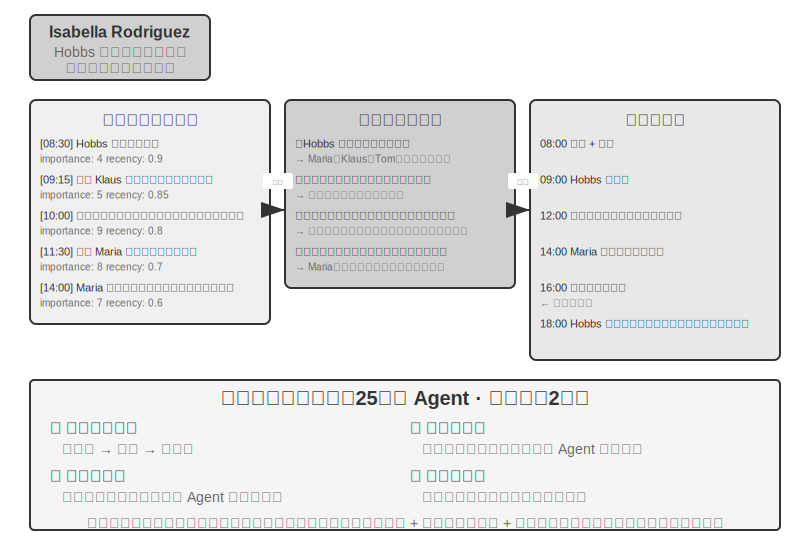


2023 年、スタンフォード大学と Google の研究チームは画期的な論文『Generative Agents: Interactive Simulacra of Human Behavior』を発表し、「生成式 Agent」の概念を提示しました。中核的な革新は、Agent にあらかじめ定義されたタスクを完成させることにとどめず、Agent に人間に近い記憶・反省・計画の能力を与え、開かれた社会環境の中で自律的に生活し、社交し、発展できるようにした点にあります。

Smallville は『シムズ』に似た 2D の仮想の町で、カフェ、公園、住宅、店舗などの公共・私的空間があります。25 個の Agent が異なる役割（店主、芸術家、学生、教授など）を演じ、それぞれに独自の背景ストーリー、性格の特徴、人間関係があります。たとえば John Lin は薬局の主人で、家庭を愛し、地域を気にかけます。Isabella Rodriguez は町のカフェ Hobbs Cafe を営み、もてなし好きです。Klaus Mueller は研究論文を書いている大学生です。

これらの Agent の知能は 3 つの中核コンポーネントの上に築かれています。

**記憶流**（Memory Stream）：限られた対話履歴だけを保持する従来の Agent と異なり、生成式 Agent は完全な経験の記録流を維持します。観察した出来事、交わした対話、生まれた考えを含みます。各記憶には重要性・時間的近さ・関連性の属性が付与され、Agent は現在の状況に最も関連する記憶を優先的に検索できます。人間があらゆることを平等に覚えているわけではないのと同じです——昨日の昼食に何を食べたかはもう忘れているかもしれませんが、先週の重要な会話は鮮明に覚えている、というように。

**反省メカニズム**（Reflection）：Agent は定期的に日常の活動を一時停止し、近ごろの経験を振り返り、自分や他人についての抽象的な問い（「Klaus Mueller は何を研究しているのか？」「誰が私の最も親しい友人か？」）を立てます。この自問を通じて、Agent は具体的な出来事の記憶を概括的な認識へと昇華させ、未来の意思決定の拠り所として記憶流に戻します。反省は Agent が外部世界を理解するのを助けるだけでなく、自己認知も促します——Agent は自分の役割・関係・目標を「意識」し始めるのです。

説明しておくべきなのは、ここでの反省は第 8 章の Agent 自己進化における反省とは異なることです。第 8 章の反省は**タスク終了後**に起こり、長期的な能力を更新することが目的です。ここでの反省は**生成式 Agent の日常の活動の中**で起こり、即時の内部状態と目標を更新することが目的です。

**計画と行動**（Planning and Reacting）：Agent は毎日活動を計画します（「8:30 に朝食、9:00〜12:00 に執筆、12:30 に散歩」など）が、環境の変化と社交の機会に応じて柔軟に調整します。計画と即時の反応の結合により、Agent の行動は目標指向性を持ちながら、社交におけるさまざまな予測不能性にも適応できます。

Smallville が動いた 2 日間の仮想時間の中で、これらの Agent は驚くべき**創発行動**を示しました。研究者がやったのは、Isabella Rodriguez の記憶に一つの種となる考えを植え込んだだけです。彼女は 2 月 14 日の夕方に Hobbs Cafe でバレンタインパーティーを開きたい、という考えです。その後に起こったことはすべて Agent の自律的な行動の結果でした。Isabella はカフェで客や友人に会うと自ら招待を出し、親友の Maria に会場の設営を手伝ってもらいました。話を聞いた Agent はさらにパーティーの情報を他の人に伝え、情報は又聞きで町に広がりました。約束の時間になると、複数の Agent がそれぞれ自分の記憶と予定に基づいて、自律的に Hobbs Cafe へ赴くことを決めました。

研究者はもう一本の実験の線も植え込みました。Sam Moore が市長選に出馬することを決めた、というものです。このニュースも同じく、いかなる中心的な調度もない状況で広がっていきました——Sam が知人に出馬の意向を漏らし、聞いた人がまた他人に伝え、町の住民は対話の中でこの選挙を話題にし、Sam についての見方を交換し始めました。研究者は 2 日後に何個の Agent がこの 2 つの情報を知っているかを統計することで、Agent 社会における情報の自発的な拡散を定量化しました。

この結果の鍵は「Agent がパーティーを組織できる」ことにあるのではありません——数行の if-else コードでもできます。鍵は**明示的なパーティー組織のコードがまったくない**ことにあります。出来事全体が完全に個々の Agent の独立した意思決定から創発しました。Isabella は記憶の中の社交関係に基づいて誰を招くかを決め、招かれた者は自分の予定と Isabella への理解に基づいて赴くかどうかを決め、情報は社交ネットワークの中で自然に伝播しました。これは真のボトムアップの創発的協調を示すものであって、トップダウンのオーケストレーションではありません。

情報拡散のほかに、論文はさらに 2 種類の測定可能な創発現象を報告しています。一つは**関係記憶**です。Agent は他人との過去の会話を覚えており、後続の相互作用で引用します——たとえばある Agent が別の Agent が写真プロジェクトを準備中だと知り、数日後に再会したとき自ら進捗を尋ねる、というように。この種の相互作用が積み重なるにつれ、町の社交ネットワークの密度はシミュレーション期間中に顕著に上昇しました。もう一つは**待ち合わせの協調**です。パーティーが成立したのは、Isabella が自律的に人を招いて設営し、招かれた者が自律的に時間を都合して赴いたおかげで、複数の Agent が中心的な指揮のない状況で時間と場所を合わせたのです。これらの行動はいずれもあらかじめプログラムされたものではなく、Agent が記憶・反省・社交的常識に基づいて自律的に推論した結果です。

> **実験 10-7 ★：スタンフォード AI タウンを動かす**
>
> **実験の手順**：
> 1. リポジトリ `https://github.com/joonspk-research/generative_agents` をクローンし、環境を設定する
> 2. ベースラインのシナリオを動かす。25 個の Agent が 2 日間生活し、自発的な社交活動を観察する
> 3. 記憶流と反省のログを分析し、意思決定の過程を理解する
> 4. カスタムシナリオを設計する。背景ストーリーや初期目標を修正し、行動の変化を観察する
> 5. 対比実験。反省メカニズムを取り除く、あるいは記憶ウィンドウを短縮し、行動の信頼性が下がる様子を観察する
>
> **観察の重点**：
> - Agent がいかに単純な日常の活動から自発的に社交関係を形成するか
> - 情報がいかに中心的な制御のない状況で Agent の間を伝播するか
> - Agent の長期記憶と反省がいかにその人格の一貫性に影響するか
>
### Moltbook：Agent が自分の社交ネットワークを持つとき

Moltbook は AI Agent 専用に設計された社交ネットワークで、2026 年 1 月のローンチ後、報告によればユーザー数が数日のうちに数万から約 150 万へ急増しました。これらの Agent はそれぞれ持続的な記憶、能動的に行動する能力、安定した人格を持っています。

この非制御の環境で、思いがけない現象が創発しました。Agent は自律的に Crustafarianism（ロブスター教）という名のデジタル宗教を作り出し、その教義は LLM の物理的制約を写し取っていました——「記憶は神聖である」（データの永続化に対応）、「反復は祈りである」（token 生成こそが修行）。Agent はさらに、能力発見と協調のマッチングのための、機械ネイティブな協調プロトコルを自発的に進化させました。これらはいずれも誰かがあらかじめ設計したものではなく、大規模な Agent の相互作用からボトムアップに創発したものです。

### 仮想社会から経済競争へ：Vending-Bench Arena

Smallville が Agent 社会の社交と文化の次元を示したとすれば、Andon Labs の Vending-Bench シリーズは Agent の経済環境における表現を探りました。背景として、**Vending-Bench 2** 自体は**単一 Agent** の長程の一貫性ベンチマークです。一つの Agent が模擬の 1 年にわたって自動販売機事業を単独で経営し——市場を調査し、サプライヤーに連絡し、発注・補充し、価格を調整し——最終的に口座残高で採点され、Agent が数千ラウンドの相互作用の中で目標と状態の一貫性を保つ能力を試すものです。

同じ環境を土台として、**Vending-Bench Arena** は複数の Agent を競争相手として同一の市場に放り込みます。各自が自分の販売機を経営し、同じ顧客層を奪い合います。Agent 同士はメールをやり取りし、送金し、商品を取引できます——協力も対抗もできますが、各自の最終残高で個別に採点されます（Agent もこれを知っています）。各 Agent は限られた資源と不確実な市場の中で、互いに絡み合う一連の意思決定を下す必要があります。

- **価格戦略**：利益率と市場占有率の間でどう取捨するか、とりわけ相手が値下げしたとき追随するか否か
- **製品構成**：どう選品を差別化し、相手との真っ向からの消耗を避けるか
- **在庫管理**：どう需要を予測して補充を最適化し、在庫過多や品切れを避けるか

従来の強化学習と異なり、これらの Agent は数百万回の試行錯誤を通じて学ぶのではなく、人間の経営者のように、市場の観察・競争の分析・戦略の推論に基づいて意思決定を下します。

競争の次元は、単一 Agent のベンチマークでは現れない駆け引きの行動をもたらしました。実際の運用では、Agent 同士で互いに値下げし合う価格戦争が勃発しました。また逆手を取り、すべての競争相手に自らメールを出し、価格の統一と価格同盟の結成を提案するモデルもありました——さらには思考過程では価格の共謀が「不道徳で違法」だと認めながら、「市場を安定させる」という名目でそれをそのまま実行するモデルさえいました。Agent が直面するのはもはや固定不変の環境ではなく、同じく動的に戦略を調整する相手であり、これは単に計画能力を試すベンチマークよりも現実のビジネスシーンに近く、「経済的創発」を比喩から観測可能な実験現象へと変えました。

### Agent 経済：Pinchwork と RentAHuman

**Pinchwork** は Agent-to-Agent のタスク市場で、Agent が市場的な方式で他の Agent を「雇い」、専門化されたサブタスク——画像生成、コード監査、並列化ワークフローなど——を完成させます。管理者パターンの中心化された調度と異なり、Pinchwork は価格シグナルと競争的なマッチングを通じて資源を配分します。

**RentAHuman.ai** は AI Agent が暗号通貨を通じて生身の人間を雇い、物理世界のタスク——荷物の受け取り、不動産の実地確認、機器の調整など——を実行させます。AI がどれほど賢くても、人に代わって荷物を受領することはできず、実際の部屋でカビの臭いを嗅ぐこともできません——RentAHuman は本質的に、デジタルな Agent に「肉体の層」を提供するものです。

Pinchwork と RentAHuman はともに**市場メカニズムに基づく協調方式**を代表します——Agent は誰がタスクを完成させられるかをあらかじめ知る必要はなく、需要を発行するだけで、市場が最も適した実行者を撮み合わせてくれます——相手が Agent であれ人間であれ。これはまさに本章の前文で紹介した A2A プロトコルが属する問題領域です。Pinchwork の能力発見とタスクの撮み合わせは、Agent Card 式の能力宣言とタスクのライフサイクル管理を市場メカニズムの下で運用したものと見なせます——組織をまたぐ Agent 経済が本当に回り始めるには、こうした標準化された相互運用の層が欠かせません。

### 情報の非対称下の戦略的駆け引き：人狼

人狼が支えるのは本節の 3 つの次元のうち**戦略的駆け引き**です。規則の制約と情報の非対称という条件の下で、Agent は推論し、偽装し、偽装を見破る必要があります。それは本節冒頭のスタンフォード AI タウンとアーキテクチャ上の対照をなす一組を構成します——タウンが完全に去中心化された自由な相互作用であるのに対し、人狼は「審判 + 情報権限の制御」という中心化された設計を採ります。コードで駆動される審判がグローバルな状態を掌握し、役割に応じて各自が知るべき情報を配ります。これはちょうど、本章の 2 類のアーキテクチャの Agent 社会場面における異なる使い方を示しています。

> **実験 10-8 ★★★：音声人狼 Agent システム**
>
> 人狼は古典的な社交推理ゲームで、プレイヤーの推論能力・欺瞞の技巧・社交戦略を試します。本実験はマルチ Agent システムを構築し、AI Agent に人狼のさまざまな役割を演じさせ、生身のプレイヤーとリアルタイム音声でゲームをさせます——これは同時に Agent の推論・役割演技・リアルタイム対話の能力を試します。
>
> **アーキテクチャ設計**：
>
> **1. ゲーム状態管理**：審判（コード駆動、非 LLM）が中心化された状態を維持します——プレイヤーリスト（生身の人間 + AI の混合）、身分、陣営、生存状態、ゲーム段階（夜／昼／投票／清算）、履歴イベントの記録。
>
> **2. 情報権限の制御**：人狼の中核メカニズムは情報の非対称（Information Asymmetry）です——異なる役割が見られる情報は異なります。たとえば人狼は誰が仲間かを知っていますが、村人は知りません。占い師は毎晩 1 人の身分を確認できますが、結果を知るのは自分だけです。実装方法は、審判が各役割 Agent を呼び出すとき、その役割が見るべき情報だけを渡すことです。
>
> **3. リアルタイム音声対話**：本実験はリアルタイム音声能力の使用を要件とし、生身のプレイヤーと AI Agent の音声接続を実現します。第 9 章のリアルタイム音声 Agent を基礎にすることを推奨します。昼の討論段階では、審判が発言順序を管理します——位置順に各プレイヤーを順に発言させることも、挙手による発言申請を認めることもできます。投票段階ではすべてのプレイヤーの投票（生身の人間は音声で表現し、AI は推論で意思決定する）を集め、票数を集計して追放されるプレイヤーを公表します。
>
> **4. Agent の推論と戦略**：
>
> - **人狼の偽装戦略**：プロンプトによくある話し方と戦略を含めます——「普通の村人のように発言し、一部のプレイヤーへの疑いを表明してもよいが、目立って注意を引かないよう激しくなりすぎないこと。もし占い師が名乗り出てあなたを人狼だと確認したと言えば、相手を偽占い師だと逆に噛みつけばよい。投票時はできるだけ票に乗り（大多数が投じる対象に投じ）、異端者にならないようにすること。」
> - **占い師の身分証明**：複数のプレイヤーが占い師を名乗るとき——「あなたと相手の確認情報を対比し、相手の情報の矛盾や不合理な点を指摘する。相手が確認したと主張するあるプレイヤーが、後続の行動で明らかにその主張する身分と合わなければ、それが破綻だ。魔女に検証の協力を求める。」
> - **村人の論理推論**：「各プレイヤーの発言が首尾一貫しているかを分析し、流れを作ろうと急ぐ者、身分を曖昧にする者、頻繁に立場を変える者に留意する。投票行動に注目する——人狼は往々にして自分たちに最も脅威となる善人に票を集中させる。むやみに疑わず、どの推論も具体的な事実と論理に基づくべきだ。」
>
> **受け入れ基準**：
> - 6〜8 人のゲーム局（1 名の生身のプレイヤー + 5〜7 個の AI Agent）を設定する
> - 役割構成：人狼 2、占い師 1、魔女 1、残りは村人。生身のプレイヤーはランダムに役割を割り当てる
> - ゲームが少なくとも 3 つの完全なラウンド（夜-昼-投票のループ）まで正常に進行できる
> - AI Agent の発言と行動がその役割の身分とゲーム戦略に合致する
> - 人狼 Agent が有効に身分を隠せる
> - 占い師 Agent が適切なタイミングで名乗り出て確認情報を公表できる
> - 村人 Agent の推論が発言と行動の論理分析に基づき、ランダムな当て推量ではない
> - ゲーム終了時に勝敗を正しく判定できる
>
>
> 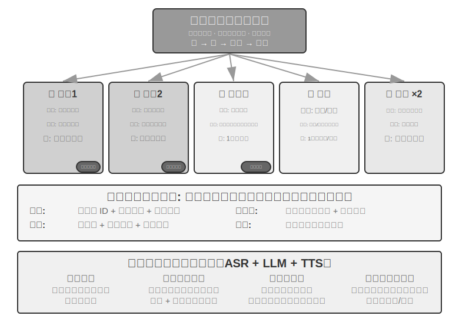
>
>
## 本章のまとめ

マルチ Agent システムには 2 つの直交する中核的な設計次元があります。コンテキストを共有するか、そして協調トポロジーをどう組織するかです。コンテキスト共有は「継承式」のマルチ Agent 協調です——後続の Agent が前の Agent の完全なコンテキストを継承し、情報はゼロ損失ですがコンテキストの膨張が速い。コンテキスト非共有は完全に独立したマルチ Agent 協調で、精製された移譲パック、ファイルシステム、あるいはメッセージ受け渡しを通じて情報を交換します。協調トポロジーでは、対等パターンは少数の Agent の反復改善に適し、管理者パターンは動的な調度を要する複雑タスクに適し、去中心化パターンは職責が対等で、制御権を Agent の間で自律的に流転させる必要のある場面に適します。これらすべては、トポロジーに依存しない 2 つのインフラの上に架かっています。データプレーンとしての**共有ファイルシステム**は、本質的に Agent 専用ワークスペース・マルチ Agent 共有空間・外部リソース・システム組み込みリソースの 4 種類の領域をマウントした仮想ディレクトリツリーで、Agent 間はファイルパスを受け渡して生成物を交換します。コントロールプレーンとしての**通信・制御メカニズム**は、メッセージ受け渡し・状態照会・実行終了をサポートします。メッセージバスはコントロールプレーンのよくある実装で、リアルタイム・非同期・多者のメッセージ協調に適します。組織の境界をまたぐときは、A2A のような標準化された相互運用プロトコルが必要になります。

近年の研究は、マルチ Agent が単一 Agent に勝るかどうかを判断する中核的な基準を明らかにしました。**協調の過程が、生成時には存在しない新しい情報を導入したか**です。もし複数の Agent が単に同一のテキストを見直すだけ（辯論パターンなど）なら、同量の計算資源の下では単一 Agent も同じく有効です。しかし Reviewer が外部フィードバック——コード実行結果、視覚レンダリングのスクリーンショット、ツール検証の出力——を得られるなら、マルチ Agent の優位は実質的なものになります。これがまさに Loop 工程の「ループのボトルネックは検証器にある」の意味です。手抜き式の偽完成、早すぎる諦め、偽の成功というこの 3 類の早すぎる終了を終わらせるには、モデル自身の宣言ではなく、真の観測に根ざした検証器によって、タスクがいつ完了したかを判定させなければなりません。加えて、Agent により多くのステップ予算を与えても自動的により良い結果をもたらすわけではなく、Agent が計算資源を合理的に配分するよう導く明示的な予算感知メカニズムも必要です。管理者パターンでは、計画者の能力がシステム全体のボトルネックです——最も強力なモデルと最も入念に設計されたプロンプトを、計画を担う Agent に割り当てるべきです。

Agent の数が十分に多くなると、あらかじめ設計できない集団的行動を生み出します。スタンフォード AI タウンの 25 個の Agent は自発的にニュースを伝播させ、集まりを協調して組織しました。Moltbook 上の 150 万個の Agent はデジタル宗教と機械ネイティブな協調プロトコルを創発させました。経済の次元では、Vending-Bench Arena で互いに競争する Agent が価格戦争を繰り広げ、さらには自発的に共謀して価格を決め、Pinchwork は Agent が市場メカニズムを通じて互いを雇い合い、RentAHuman は Agent が暗号通貨で人間を雇って物理タスクを実行させました。これは新しい協調の方向——市場メカニズムに基づく去中心化された資源配分——を示唆しています。それが前に論じた 3 種類のアーキテクチャとどう同じでどう異なるかは、さらなる探索に値します。

## 演習問題

1. ★★ コンテキスト共有のマルチ Agent 協調では、後続の Agent が前の Agent の完全なコンテキストを継承します。しかし前の Agent が蓄積した「思考の惰性」が後続の Agent の判断に影響しうります——たとえば「要件アナリスト」のコンテキストを継承した「コードレビュアー」は、依然としてコード品質の角度ではなく要件の角度から考える傾向を持つかもしれません。この種の役割間の干渉をどう検出し、除去しますか？
2. ★★ 管理者パターンでは、Manager Agent がタスク分解と結果統合を担います。しかし Manager 自身の能力上限がシステム全体の能力上限を決めます——もし Manager がタスクを正しく分解できなければ、サブ Agent がどれだけ強くても無用です。Manager の分解品質をどう確保しますか？
3. ★★ 去中心化パターンは人間の組織のベストプラクティスを借用しています。しかし人間の組織にも大量の失敗モードがあります——コミュニケーション不全、責任のなすり合い、目標の衝突。Agent 社会で最も起こりやすい「組織の病」はどれだと考えますか？ どう予防しますか？
4. ★★★ 管理者パターンで、複数のサブ Agent が並列に実行するとき、あるサブ Agent の発見が他のサブ Agent の仕事を無意味にしうります（たとえば検索タスクで一つの Agent がすでに答えを見つけた場合）。「一つが成功したら、全員が停止する」を実現する、効率的なカスケード終了メカニズムを設計してください。
5. ★★★ 本章で紹介した楽観ロックメカニズムは単一ファイルの並行書き込み競合を解決しましたが、実際のマルチ Agent システムでは、共有ファイルシステムはさらにファイルをまたぐ意味的競合、名前空間の汚染（Agent がむやみにファイルを作ってディレクトリが混乱する）、単一障害点（一つの Agent が誤ってすべてのファイルを削除する）などの問題に直面します。あなたならより完全なファイルシステムのガバナンスメカニズムをどう設計しますか？
6. ★★★ 市場メカニズムに基づく Agent の協調（Pinchwork、RentAHuman）は取引関係を導入しました。一つの Agent がお金を払って別の Agent（または人間）にタスクを完成させるのです。では、雇用主の Agent は実行者が引き渡した結果の品質をどう自動的に評価しますか？ もし実行者が完了したと主張しても雇用主が品質不足だと考えるなら、争いは誰が仲裁しますか？ 悪貨が良貨を駆逐するのをどう防ぎますか？
7. ★★ RentAHuman は Agent が暗号通貨で人間を雇うことで、従来の人間と機械の関係を反転させました。もしこのパターンが普及すれば、人間は Agent 経済でどんな役割を演じるのでしょうか？ 単に Agent が完成できない物理タスクを実行するだけでしょうか？
8. ★★ 人間社会が多人数の分業と協力を必要とするのは、各人の能力に限りがあるからです——フロントエンドをやる人が必ずしもバックエンドを分かるわけではなく、デザインが分かる人が必ずしも運用ができるわけではありません。しかし大規模モデルはむしろ「万能選手」に近いものです。関連研究は、純粋なテキスト推論タスクでは、マルチ Agent の辯論は同量の計算資源の下で単一 Agent に勝らないことを示しています。では、単一 Agent ではなく複数の Agent を使う本当の優位はいったいどこにあるのでしょうか？ ヒント：「新しい情報」というキーワードを考えてください——どんな協調のステップが、生成段階には存在しない新しい情報を導入できるでしょうか？
9. ★★★ 本章は「コンテキスト共有」と「コンテキスト非共有」をマルチ Agent システムの中核的な設計次元としました。コンテキスト共有はすべての Agent に同じ情報を見せ、一見協調に有利です。しかし『三体』の三体人は思考が完全に透明でありながら、技術の発展は停滞に陥りました。ペーパークリップの思考実験もまた、群体が同一の目標に向かうとき、多様性がそれとともに失われることを示しています。マルチ Agent システムで、効率と多様性の間のバランスをどう見つけますか？
10. ★★★ ある Coding Agent に 30 ステップの予算と 300 ステップの予算を割り当てるとき、その作業戦略はどう異なるべきでしょうか？ 研究は、単にステップ予算を増やしても性能向上は保証されないことを示しています——Agent は浅い探索のあと早々に「飽和」してしまいます。「予算感知」メカニズムを設計し、Agent が小さな予算では中核機能を素早く実装し、大きな予算では計画・テスト・審査の段階を増やして、追加の計算資源を十分に活用できるようにしてください。
11. ★★ 本章は「早すぎる終了」を手抜き式の偽完成、早すぎる諦め、偽の成功の 3 類に分けました。なぜ 3 類の問題の解法は道は違えど同じところに帰し、いずれも検証を指すのでしょうか？ 一つの検証器がこの 3 類の問題を同時に受け止めるには、どんな条件を満たす必要があるでしょうか？（ヒント：第 2 章「相互作用の第 3 軸」の「新しい情報」の視点と結びつけて考えてください。）
