# モデルのポストトレーニング

本書の核となる公式は Agent = LLM + コンテキスト + ツールです。本章は、この「脳」である LLM を最適化すること、すなわちポストトレーニングを通じてモデルにコンテキストとツールをよりうまく活用させ、それによって Agent システム全体の能力を高めることに焦点を当てます。第 6 章の末尾で述べたように、評価体系とシミュレーション環境はポストトレーニングの 2 つの礎です。評価環境は訓練に練習場を提供し、評価指標は訓練に目標を定めます。本章はこの 2 つの礎の上に成り立っており、いかに本当にモデルの重みを書き換え、能力をパラメータの中に沈殿させるかを論じます。

本章は、強化学習やモデル訓練の背景をまったく持たない読者に向けたものです。あなたが勾配や方策最適化を理解していることを前提とはせず、「一つのモデルはどうやって訓練されるのか」ということ自体から説き起こし、各ステップの目的・原理・それが解決する問題をすべて明確に説明します。この章を読み終えれば、あなたは次のことに答えられるようになるはずです。モデルの能力は何段階で鍛え上げられるのか、各ステップは何をしているのか、なぜこの順序でなければならないのか、そして自分のプロジェクトではどのステップに力を入れるべきなのか。

**まず最も重要な地図を一枚描きましょう。現代のモデルの能力は、3 つの段階を経て鍛え上げられます。** この 3 つの段階は互いに緊密に連なり、一つも欠かせません。

1. **事前学習（Pre-training）**：膨大なインターネット上のテキストで「次の単語を予測する」訓練を行います。このステップにより、モデルは言語の規則性、世界知識、基本的な推論を学びます。それはちょうど、図書館のすべての本を読み終えた人のようなものです。博識ですが、まだうまく質問に答えることはできません。これは最も高価なステップ（しばしば数千万ドル規模）であり、能力の土台でもあります。
2. **教師ありファインチューニング（SFT、Supervised Fine-Tuning、すなわちラベル付けされた「入力—出力」のペアでモデルを訓練すること。先生が模範解答を示して生徒にそれをまねさせるのに似ています）**：数千から数万件の「問題—模範回答」の示範データを使い、モデルに「どんな形式・スタイル・流れで答えるべきか」を教え込みます。このステップは、博識なモデルを、指示を聞き取れて整った出力を返すアシスタントへと変えます。安価で速く安定しており、現在ほぼすべてのデプロイ済みモデルが経るステップです。
3. **強化学習（RL、Reinforcement Learning、すなわちモデルに繰り返し試させ、結果の良し悪しに応じて報酬や罰を与えて行動を改善させること。子犬の訓練に似ています。うまくできたらおやつをあげ、失敗したらあげません）**：もはやモデルに模範解答を見せず、自分で試させ、うまくやった行動の確率を高め、まずかった行動の確率を下げます。このステップにより、モデルは**見たことのない状況**でも合理的な判断を下せるようになります。本章で最も紙幅が大きく、最も工学的な力量を要するステップでもあります。

一つの直感的なたとえ。事前学習は「万巻の書を読む」（知識の蓄積）、SFT は「先生が手取り足取り標準的な解法を教える」（示範の模倣）、RL は「自分で問題を解き、正誤に応じて繰り返し磨く」（試行錯誤による向上）です。三者の関係は三択ではなく、パイプラインです。まず本を読み、次に示範を見て、最後に実戦します。

**本章には終始一貫する 2 本の主線があります。まず覚えておいてください。以降のすべての内容はこの 2 本のために奉仕しています。**

- **主線一：SFT は記憶、RL は汎化。** 同じタスク・同じ予算のもとで、SFT は訓練データの中の答えを**記憶**する傾向があり、ひとたびデプロイ環境が訓練時と異なれば失効しやすくなります。RL は転移可能な一連の方策を**学び取る**傾向があり、見たことのない状況に直面してもより安定します。これはスローガンではなく、測定可能な現象であり、本章では一連の対照実験でこれを繰り返し検証します。7.1 節では一節を割いて、この違いの**根底にある原因**を徹底的に説明します。
- **主線二：データと環境は、アルゴリズムより重要。** これは産業界で最も直感に反し、最も価値のある経験です。既存の RL アルゴリズム（PPO、GRPO など）は使い方さえ分かれば十分で、本当に成否を決めるのは 2 つのことです。**シミュレーション環境**（モデルが練習する場が十分に本物か）と**訓練データ**（示範と報酬信号の質が十分に高いか）です。多くの場面では、SFT のデータ品質さえ十分であれば、RL などまったく必要ないことすらあります。本章では絶えず、あなたの注意を「どのアルゴリズムを調整するか」から「データと環境は正しくできているか」へと引き戻します。

> **読書ガイド**：本章の内容は読者の背景に応じて 2 つの経路に分かれます。
>
> - **Agent アプリケーション開発者**（自分でモデルを訓練する必要はない）：まず冒頭の「事前学習、SFT、RL：3 段階の全景」を読んで全体像を築き、その後に続く 2 つの `[任意読解]` の節（古典的 RL と事前学習の背景）は飛ばして、SFT の節から続けて構いません。「SFT と RL の本質的な違い」「いつ SFT を選び、いつ RL を選ぶか」という意思決定の枠組み、そして「データと環境はアルゴリズムより重要」という判断に重点を置いてください。これらの認識は、Harness 工学における設計上の意思決定（いつプロンプトで解決し、いつファインチューニングに値するか）に影響します。
> - **モデル訓練エンジニア**：最初から順に読んでください。2 つの `[任意読解]` の節は強化学習と事前学習の完全な背景を提供し、以降の実験は再現可能な訓練方法を提供します。

## 事前学習、SFT、RL：3 段階の全景

引言（はじめに）で 3 段階の地図を示しました。この節では各ステップの仕組みを徹底的に説明します。3 つの段階で使う**データ**、**最適化目標**、**コスト**はそれぞれ異なり、それらの異同を理解することが本章全体を読み解く鍵です。表7-1 でまず全体像を示し、続いて一つずつ展開します。

表7-1 モデル能力を鍛え上げる 3 つの段階

| 段階 | 何のデータを使うか | 最適化目標 | 何を学ぶか | 典型的なコスト |
|------|---------------------|-----------------------|------------------------|---------------------|
| **事前学習** | 膨大な生のインターネットテキスト | 次の単語を予測 | 言語規則、世界知識、基本的な推論 | 極めて高い（数百万〜数千万ドル） |
| **SFT** | 数千〜数万件の「入力—出力」示範ペア | 次の単語を予測（回答部分にのみ損失を計算） | 指示遵守、出力形式、スタイル、フロープロトコル | 低い（数時間〜数日） |
| **RL** | タスク + 報酬関数（模範解答なし） | 期待報酬を最大化 | 転移可能な意思決定方策、探索で見つけた新しい解法 | 高い（しばしば SFT の数十〜百倍） |

### 事前学習は何をしているのか：次の単語を予測する

現代の大規模モデルのすべての「知能」は、意外なほど単純なタスクの上に築かれています。**次の単語を予測すること（Next Token Prediction、NTP）**です。

モデルにあるテキストの前半部分を見せ、次の token が何かを当てさせます。たとえば「中国の首都は」と入力すれば、モデルは「北京」に高い確率を与えるべきです。モデルは一度当てるたびに、自分の予測と本当の次の token を比較し、その差（損失、Loss と呼ぶ）が大きいほど、より力を入れてパラメータを調整し、次は似たような文脈でより正確に当てられるようにします。数兆 token のインターネットテキストの上で繰り返しこれを行ううちに、モデルは文法、事実、論理、さらには基本的な推論までも学ばざるを得なくなります。膨大な文脈で次の単語を当て続けるには近道はなく、テキストの中の規則性を本当に「消化」するしかないからです。

一つ覚えておくべき重要な点があり、それは SFT と RL まで一貫して貫かれます。**モデルの出力は本質的に一つの確率分布である**、ということです。前文が与えられると、モデルは語彙の中のあらゆる可能な token に確率を与えます。いわゆる「訓練」とは、突き詰めれば**この確率分布を調整すること**にほかなりません。私たちが望む token の確率を高め、望まない token の確率を下げるのです。3 つの段階の違いは、ただ「何を望むか」、そして「何の信号で望むものを定義するか」だけにあります。

事前学習の後、モデルは博識ですが使いにくい状態です。質問すると、答えるのではなく、さらに多くの質問を続けて書くかもしれません。インターネットのテキストでは、ある質問の後にはしばしば別の質問が続くからです。モデルはまだ「質問されたら答えるべき」というプロトコルを学んでいないのです。

### SFT の本質：データを差し替えた「次の単語を予測」

これは本章で最初に打ち抜くべき重要な認識です。**SFT は数学的には事前学習とまったく同じタスクです。どちらも次の単語を予測し、同じ損失関数を最小化します。** 多くの初学者は SFT をまったく新しい手法だと思っていますが、そうではありません。SFT と事前学習の違いはたった 2 点だけです。

1. **データが違う。** 事前学習は生のインターネットテキスト（構造がなく、何でもある）を使い、SFT は人間が入念に用意した「入力—出力」ペアを使い、その形式は「ユーザーの質問 → 理想的な回答」に統一されています。モデルはこれらの示範の上で「次の単語を予測」し続けることで、「質問されたときにどう回答を組み立てるか」というプロトコルを学び込むのです。
2. **損失は「回答」の上だけで計算する（loss masking、損失マスキング）。** 1 件の SFT サンプルには質問とラベル付けされた回答の 2 つの部分が含まれます。私たちはモデルに「どう質問するか」を学ばせたいのではなく、「どう回答するか」だけを学ばせたいので、損失を計算する際は質問部分の token をマスクし、回答部分にのみ勾配を逆伝播させます。これが SFT が工学的に事前学習と異なる唯一の実質的な違いです。

この点を理解すれば、「SFT は記憶」ということも自然と腑に落ちます。SFT の最適化目標は**ラベル付き回答の中のあらゆる token の確率をできる限り高くすること**、平たく言えば「この模範解答を暗記すること」です。同じ質問が与えられれば、できる限り一字一句たがわず示範を再現するように訓練されます。これは目標が明確で形式が固定されたタスクでは極めて効率的（数千件のサンプルで効果が出る）ですが、能力の境界も示範データに釘付けにされます。示範にない状況は学んでおらず、示範の答えがひとたび通用しなくなっても（環境が変わっても）、相変わらず暗記どおりに答えてしまいます。

一言で SFT の本質をまとめると、**極めて高いサンプル効率で、一組の安定した「入力→出力」の写像とプロトコルをパラメータに固定化すること**です。それが固定化するのは「形式・スタイル・流れ」といった**プロトコル的知識**（どう言い、どうするか）であって、大量の**事実的知識**（何を知っているか）ではありません。後者は事前学習か RAG に頼るしかありません（本章末でこの区別に立ち返ります）。

> **訓練コスト：LoRA パラメータ効率的ファインチューニング**。上記の SFT も後述の RL もモデルパラメータを更新しますが、全パラメータのファインチューニングは VRAM への要求が非常に高くなります（数十億のパラメータすべてに勾配とオプティマイザの状態を保存する必要があるため）。**LoRA**（Low-Rank Adaptation、低ランク適応）は最もよく使われる節約法です。元の大きな重み行列には手をつけず、その脇に小さな「パッチ」（低ランク行列）を付けてタスクを学習します。パラメータ量は元の 1%〜5% にすぎませんが、全パラメータファインチューニングに近い効果を出せます。元の重みが凍結されているため、LoRA は基盤モデルが既に持つ能力への攪乱も小さく、破滅的忘却のリスクも低くなります。検証済みの実践的な経験がいくつかあります[^ch7-1]。**必ず** LoRA をすべての主要な重み行列（とりわけパラメータ比率が最大の MLP 層）に適用しなければなりません。アテンション層だけに加えると性能が落ちます。**最適な学習率はおよそ全パラメータファインチューニングの 10 倍**です（SFT でも RL でも成立し、非常に実用的な移転規則です）。SFT では中〜高ランク（64〜256）を使い、RL では毎ラウンドの情報量が非常に小さいため小さいランク（8〜32）、さらには rank=1 でも十分です。デプロイ時には 1 台の推論サーバーが複数の LoRA アダプターを同時にロードしてマルチテナントサービスを行えます。本書では LoRA をすべてのポストトレーニング手法を貫く工学的なデフォルト項目とみなし、以後は個別に展開しません。

### なぜ必ず先に SFT、後に RL でなければならず、逆ではいけないのか

3 段階の順序は恣意的なものではありません。事前学習が最前に来ることに異論はありません。言語と知識の土台がまずなければ、後は何も語れないからです。本当に説明が必要なのは、**なぜ SFT が RL の前でなければならないのか**という点です。

答えは RL の働き方の中に隠れています。RL は模範解答を見ず、モデルに**自分で回答を生成**させ、その良し悪しに応じて報酬や罰を与えます。ところが良し悪しを判断するには、まずモデルの出力を**解析できる**必要があります。もしタスクが JSON の出力や一度のツール呼び出しを要求しているのに、モデルが吐き出すのが形式のめちゃくちゃなテキストの塊であれば、報酬関数はそもそも計算のしようがなく（「成功か失敗か」すら判断できず）、RL も学びようがありません。

そこで SFT はここで「**まず話をなめらかにする**」役割を演じます。少量の示範で出力形式を安定させ、確実に解析できるようにすることで、RL がようやく採点できる出発点を得るのです。これが業界で最も堅牢な**「先に SFT、後に RL」**の 2 段階パラダイムです。逆に先に RL、後に SFT はうまくいきません。安定した出力がなければ、報酬信号は一面のノイズにすぎないからです。中国画の言い方を借りれば、SFT がまず「**形**」（形式、構造）を立て、RL がその後「**神**」（方策、汎化）を追求する、すなわち**先形後神**（まず形、後に神）です。

一つ重要な境界条件があります。「必ず先に SFT」は「**比較的小さな基礎モデル + 厳格な構造化出力**」という設定のもとで成立します（実験 7-11 で見るように、Llama-3.2-Vision-11B というクラスは SFT を経ずに直接 RL するとまったく失敗します）。しかし基礎モデルが十分に強ければ、最初から合格点の出力を生み出せるかもしれず、それによって SFT を飛ばせます。DeepSeek-R1-Zero はまさに、強い基盤モデルが直接 RL で成功し、反省や長い連鎖思考を自ら創発できることを証明しました。その代償は出力の可読性が悪く、中国語と英語が入り混じることで、そのため DeepSeek は最終的に R1 では「コールドスタート SFT」を加え直し、「形」を改めて立て直しました。R1 が Zero からコールドスタートへと往復したことは、まさに「先形後神」の最良の脚注です。

### SFT と RL の本質的な違い（本章で最も重要な一枚の表）

先ほどから繰り返し「SFT は記憶、RL は汎化」と言ってきましたが、ここでその根底にある原因を一度で徹底的に説明します。両者のあらゆる違いは、すべて**最適化目標の違い**に由来します。

- **SFT が最適化するのは「模範解答にどれだけ似ているか」です。** 目標はラベル付き回答の確率を最大化すること（最尤）です。ある問題に対して「正しい」出力はただ一つ、示範の答えだけであり、モデルはこの一つに逼近するよう引っ張られ、学ぶのは「この種の入力を見たら、あの種の出力を吐く」という固定的な写像です。だから**記憶**します。訓練時に J/Q/K をすべて 10 とすれば、「J/Q/K を見たら 10 を使う」と暗記し、テスト時に J が 11 に変わっても相変わらず 10 を使い、間違えます。
- **RL が最適化するのは「結果が良いかどうか」です。** 目標は期待報酬を最大化することです。ある問題に対して、高い報酬を得られる**どんな**出力も良く、一つに限りません。モデルは自分で複数の経路を探索し、どれであれ結果の良いものを強化し、学ぶのは「どんな過程が正しい結果を得られるか」というより汎用的な**方策**です。J が 11 に変わったとき、記憶の中の答えを当てはめるのではなく、同じ一組の方策で計算し直します。これが**汎化**です。

表7-2 SFT と RL の本質的な対比

| 次元 | SFT（教師ありファインチューニング） | RL（強化学習） |
|----------|-----------------------------------------|--------------------------------------------|
| 最適化目標 | ラベル付き回答の確率を最大化（最尤） | 期待報酬を最大化 |
| 訓練信号 | 唯一の模範解答（各 token に教師信号あり） | 自分で生成した複数の回答 + 報酬（各回答に成否信号が一つだけ） |
| データ形態 | 「入力—出力」示範ペア | タスク + 報酬関数（模範解答不要） |
| 学ぶもの | 固定的な「入力→出力」写像（記憶） | 転移可能な意思決定方策（汎化） |
| 分布ドリフト下 | 環境が変わると古い答えを当てはめ、性能低下 | 同じ方策で解き直し、より安定 |
| サンプル効率 | 高い（数千件で効果） | 低い（しばしば SFT の数十〜百倍） |
| 訓練の安定性 | 高い、収束が速い | 低い、振動しやすく、慎重な調整が必要 |
| 最も適する | 形式/スタイル/流れの固定化、高品質な示範がある、環境が安定 | 新しい場面への汎化が必要、最適方策の探索、ラベル付けコストが高すぎる |

さらに深い、しかし知っておく価値のある仕組みがあります。**mode-seeking（峰探し）**と呼ばれ、RL がなぜ「少数のいくつかの良い方策に収束する」のかを説明します。モデルがある問題に対して持つあらゆる可能な回答は一つの確率分布を成し、この分布には多くの「峰」があるかもしれません（各峰は一種の合理的な回答の仕方です）。SFT が使う最尤は **mass-covering（覆い尽くし型）**です。示範に現れたすべてのモードを覆おうと努め、たとえ質の平凡なモードにも確率を分け与えます（「万遍なく恵みを与える」）。RL（とりわけ KL 制約付きの方策最適化。その数学的形式は**逆 KL ダイバージェンス**に対応し、後述の RLHF の節で詳しく説明します）は **mode-seeking** です。報酬が最も高い少数の峰を見つけ、確率をそこに集中させ、他は思い切って捨てます（「勝者総取り」）。これこそ、RL を経たモデルの回答がより「断定的」で、高品質な方策に集中する理由であり、また RL が多様性を犠牲にしやすい理由でもあります。mass-covering と mode-seeking というこの一対の概念を覚えておいてください。KL ダイバージェンスの節で、これを使って一見退屈だが実は重要な設計上の選択を説明します。
**なぜ RL の上限は SFT より高いのか。——それが「オンライン」だからです。** これは SFT と RL のさらに一段深い違いであり、RL がそれほど高価な理由の根本でもあります。SFT は**オフライン（offline）**の手法です。固定された一つの示範データからしか学べず、データの外の世界を決して見ることができません。RL は**オンライン（online）**の手法です。モデル自身に登場して回答を生成させ、フィードバックに応じて改善させ、試しながら学びます。（「オンライン/オフライン」と、より厳密な「オンポリシー/オフポリシー、on-policy / off-policy」という用語は、7.8 節で正式に区別します。ここではまず直感を築きます。）「オンライン」は SFT が生まれつき得られない 3 つの利点をもたらし、それらが共に上限を押し上げます。

- **その一、オフラインの天井はデータ、オンラインの天井はタスク。** SFT の最良の結果は示範を「完璧に再現する」ことなので、その上限は**示範者の水準**であり、せいぜい逼近するだけで、超えることはほぼ不可能です。60 点の先生がラベル付けしたデータからは、90 点の生徒は訓練できません。RL は示範を見ず、結果報酬だけを見ます。**どんな**行動でもより高い報酬を得られれば強化されます。たとえ誰も演じてみせたことがなくてもです。こうして RL は**示範にまったく存在しないより優れた方策を自ら発見**できます。本章後半の実験 7-13 の SimpleVLA では、モデルが自作した「押し切り」動作は人間の演示に一度も現れておらず、まさに「示範を超える」直接の証拠です。RL の上限はタスクそのもの（報酬が何を認められるか）によって決まり、データにたまたま何があるかによっては決まりません。
- **その二、「検証」は「生成」より容易であり、これが RL が高みに手を伸ばせる根本理由です。** SFT は誰かが**まず良い答えを書き出して**示範とする必要があります。RL はある答えの良し悪しを**判断できる**（報酬を与える）だけでよいのです。多くのタスクでは「正誤を判断する」ことが「正しい答えを書く」ことよりはるかに容易です。数学の問題は答えを照合でき、コードはテストを走らせられ、定理証明器は検証できます。「良いものを認識する」ことが「良いものを作る」ことより容易でありさえすれば、RL はいかなる既存の示範者よりも強いモデルを訓練できます。モデルが自分でいろいろ試し、環境が良いものを選び出して強化するのです。この「検証—生成の非対称性」こそ、RLVR のような検証可能報酬手法の威力の源です。
- **その三、オンラインはモデルを、自分が実際に歩く道の上で練習させ、自分の誤りから這い上がることを学ばせます。** オフラインの模倣には**共変量シフト（covariate shift）**という古典的な弊害があります。生徒が自分で歩くと示範から外れ、データにない状態に入ってしまいますが、そこからどう軌道に戻すかを学んだことがないため、誤差が軌跡に沿ってどんどん膨れ上がります（理論的には、純粋な模倣の誤差は軌跡長 T に対しておよそ $T^2$ で増加しますが、オンラインデータで訓練するとおよそ $T$ まで抑えられます）。オンライン手法はちょうど逆です。モデルが訓練時に歩くのは、まさにデプロイ時に歩く分布であり、一歩ごとのフィードバックが今の本当の弱点に正確に当たります。データは常に「新鮮」で、オフラインデータのように他人（教師）の行動を記述したもの、モデルの進歩とともにますます無関係になっていくものとは違います。本章後半の On-Policy Distillation（7.12 節）が強いのは、本質的にはこの「オンライン」の利点と、SFT の「密な教師信号」の利点とを一つに合わせたからです。

一つたとえてみましょう。**SFT は他人が描いた地図の上でなぞり書きをするようなもので、せいぜい地図と同じくらいにしかなれません。RL は自分でコンパス（報酬）を手に道を探すようなもので、地図の外へ出る可能性があります。** これが「先に SFT で土台を作り、後に RL で高みに手を伸ばす」が主流の処方になった理由です。

この全景図があれば、以降のどの節も位置づけられます。すぐ後に続く 2 つの `[任意読解]` の節――「古典的 RL Agent から現代 Agent へ」と「モデル事前学習の基礎」――は、より深く学びたい読者に強化学習と事前学習の背景を補います。すぐにポストトレーニングに取りかかりたい読者はそれらを飛ばし、SFT の節から直接始めて構いません。

## 古典的 RL Agent から現代 Agent へ `[任意読解]`

### Agent と環境の相互作用

**強化学習（Reinforcement Learning, RL）**の核心は、最大の**累積報酬（Cumulative Reward）**を得るために、現在の状況に応じてどう行動を選ぶかを学ぶことにあります。将棋を学ぶ AI を想像してください。一手打つごとに一つの行動であり、勝てば正の報酬、負ければ負の報酬を得て、累積報酬は一局全体の総収益です。Agent は環境と絶えず相互作用します。各ステップで、Agent は現在の状態を観察し、一つの行動を選び、環境は新しい状態を生み出して報酬を与えます。

この相互作用をより直感的に理解するために、下図は標準的な RL ループを示しています。Agent は各時間ステップで環境の状態を観察し、行動を出力し、環境はそれに応じて報酬を与えて新しい状態に遷移します。

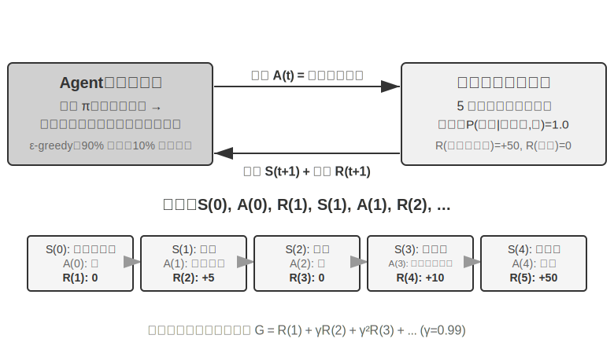

相互作用は**軌跡**を生みます。すなわち「状態→行動→報酬→新しい状態→行動→報酬……」の完全な記録であり、方策の優劣は最終的に軌跡の質に現れます。**価値関数（Value Function）**が答えるのは次のような問いです。「もし今この状態にいて、現在の方策に従ってずっと行動し続けたら、最終的に合計でどれだけの報酬を得られるか」。これはちょうど、経験豊富な棋士がある局面を見たとき、最後の一手まで計算しなくても、直感でこの一局の勝率を見積もれるのに似ています。（ここでの「現在の方策」を「最適方策」に置き換えると、得られるのが最適価値関数で、本章後半で Bellman 最適方程式を説明する際に使います。）Agent と環境の境界は簡潔な原則に従います。**Agent が任意に変えられないものは、すべて環境に属する**のです。

強化学習が教師あり学習（正しい答えのラベル付けが必要）と教師なし学習（データの中の隠れたパターンを発見する）と区別される 2 つの独特な特徴は、**試行錯誤探索**（Agent は自分でどの行動が良いかを手探りせねばならず、先生が直接正解を教えてくれない）と**遅延報酬**（行動の影響は数ステップ後に初めて現れるかもしれない。たとえば一手の好手の価値は終局になって初めて分かる）です。ここからさらに独特の**探索と活用のトレードオフ（Exploration-Exploitation Tradeoff）**が生じます。慣れた道ばかり歩けば新しいことは学べず、めったやたらに試し続ければ永遠に終点に着けません。

強化学習システムは 5 つの核となる要素を含みます。

- **行動空間**：Agent が取りうるすべての行動の集合を定義します。行動は離散的（将棋の「どこに打つか」のように選択肢が有限）でも連続的（ロボットの「関節を何度回すか」のように連続値）でもあり得ます。
- **方策**：Agent の行動準則で、与えられた状態でどうすべきかを規定します。方策は非常に単純（一つのルックアップテーブル。状態 A を見たら行動 X を実行）でも、非常に複雑（一つの深層ニューラルネットワーク）でもあり得ます。
- **報酬信号**：環境が与える即時のフィードバック。ただし Agent の目標は即時報酬ではなく長期報酬を最大化することです。この区別はきわめて重要で、投資が今日の値動きだけでなく長期的なリターンを見るべきなのと同じです。
- **価値関数**：ある状態から出発して将来合計でどれだけの累積報酬を得られるかを推定し、即時のフィードバックがないときに Agent が賢明な判断を下すのを助けます。過去 60 年の RL 研究で最も重要な認識の一つが、価値推定の中心的な位置づけです。
- **環境モデル**（任意）：環境が行動に対してどう応答するかを予測します。環境モデルを持つ手法を**モデルベース手法**（まず環境がどう変化するかを予測し、それに基づいて計画する）と呼び、環境モデルを持たないものを**モデルフリー手法**（環境を予測せず、経験から直接学ぶ）と呼びます。

表7-3 はさまざまな Agent システムの主要な構成要素を対比し、Agent という概念の普遍性を明らかにし、読者が従来型 RL Agent と現代の LLM Agent の行動空間における違いを見て取れるようにします。

表7-3 異なる Agent システムの主要要素の対比

| Agent の種類 | 環境 | 行動空間 | 報酬信号 |
|---------------|---------------------|----------------------------------|-------------------------|
| **生まれたばかりの子ガゼル** | 地形、重力、体の姿勢 | 連続高次元（各筋肉群の収縮） | バランス(+)、転倒(-) |
| **掃除ロボット** | 部屋のレイアウト、電池残量 | 離散（方向、吸引、充電） | 清掃面積(+)、電池切れ(-) |
| **チェスの名人** | 盤面の状態、時間制限 | 離散有限（合法手） | 勝ち(+1)、負け(-1) |
| **カスタマーサービス Agent** | 対話履歴、知識ベース | オープンエンド（思考、発話、API 呼び出し） | 問題解決(+)、処理時間(-) |
| **コードアシスタント Agent** | 要件文書、コードベース | オープンエンド（思考、検索、編集、実行） | テスト合格(+)、bug 混入(-) |

この表は一つの重要な洞察を明らかにします。従来型 RL Agent（チェス、ロボット）の行動空間は閉じていますが、LLM ベースの現代 Agent（カスタマーサービス、コードアシスタント）の行動空間は開かれており、ほぼ無限で、しかも「内部思考」という特殊な行動を利用して能力を高められるのです。

### 2 つの Agent パラダイム：MDP から LLM+RL へ

両者の最も根本的な違いは行動空間にあります。MDP は行動空間が有限かつ閉じている（上へ/下へ/取る/置く）と仮定しますが、LLM の行動空間は開かれた、組み合わせ爆発する自然言語の系列です。この違いが、2 つのパラダイムのアルゴリズム設計、サンプル効率、汎化能力における根本的な分岐を決めています。以下でそれぞれ展開します。

**従来のパラダイム：MDP と Q-learning。**

MDP（Markov Decision Process、マルコフ決定過程）は強化学習の数学的枠組みで、状態、行動、報酬などの核となる要素を定義します。その核心的な仮定は**マルコフ性**です。未来は現在の状態にのみ依存し、それより前の履歴とは無関係です。たとえるなら、将棋では現在の盤面だけを見れば最適手を決めるのに十分で、それ以前の一手一手をどう打ったかを振り返る必要はありません。この仮定は問題を単純化しますが、履歴依存性のモデリング能力も制限します。

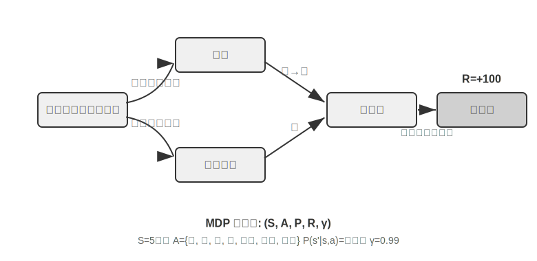

従来型 RL Agent の主要な特徴は**閉じた行動空間**です。Agent が取りうるすべての行動が、あらかじめ定義された有限の集合を成します。**古典的なチェス系 Agent** が最も典型的な例です。囲碁の 361 の着手位置は膨大ですが完全に確定的で有限、チェスは異なる駒の移動規則を考えても行動はやはり列挙可能、Atari ゲームは数個から十数個の離散的な行動しかありません。**ロボット Agent** は連続だが有界な行動空間を代表します。関節角度、速度、把持力は連続値ですが、いずれも明確な物理的境界（最大回転角度、最大トルク、速度制限）を持ち、次元はロボットの自由度によって決まります。

この閉じた性質は計算上の利点をもたらします。すべての行動を列挙して一つずつ評価でき、動的計画法やモンテカルロ木探索に適し、行動価値関数を表や単純な関数で近似できます。しかしそれは表現力と汎化能力も制限します。従来型 RL Agent はゼロから始め、純粋に試行錯誤に頼って学びます。ランダムな方策から出発し、経験を集め、価値関数や方策を更新し、収束するまでこれを繰り返します。

この枠組みのもとで、最も基礎的かつ重要なアルゴリズムの一つが **Q-learning** です。それは各「状態-行動」の組み合わせに対して一つの価値推定を保持します。状態 s で行動 a を取り、その後ずっと最適方策に従って行動したら、合計でどれだけの報酬を得られるか。直感的には、ある行動が良いかどうかは、それがもたらす即時のリターンに、「それがあなたを連れて行く次の状態がどれだけ良いか」を加えたもので決まります。

この直感を等式に書くと、RL の教科書で名高い**ベルマン方程式**（Bellman equation）の核となる再帰関係になります。**ある行動の真の価値 = このステップで得られる即時報酬 + 次の状態に到達した後に得られる最大の未来価値**：

$$Q^*(s, a) = r + \gamma \max_{a'} Q^*(s', a')$$

ここで $r$ は即時報酬、$s'$ は行動を実行した後に到達する次の状態（ここでは直感のため決定論的な形で書いています。確率的な環境では次の状態 $s'$ について期待値を取る必要があります）、$\gamma \in [0, 1)$ は**割引因子**です。それは Agent が未来をどれだけ重視するかを決めます。$\gamma$ が 1 に近いほど長期のリターンを重視し、0 に近いほど目先だけを見ます。前文で繰り返し出てきた「累積報酬」とは、まさに各ステップの報酬を $\gamma$ で逐次割り引いた総和 $\sum_{t} \gamma^{t} r_t$ です。アルゴリズムは行動のたびに、古い推定値を「実際に起きた結果」の方向へ少しだけ微調整します。この「一歩の実際の結果で古い推定を修正する」パラダイムを**時間差分学習**（Temporal-Difference Learning, TD learning）と呼び、何千何万回もの試行錯誤を経て、推定値は徐々に真の値に逼近します。

以下の 2 枚の図は、それぞれ Q-learning のグリッドワールドにおける探索過程と Q 値の段階的な収束を示します。

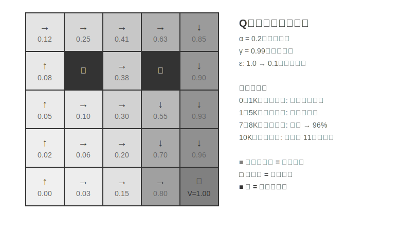

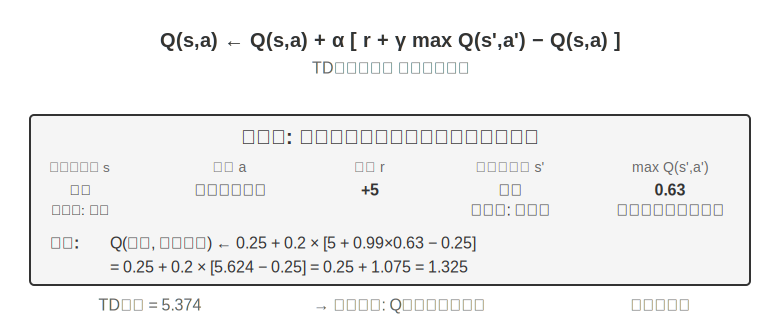

Q-learning は特殊な**オフポリシー**（Off-Policy）手法に属します。任意の方策（ランダム探索を含む）が生み出したデータを使って最適方策を学べます。オンポリシー/オフポリシーの厳密な定義と LLM ポストトレーニングにおける対応関係は、後述の「強化学習アルゴリズムの比較」の節を参照してください。

> **実験 7-1 ★：宝探しゲームにおける Q-learning の性能**
>
> Q-learning の特性と限界を検証するため、**宝探しゲーム環境**を設計しました。この環境はいくつかの重要なチャレンジを含みます。**隠れた仕組み**は Agent に鍵と扉の対応関係、武器の効果、アイテムの合成規則を自力で発見することを要求します。**多段階依存**は、タスクの完了に正しい行動系列が必要であることを意味します（最適解は 11 ステップ）。**疎な報酬**は、重要な行動と最終的な勝利にのみ顕著な報酬があり、途中の大部分のステップは何のフィードバックも得られないことを意味します。
>
> Q-learning Agent は標準的なパラメータ設定を用い、ε-貪欲探索方策（大半の時間は現在の最適行動を選び、たまにランダムに試し、訓練が進むにつれてランダム探索の比率を徐々に減らす）を採用します。
>
> 学習曲線は典型的な特徴を示します（episode は開始から通関または失敗までの一局の完全なゲームを指します）。
> - **最初の 1000 episodes**：勝率 0%、Q テーブルはわずか 124 状態、Agent は闇雲に探索
> - **最初の 5000 episodes**：依然として安定した勝利はなく、Q テーブルは 133 状態
> - **7000-8000 episodes**：勝率が 34% から徐々に 96% まで上昇
> - **10000 episodes**：勝率 100%、Q テーブルは 145 状態、11 ステップの最適解を発見
>
> 訓練全体はわずか 10 秒足らず（シミュレーション効率は極めて高い）ですが、1 万回近い完全な試行を要します。これは Q-learning の核となる特徴を示しています。完全な経路をたまたま通り抜けるには大量のランダム探索が必要で、価値信号の伝播は非常に遅く、繰り返し強化しなければなりません。純粋な記号的学習は、事前知識がなければ状態空間を力任せに探索するしかありません。
>
> ゲームシミュレータでは、1 万回の試行錯誤にわずか 10 秒しかかからず、コストはごくわずかです。しかし現実世界の Agent の場面では――電話一本ごとにコストがあり、ブラウザ操作一回ごとに遅延があり、誤った判断一つが取り返しのつかない結果を招きかねない――1 万回の試行錯誤はまったく受け入れられません。これこそ、現代の Agent が LLM ベースの手法へ転向した理由です。事前学習で蓄積した知識を活用し、ごくわずかな相互作用で有効な判断を下すのです。
>
> MDP の根本的な限界は 3 点あります。サンプル効率が低い（単純なタスクを学ぶのに膨大な相互作用が必要）、汎化能力が乏しい（ある環境で学んだ知識を別の環境に移すのが難しい）、事前知識を活用できない（新しいタスクごとに一から学び直す）。ひとたび自然言語や高次元の視覚のような複雑な状態空間に直面すると、これらの限界はとりわけ顕著になります。
>

**現代のパラダイム：LLM+RL ベースの Agent。**

大規模言語モデルはまったく新しい Agent パラダイムをもたらし、Agent の構築の仕方を根本的に変えました。とりわけ行動空間の設計をです。

従来の RL の Agent は、環境を変えることでしかフィードバックを得られませんでした。次の一手を打つ、迷路を一歩進む。しかし LLM はまったく新しい種類の行動をもたらしました。内部思考です。思考は外部世界を変えませんが、最終的な行動の質を著しく改善できます。この転換はすべてを変えました。Agent の行動空間はもはや「何をするか」だけでなく、「どれだけ考えるか、何を考えるか」をも含むようになったのです。

最も重要な革新は、**思考（Thinking）を一種の特殊な行動として**行動空間に組み込んだことです。従来の RL では、Agent は環境の状態を変える外部行動（移動、攻撃、拾得）しか実行できませんでした。しかし LLM Agent では、**内部思考が行動空間の核となる構成要素**になります。それは外部環境を直接変えず、即時報酬がなく、回数もほぼ無制限で、コストも比較的低いのです。

従来の RL がこの種の行動を扱いにくいのは、探索空間が大きすぎて構造を欠くことに根ざしています。ゼロから学ぶ Agent は、目隠しをして砂漠で宝を探すようなもので、ランダムに突き当たるしかありません。LLM は違います。膨大なテキストの事前学習を通じて、人類が蓄積してきた思考の規則をすでに内在化しています。数学の問題を解くときは「条件を認識→公式を思い出す→段階的に計算」に従い、コードを書くときは「要求を理解→構造を設計→細部を実装」に従います。これにより LLM の思考は構造化された経路に沿って進み、探索空間を大幅に圧縮します。したがって追加の RL 訓練がなくても、事前学習後の LLM は基本的な論理を備えた思考連鎖（Chain of Thought, CoT）を生成できます。この基本的な論理は、事前学習コーパスの中の膨大な人類の思考過程（数学の問題解答、コードのコメント、討論の応答など）から来ており、モデルは next-token prediction を通じて「次のステップはどんな推論の形態であるべきか」を暗黙的に学びました。

RL のポストトレーニングは、外部報酬を通じて LLM に特定のタスクでこれらの規則をより効率的に運用することを教えます。言語構造そのものも一種の暗黙的な内部報酬を提供します。論理的に一貫した思考連鎖（たとえば「外貨を米ドルに換算する必要があるので、第一歩は為替レートを調べる」）は生成確率が高く、論理の乱れたもの（たとえば「通貨を換算する必要があるので、まず天気を調べる」）は確率が極めて低く、モデルを合理的な経路へと自然に導きます。

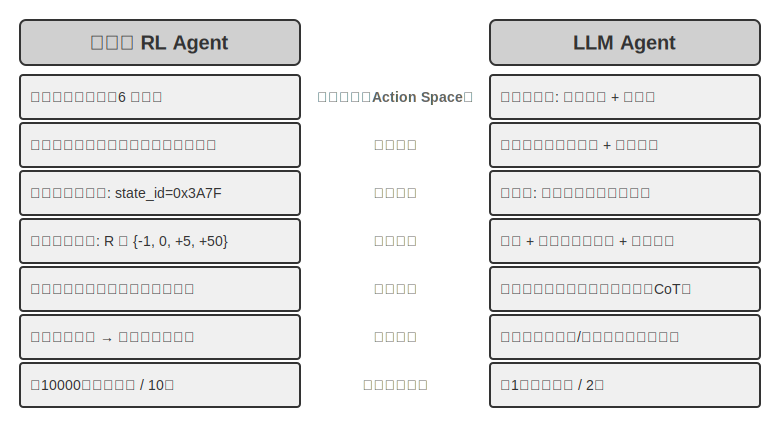

この言語の内在的な規則に基づく思考能力によって、LLM Agent は見たことのない指示を理解でき（ゼロショット汎化）、ごく少数の例で新しいタスクを習得できます（少数ショット適応）。これは従来の MDP Agent が大量の試行錯誤を必要とするパラダイムとはまったく異なります。さらに新しいパラダイムは、組み合わせ汎化（既知の概念を再構成して新しい状況に対応する）、文脈内学習（プロンプトと例を通じて素早く適応する）、マルチモーダル理解（視覚、言語、行動などのモダリティを自然に統合する）などの能力も備えています。注意すべきは、文脈内学習の**効果**（ゼロショット汎化、少数ショット適応）とその**内部機構**は別物だということです。第 2 章で分析したように、アテンション機構の働き方は推論というより検索に近いのですが、それがタスク適応において強力な実際の効果を生むことを妨げはしません。

閉じた行動空間から開かれた行動空間への進化は、AI Agent パラダイムの根本的な転換を反映しています。内部思考のほかにも、ツールパラメータの多様性（自然言語クエリ、プログラムコード、複雑な JSON、マルチモーダルコンテンツ）が実際の行動空間を無限に近づけます。コードインタプリタは理論上あらゆる計算可能なタスクを実行でき、検索ツールはインターネット全体の情報空間を探索できます。これは新しい機会をもたらす（Agent が前代未聞のタスクを処理でき、基本ツールを組み合わせて複雑な問題を解決できる）と同時に、新しい課題ももたらします（開かれた環境でいかに報酬関数を定義・最適化するか、無限の行動空間でいかに効率的に探索するか）。

Kimi K3 のようなツール呼び出しと長い連鎖思考のために最適化されたモデルを例にとると、LLM+RL パラダイムの典型的な方向が見て取れます。大規模な言語事前学習の基盤の上に、ポストトレーニングを通じて問題分解、ツール呼び出し、自己修正の能力を強化するのです。**OpenVLA**（詳細は第 9 章）は、LLM 時代の VLA（視覚-言語-行動）アーキテクチャのパラダイムを示します。視覚エンコーダが環境の観察を処理し、言語モデルが指示を理解して推論し、行動デコーダが制御信号を生成し、言語条件付き制御とタスク横断的な汎化を実現します。明確にしておくべきは、OpenVLA 自体は百万件近いロボットの**演示軌跡**の上で模倣学習（行動クローニング）によって訓練されており、RL ではなく SFT の性質を持つということです。RL を本当にロボットに導入し、この種の VLA アーキテクチャの上に報酬でさらに最適化を加えた代表例が、本章後半の実験 7-13 の SimpleVLA-RL です。

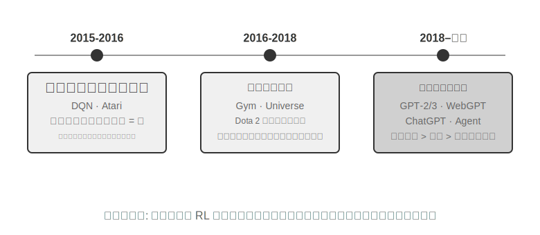

**OpenAI の探索の道のり**（姚順雨（プリンストン大学助教授、ReAct 論文の著者）が『The Second Half』で詳細に記録）は、認識上の変遷を明らかにします。**第一段階（2015-2016）アルゴリズム中心主義**：より良いアルゴリズムこそが鍵だと信じ、Atari などの標準環境で進展を得ましたが、新しい環境に変えると一から訓練し直す必要がありました。**第二段階（2016-2018）環境の重要性**：Gym が各種タスクを標準化し、Universe と World of Bits はインターネット全体を RL の訓練環境に変えようと試み、Dota 2 は特定の複雑な環境で超人的なパフォーマンスを追求しました。着想は明快でしたが、汎用的なコンピュータ使用とウェブナビゲーションはずっと突破できませんでした。

**第三段階（2018 年から現在）事前知識の目覚め**：GPT-2/GPT-3 は言語事前学習の強大な力を示し、WebGPT、ChatGPT はこれらの事前知識が実用的な Agent に転化できることを証明しました。最も重要な発見は、**事前知識は RL とはまったく無関係な方法で獲得できる**ということです。これは直感に反する真実です。数十年来、RL 研究者たちの優先順位はまったく逆さまだったかもしれないのです。アルゴリズム > 環境 > 事前知識ではなく、事前知識 > 環境 > アルゴリズムなのです。

> **実験 7-2 ★★：従来型 RL と LLM Agent の比較研究**
>
>
> 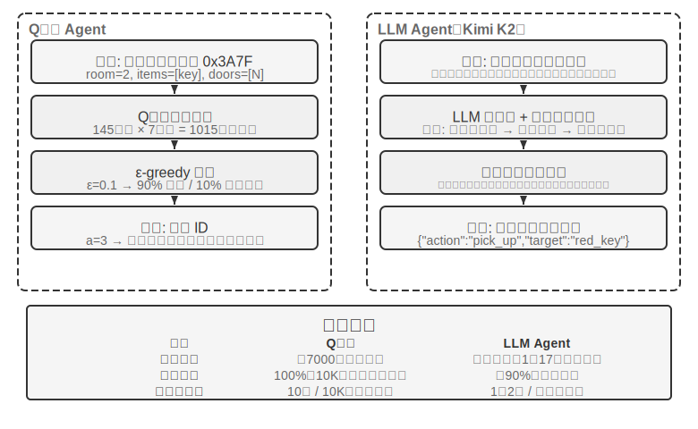
>
>
> 同じ宝探しゲームで Q-learning と LLM Agent（Kimi K3、最大 50 件の経験を保持するバッファを維持）を比較します。結果は衝撃的です。**LLM Agent は初回の一局で 18 ステップ以内に通関しました**。
>
> **序盤（目的を持った探索）**：錆びた剣を拾い（「武器は素手よりましだ」）、地図を系統的に探索し、北門が施錠されているのを発見すると「鍵を探す必要がある」と推論し、倉庫の探索に転じ、赤い鍵と魔法のクリスタルを順に手に入れます。**中盤（仕組みの理解と主体的な合成）**：「鍵は自動的に使用される」という規則を理解し、錆びた剣では守衛に対抗するには不十分だと予測し、そこで第 8 ステップで主体的に銀の剣を合成します。**終盤（実行と修正）**：銀の剣を持って北へ向かい、第 13 ステップで強い守衛を打ち破り、その間に一、二歩の無効な試み（剣の空振りや後退の繰り返し）を挟みつつ、最終的に第 18 ステップで巨龍の宝を手に入れます。
>
> これは意味理解と記号写像の間の根本的な違いを示しています。LLM Agent はゲームの概念構造を理解し、一歩ごとに目的と論理の裏付けがあります。一方 Q-learning にとって、「扉」「鍵」「剣」は無意味な記号の組み合わせにすぎず、大量の統計的学習を通じてそれらの間の関係を少しずつ発見するしかありません。
>
> 計算コストは興味深い逆説を成します。Q-learning は 1 万局走らせてもわずか 10 秒ですが、LLM Agent は一局に 1〜2 分かかります。しかし現実のタスクでは、相互作用一回ごとの時間・金銭・リスクのコストが純粋な計算コストをはるかに上回るので、GPU 時間だけを見るのは公平ではありません。より重要な洞察は、LLM Agent の成功はより良い「学習アルゴリズム」を持つからではなく、膨大な事前知識を携えているからだ、ということです。ゲームの規則が変わると、Q-learning は完全に再訓練が必要ですが、LLM Agent は推論を通じて直接適応できます。ここから実用的な設計原則が導けます。シミュレーションコストが低く、大量に繰り返せる場面では従来型 RL がなお価値を持ち、相互作用コストが高く、素早い適応が必要な現実の場面では、LLM Agent のサンプル効率のほうがより実際的です。
>

文脈内学習、外部化学習、パラメータ化学習（ポストトレーニング）というこの 3 つの学習パラダイムそれぞれの位置づけと協働については、第 1 章で系統的に対照しており、本章末尾の「完全な図景」でもこの話題に立ち返ります。本章の主線はそのうちのポストトレーニング――相互作用の方策をモデルパラメータに書き込むこと――です。

## モデル事前学習の基礎 `[任意読解]`

ポストトレーニング技術がなぜ有効なのかを理解するには、まず事前学習が何を築いたのかを知る必要があります。ポストトレーニング（SFT と RL）は本質的に、事前学習が築いた表現空間の中で最適化を行うことです。事前学習が定めた知識構造が、ポストトレーニングの天井を決めます。そこで、3 つの実験を通じて事前学習の核となる部分を考察します。小規模な言語モデルをゼロから訓練すること、視覚能力を拡張すること、そして新しい言語知識を注入することです。本節の 3 つの実験は補助的な内容で、読者が事前学習（Pretraining、すなわち大規模なデータで初期訓練を行い、モデルに言語の基本規則と世界知識を学ばせること）への直感を築くのを助けます。すでに事前学習の流れに馴染んでいる読者は飛ばして構いません。

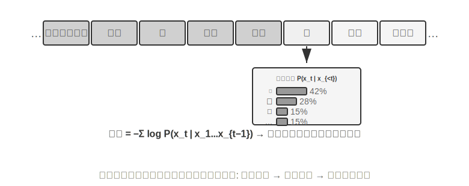

言語モデルの訓練は「トークナイゼーション — 事前学習 — ポストトレーニング」の 3 段階の流れに従います。トークナイゼーション（tokenization、単語分割）はテキストを離散的な単位に切り分けます。たとえば「我喜欢编程（私はプログラミングが好き）」は「我」「喜欢」「编」「程」の 4 つの token に切り分けられるかもしれません。これらの token がモデルがテキストを処理する最小単位です。事前学習のタスクは概念的には非常に単純です。モデルにあるテキストの前半部分を見せ、次の token が何かを予測させます。モデルは自分の予測と正解の差（この差を損失（Loss）と呼び、損失が小さいほど予測が正確）を比較しながら、絶えず自身のパラメータを調整します。膨大なテキストの上で繰り返し訓練した後、モデルは徐々に言語規則、世界知識、基本的な推論能力を学びます。事前学習が完了すると、モデルは流暢なテキストを生成できますが、出力は構造を欠き、指示に従うのが困難です。ポストトレーニングは SFT（ラベル付けされた入力-出力ペアで訓練）と選好最適化（DPO など、モデルに人間がより好む回答を生成させる）を通じて、それを実用的なアシスタントへと変えます。

> **実験 7-3 ★★：LLM をゼロから訓練する――アルゴリズム改善の威力**
>
> MiniMind 2（1 億パラメータ）を事例として、コンシューマー級の GPU で完全な訓練の流れを完了します。2 つのアルゴリズム最適化（QK Norm と Muon オプティマイザ）を導入することで、収束速度が 3 倍に向上し、生成品質も著しく改善します。実装コストは極めて低く、総訓練時間は約 14 時間、コストは約 34 ドルです。
>
> 各訓練段階の効果は次のとおりです。事前学習後、モデルは「世界で最も高い山」などの事実的な質問に答えられますが、形式は整いません。SFT 後は指示遵守と出力形式が著しく改善し、期待どおりの方法で答えを組み立てられます。選好最適化はさらに事実の誤りと不自然な表現を減らします。1 億パラメータのモデルにはなお明らかな限界があります（複雑な問題で間違えやすい）が、示唆は次のとおりです。**固定された小規模な予算のもとでは、アルゴリズムの改善のほうが単なる規模の積み増しよりコストパフォーマンスが高い**。
>
> **実験 7-4 ★★：自分で VLM を訓練する**
>
>
> 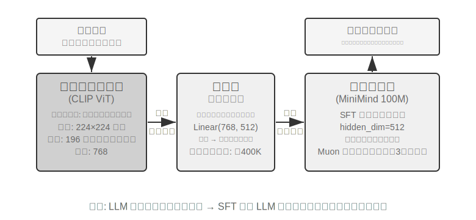
>
>
> VLM は視覚的知覚と言語理解を一つのモデルに統一し、核となる課題はモダリティ横断的なアライメント――「見たもの」と「言うこと」を対応させること――にあります。アーキテクチャは 3 つのコンポーネントから成ります。**視覚エンコーダ**（CLIP など、パラメータは固定）は画像の意味的特徴を抽出します。**投影層**（軽量、唯一ゼロから訓練する部分）は視覚特徴と言語モデルの間の「翻訳者」を務め、視覚特徴を言語モデルが理解できる表現空間へと写像します。**言語モデル**は記述テキストを生成します。訓練は「LLM を凍結 + 投影層のみを訓練」する戦略を採り、破滅的忘却（Catastrophic Forgetting、すなわち新しいスキルを学んだ後に古いスキルを忘れてしまうこと）を避けます。事前学習でアライメントした後に LLM を解凍し、高品質な画像-記述ペアで SFT を行うと、記述の詳細さと正確さが著しく改善します。
>
> 本実験はマルチモーダルモデル訓練の基本パラダイムを明らかにします。単一モダリティの事前学習の成果を再利用し、軽量な投影層を一つ訓練することでモダリティ横断的なアライメントを実現する――効率的でスケーラブルですが、投影層の表現力には限りがあり、モダリティ横断的な深い理解のボトルネックになりうります。同じ「視覚エンコーダ + 投影層 + LLM」の骨格をもう一歩進め、モデルに行動を出力させれば、第 9 章で展開する VLA（視覚-言語-行動）モデルになります。
>
> **実験 7-5 ★★：継続事前学習で新しい言語を学ぶ**
>
> Mistral 7B v0.3 を基礎（主に英語で事前学習され、韓国語はほとんど理解できない）として、韓国語 Wikipedia による継続事前学習で韓国語能力を注入します。すでに事前学習を終えたモデルに新しい言語データで教師なし訓練を続けるもので、モデルはすでに汎用的な言語モデリング能力を備えており、新しいデータ分布に適応するだけでよいので、コストはゼロから訓練するよりはるかに低くなります。重要な工学的ポイントは、混合データ（約 80% 韓国語 + 20% 英語）で破滅的忘却を緩和することです。目標言語の比率が高すぎると元の言語が退化し、比率が低すぎると学習効率が不足します。最後に韓国語の指示データで SFT を行い、実用的な韓国語対話能力を得ます。本実験の結論は本章末尾の完全な図景で再び使います。モデルに大量の新しい領域知識を記憶させるには、SFT ではなく継続事前学習に頼るのです。
>

3 つの事前学習実験は共通して一つの法則を明らかにします。予算が限られているときは、アルゴリズムの改善とアーキテクチャの革新のほうが、単なる規模の拡大よりコストパフォーマンスが高いのです。より重要なのは、事前学習がモデルに与えるのは記述的知識と言語モデリング能力であって、構造化された指示遵守やタスク志向の行動を欠いていることです。これこそ SFT が埋めるべき空白です。

事前学習の基礎能力があれば、次のステップはポストトレーニングを通じて汎用モデルを実用的な Agent へと変えることです。ポストトレーニングの第一段階は教師ありファインチューニング（SFT）です。

## SFT（教師ありファインチューニング）

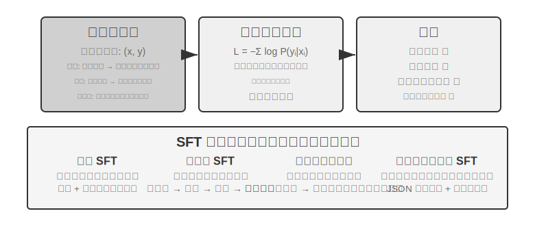

7.1 節で SFT の本質（データを差し替え、回答部分にのみ損失を計算する「次の単語を予測」）はすでに徹底的に説明しました。この節では 4 つの実験を通じて、この「安定した写像とプロトコルをパラメータに書き込む」仕組みが、異なるタスクで具体的に何を固定化するのかを見ていきます。SFT の核となる価値は新しい知識を注入することにあるのではなく、**プロトコルを固定化する**ことにあります。写像関係、対話形式、スタイル規範をパラメータに書き込み、推論時に長々としたプロンプトなしに期待どおりの出力を生み出せるようにするのです。通常は数千から数万件の高品質サンプルだけで、基本的な対話能力と指示遵守を確立できます。

効率性の代償は訓練分布への強い依存です。SFT は汎化より記憶に傾き、テスト時に訓練で見たことのない状況に遭遇すると、性能はしばしば明らかに低下します。次の実験は、この「プロトコルの固定化」の過程をさまざまな角度から示します。

> **実験 7-6 ★★★：音声 SFT――「声のコピー」から「パラ言語モデリング」へ `[拡張実験]`**
>
> Orpheus（文脈プロンプトによる voice cloning）と Sesame（パラ言語マーカーのモデリング）を対象に、「声のスタイルと表現の癖」をいかにパラメータに書き込むかを示します。両者の発想は異なります。
>
> - **Orpheus**：音声波形を token 系列に圧縮し、同一話者の参照音声を連結することで、モデルに「この人の声で話す」ことを学ばせ、文をまたいだ音色の一貫性を実現します。
> - **Sesame**：笑い声やため息などのパラ言語現象を `<laugh>`、`<sigh>` などの特殊マーカーに抽象化し、モデルに「マーカーを見たら対応する音を発する」ことを学ばせます。
>
> SFT が表現型タスクで固定化するのはスタイル制御プロトコルと構造化された表現の癖であって、事実的知識や複雑な思考ではありません。鍵は訓練データの多様性とラベル付けの質です。よくある失敗モードは、訓練データの話者が少なすぎて全員が同じ口調に聞こえること、マーカーの過学習（Overfitting、すなわちモデルが訓練サンプルの細部を丸暗記し、新しい状況ではかえって性能が悪化すること）による「機械的な笑い」です。
>
> **実験 7-7 ★★：多言語思考――モデルに任意の言語で思考させる `[拡張実験]`**
>
> 大半の思考モデルは英語でしか「思考」できません。あなたがどんな言語で質問しても、モデル内部の思考連鎖はほぼ英語です。訓練データの中の高品質な思考の示範がほぼすべて英語で書かれているからです。本実験の目標は単純です。モデルが指定した言語で思考できるようにすることです。
>
> やり方は gpt-oss-20b に SFT を施すことです。システム指示に `reasoning language: German`（または他の言語）の一文を加え、英語、スペイン語、フランス語など数種類の言語の思考サンプルで訓練します。訓練データには**中国語がまったく含まれていません**が、訓練完了後、reasoning language を Chinese に設定しさえすれば、モデルは中国語で完全な思考連鎖の思考ができます。このゼロショットの言語横断的な汎化が本実験の最も興味深い発見です。注意すべきは、これは SFT 自体の汎化能力ではないということです。多言語の事前学習がすでにモデルの中に言語横断的な共有表現空間を築いており、SFT はこの事前学習時にすでに備わっていた言語横断的な能力を活性化しただけなのです。
>
> **実験 7-8 ★★：Prompt 蒸留――より小さいコストで使える能力を再現する**
>
> 実際のアプリケーションでは、モデルに複雑なタスクを完了させるために、しばしば長大なシステムプロンプト（数千、時には数万 token）を設計する必要があり、呼び出しのたびに遅延と費用が増します。思考型の大規模モデルを使う場合、内部の思考 token がさらにコストを増幅します。Prompt 蒸留の発想は、「長いプロンプト + 思考型教師」の振る舞いを「短いプロンプト/プロンプトなし + 非思考型生徒」に圧縮することです。教師は完全なプロンプトと思考モードのもとで高品質な答えを生成し、訓練データはユーザー入力と最終結論だけを残し、長大なプロンプトと途中の思考過程は捨てます。生徒は「直接結論を出す」ことを学び、蒸留後は同じ入力に対して教師の出力品質に近づく一方、長大なプロンプトや思考 token を処理する必要がないため、遅延と費用が著しく下がります。
>
> 蒸留は 2 つの次元で行えます。「大から小へ」（中小モデルで大モデルを代替し、コストと品質の間で折衷する）と「思考から非思考へ」（同規模のもとで明示的な CoT を暗黙的なパラメータ化知識に畳み込み、20〜30 倍の応答速度向上を得る）です。両者は矛盾せず、本番環境ではしばしば同時に使われます。注意すべきは、蒸留は教師の境界を継承することです。教師がロングテール分布で系統的な誤りを持てば、生徒はそれらの誤りをさらにハードコードします。教師が正しさを保証するためにツールに頼っているなら、単なる出力蒸留はツールがもたらすロバスト性を失います。工学的な示唆は、プロダクトの形態が安定し、入力分布が予測でき、コスト制約が明らかなときは、Prompt 蒸留は優れた最適化手段だということです。一方、探索期やタスクがまだ定まっていない段階では、明示的な思考と編集可能なプロンプトエンジニアリングを保持することが、素早い試行錯誤の核であり続けます。
>
> **実験 7-9 ★★★：思考連鎖（Chain of Thought, CoT）蒸留 `[拡張実験]`**
>
> Prompt 蒸留が思考過程を捨てるのに対し、CoT 蒸留は逆で、強い教師モデルの**完全な思考軌跡**を生徒モデルに移します。能力の高い教師モデルに CoT 蒸留を施すと、同等のパラメータ量で教師の能力の 70%〜80% を回復できます。最先端の能力の境界を塗り替えることは求めないが、自主的にコントロールできるモデルを求めるチームにとって、これは最も実務的なフォロワー戦略です。DeepSeek-R1 のリリース時に同時にオープンソース化された一連の蒸留小モデル（R1 の思考軌跡で Qwen、Llama 系列に SFT を施したもの）は、まさにこの路線の代表例です。
>
> **背景：「思考の壁」現象**。一部のクローズドソースの思考モデル（OpenAI o 系列、Gemini 系列など）は思考時に内部の思考連鎖を生成しますが、ユーザーが目にするのは元の思考過程ではありません。ベンダーは蒸留防止、安全性、プロダクト体験などの考慮から、通常は出力前に CoT を書き換えたり要約したりし、最も価値のある元の思考過程は API の背後に隠されています。これこそ本実験がオープンソースの思考モデルを教師に選んだ理由です。DeepSeek-R1、QwQ などのモデルは `<think>` タグの中に完全な思考連鎖を公開しており、蒸留は技術的にもライセンス的にも実行可能です（使用前にはなおモデルのライセンスが蒸留生成物への利用を許諾しているか確認すべきです）。
>
> **実験設計**：3 ステップの流れです。第一に、**軌跡を採取する**：目標タスク分布（数学、コードなど）から問題をサンプリングし、オープンソースの教師モデルで完全な「思考 + 答え」の軌跡を生成し、規則ベースの検証器で最終答えが誤っている軌跡をフィルタで除きます。さもないと誤った思考過程を生徒がまるごと模倣してしまいます。第二に、**SFT 訓練**：「問題 → `<think>` 思考軌跡 `</think>` + 最終答え」を訓練ペアとして、小モデル（7B クラスなど）に標準的な SFT を施します。第三に、**比較評価**：同じベンチマーク上で蒸留前後の生徒モデルと教師モデルを比較し、能力の回復比率を測ります。
>
> **合格基準**：蒸留後の生徒モデルが数学/コードのベンチマークで蒸留前より著しく向上し、かつ思考軌跡の中に教師のような反省、後戻り、検算の振る舞いが現れること。同時に蒸留の代償にも注意してください。生徒は教師の系統的な誤りと冗長な思考の癖を継承します（後者は実験 7-10 の AdaptThink の発想と組み合わせて二次最適化できます）。
>

これら 4 つの実験には共通の特徴があります――「安定した写像とプロトコルをパラメータに書き込む」ことです。音声 SFT はスタイル制御プロトコルを固定化し、多言語 SFT は思考の組み立てテンプレートを固定化し、蒸留 SFT は入力から出力への直接の写像を固定化します。それらの共通点は、目標が明確で、形式がはっきりし、評価基準が安定していることであり、そのため SFT は極めて高いサンプル効率で成果を上げられます。しかしひとたび分布が変わると、記憶への傾きが性能低下として露呈します。これこそ 7.1 節「SFT と RL の本質的な違い」で述べた記憶—汎化の分岐が、実験のレベルで現れたものです。

## いつ SFT を選び、いつ RL を選ぶか

7.1 節では SFT と RL の**本質的な違い**を明らかにしました。この節ではより実践的な問いに答えます。**具体的なタスクに直面したとき、結局どちらを使うべきか。** 以下の意思決定の枠組みの一部の結論は、後続の RL 実験（実験 7-10、実験 7-11）でさらに検証されます。読者はまず初歩的な判断を築き、RL の部分を読み終えてから戻って照らし合わせて構いません。

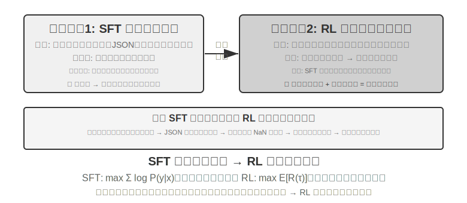

**SFT が適するのは**、形式の固定化（JSON 出力、対話スタイル）、高品質な専門家の示範を持つ、訓練とデプロイの環境が高度に一致している場面です。**RL が介入しなければならない場面**は異なります。実際のデプロイ環境と訓練環境に系統的な差異があるとき（たとえば訓練時はトランプの J/Q/K がすべて 10 で、デプロイ時は 11/12/13 に変わる――規則が変わった。あるいは訓練時は黒のスートを使い、デプロイ時は赤のスートに遭遇する――外観が変わった）、最適方策の探索が必要なとき（専門家の示範自体が最適とは限らない）、あるいはラベル付けコストが高すぎてすべての経路に示範を提供できないときは、RL が必要です。

最も堅牢な戦略は**「先に SFT、後に RL」**の 2 段階の流れです。SFT の主な目標はタスク性能の極致を追求することではなく、出力の**形式の安定性**を確立すること――モデルが解析可能な JSON、正しいツールインターフェース呼び出しを生み出せることを保証することです。出力形式が安定して初めて、RL の報酬信号を確実に計算できます。SFT を経ていない基礎モデルに直接 RL をすると、しばしば出力形式が乱れて報酬が計算できず訓練が失敗します。ただしこの結論には境界条件があります。それは「比較的小さな基礎モデル + 厳格な構造化出力の要求」という設定（後述の実験 7-11 など）から来ています。DeepSeek-R1-Zero は十分に強い基礎モデルが SFT を飛ばして直接 RL で成功し、反省と長い連鎖思考の能力を創発できることを証明しました。その代償は出力の可読性が悪く、複数の言語が入り混じることで、これこそ DeepSeek が最終的に R1 で「コールドスタート SFT」を加え直した理由です。R1 が Zero からコールドスタートへ往復したこの一節は「先形後神」の最良の例証です。RL は自ら「神」（方策と推論能力）を育てられますが、「形」（形式と可読性）はやはり SFT に頼って速く安定して立てるのです。

両者にはそれぞれ代償があります。SFT はサンプル効率が高く収束が速いですが、汎化は限られます。RL は転移可能な方策を学べますが、サンプル効率が低く訓練が不安定です。一つの実用的な判断基準はこうです。「示範データをどれだけ増やしても、新しい場面での性能が依然として上がらない」ときが、RL へ転向すべき臨界点です。問題の根源は示範の数ではなく、SFT の最適化目標そのものにあるからです。

実際の意思決定では、以下の順序で考えられます。

1. **まず問う：ポストトレーニングが必要か。** Harness 工学（プロンプトの最適化、ツール設計、コンテキスト管理）で問題を解決できるなら、モデルを訓練する必要はありません。大半の Agent アプリケーションはここに収まります。
2. **訓練が必要なら：まず SFT を試す。** 出力形式の固定化（JSON schema、API 呼び出し形式）、プロトコル的知識の固定化（用語の使い方、出力形式、フローの習慣、すなわち「どう言い、どうするか」）、スタイルの統一（口調、長さ）に適します。ただし SFT は大量の事実的知識（「何を知っているか」）の注入には適さない点に注意してください。それには継続事前学習か RAG に委ねる必要があります（詳細は本章末「完全な図景」）。SFT はコストが低く効果が速い。
3. **SFT が不十分なら：RL を加える。** 新しい場面への汎化が必要、最適方策の探索が必要、あるいはラベル付けコストが高すぎる場合に適します。必ずまず SFT で出力形式を安定させ、その基盤の上で RL を行ってください。

## シングルターン強化学習：記憶と汎化の対照

「シングルターン」とは、タスクが一度の相互作用で完了することを指します。モデルは入力を受け取り、出力を生み出し、報酬を得るもので、ステップをまたいだ状態を維持する必要はありません。この単純化された設定により、私たちはマルチターン相互作用の複雑さに邪魔されることなく、SFT と RL の学習機構における根本的な違いに焦点を当てられます。シングルターンの場面は明快な対照実験の条件を提供します。同じタスク、同じ基礎モデル、同じ計算予算で、唯一の変数は訓練方法です。最初の実験は RL がいかに「いつ思考すべきか」というメタ方策を学ぶかを示し、2 番目の実験は算術推論のカードゲームを通じて「SFT は記憶、RL は汎化」を系統的に定量化します。

実験に入る前に、まず RL アルゴリズムに関する**最小限の直感**を築いておき、以降の実験に出てくる用語を理解できるようにします（完全な公式と対比は本章後半の「強化学習アルゴリズムの比較」の節に譲ります）。本章の RL 訓練の大半は**方策勾配**に基づきます。モデルに同じ問題に対していくつか回答を生成させ、報酬の高い回答はその出現確率を高め、報酬の低いものは下げます――「報酬の高い方向へ多く進み、報酬の低い方向へは少なく進む」。一度の更新幅が大きすぎてモデルを狂わせないように、主流の **PPO** アルゴリズムは各ステップの更新幅をクリップします（後述の実験に出てくる「価値ネットワーク付きの PPO」がこれを指し、価値ネットワークはベースラインを推定し、より細かい優位性を算出するのに使います）。もう一つの **GRPO** は価値ネットワークを訓練せず、「同じ問題に対する複数の回答を互いに比較する」ことで各回答の相対的な良し悪しを判断します。この直感を覚えておけば、次の 2 つの実験を読み解くのに十分です。

> **実験 7-10 ★★：AdaptThink――「いつ思考しないか」を学ぶ**
>
> 大型の思考モデル（OpenAI o1、DeepSeek-R1 など）はあらゆる問題に対して長大な思考連鎖を生成し、単純な問題では不必要なオーバーヘッドをもたらします。実験はまず一つの直感を検証します。**NoThinking モード**（`<think></think>` を通じて思考をスキップ）は単純な問題では性能が同等かむしろ良く、困難な問題に直面したときにのみ Thinking の優位性が現れます。
>
> AdaptThink は RL 訓練を通じてモデルに適応的にモードを選ばせます。2 つの核となるコンポーネントがあります。
>
> - **制約付き最適化目標**：NoThinking を奨励すると同時に全体の性能が下がらないことを保証します。
> - **重要度サンプリング戦略**：Thinking/NoThinking のサンプルをバランスさせ、初期モデルがほぼ常に Thinking を選ぶことで生じる**コールドスタート**問題を解決します（Cold Start、ここでは特に訓練初期にモデルがほぼ Thinking サンプルしか生み出さず、NoThinking 分岐のサンプルが極めて少なくて学べない問題を指します。前文で DeepSeek-R1 が少量の示範データで行った「コールドスタート SFT」とは異なる文脈での用法です）。
>
> ここに出てくる「重要度サンプリング」は統計学でよく使われる手法です。サンプリング分布がある種のサンプルに偏っているとき、サンプルに重み付けをして分布を「補正」し、学習信号がすべてのカテゴリを公平にカバーできるようにします。本書で後に論じる PPO、DAPO などの RL アルゴリズムは、いずれもこの発想を繰り返し使います。
>
> 評価結果：複数の数学ベンチマークで、応答長が 45%〜64% 減少し、正確率はむしろ上昇しました。モデルは問題の特徴に応じて選択することを学びました。構造の明快な単純な問題は直接答え、多段階の導出を要する困難な問題は完全な思考連鎖を保持し、見たことのないタスクの種類に直面してもなお難度を正しく判断できます。
>
> Prompt 蒸留と補完し合って「速—遅の二重システム」を成します。蒸留は思考を要するタスクの比率を下げ、AdaptThink は残りのタスクのトリガー戦略を最適化し、共に思考効率の最大化を実現します。
>
> **実験 7-11 ★★：GeneralPoints――シングルターン RL の「記憶と汎化」の対照**
>
>
> 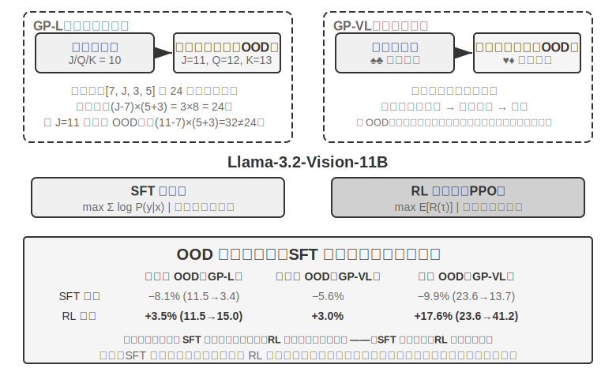
>
>
> GeneralPoints は Chu ら（2025、《SFT Memorizes, RL Generalizes》、arXiv:2501.17161）が提出した算術思考のカードゲームで、モデルの汎化能力の評価に特化しています。タスクの目標は「24 点」ゲームに似ています。4 枚のカードの数字を使い、加減乗除の演算で、各数字をちょうど一度ずつ使い、目標の数字 24 を作ります。実験は純テキストの GP-L と画像の GP-VL の 2 つのバリアントを設計し、同じ枠組みのもとで規則の汎化と視覚の汎化をそれぞれ考察できるようにしました。
>
> **規則バリアント**：訓練時は J/Q/K をすべて 10 と数え、テスト時はそれぞれ 11/12/13 と数え、テストセットに訓練で見ていない数字の組み合わせ（11、12、13 を含む演算）が現れることを保証し、汎化能力を厳格に評価します。**視覚バリアント**：訓練は黒のスート（♠♣）、テストは赤のスート（♥♦）を使い、視覚的外観の変化下でのロバスト性を評価します。Llama-3.2-Vision-11B をベースに、標準的なポストトレーニングの流れに従います。まず SFT で初期化して基本的な指示遵守能力を持たせ、次に同じ計算予算のもとで SFT と RL の訓練をそれぞれ拡張し（RL 部分は価値ネットワーク付きの PPO アルゴリズムを採用）、単一の規則（J/Q/K=10）データで訓練し、分布内（ID）と分布外（OOD）のテストセットで評価します。
>
> 結果は根本的な違いを明快に明らかにします。**規則 OOD**：RL は GP-L で +3.5%（11.5%→15.0%）、SFT は 8.1% **低下**（11.5%→3.4%）。GP-VL では RL +3.0%、SFT は 5.6% 低下。**視覚 OOD**：RL は GP-VL で **+17.6%**（23.6%→41.2%）、SFT は 9.9% 低下（23.6%→13.7%）。
>
> 視覚認識の正確率を追跡すると次のことが分かりました。RL は結果志向の最適化を通じて低層の視覚エンコーダを改善し、この改善は全体の性能向上と高度に相関していました。一方 SFT は思考過程の中の token パターンに過度に適合し、視覚 token の学習を疎かにし、認識正確率がむしろ低下しました。
>
> 実験はまた SFT の RL に対する必要性も明らかにしました。本実験の設定のもとでは（Llama-3.2-Vision-11B というクラスの基礎モデルに、厳格な構造化出力の要求を加えたもの）、SFT を経ずに直接エンドツーエンドの RL をするとまったく失敗しました。基礎モデルが構造化出力を生み出せず、報酬がそもそも計算できないのです。これは特定の設定下の結論であって普遍的な法則ではない点に注意してください。十分に強い基礎モデルは SFT を飛ばして直接 RL で成功できます（前文の DeepSeek-R1-Zero に関する議論を参照）。もう一つ注目に値する発見は、検証の反復回数が多いほど汎化が良くなることです。10 回で +5.99% 対 1 回で +0.48% であり、思考時の計算の拡張が RL の汎化の鍵であることを示しています。
>
> なぜ SFT は分布シフト下で性能が崩壊し、RL はむしろ良いのでしょうか。SFT が学ぶのは「この種の入力を見たら、あの種の答えを出す」という写像です。訓練時は J/Q/K がすべて 10 なので、モデルは「J/Q/K に遭遇したら 10 として使う」という固定パターンを覚えます。テスト時に J=11 になっても、モデルは相変わらず 10 で計算し、当然間違えます。RL が学ぶのは「どんな計算過程が正しい答えを得られるか」というより汎用的な方策です。J が 11 に変わると、RL モデルは同じ方策で計算し直し、記憶の中の答えを当てはめません。これが「記憶」と「汎化」の本質的な違いです。
>
> 本実験の核となる貢献は「SFT は記憶、RL は汎化」現象を系統的に定量化したことにあり、この法則が純言語と視覚-言語の 2 つのモダリティのいずれでも成立することを証明し、SFT と RL の協働関係を明らかにしました。SFT が形式の安定性を提供し、RL がその基盤の上で記憶の境界を突破する、両者は一つも欠かせません。この「先形後神」の訓練パラダイム――中国画の用語を借りて、まず外在的な形態（形式、構造）を正しく描き、次に内在的な神韻（汎化、方策）を追求する――は、後続のマルチターン、マルチモーダルのタスクに方法論的な基礎を据えました。

## RLHF：人間の選好から報酬モデルへ

これまでの実験には共通の前提がありました。タスクに検証可能な正誤がある――計算式が合っているか、形式が規則に合っているか、規則ベースの検証器が採点できる――ということです。しかし、現在デプロイされている対話モデルが「礼儀正しく安全なアシスタントのように」振る舞えるのは、もっと早くに成熟した別の路線に頼っています。**RLHF**（Reinforcement Learning from Human Feedback、人間のフィードバックに基づく強化学習）です。RLHF を理解することは、ChatGPT のようなプロダクトの対話品質と安全アライメントがどこから来るのかを理解することであり、また後述の各アルゴリズムに出てくる KL ペナルティ、reward hacking などの概念の前提を理解することでもあります。

**InstructGPT の 3 段階パイプライン。** OpenAI の InstructGPT[^ch7-4] は、今日まで踏襲されている標準的な流れを確立しました。

1. **SFT**：人間が示範した「指示—回答」ペアで事前学習モデルをファインチューニングし、基本的な指示遵守能力を築きます。前文「SFT（教師ありファインチューニング）」の節で論じた内容です。
2. **報酬モデル（Reward Model, RM）を訓練する**：同じプロンプトに対してモデルに複数の回答を生成させ、人間のラベル付け者が二つずつ比較し、どちらをより好むかを示します。これらの選好ペアで一つの採点モデルを訓練し、訓練目標は Bradley-Terry モデルに基づきます。

   $$\mathcal{L}_{\text{RM}} = -\log \sigma\big(r(x, y_w) - r(x, y_l)\big)$$

   ここで $y_w$ は好まれた回答、$y_l$ は拒否された回答、$\sigma$ は sigmoid 関数です。直感は非常に単純です。**RM に好まれた回答へより高い点数をつけさせる**のです。採点ではなく比較を採取するのは、人間が絶対的な点数を一貫してつけるのが難しい（「この回答は 7.3 点の価値がある」はほぼ一貫してラベル付けできない）一方、「A と B のどちらが良いか」という判断ははるかに信頼できるからです。**「報酬モデル」というこの役割を覚えておいてください。それは本章の一つの伏線です**。ここでは人間の選好から学ばれた採点器です。7.10 節で報酬設計を論じるとき、そのさまざまなバリアント（最終結果だけを見る ORM、逐次採点する PRM、自然言語で理由を述べる生成式報酬モデル）、そして一つの特例――正誤を規則で直接判定できるとき、「報酬モデル」はいっそ一段の決定論的なコードに退化する（これが後述の RLVR です）――を目にすることになります。それらが答えているのはすべて同じ問い、**報酬はどこから来るか**です。
3. **RM の採点で PPO を行う**：RM の点数を報酬信号とし、SFT モデルに PPO 訓練を施し（PPO の仕組みは次節を参照）、モデルに RM が「人間はより好むだろう」とみなす回答の生成を学ばせます。

**KL ペナルティ：出発点から遠く離れすぎない（KL ダイバージェンスを徹底解説）。** RLHF でモデルが実際に最適化する報酬は、通常 RM の採点そのものではなく、一つのペナルティ項を差し引いたものです。

$$r = r_{\text{RM}} - \beta \cdot \mathrm{KL}\big(\pi_\theta \,\|\, \pi_{\text{ref}}\big)$$

この一つの式には初学者がよく尋ねる 4 つの問いがあり、一つずつ明確にします。

**（1）KL ダイバージェンスとは何で、ペナルティはどこに加わるのか。** KL ダイバージェンス（Kullback-Leibler Divergence）は 2 つの確率分布の差異を測ります。2 つの分布が似ているほど KL は小さく、完全に同じなら 0、似ていないほど KL は大きくなります。ここでの 2 つの分布は、**現在の方策** $\pi_\theta$（訓練中のモデル）と**参照方策** $\pi_{\text{ref}}$（訓練の出発点、通常はあの SFT モデル）が同じ前文に対して与える「次の token の確率分布」です。$\beta$ はペナルティの強さを制御します――訓練スクリプトによく見られる `kl_coef` というハイパーパラメータがそれです。工学的には、このペナルティは **token ごとに逐位で計算されて報酬に加えられます**（per-token KL）。モデルが token を一つ生成するたびに、その位置で参照モデルとの確率差を比較し、外れが大きいほどそのステップの報酬が多く差し引かれます。つまり KL は単独の loss 項ではなく、**報酬信号に混ぜ込まれ**、その後 PPO/GRPO の優位性計算を通ります――これがそれが作用する正確な位置です。

**（2）方向はなぜ「現在の方策が前、参照方策が後」なのか。** KL ダイバージェンスは非対称で、$\mathrm{KL}(P\|Q)\neq\mathrm{KL}(Q\|P)$ であり、方向は好き勝手に書けるものではありません。ここでは $\mathrm{KL}(\pi_\theta\|\pi_{\text{ref}})$――現在の方策が前――と書き、数学的には**逆 KL（reverse KL）**と呼びます。それが罰するのは「$\pi_\theta$ がある場所で高い確率を与えたのに、$\pi_{\text{ref}}$ はその場所でほぼゼロだった」という状況、すなわち**モデルが参照モデルの行くべきでないと考える場所へ行くことを罰する**ことです。これこそ私たちが望むものです。参照モデル（SFT モデル）は「人間らしく話し、形式が正常」な安全圏を代表し、逆 KL は現在の方策をこの安全圏の近くに抑え込み、勝手にさまよわせません。もし逆に**正 KL** $\mathrm{KL}(\pi_{\text{ref}}\|\pi_\theta)$ を使うと、罰せられるのは「参照モデルにあって現在のモデルに欠けている」パターンで、それはモデルに参照モデルのあらゆる表現方式をカバーするよう強い、まさに RLHF の目的ではありません。

**（3）なぜこう設計するのか。――mode-seeking の由来。** 逆 KL には一つの重要な性格があります。それは **mode-seeking（峰探し）**であることです。7.1 節で伏線を張りました――逆 KL はモデルに**少数のいくつかの高報酬の「峰」だけを残し、他のモードは思い切って捨てる**ことを許し、SFT の最尤（mass-covering、覆い尽くし型）のように万遍なく恵みを与える必要がありません。RLHF に置けば、これこそ私たちの求める効果です。RM が認める高得点の回答方式の中から一、二種を選んで安定して出力し、あらゆる可能な回答をすべて学ぶのではないのです。これは RL 後のモデルがなぜより「断定的」で多様性が低いのかも説明します。逆 KL の mode-seeking と、モデルを参照分布の近くに抑え込むこと、この 2 つが合わさったものが RLHF の安定性の秘訣です。

**（4）加えなければどうなるか。** 直感は一言です。**出発点から遠く離れすぎるな、さもないと報酬モデルの点数が信用できなくなる。** RM は参照方策の近くの出力分布の上で訓練されているので、モデルがひとたび RM が見たことのない分布へ最適化されると、RM の採点は根拠のない外挿になり、高得点はもはや高品質を意味しなくなります。だから KL ペナルティは同時に 2 つのことを防ぎます。**reward hacking**（モデルが報酬の抜け穴を突いて高得点を稼ぎ、本当にタスクをこなさない。次段落を参照）と**分布崩壊**（出力が繰り返しや文字化けなど極端な形態に退化する）です。検証可能報酬の RLVR 訓練でも、KL 正則はしばしば保持されて訓練を安定させます（DAPO、Open-Reasoner-Zero など少数の研究は意図的にそれを外しています――DeepSeek-R1-Zero の GRPO 自体はなお明示的に KL 項を含む点に注意）。

**報酬モデルは「過度に最適化」される。** RM は結局のところ人間の選好の代理指標（proxy）にすぎません。グッドハートの法則が言うように、一つの指標がひとたび最適化目標になると、それはもはや良い指標ではなくなります――代理指標を極端に推し進めると、それと真の目標との相関が歪みます。OpenAI の研究[^ch7-5]はこの**報酬モデルの過度最適化（reward model over-optimization）**現象を系統的に測定しました。RL 訓練が進むにつれ、代理報酬（RM の点数）は単調に上昇しますが、真の品質（人間の評価）はまず上がってから下がります。モデルが徐々に学ぶのは「より良く答える」ことではなく「RM に高得点をつけさせる」こと――冗長で、こびへつらい、一見厳密そうな空論です。これこそ RLHF の文脈における reward hacking の具体的な形態であり、KL ペナルティと早期停止が最もよく使われる緩和手段です。本章末尾の「よくある落とし穴」にある報酬ハッカー問題もこれと同根です。

**DPO：明示的な報酬モデルを飛ばす。** DPO（Direct Preference Optimization、直接選好最適化）[^ch7-6]の出発点はこうです。「RM を訓練 + PPO」の組み合わせの最終的な効果が「好まれた回答の確率を高め、拒否された回答の確率を下げ、同時に参照モデルから遠く離れない」ことなら、いっそ明示的な RM を飛ばし、選好ペアを直接、暗黙的な報酬を持つ分類損失に変えてしまえばよい――数学的にこれが KL 制約付きのオフライン選好最適化に等価であることが証明でき、報酬モデルは暗黙的に方策そのものの中に隠されます。DPO の訓練は SFT のように単純です。オンラインサンプリングも、価値ネットワークも、RM を別途維持することも必要ありません。代償はそれが完全にオフラインであること――選好データの外の新しい振る舞いを探索できず、性能の天井は選好データの質とカバー範囲によって決まります。

**RLHF と RLVR の関係。** まとめると、2 つの路線の違いは**報酬がどこから来るか**にあります。RLHF の報酬は学習された RM から来ます（背後は人間の選好データ）。**RLVR**（Reinforcement Learning with Verifiable Rewards、検証可能報酬強化学習）の報酬は規則ベースの検証器から来ます（テストが通るか、答えが正しいか）。Agent タスクはちょうど大半が検証可能です――これこそ本章が RLVR を主線とする理由です。しかし両者は取捨の関係ではありません。実際にデプロイされるモデルは重ねて使われ、RLHF が対話品質と安全アライメントを担い、RLVR が推論と Agent 能力を担います。後述の「報酬パラダイムの進化」で論じる生成式報酬モデルは、2 つの線の合流とみなせます――訓練可能な報酬モデルで、規則ではカバーできない開かれたタスクを引き受けるのです。

## 強化学習アルゴリズムの比較

これまでのシングルターン実験は RL の汎化の優位性を証明し、前節では RLHF の選好最適化の路線を導入しましたが、これらの研究で使われた具体的なアルゴリズムはそれぞれ異なり、数多くの選択肢の一部にすぎません。より複雑なマルチターンのタスクに入る前に、主流のアルゴリズムの特徴と適用場面を系統的に整理しておく必要があります。

> **まず最も重要な一言を、読者が公式にはまり込まないうちに言っておきます。** 本節はかなり多くのアルゴリズム名と公式を並べますが、本章の主線二を覚えておいてください。**産業界では、既存の RL アルゴリズム（PPO、GRPO など）は使い方が分かり、正しく選べれば十分で、本当に成否を決めるのはデータと環境であって、アルゴリズムそのものではありません。** これらのアルゴリズムはとうに veRL、TRL などの成熟したフレームワークに封じ込められており、呼び出すのは通常、数行の設定を変えるだけです。だから本節の目標はあなたに導出をできるようにさせることではなく、「どんな場面でどのアルゴリズムを使うか」という選択の地図を築かせることです。公式部分（訓練エンジニア向け）は分からなければ飛ばして構わず、以降の読解に影響しません。次節では「なぜデータと環境がアルゴリズムより重要なのか」を正面から説明します。

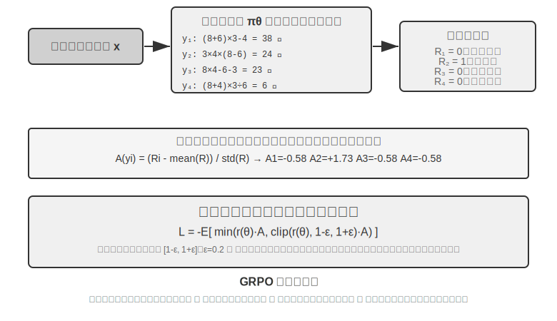

現代の LLM Agent の RL 場面は従来の RL と本質的な違いがあります――Agent はマルチターンの対話の中でユーザーの意図を理解し、ツールを呼び出し、構造化出力を生成し、長い連鎖思考を行う必要があります。この多目標・多段階の意思決定は、「正しいアルゴリズムを選ぶ」ことに一定の影響を持たせますが、その影響はデータと環境にははるかに及びません。

実装経路から見ると、RL アルゴリズムは**オンライン探索手法**（環境との相互作用を通じて新しい方策を探索する）と**オフライン最適化手法**（既存のデータに基づいて最適化し、より安定的で直接的）に分かれます。ここでついでに、前文で約束した厳密な用語を一対示します。**オンポリシー（On-Policy）**手法は現在の方策が自ら新たにサンプリングしたデータだけを使って自分を更新し、**オフポリシー（Off-Policy）**手法は他の方策（あるいは旧バージョンの方策）が生み出したデータを使って学べます（前文の Q-learning など）。この基準で本章が論じてきた手法を対応づけると、SFT はオフポリシーの模倣学習です――データはモデル自身ではなく教師や人間の示範から来ます。PPO、GRPO の LLM 訓練での標準形はオンポリシーです――毎ラウンド現在のモデルが新たにサンプリングした rollout（すなわちモデルにタスクを最後まで一通り走らせ、頭から尾まで一本の軌跡を生成させること）で更新します。DPO はオフラインの選好最適化で、オンラインサンプリングもせず、厳密な意味での方策反復もしません。

これらのアルゴリズムの大半は**方策勾配**（Policy Gradient）という同じ発想の上に築かれています。「期待リターンを高められる方向」へ方策パラメータ $\theta$ を調整するのです。その最も基本的な形（REINFORCE）は次のとおりです。

$$\nabla_\theta J(\theta) = \mathbb{E}\big[\nabla_\theta \log \pi_\theta(a \mid s)\, G\big]$$

ここで $\pi_\theta(a\mid s)$ は方策（状態 $s$ で行動 $a$ を選ぶ確率）、$G$ はこの軌跡（あるいはそのステップ以降）の累積リターンです――リターンが高いほど、その行動を生み出す確率を強化します。軌跡全体のリターン $G$ を直接重みとして使うのは不偏ですが分散が大きい。そこでベースライン $b$ を導入し、**優位性**（Advantage）$\hat{A}=G-b$（この行動が平均水準よりどれだけ良いか）を重みとして使い、分散を下げます。次の PPO と GRPO は、本質的には「いかに安定して優位性 $\hat{A}$ を推定し使うか」について与えられた 2 種類の改善です。

**PPO** は「クリッピング」で毎回の更新幅を制限し、方策が一歩で狂うのを避けます。

$$L^{\text{CLIP}}(\theta) = \mathbb{E}\Big[\min\big(\rho\,\hat{A},\ \operatorname{clip}(\rho,\, 1-\epsilon,\, 1+\epsilon)\,\hat{A}\big)\Big],\quad \rho = \frac{\pi_\theta(a\mid s)}{\pi_{\theta_{\text{old}}}(a\mid s)}$$

ここで $\rho$ は新旧の方策の確率比、$\epsilon$（0.2 など）は一歩で調整可能な幅を限定します。後述の「Clip-Higher」はまさにこの $1+\epsilon$ という上界を緩めたものです。

**GRPO** は価値ネットワーク（value network、PPO で追加訓練する補助ニューラルネットワークで、軌跡の各ステップに個別に価値関数を推定し、より細かい優位性を算出するのに使う）を省き、「グループ内の相対比較」で優位性を推定します。同じ問題に $N$ 本の軌跡をサンプリングしてリターン $r_1,\dots,r_N$ を得て、各軌跡の優位性をグループ内での相対的な出来として定義します。

$$\hat{A}_i = \frac{r_i - \operatorname{mean}(r_1,\dots,r_N)}{\operatorname{std}(r_1,\dots,r_N)}$$

すなわち「同グループの平均より良ければ正、悪ければ負」であり、価値ネットワークを必要としません――これこそコストが低い理由です。注記しておくべきは、上式は KL 正則項を省いており、実際の訓練では通常、前節で紹介した per-token KL ペナルティを加え、方策を参照モデルの近くに制約します。

表7-4 は主流の手法の核となる特徴をまとめています。読む際には、よく混同される 2 つのことを区別してください。**報酬がどこから来るか**（規則ベースの検証器、学習された報酬モデル、それとも人間の選好データ）と、**どのアルゴリズムで最適化するか**です。PPO と GRPO は報酬の出所を選びません――規則ベースの検証器（RLVR）にも、報酬モデル（RLHF）にもつなげます。それらの真の違いは優位性の推定方式（価値ネットワーク vs グループ内相対ベースライン）にあります。

表7-4 ポストトレーニングと推論時最適化手法の比較

| 手法 | 種類 | 核となる発想 | 長所 | 短所 | 適用場面 |
|--------------|-----|-------------------|---------------|--------------------|----------------------|
| **REINFORCE** | オンライン RL アルゴリズム | 軌跡全体の最終報酬で方策を更新 | 実装が単純 | 分散が大きく、訓練が不安定 | 理論的ベースライン。原始形はほとんど直接使われないが、そのベースライン付きバリアント（RLOO、REINFORCE++ など）は現在の主流の一つで、GRPO は本質的にグループ内ベースライン付きの REINFORCE |
| **PPO** | オンライン RL アルゴリズム | 毎回の更新幅を制限し、方策の「暴走」を防ぐ | 安定、価値ネットワークがより細粒度のクレジット割り当てを提供 | 価値ネットワークの追加訓練と保存が必要、ハイパーパラメータに敏感 | マルチターン Agent、長軌跡のクレジット割り当て |
| **GRPO** | オンライン RL アルゴリズム | 同じ問題に複数の軌跡をサンプリングし、グループ内で「どれが良いか」を相対比較 | 価値ネットワーク不要、コストが低い | 優位性を軌跡全体に均等配分するためクレジット割り当てが粗い、グループ内報酬に区別度があることに依存 | シングルターン/短軌跡タスク、報酬の区別度が良い場面 |
| **DPO** | オフライン選好最適化 | 選好ペアを直接、暗黙的報酬付きの分類損失に変える | 極めて簡潔で効率的、オンラインサンプリング不要 | 新しい方策を探索できず、オフライン選好データの質とカバー範囲に制限される | 高品質な選好データが既にある場面 |
| **KTO** | オフライン選好最適化 | 単一のサンプルに「良い/悪い」ラベルをつけるだけでよい | ラベル付けコストが極めて低い | 信号が粗い | ラベル付けリソースが極めて限られた場面 |
| **Best-of-N** | 推論時手法 | 推論時に N 個の出力を生成し、最良を選ぶ | モデルを変えず、実施が単純 | 推論コストが倍増、能力がパラメータに沈殿しない | 初期の素早い品質向上、RL への収益上界の見積もり提供 |

本章の実験に戻り、それぞれが使ったアルゴリズムをありのままに述べます。GeneralPoints と V-IRL（実験 7-11、7-12）は同じ研究から来ており、価値ネットワーク付きの PPO を使っています。AdaptThink（実験 7-10）はカスタムの制約付き最適化目標に重要度サンプリングを加えたもの。後述の ReTool（実験 7-15）は veRL を改造した PPO を使い（訓練データは DAPO-Math-17k から取っていますが、最適化アルゴリズムはやはり PPO）、SimpleVLA（実験 7-13）と RLVP（実験 7-14）は GRPO に基づいています。マルチターンの場面ではクレジット割り当ての問題がより複雑で、異なるアルゴリズムにそれぞれ一長一短があります。

実践での選択の道筋。信頼できる報酬信号があり計算リソースもある → GRPO（簡潔）または PPO（柔軟、長軌跡のクレジット割り当てがより細かい）。高品質な選好データがある → DPO/KTO（低コスト）。初期の探索段階 → Best-of-N で素早くスタート。

この表を見終えて、あなたは「では結局どのアルゴリズムを精調すべきか」と思うかもしれません。答えは意外かもしれません。**大半の場合、どれでもよい――まずアルゴリズムにこだわるのはやめましょう。** 次節はこのことを専門に説明します。

## データと環境：アルゴリズムより重要なこと

これは全章で私が最もあなたに覚えてほしい一節であり、本章の主線二の正面からの陳述でもあります。これまでかなりの紙幅を割いてアルゴリズムを論じましたが、産業界の第一線の経験はまさに逆です。**アルゴリズムの重要性は、より基礎的な 3 つの要素――シミュレーション環境の忠実度、訓練データの質、基礎モデルの能力――にはるかに及びません。** 既存のアルゴリズムは使えれば十分で、本当に差をつけるのは環境とデータの出来です。これは第 6 章の結論（評価とシミュレーション環境はポストトレーニングの礎）とも、本章 7.2 節で触れた OpenAI の認識の逆転とも呼応します――数十年の RL 研究が優先順位を逆さまにしていた、本当の順序は**事前知識（基礎モデル）> 環境 > アルゴリズム**なのです。

### 環境：モデルが練習する場

RL の本質は「試行錯誤による学習」であり、試行錯誤には**試行錯誤の場**がなければなりません――これがシミュレーション環境（simulation environment）です。モデルは環境の中で何度もタスクを走らせ、フィードバックを受け取り、方策を調整します。環境の**忠実度**（実際のデプロイ場面とどれだけ似ているか）が、訓練された方策が使えるかどうかを直接決めます。

- **環境が歪めば、方策は必ず廃る。** もしシミュレーションの中のカスタマーサービスがいつも決まった型どおりに返答し、エラー情報が本番環境と食い違えば、モデルはシミュレーションの中だけで通用する「受験用の方策」を学び、いざ本番に出ると馬脚を露します。これは RL プロジェクトで最もよくある失敗の仕方です――アルゴリズムがだめなのではなく、練習場と本試験場が別物なのです。
- **高忠実度の環境を構築することは、しばしば訓練そのものより高価で難しい。** 大規模並列でき、再現可能で、フィードバックが本物の環境は、しばしばモデルを調整するよりはるかに多くの工学を投じる必要があります。本章後半のツール呼び出しの実験（AWorld の MCP サンドボックス、ReTool のコードインタプリタサンドボックス）が大きな労力をかけて環境を構築するのは、まさに**本物の API にはレート制限があり、アカウントを凍結され、副作用があり、そのまま訓練に使うことがまったくできない**からです――まず安定して制御可能で再生可能な「影の世界」を造らねばなりません。
- **環境のもう半分は報酬関数です。** 環境は「世界がどう変わるか」を模擬するだけでなく、「出来が良いかどうか」も判定できねばならず、これが報酬信号の出所です。報酬設計は環境工学の一部であり、次節で専門に展開します。

一言で言えば、**アルゴリズムを調整しにかかる前に、まず自分に問いなさい――私のシミュレーション環境は、本当に現実の世界に似ているか。** この問いの答えは、PPO にするか GRPO にするかよりはるかに重要です。

### データ：最も重要な一環であり、質があらゆるものに勝る

環境が場だとすれば、**データは教材であり、しかも 3 要素の中で最も重要な一環です**。ここで言う「データ」は、SFT 段階では示範サンプル（入力—出力ペア）を指し、RL 段階ではタスク分布と報酬信号を指します。どの段階であれ、一つの鉄則があります。

> **データの質はアルゴリズムに勝る。** どれほど精巧なアルゴリズムでも、投入するのが汚いデータ、カバーが不完全なデータ、系統的な偏りのあるデータなら、学び出されるのも汚い方策でしかありません。SFT はデータの中のノイズと偏見を一字一句たがわずパラメータに固定化します。RL は偏った報酬に向かって死に物狂いで最適化し、誤った方向へどんどん進みます（これこそ reward hacking の温床です）。**Garbage in, garbage out** はポストトレーニングで余すところなく体現されます。

さらに一歩進んで、多くのチームが腑に落ちていないが、きわめて節約になる判断があります。

> **多くの場面では、SFT のデータ品質さえ十分であれば、RL などまったく必要ありません。** RL は高価で不安定（しばしば SFT の数十から百倍のコスト）なのに、皆はしばしば最初から RL に手を出したがります。しかしもしあなたのタスク分布が予測でき、十分に多様で十分に高品質な示範データが得られるなら、しっかりした SFT だけでしばしば要求を満たせます。RL が本当に代替不可能な場面は限られています（7.5 節を参照）。デプロイ分布が系統的にドリフトする、専門家の示範自体が最適でない、あるいはラベル付けコストが高すぎてすべての経路に示範を提供できない、といった場合です。**まず SFT のデータをしっかり作り、それから RL が本当に必要かどうかを判断する**――この順序が、大量の計算資源と時間を節約するのに役立ちます。

説得力のある業界の例が Anthropic です。2025 年より前、そのポストトレーニングの処方は主に 2 つでした。**膨大な高品質データで SFT を行い**、それに **RLAIF**（Constitutional AI における「AI のフィードバックに基づく強化学習」。Bai ら 2022、一部の「憲法」でモデルに自ら回答を採点させてアライメントを行う）を加えるもので、**今日ではコードや推論で標準装備になっている RLVR（検証可能報酬の強化学習）にはあまり頼っていませんでした**。それでも当時のコーディングモデルの品質はすでに非常に優秀でした。その理由の大部分はアルゴリズムにあるのではなく、SFT と RLAIF の両方のデータ品質を極致まで高めたことにあります――これこそ上記の判断を裏づけます。**SFT のデータが十分に良ければ、さして派手でない処方でも一流のモデルを訓練でき、複雑な検証可能報酬 RL は必ずしも必要ないのです。** もちろんこれは RL が無用だという意味ではありません。2025 年以降、Anthropic も明らかに RL への投入を増やしました――データで固めた土台の上で、RL は能力の上限をもう一段引き上げられます。**データはあなたがどこまで行けるかを決め、RL はさらにどれだけ高く行けるかを決めます。**

データの質とは具体的に何を指すのでしょうか。少なくとも 3 つの次元があります。**カバー範囲**（デプロイ時に遭遇するさまざまな状況、とりわけロングテールと境界の状況をカバーしているか）、**多様性**（示範の中の話者、スタイル、解法が十分に豊富か。さもないとモデルは単一のモードに崩壊します。たとえば実験 7-6 の「全員が一つの口調」）、**ラベル付けの正確さ**（示範の答え自体が正しいか。とりわけ思考連鎖蒸留では、誤った思考過程を生徒がまるごと模倣します――だから実験 7-9 では規則ベースの検証器でまず答えの誤った軌跡をフィルタで除くのです）。この 3 点への投入対効果は、通常、より派手なアルゴリズムに換えるよりはるかに高いのです。

第 9 章でもこの判断に再び呼応します。音声認識でモデルが「発話を受け取るべきかどうか」でいつも揺れるのは、根源がモデルの構造にあるのではなく、訓練ラベルが「神の視点」でつけられていることにあります――ラベルを「決定の当該時点で得られる情報だけを使う」ものに変えれば、問題は消えます。**多くの場合、データはアーキテクチャより重要なのです。**

### では、いつアルゴリズムの出番が来るのか

アルゴリズムがまったく重要でないというのではなく、その位置が後ろにあるということです。合理的な力の入れ方の順序はこうです。**まず強い基礎モデルを選ぶ → 次に環境とデータを十分に磨き上げる → 最後にアルゴリズムとハイパーパラメータで限界的な最適化を行う。** 環境が十分に本物で、データが十分に良く、基礎モデルが十分に強いとき、アルゴリズム間の違いが初めて現れ、そのとき「GRPO か PPO か、Clip-Higher を使うか」といった問題が真剣に調整する価値を持ちます。逆に、環境とデータをしっかり作らずにアルゴリズムに没頭するのは、典型的な本末転倒です。この優先順位を携えて、マルチターンのタスクに入ります――そこでは報酬設計（データと環境の交わる場所）が成否を決める鍵になります。

## シングルターンからマルチターンへ：クレジット割り当てと報酬設計

### マルチターンタスクの核となる課題

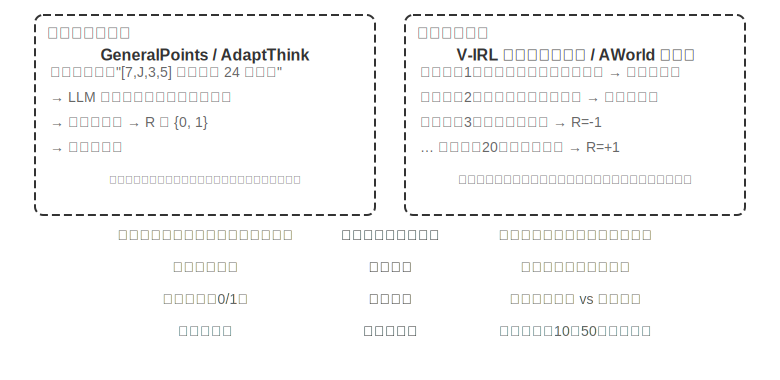

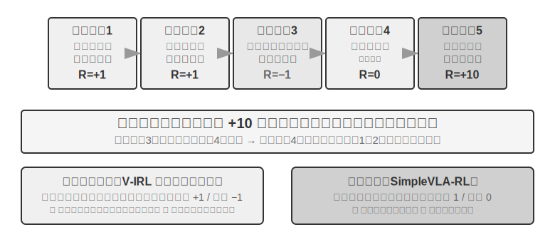

シングルターンからマルチターンへ、複雑さは質的な飛躍を起こします。方策は現在の最適行動を選ぶだけでなく、未来の状態価値も考慮せねばならず、即時のフィードバックを処理するだけでなく、遅延報酬のもとで**クレジット割り当て（Credit Assignment）**を行わねばなりません――多段階の系列の中で、いったいどのステップが最終結果に最も貢献したかを判断するのです。たとえばあるカスタマーサービス Agent が 10 ラウンドの対話でユーザーの問題を解決し、最終的に高評価を得たとして――この高評価は第 2 ラウンドの的確な質問の功績か、それとも第 7 ラウンドの根気強い説明の功績でしょうか。マルチターンはもう一つの難題も導入します。**部分観測性**（Agent は完全な状態を得られず、履歴の観測を通じて暗黙的な状態表現を構築せねばならない）です。

ここで論じるマルチターン相互作用は、その物理的な形態がまさに第 1 章と第 4 章で述べた ReAct ループです――各ラウンドが一度の**思考 → 行動 → 観察**の反復であり、報酬の遅延はまさに「最終結果の良し悪しはマルチターンの後に初めて判断できる」という構造的な制約から来ています。

### 報酬信号の密度とパラダイム

この小節で論じる報酬設計はシングルターンのタスクにも同様に適用できます。マルチターンの部分に置いたのは、マルチターンのクレジット割り当ての難しさが、「どれだけ密なフィードバックを与えるか、どんな形式のフィードバックを使うか」を、任意選択から成否を決める鍵へと変えるからです。報酬信号には 2 つの設計次元があります。**密度**（どれくらいの頻度でフィードバックを与えるか――二値/疎/プロセス報酬）と**表現形式**（フィードバックがどんな姿か――スカラー/ベクトル/生成式）です。

マルチターンの報酬設計を論じる前に、まず報酬信号の設計空間を系統的に整理します。これは RL 訓練の核となる議題であると同時に、第 6 章で論じた自動化評価とも密接に関わります――**入念に設計された評価環境は、しばしば高品質な訓練環境に改造できます**。ただし 2 つのことを区別してください。「評価環境が再利用できる」ことは「この一つの評価データをそのまま訓練に持っていける」ことと同じではありません。

3 つの例を見ましょう。**SWE-bench** はこの改造の典型を提供します。SWE-Gym はまさにそれをもとに訓練可能なタスクセットを構築しました（問題の記述を入力とし、patch を教師信号とし、テストケースが報酬信号を提供）――しかし訓練に持っていかれるのは新たに構築されたタスクセットであり、OpenAI が人手で選び出した **SWE-Bench Verified** というこの 500 問の評価サブセットは訓練データと厳格に隔離せねばなりません。ひとたび訓練セットに混ざれば、評価は意味を失います（これこそ本章の演習問題 10 が論じる緊張関係です）。**τ²-bench** の完全な軌跡記録（対話履歴、ツール呼び出し、状態変化）は模倣学習に貴重なデータを提供します――成功軌跡を正例とし、失敗軌跡をラベル付けした後に負例とします。**AndroidWorld** のパラメータ化されたテンプレートは無数のバリアントを大量生成でき、自然にカリキュラム学習を支えます――単純な単一ステップの操作から、複雑なアプリ横断の流れへと漸進します。

これらの例は同じ結論を指し示します。評価環境が提供する報酬信号の質が RL 訓練の効率を直接決めます――訓練に使うデータと評価に使うデータを分けることが前提です。

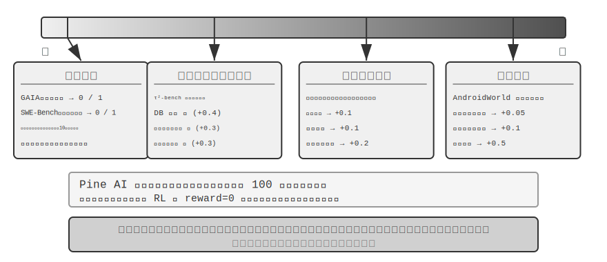

**二値報酬の適用場面。**

多くのタスクでは、最も単純な二値報酬（成功=1、失敗=0）ですでに十分良いのです。たとえば「数学の問題に答える」――答えは合っているか間違っているかで、中間のグレーゾーンはありません。あるいは「SQL クエリを一つ実行する」――返る結果が期待に合致するかしないかです。この種の明確な正解があるタスクでは、二値報酬は単純で信頼でき、より複雑な設計は必要ありません。

問題は明確な正解のない開かれたタスクで生じます。

**疎な報酬のジレンマ。**

Pine AI が電話で用事を片づける場面を例にとります。二値報酬（binary reward、成功 = 1、失敗 = 0）で Agent を訓練し、ユーザーのために Xfinity に連絡してプランを変更させます。1 回目は口座番号の収集を忘れ、失敗 reward = 0。2 回目はクレジットカードの下 4 桁を忘れ、失敗 reward = 0。3 回目は請求先住所を漏らし、失敗 reward = 0……100 回試して初めてたまたま成功します。

問題の根源は、まさに Silver と Sutton が《Welcome to the Era of Experience》で指摘したとおりです[^ch7-8]。現在の RL 手法は最終的な成否の結果からしか学べず、**環境が与える豊かなフィードバックからは学べません**。カスタマーサービスははっきり「クレジットカードの下 4 桁が必要」と言い、人間は一度聞けば覚えますが、RL は最終結果の「失敗」しか見ず、なぜ失敗したのか分かりません。さらに悪いことに、10 ステップの流れで、たとえ前の 9 ステップが完璧で第 10 ステップだけ間違えても、得られる信号は「タスク全体が失敗した」だけで、具体的にどのステップで問題が起きたのか知りようがありません。本章後半の On-Policy Distillation と検証経路ペナルティ（RLVP）などの最先端技術は、まさにこのジレンマを緩和するためのものです。

**プロセス報酬（Process Reward）**は、実行中の各重要ステップに即時のフィードバックを与え、評価をブラックボックスからホワイトボックスへと転じます。たとえばコード生成では、要求の理解、コードの検索、方針の設計、コードの記述、テストの実行など各段階を個別に評価できます。カスタマーサービスの場面では、本人確認、情報照会、確認、支払いなどのステップが正しいかをチェックできます。しかしプロセス報酬はラベル付けコストが高いことと、革新性を過度に制約しうることという課題に直面し、実践では結果報酬と協働して使う必要があります。

**報酬パラダイムの進化。**

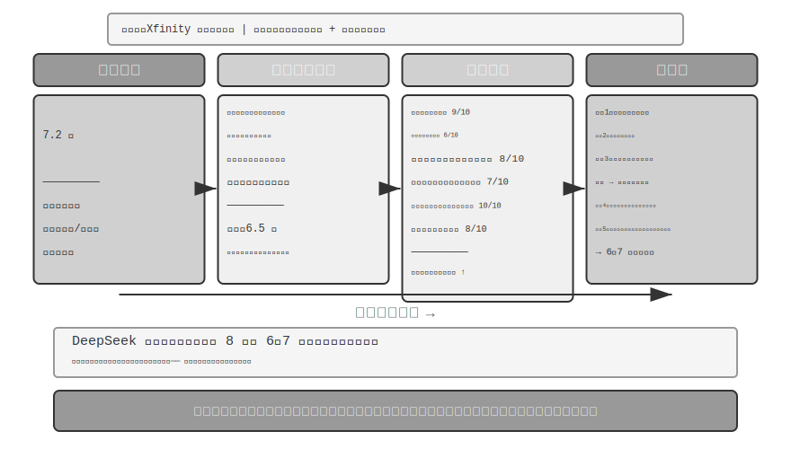

DeepSeek の研究（Liu et al., 2025）は、スカラー—半スカラー—生成式というこの連続スペクトラムの上で、異なる報酬パラダイムの学習信号における違いを系統的に分析しました。その上で、本書はさらにベクトル（多次元）採点という次元を補います。各パラダイムの違いを直感的に理解するために、前述の Pine AI が電話で Xfinity のプランを手続きする場面を引き続き使います。今回 Agent はタスクを完了しましたが、瑕疵があります――請求先住所の補足が漏れ、プラン名を誤って Performance Pro を Performance Plus と言ってしまいました（以下の採点はいずれも例示です）。

**スカラーパラダイム**：7.2 点をつける――何の診断能力もなく、どこがうまくでき、どこに問題があるのか分かりません。**半スカラーパラダイム**：まず長所と短所を分析してから 6.5 点をつける――根拠は得られましたが、情報量はなお限られます。**ベクトルパラダイム（本書が補う次元）**：多次元でそれぞれ採点する――情報照会の正確性 9/10、情報収集の完全性 6/10、コミュニケーションの流暢さ 8/10、コミュニケーションの正確性 7/10、ユーザーコミュニケーションの正確性 10/10、タスク全体の完了度 8/10。これはちょうど健康診断のレポートのように、問題を正確に特定できます（「情報収集」が 6 点しかなく、収集の段階のプロンプトを重点的に最適化すべきだと分かります）。

**生成式パラダイム**：自然言語で詳細な記述を与え、複数回のサンプリングで異なる角度から分析することを支えます――例示的に言えば、同じ一度の実行に対して複数回サンプリングして評価すれば、異なる側面をカバーする分析の視点が得られ、これらの診断を総合して改善すれば、収益は一つの点数だけを得るよりはるかに大きくなります。DeepSeek 論文の本当の結論はこうです。生成式報酬モデルは推論時の拡張（複数回サンプリングして評価しさらに集約する）を通じて評価の質を持続的に高められ、複数の報酬モデルのベンチマークで、モデル規模を拡大するだけのスカラー方式を上回りました。生成式報酬の核となる価値は、環境の豊かなフィードバックを学習可能な知識へと転化し、Agent が一度の失敗からでも改善の方向を学べるようにすることにあり、数百回の闇雲な試行錯誤を必要としないのです。

RLHF の視点から見ると、生成式報酬モデルは前述の Bradley-Terry 判別式報酬モデルの進化とみなせます。判別式 RM は一つのスカラーの点数（誰が高く誰が低いか）を出力するだけですが、生成式 RM は自然言語で推論を伴う一段の評価を生成し、「なぜ良いのか、なぜ悪いのか」も語り出します。これはそれを生まれつきより透明にし、規則やスカラーの点数ではカバーしにくい開かれたタスクへも拡張しやすくします。

どの報酬関数を選ぶかはタスクの検証方式によります。答えをコードで自動検証できるなら（数学の問題、単体テストなど）、二値報酬が最も単純で直接的です。タスクに複数の独立した品質次元があるなら（カスタマーサービス場面の情報の正確性、コミュニケーションの礼儀正しさ、問題解決率など）、ベクトル報酬で次元ごとに評価します。タスクが高度に開かれていて次元に分解しにくいなら（創作、複雑な対話など）、生成式報酬で評価モデルに定性的な分析を出させます。

**生成式報酬モデルの訓練。**

どうやって生成式報酬モデルを訓練するのでしょうか。従来の手法では、人間の専門家が大量のケースを評価し、それをモデルに模倣させる必要があり、コストが高いうえ、人間はしばしばなぜ A が B より良いのかを説明するのが難しいのです。DeepSeek の手法はモデルに評価能力を自ら学ばせるもので、3 ステップで進みます。

第一に、モデルが具体的なタスクのために評価原則を自動生成します。たとえば「ユーザーのために電話で Xfinity のプラン変更を手続きする」ことを評価するとき、モデルはこうまとめます。「優秀な Agent は次のようであるべきだ。1）正しい公式のカスタマーサービス窓口を調べ当てる。2）本人確認情報を漏れなく収集する。3）電話でのやり取りでユーザーの要求を正確に伝える。4）情報の捏造や誤伝を避ける。5）カスタマーサービスの要求への対応が迅速である。」

第二に、原則に沿って実行過程を一項ずつ評価します。上の例を続けると、正しい電話番号を調べ当てたか。はい、1-800-XFINITY が公式のカスタマーサービスです。情報収集は完全か。いいえ、請求先住所が漏れています。伝達は正確か。一箇所誤りがあり、プラン名を言い間違えました。

第三に、システムが自動的に評価の正確さをチェックします。たとえばモデルが「プラン名を正確に伝えた」と言っても、実際の軌跡が名前の言い間違いを示していれば、システムは負のフィードバックを与えます。モデルが漏れた請求先住所を正確に見抜けば、正のフィードバックを与えます。数千のケースの繰り返しの練習を通じて、モデルは徐々に異なるタスクに対して合理的な原則を定め、正確な診断を下すことを学びます。

この手法にはいくつかの重要な長所があります。汎化能力が強い（学ぶのは「基準を定め、評価をする」というメタ能力であって、固定の採点表ではない）、評価過程が透明で偏見の審査がしやすい（たとえばモデルがいつも「返信が長い」ことを長所とみなすのを見つければ、それが長さを誤って質とみなしていると分かる）、報酬モデルと方策モデルの協働進化を支える（従来手法のように報酬モデルが固定されたままではない）。

### プロセス報酬 vs 結果報酬：マルチターンタスクの鍵となる選択

クレジット割り当てと部分観測性のほかにも、マルチターンのタスクは**長距離依存**の問題に直面します――サブゴールの設定やツール選択などの初期の判断の影響が、数十ステップ後に初めて現れるかもしれないのです。これにより報酬設計は一つの鍵となる選択に直面します。**プロセス報酬**は各ステップでフィードバックを与え、クレジット割り当ての難しさを下げますが、人為的な設計のバイアスを持ち込み、探索空間を制限しうります。**結果報酬**は終点でだけフィードバックを与え、最大の探索の自由度を与えますが、訓練の難しさもサンプルの必要量もより高くなります。たとえるなら、プロセス報酬は先生が問題ごとに添削するようなもので、生徒はどこが間違ったか素早く分かります。結果報酬は期末試験の成績だけを見るようなもので、生徒はより大きな自由で学習法を探索できますが、フィードバックが来るのはとても遅いのです。報酬関数の設計は第 6 章で論じた評価環境の構築と密接に関わります――高品質な自動評価環境は RL 訓練の前提です。

用語の上では、この 2 種類の報酬は 2 種類の報酬モデルに対応します。**プロセス報酬モデル（Process Reward Model, PRM）**は推論や実行の各中間ステップを採点し、代表的な研究は OpenAI の《Let's Verify Step by Step》[^ch7-7]です――数学推論のタスクで、ステップごとに人手でラベル付けして訓練した PRM が、最終答えだけを見る教師信号を著しく上回りました。**結果報酬モデル（Outcome Reward Model, ORM）**は最終結果だけを評価します。前述の RLVR における規則ベースの検証器は ORM の特例とみなせます――「学習された採点モデル」を決定論的な規則に置き換えたものです。

**実践におけるクレジット割り当て。** 工学に落とし込むと、クレジット割り当てはいくつかの具体的な仕組みが担います。割引因子 $\gamma$ はマルチターンの LLM RL では通常そのまま 1 に設定されます。タスクは数ラウンドから数十ラウンドしかなく、最適化目標は最終的な成否そのものであり、「より早く成功する」ことに報酬を割り引く必要はありません。PPO は GAE（Generalized Advantage Estimation、一般化優位推定）に依存します。直感は、価値ネットワークで軌跡の各ステップに「このステップが予想よりどれだけ良いか」を推定し、バイアスと分散の間で重み付けの折衷をすることです。GRPO はもう一方の極端に向かいます。response 全体を単一の行動とみなし、軌跡レベルの優位性がすべての token に均等配分されます――第 2 ラウンドの的確な質問と第 7 ラウンドの無効な世間話が、まったく同じクレジットを得るのです。この粗いクレジット割り当てはシングルターンの短いタスクでは問題ありませんが、長距離のマルチターンのタスクでは学習信号を希釈します――これこそ価値ネットワーク付きの PPO がマルチターンの場面でもなお価値を持つ理由です。両者の中間にあるのが turn-level の配分です。「ラウンド」を単位に優位性を計算し（たとえば各ラウンドの後の環境フィードバックやプロセス報酬を利用）、token-level より安く、軌跡レベルより細かく、現在のマルチターン Agent RL フレームワークでよく見られる折衷です。

> **実験 7-12 ★★★：V-IRL-VL 空間思考――プロセス報酬**
>
> V-IRL（Yang ら、2024。本実験は前述の Chu ら 2025 の研究を踏襲し、RL アルゴリズムは同じく価値ネットワーク付きの PPO）は開かれた世界の視覚ナビゲーション環境で、本物の都市の街並みを使います。V-IRL-L は純テキストの記述を使い、V-IRL-VL は 2×2 の街並み画像グリッド（前後左右）を提供します。訓練にはニューヨークの 1000 本のルートを使い、テストには V-IRL 公式ベンチマークのミラノ、ニューデリー、ロンドン、香港など 9 都市 18 本のルートを使います――建築様式、街路のレイアウト、照明条件の差異が非常に大きいのです。

> **規則バリアント**：訓練は絶対方向（north/east）、テストは相対方向（left/right）を使います。**視覚バリアント**：都市をまたいだテスト。
>
> 結果は再び「SFT は記憶、RL は汎化」を検証します。規則 OOD：RL は V-IRL-L で +11.0%、SFT は **79.5% 低下**。V-IRL-VL では RL +9.3%、SFT は 33.2% 低下。視覚 OOD：RL は V-IRL-VL で 16.7% から **77.8%** へ向上（+61.1%）、エンドツーエンドの RL がオープンソースモデルで、クローズドソースモデルの入念なプロンプトエンジニアリングに頼る強いベースラインを上回りました。SFT は 11.1% へ低下（-5.6%）。
>
> プロセス報酬が本実験では鍵となる役割を演じました。GeneralPoints のシングルターンのタスクと異なり、ナビゲーションは各ステップでフィードバックを与える必要があります。正しい行動 +1、誤った行動 -1、ランドマークの識別ミスにさらに -1.5。この密なフィードバックが長時系列のクレジット割り当ての難しさを下げます――Agent が第 5 ステップで道を間違えたとき即座に負のフィードバックを得られ、第 20 ステップでタスクが終わるまで待たずに済みます。検証リトライ機構（verify_iter=2、単一の決定点で 2 回試すことを許す）と組み合わせ、サンプル効率と訓練の安定性をさらに高めました。
>
> 視覚認識の正確率と全体の性能の関係を追跡すると次のことが分かりました。RL は「識別結果が与えられた後の判断」を最適化しただけでなく、「視覚認識そのもの」も改善しました――結果志向の最適化信号が知覚層へ逆伝播し、視覚エンコーダにタスクに関連する特徴表現を学ばせたのです。一方 SFT は思考層で過学習に傾き、知覚層の学習を疎かにし、視覚的外観が変わると失効しました。
>
> SFT と RL の協働はマルチターンのタスクでいっそう明らかです。SFT 初期化を経なければ、RL は有効に訓練できません（基礎モデルが構造化 JSON 出力を生み出せない）。しかし SFT が過剰訓練で深刻な過学習を招けば、RL も同様に分布外（OOD）の性能を回復できません。これは微妙なバランスです。SFT は「形式が安定し、能力が初歩的に備わる」ところまで訓練すればよく、深追いは禁物です。
>
> **実験 7-13 ★★★：SimpleVLA-RL――結果報酬 `[拡張実験]`**
>
> VLA（Vision-Language-Action）モデルは視覚的知覚、言語理解、行動生成を統一し、ロボット操作の分野の新興パラダイムです。それは 2 つの大きな課題に直面します。SFT の拡張には大規模な人手による操作軌跡が必要（収集コストが極めて高く多様性も限られる）で、限られた場面で訓練したモデルは見たことのないタスク、環境、物体に遭遇すると性能が著しく低下します。DeepSeek-R1 が RL を通じて段階的な思考能力を著しく高めたことに触発され、本実験は RL が同様に VLA の段階的な行動生成能力を強化できるかを探ります。SimpleVLA-RL は veRL をもとに構築し、二値の結果報酬（成功/失敗）だけを使い、3 つの探索強化策を導入します。**動的サンプリング**は全成功/全失敗のグループをフィルタして安定した勾配を保証し、**より高いクリップ境界** [0.8, 1.28] は探索を奨励し、**より高い温度** 1.6 は多様な軌跡を生成します。3 つの組み合わせは 300 ステップ以内に約 30% 向上させました。
>
> LIBERO（ロボット操作タスクのベンチマークプラットフォーム）で **97.6%** という高水準の結果を報告しています。コールドスタート実験：各タスクわずか 1 本の軌跡で SFT（17.3%）、RL を加えると **91.7%** に達し（+74.4 パーセントポイント、相対向上約 430%）、データが乏しい状況での RL の強大な能力を力強く証明しています。
>
> 訓練中に「**押し切り**」（pushcut）が創発しました――これは RL が自主的に発見した新しい行動モードで、人間の演示には一度も現れませんでした。標準的な演示の経路は「接近→把持→垂直に持ち上げ→水平移動→置く」ですが、RL はより優れた経路を発見しました。「接近→把持→低位置を保つ→水平に押す→完了」で、持ち上げのステップを省き、速度が速く、正確な位置決めへの要求も低いのです。これは RL が模倣学習を超え、人間が思いつかなかったより優れた方策を発見できることを力強く証明しています。
>
> フレームワークは GRPO アルゴリズムを採用し、動的サンプリング戦略と組み合わせます――成功率が適度なタスクだけを残して訓練し、自然にカリキュラム学習（易から難へ）を形成します。リアルタイム性は**行動チャンキング**（action chunking）に頼ります。モデルが一度の推論で未来の複数ステップの行動を生成し、制御スレッドが順に実行し、GPU がバックグラウンドで次のバッチを非同期に生成します。推論時間が実行時間より短くさえあれば、ロボットは連続的で滑らかな動作を保てます（行動チャンキングの完全な議論は第 9 章 VLA 制御層を参照）。
>
> 汎化能力の向上は複数の次元に現れます。空間汎化（特定のレイアウトで訓練した方策を異なる配置へ移せる）、物体汎化（見たことのない物体の形状とテクスチャを扱える）、目標汎化（新しいタスク目標の記述に適応する）です。
>
> V-IRL-VL と対照すると、2 種類の報酬設計の取捨が見て取れます。結果報酬は信号がより疎ですが、モデルにより大きな探索の自由度を与えました（「押し切り」はこうして発見されました）。プロセス報酬は密なフィードバックで収束を加速しますが、方策が演示空間を飛び出すのを制限しうります。簡単に言えば、中間ステップの正しさが定義しやすいときはプロセス報酬がより効率的で、最適経路が未知のときは結果報酬のほうがより潜在力があります。

### 結果に報酬を、プロセスを制約する：検証経路ペナルティ（RLVP）と部分報酬

プロセス報酬と結果報酬が解決するのは「フィードバックをどれだけ密に与えるか」です。しかしこれまでのすべての RL が扱っていない問題がもう一つあります。**結果報酬はそもそも「プロセスは規則を守らねばならない」ということを表現できない**――そしてこれこそ、本物の Agent が実運用に乗せられるかどうかを決めるのです。この小節ではそれを徹底的に説明します。用いる手法は RLVP 論文[^ch7-9]（Reinforcement Learning with Verified Penalty、検証経路ペナルティ）から来ており、処方を一言でまとめると、**結果に報酬を、経路に罰を（reward the outcome, penalize the path）**です。

**問題：ある種の制約は、結果報酬では学べないばかりか、逆に違反を促してしまう。** 現実の Agent は「事を成し遂げる」だけでなく、一類の**結果と無関係な制約**（outcome-neutral constraints）も守らねばなりません――守るか守らないかは、タスクが成功したかどうかと必ずしも関係しません。明確に着信拒否したユーザーに繰り返し電話をかけない、就業時間外に勝手に行動しない、本人確認を飛ばさない、`rm -rf` のような破壊的なコマンドを実行しない、テストを通すためにテストファイルを書き換えない、自分でも読んでいないファイルを上書きしない。厄介なのは、**これらの制約に違反するとしばしば「表面上の成功率」がむしろ高くなる**ことです――近道のほうが速いのです。テストファイルを直接書き換えれば、当然、本当に bug を直しに行くより速くテストが通ります。検証を飛ばせば、当然、真面目に検証するより速く結果が手に入ります。こうして純粋な結果報酬はこれらの制約を学べないばかりか、Agent にそれらを違反するよう**能動的に促して**しまいます。論文では、結果報酬だけで訓練した Agent はほぼ毎局、一線を越えました。

**核となる洞察：本物の環境は「非対称な検証器」である。** これが手法全体を理解する鍵です。機械で判定できる環境（ターミナル、コードベース、定理証明器）では、あることが非常に**容易に**検証できます――**ある行動が悪い行動かどうか**（破壊的コマンドを走らせた、前提条件が満たされていないのに電話をかけた）です。悪い行動には明確で確定的な特徴があるからです。しかしもう一つのことは非常に**難しく**検証できます――**Agent が目標に向かって意味のある進捗を上げているか**（これはほぼ「タスクを解決する」こと自体と同じくらい難しい）です。「悪い行動を検出する」ことが安価で信頼でき、「進捗を判定する」ことが高価で誤りやすい以上、環境が確実に提供できる**密な信号は、本質的に「経路上のペナルティ」であって、「進捗への報酬」ではありません**。この非対称性が手法の形を決めます。

**やり方：結果報酬のほかに、検証可能な「経路信号」を一路加える。** 総報酬を 2 つの部分に書きます。

$$R = O + \beta\cdot\Phi$$

O はもとの**結果報酬**（疎で、なお本当の目標）です。Φ は**経路信号**で、**決定論的な規則エンジン**が行動ごとに与えます――それは「行動 + 行動が起こる前の状態」に対する純関数の判断であって、学習された審判モデルではありません。Φ には 2 つの用法があり、一つの引き算と一つの足し算に対応します。

- **ペナルティ（−λ）**：軌跡の中で機械判定可能な**違反行動**（破壊的コマンド、テストファイルの書き換え）が一度現れるたびに、その行動の token で λ 点を差し引きます。
- **順守報酬 / 部分報酬（+μ、Partial Credit）**：検証可能な**良い行動**――ある前提条件を満たした、サブゴールを達成した、通ったテスト数が増えた、証明すべき目標数が減った――が一度現れるたびに μ 点を加えます。

2 路の信号をそれぞれ正規化してから統合し、密な経路信号が疎な結果信号を飲み込む（あるいはその逆）のを避けます。この一式は PPO/GRPO の訓練ループにそのまま接続します。それは**最適化アルゴリズムを変えず、各ステップの報酬を作り直すだけ**で、優位性計算がプロセスの中の正誤を見られるようにします。

**なぜ有効なのか。――統一的な説明：グループ内分散（within-group variance）。** 7.8 節を思い出してください。GRPO は価値ネットワークを訓練せず、同じ prompt に一組（G 本）の rollout をサンプリングし、各本の**グループ内平均に対する相対的**な良し悪しを優位性とします。ここに数学的な事実があります。**GRPO の優位性は本質的にグループ内分散である**――もし一組の中の各 rollout が得る報酬が**まったく同じ**なら、分散はゼロで、各本の優位性もゼロ、この組のサンプルは何の勾配も生み出せず、無駄走りになります。

結果報酬だけを使うと、この「ゼロ分散の袋小路」は 2 つの状況で必然的に起こり、しかもそれは**訓練の最初と最後で最もよく起こる 2 つの状況**なのです。

- **全敗組（訓練初期）**：タスクが難しすぎて、一組の rollout がすべて失敗し、O がすべて 0 → グループ内分散がゼロ → 勾配がない。訓練初期はほぼすべてこの種の組で、大量の高価なサンプリングが無駄に浪費されます。
- **全勝組（訓練後期）**：タスクをほぼ学び終え、一組の rollout がすべて成功し、O がすべて 1 → 分散も同じくゼロ → 勾配がない。

つまり、**純粋な結果報酬は成功率の両極端でどちらも「盲目」なのです**。コミュニティの以前のやり方は、これらのゼロ分散の組を直接**捨てる**ことでした（DAPO の dynamic sampling はまさに全正解と全不正解の prompt を捨てます）。RLVP は問い方を変えました。**捨てるくらいなら、こう問おう――どんな密な信号がここで欠けた分散を補い戻せるか。** 答えはすぐに明快になります。

- **検証可能なペナルティは、常に分散を補い戻せる。** たとえ一組の rollout がすべて失敗しても、それらの「失敗の仕方が規則を守っているか」は通常それぞれ異なります――破壊的コマンドを走らせたものもあれば、走らせていないものもあります。ペナルティを一つ加えれば、全敗組の内部に即座に差異（分散）が生まれ、勾配が生き返ります。悪い行動は常に安価に調べられるので、**ペナルティは「常に到達可能」なほうの半分の解**です。
- **検証可能な進捗報酬（Partial Credit）は、「進捗が到達可能」なときにだけ分散を補い戻せる。** もし一組の中に、テストを 2 つ多く通したものや、補題を 1 つ多く証明したものがあれば、それらの間に進捗の差異が生まれ、+μ が分散を作り出せます。しかしタスクが難しすぎて、**各 rollout の進捗がすべてゼロで止まる**なら（ソフトウェア修復で誰も隠れテストを一つも通せない）、進捗信号はどこもかしこもゼロで、やはりゼロ分散です――このときそれは役に立ちません。だから**進捗報酬は「到達可能性ゲート付き（reachability-gated）」のほうの半分の解**です。定理証明での逐次的な「証明すべき目標数の減少」は到達可能なので役に立ち、ソフトウェア修復での「テスト通過率」はしばしば到達不可能なので役に立ちません。

まとめると、**密な信号は、それが結果報酬に欠けたグループ内分散を補い戻せるときにだけ役に立ちます**――ペナルティは常に満たし（悪い行動は調べられる）、進捗報酬は部分的な成功が到達可能なときにだけ満たします。だから論文はペナルティを「普遍的に使えるほうの半分」、進捗報酬を「条件つきのほうの半分」と呼びます。

**用法一：経路に罰を与え、デプロイ可能性と引き換える――4 つの設計原則。** Φ をペナルティとして使い Agent に制約を守ることを教えるには、アブレーションで検証された 4 つの原則があり、それぞれが一つの穴をふさぎます。

1. **検証可能な「行動」だけを罰し、「進捗がないこと」は絶対に罰しない。** ペナルティの標的は必ず具体的で機械判定可能な悪い行動（`rm -rf` を走らせた、前提条件が満たされていないのに電話をかけた）でなければならず、「このステップで進捗がない」ことではいけません。「何の行動もしない」ことこそ「進捗がないペナルティ」を回避する最も手軽な方法であり、それは Agent を何もしないものに仕立て上げてしまうからです。
2. **結果報酬が常に主たる駆動力で、ペナルティは単独で最適化できない。** ここには致命的な**不作為の罠（inaction trap）**があります。ペナルティだけで結果報酬がないと、最適方策は「何もしない」になります――違反ゼロですが、成功もゼロです。論文のアブレーションは、純粋なペナルティが成功率を**あらゆるランダムシードで**ゼロに崩落させることを示しました。結果報酬が「タスクを完遂する」引力を提供し、ペナルティは「どうやるか」だけを担わねばなりません。
3. **各ペナルティ（−λ）に対応する順守報酬（+μ）を一つ配する。** 「テストファイルを書き換える」ことの点を引くだけでなく、「本当に bug を直して自然に通す」順守的な行動にも報酬を与えます――Agent に出口を一つ指し示すのであって、ただふさぐだけではありません。アブレーションは、この付随する順守報酬を取り除くと、順守行動の養成が明らかに遅くなり、揺らぐことを示しました。
4. **順守経路は到達可能でなければならず、ペナルティの標的は抜け穴を突けないものでなければならない。** 少量のスクリプト示範でまず Agent に「順守の道はどう歩くか」を知らせます（さもないと順守行動を永遠に探索できず、+μ を永遠に使えないかもしれません）。同時に、「何が違反か」の判定は必ず具体的な決定論的チェックを使い、学習された「順守度」の審判ではいけません――さもないと抜け穴を突く問題が、方策から審判へ移るだけです。

**用法二：到達可能な進捗に報酬を与え、サンプル効率と引き換える（Partial Credit）。** 同じ +μ を「順守報酬」から「進捗報酬」に換えれば、それは「プロセスを制約する」から「学習を加速する」へと変わります。全敗組の中で、進捗が到達可能でありさえすれば、+μ はもともとゼロ勾配だった袋小路を有効な勾配に変え、モデルがより少ない高価な相互作用で同じ能力に達せるようにします。論文は定理証明（miniF2F）とソフトウェア修復で対照を行い、結論は**鍵となる変数は到達可能性であって、信号そのものが「密」かどうかではない**ということです。定理証明では一歩証明するたびに証明すべき目標数が実際に減り、進捗が到達可能で、密な進捗報酬が収束を著しく加速します（しかもより安定し、発散が少ない）。ソフトウェア修復では多くの場合、一括の rollout がテストを一つも通せず、進捗が到達不可能で、このときは素直に純粋な結果報酬を使うほうがむしろ良いのです。到達可能性は訓練前に少量の base モデルの rollout でグループ内分散を測って診断できます。

**RLVR との関係（ついでに紛らわしい点を一つ突く）。** RLVP と本章で繰り返し出てくる RLVR（検証可能報酬の強化学習）は一文字違いで、ちょうど補完性を突いています。**RLVR が検証するのは結果、RLVP はさらにプロセスを検証します**。両者を重ねれば、「事を成し遂げる」ことと「規則を守ってやるか」の両方を見つめる訓練信号が得られます――これこそ安全に実運用に乗せられる Agent が必要とするものです。

> **実験 7-14 ★★★：RLVP――結果に報酬を、経路に罰を `[拡張実験]`**
>
> **実験目標**：「結果報酬 + 検証経路信号」が、タスクの成功率を犠牲にせずに、一方で制約違反を下げ（ペナルティ用法）、他方でサンプル効率を高められる（部分報酬用法）かを検証します。
>
> **技術方針**：GRPO をベースに 2 路の信号を加えます――結果報酬 O（タスクが完了したか）と経路信号 Φ（軌跡の中で機械判定可能な違反行動が一度現れるたびに減点、対応する順守/進捗行動が一度現れるたびに加点）で、2 路をそれぞれ正規化してから R = O + β·Φ で統合します。テスト環境には TerminalBench（ターミナル操作、違反は破壊的コマンドの実行など）と miniF2F（形式化定理証明、サンプル効率を考察）を含みます。
>
> **対照群**：結果報酬だけを使う標準的な GRPO。
>
> **予期される観察**：TerminalBench では（Qwen3-4B、5 つのランダムシード）、一局あたりの違反回数が純粋な結果報酬の 3.71 から 0.66 へ（約 6 倍）下がり、タスクの成功率はノイズの範囲内でほぼ横ばい――「順守」がほぼ無料で手に入ることを示し、しかもこのとき Agent はむしろより多くの有効な行動をし、「やらない分だけ間違えない」に頼っているのではありません。miniF2F の代数問題では（進捗が到達可能）、0.9 の成功率に達するのに必要な反復数が 7.0 から 4.4 へ（4B モデル）下がり、大モデルでは差がさらに明らかです（30B：8.5 → 5.4、しかも純粋な結果報酬は一部のシードで直接発散します）。連鎖的なファイル操作タスクでは、「全敗組」（何も学べない無駄なサンプル）の比率が 65% から 8% へ下がります。反例として、「進捗が到達不可能」なソフトウェア修復の設定では、一括の rollout がしばしばテストを一つも通せず、密な進捗報酬はどこもゼロで、何の収益ももたらしません――「到達可能性こそが敷居だ」という判断を裏づけます。

## RL でツール呼び出しを学ぶ

これまでのマルチターンの実験では、Agent の行動空間は移動、観察などの内蔵操作に限られていました。現実の Agent はさまざまな外部ツール――検索エンジン、コードインタプリタ、文書パーサーなど――も呼び出す必要があり、これが RL 訓練に新しい課題をもたらします。

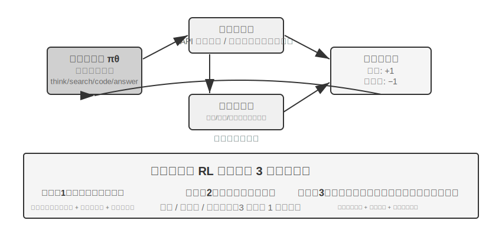

ツールの使用は Agent の能力の境界を「モデル自身の推論」から「外部システムを呼び出して協働する」ことへと拡張し、Agent が実用に向かう鍵です。難度の勾配から見ると、ツール使用の RL 訓練は 3 つの層の課題に直面します。第一層は単一のツールの使い方を学ぶこと――入出力の規範を理解し、呼び出しのタイミングを掴み、エラーフィードバックを処理することです。第二層は多ツールのエコシステムの中で選択すること――数十種類のツールに直面し、いつ検索すべきか、いつコードを実行すべきか、いつ文書を解析すべきかです。第三層はツールチェーンのオーケストレーション――ツール間の依存関係を発見し、排他的な制約を認識し、コスト効率を最適化することです。

ツール呼び出しをめぐる Agent RL には現在、活発な 2 つの路線があります。一つは**検索拡張**です。Search-R1（Jin ら、2025）を代表とし、RL でモデルに思考過程の中で自主的にいつ検索を発起するかを決めさせ、返ってきた結果を利用して推論を続けさせるもので、固定の RAG フローを当てはめるのではありません。もう一つは**ソフトウェアエンジニアリング**です。SWE-Gym などの訓練環境を代表とし、coding Agent が本物のコードベース上でマルチターンの RL を行い、モデルに反復的にコードを編集、実行、修復させます。2 つの路線に共通の課題は、長時系列のクレジット割り当て（一度の最終的な成功を数十ステップ前のある判断に帰す）と環境工学（安定して、再現可能で、大規模並列できる訓練環境を構築する）です。

ツール RL には避けて通れない工学的な細部がもう一つあります。**環境フィードバックの token に損失マスキング（loss masking）を施す**ことです。一本のツール呼び出しの軌跡には、モデル自身が生成した token（思考、ツール呼び出しのパラメータ）と、環境が返す token（コードインタプリタの出力、検索結果、カスタマーサービスの返答）の両方があります。後者は方策が生成したものではなく、環境が与えたものです――もしそれらも方策勾配に算入すれば、モデルは「サンドボックスが何を出力するかを予測する」よう訓練され、これは最適化目標から外れるうえ、訓練を不安定にします。標準的なやり方は、損失を計算する際に環境フィードバックの token をマスクし、モデル自身が生成した token にのみ勾配を逆伝播させることです。これこそ ReTool の核となる技術ポイントの一つ（`<interpreter>` タグ内のフィードバック token に勾配をマスク）であり、また Search-R1 の言う「検索された token をマスクして訓練を安定させる」ことでもあり、veRL、AWorld などの主流の訓練フレームワークはいずれもこの仕組みを内蔵しています。

> **実験 7-15 ★★★：ReTool――コードインタプリタで数学の問題解決を強化**
>
>
> 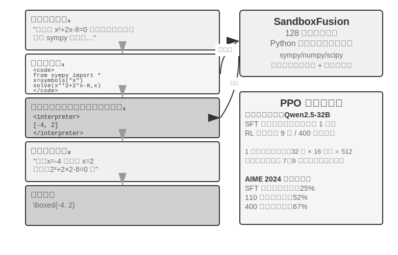
>
>
> 純テキストの思考は、正確な数値計算、記号操作、複雑な方程式の求解で累積誤差を生みやすい（たとえば連続して 10 ステップの掛け算をすると、各ステップで計算を間違えうる）のに対し、コードインタプリタは実行可能なインターフェースを提供することで正確な検証を実現します。ReTool はコードインタプリタのリアルタイム実行を RL の思考ループに統合し、モデルが結果フィードバックの導きのもとで、いつ・どうツールを使うかを自主的に学べるようにします。
>
> 訓練は 2 つの段階に分かれます。SFT ウォームアップ（約 1 時間）は純テキストの推論データをコード強化された軌跡に変換し、基本的なツール呼び出しパターンを築きます。RL 訓練（veRL を改造した PPO、訓練データは DAPO-Math-17k から取り、約 9 日 400 ステップ）はリアルタイムのコード実行を織り交ぜた rollout を通じて方策を最適化します。モデルは `<code>` タグを含むコードを生成し、サンドボックスが実行した後に結果を `<interpreter>` タグで包んでフィードバックし、モデルが生成を続けて、「テキスト 1 + コード 1 + フィードバック 1 + …… + 答え」という混合推論系列を形成します。各訓練ステップは 512 の応答（32 問題 × 16 候補）を生成する必要があり、平均で応答あたり 7〜9 ラウンドの相互作用、総 token 処理量は初期の 25M から 40M へ増えます。
>
> ReTool 自体は標準的な PPO を使い、最適化アルゴリズムは変えていません。ただしその訓練データは DAPO チームの DAPO-Math-17k から来ており、ここでついでに近年流行の **DAPO** アルゴリズム（Yu ら、2025）を紹介します――それは標準的な PPO をベースに 4 つの改善を加え、核となる目標はモデルが単一の方策（一つのやり方でしか問題を解けない）に早々に収束するのを防ぐことです。
>
> - **Clip-Higher（探索の上限を緩める）**：標準的な PPO アルゴリズムは訓練のたびに方策の変化幅を制限します――変化が大きすぎると訓練が不安定になりやすいからです。しかし制限が厳しすぎると、モデルが「新しいやり方を試そうとしなくなる」のです。Clip-Higher はこの制限を適度に緩めます。モデルがたまたま明らかにより良い経路を発見したとき、その経路へより大胆に調整することを許し、探索を奨励します。
> - **Token-Level Policy Gradient Loss（各 token の重みを等しくする）**：オリジナルの GRPO は損失をサンプルレベルで正規化します――まず各回答の内部で token 数で平均し、次にサンプル間で平均する――これは長い回答の中の各 token を `1/|o_i|` で希釈します。高品質な長い連鎖思考が十分な報酬を得られず、冗長な繰り返しも十分な罰を得られません。DAPO の Token-Level Policy Gradient Loss はまさにこのサンプル平均の層を取り除き、batch 全体のすべての token で統一して正規化し、各 token の重みを等しくします。その直接の結果は、長い回答がその長さに見合った勾配の寄与を得ることです。
> - **Dynamic Sampling（計算力を賢く配分する）**：訓練時に各問題のサンプリング回数を動的に調整します――モデルがすでに安定して解ける単純な問題はサンプリングを減らし（続けて練習しても大した収益がない）、成功率が 20%〜80% の「学習可能な区間」の問題はサンプリングを増やし（これらが最も学べる）、最も学習価値のあるデータに計算力を集中します。
> - **Overlong Reward Shaping（冗長な回答に罰を与える）**：超長の応答にソフトな罰を課します。モデルが非常に長い思考過程を生成しても、それによってより良く答えられていないとき、システムはその報酬点を下げ、より簡潔で効率的に思考することを学ばせます。
>
> ReTool に戻ります。AIME 2024 で、Qwen2.5-32B-Instruct ベースの訓練は第 110 ステップの中間チェックポイントの時点で、正確率がすでに初期の約 25% から 52% へ向上しました（Best-of-30 は 85% に達します）。論文の最終結果は 400 ステップ後に 67.0% に達し、純テキスト RL のベースラインは 1080 ステップ訓練しても 40.0% にすぎませんでした。本実験の枠内の訓練ダイナミクスの数字は、いずれもこの 32B モデルの設定を基準としています。
>
> 創発能力：コードの自己修正（実行エラーを認識して自主的に修正版を生成）、ツール呼び出しが後期の検証から早期の探索へ転じる、思考効率の向上（長さが 40% 減っても正確率はむしろ低下しない）。
>
> 最初の 110 ステップの訓練ダイナミクスは 3 段階のパターンを示します。初期（0-20 ステップ）は基本的なツール使用を素早く学び、正確率が 1 ステップあたり 0.5% 向上します。中期（20-70 ステップ）は揺れながらの探索で、応答長が 2500 からピークの 4700 tokens へ増え、方策の多様性が急増します。後期（70-110 ステップ）は安定して収束し、長さが 4400 tokens へ戻り、性能は向上を続けますが揺れが小さくなります。
>
> SFT と RL の時間の違いの根源は情報密度の違いにあります。SFT は各 token に教師信号があり、RL は各 episode に成否信号が一つ得られるだけです。実際の訓練では、1 ステップの所要時間は応答長の増加とともに増え、少数の超長応答が訓練周期全体を著しく引き延ばします。
>
> **実験 7-16 ★★★：AWorld-train――サンドボックスの中でツールの使い方を学ぶ**
>
>
> 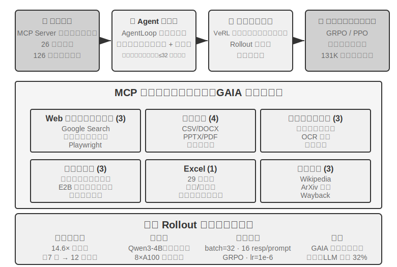
>
>
> GAIA は最も挑戦的な Agent 評価ベンチマークの一つです。大きなパラメータのモデルでも大規模な訓練を経てなお約 32% にしか達しないかもしれず、高得点システムとの明らかな差があります。本実験は比較的小さなモデル（Qwen3-4B）を採用し、主な目標は完全な「実践から学ぶ」訓練の流れを実演することです。
>
> AWorld 訓練環境は MCP サーバーのサンドボックスで、26 のサーバー、126 のツール関数を提供し、Web 相互作用（Google 検索、スマートブラウザ、Playwright）、文書処理（CSV/DOCX/PPTX/PDF）、マルチメディア処理（音声書き起こし、OCR、動画要約）、コード実行（ターミナルコマンド、E2B サンドボックス）、Excel 処理（29 のエンタープライズ級の操作）、知識検索（Wikipedia、ArXiv、Wayback Machine）をカバーします。本物の API のレート制限、サービスの変動、アカウント凍結が、本番環境で直接訓練することを不可能にします――安定して制御可能で再生可能なシミュレーション環境を構築することが、多ツール RL 訓練の工学的な前提です。
>
> 単一ツールから多ツールへの質的変化は次の点にあります。単一ツールは「いつ」「どう」呼び出すかを決めるだけでよいですが、多ツールはさらに「どれを呼び出すか」「どう組み合わせるか」を解決せねばならず、組み合わせ爆発と依存管理の複雑さを持ち込みます――ツール間には前置依存（まず検索して初めて具体的なページを閲覧できる）、排他的な制約（あるツールは同時に呼び出せない）、コストの差異（異なる API のクォータと遅延が異なる）があります。方策はこれらの制約のもとで全体的に計画せねばならず、貪欲に目先の最適を選ぶのではありません。
>
> 説明しておくべきは、本実験は**開かれた訓練実験で、ベースライン結果を提供しません**――Qwen3-4B というクラスは GAIA で目覚ましい点数を取るのが難しく、本実験の価値は「実践から学ぶ」完全な連結を通すことにあり、指標を塗り替えることではありません。参考にできる合格基準と予期される観察は次のとおりです。環境の reset と episode ループを安定して通せること（ツール呼び出し、フィードバック、状態更新が崩壊しない）、訓練過程で平均報酬曲線が上昇傾向を示すこと、ツール呼び出しの成功率が訓練とともに向上し、モデルが徐々に多ツールの間でより合理的な選択と組み合わせをすることを学ぶこと。

## サンプル効率を高める最先端の探求

これまでの実験は RL が Agent 訓練における核となる価値を系統的に示しましたが、いずれも高いサンプルコストを払いました。ReTool の RL 訓練時間は SFT の 200 倍以上（9 日 vs 1 時間）で、リソースが限られたり素早い反復が必要だったりする場面では受け入れがたいかもしれません。

RL のサンプル効率が低いのには複数の原因があります（高分散、疎な報酬、オンポリシーデータの再利用の難しさなど）。そのうちの重要な根源の一つは、主流の方策勾配手法の model-free（モデルフリー）という特性にあります――それは環境のダイナミクス（world model、「行動を実行した後に世界がどうなるか」）をモデル化せず、一度のフィードバックの中の豊かな情報を直接利用するのも難しいのです（この 2 点は関連しますが同じではありません）。環境が相互作用のたびに返す豊かなフィードバック（エラーの原因、欠けているフィールド、正しいフローのヒント）の大部分が浪費されます――前文「疎な報酬のジレンマ」でこの問題を詳しく分析しました。電話でカスタマーサービスに連絡する場面を考えてみましょう。カスタマーサービスははっきり「本人確認のためにクレジットカードの下 4 桁が必要」と告げますが、model-free RL は最終的な成否信号（reward が 0 か 1）からしか学べず、この明確なフィードバックを直接利用できず、数百回のランダム探索を通じてたまたまクレジットカード情報を提供するのを試すしかありません。一方、人間はフィードバックを聞けば即座に覚え、次回は自ら準備します。

このボトルネックをめぐって、本章は実は 2 つの補完的な発想をすでに示しています。一つは**環境フィードバックの中で浪費された情報を、再び学習可能な報酬に変える**ことです――「カスタマーサービスがまず本人確認を求めた」「このコマンドは破壊的だ」「また一歩証明できた」といった明確で機械判定可能な信号を、直接報酬関数に書き込むこと、これが 7.10 節で述べた RLVP です（とりわけ「到達可能な進捗に報酬を与える」部分報酬の用法は、全敗組の中で浪費されたサンプリングを救い戻せます）。もう一つは本節で正式に展開する手法――**各ステップの訓練信号をより密にする**ことです。タスクの終点で一つの成否スカラーを得るだけでなく、軌跡の各位置で指針を得るほうがよく、これが On-Policy Distillation です。

### On-Policy Distillation：SFT と RL の長所を兼ね備える

On-Policy Distillation（オンポリシー蒸留）は Thinking Machines Lab が 2025 年に系統的に提出・普及させたもので[^ch7-10]、今やポストトレーニングで非常に主流の手法の一つであり、単独で明確に説明する価値があります。それが何を解決したのかを理解するには、まず SFT と RL それぞれの一つの致命的な弱点を見てください――それはちょうど両者の長所を一つに合わせています。

**SFT の弱点：Learner-Sampler Mismatch（学習者とサンプリング者の不一致）。** SFT の訓練データは「サンプリング者」（教師モデルや人間の専門家）が生成し、「学習者」（訓練されるモデル）はこれらの**正しい経路**を受動的に模倣するだけです。問題は、学習者が自分で登場すると誤りを免れず、訓練データに一度も現れなかった**偏差状態**に踏み込んでしまうのに、そこからどう軌道に戻るかを見たことがなく、小さな誤りが累積して大きな誤りになることです――ちょうど模範解答を暗記しただけの生徒が、途中のあるステップで一度計算を間違えると、まったく取り戻し方が分からないのと同じです。根源は、訓練時に「誰が歩くか」（教師）と、デプロイ時に「誰が歩くか」（生徒自身）が同じ分布ではないことです。

**RL の弱点：信号が疎すぎる。** RL は生徒に自分で歩かせ（オンポリシー）、分布の不一致を解決しましたが、各軌跡は最後まで歩いて一つの成否スカラーを得るだけで、途中の各ステップをいったいどう変えるべきかは、なお何百何千回もの試行錯誤でゆっくり逆算するしかありません。

**On-Policy Distillation は両者の長所を合わせます。生徒に自分で軌跡を生成させ（On-Policy、分布の不一致を解決）、同時により強い教師モデルに生徒が歩いた各ステップを token ごとに採点させます（Dense Signal、信号の疎さを解決）。** 一言で 3 つの手法を対照すると、SFT は「オフポリシー + 密な信号」（分布の不一致あり）、RL は「オンポリシー + 疎な信号」（フィードバックが疎）、On-Policy Distillation は「**オンポリシー + 密な信号**」――2 つの弱点をともに補いました。

具体的にどう採点するのでしょうか。教師は生徒のこのステップが正しいかどうかを判断するだけでなく、直接「今のこの位置で、次の token の各選択肢がそれぞれどれくらいの確率であるべきか」という完全な分布を与えます。たとえば生徒が「まず API を照会し、次に返り値を解析し……」のある位置まで書いたとき、教師はここで「照会」が 80%、「呼び出し」が 15%、残り 5% であるべきだと考えます。生徒の学習目標は、各位置での自分の予測分布を教師の分布にできる限り近づけることです。技術的には 2 つの分布の間の **KL ダイバージェンス**を最小化することで実現します（KL ダイバージェンスは 2 つの確率分布の差異を測り、近いほど小さく、同じなら 0、7.7 節で詳しく紹介しました）。最終的な成否だけの二値信号に比べ、この token ごとの分布のアライメントは、一桁どころではなく密です。

効果は際立っています。数学などのタスクで、同等の性能に達するのに必要な訓練ステップ数は純粋な RL の約 **1/10** ですみます。長い連鎖思考のタスクでは優位性がとりわけ明らかです――各ステップで教師が道を指し示し、生徒は素早く誤りを正すことを学び、誤った経路をどんどん進んでいくことがありません。それはついでに過学習も緩和します。標準的な RL では同じ prompt を繰り返し訓練すると最終答えを暗記しやすいのですが、ここでは毎回の軌跡が異なり、教師が具体的な軌跡に対してフィードバックを与えるので、学ぶのは汎用的な方策であって特定の答えではなく、データの再利用率が大幅に高まります。

この手法は**マルチターン Agent の場面**でとりわけ価値が大きいです。マルチターンのタスクの成否信号は最末端に現れ、疎で滞りがちですが、token ごとの教師分布がちょうど途中の各ステップに欠けた指針を補います。しかしそれには一つの前提があり、それはちょうど本章が繰り返し強調する主線に呼応します。**生徒が自由に探索できる十分に本物のシミュレーション環境がなければなりません**――さもないと生徒が教師も見たことのない偏差状態に踏み込んだとき、教師の採点も同様に信頼できません。On-Policy の価値は、「生徒が本当にデプロイ分布の上で探索している」ことの上に成り立ちます。

「密な信号は疎な信号に勝る」というこの法則は、純粋な Agent の場面でかなりきれいに検証されたことがあります。第 2 章で状態バーを論じたときに触れた Agent の「時間感覚」――切迫度、持続度、警戒度――は、推論時には一冊の操作マニュアルで装着できます。しかし 8B の小モデルにプロンプトから切り離してこのリズム感を直接重みに書き込ませることは、一つのポストトレーニングの難題です。筆者と共同研究者はこれに DPO と 4 種類の強化学習の処方を順に試し、4 種類の RL はちょうど本章で前述した失敗モードをそれぞれ一つずつ踏み抜きました。ハードゲート報酬は疎すぎて、大半の rollout がゼロ点を得て、グループ内優位性がゼロになる（疎性）。段階的報酬に変えると信号は密になったが、代理指標が真の通過率に対応しない（目標の食い違い）。第 1 ラウンドの返答だけを採点すると、マルチターンの評価ではむしろ悪い、おざなりの短答を引き出す（rollout の形状の不一致）。最後に rollout の形状と評価を揃え、訓練報酬が確かに上昇し始めたが、方策が数ステップのうちに単一のモードに崩落し、4 倍強い KL アンカーでも引き止められない（訓練の崩壊）。どの処方も SFT の天井を越えられませんでした。On-Policy Distillation に換えると――凍結した Qwen3-32B の教師で、生徒自身が歩き出したマルチターンの軌跡の上で token ごとに目標分布を与える――訓練は滑らかに収束し、4 つの条件のいずれでも通過率が同源の SFT ベースラインを一律に 23 から 47 パーセントポイント上回りました[^ch7-11]。4 種類の疎な信号が代わる代わる失敗し、一種類の密な信号が成功したことは、本節の主線をもう一度確かなものにしました。ポストトレーニングを行き詰まらせるのは、しばしば報酬関数の設計が十分に巧妙でないことではなく、信号そのものが十分に密でないことなのです。

## ポストトレーニングの完全な図景と実践のポイント

この章は事前学習の「次の単語を予測する」ことから出発し、長い道のりを歩みました。SFT が形式を固定化し、RL が汎化を突破し、マルチターンのタスクがクレジット割り当ての難題を持ち込み、報酬設計が結果報酬から「結果に報酬を、プロセスを制約する」経路信号へと延び、ツールの使用が組み合わせ爆発をもたらしました。これらの実験には共通の筋があります――モデルが何を学ぶかは、訓練信号が何を教えたかによって決まる。そして信号の質は、主にデータと環境によって決まり、アルゴリズムによってではありません。

**協働パラダイム**：前文（GeneralPoints 実験のまとめ）ですでに中国画の「先形後神」でこのパラダイムをまとめました――SFT は「形式が安定し、能力が初歩的に備わる」ところまでにとどめ、RL がその基盤の上で方策を形作ります。両者は異なる層に作用します。SFT はプロトコルと構造を固定化し（JSON 形式、対話テンプレート、ツールインターフェース）、RL は方策と汎化を最適化します（算術規則、空間思考、行動系列）。鍵となるバランスは、SFT の過剰訓練がモデルを訓練分布に崩落させ、RL の最適化空間を制限することです。

以下の**よくある落とし穴**は警戒に値し、これらの問題を見分けることは、しばしば技術的な細部を掌握することよりリソースの浪費を避けられます。

1. **事実の記憶をポストトレーニングに過度に頼る**――事実的知識は RAG で管理すべきで（動的に更新でき、出所を追跡でき、訓練によって忘れない）、ポストトレーニングは「知識をどう使うか」に集中すべきです。
2. **形式が安定しないうちに RL を導入する**――モデルが基本的な JSON すら安定して生み出せないとき（解析失敗率が 20% を超える）、RL 訓練は完全に失敗します。必ずまず SFT を行わねばなりません。
3. **報酬関数の設計が不適切**で報酬ハッキングを招く――モデルが報酬の抜け穴を突いて高得点を得ることを学び、本当にタスクを完了しない（たとえば返信の長さだけを見て冗長で無意味なテキストを生成する）。最終目標を評価すべきで、中間指標ではありません。
4. **シミュレーションの忠実度を軽視する**――シミュレーションが単純化しすぎたり（カスタマーサービスがいつも決まったパターンで返答）、環境の応答が本物でなかったり（エラー情報が本番環境と食い違う）すると、訓練された方策は本物の場面で完全に失効します。高忠実度のシミュレーション環境の構築コストは、訓練そのものより高いかもしれません。
5. **過剰訓練による汎化の低下**――訓練損失が下がり続けるのに検証セットの性能がむしろ悪化するとき、モデルは訓練の細部を丸暗記しています。SFT はとりわけこの問題を起こしやすく、早期停止がなお極めて重要です。RL の過度最適化も同様に方策が現在のタスク分布に過学習することを招きます。
6. **価値関数の崩壊と探索不足**――PPO で価値推定が不正確だと優位性計算にバイアスが生じ、訓練曲線の激しい振動として現れます。温度パラメータが低すぎたりランダム性が不足したりすると、Agent が局所最適に陥ります。
7. **RL の計算コストを過小評価する**――SFT でうまくいったタスクを RL に転じると 10〜100 倍の訓練時間が必要になるかもしれません。テスト分布が訓練と高度に一致しているなら、SFT ですでに十分かもしれません。
8. **訓練データの質が低い**――SFT はデータの中のノイズと偏りを直接学び、誤りをパラメータに固定化します。RL は探索を通じてより良い方策を発見しうりますが、報酬モデルに系統的な偏りがあれば、誤った方向へ最適化します。

核となる原則：**大規模なリソースを投じる前に、まず小規模な実験で鍵となる仮説を検証する**――少量のデータで SFT が形式を安定させられるかをテストし、簡略化した環境で RL が収束できるかを検証し、小サンプルで報酬関数が真の目標を反映しているかをチェックします。素早く失敗するほうが大規模に失敗するより受け入れやすいのです。

**RAG/ICL との協働**：ポストトレーニング、外部化学習、文脈内学習は Agent の能力の 3 つの次元を成し、互いに排他的な代替案ではなく、それぞれモデルパラメータ、外部知識、推論時の条件情報に作用する 3 つの調節可能な「つまみ」です。ICL の価値は「パラメータ改変ゼロ」の即時操作にあります――ごく少数の例や明確な規則で素早く行動を形作れ、探索段階の第一選択ですが、例が増えるにつれ遅延と費用が急速に増えます。RAG の価値は「事実と証拠を外付けする」ことにあります――パラメータを改変せずに動的で更新可能な外部知識と追跡可能な出所を提供し、生まれつきハルシネーションを抑え、監査コンプライアンスの要求を満たします。ポストトレーニングの価値は「行動とスタイルをパラメータに書き込む」ことにあります――口調、形式、ツール使用の習慣を安定させ、一貫性を著しく高めます。特に注意すべきは、SFT/RL は大量の事実的知識を正確に記憶するのが難しいことです。もし本当にモデルに領域の事実を掌握させる必要があるなら、継続事前学習を採らねばならず（コストは SFT よりはるかに高く、データ配分を入念に設計する必要があります）、したがって事実の記憶は RAG に委ねるほうが適します。

最もよくあり最も堅牢なやり方はこうです。RAG で「事実的知識」の正確な記憶と説明可能性を解決し、「行動と構造」はポストトレーニングに固定化を委ねます。ICL と能力の高いモデルで方策を素早く反復テストし、効果が安定した行動をポストトレーニングを通じてパラメータに内在化します。ポストトレーニングはモデル蒸留も実現できます――高能力の大モデルの能力を、よりコストの低い小モデルへ蒸留するのです。

## 本章のまとめ

モデルのポストトレーニングの本質は、相互作用の方策をパラメータに書き込むことです。

SFT と RL は競争関係ではなく、前後の関係です。SFT がまず出力形式を安定させ（さもないと RL の報酬信号はそもそも計算できません）、RL がその基盤の上で汎化を学びます。「SFT は記憶、RL は汎化」はスローガンではなく、測定可能な現象です。
さらに、全章を貫き、どんなアルゴリズムより覚える価値のある 2 つの判断があります。その一、**データと環境はアルゴリズムより重要**です。既存の RL アルゴリズムは使えれば十分で、本当に差をつけるのはシミュレーション環境の忠実度と訓練データの質です――多くの場面では、SFT のデータ品質さえ十分なら、RL すら必要ありません。その二、**現在の RL の主なボトルネックはサンプル効率**です。各ステップの信号をより密にする On-Policy Distillation と、浪費された環境フィードバックを学習可能な信号に変える検証経路ペナルティ RLVP（「結果に報酬を、経路に罰を」、そして到達可能な進捗の部分報酬で全敗組のサンプリングを救い戻す）が、今のところ最も有望に見える 2 つの方向です。それらの共通点はやはりあの一言です――環境とデータの中にもとから存在するのに、純粋な結果報酬によって浪費されていた情報を、再びモデルが学べるものに変えるのです。

[^ch7-1]: Schulman, John and Thinking Machines Lab, “LoRA Without Regret” , 2025.
[^ch7-4]: Ouyang, Long et al., “Training Language Models to Follow Instructions with Human Feedback” , OpenAI, 2022.
[^ch7-5]: Gao, Leo, John Schulman, and Jacob Hilton, “Scaling Laws for Reward Model Overoptimization” , OpenAI, 2023.
[^ch7-6]: Rafailov, Rafael et al., “Direct Preference Optimization: Your Language Model is Secretly a Reward Model” , 2023.
[^ch7-7]: Lightman, Hunter et al., “Let's Verify Step by Step” , OpenAI, 2023.
[^ch7-8]: Silver, David and Richard S. Sutton, “Welcome to the Era of Experience” , 2025.
[^ch7-9]: 本節の経路ペナルティの設計、4 つの原則と実験データは Li, Bojie and Noah Shi, “RLVP: Penalize the Path, Reward the Outcome” , 2026. arXiv:2607.07435 を参照。
[^ch7-10]: On-Policy Distillation の手法と実験は Thinking Machines Lab, “On-Policy Distillation” , 2025 を参照。
[^ch7-11]: この Agent の時間感覚のポストトレーニング対照――DPO と 4 種類の RL それぞれの失敗モード、および On-Policy Distillation のブレイクスルー――は Li, Bojie and Noah Shi, “Agents That Sense Physical Time: Urgency, Persistence, and Vigilance as Missing Controls for LLM Agents” , 2026. https://01.me/research/physical-time-agent を参照。

ポストトレーニングは「いかにモデルをより賢くするか」の問題を解決しましたが、モデルの重みの更新周期は週単位である一方、現実では API の稼働・停止、ユーザーニーズの進化、業務ルールの変更が毎日起きています。次章では補完的な進化の経路を探ります――モデルの重みを変更せず、外部化学習を通じて Agent に自主的にツールライブラリと知識ベースを構築させ、持続的な能力の拡張を実現するのです。

## 演習問題

1. ★★ 破滅的忘却――特定のタスクへの一度のファインチューニングがモデルのもとの汎用能力（汎用的なツール呼び出しなど）を壊す――は Agent の場面でとりわけ厄介です。全パラメータファインチューニングに比べ、LoRA は基盤の重みを凍結し忘却のリスクが低いですが、免疫があるわけではありません。ファインチューニングがもたらす能力の忘却をさらに緩和するには、どんな戦略がありうるでしょうか。
2. ★★ ポストトレーニングは能力をモデルの重み（「筋肉の記憶」）に固定化し、文脈内学習は知識を推論時の入力に置きます。しかし一部の能力（領域知識など）は、ポストトレーニングを通じても、few-shot の例を通じても提供できます。ある能力がどちらの経路を進むべきかを決めるのに、あなたはどんな基準を使いますか。
3. ★★ モデル蒸留は小モデルに大モデルの振る舞いを学ばせます。能力の階層で見ると、蒸留されるモデルはおおよそ 3 段階に分けられます――**Chat モデル**（シングルターンの対話、直接回答）、**Reasoning モデル**（長い連鎖思考を経て回答）、**Agentic モデル**（マルチターンでツールを呼び出し、環境と相互作用）。この 3 種類のモデルをそれぞれ蒸留するとき、難点はどう異なるでしょうか。（ヒント：「蒸留すべきはいったい何か」から入ってください――出力のスタイルか、完全な思考軌跡か、それとも環境と相互作用する意思決定の方策か。軌跡の中のどの token を学ぶべきで、どれが環境の返した学ぶべきでないものか。そして成否信号がどれだけ遅く、どれだけ疎に現れるか。）
4. ★★★ マルチターン Agent の相互作用では、報酬の帰属（credit assignment）の問題がシングルターンより深刻です――一度の最終的な成功や失敗を、第 3 ラウンドの判断か第 7 ラウンドの判断かに帰すのが難しいのです。あなたならどう報酬の割り当て戦略を設計しますか。
5. ★★★ ポストトレーニング、外部化学習、文脈内学習は Agent の能力の 3 つの次元を成します。もしあなたに固定の予算（たとえば 10,000 ドル）があり、あるカスタマーサービス Agent の性能を高めるとしたら、この 3 つの次元の間でどう予算を配分しますか。あなたの判断はどんな要素に依存しますか。
6. ★★★ 明確な報酬関数がなく、サンプルが乏しい状況で、自主的にモデル学習を実現することは、一部の人々にはポストトレーニングの究極の目標とみなされています。現在の RL 訓練手法はこの目標からまだどれだけ遠いのでしょうか。次のブレイクスルーはどの方向から来る可能性が最も高いとあなたは考えますか。
7. ★★ 本章は LoRA ファインチューニングのコストが高くないと指摘しました。では、ユーザーごと（あるいは顧客企業ごと）に専属の LoRA を訓練し、ユーザーメモリや企業知識を第 3 章のように外部の知識ベースに保存するのではなく、パラメータに書き込むことは可能でしょうか。どんな場面で「記憶をパラメータに書き込む」ことが「記憶を知識ベースに保存する」ことより優位でしょうか。また、どんな場面で逆効果になるでしょうか。
8. ★★★ On-Policy Distillation はより強い教師モデルに頼って生徒を監督します。しかし OpenAI の Weak-to-Strong Generalization の研究は直感に反する発見を提示しました。弱いモデルの監督信号が、強いモデル自身に潜在するが活性化されていない能力を引き出すことがある、というものです。もしこの発想を Agent 訓練に応用したら、「小モデルが大モデルを教える」逆方向の蒸留を実現できる可能性はあるでしょうか。
9. ★★ プロセス報酬モデル（PRM）は各思考ステップを評価し、結果報酬モデル（ORM）は最終結果だけを見ます。しかし「正しいプロセスが誤った結果を招く」ことと「誤ったプロセスが幸運にも正しい結果を得る」ことでは、どちらがより報酬に値するでしょうか。Agent の多段階のツール呼び出しの場面で、あなたならどうトレードオフしますか。
10. ★★★ 本章で論じた評価データセット（SWE-Bench Verified、τ²-bench、AndroidWorld など）は、評価にも使えればポストトレーニングにも使えます。しかし評価セットを訓練に使えば、それはもはや独立した評価セットではなくなります――これは訓練セットとテストセットは分離せねばならないという基本原則に反しないでしょうか。τ²-bench の動的パラメータ生成と AndroidWorld のパラメータ化テンプレートはある程度この問題を緩和しますが、テンプレートの構造そのものはなお固定です。評価データの訓練価値を十分に活用することと、評価の独立性を維持することの間で、どうバランスを見つけますか。
11. ★★★ 本章は「先形後神」の訓練パラダイムを提起しました。SFT は「形式が安定し、能力が初歩的に備わる」ところまでにとどめ、それから RL に切り替えます。しかし実践では、SFT がすでに「十分」で切り替えるべきだとどう判断しますか。
12. ★★★ ReTool の訓練ダイナミクスが示すように（実験 7-15 を参照）、少数の超長応答が訓練周期全体を著しく引き延ばします――一括の rollout の大半はすでに生成し終えているのに、あの数本の最も長い応答が終わるのを待たねばならず、その間クラスタの GPU 利用率が非常に低いのです。この種のロングテール応答の場面で、訓練クラスタのリソース利用率をどう高めますか。
