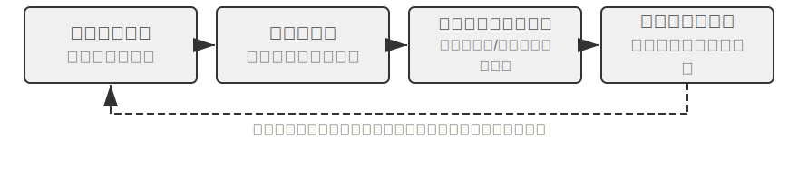
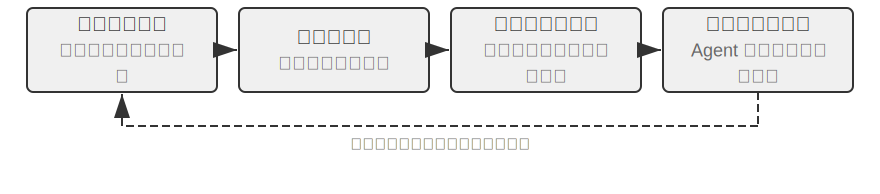
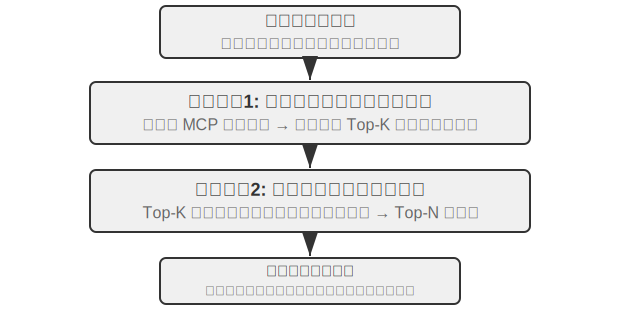
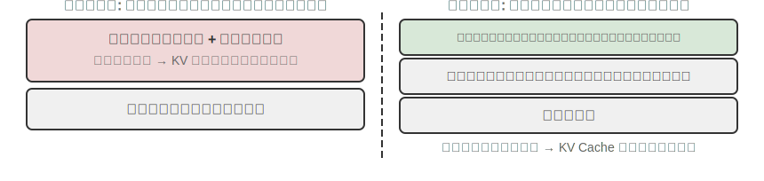
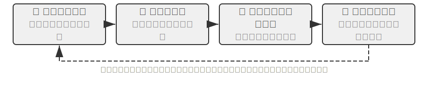

# Agent の自己進化

前の数章では、さまざまな次元から Agent の能力体系を構築してきました。第 2 章のコンテキストエンジニアリングは情報管理の基礎を築き（Skills の仕組みによるオンデマンド読み込みを含む）、第 3 章の知識ベースとユーザーメモリはセッションをまたぐ知識の永続化を実現し、第 5 章は Coding Agent がいかにファイルシステムを通じて経験を蓄積するかを示し、第 7 章の強化学習によるポストトレーニングは方策をモデルパラメータの中に固定化しました。これらの技術はそれぞれ重点が異なりますが、いずれも同じ問いを指し示しています。すなわち、**Agent はいかにして持続的に強くなるのか？** です。

最先端のモデルであっても、特定の企業の返金フロー、ある通信事業者の話術戦略、あるいはマイナーな API の呼び出し方に直面したとき、入社したばかりの新入社員と同じように途方に暮れます。モデルの重みを変えるには大量のデータと計算力が必要で、更新サイクルは往々にして週単位です。ところが現実には、新しい API が公開され、古いサービスが停止され、ユーザーのニーズは絶えず変化します。Agent には、より軽量で、より即時的な進化の仕組み――モデルパラメータを変えることなく、自身の能力の境界を持続的に押し広げられる仕組み――が必要なのです。

本章が論じるのはまさにこの仕組み、すなわち **Agent の自己進化（Self-Evolution）** です。自己進化とは外部化学習のことであり、2 つの次元を含みます――経験から知識を蓄積することと、能動的に新しいツールを発見し創造することです。核心となる考え方は、知識とプロセスをモデルパラメータや一時的なコンテキストから切り離し、永続化・検索・再利用が可能な外部リソース――ツールライブラリと知識ベース――として外部化することです。これはポストトレーニングの代替ではなく、補完です。ポストトレーニングは「いかにモデルをより賢くするか」を解決し、自己進化は「いかに Agent をより有能にするか」を解決します。

## なぜ Agent は自動的には学習しないのか

前段で述べたのは現実的なニーズです。しかし、より根本的な問題がもう一つあります。**もしコンテキストウィンドウが無限に長くでき、Agent が経験してきたすべての対話とツール呼び出しの結果をそこに詰め込めるなら、Agent は自動的にすべてを学び取れるのではないか？** という問いです。

答えは否です。その理由は、第 2 章で論じた注意機構の中に隠れています。これは本章の理論的出発点であり、数章を隔てているので、簡単に振り返る価値があります。

第 2 章では繰り返し強調しました。**コンテキスト学習の内部メカニズムは推論というより検索に近い** のです。注意は「検索」が得意です――「37 番目の檻にいるのはどんな猫か？」には一発で命中します。しかし一度の順伝播の中で「帰納的に統計する」のは苦手です――「100 個の檻に黒猫は合計何匹いるか？」がそれです。後者は全レコードを走査し、カウントの状態を保持する必要があり、本質的に検索ではなく思考です。つまり、生の経験をコンテキストにまとめて積み上げれば、モデルはそれを「覚えて」はいられますが、それを自動的に再利用可能な規則へと「抽出」してはくれないのです。たとえコンテキストが本当に無限大であっても、この隔たりは依然として存在します。情報はそこにあるのに、「具体的な記録」から「一般的なパターン」への圧縮という一歩を、モデルに代わって完了させる者がいないのです。おまけに、第 2 章の「コンテキスト腐敗」が明らかにしたように、コンテキストが長くノイズが多くなるほど、注意はいっそう希釈され、肝心の情報はかえって検索されにくくなります――無限のコンテキストは自動学習をもたらさないどころか、検索品質を持続的に低下させるのです。Karpathy の洞察はまさに逆から読めます。モデルの「記憶力の悪さ」は欠陥ではなく特性であり、それが私たちに、能動的かつ明示的に知識の抽出を行うことを迫るのです。モデルが冗長な履歴から自力で規則を悟ってくれることを当てにするのではなく。一言で言えば、**学習は自動的には起こらず、明示的に設計されなければならない**――これこそが本章の存在理由です。

そして「明示的に設計された学習」は、第 8 章になって初めて登場するわけではありません。前の数章がすでにいくつかの原型を仕込んでいます。ただそれらの多くは、**単一のセッション内** あるいは **直近のセッション** の即時的なニーズに奉仕するものでした。第 2 章の **コンテキスト圧縮** は、追加の LLM 呼び出しを一度使って、肥大化した生の記録を計算済みの結論へと「置き換え」、注意に欠けていた「抽出」の後半分を補います。第 2 章の **Agent ステータスバー** は、コードが段階的に肝心な結論を確定的にコンテキストへ維持し続けるもので、同じコインの裏面です。第 3 章の **ユーザーメモリ** は、すでに「学習」をセッションをまたぐ領域へと押し進めています――Agent は幾度もの対話の中でユーザーについての理解を蓄え、オフラインの整理によってそれをますます正確にしていきます。

第 3 章のユーザーメモリそのものも一種の学習ですが、蓄積されるのは「ユーザーが誰か」という **情報**（好み、事実、習慣）です。第 8 章が補うべきはもう半分、より長期的な半分です。すなわち、探索の中で総括された問題解決の戦略、操作フロー、失敗の教訓、さらには全く新しいツールを、永続化・検索・再利用が可能な **能力** として蓄積し、Agent が単に「より多くを覚える」だけでなく、「ますます有能になる」ようにすることです。この種の学習はより長期的であり、Agent が **能動的** に起こす必要があるため、独立した一章を設けて展開する価値があります――以下では、まずマクロな視点からその位置づけを与えます。

## 3 つの学習パラダイムと自己進化の位置づけ

第 1 章で導入した 3 つのパラダイム（図1-1）は、ここでは位置づけの対照としてのみ用います。**ポストトレーニング** はモデルの重みを変更し、RL を通じて「経験」を「筋肉の記憶」へと固定化します。成功率が高く遅延も低いですが、更新コストが高くサイクルも長いです（第 7 章で詳述済み）。**コンテキスト学習**（In-Context Learning, ICL）はプロンプトの中に示範サンプルを与えて一時的に適応させるもので、コストが低く効果も速いですが、セッションの終了とともに消えてしまいます（第 1・2 章を参照）。**外部化学習** は開発者が最も見落としやすい経路です――知識をモデルの外部のファイル、知識ベース、ツールへと蓄積するもので、永続的で、解釈可能で、いつでも修正できます。三者は競争ではなく協働の関係にあります。事実性の知識は RAG（第 3 章を参照）と外部化ストレージに任せ、安定した振る舞いや書式はポストトレーニングで固定化し、その場限りの一時情報はコンテキスト学習に任せます。

本章が焦点を当てるのは、そのうち **モデルの重みを変えない** 経路――外部化学習です。これはまさに章の冒頭で述べた 2 つの次元に対応します。経験を知識と Skill へ外部化すること、そして能力をツールへ外部化することです。（ここで第 5 章の「コードがコードを創造する：Agent の自己ブートストラップ」と区別しておく必要があります。あちらで論じたのは Agent が自身と同種のシステムを作り出すことであり、本章で論じるのは重みを変えない能力の増大です。第 3 章が解決したのは知識ベースを「どう保存し、どう検索するか」であり、本章が解決するのは「誰がそれを埋め、更新するか」――Agent がいかに能動的に経験を蓄積するかです。）

なぜそれが必要なのでしょうか。まず反面教師的なシーンを見てみましょう。あるカスタマーサポート Agent が、初めてある銀行の返金フローを処理する場合を考えます。15 分間の探索を経て――電話を 3 回かけ、2 種類の話術を試し――ついに返金を成功させました。もし外部化学習の能力を欠いていれば、次に全く同じ依頼に出くわしたとき、また一から 15 分かけて同じ探索を繰り返すしかなく、今回積み上げた経験はセッションの終了とともに消えてしまいます。要は「自律」の二文字にあります。人間のエンジニアが Agent のためにドキュメントを用意するのではなく、Agent がタスクをこなす過程で自ら経験を総括し、ツールを構築し、知識ベースを更新するのです――ちょうどベテランのカスタマーサポート担当者が、散らばった返金規則を、いつでも参照でき、新しい状況に応じて自律的に更新するマニュアルへと整理するように。核心となる哲学はこうです。モデルがすべてを覚えていることを期待するよりも、タスク完了後に追加の計算力を使って経験を総括し、圧縮し、構造化し、永続化・検索が可能な外部システムに保存する方がよい、と。パラメータ学習と比べれば、この方式は高価な訓練を必要とせずに、解釈可能・検証可能・修正可能な知識を素早く蓄積できます。コンテキスト学習と比べれば、能動的な抽出と構造化された組織化を通じて、膨大な生の情報の中を非効率に検索することを避け、セッションをまたぐ永続化を実現します。

さらに重要なのは、外部化学習が Agent の学習能力を「情報を記憶する」ことから「能力を構築する」ことへと引き上げる点です。Agent は経験を概要的な知識として総括し、後続の検索のために知識ベースへ保存できる（第 3 章の RAG の部分で紹介した RAPTOR の木構造による帰納は、経験の段階的な抽出にも同様に適用できます――具体的な操作記録から規則へ帰納し、さらに原則へと概括する）だけでなく、反復的な操作フローを正確に実行できるツールへとカプセル化し、絶えず増大するスキルライブラリを形成することもできます。一例を挙げましょう。あるカスタマーサポート Agent が、ある顧客の返金処理を手伝う中で、性質の異なる 3 種類のことを学ぶかもしれません。第一は特定の規則です――「A 社の返金にはクレジットカードの下 4 桁の照合が必須」。これは事実性の知識で、知識ベースに保存すればよいものです。第二は汎用のツールです――「X API を使って注文状態を自動照会する」。これは安定して再利用可能な操作シーケンスで、コードツールとして蓄積するのが最も割に合います。第三は職務マニュアルです――「返金フロー全体の Skill」。これは戦略的判断や頻繁に変わる業務規則を含むので、Skill ドキュメントとして書く方が適しています。表8-1 は、外部化学習が蓄積するこの 3 種類の産物をまとめたものです。

表8-1 外部化学習の 3 種類の産物

| 産物の形態 | 担う内容 | 例 | 使用方法 |
|-------------|----------------------|--------------------------------|---------------------------|
| 知識ベースの項目 | 事実と規則 | 「当該銀行は開設支店の住所の提供を求める」 | 意味検索または `grep` による精確な検索 |
| 専用コードツール | 反復可能な操作フロー | 「口座残高を照会する API 呼び出しシーケンス」 | コードとして固定化し、引数で呼び出す |
| Skill ドキュメント | 複雑だが頻繁に変わる業務戦略 | 「保険金請求処理のベストプラクティス」 | 自然言語ドキュメント、オンデマンド読み込み |

どの形態を使うべきかを判断するには、シンプルな経験則が一つあります。**純粋に事実性の情報は知識ベースに保存し、頻繁に使い引数が複雑なものはコード（ツール）として書き、頻繁に変わり戦略判断を伴うものはドキュメント（Skill）として書く** のです。このうち後ろの 2 つはいずれも「ツール生成」に属します――外部化学習のより高次の形態であり、「知識」を外部化するだけでなく、「プロセス」をも外部化・コード化し、「毎回考え直す」から「一度生成し、何度も再利用する」へと転じます。ちょうど初めてサーバーを手動でデプロイした後、その手順を自動化スクリプトへ書き起こすようなものです。第 4 章では、専用ツールと Skill の選択の枠組みをすでに詳しく論じました。

第 1 章が苦い教訓に対して示した立場――**方向性には賛同し、進め方は実務的に**――は、外部化学習において最も十全に体現されます。すべての知識をパラメータの中に圧縮するのでもなく、プロセスを if-else の規則として固定的に書き込むのでもなく、Agent に外部の知識とツールのエコシステムを能動的に構築させ、能力拡張のロジックをモデル内部（パラメータ規模）から外部世界（ツールと知識ベースの規模）へと延伸させるのです。知識の担い手の選択も同じロジックに従います。本章で論じる記憶とスキルの多くは、Markdown とファイルシステムの形で蓄積され、人手で設計した知識グラフに依存しません――後者は専門領域ではより精確ですが、自然言語こそモデルが最も得意とする形式であり、そこに LLM による圧縮と整理を重ねることで初めて、人間の先験的な構造に依存せず、モデルの能力とともに持続的に拡張できる汎用の経路となるのです。もちろん、外部化学習そのもの――どんな形式で保存し、どうインデックスを組織し、いつ抽出するか――は依然としてエンジニアリング設計を必要とし、これこそが「進め方は実務的に」の体現です。

## なぜ Agent は経験から学ぶべきなのか：「賢い」から「熟練」へ

先ほどの、散らばった規則をマニュアルへ整理した「ベテランのカスタマーサポート担当者」は、「賢い」から「熟練」への鍵を突いています。差はしばしばモデルが賢くないことにあるのではなく、多くの業務フローや領域知識が動的に変化し、非公開であることにあります。基盤モデルの汎用能力を高めるだけでは、この種の「経験」に依存する問題は解決できません。Agent が経験から学ぶとき、学び取るべきはまさにこの種の知識です――あるサービスの解約には、無駄に電話をかけるのではなく特定のフォームを記入する必要がある、ある優待の適用条件（退役軍人や 2 年以上の長期顧客など）を総括する、ある地域のある通信事業者のブロードバンド見積もりにまだ交渉の余地があるかを判断する、といったことです。同様に、Coding Agent はプロジェクト固有のコード規約やデプロイフローを知らず、ブラウザ Agent はあるウェブサイトのクローリング対策やページレイアウトの変更を知りません――これらはいずれも事前学習データに含まれないリアルタイムの領域知識です。

## 経験から学ぶ

「なぜ学ぶのか」を理解したところで、次の問いは「どう学ぶか」です。外部化学習のエンジニアリング実践は「成功経験を記録し再利用する」ことから始まります。以下の 2 つの実験は、相補的な 2 通りの経験蓄積の方法を示します。一つは高レベルの戦略を検索可能な知識の要約へと抽出するもの（「問題解決の思考メモ」に相当）、もう一つは具体的な操作シーケンスを再生可能な自動化ツールへと固定化するもの（「操作の録画」に相当）です。

表8-2 は経験学習の仕組みを層ごとに分類したもので、読者が知識抽出、知識組織化、知識応用、そしてエンジニアリング的支援の間の関係を理解する助けとします。

表8-2 Agent の経験学習の仕組みの層構造

| 層 | 仕組み | 何を解決するか |
|------|------|-------------|
| 知識抽出 | 戦略要約、ワークフロー録画、失敗のリフレクション | 成功と失敗の経験から再利用可能な知識を抽出する |
| 知識組織化 | Skills、睡眠統合 | 知識を構造化して保存しインデックスを組む |
| 知識応用 | システムプロンプト最適化 | 知識を Agent の行動パターンへ注入する |
| エンジニアリング的支援 | セッションをまたぐ継続実行 | 長時間タスクを持続的に実行できるようにする |

以上の 4 つの層は以降の内容の中で織り交ぜながら展開します――戦略要約、ワークフロー録画、そして失敗から学ぶこと（知識抽出）から、Skills と睡眠統合（知識組織化）へと自然に移り、続いてシステムプロンプト最適化（知識応用）、最後に長時間タスクのセッションをまたぐ継続実行（エンジニアリング的支援）で締めくくります。

> **実験 8-1 ★★：成功経験から学ぶ：戦略要約**
>
> `gaia-experience` プロジェクトは「戦略要約」（Strategy Summary）という考え方の典型的な実装です。いわゆる戦略要約とは、一度の成功した問題解決の過程を、構造化された経験メモへと凝縮すること――「どんな方法を使い、どんな落とし穴にはまり、肝心のステップは何だったか」を記録し、次に似た問題に出くわしたとき直接参照できるようにするものです。
>
> すべての実行トレースが経験へと抽出する価値をもつわけではありません――判断基準は **転用可能性** です。現在のタスクで学んだ教訓は、将来の類似タスクで再利用できるか？ ある特定の入力にのみ有効な修正は、長期記憶に入れるべきではありません。
>
> この実験は 2 つの重要なインフラを使います。**AWorld フレームワーク** は AI Agent 専用に設計されたオープンソースの実行・評価環境で、標準化されたツールセット（ブラウザ、ファイルシステム、コードインタプリタなど）と自動評価パイプラインを提供します。Agent の「試験教室」と理解できます。**GAIA** は極めて挑戦的なベンチマークで、人間の知恵を要する多段階の複雑な問題を通じて汎用 AI Agent の能力を評価します――たとえば「あるウェブサイトで特定の情報を見つけ、コードで処理して答えを計算する」といったもので、往々にしてブラウザ、ファイルマネージャ、コードインタプリタを総合的に使い、複雑な論理推論を行う必要があります。
>
> 核心となる革新は、AWorld フレームワークの Agent に完全な「学習・応用」の閉ループを付け加えた点にあります。**学習モード（Learning Mode）** では、Agent が GAIA タスクを成功裏に完了するたびに、システムがその完全な行動トレースを自動的に捕捉し、LLM を使ってそれを「リフレクション」し「総括」して、構造化された経験の要約を生成します。この要約には最終的な答えだけでなく、問題を解決した核心的な方法、肝心の洞察、そして有効に使われたツールのシーケンスが抽出されています。これらの経験はベクトル化されて知識ベースへ保存されます。**応用モード（Apply Experience Mode）** では、Agent が新しいタスクを受け取ると、まず経験の知識ベースの中で意味検索を行い、過去で最も類似した成功事例を見つけ出し、それらの経験を「成功の範例」としてシステムプロンプトへ注入し、意思決定の指針とします。実験は、これが新しい問題を解決する効率と成功率を著しく高めることを実証しました――Agent が解決するタスクが多いほど、蓄積される経験は豊かになり、能力もそれだけ強くなり、正のフィードバックで回る自己進化システムが形成されるのです。
>
> **実験 8-2 ★★：反復タスクから学ぶ：ワークフローの録画と再生**
>
> `browser-use-rpa` プロジェクトは「ワークフロー録画」（Workflow Recording）という考え方の絶好の実例です。ワークフロー録画の発想は Excel の「マクロ記録」機能に似ています。初回の手動操作時に手順を記録しておき、以後は「再生」を一度クリックするだけで自動的に繰り返せるようにするのです。このプロジェクトが解決しようとする問題は非常に実際的です。ブラウザ上で行う反復的な操作（レポートメールの送信、特定サイトの情報照会など）の多くは、毎回の具体的な引数は異なる（宛先、照会キーワードなど）ものの、核心となる操作フローは固定されています。Agent に毎回一から、高価なマルチモーダル大規模モデルを使ってこのフローを「再発見」させるのは、多大なリソースの浪費です――本質的にはコンテキスト学習だけに頼り、成功経験を再利用可能なツールへ外部化していないのです。プロジェクトの核心は、効率とコストに関する極限的な対比実験です。
>
> **学習フェーズ（Learning Phase）** では、Agent が初めてタスクを実行するとき、人間と同じようにマルチモーダル LLM の観察・思考・行動ループを通じて操作を完了します。LLM が操作の実行を決めるたびに、システムは browser-use フレームワークの履歴から、操作された要素の精確な位置特定情報を抽出します。ウェブページはブラウザ内で 1 本の DOM ツリー（Document Object Model、文書オブジェクトモデル）として表現され、各ボタン、入力欄、リンクはツリー上の 1 つのノードです。XPath（XML Path Language）は、ファイルパスに似た書き方 `/html/body/div[2]/button[1]` で特定のノードを指し示します。操作は構造化されたステップとして録画されます。操作の種類（クリック、入力など）、対象要素の XPath、操作の引数、そして実行後の検証情報（ページの URL が変化したか、期待された要素が現れたかなど）です。タスクの成功後、LLM が意味ラベル（「メールを送信する」など）と説明（「宛先フィールド、件名フィールド、内容フィールド、送信ボタン」）を生成し、ステップのシーケンスとともに知識ベースへ保存し、引数化された「ワークフロー」の項目を形成します。
>
> **再生フェーズ（Replay Phase）** では、新しいタスクが到着すると、システムは意味的類似度（埋め込みベクトル）と要点チェックを組み合わせて、既存のワークフローとマッチングします。マッチが成功すればステップに沿って高速に実行します。Playwright（オープンソースのブラウザ自動化ライブラリ）の待機機構（`page.locator(xpath).wait_for(state='visible', timeout=15000)`）で要素の読み込みを確実にし、引数化テンプレート（「宛先フィールドに `{{email}}` を入力する」など）は軽量な LLM 呼び出しで現在のタスク指示から実際の引数値を抽出するため、完全な視覚的思考は不要です。あるステップが失敗した（要素が見つからない、待機がタイムアウトした）場合は、ウェブページの構造が変わった可能性を示すので、そのワークフローを「陳腐化した可能性あり」と印を付け、学習モードへ戻って LLM の思考で再びタスクを完了し、新しいワークフローを生成して古いものを置き換えます。
>
> **受け入れシナリオ**：Gmail のウェブ版でメールを送信する。
>
> - 初回実行（学習フェーズ）：「test@example.com にメールを送信、件名『テストメール』、内容『これはテストメールです』」。Agent がマルチモーダル LLM を通じて「作成」ボタン、宛先入力欄、件名と内容の入力欄、「送信」ボタンをどう認識するかを観察する。操作ステップ、所要時間、LLM 呼び出し回数を記録する。
> - 反復実行（再生フェーズ）：「another@example.com にメールを送信、件名『後続テスト』、内容『2 通目のテストメール』」。システムがマッチするワークフローを認識し、新しい引数値を抽出し、LLM の視覚的思考を要さずに直接操作を再生する。所要時間と呼び出し回数の対比は著しく低下するはずである。
> - 知識更新：ウェブページのリニューアルを模擬し（HTML 構造を変更してあるボタンの XPath を変える）、Agent がワークフローの失効を検知して学習モードへ戻り、ワークフローを再生成して知識ベースを更新できることを検証する。
>
> 観察が期待されるのは、再生フェーズでタスク実行速度が著しく向上し（数倍の桁）、LLM 呼び出しコストが大幅に低下し、成功率もより安定することです。

ワークフロー録画は孤立したエンジニアリング上の技巧ではなく、その背後にはより汎用的な方法論があります。Voyager は NVIDIA チームが提案したオープンワールドの Agent アーキテクチャ（後述）で、Minecraft の仮想世界において「探索・蓄積」のループを体系化しました。**タスクを実行 → 成功を検証 → 成功した操作シーケンスをスキルライブラリへ保存 → 類似タスクに出くわしたら検索して再利用** という流れです。実験 8-2 はまさにこの発想をブラウザ自動化の場面に落とし込んだものです――学習フェーズが「探索」に対応し、ワークフロー知識ベースが「スキルライブラリ」に対応し、再生と失効時のフォールバックが「検索して再利用」と持続的改善に対応します。

実験 8-2 はまた、「録画・再生」で最も脆い 2 つの箇所も露呈させました。それらをきれいに処理して初めて、この仕組みは本当に信頼できるものになります[^preact]。第一の箇所は **いつ再生を信じてよいか** です。より堅実なやり方は、一度成功した操作シーケンスを小さな **状態機械プログラム** へコンパイルすることです。各状態には「検証述語」（現在の実際の画面上で成立していなければならない UI パターン）を持たせ、再生時には **各ステップの動作の前にまず述語で実時の画面を照合します**――「まず見極め、それから動く」のです。ひとたび述語が成立しないか動作がエラーを出せば、完全な Agent へ差し戻して一からやり直させ、今回の新しいトレースを改めてプログラムへコンパイルします。再生時にモデル呼び出しが一度も要らないからこそ、キャッシュにヒットした反復タスクは 8.5〜13 倍速くなります。第二の箇所は **不良なプログラムを保存しないこと** です。コンパイル完了後すぐに環境をリセットし、一から再生し直して、ベンチマーク付属の判定器で「今回は本当にやり遂げた」と確認できて初めて登録を許すのです――この「保存前検証」は、「再生の 100% をカバーしたのに、実は用が済んでいない」たぐいのプログラム（たとえばフローを全部たどり、Save もクリックしたのに、あるフィールドが実は空だった、など）を弾き止められます。この関門を外すと、プログラムライブラリは不具合のあるプログラムがたまっていくにつれて次第に劣化します。きれいな一つの原則にまとめれば、**プロセス記憶にも検証ゲートを設けてこそ、自己改善のループは腐らない**――これはまさに実験 8-2 における「ワークフローの失効を検知し、戻って学び直す」の厳格版です。

[^preact]: 成功トレースを検証述語付きの状態機械プログラムへコンパイルし、「保存前検証」ゲートを設ける仕組み、その完全なメカニズムは Li, Bojie. *PreAct: Computer-Using Agents that Get Faster on Repeated Tasks.* arXiv:2606.17929, 2026 を参照。

### 失敗から学ぶ

戦略要約もワークフロー録画も、いずれも **成功トレース** から経験を抽出するものです――実験 8-1 はタスクが成功したときにのみリフレクションと総括を起動します。しかし失敗経験も同様に蓄積する価値があり、むしろ情報量はより多いのです。一度の失敗は一つの経路を明確に排除しますが、成功は往々にして多数の実行可能な経路のうちの一つにすぎません。失敗経験の典型的な蓄積形態には 2 種類あります。**エラーパターンライブラリ**（「どんな状況でどんな方法を使うと失敗するか、失敗のシグナルは何か」を記録する）と **負の規則**（「Y をするのに二度と X の方法を使うな」――たとえば「その通信事業者の解約を電話で行うな、電話窓口には処理権限がない」）です。

この方向の代表的な仕事は Reflexion（Shinn et al., 2023）[^reflexion-2023] です。タスクの失敗後、Agent は失敗の原因を自然言語でリフレクションし（「3 番目のステップでフォームをそのまま送信するのではなく、先に本人確認をすべきだった」など）、そのリフレクションのテキストをエピソード記憶（episodic memory）へ保存します。次に同種のタスクを試みるときは、これらのリフレクションを追加のコンテキストとして読み込み、同じ轍を踏むのを避けます。この全過程でモデルパラメータは一切更新されません――Reflexion はまさに「重みを変えない進化」の古典的な範例です。この言語によって担われるリフレクションは、一つのスカラー報酬よりもはるかに情報量が豊かで、後段でシステムプロンプト学習を論じる際にこの点を展開します。失敗経験のもう一つの重要な出口はシステムプロンプトです。本章で後述するシステムプロンプトの自動最適化は、まさに失敗事例から抽出した負の規則（「政策上の争いを理由に決して有人対応へ転送しない」など）をシステムプロンプトへ書き込み、それを以降のすべてのタスクに効力をもつ行動制約とするものです。

[^reflexion-2023]: Shinn, N., et al. *Reflexion: Language Agents with Verbal Reinforcement Learning.* arXiv:2303.11366, 2023.

### Skills：領域知識を構造化された能力へ外部化する

前述の 2 つの仕組みは、それぞれ「どう考えるか」と「どうやるか」の経験を蓄積しました。Skills の仕組みは第三の道を行きます――領域の操作知識を体系的に、構造化された、オンデマンドで読み込める能力モジュールへと抽出するのです。Skill は「職務操作マニュアル」と理解できます。新入社員は入社時に一から手探りする必要はなく、マニュアルを読み終えればすぐに仕事に取りかかれます。第 2 章では Skills の漸進的開示（Progressive Disclosure）の仕組み（メタデータ→核心フロー→細則）と KV Cache との互換性の設計を詳しく論じました。本節が注目するのは、Skills の背後にある知識外部化の哲学とその自動生成です。

Skills の核心的な価値は、人間が読めるテキストで知識を担う点にあります。更新が速く（モデルを再訓練する必要がない）、審査可能（人間の専門家が直接修正・改善できる）、転用可能（モデルやシステムを変えても使える）です。本質的に、Skills は非構造化ドキュメントの中に閉じ込められた領域知識を、Agent が利用しやすい構造化された形式へ変換するものです――知識をコードのロジックの中へハードコードするのではなく、Agent が汎用の検索と思考の能力を通じて知識を利用できるようにするのです。

さらに一歩進んで、Anthropic の Skill Creator[^ch8-1] は他の Skills を創造できるメタ能力であり、Agent を導いて、観察・学習・総括を通じて領域の操作知識を構造化された Skill へと抽出します。ある領域向けの Skill の作成を求められると、Agent はまずユーザーとの対話を通じて具体的な利用シーンを理解し、次に各シーンを分析して再利用可能なリソースを識別し、最後に標準のディレクトリ構造、scripts、references、assets、そして `SKILL.md` の主ドキュメントを含む完全な Skill パッケージを作成します。Skill Creator は知識変換の過程そのものをも Agent に担わせ、知識蓄積の自己ブートストラップのループを実現します。Agent は Skill を使えるだけでなく、Skill を作ることもできるのです。

[^ch8-1]: Anthropic, “Skill Creator” , 2025. https://github.com/anthropics/skills/blob/main/skill-creator/SKILL.md

Claude Code の `CLAUDE.md` の仕組みは、類似の能力を示しています。コードリポジトリに初めて触れたとき、能動的にコードベースを通読し、アーキテクチャ設計、コーディング規約、テスト方法などの核心情報を含むプロジェクトガイドを生成し、以降の開発で継続的に参照・更新します。この自動化された Skill 生成の仕組みは、Agent の能力拡張を人間の専門家の使える時間や知識のカバー範囲に縛られないものにします――Agent が新しい領域に入ったとき、自律的な探索学習を通じて操作ガイドを構築し、それを Skill として固定化でき、「あらかじめプログラムされた知識に依存する」から「実践の中で学び知識を蓄積する」への転換を実現します。

「経験の蓄積」という視点から見ると、ツール生成というこの経路の具体的な形態は、さらに専用コードツールと Skill + 汎用実行器の 2 種類に分けられます。両者の間でどう選ぶかについては、前段ですでに判別の原則を示し、第 4 章に完全な枠組みがあるので、ここでは繰り返しません。本節の場面に落とすと、引数が複雑で呼び出しが頻繁な操作はコードツールとして蓄積し（Voyager が Minecraft で蓄積したスキルライブラリ、ブラウザのワークフロー録画で生成された引数化スクリプトなど）、戦略的で変わりやすい業務規則は Skill ドキュメントとして書きます（Claude Code の `CLAUDE.md` など）。実際のシステムは往々にして両方の形態を混合して使います。

### 睡眠学習：ユーザーメモリの自律的な進化

前述の経験学習の仕組み――戦略要約、ワークフロー録画、Skills 生成――はいずれもタスク実行の過程で、あるいは終了後の即時的な抽出で起こります。しかし人間の学習にはもう一つ重要な段階があります。**睡眠中の記憶の統合** です。第 2 章でコンテキスト圧縮を論じた際、この類比を使いました――脳は日中の感覚入力をコンパクトな長期記憶へと加工する、と。この類比は単一のセッション内のコンテキスト圧縮に適用できるだけでなく、セッションをまたぐ経験管理へも延伸できます。日中に得た断片的な経験が睡眠中に再組織化され、冗長性が除かれ、既存の知識ネットワークと融合し、よりコンパクトで、より取り出しやすい長期記憶へと変わるのです。

このオフライン統合の最も典型的な対象は、Agent の **ユーザー本人** に関する記憶です――あなたが誰か、どんな好みがあるか、どんな事実を口にしたか。ここでまず、よくある誤解を一つ整理しておく必要があります。Claude Code のような Agent が「睡眠」の中で整理するのは、主に **ユーザーメモリ** であって共有の知識ベースではありません。知識ベース（第 3 章の RAG）が担うのは特定のユーザーとは無関係の領域ドキュメントで、通常はオフラインのパイプラインで一括投入され、変動はほとんどありません。一方でユーザーメモリは、Agent が幾度もの対話の中で断片的に蓄え、ますますあなたを理解していくモデルです――これこそ、繰り返し「睡眠統合」を必要とする部分なのです。本節でこの後紹介する Claude Code と Hermes が保存するのは、いずれもこの種のユーザーメモリであり、重点はそれらが **いかに自律的に進化するか** にあります。

本節と第 3 章の分担をさらに明確にしておきます。第 3 章ではユーザーメモリの「どう保存し、どう検索するか」を論じ、記憶ストレージ層の整理 **アルゴリズム**（クラスタリング要約、衝突のバージョン管理など）も紹介したので、ここでは繰り返しません。本節が注目するのは **エンジニアリングと進化の問題** です――いつ整理し、誰が整理し、どんな形で蓄積すれば、記憶が使うほど正確になるのか、です。

**Claude Code：Markdown でユーザーメモリを保存する。** Claude Code はユーザーメモリを、人間が読める Markdown ファイルとして直接保存します。各記憶はメタデータ（frontmatter）を持つ小さなファイルで、一つの事実だけを記録し、さらに一つのインデックスファイル（`MEMORY.md`）が全体を集約してナビゲーションします。この形式の利点は一目瞭然です――更新が速く（ファイルを直すだけでよく、モデルの再訓練が要らない）、審査可能（ユーザーが直接開いて修正できる）、転用可能（モデルやシステムを変えても使える）です。

しかし「記録」の他に「整理」も必要です。Claude Code は睡眠統合という認知的な比喩を、バックグラウンドで周期的に走る記憶統合の仕組みとしてエンジニアリング化しました。（以下の記述は公開版の挙動とコミュニティの分析にもとづいて整理したもので、公式の正式な定義ではありません。）核心となる設計思想はこうです。**経験の蓄積と記憶の統合は 2 つの独立したプロセスであり、同一の時間窓の中で完了させるべきではない**――Agent にも専用の「復習の時間」が必要なのです。具体的には、2 つのゲート条件（前回の統合から一定の時間間隔を超えていること、かつその間に十分な数の新しいセッションが蓄積されていること）を満たしたとき、システムはバックグラウンドで独立したサブ Agent を起動し、4 段階の統合を実行します。**方向づけ**（Orient、既存の記憶インデックスを読み、知識の全体像を把握する）、**新しいシグナルの採集**（Gather、近時のセッションから永続化に値する新しい情報を探し、既存の記憶と矛盾する事実を検知する）、**統合**（Consolidate、新しいシグナルを既存のトピックファイルへ合流させ、近似的に重複する項目を新設せず、相対日付を絶対日付へ変換し、反証された古い事実を削除する）、**剪定とインデックス化**（Prune & Index、インデックスのサイズを制御し、陳腐化したポインタを除去する）です。

この仕組みの最も重要な設計上の決定はこうです。記憶の統合はユーザーとのやり取りの最中には実行されず、非同期のバックグラウンドで完了し、ユーザーは全く気づきません。二重のゲートと分散ロックによって、並行するインスタンスが統合を重複して起動しないことを保証し、失敗時には自動的にフォールバックして次回に再試行します。統合サブ Agent の権限も記憶ディレクトリ内に厳格に限定され、越境しません。よりマクロな視点から見れば、これはユーザーメモリ管理が「記録はあるが整理はない」から「記録―統合―剪定」という完全なライフサイクルへと進化したことを表しています――定期的な統合がなければ、記憶庫は S/N 比の低い情報の堆積へと退化し、かえって検索品質の足を引っ張ります。定期的な「睡眠統合」は記憶庫をコンパクトで一貫し、ナビゲートしやすい状態に保ちます。ちょうど人間の専門家の知識が、事実の無限の積み上げではなく、繰り返し整理された構造化された理解であるように。

**Hermes：自律学習を常駐サービスとして作り込む。** Nous Research が 2026 年にオープンソース化した Hermes は、この発想をさらに徹底させました。それはユーザー自身のマシン上に常駐するプロセス（daemon）で、セッションをまたいで記憶を持続的に蓄積し、自律的に進化します。その記憶は 4 層に分かれています[^hermes]。**プロンプト記憶**（`MEMORY.md` と `USER.md`、セッション起動時に注入され、Agent が能動的に取捨選択するよう「迫る」ために意図的に数千文字以内に制限される）、**セッション検索**（SQLite の全文インデックス FTS5 で過去のセッションを保存し、検索された断片はまず LLM で要約してから注入し、現在のタスクに関連する部分だけを持ち込む）、**スキルライブラリ**（手続き的記憶で、漸進的開示を採用し、デフォルトではスキル名と要約だけを読み込む）、そしてオプションの **Honcho ユーザーモデリング層**（バックグラウンドで受動的に好み、コミュニケーションスタイル、領域知識を追跡し、セッションをまたいで「ユーザーと Agent がいかに共に進化するか」を描き出す）です。一度のタスクが特定の条件（ツール呼び出しが 5 回を超える、エラーから復帰した、ユーザーの訂正を受け取った、あるいは自明でないワークフローを走り通した、など）を満たすと、Hermes は自動的にその中の経験を再利用可能なスキルへと固定化し、丸ごと書き換えるのではなく、優先的にパッチ（patch）の形で差分的に更新します。Claude Code と Hermes は、現在のユーザーメモリの自律的進化の主流の形態を代表しています――いずれも人間が読める Markdown/テキストを担い手としています。

[^hermes]: Nous Research, *Hermes: A Self-Improving Personal Agent*, 2026. https://hermes-agent.nousresearch.com/docs/

### システムプロンプトの自動最適化

システムプロンプトという本筋に戻りましょう。前の数節の仕組みは、いずれも経験と記憶をモデルの外部――知識ベース、ワークフロー、Skill ファイル、ユーザーメモリ――へ蓄積するものでした。しかしもう一つ、より直接的な経験の担い手があります――システムプロンプトそのものです。

Andrej Karpathy は、現在の LLM の学習パラダイムの中で見落とされている重要な学習方式が一つあると考えています――「システムプロンプト学習」（System Prompt Learning）です。事前学習は知識を獲得するためのもの、ファインチューニングは習慣的な行動を養うためのもので、この 2 つの方式はいずれもモデルパラメータの変化を伴います。しかし人間の多くの学習過程は、むしろ「システムプロンプト」の更新に近いのです――問題に出くわして何かを腑に落とすと、明確な言葉でそれを自分のために書き留めます。たとえば「次にこの類の問題に出くわしたら、まずこの方法を試すべきだ」というように。

Karpathy は、LLM は映画『メメント』の主人公のようだと指摘します――毎回目覚めるたびに以前に起きたことを覚えておらず、しかも私たちはまだそれらに記録帳を与えていない、と。彼は Claude のシステムプロンプト（約 1.7 万語、具体的にはバージョンによって変わる）を読んだ後、その中に大量の汎用的な問題解決戦略が含まれていることを発見しました。たとえば「Claude に単語、文字、キャラクターを数えるよう求めると、Claude は回答の前に一歩ずつ考え、各文字に数字を割り当てることで明示的にカウントする」というものです。これは「strawberry の中に r はいくつあるか」といった問題を解決するためのものです。

Karpathy は、この類の知識は人間が手作業で書くべきではなく、システムプロンプト学習から来るべきだと考えています。それは強化学習と相通じるところがあります――どちらも失敗事例に頼って将来の行動を改善します。しかし両者の学習アルゴリズムは異なります。システムプロンプト学習はシステムプロンプトのテキストを直接修正し、強化学習は勾配降下を通じてモデルパラメータを調整します。前者のデータ効率は著しく高く、その理由はフィードバック経路の「次元」の違いにあります。これは Karpathy が **結果報酬型の強化学習** に対して向けた批判です。一度にスカラー一つだけの結果報酬（「正/誤」など）は、情報の帯域幅が、自然言語で一段丸ごと記述された振り返り（「ここでは先に身分証を確認してから返金フローへ進むべきだった」）よりもはるかに低いのです。まさにこのため、同じ一度の失敗でも、システムプロンプト学習が吸収できる情報は「正/誤」の 1 ビットよりはるかに多いのです。

筆者は、システムプロンプト学習の本質は境界事例（edge cases）を通じて規則の境界をより明確にすることにあると考えます。大半の規則は典型的な場面ではうまく機能し、本当の難しさはグレーゾーンにあります――「ユーザーの依頼が能力の範囲を超えたら有人対応へ転送する」は明確に聞こえますが、「ユーザーが政策に不満」は範囲を超えるのに当たるのでしょうか。ユーザーが例外的な処理を求めたら? これらの境界事例こそが規則の本当の意味を定義するのです。

強化学習が膨大なデータ上で繰り返し試行錯誤して初めて重みを調整できるのと比べ、システムプロンプト学習は単一あるいは少数の境界事例から素早く学習できます。一つの失敗事例に出くわしたら、ただちにシステムプロンプトに明確な規則を追加でき、数千の類似サンプルを集めてファインチューニングする必要はありません。この学習はデータ効率が高いだけでなく、完全に解釈可能です――各規則は明文で書き出されており、審査・修正・削除ができます。境界事例が絶えず蓄積されるにつれ、システムプロンプトは次第に詳細な「問題処理マニュアル」へと進化します。ちょうど専門家が仕事の中で絶えず自分のメモを完成させていくように。

どう自動で実現するのでしょうか。鍵は Coding Agent を導入することにあります。システムプロンプトとツールの記述はそれ自体がドキュメントとコードであり、複数のファイルに分散しています。境界事例を発見したとき、Coding Agent は次のことができます。(1) 既存のシステムプロンプトを読んで理解し、規則の構造と失敗のコンテキストを分析する。(2) 精確なコードレベルの diff を生成し、どのファイルのどの位置に何の修正をするかを指し示す。(3) 一貫性を保ち、新しい規則が矛盾や冗長を持ち込まないことを確実にする。最終的な審査権は依然として人間の専門家の手にあり、彼らがこれらの diff を審査して妥当かどうかを判断します。

プロンプトの自動最適化は Karpathy の構想だけではなく、学術界にはすでに体系立った研究があります。DSPy[^dspy-2023] はプロンプトをプログラムの最適化可能なパラメータとして扱います。開発者は各モジュールが「何を入力し、何を出力するか」を宣言するだけで、フレームワークが評価集の上で自動的に例の組み合わせと指示の言い回しを探索し、プロンプトエンジニアリングを手作業のデバッグから体系的な最適化へと変えます。OPRO[^opro-2023] は LLM 自身に最適化器を務めさせます。過去のプロンプトとそのスコアをコンテキストとして与え、モデルに反復的により良い書き換えを提案させ、数学推論などのタスクで人手設計のプロンプトを上回りました。2025 年に提案された GEPA[^gepa-2025] はさらに先を行きます。失敗トレースに対して自然言語のリフレクションを行い、それにもとづいてプロンプトを進化させ、複数の候補の間でパレートフロンティア（すなわち各々に長所があり互いに全面的には凌駕できない候補解の一群であって、単一の「最適」解だけを残すのではないもの）を維持して相補的な最適化の方向を保ちます――複数のタスクで GRPO ファインチューニング（第 7 章で紹介したアルゴリズム）を上回り、しかも用いたサンプリング回数は 1〜2 桁少ないのです。GEPA がやっているのはまさに本節でいう「システムプロンプト学習」であり、その実証結果は前段のフィードバック情報量に関する判断をも裏づけています。

[^dspy-2023]: Khattab, O., et al. *DSPy: Compiling Declarative Language Model Calls into Self-Improving Pipelines.* arXiv:2310.03714, 2023.

[^opro-2023]: Yang, C., et al. *Large Language Models as Optimizers.* arXiv:2309.03409, 2023.

[^gepa-2025]: Agrawal, L. A., et al. *GEPA: Reflective Prompt Evolution Can Outperform Reinforcement Learning.* arXiv:2507.19457, 2025.

これらの自動化フレームワークと、上述の「Coding Agent が diff を生成 + 人手審査」の方式との違いは 3 点に表れます。その一はオフラインとオンラインです。自動化フレームワークは通常オフラインの評価集の上で一括最適化するのに対し、diff 方式は本番環境の境界事例に応じて一件ずつ進化します。その二は人手の関門の有無です。自動化フレームワークはエンドツーエンドで自動的に書き換えるので効率は高いですが、評価集に過学習した「奇妙な」言い回しを産み出す可能性があります。diff 方式は人間の審査を残し、各規則が解釈可能・追責可能で、カスタマーサポートなど高リスクの場面により適しています。その三は評価集を必要とするかどうかです。DSPy、OPRO、GEPA はいずれもスコア付きのタスク集に頼って探索を駆動しますが、diff 方式は単一の失敗事例と一段の人間のフィードバックだけで済みます。実践では両者は相補的に使えます。自動化フレームワークで初期プロンプトの一括最適化を行い、その後 diff 方式でリリース後の持続的な進化を行うのです。

> **実験 8-3 ★★：システムプロンプトの自動最適化**
>
> **実験の目標**：人間のフィードバックにもとづく自動化されたシステムプロンプト学習の仕組みを実装する。
>
> **技術方針**：tau-bench の航空カスタマーサポートの場面にもとづいてシステムプロンプト学習のフローを設計する。初期 Agent の有人転送の規則は「あなたの行動範囲内で処理できない依頼のときにのみ転送する」である。評価を通じて、Agent が過剰に転送していること――政策上の争いに出くわすとすぐ有人へ渡し、ユーザーに政策を説明しようと試みないこと――が判明する。人間の専門家のフィードバックは、争いは辛抱強く政策を説明することで処理すべきで、一律に転送してしまうべきではない、と指摘する。Coding Agent がシステムプロンプトのファイルを読み、関連する規則を特定し、精確な修正を生成する。転送の境界を「ユーザーが明確に有人カスタマーサポートを要求 + 緊急の安全状況」と明確化し、「政策上の争いを理由に決して転送しない」という負の規則を追加し、コードレベルの修正を実施する。
>
> **対照群**：人手で調整したシステムプロンプト（自動最適化フローを経ないもの）。
>
> **期待される観察/受け入れ基準**：最適化後のシステムプロンプトが、元の保留タスク集での性能を後退させない（新しい規則の追加によって既存の正しい行動を壊さない）こと、同時に過剰転送を引き起こす境界事例集での正答率が向上する――すなわち政策上の争いに対して一律に転送するのではなく、まず政策の説明を試みること。

### 長時間タスクのセッションをまたぐ継続実行（エンジニアリング的支援の補論）

厳密に言えば、本節が論じるのは経験抽出の仕組みではなく、自己進化の **エンジニアリング的支援**（表8-2 の「エンジニアリング的支援」層に対応）です。「外部化」の理念を **タスク状態の管理** に適用し、「学んだ」経験と「途中まで進めた作業」の両方をセッションをまたいで存続させるのです。それは第 5 章の Coding Agent ワークフローと一脈相通じており、本章に置いたのは同じ核心的な手法――状態をモデルの外部へ書き出すこと――に依存するからです。多くのタスク（一つの完全なアプリをゼロから作り上げるなど）の規模は、単一のセッションのコンテキストウィンドウをはるかに超えます。たとえコンテキスト圧縮を有効にしても、2 種類の問題は防げません。単一のセッションの中でアプリ全体を作り切ろうとするとコンテキストが先に尽き、一部だけ作り終えると次のラウンドで進捗を正確に復元できず早々に完了と判断してしまうのです。

より安定したやり方は、長時間タスクを **Initializer Agent** と **Coding Agent** の 2 つの役割の協働へと分割することです――プロジェクトマネージャがまずタスクを分割してリストを書き上げ、それからエンジニアがリストに沿って一項目ずつ完成させるのに似ています。Initializer Agent は最初のラウンドで一度だけ走り、構造化された機能リスト（`feature-list.json` など）、初期化スクリプト、最初の git commit、そして進捗ファイル（`progress.json` など）を生成し、タスクを永続化可能なファイルシステムの状態へと変えます。以降のセッションは Coding Agent が循環的に実行します。毎回、進捗ファイルと git log から現場を復元し、現在実装すべき機能を特定し、実装してテストを走らせ、進捗ファイルの `passes` フィールドを更新し、コードをコミットして終了します。肝心の制約はこうです。進捗はコンテキストではなくファイルの中に置く。機能リストは Markdown ではなく JSON を使う（構造化された形式の方がモデルが安定して読み書きしやすい）。すべての機能が `passes: true` になって初めてタスクは完了とみなす。こうすれば途中でクラッシュしても、ファイルシステム内の状態から直接続けられます――タスクがひとたび 30 分を超えれば、クラッシュからの復旧は任意ではなく必須の要件になります。

## ツールの使用者からツールの創造者へ

第4章「能動的なツール発見」の節では、「既存のツールの中から適切なものを見つける」問題を解決しました。本章では続いて、さらに一歩進んだ能力を論じます。必要なツールがそもそも存在しないとき、Agent はいかにして自律的に新しいツールを発見し、創造するのか、です。

### 事前定義されたツールセットの根本的な限界

現在の AI Agent システムの多くは、ある暗黙の前提の上に築かれています。すなわち、大多数のタスクに対応できる十分に完備したツールセットをあらかじめ定義できる、という前提です。閉じた領域ではこれは成り立つかもしれません――カスタマーサポート専門の Agent なら十数個のツールで足りるでしょう。しかし本当の汎用型 Agent を構築しようとするなら、この前提はあまりに楽観的です。

根本的な困難はこうです。現実世界が必要とするツールの数はほぼ無限で、あらかじめ列挙できません。たとえツールライブラリに似たものがあっても、インターフェースやパラメータが現在のニーズと完全には一致せず、使うと非効率だったりエラーになったりします。ましてや、多くの有用なサービスはそもそも Agent フレンドリーな標準インターフェースとして存在しておらず、一つ適合させるだけで一度の人手による開発が必要になります。突き詰めれば、**事前定義のパラダイムは、Agent の能力の境界を人間のエンジニアの予見と準備の範囲に閉じ込めてしまう** のです。

### 事前定義から自己進化へ

この限界を突破するには根本的な転換が必要です。すなわち、**Agent をツールの使用者からツールの創造者へと引き上げる** ことです。Agent はもはや人間がツールを準備してくれるのを受動的に待つのではなく、タスクの必要に応じて、開かれた世界から能動的にツールを探し、学び、適合させ、創造します――これこそ本章冒頭で述べた自己進化の第二の次元、すなわちツールの使用者からツールの創造者へ、です。

中核となる考え方はこうです。Agent に最小限の基礎能力を出発点として与え、環境との相互作用と外部リソースの活用を通じて、能力の境界を自律的に拡張させる。まさに Alita 論文 [^alita-2025] が提唱するとおり――「最小限の事前定義、最大限の自己進化」。少数の入念に設計された基礎ツールが世界と相互作用する基本能力を提供し、その上に自己進化の仕組みが無限の拡張ポテンシャルを与えます。

[^alita-2025]: Qiu, J., et al. *Alita: Generalist Agent Enabling Scalable Agentic Reasoning with Minimal Predefinition and Maximal Self-Evolution.* arXiv:2505.20286, 2025.

自己進化は事前定義されたツールの価値を否定するものではなく、階層的な能力体系を構築するものです。

このパラダイム転換の鍵は、世界中のオープンソースエコシステムを Agent が利用できるリソースプールに変えることにあります――新しいタスクに出会ったとき、人間がツールを準備するのを待つのではなく、ニーズに最も近いライブラリを直接検索し、必要ならグルーコードを書いてつなぎ合わせます。使ったツールは蓄積され、次に似たタスクに出会ったら直接呼び出せばよく、車輪の再発明は不要です。

### Agent がネットワークから自律的にツールを探して実行する

MCP（Model Context Protocol、第4章で詳述）は、Agent がツールを発見し呼び出すための標準プロトコルです――「ツール市場の通信規範」と理解できます。Agent はこれを通じて利用可能なツールを閲覧し、入出力形式を理解し、確実に呼び出しを行います。Alita システムを例に、具体的なタスクを見てみましょう。「2018 年 3 月に公開された、『ロード・オブ・ザ・リング』のゴラムの声優が解説する YouTube 360 VR 動画で、解説者が恐竜を初めて見せた直後に言及した数字は何か？」このタスクには特定の領域能力――動画コンテンツの抽出と分析――が必要です。Agent は「できません」と報告するのではなく、多段階の自己進化プロセスを起動します。

1. **MCP ブレインストーミング段階**：タスクの要求を分析し、「YouTube 動画字幕クローラー」が必要だと識別する。具体的な実装は、LLM にタスクの要求を分析させて候補となるツールの記述群（「YouTube の字幕を取得できるツールが必要」など）を生成させ、次に MCP サーバーレジストリで一致する既存サーバーを検索するか、新規作成が必要とマークする
2. **Web Agent 実行段階**：オープンソースリポジトリを検索し、Python ライブラリ youtube-transcript-api（GitHub: jdepoix/youtube-transcript-api）を見つける
3. **Manager Agent 統合段階**：GitHub リポジトリにアクセスし、README とコード例を読み、中核となる API を理解し、環境設定とコードの枠組みを導き出す
4. **Manager Agent 実行段階**：学習成果を MCP プロトコルに準拠したツールとして封入し、対象動画の字幕を抽出し、内容を分析して答え「100000000」を見つける

新しく作成されたツールはツールライブラリに保存され、以降、類似の動画分析タスクに出会ったときに直接再利用できます。

### Agent がコードを書いて新しいツールを生成する

オープンソースエコシステムから既存のツールを統合するのは第一のモードですが、すべてのニーズに出来合いの解があるわけではありません。Agent はさらに第二の能力を発揮する必要があります。**ゼロからコードを書いて新しいツールを創造する** ことです。

本章冒頭で定義したとおり、ツール生成は外部化学習のより高次の形態です――ここではさらに一歩進んで、「プロセス」も外部化し、正確に実行できるツールとしてコード化します。

ここでの鍵となる違いは **コードの行き先** です。従来の Agent システムでは、コード実行は一度きりでした――Python インタプリタを呼んでスクリプトを走らせ、現在のタスクを完了したら、コードは捨てられます。自己進化のパラダイムでは違います。Agent がコードを書く目的は **再利用可能でモジュール化されたツールを創造する** ことであり、ツールライブラリに永続化して保存し、もはやモデルの一時的なコンテキストやパラメータ記憶に依存しません。こうすることには 2 つの利点があります。経験がセッションの終了とともに消えず、永久に蓄積されること。そしてコードツールの振る舞いが決定的でテスト可能であり、毎回モデルに考え直させるよりずっと信頼できることです。

創造のプロセスそのものはソフトウェアエンジニアリングの通常のリズムに従います――要求仕様とインターフェース設計から、アルゴリズムの選択と実装、そしてテストによる検証、最後に MCP プロトコルに準拠した schema を生成してツールライブラリに登録するまで。人間のエンジニアと比べると、Agent は要求の理解、デバッグの直感、境界条件の記述でより誤りやすいため、本番システムは通常、最も多くの計算力をテスト検証の段階に振り向け、大量の自動テストで前段の不確実性を補います。

### Voyager：仮想世界で継続的に学習する Agent

前段では、Agent がいかに自律的にツールを発見・作成するかを論じました。Voyager は Minecraft の仮想世界で、この理念を極限まで推し進めています。ツールを使うだけでなく、成功経験から再利用可能なスキルライブラリを作成し、「使えば使うほど熟練する」自己進化を真に実現しました。

Voyager は開かれた世界における外部化学習の典型的な実践です。この Minecraft Agent は、毎回の成功経験を実行可能なコードツールへと抽出・外部化することで、継続的な学習と自己進化を実現しました。

そのアーキテクチャは 3 つの鍵となる要素を体現しています。

**自動カリキュラム生成器** は、Agent の現在の状態、習得済みスキル、周囲の環境に基づいて、次の探索目標（「鉄鉱石を探す」「鉄のツルハシを作る」など）を自動的に提案します。目標は Agent の「最近接発達領域」にあり――簡単すぎず難しすぎず、ゲームのステージ設計に似て、順を追って進みます。

**スキルライブラリ** は中核となる仕組みです。新しいタスクを成功裏に完了すると、動作シーケンスが実行可能なコードへと抽出され、永続的に保存されます。スキルは階層的で組み合わせ可能です――たとえば「木のツルハシを作る」は「木を切る」や「板材を作る」などの基礎スキルを呼び出します。新しいタスクに直面したときは、既存のスキルを検索して組み合わせれば素早く解決でき、毎回ゼロから LLM に考えさせる必要がありません。

**反復プロンプト機構** はスキルの継続的な改善を担います。失敗時にフィードバック（環境の観察、エラーメッセージ、自己検証の結果）を集め、LLM のプロンプトに統合して改善コードの生成を導き、安定するまで反復します。

Voyager は Minecraft の中で自律的に探索し、スキルライブラリは継続的に成長します。論文は、木・石・鉄・ダイヤモンドといった重要な技術ツリーのマイルストーンを著しく速く解放でき、発見したユニークなアイテムの数がベースライン手法の 3.3 倍に達したと報告しています。この継続学習能力の本質は、まさに外部化学習を通じて「一時的な適応」から「永久的な蓄積」への飛躍を実現した点にあります――成功した探索の一つひとつが再利用可能なコードツールへと変わるのです。それはこのパラダイムの実現可能性を証明し、現実世界で自己進化する Agent を構築するための完全な方法論の青写真を提供しました――次の実験では、それを現実世界のツール発見の場面に適用します。

> **実験 8-4 ★★★：Agent がネットワークからツールを探し、自己進化を実現する**
>
>
> 
>
>
> **基礎ツール構成**：`web_search`、`read_webpage`、`code_interpreter`、`create_tool`、`search_tools` のみ。特定領域の事前定義ツールは一切なし。
>
> **タスク一：YouTube 動画コンテンツの理解**――「2018 年 3 月に公開された、『ロード・オブ・ザ・リング』のゴラムの声優が解説する YouTube 360 VR 動画で、解説者が恐竜を初めて見せた直後に言及した数字は何か？」想定される流れ：Agent はタスクを分析し、YouTube 字幕を抽出する能力が必要だと識別する。検索を通じて youtube-transcript-api ライブラリと GitHub リポジトリを見つける。README とドキュメントを読んでインストール方法とインターフェースを理解する。コードインタプリタでそのライブラリをテストする。ラッパーコードを書いて字幕抽出機能を標準ツールとして包む。新しいツールで対象動画の字幕を抽出し、内容を分析する。成功基準：正しい答え「100000000」を出力すること。
>
> **タスク二：リアルタイム金融データの取得**――「本日時点で、NVIDIA (NVDA) の最新株価はいくらか？ 1 週間前と比べた騰落率は？」想定される流れ：Agent はリアルタイム株価データの能力が必要だと識別する。利用可能な金融データ API（yfinance、Alpha Vantage など）を検索する。複数の選択肢の使いやすさ、API キーの要否、データの完全性を評価する。最も適した選択肢を選んでクエリツールを作成する。ある API が登録を必要とし自動で完了できない場合、Agent はハルシネーションを起こしたり直接諦めたりせず、代替案に切り替えられるべきである。
>
> ツール再利用の検証：同種のタスクを再度実行したとき、Agent は検索と作成のプロセスを再び経るのではなく、ツールライブラリから作成済みのツールを直接検索すべきである。
>
> **課題と難点**：検索精度（不適切なライブラリや古い情報を見つけてしまう可能性）、ドキュメント理解（一部のオープンソースプロジェクトはドキュメントが不完全で、複数の情報源から総合する必要がある）、環境設定（一部のライブラリは複雑な依存関係やシステム要件を持つ）、エラー回復（初回の試行が失敗する可能性があり、Agent はデバッグして修正する必要がある）、ハルシネーション制御（実際の検索結果とドキュメントに基づいて作業しなければならず、あるライブラリの存在や API の使い方を根拠なく仮定してはならない）。

### 三層の能力の継続的な蓄積

継続的な学習は 3 つの層面に現れます。

- **ツール層**：成功裏に作成したツールはツールライブラリに保存され、新しいツールは既存のツールをもとに構築でき、階層的な体系を形成します。たとえば、まず「株価を取得する」ツールができれば、それをもとに「ポートフォリオ分析」ツールを構築できます
- **知識層**：ツールを作成するたびに知識の蓄積が伴います。Agent は次第に、どのオープンソースライブラリがどの種類のタスクに適するか、どの API がキーを申請せず使えるか、どのライブラリとシステム環境の間でよく互換性の問題が起きるかを把握していきます。これらの知識はヒューリスティックなルールやケースライブラリとして抽出され、知識ベースに蓄積され（保存と検索の仕組みは第3章）、将来のツール作成を導きます
- **方策層**：Agent は繰り返しの実践を通じて自己進化の方策を次第に改善します――最初はライブラリを選び間違えたり、複雑すぎるロジックを書いたり、重要な境界ケースを見落としたりするかもしれませんが、失敗と成功のフィードバックを通じて、オープンソースプロジェクトの品質をより正確に評価し、機能をより簡潔に実装し、テストをより網羅的に設計することを徐々に学びます。このメタ学習により、Agent の自己進化能力そのものもまた進化します。短期的にはシステムプロンプトや Skill によるこうしたメタ経験の蓄積に頼り、長期的に安定したら強化学習によって重みへと固定化できます（第7章）――後者は本章の「重みを変えない」範囲を超えます

前の 2 つの層面はいずれも外部化学習の直接的な応用です――ツールはツールライブラリに（本章）、知識は知識ベースに（第3章）蓄積されます。方策層面は、外部化学習とポストトレーニングのリレー的な分業を示しています。まず解釈可能で修正可能な外部の担い手で素早く反復し、方策が安定してから、パラメータへの固定化を検討する（第7章）のです。

### 自己進化の安全境界

自己進化は Agent に強力な能力拡張のポテンシャルを与えますが、同時に固有の安全リスクをもたらします。

**サプライチェーン攻撃（Supply Chain Attack）** は最も直接的な脅威です。Agent がネットワークから自律的にオープンソースライブラリを検索・インストールする際、悪意ある PyPI や npm パッケージが自動的にダウンロード・実行されるおそれがあります。これは、新入社員に自由にインターネットからソフトをダウンロードさせるようなものです――制約を設けなければ、簡単に引っかかります。緩和策には、サンドボックス環境でツールを実行すること、新しく作成したツールに自動セキュリティスキャンをかけることなどがあります。

**能力ドリフト（Capability Drift）** はより見えにくいリスクです。Agent が継続的な学習で蓄積した方策やツールは、次第に設計者の当初の意図から逸れていくことがあり、とりわけ人間の監督を欠く長期運用の場面で起こります。対応策には、許可するツールの種類のホワイトリストを設定すること、ツールライブラリの成長範囲を制限すること、そして新規追加ツールを定期的に人手で監査することが含まれます。

**ツール品質の劣化** も同様に注意が必要です。自動生成されたツールは十分にテストされていなければ、境界ケースで誤った結果を生むおそれがあり、その誤りはツールの再利用を通じて後続のタスクへと伝播します――バグのあるツールが繰り返し呼び出されると、その害は一度きりの推論ミスよりはるかに大きくなります。

**記憶と経験の汚染（Memory Poisoning）** は、自己書き込みの仕組みが最も内在的に抱える攻撃面です。Agent がタスク実行中に接触する内容――ウェブページのテキスト、ツールの出力――には、悪意を持って注入された指示（プロンプトインジェクション、第2・4章で詳述）が含まれることがあります。これらの内容が審査されないまま「経験」として長期記憶や Skill に蓄積されると、攻撃は一度きりのものから持続的なものへと変わります。汚染されたエントリはセッションをまたいで効き続け、検索でヒットするたびに後続のタスクに影響します。セッション内のプロンプトインジェクションと比べ、この攻撃はより見えにくく、除去も難しくなります――被害を受けるのは一度の回答ではなく、Agent の「知識」そのものだからです。緩和手段は 3 層あります。**書き込み前の審査と出所の記録**（各経験がどのタスク・どの情報源から来たかを記録し、信頼できない出所の内容にはまず注入検知をかけてから蓄積する）、**経験と指示のチャネル分離**（検索で取り出した経験を「命令」ではなく「参考資料」の身分でコンテキストに注入し、経験の内容には指示としての効力がないことをモデルに明示する）、**検索時の注入検知**（ヒットした経験エントリに軽量な注入パターンのスキャンをかけ、疑わしい内容を見つけたら使用を格下げするか警告する）。知識の鮮度維持と汚染防御は同じコインの裏表です。鮮度維持は知識の自然な陳腐化に対抗し、汚染防御は知識の悪意ある汚染に対抗します――どちらも、経験ライブラリに出所の追跡と淘汰の仕組みを備えることを求めます。（知識の鮮度維持の仕組みがいかに陳腐化した経験を検知・淘汰するかは、演習問題 3 の発展課題とします。）

> **実験 8-5 ★★★：自己進化 Agent のための評価データセットを設計する**
>
> 前段の実験は、Agent がいかに経験から学び、ツールを発見し、ツールを創造するかを示しました。しかし、これらの自己進化能力をどう評価するのでしょうか。それには特別に設計された評価データセットが必要です――ツールの発見・創造能力をテストしつつ、固定的なツール利用パターンを単に記憶することを避けなければなりません。
>
> 異なる領域の 20 個のツール要求タスク（マルチメディア処理、金融データ、科学計算、地理情報、ソーシャルメディア、IoT デバイス制御など）を構築します。**タスクの記述は目標だけを示し、ツール名を示唆しません**――「ある YouTube 動画の字幕を取得する」であって「youtube-transcript-api を使う」ではなく、「暗号資産のリアルタイム価格トレンドを照会する」であって「CoinGecko API を使う」ではない――こうして Agent が本当にツールを検索または創造せざるを得ないようにします。基礎ツールセットには通常、ウェブ検索、ウェブページ閲覧、コードインタプリタ、ツールの作成と登録が含まれます。
>
> 4 層の階層的検証を設計します。
>
> 1. **タスクの正確性**：字幕の内容が正確か、金融データが実際に合致するか
> 2. **ツール発見の有効性**：検索キーワード、アクセスしたウェブページ、選んだライブラリを分析して判断する
> 3. **ツール創造の品質**：エラー処理、パラメータ検証、ドキュメントの完全性を、LLM-as-a-Judge で Rubric に沿って採点する
> 4. **ツール再利用の能力**：2 回目に類似タスクを実行したとき、繰り返し検索するのではなく作成済みのツールを直接検索するか
>
> 各タスクに参考となる方策（推奨するオープンソースライブラリのリストと典型的な API の例）と既知の落とし穴（廃止されたライブラリ、有料登録が必要な API など）を用意します。

## 本章のまとめ

本章では、Agent がモデルの重みを変更しないという前提の下で自身の能力を継続的に拡張する方法論――自己進化――を体系的に論じました。

第1章と第7章を土台として、本章はまず 3 つの学習パラダイムにおける自己進化の位置づけを明確にしました――ポストトレーニングはパラメータを固定化し（第7章で詳述済み、本章では対照のみ）、文脈内学習は一時的な適応を行い、本章が焦点を当てるのはモデルの重みを変えない進化の道――外部化学習とその延長――です。そのうえで、その工学的な実践を展開しました。

本章は自己進化の 2 つの次元を軸に展開しました。一つの次元は経験から知識を蓄積することです。方策の要約が意思決定の知恵を抽出し、ワークフローの記録が操作フローを固定化し、Reflexion 式の振り返りが失敗の教訓を蓄積し、Skills が領域知識を構造化し、システムプロンプトの最適化が境界ケースからルールを抽出する――これらが共に「やればやるほど熟練する」蓄積の仕組みを形づくります。もう一つの次元はツールの境界を能動的に突破することです。第4章の「能動的なツール発見」が解決した「既存のツールから適切なものを見つける」の上にさらに一歩進み、ウェブ検索、既存ライブラリの統合から、ゼロからの新しいツールの作成まで、Agent はツールの使用者から創造者へと変わります。Voyager は、このパラダイムが開かれた世界で成り立つ完全な青写真を提供しました。

ここまでで、Agent の中核的な能力体系の議論をすべて終えました――コンテキストエンジニアリング、ツール設計、コード生成、評価方法論、モデルのポストトレーニングから自己進化まで。続く 2 章では、視点を最先端の応用へと転じます。次章では、Agent がいかに純粋なテキストの入出力からマルチモーダルな知覚とリアルタイム対話へと歩み出すかを論じます。音声対話、Computer Use（GUI 自動化）、そしてロボット操作です。これらの場面は 2 つの中核的な課題――マルチモーダルとリアルタイム性――を共有しており、まさにそれらが Agent アーキテクチャを直列パイプラインからエンドツーエンドモデルへと根本的に進化させる原動力となっています。

## 演習問題

1. ★★ Agent が自律的にオープンソースライブラリを検索・統合する能力（自己進化）はきわめて強力ですが、サプライチェーンの安全リスクももたらします。悪意ある PyPI パッケージが Agent によって自動的にインストール・実行されるおそれがあります。あなたならこのリスクをどう緩和しますか？
2. ★★ Voyager 式の経験学習は、Agent が成功したツール利用パターンを再利用可能な Skill として符号化することを可能にします。しかし Skill ライブラリが増え続けると、正しい Skill を検索すること自体が新たな課題になります。これは再帰的な問題を構成するのでしょうか――Agent は自らの Skill を管理するための「Skill 検索 Agent」を必要とするのでしょうか？
3. ★★★ 外部化学習は成功経験を方策の要約やワークフロースクリプトとして符号化します。しかし「成功」の定義は時間とともに変わりうります（たとえば業務ルールの更新）。陳腐化した経験は無用なだけでなく、有害にもなりえます。あなたなら、陳腐化した経験を検知・淘汰するためにどのような「知識の鮮度維持」の仕組みを設計しますか？
4. ★★★ ワークフローの記録は、成功した操作シーケンスを再生可能な自動化ツールへと変えます。しかし API は更新され、UI は改版され、記録したワークフローはいつ失効してもおかしくありません。ワークフローが環境の変化に際して自動修復できるように、あるいは少なくとも誤りが起きた状況でタスクが完了したとハルシネーションを起こさないようにするには、どうすればよいでしょうか？
5. ★★★ 3 つの学習パラダイム（ポストトレーニング、文脈内学習、外部化学習）は、それぞれモデルパラメータ、コンテキストウィンドウ、外部ストレージという 3 種類の知識の担い手に対応します。すぐに投入する必要のある業務ルールがある場合、どの方式を使うべきでしょうか？ カスタマーサポートのボットがユーザーに返信する言葉が冗長すぎる場合、どの方式を使うべきでしょうか？ 生成する PPT のスタイルを会社の既存の PPT スタイルにできるだけ合わせたい場合、どの方式を使うべきでしょうか？ これらの技術選定は、現在使っているモデルの能力と関係があるでしょうか？
6. ★★ Agent がネットワークからツールを検索するとき、あるオープンソースライブラリが「使いやすい」かどうかをどう判断するのでしょうか？ Agent は自らオープンソースプロジェクトの品質を評価することを学べるでしょうか？
7. ★★ 本章は Agent の自己進化を「パラメータを変えなくても強くなれる」道と位置づけました。しかし第7章は、方策層面の改善は最終的にはやはり強化学習によって固定化する必要があると指摘しています。この 2 つの道の境界はどこにあるのでしょうか――どのような能力向上が外部化に適し、どのようなものがパラメータへの書き込みに適するのでしょうか？
