# マルチモーダルとリアルタイム対話

これまでの章では、テキストの世界における Agent の設計を論じてきました。コンテキスト、ツール、コードを通じてデジタルシステムとやり取りする、というものです。しかし、Agent がやり取りする対象はテキストや API だけではありません。Agent がユーザーの音声指示を聞き取り、画面上で正しいボタンを見つけてクリックし、あるいはロボットアームを制御して物体を正確につかむ必要があるとき、Agent はまったく新しい領域へと足を踏み入れます。それが **マルチモーダルなリアルタイム対話** です。純粋なテキストの入出力から **マルチモーダルな知覚とリアルタイム応答** へと拡張することは、Agent が「対話ボックス」から飛び出すための鍵となる一歩です。いわゆる「マルチモーダル」とは、テキストだけでなく、文字・音声・画像・動画・動作という複数の情報形式を同時に扱うことを指します。

まず本章の範囲を定めておきます。静止画像や文書の理解――スクリーンショットを見る、図表を読む、PDF を解析する――は、すでに知覚ツールとして前の各章の Agent 実践に自然に溶け込んでいます。今日のマルチモーダル大規模モデルにとって、この種の「一度入力し、一度理解する」タスクは相対的に成熟しており、専用のアーキテクチャ設計を必要としません。本章が焦点を当てるのは別種の問題、すなわち **リアルタイム性がマルチモーダル問題を難しくする** 3 つの場面――音声対話、GUI 操作、ロボット制御です。これらの場面では、入力は絶えず流れ続け、出力は厳しい時間予算内に返さなければならず、そのためアーキテクチャ設計に質的な変化が生じます。連続的な視覚ストリーム（動画）のリアルタイム理解については、本書執筆時点でも Agent にとって未解決の問題です。本章の Computer Use のパートで論じるフレームごとのスクリーンショットの限界と、章末の演習問題で再びこの話題に立ち戻ります。もう一つの境界も引いておく必要があります。マルチモーダルな **生成**（画像生成、動画生成）は、本書の枠組みでは普通のツール呼び出しにすぎません（第 5 章のマルチメディア生成ですでに触れました）。Agent はそれを外部ツールとして呼び出せばよく、本章が解決しようとするリアルタイム対話の難題には関わらないため、本章の主線には含めません。

音声対話、Computer Use、ロボット操作は、一見するとまったく異なる 3 つの領域にまたがっているように見えますが、実際にやってみると、行き詰まる箇所が非常によく似ていることに気づきます。いずれも複数のモダリティの情報を同時に処理しなければならず、いずれも遅延に極度に敏感です。音声の間（ま）が 2 秒を超えると人は苛立ち、ロボット制御のミリ秒単位のブレは衝突を招きかねません。この 2 つの制約が共に、3 つの場面を同じアーキテクチャの方向へと押しやります。すなわち **直列パイプライン**（工場の流れ作業のように、一つの工程が終わってはじめて次に渡せる）から **エンドツーエンドモデル**（統一された 1 つのモデルが入力から出力まで直接処理し、途中の受け渡し工程を省く）へ、という方向です。

本章は以下の筋道で展開します。

1. まず「音声アーキテクチャの 3 つのパラダイム」で座標系を組み立てます。カスケード（VAD-ASR-LLM-TTS のパイプライン）、エンドツーエンドの全モダリティ（Omni、単一モデルだが依然として交互に話す）、全二重（Moshi、GPT-Live、聞きながら話す）です。そして「いかに VAD の輪番前提から脱するか」という軸に沿って、各段の遅延とトレードオフを順に解きほぐしていきます。そのうちカスケードの節では、ストリーミング音声知覚で VAD + ASR をどう置き換えるかも述べます。
2. 次に、思考アーキテクチャが「リアルタイム応答」と「深い思考」の矛盾をいかに調停するかを見ます。速い思考と遅い思考を単純に並行させるものから、バックグラウンドの推論モデルを「軍師」に据える分離型のアプローチ（GPT-Live の委譲、Pine AI など）、さらには Step-Audio R1 が思考を単一モデルへと「内在化」させた「考えながら話す」に至るまでを扱います。
3. 続いて、より人間らしい音声合成による実行層の最適化を論じます。
4. 最後に視点を Computer Use（AI に人間のようにパソコンの画面を操作させる）とロボット操作へと広げ、同じ遅延とマルチモーダルの問題がこの 2 つの場面でどう現れるかを見ます。

そのうち、理論寄りで場面をまたいで応用できる 2 つの重点を特に指摘しておきます。**思考アーキテクチャ**（速い・遅いという 2 系統の思考がいかに協調するか）と、そこから派生する **速い-遅いのインターフェース**（Latent Bridge、速いモデルと遅いモデルの間で文字以外に何を伝えられるか）です。これらは音声の場面から語り起こしますが、音声だけに奉仕するものではありません。後半の Computer Use やロボットでも同じく「いつ遅い軍師を呼ぶべきか」という問題に出くわすので、読者には特に留意していただきたい点です。

## 音声：最も自然な人間とコンピュータのインターフェース

音声 Agent のアーキテクチャを解きほぐす前に、一歩下がって音声そのものの価値を見ておきましょう。人間とコンピュータのさまざまな対話方式のなかで、音声は帯域が最も高く、最も自然な方式の一つです。通常の話す速度はタイピングのおよそ 4 倍で、しかも両手と視線を占有しません。まさにそのため、音声は副次的な入力方式から、少なからぬ人にとって日常業務の主たる対話インターフェースへと徐々に変わりつつあります。朝から晩まで直接 Agent に話しかけ、一字一字キーを叩くことをしない、というふうに。

ツールの層に落とし込むと、この路線にはおおよそ 2 種類の製品があります。一つは **音声入力方式**（Typeless など）で、口述をリアルタイムで文字に書き起こし、任意のアプリに送り込みます。本質的にはキーボード入力の置き換えです。もう一つは **音声 Agent**（Pine、ChatGPT Voice など）で、ユーザーはそれと直接対話・協働します。音声は入力であると同時に、対話そのものでもあります。両者の最も典型的な発展的な使い方が、引言で触れた **whisper coding** です。すなわち口述でプログラミングや調査を行う Agent を指揮するもので、開発者が意図を口に出し、Agent と繰り返し議論し、Agent がコーディングと実験を実行します。本書の著者チームの十数編の論文は、まさにこの方式で仕上げられました。

補足しておくと、本章でこの後に論じる音声アーキテクチャは、同時に 2 つの方向に奉仕します。ユーザーが Agent に話しかける（人間とコンピュータのインターフェースとして）方向と、Agent がユーザーに代わって外部世界に話しかける（電話をかけて交渉するなど）方向です。両者の背後にあるのは同じ 1 セットのリアルタイム音声技術です。それでは、音声アーキテクチャの 3 つのパラダイムから語り起こしましょう。

## 音声アーキテクチャの 3 つのパラダイム

音声 Agent の技術的な進化を整理するうえで、明快な座標系となるのが、OpenAI が 2026 年に GPT-Live をリリースした際に示した三分法です[^ch9-12]。それはちょうど、ChatGPT の音声自身がたどってきた 3 世代のアーキテクチャに対応しています。

1. **カスケード（Cascaded）**：音声認識（ASR）、大規模言語モデル（LLM）、音声合成（TTS）という 3 つのモデルを一本のパイプラインに直列につなぎ、バトンを次々に渡していく方式です。最初期の ChatGPT Voice はまさにこうでした。それは人が初めて最先端モデルと「対話」できるようにしたものですが、情報がモデル間を伝わる際に失われ、応答は遅く、ぎこちないものでした。
2. **エンドツーエンドの全モダリティ（Omni）**：単一のモデルで直接「音声を聞き、返答を考え、話す」を行い、3 段を一つに統合します。遅延はより低く、韻律や感情などの非文字情報も保たれます。ただし依然として「交互に話す」ことを前提としています。モデルはユーザーが話し終えるまで待ってから口を開き、輪番の切り替えは無音で判定するため、少し間を置いたり背景ノイズがあったりするだけで「話し終えた」と誤判定され、話すべきでないときに割り込んでしまうことがあります。ChatGPT の高度な音声モード（Advanced Voice Mode）がこの世代に属します。OpenAI はこれを「輪番式音声モデル（turn-based）」と呼びますが、産業界ではモデルの能力に着目して「全モダリティ（Omni）」モデル（Qwen3-Omni など）と呼ぶことのほうが多く、2 つの名前は同じ類のものを指しています。
3. **全二重／対話式（Full-Duplex / Interactive）**：モデルは聞きながら話し、入力と出力を同時に処理します。毎秒何度も「話すべきか、聞くべきか、止まるべきか、割り込むべきか、それともツールを呼ぶべきか」という判断を下し、「交互に話す」という前提そのものを完全に取り払います。2024 年の Kyutai の Moshi は研究上の先駆けで、2026 年の OpenAI の GPT-Live はそれを 1.5 億ユーザーの規模にまで持ち込みました。

この 3 世代を貫くのは、実は同じ一本の主線です。すなわち **いかに「交互に話す」という前提から脱するか、いかに VAD（音声活動検出）による輪番の推測から脱するか** です。カスケードと Omni はどちらもなお VAD に頼って輪番を区切っており、全二重だけが輪番そのものを完全に解消しています。以下の 3 つの節では、この軸に沿って順に展開します。3 つのパラダイムは単なる新旧の置き換えではなく、異なる遅延とコストの制約のもとでの設計上のトレードオフであり、2026 年の本番システムにおいても長く並存しています。

このほか、GPT-Live は第 2 の構造的変化ももたらしました。「リアルタイム対話」と「深い思考」の分離です。検索や複雑な推論を要する問題に出くわすと、対話モデルはタスクをバックグラウンドの最先端モデル（リリース時は GPT-5.5 を使用）に委譲し、自らは対話を維持し続けます。この「速い-遅いの分業」という筋道は、後の「思考アーキテクチャのトレードオフ」の節で専門に展開します。

[^ch9-12]: OpenAI. *Introducing GPT-Live.* 2026-07-08. https://openai.com/index/introducing-gpt-live/ 。本節の「カスケード／輪番式／全二重」の三分法はこの文献の、ChatGPT 音声 3 世代の進化に関する総括に由来する。文中の「エンドツーエンドの全モダリティ（Omni）」は同文献の「turn-based voice models」の類に対応する。

## パラダイム一・カスケードパイプライン（Cascading）

大多数の商用音声アシスタント――スマートスピーカーからカスタマーサポートのボットまで――は、直列パイプラインに基づいています（図9-1）。音声活動検出（VAD）がユーザーがいつ話し終えたかを判断する → 自動音声認識（ASR）が音声を文字に変換する → 大規模言語モデル（LLM）が意図を理解して返答を生成する → テキスト音声合成（TTS）が返答を読み上げる。リレー競走のように、各工程は前の走者が走り終えるのを待ってからでないとスタートできません。


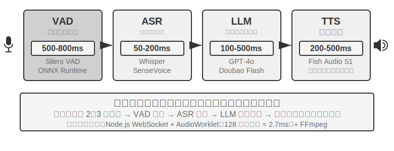


初期の音声アシスタントがこの 4 段階の直列パイプラインを採用したのは、理由が単純です。音声認識、言語理解、思考、音声合成という 4 つのタスクを同時に処理できる単一のモデルがなかったからです。モジュール型のアーキテクチャは、各コンポーネントを独立して開発・最適化できるようにします。しかしモジュール化の代償は遅延の累積です。各段階は前の段階が完了するのを待ってからでないと開始できません。

**VAD** はパイプラインの起点であり、音声ストリームを絶えず監視します。最も重要な設計は終端点検出（End-of-Speech Detection）です。通常 500〜800ms の連続無音のしきい値を設定します。ユーザーが半秒以上話さずに止まれば、VAD はユーザーが話し終えたとみなします。これが第 1 層の遅延を導入するのですが、両立が非常に難しいのです。しきい値を短くしすぎると、ユーザーが考えごとで少し間を置いただけで話し終えたと誤判定され、文が途中で切れてしまいます。長くしすぎると、ユーザーが話し終えた後に半秒以上も待たされてから反応が来ることになります。

**ASR** は音声波形を文字に変換します。Whisper、SenseVoice などのモデルが 5 秒の音声を書き起こす場合、GPU 上に中小規模のモデルをデプロイするときは通常 50〜200ms を要します。より大規模なモデルやリソースの限られたデプロイ環境では 200〜500ms に達します（実験 9-3 の対照群がこれに当たります）。より重要な問題は、VAD の待機と ASR の書き起こしの全過程を通じて、後段の LLM は完全に手すきで、何の情報も受け取らず、前もって思考を始められないという点にあります。

**LLM** の推論（inference）段階では、適切に最適化しても、コンテキスト長によっては、最初のトークンの遅延（TTFT、すなわちモデルが最初の一文字を吐き出すまでの待ち時間）にしばしば 100〜500ms を要し、最初の一文を出力し終えるのにさらに 100ms 程度を要します。reasoning（思考）を有効にすると、時間は 5〜10 秒にまで延びることがあります。従来のアーキテクチャでは、TTS は LLM が完全な返答テキストを出力し終えるのを待ってからでないと動き出せません。

**TTS** は返答の文字を音声に変換します。合成には通常 200〜500ms を要します。各段の遅延を足し合わせると（図9-2）、VAD（500〜800ms）+ ASR（50〜200ms）+ LLM（100〜500ms）+ TTS（200〜500ms）で、合計およそ 0.9〜2 秒になります。しかもこれは、すべてのサービスが手すきで、誰も並んでいない理想的な状況の話です。


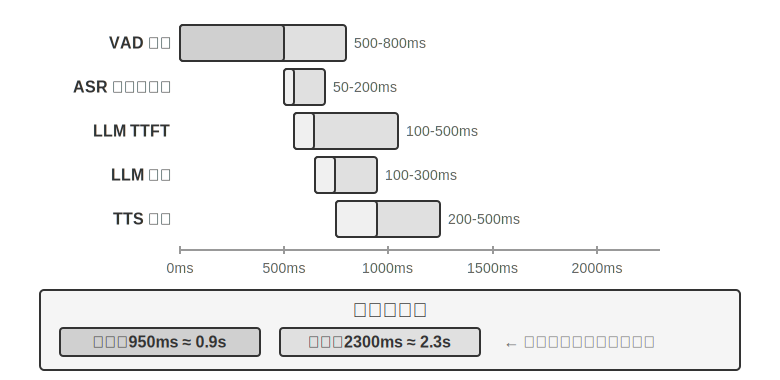


いったん本番に投入すると、待ち行列による遅延が事態をさらに悪化させます。これはレストランで並ぶのと同じ理屈です。厨房が忙しいほど待ち時間は長くなり、しかも線形にではなく急激に跳ね上がります（図9-3）。サーバーに待ち行列がまったくないとき（すなわち「無負荷」）、1 つのリクエストを処理する時間を無負荷遅延と呼びます。しかし複数のリクエストが同時に到着すると、後から来たリクエストは並んで待たなければなりません。

直感的にも、利用率が高いほど待ち時間は非線形に跳ね上がります。具体的な数学的関係は待ち行列理論で与えられます（ここでは直感的な理解にとどめ、厳密な導出は不要です）。総遅延 ≈ 無負荷遅延 × 1/(1-利用率)。利用率とはサーバーが忙しい時間の割合を指し、たとえば利用率 50% は、サーバーが半分の時間はリクエストを処理し、半分の時間は手すきであることを意味します。利用率 50% では遅延は無負荷の 2 倍になり、利用率 80% では 5 倍になります。これが、サーバーを長期にわたって高負荷で運用できない理由です。


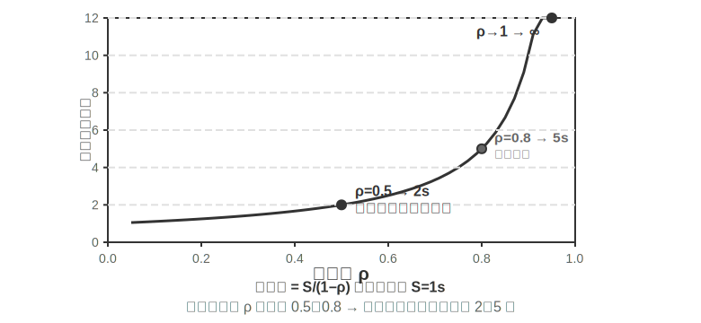


> **実験 9-1 ★：従来型の音声 Agent を構築する**
>
> 本実験では、ユーザーがマイクを通じて AI と音声対話できる完全なリアルタイム音声対話システムを構築します。システムはフロントエンドとバックエンドを分離したアーキテクチャを採用し、WebSocket でリアルタイムに通信します。
>
> 中核の流れは厳格な直列モードに従います。フロントエンドがマイク入力を捕捉し、WebSocket 経由でリアルタイムにバックエンドへ送信します。バックエンドは Silero VAD モデルを動かして音声活動検出を行い（従来の音量検出方式に比べて精度が高く、耐ノイズ性能も強い）、約 500ms の連続無音を検出したら音声片を抽出して後続の処理に回します。
>
> ASR、LLM、TTS の各段階はいずれも複数のプロバイダーを柔軟に切り替えられ、開発者は遅延、精度、地域のネットワーク状況に応じて最適な組み合わせを選べます。
>
> **実験 9-2 ★：PineClaw Voice API を使って電話 Agent を構築する**
>
> 実験 9-1 ではブラウザ内の音声対話システムを構築しましたが、現実世界では多くの Agent タスクが本物の電話をかけることを必要とします。カスタマーサポートに料金交渉の連絡をする、レストランを予約する、注文を確認する、といった具合です。第 4 章では PineClaw の Channel 機構を通じて、イベント駆動アーキテクチャが電話通知の応答遅延を分単位から秒単位へと下げる様子を示しました。本実験では音声通話そのものの構築に焦点を当てます。[PineClaw Voice API](https://pineclaw.com/)（著者チームが開発したもの）を例に取ると、この種の本番級電話音声 API は通常、発信、IVR ナビゲーション（すなわち「お問い合わせは 1 を、オペレーターにおつなぎするには 0 を押してください」といった電話メニュー）、対話、書き起こしの全プロセスをカプセル化しています。Agent が電話番号、目標、コンテキスト情報を提供すると、音声 Agent が通話全体をこなし、構造化された通話記録を返します。
>
> **実験の目標**：本物の電話を通じてタスクを完遂できる Agent を構築し、PineClaw Voice をツールとして ReAct ループに統合します。
>
> **技術方針**：PineClaw Voice Python SDK（`pine-voice`）を使い、Agent に `make_phone_call` ツールを装備させます。Agent はユーザーのタスク記述（「明日午後 3 時の歯科検診を予約して」など）を受け取り、ReAct の思考を通じて、(1) どの電話番号にかける必要があるか、(2) 通話の目標と鍵となる情報、(3) 通話終了後にどうユーザーへ結果を報告するか、を決定します。
>
> Agent のワークフロー：ユーザーが「クリニックに電話して明日の検診を予約して」と言う → Agent がどんな情報が必要かを考える（クリニックの電話、予約時間、患者氏名）→ 情報が足りなければユーザーに確認する → `make_phone_call` ツールを呼び出す → PineClaw が電話をかけ、相手と対話し、予約を完了する → Agent が通話の要約と書き起こしを受け取る → ユーザーに結果を報告する。
>
> **合格基準**：テスト電話の発信に成功すること（まず自分の携帯にかけて接続性を確認してもよい）。Agent がタスク記述に基づいて通話パラメータを自律的に決定でき、通話終了後に鍵となる情報（予約時間、確認番号など）を正しく抽出してユーザーに報告できること。API を直接使う場合と、Agent の ReAct ループを通じて呼び出す場合の違いを比較します。後者は情報が不完全な状況にも対応できます（ユーザーが電話番号を提供していないときはまず検索する、など）。
>
> この実験は、音声 Agent の重要な応用方向の一つを示しています。**Agent はユーザーと音声で対話できるだけでなく、ユーザーに代わって外部世界と電話でやり取りすることもできる** のです。PineClaw の音声 Agent は専門的に訓練されており、時間単位の待機、電話メニューのナビゲーション、複雑な交渉に対応できます。AI に通信事業者のカスタマーサポートへ電話をかけてもらい、オペレーターにつながるまで待ってもらう場面を想像してみてください。これらはまさに、従来の直列音声パイプラインでは荷が重い場面なのです。

### カスケードパイプラインの全経路ストリーミング化

よくある誤解を一つ解いておく必要があります。上記の 0.9〜2 秒という遅延の勘定は、「各段が走り終えてからバトンを渡す」という **完全直列** の場合を計算したものです。しかし 2025 年の本番システムは、とうにこんなやり方をしていません。主流の手法はモジュール化を捨てるのではなく、VAD-ASR-LLM-TTS の分業を保ちつつ、各段を **ストリーミング** に変え、隣り合う工程を時間的に重ね合わせるものです。

- **ASR は聞きながら変換する**：ストリーミング認識を採用し、ユーザーがまだ話している最中に文字が絶えず産出されます。VAD が一文の終わりを判定するのを待ってから書き起こしを始める必要がありません。
- **LLM は文単位で分割して出力する**：モデルは生成しながら、句読点や意味に沿って返答を短い文に切り分け、最初の文が形になった時点で下流へ送ります。段落全体の返答を書き終えるのを待ちません。
- **TTS は文単位でストリーミング合成する**：最初の一文を受け取った時点で合成・再生を始め、後続の文は生成しながら継ぎ足していきます。ユーザーが最初の音節を聞くまでの時間が大幅に前倒しになります。

こうすることで、ASR・LLM・TTS の 3 段はもはやバトンリレー式の前後関係ではなく、流れ作業のラインで同時に稼働する 3 つの持ち場のようになります。LiveKit Agents、Pipecat といったオープンソースのフレームワーク、そして主流の商用アウトバウンドコールシステムは、いずれもこの路線を採っています。全経路をストリーミング化すると、エンドツーエンド遅延は通常 600〜800ms まで圧縮でき、完全直列の 0.9〜2 秒より明らかに優れています。

しかしストリーミング化で圧縮できるのは「書き起こし、思考、合成」という重ね合わせ可能な 3 段の計算だけであり、圧縮できない遅延が一つあります。**VAD の無音待機と輪番判断そのもの** です。システムは依然として 500〜800ms の無音しきい値に頼って「ユーザーは結局話し終えたのか」を推測せねばならず、この待機はパイプラインが稼働するための前提であり、重ね合わせによって消すことはできません。この遅延まで一緒に圧縮するには、もはや「各段を重ね合わせる」ことに力を注ぐのではなく、最前端の知覚工程そのものへと方向を転じなければなりません。

### ストリーミング音声知覚：VAD + ASR を置き換える

この知覚フロントエンドは 2 段から成ります。VAD がユーザーの話し終わりを判断し、ASR が音声を文字に書き起こす。この二者が共に、パイプライン全体がいつ起動するか、そしてどんな入力を受け取るかを決めます。従来の VAD + ASR のカスケードには 3 つの根本的な問題があります。

1. **遅延の累積**：VAD はユーザーが話し終えたと確認するのに 500〜800ms の無音を待たねばなりません。未来を予知できないため、「本当に話し終えた」のと「ただ少し止まって考えている」のを区別するには「待つ」しかないのです
2. **情報の損失**：VAD は「有声／無声」という二値の信号しか出力せず、感情の変化、語気の起伏、ためらいの間、背景環境といった音響上の細部はすべて失われます。誤判定の問題は複雑な環境で特に顕著です。ユーザーが少し長めに間を置くと話し終えたと誤判定されて文が途中で切れ、背景ノイズが誤って引き金を引くと誰も話していないのにシステムが処理を始めてしまい、ユーザーの相槌の「うん」も、割り込みたいのか同意を示しているのか判断がつきません
3. **精度の低下**：VAD は連続する音声を一片ずつの独立した断片に切り、それぞれを個別に ASR へ送って認識させるため、コンテキストの連続性が壊れます。前後の文脈がなければ正しく認識できない内容（メールアドレス、ブランド名、人名、専門用語）の誤り率が明らかに上がります。たとえばユーザーがメールアドレス「john dot smith at gmail dot com」を伝えるとき、「john」と「smith」が別々の断片に切られてしまうと、「smith」はコンテキストを欠くために「miss」と誤認識されるかもしれません

**ストリーミング音声知覚モデル** は根本的な解決策を提供します。まず「ストリーミング」の技術的な意味を明確にしておきましょう。ある音声モデルがストリーミング処理できるかどうかの鍵は、**エンコーダーが因果的あるいはブロック単位か**（すでに到達した音声だけに依存し、録音全体を見る必要がない）、そして **デコードが逐次的か**（音声を少し受け取るたびに結果の一部を出力する）にあります。Whisper がストリーミングできないのは、そのデコード方式のせいではありません――そのデコード自体は自己回帰的です――そうではなく、そのエンコーダーが完全な音声セグメント（固定 30 秒、足りなければパディング）を必要としてはじめて動き出せるからです。もう一つ述べておくと、ストリーミング認識そのものは新技術ではありません。RNN-T やストリーミング Conformer に代表される従来のストリーミング ASR は、とうに産業界で大規模にデプロイされています――スマートフォンのリアルタイム字幕、入力方式の音声入力はいずれもこの類のモデルを使っています――そしてそれらは LLM とは無関係です。

本節が注目するのは新しい路線です。**LLM ベースのストリーミング聴覚知覚** で、オープンソース LLM を骨格としてポストトレーニングを行い、モデルが連続する音声ストリームから直接、意味レベルの応答を出力できるようにし、「認識」と「理解」を同一のモデルへと統合するものです。それは従来のストリーミング ASR の発展であって、ストリーミング技術の発明ではありません。逐次認識の遅延も同じく単一ステップの推論時間（数十から百数十ミリ秒）のオーダーに保たれますが、モデルが目にするのはもはや VAD で切り刻まれた孤立した断片ではなく、対話の始まりから現時点までの連続する音声ストリームであり、完全なコンテキストに基づく文脈内学習（In-Context Learning）が可能で、ユーザーの個人情報、専門用語、発音の癖に対する認識精度が著しく向上します。

この路線のもう一つの鍵となる利点は、LLM の世界知識と常識的推論能力を継承していることです――なにしろ骨格モデルは膨大なテキストを見てきています。たとえばモデルは「リンゴ」の後に「発表会」が続けば高い確率で果物ではなく Apple を指すと知っており、こうした知識の増強によって、金額、地名、ブランド名といった価値の高い情報の認識精度が従来の ASR をはるかに上回ります。この路線にはすでに実装可能なモデルがあります。Fixie の Ultravox は音声を直接 LLM 骨格へ送り、テキストと意味トークンを出力します。本節の実験で用いる Qwen2-Audio や、アリババの Qwen2.5-Omni も同じ類の音声ネイティブモデルです。

ただし、VAD を置き換えるのに、必ずしも完全な音声大規模モデルを動員する必要はありません。最初の問題――**ユーザーが結局話し終えたかどうかを判断する** ――だけを解決したいなら、もっと軽い道もあります。この「輪番判断」を認識器そのものに直接組み込むのです[^ch9-11]。やり方は、ごく小さなオープンソースのストリーミング認識モデルに LoRA を一つ加え、書き起こしをしながら **意味と無音を総合して** 「この一言はもう一つの完結した意味を表し終えたか」を判断させる、というものです。というのも、輪番内の間（電話番号を伝えるときの一瞬の間）は、輪番間の間隔よりも長いことがしばしばあり、無音しきい値だけに頼っていては必ず二兎を追う結果になるからです。さらに興味深い結論があります。モデルが「話を受けるべきか否か」で常に揺れ動く根源は、しばしばモデルの構造にあるのではなく、**訓練ラベルが「神の視点」で付けられている** ことにあります――アノテーション時には、決定点より後に現れる音声を使っていたのに、オンラインのモデルは未来をまったく見られないのです。各ラベルを「決定の時点で手に入る情報だけを使って」付け直すと、この見せかけの揺れは消えます。これは第 7 章のポストトレーニングの一つの判断とも呼応します。多くの場合、データはアーキテクチャよりも鍵になるのです。この軽い路線にもすでに本番級の実装があります。Deepgram の Flux、AssemblyAI の Universal-Streaming は終端点と輪番判断をストリーミング認識モデルに直接組み込み、音声 Agent 専用に設計されています。オープンソース側では LiveKit、Pipecat が提供する意味的輪番検出モデルがあります。

[^ch9-11]: 輪番判断を認識器に組み込むこと、および「ラベルの神の視点」というこの診断については Li, Bojie and Noah Shi. *The Trade-off Was in the Labels: Causal Supervision for Turn-Aware Streaming ASR.* 2026（発表予定）を参照。

モデルが出力するのは文字だけでなく、一連の **音響イベントの特殊マーカー** も含まれます――これらはモデルの訓練時に導入した専用トークンで、モデルは対応する音響イベントを検出したときに自動的に出力することを学習しています。よくあるいくつかの類は以下のとおりです。

- `<speak_start/end>`：単純な無音検出ではなく、意味と音響の総合的な判断に基づいて発話の開始・終了を確定する
- `<interrupt>`：ユーザーが本当に割り込みたいのか、それとも単に相槌を打っているのか、あるいは背景ノイズに干渉されているだけなのかを区別する
- `<emotion:happy/frustrated>`：感情マーカー
- `<laugh>` / `<sigh>`：笑い声、ため息などのパラ言語信号
- `<music>` / `<noise>`：環境音

これらのマーカーは文字トークンと統一されたイベントストリームを形成し、一緒に思考層へ送られます。

```
Input audio: "Um, actually I think... no wait, let me reconsider."
Model output stream:
  <speak_start> Um, <emotion:hesitant> actually I think...
  <silence:500ms> no wait, <emotion:confident> let me reconsider <speak_end>
```

モデルが出力するのは文字の書き起こしだけでなく、音声イベントのマーカー（発話の開始／終了、感情の変化、無音の間隔）も含まれる点に注意してください。Agent のフレームワークはこれらのマーカーを利用して、より自然な対話を実現できます――たとえばユーザーのためらいを検出したら、能動的に選択肢を提示する、といった具合です。

> **実験 9-3 ★：Qwen2-Audio でストリーミング音声知覚をシミュレートする**
>
> まず実験設計を説明しておく必要があります。Qwen2-Audio 自体は、セグメント全体を入力する非ストリーミングのモデルです。本実験では **ブロック単位の入力でストリーミング処理をシミュレート** します――連続する音声ストリームを固定長の小ブロックに切り、各ブロックをそれまでに累積した音声コンテキストと一緒にモデルへ送り、モデルが段階的にテキストと音響イベントトークン（笑い声、間などの非言語信号）を生成し、各ブロックが送り込まれてからテキストを産出するまでの遅延を測定します。ここに一つ重要な代償があります。Qwen2-Audio のエンコーダーは逐次的ではないため、新しいブロックを 1 つ処理するたびに、それまでに累積した全音声を最初からエンコードし直す必要があります。したがって対話が長いほど、累積した音声が多いほど、1 ブロックあたりのエンコード遅延は高くなります――これこそが「シミュレート・ストリーミング」と「真のストリーミング」（逐次的あるいは因果的なエンコーダーを採用し、新しく到達した一小片の音声だけを逐次エンコードする）との本質的な違いです。この設計は「完全なコンテキストを保持した連続知覚」がもたらす精度上の利得を実演できますが、遅延の数値はブロックの粒度と推論速度を反映するだけで、真にストリーミング設計されたモデル（ブロック単位のエンコードを採用した Qwen3-Omni など）の初回パケット遅延と等しくはありません。興味のある読者は後者に替えて本実験をやり直してみるとよいでしょう。対照方式は従来の VAD + Whisper ASR パイプラインです。3 種類の場面をテストします。通常の対話、間を含む長文、背景ノイズを含む対話です。
>
> 結果：ブロック単位のシミュレート方式の逐次認識遅延は百数十ミリ秒のオーダーに抑えられます（具体的にはブロック長とハードウェアによります）。一方、従来方式は VAD の話し終わり確認（600ms）に加えて Whisper の推論（本実験の構成では約 200〜500ms）を待つ必要があり、合計 800〜1100ms になります。間を含む場面では、VAD が最初の長い間の箇所で話し終えたと誤判定し、文を 2 段に切ってそれぞれ認識したため、「だいたい 2 時ごろ」がコンテキストを欠いて「だいたい 0 時ごろ」と誤認識されました。一方、ブロック方式は完全なコンテキストを保持し、文全体を正しく認識しました。背景ノイズの場面では、Qwen2-Audio は `<|noise|>` トークンを出力してノイズの存在を示しつつ認識を中断しませんでしたが、従来の VAD はノイズに誤って引き金を引かれ、認識プロセスが前倒しで起動してしまいました。

## パラダイム二・エンドツーエンドの全モダリティモデル（Omni）

カスケードパイプライン全体を振り返ってみましょう。知覚フロントエンドをストリーミング音声知覚に置き換えたとしても、それは結局のところ「聞く・考える・話す」の三者を 3 つの独立したモデルに割り当て、互いを離散的なインターフェースでつなぐものです。このインターフェースがどれほど太くても、しょせんは若干の意味トークンとわずかな音響マーカーにすぎません――話し手のその場の感情、語気、抑揚、そして背景の環境音や音楽は、大部分が受け渡しの際に失われ尽くします。おまけに 3 段はそれぞれ別々に訓練され、別々に最適化されるため、互いに協調しづらいのです。エンドツーエンドの全モダリティモデル（Omni）は別の道を切り開きます――単一のモデルで直接、音声を「聞き」、返答を「考え」、それを「話し」、3 段を一つに統合します（図9-4）。訓練データさえ十分であれば、モデル内部の潜在空間（Latent Space）が、テキストを超えてこれらのパラ言語情報を直接生成端へ伝えられます。遅延はより低く、韻律と感情も保たれます。トレードオフはこうです。**カスケードパイプライン** はモジュールが明快で、各段を独立して調整でき、解釈性が良い。**エンドツーエンドモデル** は遅延がより低く、非文字情報を保てるが、その代償として訓練データの要求が大きく、解釈性が劣る。

さらに見落とされがちな次元を補っておく必要があります。エンドツーエンドの優位は主に **遅延** に現れるのであって、**精度** の次元では必ずしも優位とは限りません。対照に値する一つの方式が **セルフカスケード**（self-cascade）です――同一のモデルがまず音声を構造化テキストに書き起こし、そのテキストに基づいて推論します。一度でエンドツーエンドに答えるのと比べて、どちらの精度が高いかは具体的なタスクによります。その法則はこうまとめられます。答えが主に意味内容（すなわち「何を言ったか」）で決まり、中間テキストがタスク関連情報を十分に担いうる場合、セルフカスケードの精度はエンドツーエンドと同等か、むしろ優れており、この優位は知覚能力の弱いモデルで特に顕著です。逆に、答えがテキストで表しにくい非言語的手がかり（抑揚、感情、環境音）に大きく依存する場合には、エンドツーエンドがはじめて明らかな優位を示します。さらに重要なのは、両者の優劣は **タスクの性質に基づいて事前に判定できる** のであって、単純に「エンドツーエンドのほうが先進的だ」に帰せられるものではない、という点です。ここからさらに一つの設計原則が導けます。性能を決める鍵は、しばしば中間表現という **ボトルネック** を導入するか否かにあるのではなく、そのボトルネックが担う情報にあります――中間テキストを単なる書き起こしから、パラ言語マーカー（感情、話速、環境音）を伴う構造化表現へと引き上げれば、エンドツーエンドが本来もっていた精度上の優位はしばしばそれにつれて縮まります。これは前掲の〈ストリーミング音声知覚〉が主張した「知覚層は純粋なテキストだけを出力すべきではない」と一脈相通じます[^ch9-13]。

しかし Omni がどれほど強くても、本質的には 3 つのモデルを 1 つに合成しただけであり、**「交互に話す」という前提を取り消してはいません**。それは依然として VAD に頼って発言権を区切ります――ユーザーの声を検出したら止まり、ユーザーが無音になったらすぐ口を開く。そこであの見慣れた問題が再び浮上します。ユーザーが一連の数字を言い、途中で少し間を置くと、Omni は相手が話し終えたと判定して強引に割り込むのです。前掲のストリーミング音声知覚は輪番判断を無音の長さから意味のレベルへと引き上げ、この種の誤判定を大幅に緩和できますが、それも結局は「輪番」の枠組みの中での局所的な手直しにすぎず、輪番そのものを取り消してはいません。**根本から** この苦境を抜け出すには、もはや「輪番」の枠組みの中で手直しするのではなく、モデルに聞きながら話させ、いつ口を開くかを自ら決めさせ、「誰が話す番か」という硬直した切り替えをなくさなければなりません。

[^ch9-13]: カスケードとエンドツーエンドの精度上の優劣がいつ逆転するか、およびタスクの性質（中間表現がタスク関連情報を十分に担いうるか）に基づいてその方向をどう予測するか、完全なモダリティ横断の測定は Li, Bojie and Noah Shi. *The Cascade Gap: When and Why Self-Cascades Help Multimodal Agents.* 2026（発表予定）を参照。

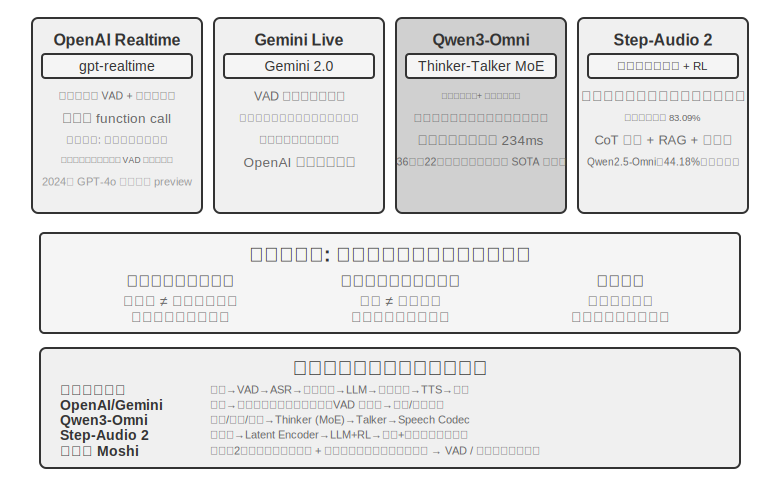

**OpenAI Realtime API** は、モデルの層ではエンドツーエンドに近い（モデルが音声をネイティブに処理する）ものの、対話制御の層では依然として従来の VAD に頼っており、完全なエンドツーエンドへ移行する途中の中間方式に属します。当初（2024 年の preview）は GPT-4o 上で動いていましたが、2025 年に正式に GA となった後、独立した音声専用モデル **gpt-realtime**（GPT-4o の一モードではなく、リアルタイム音声のために個別に最適化されたモデル）に切り替わりました。API はデフォルトでサーバー側 VAD を有効にし、ユーザーがいつ話し始め、いつ話し終えたかを自動で判断します。対話中の割り込みをサポートし――ユーザーが口を開いたのを検出すると即座に現在の音声生成を止めます。二人が対面で話しているとき、一方が割り込めば他方が自然に止まるのと同じです。gpt-realtime はさらに非同期の関数呼び出しを導入しました。モデルはツールの返り値を待ちながら、同時にユーザーと話し続けられ、ツールの遅延を対話の過程に隠せます。これらはいずれも体験を改善しますが、本質的には依然として VAD の枠組みのもとでの最適化です。**Gemini Live API** も発想は似ており、VAD の感度設定をサポートし、割り込み時にはすでに送信済みの情報を保持して対話の一貫性を確保します。

**Qwen3-Omni** は Thinker-Talker アーキテクチャを採用しています。思考（理解と推論）と表現（音声生成）を 2 つの専門モジュールに分け、テキスト・画像・音声・動画の知覚と生成を統一しました。Qwen3-Omni の低い初回パケット遅延は生成端（Talker）のアーキテクチャに由来します。それは複数コードブックの自己回帰的な方式で音声トークンを段階的に生成し、因果的（causal）codec を組み合わせてこれらのトークンを逐次的に波形へデコードします。そのため思考モジュールがテキストを産出すると、Talker はすぐに続けて音声をストリーミング合成でき、返答全体の生成を待つ必要がありません。公式報告によれば、そのコールドスタートの理論上の初回パケット遅延は約 234ms まで低く、19 言語の理解と 10 言語の生成をサポートし、36 の音声・映像ベンチマークのうち 22 でリードしています。

**Step-Audio 2** は異なる路線を進みます。生の音声入力を直接処理し、テキストと音声を出力して、真のエンドツーエンド音声対話を実現します。それは何を言ったか（意味情報）を理解できるだけでなく、どう言ったか――パラ言語情報（Paralinguistic Information）、たとえば話し手の感情が喜びか怒りか、話速が急いているか迷っているか、抑揚が上がっているか低く沈んでいるか――そして背景の環境音や音楽も知覚できます。それは思考と強化学習を通じて表現力豊かな返答を生成し、さらに RAG 機構と外部ツール（ウェブ検索、音声検索）も統合しています。Step-Audio 2 の論文報告によれば、同論文が提案した StepEval-Audio-Paralinguistic というパラ言語理解ベンチマークにおいて、Step-Audio 2 の精度は 83.09% に達し、同時期のオープンソース全モダリティモデル Qwen2.5-Omni（44.18%）をリードし、GPT-4o Audio（43.45%）や Kimi-Audio（49.64%）も上回っています。

Step-Audio R1 は Step-Audio シリーズの後続の仕事であり、Step-Audio 2 のエンドツーエンド音声対話アーキテクチャを土台として、さらに思考能力を音声モデルの中へ直接内在化させたものです。両者は同一の技術路線の漸進的な進化を表しています。

## パラダイム三・全二重対話モデル（Full-Duplex / Interactive）

パラダイム二は 3 つのモデルを 1 つに合成しましたが、依然として「交互に話す」という前提を守っています――ユーザーが話すか、モデルが話すかのどちらかで、切り替え点は VAD や意味で推測します。しかし、場面によっては「あなたが一言、私が一言」と交互に話すわけではありません。**同時通訳** はその一例です。通訳者は話し手が一文を言い終えるのを待ってから口を開くのではなく、聞きながら頭の中で組み立て、一つの意味のまとまりがおおよそ完結したらすぐに訳出します。聴くことと訳すことは常に重なり合っています。**音楽に合わせてドラムを叩く** リズムゲームはさらに極端です。聴覚は途切れない音楽ストリームを絶えず追い続け、両手は拍を正確に踏んで即座に叩き、同時に次の拍を予測する必要すらあります。ここにはもはや「一輪」というものすらなく、入力は決して止まらない連続ストリームです。この種のタスクは turn-by-turn モードに根本的な挑戦を突きつけます。それらは聴く・考える・動くを同時に進めることを要求しますが、輪番モードの前提はまさに、三者を前後の異なる時間片に分けて置くことにあるのです。全二重モデルはまさに「VAD からの脱却」という道を論理的な終点まで進めたものです――いっそ「交互に話す」という前提を取り消し、モデルに **同時かつ持続的に聞き、話させる** のです。

研究上の先駆けは Kyutai の **Moshi**（2024）です。それは 2 本の音声ストリーム（ユーザーの声とモデル自身の声）を並行してモデル化し、さらに 1 本の「内なる独白」テキストストリームを添えて、生成される音声の言語的品質を高めます。どの時点でも常に聴いているため、重なって話すことも、いつでも割り込むことも、すべて自然な振る舞いとなり、明示的な割り込み検出ロジックをまったく必要とせず、エンドツーエンド遅延は約 200ms で、人間の対話の自然なテンポに近づきます。

2026 年、Mira Murati が創設した **Thinking Machines Lab** は、彼らが **対話モデル（Interaction Model）** と呼ぶ新しいカテゴリーをプレビューし[^ch9-14]、全二重の背後にある主張を明確にしました。対話性は VAD のような外付けの harness としてモデルの外側を取り囲むべきではなく、モデル自身に内蔵されるべきだ、というものです――彼らの原文の言葉を借りれば、「対話性を知能とともにスケールさせるには、対話性がモデル自身の一部にならなければならない」。アーキテクチャに落とし込むと **マイクロターン（micro-turn）** になります。モデルは一輪まるごと話し終えるのを待たず、約 200ms を一区切りとして、絶えず「200ms 読み込み、200ms 生成する」を続け、音声・映像・テキストという複数のストリームを織り交ぜて進めます。この粒度は意図的な折衷です――十分に細かく、無音・重なり・割り込みがすべて連続ストリームとしてモデルのコンテキストに保たれ、人為的な輪番の境界に合わせる必要がもはやなくなります。そして十分に粗く、複数のモダリティをブロック単位で並行処理でき、遅延をリアルタイムに感知できる範囲に抑えられます。まさに対話がモデル内部に取り込まれたからこそ、「聞きながら話す」「見ながら口を挟む」といった、かつては専用の harness でつぎはぎしなければ実現できなかった振る舞いが、いまやモデルの本来の務めとなり、モデルとともに強くなっていきます。最初のモデル TML-Interaction-Small は 3 本のストリームをゼロから一緒に訓練しており、ユーザーがバグを含むコードを書いているのに気づいたり、誰かが画面に入ってきたりすると、いずれも能動的に口を開けます。

その「遅い思考」のつなぎ方もかなり代表的です。対話モデル自身は対話をオンラインに保つことだけを担い、いったん深い推論やツール呼び出しを要する問題に出くわすと、バックグラウンドのより強い推論モデルに委譲します――渡すのは孤立した一つのクエリではなく、**対話全体のコンテキスト** です。バックグラウンドのモデルが推論する間、結果はストリーミングで返され、対話モデルはユーザーを妨げないタイミングを見計らってそれを自然に対話へ織り込み、その間も普段どおり相槌を打ち、追加の問いに答え、話の主導権を守り続けます。こうして「非思考モデルの遅延」で、「推論モデルの計画・ツール・エージェント能力」を兌換するのです。公式報告によれば、TML-Interaction-Small（276B パラメータの MoE、活性化 12B）の輪番切り替え遅延は約 0.40 秒まで低く（GPT-realtime-2.0 は約 1.18 秒）、視覚的な能動性を測るベンチマークでは、ほぼ 0 点の競合を大幅にリードしています。本書執筆時点では、なお研究プレビュー段階にあります。

[^ch9-14]: Thinking Machines Lab, “Interaction Models: A Scalable Approach to Human-AI Collaboration,” 2026-05. https://thinkingmachines.ai/blog/interaction-models/

同じ年、OpenAI の **GPT-Live** は全二重を本番規模へと持ち込み、ChatGPT 音声の新しいデフォルトモデルとして世界に展開しました。それはもはや対話を一連の分立したメッセージ輪番とは見なさず、**入力を持続的に処理すると同時に出力を持続的に生成** します。そのため毎秒何度も対話上の判断を下せます。口を開いて話すべきか、聞き続けるべきか、間を置くべきか、割り込むべきか、それともツールを呼ぶべきか。それが表に出るとこうなります。ユーザーが考えているときは話を奪わず静かに待ち、「うん」「そう」といった相槌で自分が聞いていることを示し、リアルタイム翻訳のような聞きながら話さねばならないタスクもこなせます。

GPT-Live も同じ速い-遅いの分業の道を進みました――**「リアルタイム対話」と「深い思考」を分離** します。検索、推論、あるいはより複雑なエージェント操作を要する問題に出くわすと、対話を担う GPT-Live はタスクをバックグラウンドの最先端モデル（リリース時は GPT-5.5）へ委譲し、自らは対話の流れを維持し続け、バックグラウンドから結果が出たらそれを対話へ持ち帰ります。GPT-Live-1 と mini 版はバックグラウンドで GPT-5.5 Instant を使い、Medium・High の段階では思考付きの GPT-5.5 を呼び出して、ユーザーが必要に応じて「速い」と「深い」の間で取捨できるようにします。この「速い-遅いの分業」こそ、次節の「思考アーキテクチャのトレードオフ」で展開する主題です。

本章の「VAD を置き換える」という物語の連鎖を振り返りましょう。VAD は無音しきい値で発言権の切り替えを推測し、ストリーミング知覚（前掲パラダイム一「ストリーミング音声知覚」の節を参照）は切り替えの判断を意味の層へ引き上げ、そして全二重モデルは「切り替え」そのものを完全に解消しました――それは常に聞いており、「割り込み」はもはや専門の処理を要するイベントではなくなり、barge-in の処理連鎖もそのためアーキテクチャ上ほとんどの工程が省かれます。これが「VAD を置き換える」という物語の線の、本書執筆時点における終点です。

## 思考アーキテクチャのトレードオフ：分離から統一へ

本当に解決すべきは **リアルタイム応答と深い思考の間の矛盾** です。ユーザーはミリ秒単位の反応を期待する一方、複雑な問題には秒単位の思考時間が必要です。低遅延を保ちつつ、いかにモデルに十分に深く考えさせるか。この矛盾はエンドツーエンドのアーキテクチャに固有のものではなく、カスケードパイプラインも同じく避けて通れません。

以下の 3 つの方式は線形の技術的イテレーションではありません――それらは異なる制約条件に対する設計上のトレードオフであり、実践では並存し、どれを選ぶかは応用場面が遅延と思考の深さに対してどんな要求を持つかによります。まず三者の分かれ目を明確にしておく必要があります。方式一、方式二は本質的に「2 つの独立したモデルを並行させる」速い-遅いの分業であり、エンドツーエンドに依存せず、カスケードパイプラインの上にかぶせることすらできます。方式三だけが、思考を真にエンドツーエンドのモデルへと内在化させます。

注目に値するのは、2026 年に至って、この「速い-遅いの分離」という道が最先端の音声製品の主流の選択となり、専用の名前まで持ったことです。Thinking Machines Lab はそれを「対話モデル（Interaction Models）」と呼びます――一つのリアルタイム対話モデルが一つの非同期のバックグラウンド推論モデルと結合したものです。xAI の Grok Voice の「Think Fast」、Pine AI の音声 Agent、そして前節の GPT-Live の「委譲」は、いずれも同じ「速いほうが前面で対話を維持し、遅いほうがバックグラウンドで深く推論する」という路線を進んでいます。「全能なモデルを訓練する」のではなく分離を選ぶ背後には、一つの現実的な理由があります。最先端の推論モデルは数か月ごとにイテレーションする一方、リアルタイム対話能力には専用のデータと訓練目標が必要で、両者を同じモデルに詰め込むのは、絶えず動く的を追わせるに等しく、しかも最も貴重な推論能力を薄めてしまいかねません[^ch9-8]。逆に、最強の推論モデルをそっくりそのままバックグラウンドに置き、前面には軽量な対話モデルだけを訓練しておけば、常にその時点で最強の「頭脳」を使えます――これこそ GPT-Live が「最新の最先端モデルへ継続的に切り替えられる」ことを強調する理由です。以下では「協調の仕組みが弱いものから強いものへ」という順で 3 つの方式を見ていきます。

### 方式一：速い思考でしのぎ、遅い思考で答える

速い思考と遅い思考を並行して実行します（図9-5）。速い思考は 500ms 以内に短いしのぎ的な返答を出し（人がまず「ちょっと考えます」と言うのに似ています）、遅い思考はバックグラウンドで 5〜10 秒かけて深く思考した後に完全な返答を出します。遅い思考が使う技術は「推論時計算のスケーリング」（test-time scaling）と呼ばれます――平たく言えば、モデルが問題に答える際に「もう少し長く考えさせる」ことです。一歩で答えを出すのではなく、人間が数学の問題を解くように、まず筋道を並べ、段階的に導出し、結果を確認し、より多くの計算ステップと引き換えにより高品質な返答を得ます。


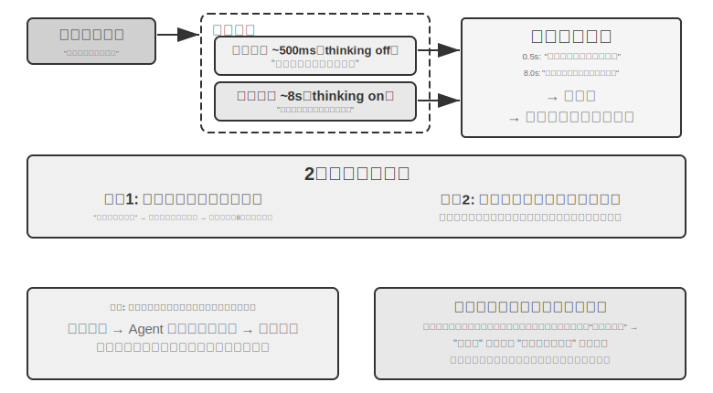


**問題その一：単純な問題への過剰な思考**。ユーザーが「今日は何曜日」と聞くと、速い思考はすでに 500ms 以内に正しく「水曜日」と答えているのに、遅い思考はなお丸々 10 秒の思考を走り終えてからもう一度「水曜日」と繰り返します。これは計算資源を無駄にするだけでなく、より深刻なのは対話のテンポを壊すことです――ユーザーはすでに答えを得て次の話題に移ろうとしているのに、繰り返しの返答に妨げられます。**問題その二：速いと遅いの不一致**。両者は独立して並行しており、見ているコンテキストは同じでも、思考の経路はまったく異なりうるのです――速い思考はある仮定に基づいて暫定的な答えを出したのに、遅い思考はその仮定が成り立たないと気づき、逆の結論に達する。ユーザーは数秒のうちに前後で矛盾した返答を聞かされ、信頼感が一瞬で崩れます。根本原因はこうです。方式一は対話を 2 つの独立した思考プロセスに分けており、一つの一貫した認知活動にはなっておらず、速いと遅いの間に協調の仕組みが欠けているのです。

```
<user>このプランは私に合っていますか?</user>
<!-- 速い思考が 0.5 秒後 -->
<assistant（速い思考）>このプランは価格がとてもお得です。ご購入をおすすめします。</assistant>
<user>わかりました、では私は...</user>
<!-- 遅い思考が 8 秒後に完了 -->
<assistant（遅い思考）>お待ちください、このプランにはご必要な国際ローミング機能が欠けていて、あまり合わないかもしれません。</assistant>
<user>（怒り） 結局、買えというのか買うなというのか?!</user>
```

### 方式二：速い思考で対話し、遅い思考で助言する

方式二では、遅い思考が速い思考の出力を見られるようにし、Agent ステータスバー（第 2 章で紹介した動的なメタ情報の注入機構）を通じて速い思考に助言を提供します。ユーザーに直接話すのではありません。方式一に比べて 2 点改善しています。遅い思考はバックグラウンドで非同期に動き、話している合間を利用して思考し続けます。そして速い思考の出力を見られるので、直接衝突せず、後方に退いて「軍師」となります。前述の GPT-Live の委譲、Pine AI の音声 Agent は、いずれも方式二の本番での実例です――バックグラウンドの推論モデルが結論を、簡潔なテキストの経路を通じて前面の対話モデルへ返し、前面がいつ、どんな言い回しでユーザーに話すかを決めます。

しかしこの方式にもなお本質的な限界があります。**速い思考が指揮に従わないことがある** ――2 つの独立した思考インスタンスの間のやり取りは間接的で曖昧です。速い思考は Agent ステータスバーを受け取っても理解を取り違えるかもしれません。たとえば「価格を再確認する必要がある」を「価格を計算し直す必要がある」ではなく「ユーザーがこの価格を受け入れられるか尋ねる」と解釈してしまう、といった具合です。**途中の思考結果を知りようがない** ――遅い思考は 10 秒の思考の中ですでに多くの価値ある中間結論を生み出しているのに、速い思考にはまったく見えず、最終的な Agent ステータスバーをただ待つしかありません。もしユーザーが遅い思考の完了前に再び質問したり割り込んだりすれば、速い思考は自分の限られた理解だけを頼りに答えるしかありません。これはまるで、二人で問題を解いているのにメモの受け渡しでしか意思疎通できず、相手の下書き用紙が見えないようなものです。

方式二はさらに一つの根本的な理論上の問題に直面します。**「考えながら話す」を実現できない** のです。人間は複雑な問題に向き合うとき、まず頭の中で完全な答えを考えてから一気に話すのではなく、一段考えては一段話します――「この問題は面白いですね……（間を置いて考える）まず考えるべきは……（考え続ける）次に……」。方式二の速い思考は、遅い思考の結果が出るまでフィラーを口にして待つことしかできず、思考の過程を対話の中に自然に織り交ぜられません。

### 方式三：エンドツーエンドで思考と表現を統一する（Step-Audio R1 を例に）

方式二は遅い思考の待機問題を解決したとはいえ、アーキテクチャ上は依然として「まず考えてから話す」であり――思考と表現はなお 2 つの分離したプロセスで、人間のように考えながら話すことは不可能です。この根本的な限界を突破するには、思考能力をモデルの中へ直接内在化させる必要があります。

Step-Audio R1 はまさにこの方向に沿って、根本的に異なる方式を提案しました。思考能力をエンドツーエンドの音声言語モデルの中へ直接内在化させ、デュアルブレイン・アーキテクチャによって真の「考えながら話す」を実現します。それは実は 2 つの相補的な機構から成り、それぞれ異なる問題を解決します。**モダリティ接地思考蒸留（MGRD）** がまず「考えが正しいか」を解決します――モデルにテキストの書き起こしではなく音響特徴に真に基づいて考えさせます。**MPS デュアルブレイン・アーキテクチャ** がさらに「話すのが間に合うか」を解決します――思考と表現を並行させ、低遅延の「考えながら話す」を実現します。前者は後者の前提です。思考そのものが音に根ざしてはじめて、考えながら話すことが真に価値を持つのです。以下、順に展開します。

**テキスト代理思考の問題**。理想的には、音声モデルは音の特徴（音高、リズム、抑揚など）を直接分析して話し手の感情や意図を理解すべきです。しかし実際には多くのモデルが近道をしています。既存の音声言語モデルには反直感的な現象があります。思考連鎖が長いほど、かえって性能が下がるのです。Step-Audio R1 チームは、その根本原因が「テキスト代理思考」（Textual Surrogate Reasoning、すなわち音響情報の「代わりに」テキスト情報を使って分析すること）だと突き止めました。モデルは「思考」する際、実際にはテキストの書き起こしに基づいて意味レベルの思考をしているのであって、真に音響特徴を分析しているのではないのです。一例を挙げましょう。ある曲の感情を判断させると、モデルが分析しているのは「歌詞に悲しみが言及されている」ことであって、「短調の旋律に下行する音高の輪郭が加わって哀愁を伝えている」ことではありません。このモダリティの食い違いは訓練データに由来します。ほとんどの音声モデルの CoT（Chain-of-Thought、思考連鎖）データはテキストモデルによって生成されており、当然ながら純粋なテキストの思考パターンを受け継いでいるのです。

**モダリティ接地思考蒸留**（MGRD, Modality-Grounded Reasoning Distillation）は、反復的な自己改善を通じてこの問題を解決します（図9-6）。名前は舌を噛みそうですが、中核の発想はきわめて直感的です。「本当に音を聴いている」思考プロセスを選り分け、それを使ってモデルを訓練し、モデルが文字編集者のように歌詞だけを見るのではなく、音楽の先生のように耳で分析することを学ばせるのです。具体的には 3 ステップに分かれます。

1. 現在のモデルに同一の音声から複数の異なる思考プロセスを生成させ、そのうち真に音響特徴に基づくものを選り分けます。どう選り分けるか。思考の内容に具体的な音のパラメータが言及されているかを見ます。たとえば、怒りの音声入力に対して、テキストベースの思考は「ユーザーが『ひどすぎる』という否定的な語を使ったので怒りだと判断する」――これは文字の内容を分析しているだけです。一方、音響特徴に基づく思考は「話速が通常より 40% 速く、音量が明らかに上がり、声調が甲高くなった」――これこそ真に音を「聴いて」います。MGRD は後者を選り分けます
2. これらの高品質な思考データでモデルを再訓練し、その「耳で考える」能力を強化します
3. 強化学習でさらに最適化し、モデルが手を抜いて思考を飛ばしていきなり答えを当てにいくのを防ぎます

複数ラウンドの反復を経て、思考の根拠はテキストの抽象から音響の分析へと徐々に移っていきます――モデルは「話し手はどうやら不機嫌だ」と大まかに言うのではなく、「音高の輪郭が 1.2 秒の箇所で急激に下がる」ことに注目し始めます。

**MPS デュアルブレイン・アーキテクチャ**（Mind-Paced Speaking、直訳すれば「思考のテンポに従って話す」）が解決するのは、思考と音声出力の間の遅延の矛盾です（図9-6）。その着想は人間の脳の分業に由来します。人間の脳では思考を担う領域と言語を組み立てる領域は分かれており、並行して働けます――あなたは次の一文を考えながら、口では前の一文を話しているのです。MPS は 2 つのモデルでこの分業を模します。**構想脳**（Formulation Brain）は思考し続けることを担い、一段ごとの思考結果を産出します。**表現脳**（Articulation Brain）は新しい思考結果を一段受け取るたびに、それ以前の思考と既存の返答を組み合わせ、それを音声の返答へと変換します。

両者は並行して動きます――構想脳が内容をすべて考え終えなくても、表現脳はもう話し始めています。たとえば、t=0ms で構想脳がユーザーの問題の分析を始め、t=200ms で最初の一段の思考結果（テキストトークン列）を出力します。表現脳は t=200ms でこの結果を受け取ると、すでに生成した返答のコンテキストと組み合わせ、t=350ms で対応する音声トークンを出力し始めます――2 つのモジュールがパイプライン方式で並行して稼働し、ユーザーは t=350ms には最初の音節を聞けるのです。


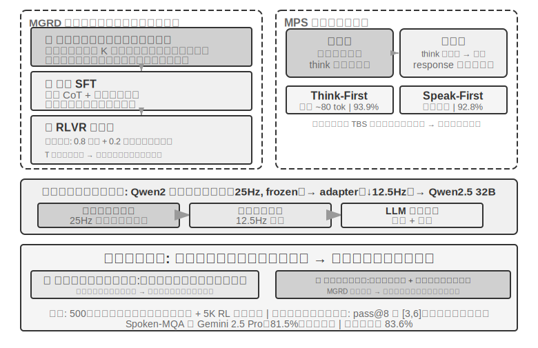


> **実験 9-4 ★★★：Step-Audio R1 でエンドツーエンドの音声思考を実現する**
>
> 本実験では Step-Audio R1 モデルを使い、音声思考と対話のタスクにおける異なる構成の性能を比較します。Step-Audio R1 は音声エンコーダー、音声アダプター、Qwen2.5 32B デコーダーから成り、マルチ GPU でのデプロイが必要です。
>
> 本実験は 2 つのタスクで評価します。**Spoken-MQA**（音声数学問題）は、口述された問題を聞いた後にモデルが多段階の数学的推論を行えるかを測ります。**URO-Bench**（中国語の口語対話ベンチマーク）は、開放的な対話の品質を測ります。
>
> テスト構成は 2 つの次元に分かれます。第一は **思考のタイミング** です。完全な **TBS**（Think-Before-Speak、まず考え終えてから話す、遅延制約のない対照ベースラインとして）はまず思考をすべて生成してから口を開きます。遅延を下げるため、MPS は 2 種類の「考えながら話す」の変種を提供します――**Speak-First**（spkfirst とも呼ぶ、遅延ゼロ、話すことと考えることを同時に始める）と **Think-First**（thkfirst とも呼ぶ、思考脳が最初の一段を産出してから話し始める、遅延は約 80 トークン）です。第二は **アーキテクチャ** です。MPS のデュアルブレイン並行 vs. 従来の単一モデル TBS です。
>
> 結果は表9-1 のとおりで、異なる思考タイミングとアーキテクチャ構成の、数学の精度と対話のスコアにおける性能を比較しています。
>
> 表9-1 Step-Audio R1 の異なる音声思考構成の比較
>
> | 構成 | Spoken-MQA | URO-Bench |
> |------|-----------|-----------|
> | 思考せず直接回答（ベースライン） | 70.6% | 77.4 |
> | MPS Speak-First（遅延ゼロ） | 92.8% | 82.5 |
> | MPS Think-First（〜80 tok 遅延） | 93.9% | 84.8 |
> | 完全 TBS（遅延制約なし） | 93.0% | — |
>
> 興味深い発見の一つは、Speak-First が思考タスクにほとんど影響しない（92.8% は完全 TBS の 93.0% に近い）ことです。理由は、**CoT**（Chain-of-Thought、思考連鎖）の冒頭は通常、問題内容を復唱しているだけで、まだ本当の推論には入っていないため、モデルが口を開くと同時に思考を始めさせても、最終的な精度はほとんど損なわれないからです。もう一つ注目すべき細部は、Think-First（93.9%）が遅延制約のない完全 TBS（93.0%）をわずかに上回りさえすることです――一つの可能な解釈は、思考を分段して産出し、一段ずつ表現へ変換することが、段階的な監督に似た正の作用を果たした、というものです。もっとも、両者の差は評価誤差の範囲内でもあり、過度に読み込むべきではありません。
>

方式三は思考を単一モデルへと「内在化」させ、「考えながら話す」を最も優雅に実現しますが、その代償はまさに本節冒頭で述べた「動く的」です。この一つのモデルは最強の推論者であると同時にリアルタイムの話し手でなければならず、しかも 2 つの能力はどちらも急速に進化しているため、統一路線では繰り返し再訓練しなければ追いつけません。これは執筆時点の産業界の分かれ目も説明します――「いつでも最新の頭脳に切り替えられる」ことを追求する最先端製品（GPT-Live、Grok Voice、Pine AI）の多くは方式二の分離路線に賭けており、方式三は極限の自然さを追求し、専用の訓練コストを負う覚悟のある場面により適しています。両者はどちらがどちらを取って代わるというものではなく、「取り替えられる頭脳」と「より緊密な考えながら話す」の間のトレードオフなのです。

### 速いと遅いの間のインターフェース：文字以外に何を伝えられるか

（ヒント：これは場面をまたぐインターフェースの議論であり、いったん音声の主線を離れます。）方式二を振り返ると、見落とされていた設計上の次元に気づきます。遅い思考が速い思考に「話を渡す」のに使っているのは **テキスト** の経路（ステータスバーを通じて一言の助言を伝える）です。テキストは分かりやすく、デバッグしやすいのですが、遅い思考の頭の中にあるものにとっては一本の細いストローにすぎません――本当に豊かな中間状態が、数言に圧縮されてしまうのです。では、この速いと遅いの間のインターフェースは、文字を使わずにすませられないでしょうか。

リアルタイムゲームという、拍に対して最も厳しい場面では、この道は通じます（これを潜在空間橋、Latent Bridge と呼べます）[^ch9-8]。素早い反応を担う小さなモデル（毎秒十数個の動作を出す）と、推論を担う遅いモデル（毎秒 1 回の思考を出す）をどちらも **凍結して動かさず**、両者の間の数千万パラメータの小さな「橋」だけを訓練し、遅いモデルの隠れ層の結論を直接いくつかの「潜在トークン」へ投影して、マルチモーダルモデルが視覚トークンを詰め込むように速いモデルの入力に組み込みます――「考え→文字→再理解」という往復を回避するのです。結果、複数の Atari ゲームで、この潜在空間の経路は従来のテキスト経路をさらに一段上回り（一部のゲームで +26% から +82%）、しかも 1 ステップあたりの追加コストは約 5 ミリ秒で、依然としてリアルタイムの拍についていけます。

それは一つの誠実な境界も示します。**速いと遅いの協調が本当に役立つかは、タスクのボトルネックが「考えつくかどうか」にあるのか「反応が間に合うかどうか」にあるのかによる** のです――遅い思考がもともと速い反応より強いときにこそ、この橋は役立ちます（この相関はゲームをまたいで r≈0.9 に達します）。逆に、タスクが純粋に反応速度の勝負なら、どんなに良い橋も役に立ちません。この判断はゲームだけに成り立つのではなく、本章後半の Computer Use で出くわす同じ問題も予告しています。いつ「遅い軍師」を呼ぶ価値があるのか、いつそれが遅延をいたずらに増やすだけなのか。

[^ch9-8]: 凍結した 2 つのモデルの間の潜在空間橋だけを訓練すること、および「いつ遅い軍師を呼ぶ価値があるか」の完全な分析は Li, Bojie and Noah Shi. *The Latent Bridge: A Continuous Slow-Fast Channel for Real-Time Game Agents.* arXiv:2606.24470, 2026 を参照。

エンドツーエンドであれモジュール化であれ、知覚層と実行層それぞれの品質は依然としてきわめて重要です。エンドツーエンドモデルはアーキテクチャの層の遅延問題を解決しましたが、「正確に聞く」と「人間らしく話す」という 2 つの基本は、アーキテクチャが変わったからといって自動的に解決するわけではありません――「正確に聞く」に対応するストリーミング音声知覚はすでにパラダイム一で論じたので、ここではもう一つの「人間らしく話す」の実行層、すなわちより人間らしい音声合成を見ます。

## より人間らしい音声合成

従来の TTS の「完璧さ」こそが、まさに問題の所在です。あまりに流暢で、間がなく、フィラーもない音声は、一聞して機械だと分かります。人間が話すときのあの「不完全さ」は欠陥ではありません――間、フィラー（「えー」「あの」「その」）、時折の言い直し――それらは実は思考の過程が自然に外に表れたもので、聞き手に「いま考えている」「あまり確信がない」といった重要な信号を伝えます。しかし AI の思考速度は音声の再生よりはるかに速く、出力は生来流暢で完結しているため、そのまま合成すると機械の身元が露呈してしまいます。

**解決策**：「どこで間を置くべきか、どんな語気を使うべきか」の決定権を主 LLM に委ねます。LLM が出力するのはテキストだけでなく、制御マーカーも含みます。`[THINKING]` は 1〜2 秒の思考の間とフィラー音（「えー……」）の挿入を表し、`[SEARCHING]` は比較的短い間と検索的なフィラー（「あの……」「なんと言うか」）を生成し、`[EMO:happy]` などは語気と韻律を調整し、`[SPEED:0.8x]` は話速を制御します。いま複雑な問題に答えていて少し間を置くべきなのか、ユーザーがもう焦れていて話速を速めるべきなのか、あるいは気楽な雑談で快活にすべきなのか――それを知っているのは LLM だけです。

TTS はこの方式においてマルチモーダル生成器の役割を担い、テキスト + 制御マーカーを入力とし、音声を出力します。普通のテキストに出くわせば通常どおり音声を合成し、制御マーカーに出くわせば対応する非言語音声を生成します。`[THINKING]` は「えー……」と語尾を伸ばす音を生成し、`[SIGH]` はため息を生成し、`[LAUGH:small]` は軽い笑いを生成し、`[BREATH]` は息を吸う音を生成します。

実装の道は 2 つあります。一つは自前で TTS を開発してネイティブに制御マーカーをサポートするもの（柔軟性は最も高いが、専門チームが必要）、もう一つは voice cloning（声のクローン）を利用するもので、同一の仮想人物のために数十本の異なる感情・話速・スタイルの参照音声を用意し、制御マーカーに応じて最も合致する参照音声を選んで TTS API（ElevenLabs、Fish Audio など）を呼び出します。数週間でデプロイを完了できます。

> **実験 9-5 ★★：Fish Audio に基づく制御マーカー駆動の TTS**
>
> Fish Audio S1 の声のクローン能力（わずか 3〜10 秒の参照音声で同じ音色をゼロショットでクローンできる）を使います。24 本の参照音声ライブラリを構築し、感情（中立／喜び／落胆／思考）× 話速（普通／速い／遅い）× スタイル（フォーマル／気楽）をカバーします。各本は約 5 秒です。
>
> LLM の出力例：`[EMO:happy][SPEED:fast]よかったです！ご注文が確定しました。[THINKING]えー、発送時間を確認しますね...[EMO:neutral][SPEED:normal]明日の午後に届く予定です。`
>
> 実行層はマーカーを解析し、対応する参照音声にマッピングします。`[EMO:happy][SPEED:fast]` は「喜び＋速い＋気楽」の参照音に、`[THINKING]` は「思考＋遅い＋フォーマル」の参照音（間のリズムとためらいの語気を伴う）に、`[EMO:neutral][SPEED:normal]` は「中立＋普通＋フォーマル」の参照音に対応します。Fish Audio は異なる参照音声の間で音色が一貫することを保証し、韻律と感情だけが変化します。
>
> 3 種類の構成を比較します。制御マーカーなし（流暢だが機械的で、一聞して AI と分かる）、単一の参照音声（自然だが感情が単調）、複数参照音声ライブラリ（情報を確認するときは快活で速く、説明の前には自然な間があり、全体として本物のカスタマーサポートの表現に近い）。

## Computer Use：GUI 自動化 Agent

ここまで読んで、本章が音声に割いた紙幅が後の 2 つの場面より明らかに多いことに気づくかもしれません――これは意図的なものです。リアルタイム・マルチモーダルというこの進化の線上で、音声は最も完全に、最も参照系とするに値するかたちで進んだ一つです。「直列パイプラインは遅延が高すぎる」というこの問題から出発し、エンドツーエンド、全二重、考えながら話す、といった一連の方式を経て、今日の相対的にかたちを成した終局まで進んでおり、問題→方式→終局の全行程がすでに走り抜けられています。だからこそ私たちはそれを徹底的に論じました。続く Computer Use とロボットの 2 つの場面は、いずれも音声のこの脈絡と対照して見ることができます――それぞれこの進化の線のどの段まで進んだのか、どこで行き詰まっているのか。

この 3 つの場面は一見異なりますが、同じ中核の挑戦に直面しています。リアルタイム知覚、低遅延の意思決定、持続的な対話です。続いて、これらの技術的主題が視覚対話（Computer Use）と物理対話（ロボット）でどう再現されるかを見ましょう――まず視点を聴覚モダリティから視覚モダリティへと広げます。もし Agent が音声を理解できるだけでなく、画面を「見て理解」し、グラフィカルインターフェースを操作できるとしたら?

Computer Use（GUI 自動化 Agent とも呼ぶ）は、AI に人間のように画面を観察し、マウスとキーボードを操作してソフトウェアを使わせます――たとえばブラウザを開いて情報を検索する、表計算ソフトにデータを記入する、システム設定で構成を調整する、といった具合です。その中核は **知覚-思考-行動** のループです（図9-7）。

1. Agent が現在の画面をスクリーンショットする
2. マルチモーダルモデルがスクリーンショットとタスク指示を受け取り、一段の思考と一つの具体的な動作を出力する
3. 実行層が現実の環境でその動作を実行する（マウスを動かす、クリックする、文字を入力する、など）
4. インターフェースの応答を待ってから再びスクリーンショットし、次のループに入る


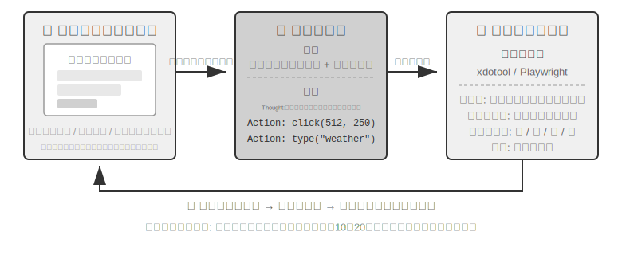


このループには 3 つの鍵となる設計次元があります。**行動空間**（Agent がどんな操作を実行できるか）、**視覚グラウンディング**（スクリーンショットの中でいかに目標要素を見つけるか）、そして **モデルアーキテクチャ**（スクリーンショットからいかに正しい動作を生成するか）です。

### 行動空間の設計

Anthropic は完全な対話能力を構成する 3 種類のツールを定義しています（図9-8）。


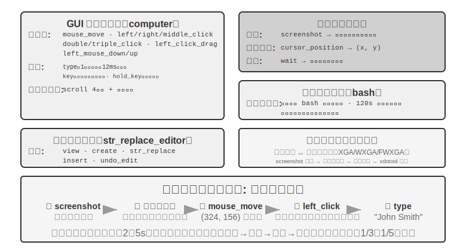


**GUI 操作ツール**（computer tool）：マウス操作には移動（mouse_move）、左／右／中ボタンのクリック、ダブル／トリプルクリック、ドラッグ（left_click_drag）、そしてより細かい押下／解放（left_mouse_down/up）が含まれます。スクロール（scroll）は 4 方向をサポートし、修飾キーと組み合わせられます。キーボード操作には一字ずつの入力（type、各文字の間隔 12ms で本物のタイピングを模す）、組み合わせキー（key、Ctrl+C など）、長押し（hold_key）が含まれます。知覚動作：スクリーンショット（screenshot）、カーソル位置の取得（cursor_position）、待機（wait）。

**コマンド実行ツール**（bash tool）：持続的な bash ターミナルセッションを提供し、120 秒のタイムアウトで、番兵文字列によってコマンドの実行完了を検出し、複数回の呼び出しの間で環境の状態を保ちます（あるディレクトリに cd した後、次の呼び出しでもそのディレクトリにいる、など）。

**ファイル編集ツール**（str_replace_editor）：文字列マッチングによって安全な編集を実現し、閲覧、作成、置換、挿入、取り消しの操作をサポートします。ファイル全体を直接上書きするより正確で、他の内容を誤って書き換えにくくなります。

> **実験 9-6 ★：Anthropic の Computer Use Demo を実行する**
>
> コンテナには完全な Ubuntu デスクトップ環境（ブラウザ、ターミナルなどの常用ツールを含む）がパッケージされています。フロントエンドがタスク指示を受け取り、バックエンドが指示とスクリーンショットを Claude に送り、モデルが操作指示（マウスを動かす、クリックする、文字を入力する、など）を返し、実行層が仮想デスクトップ内で実行します。
>
> 鍵となる観察：各動作の間隔は 2〜5 秒（人間より著しく遅い）ですが、よくあるタスクに対しては良好な計画能力を示し、自律的に合理的な操作の並びへと分解できます。
>

### 視覚グラウンディング（Grounding）

ループの各ラウンドで、モデルはスクリーンショットの中で目標要素を正確に特定する必要があります――「検索ボックスはどこか?」「送信ボタンの座標は何か?」。これが視覚グラウンディング（Grounding）の問題です。現在、主に **2 つの大きな考え方** があります。一つはグラウンディングを **選択問題** に変えるもの――先にインターフェースの要素に番号を振っておき、モデルはその中から一つ選ぶだけです。もう一つは **純粋な座標予測** ――モデルに人間のように直接スクリーンショットを「見て」座標を報告させます。そのうち選択問題の考え方にはさらに 2 つの実装方式があります。**純視覚アノテーション**（オリジナルの Set-of-Mark、セグメンテーションモデルでピクセル上に候補領域を切り出す）と **構造化要素インデックス**（DOM/Accessibility Tree、インターフェースが備える構造を直接読み取る）です。選択問題の考え方の共通の利点は、開放的な「スクリーンショットの中でボタンを見つけて座標を予測する」を、閉じた「アノテーション済みの要素から一つ選ぶ」へと変えることです――試験で選択問題が穴埋め問題より正解しやすいのと同じで、モデルは「画面左上のやや右、約 200 ピクセルの箇所の青いボタンをクリック」ではなく「[123] をクリック」と言えばよいのです。

**Set-of-Mark：視覚アノテーション法。**

オリジナルの Set-of-Mark（SoM）は 2023 年にマイクロソフトリサーチが提案したもので、当初は GPT-4V の視覚グラウンディング能力を引き出すためのものでした。それは **純視覚** の手法です。画像セグメンテーションモデル（SAM、SEEM など）でスクリーンショット上に候補領域を自動で切り出し、各領域に番号マーカーを重ねます。モデルが見るのは番号付きの画像で、番号を報告するだけでよく、システムが対応する領域の中心座標へ換算します。全過程で DOM を必要とせず、いかなるインターフェース内部の構造も必要としないため、ネイティブのデスクトップソフトウェアやゲームのインターフェースにも同様に適用できます――セグメンテーションモデルが候補領域を切り出せさえすれば。

**構造化要素インデックス：SoM の思想を Web 上で構造化して実装したもの。**

インターフェース自体が構造化された情報を提供できるとき、アノテーションはより精確に行えます。現代のウェブページはレンダリング前にすでに完全な要素構造（DOM ツリー）と意味的な役割（どれがボタンで、どれが入力ボックスか）を定義しています。無障害インターフェース（Accessibility Tree）は多くのデスクトップアプリに類似の情報を提供します。セグメンテーションモデルにピクセルの中で「どの領域がボタンか」を当てさせるより、インターフェース自体に「クリックできる要素は何があるか?」と直接尋ねるほうがよいのです。browser-use プロジェクトに代表される Web Agent の方式はまさにこうしています。DOM から対話可能な要素を列挙して番号を振るもので、SoM の思想を Web 上で構造化して実装したものと見なせます（図9-9）。流れは 4 ステップに分かれます。

1. ブラウザのデバッグインターフェース（CDP、Chrome DevTools Protocol）を通じてウェブページの構造化表現（DOM ツリー）と無障害情報を取得する
2. どの要素が対話可能か（ボタン、入力ボックス、リンクなど）を自動で検出する
3. 各対話可能要素に一意の ID を振り、スクリーンショット上に境界ボックスを描く
4. 同時に、各 ID に対応する要素を記述したテキストリストを生成する

```
Screenshot: [画像中の主要な要素に [1]、[2]、[3]、[4] などの ID が付されている]

Elements:
[1] <input type="text" placeholder="Search" aria-label="Search" />
[2] <button id="submit-btn" aria-label="Submit form" />
[3] <input type="text" placeholder="Enter your name" value="" />
[4] <a href="/docs" aria-label="Documentation" />
```

モデルは ID 番号を一つ出力するだけでよく、システムがその要素の中心座標を使って自動でクリックを実行します。この種の方式はトークンを節約しません（すべてのアノテーション情報をモデルに送る必要があるため）が、グラウンディングは正確で安定しており、しかもセグメンテーションモデルが持ち込みうる見落としと誤検出も避けられます。


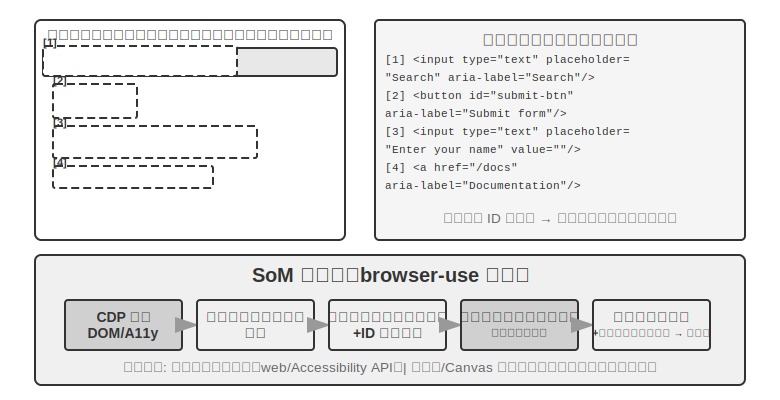

**純粋な座標予測。**

第 3 の路線はいかなるアノテーションもせず、モデルに直接座標を出力させます。**SeeClick** と Claude の computer use に代表されます。膨大な GUI スクリーンショットと要素位置のペアデータで視覚モデルを訓練し、自然言語の記述（「送信ボタンをクリック」など）をスクリーンショット中の精確な座標へ直接マッピングすることを学ばせます――人間のユーザーと同じように、純粋に「見る」ことだけでクリックすべき位置を見つけるのです。

座標予測の方式では、モデルの座標理解は訓練時に使った解像度に強く依存します（図9-10）。Claude は訓練に XGA（1024x768）、WXGA（1280x800）、FWXGA（1366x768）を使っており、入力するスクリーンショットの解像度が合わないと、モデルが予測する座標は系統的にずれます――小さな地図で距離を測って、それをそのまま大きな地図に使うようなものです。したがって、ツール層で双方向の座標スケーリング機構を実装する必要があり、しかも **アスペクト比で目標解像度を選ぶ** 必要があります。非等比の引き伸ばしで画面が歪み、それにつれて座標判断までずれてしまうのを避けるためです。たとえば、実際の画面解像度が 2560×1440（16:9）なら、Claude がサポートする 3 段の中からアスペクト比が同じく 16:9 に近い目標を選ぶべきです――FWXGA（1366×768）が最も合致します。スクリーンショット時に画面を等比で 1366×768 に縮小してモデルに入れ、モデルがクリック座標 (683, 384) を出力したら、実際の座標 (683×2560/1366, 384×1440/768) ≈ (1280, 720) へと逆マッピングします。逆に、無理やり 16:9 を 4:3 の 1024×768 に引き伸ばすと、画面は横方向に押し潰され、モデルが予測する座標は系統的にずれます。


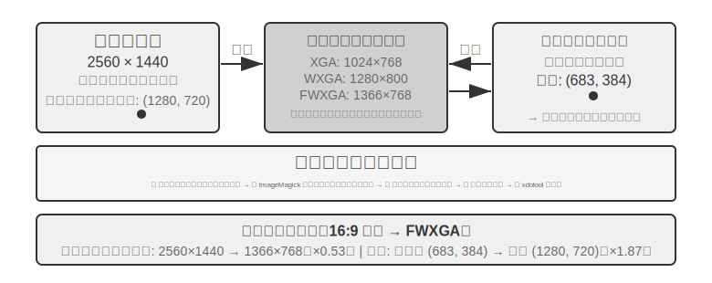


3 つの路線の選択のロジックはこうまとめられます。**構造化情報が得られるときは DOM/Accessibility Tree のインデックスを優先する**、グラウンディングが最も精確で安定します。**得られないとき**（Photoshop のようなネイティブのデスクトップソフトウェア、Canvas/WebGL でレンダリングされたインターフェース、ゲーム）は、**視覚アノテーション（オリジナルの SoM 路線）を使ってもよいし、座標予測を使ってもよい**。視覚アノテーションはグラウンディングを選択問題に変え、専門的な訓練を受けていない汎用モデルにより親切です。座標予測はアノテーションのステップを省き、GUI グラウンディングの訓練を受けたモデルにより直接的です。両者とも、小さな要素や密集したインターフェースでの精度には依然として差があります。

> **実験 9-7 ★：browser-use で自動ブラウザ操作を実現する**
>
> Playwright ブラウザ自動化フレームワーク（コードでブラウザを制御するツールライブラリ）をベースに、マルチモーダル大規模モデルを組み合わせて自然言語駆動のブラウザ操作を実現します。SoM の可視化モードを有効にし、各意思決定の前にアノテーションボックス付きのスクリーンショットを保存します。
>
> テストタスク「Google を開いてサンフランシスコの天気を調べる」：システム起動後、スクリーンショットに Google 検索ページが表示され、すべての対話可能要素が赤い境界ボックスと ID 番号でアノテーションされる（アドレスバー `[1]`、検索ボックス `[2]`、検索ボタン `[3]`、「I'm Feeling Lucky」ボタン `[4]` など）→ モデルが分析して `[2]`（検索ボックス）をクリック → 検索ボックスがフォーカスを得たら「San Francisco weather today」を入力 → `[3]`（検索ボタン）をクリック → ページが検索結果へ遷移し、新しいスクリーンショットで天気カード内の要素をアノテーションし、モデルが気温、天気状況などの情報を認識・抽出する。全過程で 5 ステップの操作、約 20 秒で完了します。

### アニメーションを見て、音を聞ける Computer Use Agent

ここまで、Computer Use の知覚はすべて一つの暗黙の前提の上に築かれてきました。**画面は静止している** ――一枚撮り、一歩考え、一度クリックし、また次の一枚を撮る。しかし現実の画面は動画を流し、一瞬で消える通知をポップアップし、会議中の人の声を再生します。3〜5 秒に一度しか目を開けず、しかも耳をまったく持たない Agent は、これらの「2 フレームの間に起きたこと」を見ることも聞くこともできません。画面録画を見る、会議についていく、音声の合図を聞く、一瞬で消えるダイアログに対応する――この一連の日常的なパソコン操作は、今日の Computer Use Agent にとってほぼ禁区です。

ここで本当に再設計されるべきは「動作インターフェース」ではなく「**観察インターフェース**」です[^ch9-9]。中核の発想は、**観察**（連続的、適応的、マルチモーダル）を **動作**（離散的）から分離し、環境と任意の既製の Computer Use モデルの間に挟む、再訓練不要の知覚ミドルウェア（Agent-パソコン観察インターフェース、AOI と呼べます）に仕立てることです。それには「必要に応じて水門を開く」3 つの部品があります。その一、**フレーム間キーフレーム捕捉** ――まず極めて安価なピクセルゲートでほとんど変化のない画面を飛ばし、次に小さなモデルで画面に意味ある変化が生じたかを判断し、変化したときだけ一フレームを撮ります。静止画面ではほぼゼロコストです。その二、**音量ゲート制御の音声書き起こし** ――音があるときだけ音声認識を呼び出し、Agent に初めて「耳を生やさせ」ます。その三、そして最も鍵となるのが、**画面を持続的な文字へと語り起こす** ことです――モデルに捕捉したフレームを一文に記述させ（「たった今ポップアップした通知は、リリース日が 4 月 28 日に変わったと言っている」）、そして **元の画像が後でコンテキストから片づけられても、この文字は記憶に残り続け**、動的な情報をテキストのかたちで先へと携えていきます。

一つの反直感的な発見はこうです。本当に効くのは「どのフレームを選ぶか」ではなく「**フレームを長く保存できる文字へと語り起こす**」ことなのです――文字こそが LLM Agent の最も得意とするモダリティです。7B から最先端規模までの 8 つのモデルで、このミドルウェアはいかなる再訓練も要さずに +17 から +48 パーセントポイントの向上をもたらし、そのうち音声類のタスクの差が最も甚だしいものでした。この知覚を加えると、Agent はもともと「聞こえるのに動けなかった」音声タスクをすべてやり遂げられるようになります。ただしそれは万能の固定構成ではありません――より新しい一部のモデルでは、画像トークンを詰め込みすぎるとかえって推論を圧迫し、性能を落とすので、これらの部品は **モデルごとに一つずつ選ぶ** べきであり、一挙に全開にすべきではありません。これは前掲の Set-of-Mark と座標予測のトレードオフと同じ理屈です。知覚の方式に銀の弾丸はなく、モデルの気質に合わせて構成しなければなりません。

[^ch9-9]: ゲート制御キーフレーム、必要に応じた書き起こし、フレームを持続的な文字へ語り起こすというこの 3 つの部品、その完全な機構とモデルごとのアブレーションは Li, Bojie and Noah Shi. *Agent-Computer Observation Interfaces Enable Dynamic Computer Use.* arXiv:2606.29472, 2026 を参照。

### モバイル端末：技術よりもエコシステムの壁が難しい

Computer Use はモバイル端末へも広がっています。モバイル端末とデスクトップは技術的に確かに差異があります。行動空間はもはや「マウス座標 + キーボード」ではなく、システムの無障害サービス API（Android の AccessibilityService など）に接続してインターフェースの要素を読み取り、クリックとテキスト入力を下ろすものになります。対話方式もマウスポインタからタッチジェスチャに変わり、座標の意味もそれにつれて変わります――同じ (x, y) が指のシングルタップなのか、長押しなのか、それともスワイプジェスチャの起点なのか、それを画定するには追加のジェスチャ種別が必要です。第 6 章で紹介した AndroidWorld などのモバイル端末ベンチマークは、まさにこうした行動空間の上で、Agent が実際のアプリのタスクを完遂する能力を評価します。

しかしモバイル端末を本当に行き詰まらせるのは、しばしばこれらの技術的差異ではなく、エコシステムの壁です。かつてスマートフォンメーカーが、コンシューマー向けスマートフォンに AI アシスタントを統合し、WeChat、淘宝（タオバオ）、支付宝（アリペイ）などの日常アプリを自動操作させようと試みましたが、すぐにプラットフォームの制限に遭いました。

これは Computer Use が直面する独特の挑戦、すなわち **エコシステムの壁** を露わにします。締め出しの背後にある根本原因は、ビジネスモデルの衝突です。従来のインターネットアプリの中核的な収益化ロジックは **トラフィックとアテンション** です。ユーザーはフィードをスクロールしながら広告を見、商品を検索しながらレコメンドアルゴリズムの誘導に従い、ページを閲覧しながら衝動買いをします。ところが Agent がユーザーに代わって操作すると、この収益化の連鎖は完全に迂回されます。AI は広告に注目せず、衝動買いもせず、目標へまっすぐ向かってタスクを終えたら去っていきます。広告とトラフィックで収益化するプラットフォームにとって、Agent の一つ一つの操作はそのビジネスモデルの根幹を侵食しているのです。

これは、Computer Use が直面するのが CAPTCHA（認証コード）などの技術レベルの対抗だけでなく、より根本的には **構造的な利害の衝突** であることを意味します。この矛盾は短期的には調停しがたく、Computer Use のコンシューマー向け場面での実装は、純粋な技術問題よりも厄介な挑戦に直面することになります。

### リアルタイム性：いまだ解決されていない中核の挑戦

**OSWorld**（第 6 章でその評価方法論を詳しく紹介しました）は広く使われている Computer Use の評価ベンチマークで、実際の Ubuntu/Windows/macOS 環境で Agent がアプリをまたぐタスクを完遂する能力をテストします。初期の汎用モデルはこのベンチマークで成功率が 2 割程度しかありませんでしたが、その後の専用モデルとより強い汎用モデルが精度を押し上げ続け、本書執筆時点ではすでに徐々に人間の水準に近づいています。しかし精度は終点からはほど遠いのです――本当のボトルネックはすでに「正しくできるか」から「速くできるか」へと移りました。

**OSWorld-Human** の効率研究は、胸に刺さる事実を明らかにしました。タスクが最終的に成功しても、Agent が同じタスクを完遂するのに要する操作ステップは依然として人間より明らかに多く、しかも各ステップの推論遅延はタスクが進むにつれて増え続けます――コンテキストが長いほどモデルの意思決定は遅くなり、後半のステップの所要時間はしばしば前半をはるかに上回ります。人間なら数十秒で終わる文書の書式調整を、Agent は数分もかけてようやく片づけることがあります。**精度が人間の水準に達しても実用と同義ではない――効率こそが真のボトルネックなのです。**

効率問題の根源は音声の場面と似ています。直列の「スクリーンショット-思考-クリック」ループでは、各工程を極限まで最適化しても、一歩ずつ累積する遅延はやはり受け入れがたいのです。より深層の問題はこうです。現在の Computer Use はまったく「先を見越して考える」ことをしません。もし Agent が現在の動作を実行すると同時に次に何をすべきかを予測できれば――たとえばページの読み込みを待つ間に次にどこをクリックするか考えておければ――思考と実行の時間を重ね合わせ、総遅延を大幅に下げられます（これはまさに本章前半の音声の場面での「考えながら話す」、および第 4 章の「持続的な思考」式の非同期 Agent と同じ要求で、ここでは「考えながら操作する」に置き換わっただけです）。

音声の領域と異なるのは、Computer Use 自身のリアルタイム性――「スクリーンショット-思考-クリック」というこのループそのものを速くすること――には、現在まだ系統的な解決策がなく、依然としてフレームごとのスクリーンショットの離散的なループにとどまっている点です。しかしそれを迂回する一つの考え方はすでに走り抜けられており、使っているのはまさに本章で繰り返し登場する速い-遅いの分離です。遅いパソコン操作 Agent を速くするのが難しいなら、**ユーザーにそれをただ待たせなければよい** のです。「話す」と「パソコンを操作する」を速いと遅いの 2 セットのモデルに分けて並行して動かします[^ch9-10]――小さなモデル（速い）がリアルタイム音声対話を担い、最先端の VLM（遅い）がブラウザで一歩ずつ操作し、両者の間はきわめて簡素な「純テキストの契約」だけで意思疎通します。遅い Agent は操作のたびに、刻々と更新される状態要約を一文添え（「フォームに記入中で、あなたの生年月日がまだ必要です」）、速い Agent はそれに基づいてリアルタイムにユーザーへ答え、ユーザーが口頭で示した新しい情報を遅い Agent へ伝達し、しかも **状態要約が完了を確認するまで、速い Agent は決して「済みました」と言ってはいけません**。これはまさに「一方で電話をかけて話しながら、他方でパソコンを自分で操作させる」場面です。実験では、この分離によって音声応答は「単一モデルが操作しながら話す」より約 15 倍速くなり（中央値の遅延 0.58 秒 vs 8.64 秒）、しかもタスク成功率は下がりませんでした。ひとたびその速いと遅いの間のテキスト経路を抜き取ると、成功率は即座に 0 に崩れます――ユーザーが口頭で示した鍵となる情報が、二度とブラウザへ伝わらなくなるからです。これは前掲の Latent Bridge、そして音声の場面での「考えながら話す」と同じ 1 セットの考え方です。ある工程が生来遅いなら、別の速い工程にユーザーの待ち時間を埋めさせる――ただその「純テキストの契約」は、本質的には本書が第 2 章から今まで論じてきた Agent ステータスバーにほかなりません。Computer Use のループそのものの高速化は、なお次の重要な研究方向かもしれませんが、「速い-遅いの分離で『遅い』を隠す」ことは、すでに使える一つの答えなのです。

[^ch9-10]: 音声-操作の速い-遅い分離と「純テキストの契約」の完全な設計は Li, Bojie and Noah Shi. *Talking While Acting: Real-Time Voice for Slow Computer-Use Agents.* 2026（発表予定）を参照。

## ロボット操作：リアルタイム制御から訓練と汎化へ

> **読書のヒント**：本節ではロボット制御を論じます。実験 9-10 はシミュレーションから現実への転移手法を示します――そのうち **シミュレーション訓練の部分（第 3〜4 ステップ）は純粋な GPU サーバー上で完結でき**、ハードウェアは不要です。ただしパイプライン全体をエンドツーエンドで再現する（実機デプロイのいくつかのステップを含む）には、SO100 ロボットアームなどの実際のハードウェアが必要です。ロボット分野に今のところ関心がなければ、本節を飛ばしても他の章の読書に影響しません。

音声 Agent は聴覚モダリティで遅延に向き合い、Computer Use は視覚モダリティで遅延に向き合いますが、Agent が物理世界のロボットを制御する必要があるとき、遅延とマルチモーダルの挑戦はさらに拡大されます――動作の結果は不可逆で、一度の衝突で物体やロボット自身を損なうことがあります。本節ではまず、ロボットがいかに二層アーキテクチャと動作分割でリアルタイム制御の問題を抑え込むかを見て、その流れで、目下より硬い難題――訓練と汎化――へと移ります。データをどう得るか、モデルをどうタスクをまたぎ、プラットフォームをまたいで転移させるか。

### ハードウェアはボトルネックではなく、アルゴリズムこそがボトルネックだ

ロボットは汎用の開放場面でまだ広く応用されていませんが、ボトルネックは結局ハードウェアにあるのか、アルゴリズムにあるのか。XLeRobot プロジェクトは有力な反証を示しました。コスト 1000 ドル未満の双腕車輪型ロボットが、人間が VR ヘッドセットで遠隔操縦（テレオペレーション）するとき、すでに大量の家庭タスクを流暢に完遂できるのです。より複雑な、器用な手を要する家庭タスクも、Unitree のロボットは人間のテレオペレーションのもとで流暢に完遂できます。テレオペレーションの遅延はおよそ 100〜200ms で、すでに物理的な対話の応答要求に近づいています。センサーの解像度、アクチュエーターの精度、制御周波数（ロボットが毎秒動作指令を更新する回数。周波数が低いほど動きは滑らかでなくなり、ブレや目標軌道からの逸脱が生じやすくなる）は、現在の低コストプラットフォームですでに実用タスクを支えるのに十分です。

この論断には境界を引いておく必要があります。テレオペレーションの反証が本当に示せるのは、「既存の低コストハードウェアに人間の知能を加えれば、**この種の視覚フィードバックを主とする家庭操作タスク** を完遂するのに十分だ」ということです。それはハードウェアがすべての次元で合格していることを意味しません――触覚センシングの欠如、器用な手の信頼性とコストは、今なお公認のハードウェア上の短所です。ひとたびタスクが精密な力制御と触覚フィードバックに大きく依存すれば、ハードウェアが必ずしもボトルネックでないとは言えません。したがって以下で言う「ハードウェアはボトルネックではない」は、いずれも本節で論じるこの種のタスクの範囲に限定されます。

この種のタスクに関して言えば、真の隔たりはアルゴリズムの層にあります。以下の 2 つの小節でそれぞれ展開します。

> **実験 9-8 ★：XLeRobot のテレオペレーション体験**
>
> XLeRobot はキーボード、Xbox コントローラー、Switch Joycon、VR ヘッドセットなど複数のテレオペレーション方式をサポートします。自ら手でロボットを操縦して物を取る、置く、拭くなどのタスクを完遂し、応答遅延、運動精度、タスク完遂の品質を観察して、ハードウェアの能力の境界に対する直感的な認識を築きます――自ら体験してみれば、人間が操縦するときロボットは何でもできると分かり、現在のボトルネックが確かにハードウェアではなくアルゴリズムであることが分かります。[^ch9-1]
>
> [^ch9-1]: XLeRobot, “Teleop 文档” . https://xlerobot.readthedocs.io/en/latest/software/getting_started/XLeRobot_teleop.html

### 二層アーキテクチャ：計画と制御の分離

ロボットが複雑な家庭タスクを完遂するには、2 つの異なる時間スケールで意思決定する必要があります。第一層は比較的遅い **長期計画**（long-horizon planning）です。「キッチンをきれいに掃除する」のような高レベルの指示を子目標の並び（台を片づける、食洗機に入れる、表面を拭く）へと分解するもので、環境の意味を理解し、タスクの依存関係を推論し、多段の行動方針を計画する必要があります――人が手をつける前にまず「何を先に、何を後にするか」を考えるのと同じです。第二層は比較的速い **VLA 制御**（Vision-Language-Action、視覚-言語-行動モデル）です。個々の具体的な操作（「流しの前まで歩く」「布巾を取る」「台を拭く」）を実行するもので、現在見ている画面と言語指示に応じて制御信号を出力し続け、ロボットの動作を滑らかに連続させます。

この二層アーキテクチャは複雑さを効果的に分離します。長期計画は「何をするか」を担い、VLA 制御は「どうするか」を担います。この「高レベルの遅い意思決定 + 低レベルの速い実行」という二層アーキテクチャは、前掲の音声の場面での「速い・遅い思考」と構造上きわめて似ています――いずれも複雑な思考とリアルタイム応答を異なるモジュールへ分離しています。注意を促しておくと、ここでの「計画／制御」が対応するのは、速い・遅い思考のうち「遅い深い思考／速いリアルタイム応答」というこの次元の分離であって、方式三 MPS の「構想脳／表現脳」のような「思考／表現」の分離ではありません――後者が分けるのは「考える」と「話す」であり、前者が分けるのは「全局を謀る」と「リアルタイムに実行する」で、2 つの「二 X アーキテクチャ」が切り分ける次元は同じではありません。

もっともリアルタイム性は忽然と消えたわけではなく、VLA 制御層へと押し下げられ、**動作分割**（Action Chunking、後述の「VLA 制御」の節を参照）によって薄められます。モデルは一度の推論で未来の一小段の動作の並びを生成し、制御スレッドが高い周波数で再生し、一度の推論の遅延をその一段の動作の実行時間の中へ薄めます。しかしここには避けて通れないトレードオフがあります――分割は反応性を滑らかさと引き換えにするものです。ブロックが長いほど、一度の推論の遅延は薄く分散され、動きはより連続しますが、モデルはこの間、新しい画面を「見られず」、突発的な変化（物体が動かされる、誰かが手で遮る）にもより鈍くなります。リアルタイム性と滑らかさの間のこのトレードオフは、二層アーキテクチャが消したのではなく、ただ転移させただけの部分です。

ここで本章の主線の一つの転換も述べておく必要があります。ロボットの場面では、リアルタイム性の矛盾はすでに二層分離と動作分割で部分的に緩和されており、現在の主要な矛盾は **訓練と汎化** へと移りました――いかに十分な実演データを得るか、いかにモデルをタスクをまたぎプラットフォームをまたいで汎化させるか。続くいくつかの小節は、まさにこの新しい矛盾をめぐって展開します。これは第 6 章のシミュレーション環境と第 7 章の強化学習の主題が物理世界へと延伸したものでもあります。

そしてこの新しい矛盾は主に VLA 制御層にのしかかります。VLA は「VLM + 動作出力」と見なせます。**VLM**（Vision-Language Model、視覚-言語モデル――画像と文字を同時に理解できる大規模モデル）が「見て理解する」と「考えて整理する」を担い、VLA はその上でさらに「手を動かす」必要があり、真の挑戦はまさにこの「手を動かす」層にあります。現在の VLA 制御層は主に模倣学習（行動クローニング）で訓練されます――大量の人間の実演から「何を見たら何をするか」を直接学ぶもので（OpenVLA、RT-2、π₀ などがいずれもこの類です）、強化学習は近年その上に加わった補助的手段です。強化学習で訓練された VLA は単一のタスクではよい性能を示せますが、しばしば汎化能力が不足します。第 7 章の SimpleVLA-RL が LIBERO で高い単一タスクの結果を報告したとしても、それは各タスクを個別に RL 訓練したものであって、一つの統一モデルがすべてのタスクへゼロショットで汎化したものではありません。この「一つのタスクにつき一度訓練する」というモードは、新しいタスクに出くわすたびにデータを集め直し、訓練し直さねばならないことを意味します。

以下の 2 つの節で、それぞれ長期計画と VLA 制御の具体的な技術方式を掘り下げます。

### 長期計画：VLM から専用の身体化思考モデルへ

汎用 VLM はすでにまずまずの身体化思考能力を備えています。Google DeepMind の **Gemini Robotics-ER 1.5** は身体化思考（Embodied Reasoning、すなわち物理世界における物体の位置、運動、因果関係を理解すること）に特化して最適化されており、15 の学術ベンチマーク（Point-Bench、RefSpatial、RoboSpatial、BLINK など）で平均 62.8% を記録し、GPT-4o（60.6%）と Gemini 2.5 Pro（59.3%）を上回りました。中核の優位には、高度な空間理解と物体の位置特定、時系列推論（「このカップを押し倒したらどうなるか」という類の動作の因果を予測する）、タスクのオーケストレーション（高レベルの指示を小さなステップへ分解する）が含まれ、思考（thinking）機構とツール呼び出しをネイティブにサポートします。[^ch9-2]

[^ch9-2]: Google DeepMind, “Gemini Robotics-ER 1.5” . https://deepmind.google/models/gemini-robotics/gemini-robotics-er/

> **実験 9-9 ★★：Gemini Robotics-ER 1.5 で XLeRobot の自律ナビゲーションを駆動する**
>
> RoboCrew ライブラリを通じて Gemini Robotics-ER 1.5 を長期計画モデルとし、カメラ画像に角度目盛りのアノテーションを重ねます。システムは 3 つの単純なツール（前進、左折、右折）だけを提供します。タスク「キッチンを見つけてそこへ歩く」を与えると、モデルは 0.5〜1Hz の周波数で意思決定します。廊下、部屋のドア、家具などの視覚特徴を認識し、「キッチンは左側かもしれない」と判断すれば左折を実行し、「前方に冷蔵庫がある」のを見れば前進を続けます。さらに音声制御モード（ウェイクワードで新しいタスクをトリガーする）へ拡張することもできます。この実験は、長期計画層における VLM の能力の境界を明らかにします。空間推論とタスク分解はすでにまずまずできていますが、複雑な環境でのロバスト性と多段推論の一貫性には、なお改善の余地があります。[^ch9-3]
>
> [^ch9-3]: XLeRobot, “LLM Agent 控制” . https://xlerobot.readthedocs.io/en/latest/software/getting_started/LLM_agent.html

### VLA 制御：実演データから身体をまたぐ汎化へ

二層アーキテクチャの実行層では、RT-2、OpenVLA、π₀ という 3 つの代表的モデルがいずれも VLA 制御――すなわちカメラの画面と言語指示に応じてリアルタイムにロボットの動作を出力すること（図9-11）――に専心しています。それらは動作表現の点で 2 つの路線に分かれます。離散的な動作トークンと、連続的な軌道生成です。


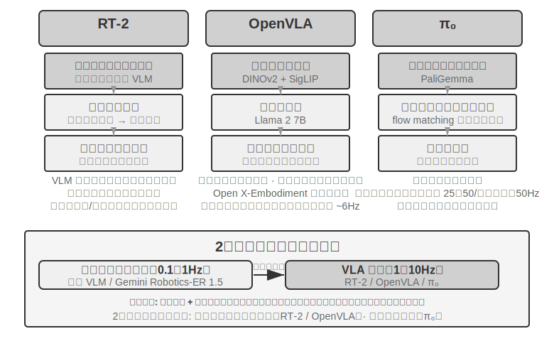


**RT-2 と OpenVLA：離散的な動作トークンの路線。**

**RT-2** はこの路線を切り開きました。大規模な視覚-言語モデルの上で直接ファインチューニングし、ロボットの連続的な動作をトークンへと離散化し、テキストを生成するように一つずつ自己回帰的に出力し、事前学習済みモデルの汎化能力を借りて、新しい物体と新しい指示へのゼロショット転移の効果を高めます。**OpenVLA** は RT-2 の動作表現の方式を受け継ぎ、言語モデルと視覚エンコーダーを一つのアーキテクチャに統一し、画像と文字の指示を入力とし、動作トークンを出力します。訓練は 2 段階に分かれます。まず大規模なプラットフォーム横断データセット Open X-Embodiment（20 種類以上のロボットプラットフォームの実際の操作実演を含む）で事前学習し、汎用的な操作知識（「つかむ」「置く」などの動作パターンは異なるロボットの間で相通じる）を学び、次に特定のプラットフォーム向けに少量のデータでファインチューニングします。動作表現が本質的に同じである以上、両者の真の違いは開放性とエンジニアリング上の選択にあります。RT-2 とその訓練データは Google 内部のものですが、OpenVLA は完全にオープンソースです――オープンソースの骨格モデル（Llama 2 に視覚エンコーダーを加えたもの）に公開データセットを組み合わせ、コミュニティ全体が初めてそれをベースに再現・改良できるようにしました。

**動作分割：VLA 領域に共通の周波数補償技術。**

LLM の推論には遅延があるため、VLA の制御周波数は従来のロボット制御の要求よりはるかに低いのです（従来のロボット制御は通常 50〜1000Hz の制御周波数を要求しますが、VLA の一度の推論は約 1〜10Hz しかありません――差は 2 桁に達します）。オリジナルの OpenVLA はまさにこの問題の典型です。それは一度の推論で一つの動作しか出力せず（約 6Hz の単一ステップの自己回帰予測）、動作のカクつきこそが、それが非難される主な短所でした。**動作分割**（Action Chunking）は、まさにこの差を埋めるために生まれた汎用技術です――最初は ACT（Zhao et al., 2023）が提案し、後に π₀、OpenVLA-OFT などに広く採用されました。モデルは一度の推論で一つの動作だけを出力するのではなく、一気に未来の一小段の時間の動作の並びを生成し（π₀ の典型的な構成を例にとると、一度に約 0.5〜1 秒の動作ブロック、50Hz の制御周波数では 25〜50 個の動作を生成します）、制御スレッドが高い周波数で順に実行し、同時にモデルはバックグラウンドで非同期に次のバッチを生成します。モデルの推論時間がこのバッチの動作の実行時間より短くさえあれば、ロボットは連続した滑らかな運動を保てます――動画のバッファリングのように、後の内容を前もって読み込んでおけば、再生がカクつかないのと同じです。

**π₀：連続的な軌道生成の路線。**

動作表現の真の分かれ目は、RT-2 と OpenVLA の間にあるのではなく、**離散的なトークンと連続的な軌道生成** の間にあります。**π₀** は後者の路線を代表します。離散的な動作トークンを一つずつ予測するのではなく、flow matching（フローマッチング、拡散モデルと同根の連続生成手法）を使い、ランダムノイズから出発して多段の反復で「ノイズ除去」し、滑らかで連続した動作軌道を直接生成します。この表現は動作分割と生来相性がよく、器用な操作など動作の精度と滑らかさへの要求が高いタスクでより良い性能を示します。たとえて言えば、離散的なトークンの路線はメニューから「左へ 5 度」「前へ 3 センチ」と一歩ずつ選ぶようなもので、連続的な軌道の路線は画家がまず一本の曲線全体を描き、それから一筆ずつ修正して仕上げるようなものです。

### Sim2Real Transfer：シミュレーションから現実への隔たり

第 6 章のシミュレーション環境の節で、sim-to-real gap（現実との差）の由来、およびドメインランダム化（domain randomization）がそれに対処する原理はすでに明らかにしたので、ここでは繰り返しません――一言でまとめれば、シミュレーションは真の物理・視覚・ハードウェア特性を完全には再現できないので、訓練時にこれらのパラメータを大きな範囲でランダムに掻き乱し、方策にあらゆる変化に対して安定な汎用表現を学び出させるよう迫るのです（図9-12）。以下ではこの原理が実際のロボットアーム上でどう実装されるかだけを見ます。


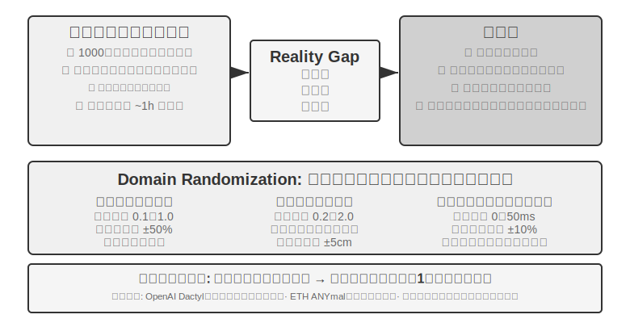


この路線にはすでに少なからぬ成功例があります。OpenAI のロボットハンドによる器用な操作（Dactyl プロジェクトは手内での立方体の再配向を実現し、その後続の仕事では自動ドメインランダム化 ADR を用いて片手でのルービックキューブ解法を実現しました）や、ETH Zurich の ANYmal（四足ロボットが雪原、砂利などの複雑な野外地形をロバストに歩行する）が、いずれもこれに当たります。

本章で本当に補うべきは、ドメインランダム化を実機に落とし込む際に避けて通れない 2 つのエンジニアリング上の工程です。その一は **ランダム化範囲の較正** です。範囲は当てずっぽうで決めてはいけません。狭すぎれば真の変化をカバーできず、広すぎれば訓練の難度が増して「何にでも対応できるが何も精密でない」次善の方策を学び出してしまいます。実践では通常、まず実際の環境のデータから鍵となるパラメータの分布（摩擦係数、モーターの応答遅延の真の分布など）を **実測して較正** し、その範囲内でサンプリングします。シミュレーション訓練の方策が実機で明らかに性能を落とすようなら、ランダム化範囲を徐々に広げ、sim-to-real gap が許容できるところまで収束させます。その二は **視覚の整合** です。シミュレーションと現実のカメラの位置姿勢を精確に較正し（環境の整合）、実際に撮影した背景をシミュレーションのレンダリングへランダムに差し替え（greenscreen 背景差し替え）、シミュレーションの画面をできるだけ実機が見るものに近づけます――この 2 ステップは実験 9-10 で具体的に実演します。

> **実験 9-10 ★★★：RGB に基づくゼロショット Sim2Real ロボットアーム把持**
>
> LeRobot + ManiSkill シミュレーターを使い、RGB カメラ画像だけで（深度センサーや力センサーに依存せず）訓練し、それからゼロショット（いかなる追加調整もせず）で実際の SO100 ロボットアームへ直接デプロイします。5 ステップの流れです。
>
> 1. **環境の整合**：シミュレーションと実際の環境のカメラ位置を調整し、可視化の重ね合わせで両側の画像が整合できることを検証する
> 2. **背景差し替え**（greenscreen）：実際の環境で撮った背景画像をランダムに切り取ってシミュレーションのレンダリングへ重ね、シミュレーションの画面の背景をより実際に近づける
> 3. **Domain randomization**：ロボットの色、物体のテクスチャ、照明条件、カメラの画角などのパラメータをランダム化する
> 4. **RL 訓練**：PPO アルゴリズムを使い、大規模並列のシミュレーション環境で、シミュレーション中の成功率が >90% になるまで訓練する
> 5. **実機デプロイ**：実際のロボット上でゼロショットで直接、把持タスクを成功させる
>
> 成功の鍵となる要素：精確な環境の整合 + 視覚ドメインランダム化 + 物理パラメータランダム化、この 3 つは一つも欠けてはなりません。限界：実際の物体の形状、大きさ、材質が訓練分布を超えると、成功率は著しく下がります。[^ch9-6]
>
> [^ch9-6]: LeRobot, “Sim2Real 教程” . https://github.com/StoneT2000/lerobot-sim2real/blob/main/docs/zero_shot_rgb_sim2real.md
>
>
> 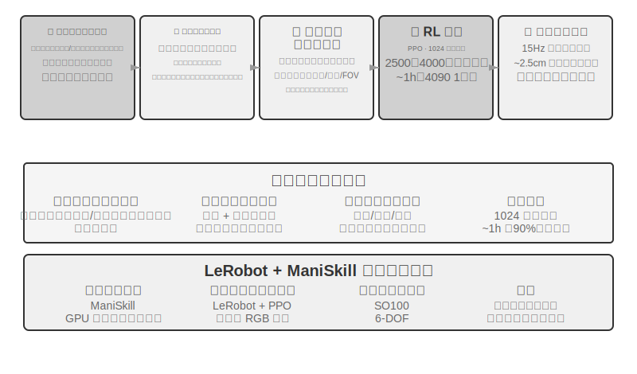
>

## 本章のまとめ

3 つの場面は表面上の差異は甚だしいものの、遅延とマルチモーダルというこの 2 つの難関は常に影のように付きまといます。音声はすでに、直列パイプラインからエンドツーエンドと全二重へ、分離した速い・遅い思考から「考えながら話す」へという進化の道を歩み抜きました。Computer Use は OSWorld などのベンチマークでの精度がすでに人間の水準に近づいていますが、操作ステップが人間より明らかに多く、ステップの所要時間がタスクの進行につれて増え続ける効率の差には、まだ系統的な解法がありません。ロボットは視覚フィードバックを主とする操作タスクにおいて、ボトルネックがすでにハードウェアから VLA 制御層のタスク横断汎化能力へと移りました（触覚、器用な手などは依然として未攻略のハードウェア上の短所です）。次章では視点を複数の Agent 間の協調へと引き上げます。それはまた別の次元の挑戦です。

## 演習問題

1. ★★ 音声 Agent のエンドツーエンドモデルは ASR-LLM-TTS を単一のモデルに統合し、遅延を下げた一方でモジュール性を失いました。もしエンドツーエンドモデルがある工程（音声認識など）で誤ると、デバッグと修復は直列パイプラインよりはるかに困難です。あなたならエンドツーエンド音声 Agent の可観測性（observability）システムをどう設計しますか?
2. ★ Step-Audio R1 は MPS デュアルブレイン・アーキテクチャによって「考えながら話す」を実現しました。しかし人間は「考えながら話す」とき、しばしば熟慮を経ていないことを口にしたり、自己訂正したり、フィラーを使ったりします。Agent の「考えながら話す」は、人間のこれらの特徴を模倣すべきでしょうか?
3. ★★ SoM（Set-of-Mark）とその構造化変種（DOM 要素インデックス）は、Computer Use の視覚グラウンディングを開放的な座標予測から閉じた ID 選択へと変えましたが、いずれもまずインターフェースの要素を検出してアノテーションする必要があります――セグメンテーションモデルに頼るにせよ、DOM に頼るにせよ。もしインターフェースが非標準のコントロールや動的に変化する要素を含んでいれば、アノテーションは不完全または不正確になりかねません。この場合、座標予測へフォールバックすべきでしょうか?
4. ★★ XLeRobot などの千ドル級のロボットプラットフォームは、テレオペレーションによるデータ収集を安価にしました。しかしテレオペレーションデータの品質は、操作者の技能に大きく依存します。不慣れな操作者が提供したデータは、VLA モデルの訓練にどう影響するでしょうか? データ収集の段階で、いかにして低品質なデータを自動で選り分けますか?
5. ★★★ 本章は音声、Computer Use、ロボットという 3 種類の対話形態をカバーしました。この 3 種類の形態の共通の趨勢は、直列パイプラインからエンドツーエンドモデルへと進化することです。もしこの趨勢が続くなら、5 年後の Agent の対話層はどんな姿になるでしょうか?
6. ★★★ 現在の Computer Use は「スクリーンショット → 動作 → スクリーンショット」という離散的なループで動作し、各観察は一枚の静止フレームです。しかし人間の画面に対する知覚は連続的です――私たちはアニメーションの再生を見、読み込みの進捗を観察し、動画の内容を理解できます。これは、今日の Computer Use が時系列的な視覚理解を要するタスクを根本的に処理できないことを意味します。連続的な視覚ストリームの理解を支えるには、知覚層をどう再設計すればよいでしょうか?
7. ★★ DOM/Accessibility Tree の要素インデックスは標準的な Web アプリでは効果が著しいのですが、ますます多くのソフトウェアインターフェース（Canvas/WebGL レンダリング、プラットフォーム横断の自前描画コントロール）はアクセス可能な構造化情報を提供せず、視覚アノテーションか座標予測に頼るしかありません。あなたは Computer Use が純視覚の路線に賭けるべきだと考えますか、それとも構造化と視覚の 2 つの経路を同時に維持すべきだと考えますか? 2 つの経路を維持するコストと便益は、それぞれ何でしょうか?
8. ★★ VLA モデルは動作分割（action chunking）を採用しています――本文で述べたとおり、π₀ の典型的な構成は 50Hz の周波数での未来の 25〜50 個の動作を一度に生成するもので――推論の遅延を実行時間の中に隠します。しかしもし実行の過程で環境が急変すれば（物体が動かされるなど）、事前に生成した動作の並びは無効になります。動作分割の効率上の優位と、環境変化への応答速度の間で、いかにバランスを取りますか?
9. ★★★ 本章の 3 つの場面（音声、Computer Use、ロボット）はいずれも「知覚-思考-行動」ループの遅延問題に直面し、いずれも速い・遅い思考の並行化の方向へ進化しています。音声の場面では、これは「言い間違えたら訂正する」と表れ、Computer Use の場面では「先にクリックしてから見る」と表れ、ロボットの場面では「一歩進んでは様子を見る」と表れます。これらの速い思考に基づく行動が、取り返しのつかない結果を招かないことを、いかにして保証しますか?