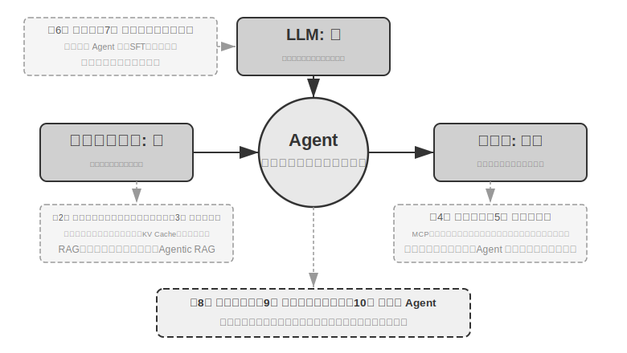
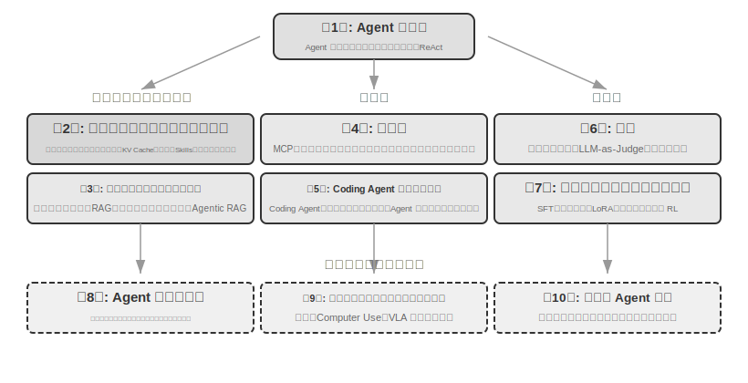

# はじめに {.unnumbered}

2025 年 8 月から 10 月にかけて、私は図霊（Turing）の「AI Agent 実戦キャンプ」で一連の技術講義を行いました。講義の当初の狙いはシンプルでした。AI エージェントの設計を「感覚駆動」から「原則駆動」へと変えること。すなわち、単にデモを動かせるように教えるのではなく、なぜエージェントをこのように設計するのか、一つひとつのアーキテクチャ上の判断の背後にあるトレードオフは何かを深く理解することです。本書は、それらの講義の原稿と実験を整理・拡張してまとめたものです。

特筆すべきは、本書が最初のアイデアから最終的な完成に至るまで、それ自体が **whisper coding**（口述式の協働）とでも呼べる方法で作られた点です。そして私が口述に使ったのは、まさに私たち Pine 自身の音声エージェントでした。講義の準備をするたびに、私はまず大まかなアウトラインを口述して調査（survey）をさせ、初稿を整理させました。講義後は、AI Agent 実戦キャンプの受講生からのフィードバックを踏まえ、それと繰り返し議論し、磨きをかけました。こうして反復を重ね、最終的にこれらの原稿を拡張・編成して今日のこの本にしたのです。この過程を通じて、私はほとんどの場合タイプはせず、考えを口述して伝えていました。音声の帯域はタイプよりもはるかに高く（通常の会話速度はタイピングのおよそ 4 倍）、「口述―調査―議論―修正」のループはそのぶん速く回りました。ある意味で、本書はエージェントについて語る本であると同時に、エージェントが関わって作り上げた作品でもあるのです。

2025 年初めの DeepSeek R1 のリリース以降、AI 分野は単なる基盤モデル（すなわち汎用の大規模言語モデルの土台）の進化から、エンジニアリング実装という深水域へと入りました。モデル層の進展は 2 つの方向から見て取れます。一方では、モデルはエージェント環境における強化学習（Agentic Reinforcement Learning）を通じてツール呼び出し能力をモデルパラメータの中に訓練し込み、プログラミング（coding）、数学、グラフィカルインターフェース操作（computer use）などの領域で汎用的な能力を身につけました。モデルのイテレーション速度もますます速くなり、GPT-5.2 から GPT-5.5、Claude Opus 4.5 から 4.8 まで、いずれもわずか半年しか経っていません。プロダクト層では Manus、Claude Code、OpenClaw などの汎用エージェントが人間とコンピュータのインタラクションのあり方を再定義し、「コード生成 + ファイルシステム」というアーキテクチャのパラダイムを主流の視野に押し上げました。

1 年近く前に講義でまとめたエージェントのアーキテクチャ設計原則を振り返ってみると、私を安堵させると同時に驚かせる発見がありました。**これらの原則は時代遅れになるどころか、ますます古典的なものになっていた** のです。エージェント業界にはその後 Skill、harness、loop engineering といった新しい用語が次々と登場しましたが、実際の順序はまさに逆でした。Anthropic のような企業が先にこれらの概念を発明し、多くのエージェントがそれに追随したのではありません。むしろ、多くのエージェントがとうにそうしていたところに、Anthropic がそれらを抽出し、アーキテクチャ設計原則として総括したのです。実践が先、命名が後です。

これらの原則の裏付けは、エージェントを長い工程と高いリスクを伴う場面に実際に投入した実戦から来ています。Pine AI のチーフサイエンティストとして、私とチームは Pine を作り上げました。私の知る限り、それは自律的に生身の人間とやり取りし、金銭が絡む機微で複雑かつ長丁場のタスクを信頼性高く独立して処理できる、最初の汎用エージェントです。ユーザーに代わって通信事業者と料金交渉の電話をかけ、業者と返金やクレームの交渉をし、サブスクリプションを解約する。その全過程で人間の引き継ぎを必要としません。この種のタスクは往々にして数十ラウンドの交渉に及び、一歩でも誤れば実際の金銭的損失を招きます。まさにこの、信頼性に対するほとんど過酷なまでの要求こそが、本書が繰り返し強調するアーキテクチャ原則を一つひとつ引き出したのです。以下のいくつかの例は、この実践から来ています。

- Skill という概念が流行するよりずっと前から、私たちはプロンプトの動的読み込みという方法でプロンプトの無限膨張という問題を解決し、コマンドラインでツールを実行する方式でツールリストの無限膨張という問題を解決し、システムステータスバー技術でエージェントが実行環境やユーザーの時刻・作業状態などを認識できないという問題を解決していました。
- harness という概念が流行するよりずっと前から、私たちは Claude Code に似た方法でモデルのツール呼び出しの不安定さ、ハルシネーション、危険な操作、権限逸脱の操作、指示不遵守などの問題を解決していました。
- loop engineering という概念が流行するよりずっと前から（この用語が業界で抽出・命名されたのは 2026 年半ばになってからです）、私たちは本書で提案者・審査者（proposer-reviewer）と呼ぶ方法を用いて、モデルがタスクを早々に完了したと思い込む問題を解決していました。これには、一つの道が行き詰まると「できません」と宣言する早すぎる諦めもあれば、ループを閉じ切らないうちに「対応済み」と称する偽の成功もあります。この方法の核心は、エージェントに自らが出力した成果物（artifact）を精査させて反復的に改善させ、モデル自身の感覚ではなく検証によってタスクがいつ終わるかを決めさせることです。

しかもこれは私たちの独自の発明ではありません。私の知る限り、大半の一流モデル・エージェント企業は、自力で似たような方法を手探りで編み出しています。これこそが、私が 2025 年 8 月に図霊で「AI Agent 実戦キャンプ」を開講し、2024〜2026 年にわたって国科大（中国科学院大学）で AI Agent 実践講座を継続して開講している理由です。私がこの本を、閉じ込めて印税を取るのではなくオープンソースで公開することを選んだのも、これらの知識をより多くの実務者に広めたいという思いからです。

**実践が先、命名が後**。この順序は、エンタープライズ級のエージェント開発に対してきわめて実際的な含意を持ちます。**もしあなたが毎回、業界で何らかのエージェント用語が流行し始めるのを待ってから実践するのなら、すでに一歩遅れているのです。** 用語が流行する頃には、一流企業はたいてい対応する問題をとうに一度通り抜けています。では、用語が流行する前にどうすればやるべきことが分かるのでしょうか。最も重要なのは 2 点だと私は考えます。

**第一に、エージェントの能力上限に対してきわめて高い要求を持つ本物の事業を持ち、本物の事業フィードバックを継続的に得られること。** Pine を例に取ると、一件を処理するのに数時間、時には数週間かかり、その過程で複数の利害関係者と繰り返し折衝しなければならないこともあります。その間、何時間も電話をかけ、パソコン上で操作して何ページもの複雑なフォームを記入し、さらに何通ものメールをやり取りすることもあります。全過程を通じて、どんな数字も間違えられず、なおかつコミュニケーションでは常に慎重さを保ち、ユーザーの利益を守らなければなりません。このように十分に複雑な場面に身を置いてはじめて、実践は自然とあなたを harness の構築へと駆り立て、モデル自体が今はまだできないが事業上は必ず達成しなければならないことを解決させるのです。逆に、事業が能力上限に高い要求を持たず、モデルが少し進化すれば十分だというのなら、これらのアーキテクチャ原則を磨き上げる動機も生まれません。

**第二に、評価（Evaluation）の仕組みを確立しなければならないこと。** これも本書が繰り返し強調する点です。評価なくして進歩なし。評価によって、ある変更が本当に良くなったのか、それとも単なる運なのかを見分けられるようになり、エージェントのイテレーションの方向が直感に頼らなくて済むようになります。突き詰めれば、私たちが主張しているのは、科学的な方法論でエンジニアリングを、エージェントを行うということであり、評価はまさにこの方法論の土台なのです。第 6 章では、この方法論を専門に展開します。

基盤となるモデルがどう進化しようと、プロダクトの形態がどう革新されようと、ほとんどすべての成功したエージェントシステムは同じアーキテクチャパターンに従っています。これは偶然ではありません。**良い設計原則は本来、モデルのイテレーションサイクルを貫くべきもの** なのです。なぜなら、それらが記述しているのは特定のモデルの使い方ではなく、知的システムが世界と相互作用する基本的なパターンだからです。

チューリング賞受賞者であり強化学習の父である Richard Sutton はかつて、宇宙の進化は塵から恒星へ、恒星から生命へ、生命から知的エージェント（原文では「設計された実体」、designed entities）へという 4 つの段階を経てきたと述べました。生物進化は盲目的です。ランダムな変異、自然選択。ほとんどの生物は自らの動作原理を理解しておらず、自律的に生物を設計・改造することもできません。ところが知的エージェント（Agent）は、宇宙の進化史における全く新しい存在です。それはコードを生成することで自己ブートストラップ（bootstrap）と自己進化を実現できます。あるプログラマーが別のプログラマーを書き、その新しいプログラマーがさらに次を書き続けられるようにです。つまり、エージェントは自身の動作メカニズムを理解し、目標に応じて全く新しい知的エージェントを創り出し、さらには自らを改良することさえできるのです。本書の使命は、あなたがこの創造の原則を理解し習得する手助けをすることにあります。

本書の核となる公式はたった一言です。**Agent = LLM + コンテキスト + ツール**。この三者は一つでも欠けてはなりません。

より直感的に言えば、**脳 + 目 + 手足** です。脳（LLM）は思考と意思決定を担い、目（コンテキスト）はエージェントがどんな情報を見られるかを決め、手足（ツール）はエージェントが何をできるかを決めます。（厳密には「目」はあくまで大まかな比喩です。コンテキストは環境情報や対話履歴だけでなく、ツール定義などの内容も含みます。つまりエージェントが「見ている」情報には「どんな手足が使えるか」も含まれているのです。この比喩が伝えようとしているのは、コンテキストとはモデルが感知できるすべての情報である、という核心的な直感です。）

強化学習に馴染みのある読者にとって、この三者は RL の形式的な言語にも対応づけられます。具体的には、LLM は Policy（方策）に、コンテキストは Observation Space（観測空間）に、ツールは Action Space（行動空間）に対応します。3 つの言い方は同じ対象に対応しており、表現の階層が異なるだけです。

とはいえ、これら 3 つの語それぞれの意味は字面よりもはるかに豊かです。第 1 章では実践の観点から一つずつ分解し、直感的な理解から学術的な概念までの完全な対応づけを築いていきます。

## 本書の構成 {.unnumbered}

本書は全 10 章、3 つの部分に分かれています（図0-1、図0-2）。第 1 章は基礎で、エージェントに対する全体的な認識を築きます。第 2〜7 章は 3 本の柱を順に展開します。コンテキスト（第 2〜3 章）、ツール（第 4〜5 章）、そしてモデル（第 6〜7 章、評価とポストトレーニング）です。第 8〜10 章は発展と応用で、エージェントの自己進化、マルチモーダルとリアルタイム対話、そしてマルチエージェント協調を示します。

- **第 1 章（Agent の基礎知識）** は複数の実在するエージェント製品を導入として、エージェントに対する直感的な理解を築きます。エージェントの核となる公式を深く解析します。実装層の LLM + コンテキスト + ツールから、直感層の脳 + 目 + 手足へ、さらに学術層の方策（Policy）、観測空間（Observation Space）、行動空間（Action Space）へと。同時に実験を通じて ReAct ループの動作メカニズム、すなわち「思考→行動→観察」の反復過程を解剖し、エージェントの 3 つの学習パラダイム、すなわちポストトレーニング（Post-training）、文脈内学習（In-Context Learning）、外部化学習（Externalized Learning）を紹介します。最後にワークフローから自律エージェントまでのオーケストレーション設計パターンを論じ、以降の章のための統一された概念枠組みを築きます。
- **第 2 章（コンテキストエンジニアリング）** は本書で最も重要な章であり、コンテキスト、すなわちエージェントの「目」を体系的に解説します。本章はまず API のメッセージ構造とエージェントの核となるループから説き起こし、「コンテキストとはメッセージのリストである」という土台を築いた上で、KV Cache（大規模モデルの推論過程で過去の計算結果を再利用する仕組み）の基礎原理へと踏み込みます。続いて順に、プロンプトエンジニアリング（Prompt Engineering、フロー化設計、ツール記述、業務ルールの精緻化を含む）とプロンプトインジェクション（Prompt Injection）の攻防、Agent Skills のオンデマンド読み込みの仕組み、エージェントのステータスバー技術、そしてコンテキスト圧縮（Context Compression）の戦略を展開します。各用語の完全な定義は、本文で初出の箇所に示します。
- **第 3 章（ユーザーメモリと知識ベース）** はコンテキスト管理を、セッションをまたいで永続化する知識体系へと拡張し、エージェントが現在の対話の内容を記憶するだけでなく、複数回の対話をまたいで知識を蓄積・呼び出せるようにします。ユーザーメモリの 4 つの漸進的な戦略、RAG（検索拡張生成、すなわちまず関連文書を検索してからモデルに回答を生成させる手法）の完全な技術スタック（さまざまなテキスト検索手法や検索結果の並べ替え最適化を含む）、マルチモーダルな情報抽出、より高度な知識の組織化手法、そしてエージェント化された RAG（Agentic RAG、すなわちエージェント自身にいつ・何を検索するかを判断させる手法）を扱います。
- **第 4 章（ツール）** はエージェントと外界とをつなぐ架け橋を論じます。ツールはエージェントの「手足」のようなもので、Web を検索し、API を呼び出し、データベースを操作するなどのことを可能にします。MCP のツール相互運用標準と 5 種類のツールの設計原則（知覚、実行、協調、イベントトリガー、ユーザーとのコミュニケーション）を紹介し、実行ツールのセキュリティ機構とイベント駆動の非同期エージェントアーキテクチャを重点的に述べます。
- **第 5 章（Coding Agent とコード生成）** は、Coding Agent にファイルシステムを加えたものが、あらゆる汎用エージェントの最も核となる技術基盤であることを論証します。OpenClaw のアーキテクチャを主軸として、Coding Agent のワークフローと実装のコツを解剖し、コード生成がプログラミングを超えて持つ幅広い価値を示します。思考の補助、知識ベースの構築から、新しいツールの動的な創造やエージェントの自己ブートストラップまで。
- **第 6 章（Agent の評価）** は科学的な評価方法論を構築します。評価環境（ツール呼び出し型と人間・機械インタラクション型という 2 つの核となるパラダイム、および章末で個別に論じるシミュレーション環境）、データセットの設計原則、LLM-as-a-Judge による自動評価手法、評価駆動のモデル選定、そして評価結果をシステム改善へと転化する完全な閉ループを扱います。
- **第 7 章（モデルのポストトレーニング）** は SFT（教師ありファインチューニング、すなわちラベル付きデータでモデルに「見様見真似」を教える手法）と RL（強化学習、すなわちモデルに試行錯誤と報酬フィードバックを通じて自律的に向上させる手法）という 2 つのポストトレーニング技術を深掘りします。「SFT は記憶、RL は汎化」および「データと環境はアルゴリズムより重要」を核となる論点として、事前学習/SFT/RL の 3 段階の全景、古典的な RL 理論、報酬信号の設計（二値報酬からプロセス報酬へ、さらに「結果に報酬を与え、プロセスを制約する」検証経路のペナルティへ）、シングルターンとマルチターンの強化学習アルゴリズム、そしてサンプル効率の最適化などの最先端の探求を扱います。
- **第 8 章（Agent の自己進化）** は、モデルの重みを変更しないという前提の下で、いかにエージェントを継続的に強くするかを論じます。2 大進化経路は、経験から学ぶこと（方策の要約、ワークフローの記録、システムプロンプトの自動最適化、Skills による知識の外部化）と、能動的にツールを発見し創造すること（MCP-Zero、オープンソースツールの統合、コードによる新しいツールの創造）です。
- **第 9 章（マルチモーダルとリアルタイム対話）** は、エージェントがテキストの世界から物理世界へと歩み出す姿を展望します。音声エージェント（直列パイプラインからエンドツーエンドモデルまで）、Computer Use（エージェントに人間のようにグラフィカルインターフェースを操作させる）、ロボット操作（VLA（視覚・言語・行動モデル）による制御と Sim2Real 転移）を扱い、マルチモーダル性とリアルタイム性がもたらす共通のアーキテクチャ上の課題を明らかにします。
- **第 10 章（マルチ Agent 協調）** は、AI エージェントシステムの究極の形態、すなわち複数のエージェントがいかに分業・協力するかを論じます。マルチエージェント協調の分類枠組み（コンテキストの共有/独立 × 対等/管理者/分散）を体系的に述べ、翻訳エージェント、電話+パソコンエージェントなどの事例を通じて協調アーキテクチャの設計手法を示し、エージェント社会とエージェント経済という最先端の方向を展望します。

## 本書の読み方 {.unnumbered}

本書の各章は比較的独立しているため、自分のニーズに応じて異なる読み方を選べます。

- **あなたがエージェント開発者なら**、順番に通読することをおすすめします。第 1〜5 章が核となる知識体系を構成し、第 6 章の評価方法論も同様に飛ばせません。第 7 章はモデルをカスタマイズする必要のある読者向けで、第 8〜10 章は発展的な方向を示します。
- **あなたの時間が限られているなら**、第 1 章（全体的な認識を築く）と第 2 章（最も重要なコンテキストエンジニアリングを習得する）を優先してください。第 2 章の KV Cache の基礎原理はやや技術的なので、初読では原理の部分を飛ばし、冒頭で示す 3 つの核となる結論だけを覚えておいても、その後の理解には影響しません。
- **あなたがモデルの訓練に関心があるなら**、第 7 章（モデルのポストトレーニング）を直接読んでも構いません。ただし評価手法（第 6 章）は訓練の前提なので併せて読むことをおすすめします。また全体的な認識を築くため、先に第 1〜2 章を読んでおくとよいでしょう。

各章には大量の **実験** と **演習問題** が含まれ、番号は「実験 X-Y」（X は章番号、Y は章内の通し番号）の形式です。実験と演習問題のタイトルには星の数で難易度を示しています。★ は入門レベルですべての読者に適し、★★ は中程度の難易度で一定のエンジニアリング実践の基礎を要し、★★★ は発展的な挑戦で、通常は開放的な問題や複雑なシステム設計を伴います。大部分の実験には完全な実行可能コードが付属し、付属のオープンソースリポジトリに整理されています。

> **付属コードリポジトリ**：[https://github.com/bojieli/ai-agent-book](https://github.com/bojieli/ai-agent-book)

リポジトリ内のプロジェクト名は本書の実験と一対一に対応しており、各プロジェクトには完全な実行手順と依存関係の設定が含まれています。これらの実験は、ぜひ自分の手で一度動かしてみることを強くおすすめします。AI エージェントはきわめて実践的な分野であり、設計上の直感の多くは、実際に手を動かしてデバッグする過程を通じてはじめて本当に身につくものです。

## 前提知識 {.unnumbered}

本書は一定の技術的背景を持つ読者を対象としていますが、特定の分野の専門家であることは求めません。以下では「必須」と「推奨」の 2 つのレベルに分けて前提知識を挙げ、自分の準備の程度を測る助けとします。

**必須：本書全体を読むための基礎**

- **Python プログラミング**：本書のほぼすべての実験は Python に基づいています。Python の基本的な文法、よく使うデータ構造、パッケージ管理（pip）などの基本概念に馴染んでいる必要があります。熟達している必要はありませんが、中程度の複雑さの Python コードを読んで修正できる程度が望まれます。
- **LLM の基本的な使用経験**：ChatGPT、Claude、あるいは類似の製品を使ったことがあり、「プロンプト（Prompt）→ モデルの返答」という基本的なインタラクションのパターンを理解している必要があります。
- **AI 支援プログラミングツールを 1 つ**：Claude Code、Codex、Cursor、Trae など、少なくとも 1 つの AI 支援プログラミングツールをインストールして慣れておくことを強くおすすめします。一方で、これらのツールは実験の開発効率を大きく高めてくれます。本書の実験は大量のコード記述とデバッグを伴うからです。他方で、これらのプログラミングツール自体が成熟した Coding Agent であり、それらを使う過程で、ReAct ループ、ツール呼び出し、コンテキスト管理など本書が繰り返し論じる核となる仕組みを直感的に体験できます。この一次的な体験は、エージェントの設計原則を理解するうえできわめて価値があります。
- **ソフトウェアエンジニアリングの常識**：コマンドライン操作、Git バージョン管理、JSON データ形式、REST API などの基本概念に馴染んでいること。これらは実験を実行し、エージェントのツール呼び出しの仕組みを理解するための基礎です。

**推奨：特定の章の読書体験を高める**

- **機械学習の基礎**（第 7 章）：訓練と推論、損失関数、勾配降下、過学習などの基本概念を知っていると、モデルのポストトレーニングの理解に役立ちます。
- **基礎数学**（第 2〜3、7 章）：線形代数を直感的に理解していること（たとえばベクトルが方向と大きさを表せる、行列で一括演算ができる、といったこと）は、埋め込みやアテンション機構の理解に役立ちます。基本的な確率統計の知識は、評価指標や強化学習における期待報酬の理解に役立ちます。本書の数学は複雑な導出には立ち入らず、直感的な説明に重点を置いています。
- **Web 開発の基礎**（第 4、9 章）：HTTP、WebSocket、フロントエンドとバックエンドの分離アーキテクチャなどの概念を知っていると、イベント駆動の非同期エージェントアーキテクチャや音声エージェントのリアルタイム通信の実験の理解に役立ちます。
- **Transformer アーキテクチャの基本的な理解**（第 2、7 章）：Transformer は現在ほぼすべての大規模言語モデルの基盤アーキテクチャです。大規模モデルの基礎知識を体系的に補いたい読者には、『図解大模型』（図霊出版）をおすすめします。同書は直感的な図解で Transformer アーキテクチャ、事前学習とファインチューニングなどの核となる概念を解説しており、本書のエージェントエンジニアリングの視点とよく補完し合います。

もし一部の前提知識に不足があっても、それで尻込みする必要はありません。本書の核となる価値は **アーキテクチャ設計原則とエンジニアリング実践の方法論** にあり、特定のアルゴリズムやテクニックにあるのではありません。第 7 章のポストトレーニングを除けば、本書全体は数学や機械学習への要求が非常に低く、出発点として十分に使えます。

エージェント技術はなお急速に進化していますが、**良いアーキテクチャ設計原則は時間を貫く力を持っています**。「なぜこう設計するのか」を身につければ、技術の波の変化の中でも冷静な判断力を保てます。本書があなたの AI エージェント構築の信頼できる指針となることを願っています。

## 謝辞 {.unnumbered}

図霊の夢鴿先生と劉美英先生の労を惜しまぬ編集、そして図霊「AI Agent 実戦キャンプ」の企画・運営に注がれた尽力に感謝します。国科大で AI Agent 実践講座を開講してくださった劉俊明先生にも感謝します。また、図霊「AI Agent 実戦キャンプ」のすべての受講生、そして国科大 AI Agent 実践講座のすべての学生に特に感謝します。これらの講義を行う過程で、皆さんは多くの価値あるフィードバックと提案をくださり、私自身もこれらの概念そのものについてより明晰な理解を得られました。

Pine AI のすべての同僚に感謝します。Pine AI のような優れた製品と、それがもたらす数々の挑戦がなければ、私はエージェント分野でこれほど深い理解と実践を得ることはできなかったでしょう。幾度もの思想のぶつかり合いの中で、同僚たちも多くの貴重な思想的インプットを与えてくれました。

AI 業界の多くの友人たち（ここでは一人ひとりの名は挙げません）にも感謝します。さまざまな業界の議論の中で、皆さんは私の見解に率直なフィードバックをくださり、私の誤った判断を数多く正し、モデルとエージェントに対する私の認識を高めてくれました。

最も感謝すべきは私の家族、とりわけ妻の孟佳穎です。彼女は本書の執筆を終始支えてくれ、さらに本書に対して多くの貴重な意見も寄せてくれました。
