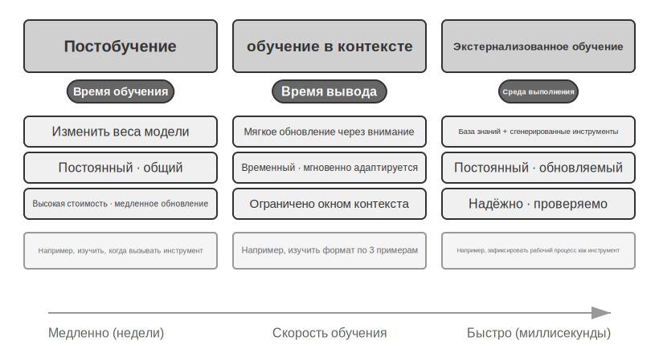
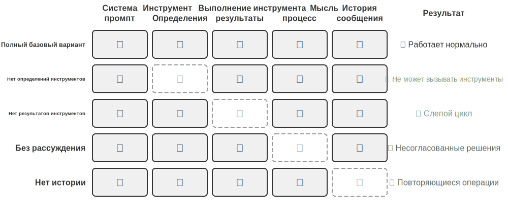
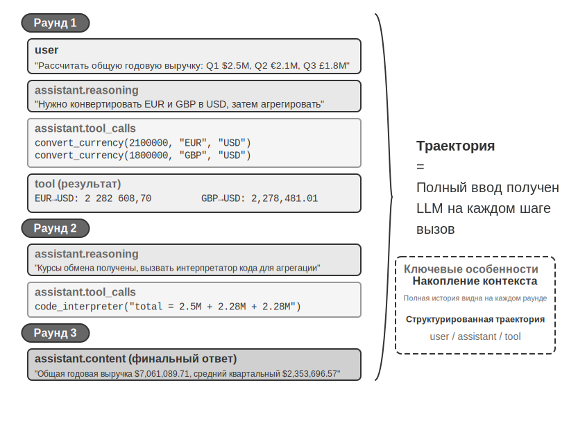
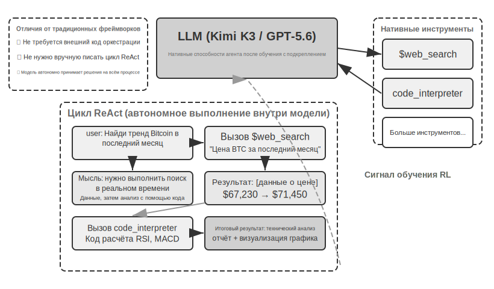
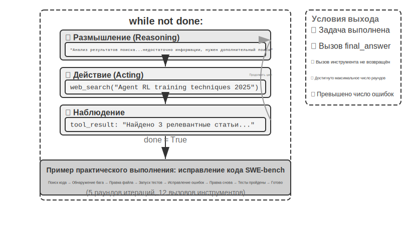

# Введение в ИИ-агенты

Если вы писали код в Cursor и наблюдали, как он ищет по кодовой базе, редактирует несколько файлов и гоняет тесты, пока они не пройдут; если проводили исследование темы с Deep Research и видели, как он раз за разом ищет, читает и в итоге собирает целостный отчёт; если управляли браузером через Manus, чтобы он выполнил за вас онлайн-задачу; если просили мобильного помощника Doubao купить билет или отправить сообщение на телефоне; или если поручали Pine AI позвонить оператору связи и договориться о снижении счёта — значит, вы уже пользовались ИИ-агентами.

Эти продукты выглядят по-разному, но их роднит одно: это уже не пассивный диалог «вы спросили — он ответил», а интеллектуальные системы, которые сами планируют и выполняют шаги, вызывают разнообразные инструменты для решения задачи и по ходу дела корректируют стратегию в зависимости от результатов. ИИ-агенты становятся совершенно новым способом нашего взаимодействия с компьютером.

Эта глава поможет вам понять ключевые составляющие ИИ-агента, отталкиваясь от практики. Мы сразу на деле опробуем возможности современных агентов, разберёмся в архитектурных принципах, лежащих в их основе, и освоим паттерны проектирования и лучшие практики построения агентных систем.

> **Совет по чтению**: эта глава — концептуальная карта всей книги. Она быстро вводит ключевую формулу агента, цикл работы, инженерные рамки и паттерны проектирования, задавая единую терминологию и систему координат для последующих глав. При первом прочтении не нужно запоминать все понятия поштучно — лучше сначала составить общее впечатление; каждая следующая глава подробно раскрывает какой-то один из упомянутых здесь аспектов, и туда всегда можно будет вернуться для сверки.

## Современный агент = LLM + контекст + инструменты

Суть современной агентной системы можно выразить лаконичной формулой: **Агент = LLM (большая языковая модель, Large Language Model) + контекст + инструменты**. Формула проста и удобна, но каждое слово в ней нужно понимать в широком смысле:

- **LLM — это мозг агента**: не просто набор параметров модели, а весь ядро принятия решений агента — понимание намерений, обдумывание и планирование, вынесение суждений. Как человеческий мозг — это не только совокупность нейронов, но и способ мышления, сформированный опытом, так и способности LLM складываются из двух частей: накопленных на этапе **предобучения** знаний о мире и языковых способностей, а также закреплённой на этапе **постобучения** стратегии принятия решений — конкретные технологии последней (такие как дообучение с учителем (SFT) и обучение с подкреплением) будут раскрыты в седьмой главе.
- **Контекст — это глаза агента**: не просто тот кусок текста, который подаётся модели на вход, а вся информация, которую агент видит в каждой точке принятия решения — сведения об окружении, память пользователя, знания предметной области, собственное состояние и ход выполнения задачи. Как человеку для принятия решения нужно ясно видеть текущую ситуацию, вспоминать релевантный опыт и заглядывать в справочные материалы, так и окно контекста агента — это всё, что он видит в данный момент.
- **Инструменты — это руки и ноги агента**: не просто несколько вызываемых функций API, а совокупность всего, что агент способен сделать — от вызова предопределённых инструментов до подгружаемых по требованию специализированных навыков (Skills), от динамической генерации кода для создания новых возможностей до делегирования задач дочерним агентам, от активного общения с пользователем до реакции на внешние события.

Если сказать нагляднее: **Агент = мозг + глаза + руки и ноги**. Мозг отвечает за размышление и принятие решений, глаза дают всю необходимую для размышления информацию, а руки и ноги превращают решения в изменения реального мира.

Эти три компонента как раз соответствуют трём ключевым понятиям RL (подробнее — в седьмой главе). Таблица ниже — **необязательное чтение**: если у вас нет опыта в RL, её можно смело пропустить, это не помешает дальнейшему пониманию; она нужна лишь тем читателям с RL-бэкграундом, чтобы сопоставить уже имеющиеся знания с терминологией книги:

| Интуитивное понимание | Компонент реализации | Академическое понятие (необязательно) | Значение |
|-----------|-----------|----------------------------|----------------------------------------------|
| **Мозг** | LLM | **Политика** (Policy) | Логика принятия решений агента о том, «что делать дальше» — увидев текущую информацию, выбрать из всех возможных действий наиболее подходящее |
| **Глаза** | Контекст | **Пространство наблюдений** (Observation Space) | Вся информация, которую агент может видеть — что он способен увидеть, прочитать, запомнить, к каким системам может обращаться |
| **Руки и ноги** | Инструменты | **Пространство действий** (Action Space) | Совокупность всего, что агент может сделать — какие «средства» ему доступны, от отправки сообщения до выполнения кода и управления интерфейсом |

Понимание роли этих трёх компонентов и их взаимосвязей — основа построения эффективной агентной системы. Начнём с самого конкретного — рук и ног (инструментов), а затем постепенно углубимся к мозгу (LLM) и глазам (контексту). Сначала посмотрим, как разные типы агентов разворачиваются по этим трём измерениям:

| Агентный продукт | Глаза (восприятие) | Руки и ноги (действие) | Политика |
|----------------|----------------------|----------------------------|------------------------------|
| **Кодинг-агенты вроде Cursor** | Документ с требованиями, кодовая база, среда терминала | Открытое (внутреннее обдумывание, поиск по коду, чтение и запись файлов, выполнение команд и т. д.) | Инкрементальная разработка: понять требования → найти релевантный код → отредактировать код → проверить тестами → отладить и исправить |
| **Поисковые агенты вроде Deep Research** | Сетевые ресурсы, академические базы данных, локальные файлы | Открытое (внутреннее обдумывание, поисковые запросы, чтение веб-страниц, генерация резюме) | Итеративное углубление: корректировать направление поиска на основе имеющейся информации, постепенно синтезируя целостный отчёт |
| **Агенты управления компьютером вроде Manus** | Экран компьютера, страницы браузера, файловая система | Открытое (внутреннее обдумывание, клики, ввод, прокрутка, скриншоты, выполнение кода и т. д.) | Визуальное восприятие + действия: наблюдать за экраном → распознать целевой элемент → выполнить действие → проверить результат |
| **Агенты мобильного помощника вроде Doubao** | Экран телефона, установленные приложения | Открытое (внутреннее обдумывание, клики, свайпы, ввод, открытие приложений и т. д.) | Понимание намерения + управление приложениями: понять запрос пользователя → найти нужное приложение → выполнить действие → подтвердить завершение |
| **Агенты личного помощника вроде Pine AI** | Данные аккаунта пользователя, история счетов, база знаний поставщика услуг | Открытое (внутреннее обдумывание, телефонные звонки, отправка писем, заполнение форм, подтверждение с пользователем) | Выполнение многошаговой задачи: собрать информацию → выработать стратегию переговоров → связаться с поставщиком услуг → провести переговоры → отчитаться о результате |

У этих агентных систем есть несколько общих черт: все они используют **открытое пространство действий** — они не выбирают из ограниченного набора кнопок, а способны генерировать произвольный естественный язык и код; все они умеют **внутренне обдумывать** — прежде чем действовать, они думают и планируют; все они способны к **непрерывному взаимодействию** — постоянно корректируя стратегию по обратной связи от окружения. Именно эти способности рождаются из совместной работы мозга, глаз и рук с ногами — то есть LLM, контекста и инструментов.

### Инструменты: руки и ноги агента

Инструменты — это мост между агентом и внешним миром, они, подобно рукам и ногам человека, позволяют агенту превратиться из пассивного наблюдателя в активного исполнителя. Без инструментов агент способен лишь «рассуждать на бумаге»; с инструментами он может по-настоящему менять мир.

Чтобы обсуждать инструменты системно, их можно разбить на пять категорий по направлению взаимодействия агента с внешним миром. Ниже мы быстро пройдёмся по типичным сценариям каждой категории, чтобы составить общее представление, а в последующих главах раскроем их по очереди.

**Инструменты восприятия** дают агенту доступ к информации: поисковые системы предоставляют актуальные сетевые данные, файловая система читает локальные документы, а API и базы данных подключают внешние сервисы и ключевые корпоративные данные.

**Инструменты выполнения** позволяют агенту менять мир: выполнение кода, операции с файлами, системные команды, вызовы внешних API — так решения превращаются в реальные действия.

**Инструменты сотрудничества** позволяют агенту разделять работу с другими агентами: делегировать дочернему агенту специализированную задачу, запрашивать подтверждение человека в ключевых точках принятия решений или координировать действия в мультиагентной системе.

**Инструменты срабатывания события** принципиально отличаются от первых трёх категорий по способу вызова — их вызывает не сам агент, они выступают как внешний вход, запускающий выполнение задачи агентом. Например, приход нового письма, наступление заранее заданного момента времени или Webhook-колбэк от другой системы — такие события активируют агента и запускают его дальнейшее обдумывание и действия. Хотя срабатывание события не инициируется самим агентом, это один из каналов его взаимодействия с внешним миром, поэтому оно относится к системе инструментов в широком смысле.

**Инструменты коммуникации с пользователем** — это канал, через который агент сам устанавливает связь с пользователем и передаёт ему информацию. В отличие от инструментов выполнения, меняющих внешний мир, инструменты коммуникации с пользователем сосредоточены на передаче информации и взаимодействии — через текстовые сообщения, голосовые звонки, письма и другие способы они доносят до пользователя ход выполнения задачи агентом или проявление внимания по его инициативе.

Полная система классификации этих пяти категорий инструментов и принципы их проектирования будут рассмотрены в четвёртой главе. Качество проектирования инструментов напрямую определяет, как далеко сможет зайти агент: если определение интерфейса нечёткое, модель будет применять инструменты как попало; если обработка ошибок недостаточна, стоит инструменту дать сбой — и он превратится во взаимоблокировку для агента; если контроль разрешений слишком широк, то стоит агенту ошибиться — и последствия будет трудно исправить. Распространение стандарта MCP (Model Context Protocol, протокол контекста модели) делает подключение инструментов всё более похожим на установку плагина — экосистема быстро расширяется, но принципы проектирования не устаревают.

**Вызов инструмента** (Tool Calling, также Function Calling) — одна из ключевых способностей современных LLM-агентов, которая позволяет модели структурированным образом вызывать внешние инструменты. Эта способность превращает LLM из чистого генератора текста в интеллектуальную систему, способную выполнять реальные действия. Далее в книге мы будем единообразно использовать термин «вызов инструмента».

Процесс вызова инструмента состоит из четырёх шагов: сначала в контексте модели сообщается, какие инструменты доступны (включая имя, назначение и параметры); затем модель сама решает, нужно ли вызывать инструмент, какой именно и с какими параметрами; далее, после того как инструмент отработал, его результат добавляется в контекст; и наконец, на основе этого модель решает, что делать дальше. Этот цикл и есть основа ReAct, о котором пойдёт речь ниже.

На примере сценария с запросом погоды упрощённое представление четырёх шагов на уровне API выглядит так:

```
Шаг 1: объявление инструментов        Шаг 2: модель решает вызвать
tools: [{                          assistant: {
  name: "get_weather",               tool_calls: [{
  parameters: {                        function: "get_weather",
    city: "string"                     arguments: {city: "Пекин"}
  }                                  }]
}]                                 }

Шаг 3: результат добавлен в контекст   Шаг 4: модель отвечает по результату
tool: {                            assistant: {
  tool_call_id: "call_1",            content: "В Пекине сегодня 28°C, ясно."
  content: '{"temp":28,"sky":"ясно"}'  }
}
```

Разработчику нужно лишь определить инструменты и выполнить вызов инструмента, а решение «вызывать ли, какой именно и с какими параметрами» модель принимает самостоятельно. Во второй главе эта структура API будет разобрана подробно.

Проектируя инструменты для агента, стоит по возможности сохранять их универсальность, оставляя LLM больше пространства для манёвра. Например, вместо специализированного инструмента-калькулятора лучше предоставить интерпретатор кода Python и создать для агента безопасную песочницу для выполнения. Вместо инструмента для ведения рабочего журнала лучше дать инструменты чтения и записи файлов и создать для агента виртуальную файловую систему. Универсальные инструменты позволяют агенту творчески решать задачи, комбинируя базовые возможности.

### LLM: мозг агента

Большая языковая модель (Large Language Model, LLM) — это ядро принятия решений агента. Получив запрос пользователя, она должна сперва разобрать его истинное намерение (то, что говорит пользователь, часто не совпадает с тем, что он на самом деле хочет), а затем разложить размытую или сложную задачу на выполнимые шаги. По ходу выполнения ей приходится постоянно принимать решения: что делать дальше, вызывать ли инструмент, какой именно инструмент и с какими параметрами. Эта способность «понять — спланировать — выполнить» вырастает из знаний, накопленных на этапе предобучения, и служит фундаментом как для рабочих процессов, так и для автономных агентов.

Одна из уникальных способностей LLM-агента — это **внутреннее размышление**: прежде чем предпринять реальное действие, агент может сначала спланировать и мысленно проиграть ситуацию. Этот процесс не меняет внешнюю среду, но заметно повышает качество последующих действий. LLM способна на эффективное внутреннее проигрывание благодаря умениям, приобретённым на этапе предобучения (Pre-training — начальное обучение на огромном массиве интернет-текстов, в ходе которого модель усваивает закономерности языка и знания о мире): при проигрывании модель опирается на логические правила, уже отложившиеся в человеческом знании, — математические законы, причинно-следственные связи, стратегии декомпозиции задач и так далее. Поэтому проигрывание агента — это не слепой случайный поиск, а работа внутри структурированной системы знаний.

Именно способность к такому структурированному проигрыванию позволяет LLM-агенту сразу браться и за совершенно новые задачи — ниже это поясняется через два понятия: zero-shot и few-shot. Прямое проявление этой способности — **обобщение без примеров (zero-shot)** (Zero-shot Generalization): даже столкнувшись с задачей, которую никогда не видел, LLM-агент справляется, комбинируя имеющиеся знания, и не нуждается ни в каких примерах. Например, вы никогда не учили его писать стихотворение о квантовой физике, но он сумеет создать вполне достойное произведение, опираясь на уже имеющиеся знания о языке и физике.

Более того, LLM-агент способен на **адаптацию по нескольким примерам (few-shot)** (Few-shot Adaptation) с помощью крайне малого числа образцов: достаточно дать в промпте два-три примера, и модель освоит новый шаблон задачи. Например, покажите ей несколько примеров вида «отзыв пользователя → метка настроения», и она научится классифицировать настроение новых отзывов. Проще говоря, zero-shot — это «может сделать и без примеров», а few-shot — «научится, посмотрев на несколько примеров».

#### Модель как агент: когда сама модель становится продуктом

Новая парадигма «модель как агент» (Model as Agent) представляет собой самое свежее направление развития ИИ-агентов. Передовые модели через постобучение (особенно через обучение с подкреплением) превращают способность к вызову инструментов во врождённую: когда вызвать инструмент, какой именно и с какими параметрами — всё это модель решает сама, без ручной оркестровки. Но это не значит, что слой фреймворка стал неважным. Наоборот, чем мощнее модель, тем важнее Harness, выстроенный вокруг неё. Слово Harness исходно означает конскую упряжь — поводья и сбрую, надеваемые на лошадь: они нужны не для того, чтобы ограничить её способность бежать, а чтобы направить эту силу в правильную сторону. В контексте агента модель — это та самая мощная, но непредсказуемая лошадь, а Harness — инженерная оболочка, направляющая её способности в надёжное выполнение задач. Можно представить это и как всю систему обеспечения вокруг гонщика: ремни безопасности, отбойники на трассе, команда на пит-стопе. Чем быстрее гонщик (модель), тем важнее эта система. В агенте Harness включает управление контекстом, интерфейсы инструментов, ограничения безопасности, проверку и исправление и другую инфраструктуру (подробнее — в последнем разделе этой главы).

Чем больше пространство для самостоятельных решений модели, тем шире и последствия её ошибок, поэтому для обеспечения надёжности нужны более тонкие механизмы ограничений, проверки и исправления. Настоящее преимущество производителей моделей не в том, чтобы «сделать фреймворк тоньше», а в том, что они могут совместно оптимизировать модель и окружающий её Harness и непрерывно их итерировать.

Но здесь возникает более глубокий вопрос: если модель продолжит усиливаться, не будут ли сегодняшние Harness в итоге «поглощены» моделью? Рич Саттон в «Горьком уроке» (The Bitter Lesson) вспоминает картину, вновь и вновь повторявшуюся за семьдесят лет исследований ИИ[^ch1-1]: исследователи раз за разом кодировали своё понимание предметной области в систему, что давало краткосрочный эффект, но в долгосрочной перспективе неизменно проигрывало универсальным методам, способным масштабироваться вместе с вычислительными ресурсами и объёмом данных, — поиску и обучению. Если судить по этой мерке, какая часть ограничений, проверки и исправления внутри Harness относится к «человеческим априорным знаниям» и обречена быть усвоенной моделью? Позиция этой книги укладывается в восемь слов: **согласны с направлением, прагматичны в темпе**. Что касается направления, книга не сомневается, что модель будет и дальше поглощать Harness: и вызов инструментов, и долгосрочное планирование когда-то опирались на внешнюю оркестрацию, а теперь стали нативными способностями модели. Однако по темпу это «поглощение» происходит куда медленнее, чем подсказывает интуиция: обучение измеряется месяцами, и модель не способна разом усвоить все ограничения и предпочтения реального бизнеса; текущая граница возможностей модели и составляет текущую ценность Harness. Поэтому Harness-инженерия — не сопротивление горькому уроку, а практическое воплощение этого урока в масштабе инженерного времени: то, что модель пока выполняет нестабильно, сначала компенсирует Harness; усваивая очередной слой, модель позволяет Harness снять его и переключиться на страхование нового рубежа возможностей. Эта основная линия проходит через всю книгу: вторая глава даёт прагматичный ответ с точки зрения инженерии контекста, восьмая подробнее рассматривает, как агент на основе опыта эксплуатации выбирает и проверяет следующее обновление системы, а послесловие возвращается к полному ответу на вопрос «поглотит ли модель Harness».

[^ch1-1]: Sutton, Rich. "The Bitter Lesson", 2019. http://www.incompletenessideas.net/IncIdeas/BitterLesson.html

#### Механизмы обучения агента: от контекстной адаптации до персистентных обновлений

Выше мы обсудили, как модель посредством обучения с подкреплением усваивает стратегию вызова инструментов в качестве нативной способности. Однако поведение агента изменяется не только на этапе обучения. В зависимости от места обновления и продолжительности его действия можно выделить три взаимодополняющих пути (рис. 1-1): контекстную адаптацию внутри задачи, обновление внешних артефактов между задачами и обновление параметров в цикле обучения.



**Контекстная адаптация** происходит в рамках текущей задачи. После включения примеров, состояния и результатов поиска в контекст модель может немедленно скорректировать поведение, но это не изменяет персистентное состояние следующей сессии. Преимущества такого подхода — скорость и низкая стоимость; его ограничения определяются окном контекста и способом организации информации. Во второй главе подробно рассматривается механизм этой адаптации.

Чтобы изменения сохранялись между задачами, можно обновлять **внешние артефакты**: оформлять факты и опыт в виде документов знаний, записывать выразимые на естественном языке стратегии в Prompt или Skill, а детерминированные процессы и ограничения — в программы и Harness. Такие артефакты поддаются аудиту и исправлению, однако при выполнении агент по-прежнему должен обращаться к ним через контекст или интерфейсы инструментов. Главы с третьей по пятую закладывают основу для знаний и программ, а восьмая глава рассматривает, как генерировать подобные обновления из уже оценённых траекторий выполнения.

Когда целью являются высокоразмерные способности — например, понимание медицинских изображений, естественный языковой стиль или неявная стратегия принятия решений, — внешние правила трудно выразить исчерпывающе, поэтому требуется постобучение с обновлением **параметров модели**. Развёртывание обновлённых параметров обходится дороже, но обеспечивает естественную и широкую способность к обобщению; методы такого обновления систематически представлены в седьмой главе. Таким образом, три пути — не взаимоисключающие категории, а механизмы, взаимодействующие на разных временных масштабах: контекст отвечает за ситуативную адаптацию, внешние артефакты — за контролируемое накопление, а параметры — за усвоение способностей, которые трудно выразить явно.

### Контекст: глаза агента

Контекст — это вся информация, которую агент видит в каждой точке принятия решения. Как человеку при принятии решения нужно видеть все разложенные на столе материалы — описание задачи, справочные руководства, записи прежней переписки, свежие данные — так и окно контекста агента является его «полем зрения». С точки зрения API (подробнее — во второй главе), контекст при каждом вызове LLM состоит из следующих пяти частей:

- **Системный промпт** (System Prompt): в отличие от промпта, который пользователь вводит каждый раз, системный промпт пишет разработчик, и он остаётся неизменным на протяжении всего диалога — это своего рода «должностная инструкция» агента, определяющая его личность, полномочия и правила поведения. Тщательно проектируя системный промпт с помощью инженерии промптов (Prompt Engineering), мы можем формировать способ работы агента. Системный промпт также включает сохраняемую между сессиями **память пользователя** (персонализированная информация: предпочтения пользователя, история поведения, фоновые настройки и т. д., подробнее — в третьей главе) и динамически внедряемое состояние среды.
- **Определения инструментов** (Tool Definitions): объявляют имена доступных агенту инструментов, описания их функций и формат параметров. Без определений инструментов агент не сможет распознать и вызвать ни один инструмент — это подтвердит абляционное исследование (эксперимент 1-1). Определения инструментов вместе с системным промптом образуют **статический префикс**, неизменный на протяжении диалога (это базовый режим; с 2026 года в производственных фреймворках полная schema инструментов также может по мере необходимости динамически подгружаться в конец контекста, не нарушая префикс, подробнее — в разделе об определениях инструментов второй главы и в четвёртой главе).
- **Сообщения пользователя** (User Messages): ввод от пользователя. В сообщениях пользователя также могут содержаться **внешние знания**, динамически извлечённые через RAG (генерация с дополнением поиском, Retrieval-Augmented Generation, подробнее — в третьей главе) — информация, появившаяся после отсечки обучающих данных, или знания из закрытых предметных областей.
- **Ответы модели** (Assistant Messages): ранее сгенерированные моделью ответы, включающие максимум три части — процесс размышления (`reasoning`, то есть цепочка рассуждений, обеспечивающая связность мышления и объяснимость решений), текстовое содержимое (`content`, то есть ответ пользователю) и запрос на вызов инструмента (`tool_calls`, то есть способ, которым агент совершает действие). В конкретном ответе эти три части не обязательно присутствуют одновременно: например, когда агент решает вызвать инструмент, обычно есть только `reasoning` + `tool_calls`, а когда он даёт итоговый ответ — обычно только `reasoning` + `content`.
- **Результаты выполнения инструментов** (Tool Results): результат, возвращаемый фреймворком агента после выполнения инструмента. Эти результаты служат прямым основанием для следующего шага размышления агента, а также позволяют ему учиться на результатах выполнения и не повторять ошибок.

Первые два элемента (системный промпт + определения инструментов) — это статический префикс, а последние три (сообщения пользователя + ответы модели + результаты выполнения инструментов) — это динамическая история сообщений, непрерывно растущая по мере взаимодействия. Эти пять частей вместе образуют контекст LLM при каждом акте вывода.

Чтобы убедиться, что каждый компонент незаменим, самый прямой способ — это **абляционное исследование** (Ablation Study): подобно тому как врач при диагностике по очереди исключает причины болезни — сначала убираем компонент A и смотрим, работает ли система по-прежнему нормально, затем убираем компонент B, и так далее, чтобы оценить вклад каждого компонента. Эксперимент 1-1 как раз в этой логике систематически протестировал пять описанных выше компонентов, и результаты показывают следующее: без определений инструментов агент полностью теряет способность действовать; при отсутствии результатов выполнения инструментов агент, не видя обратной связи от предыдущего шага, снова и снова вызывает один и тот же инструмент и попадает в бесконечный цикл; стоит лишить ответ модели процесса размышления, как последовательные решения начинают противоречить друг другу; что до истории сообщений — без неё агент словно теряет память, а потому запускает весь процесс задачи с самого начала, повторно выполняя уже завершённые шаги. Роль каждого компонента подкреплена экспериментальными свидетельствами, а не только теоретическим выводом.

### Эксперимент 1-1 ★★: ключевая роль контекста

С помощью систематического **абляционного исследования** (Ablation Study) мы изучили влияние разных компонентов контекста на поведение агента. Для тестирования из пяти описанных выше частей были выбраны четыре компонента — системный промпт как базовое определение личности агента в абляции не участвует, поскольку без системного промпта у агента нет даже базового осознания своей роли, и тестировать его бессмысленно. Как показано на рис. 1-2, пять сравнительных групп эксперимента включают: одну полную базовую группу со всеми компонентами и ещё четыре группы, в каждой из которых отсутствует один компонент, — чтобы пронаблюдать влияние каждого компонента на производительность агента.



Результаты эксперимента раскрывают незаменимую роль каждого компонента контекста. **Определения инструментов** (Tool Definitions, часть статического префикса) — основа способности агента действовать; без них агент не может распознать и вызвать ни один инструмент. **Результаты выполнения инструментов** (Tool Results) — ключ к замкнутому контуру управления; их отсутствие приводит к тому, что агент действует «вслепую» и попадает в бесконечный цикл. **Процесс размышления** (часть reasoning в ответах модели) сохраняет причины прежних решений агента, делает поток мышления более связным и предотвращает взаимно противоречивые решения. **История сообщений** (сообщения пользователя, ответы модели и результаты выполнения инструментов из предыдущих раундов) предотвращает избыточные операции, поддерживает связность выполнения задачи и помогает не повторять одни и те же ошибки.

Ключевой вывод этого эксперимента таков: **контекст определяет то, что агент способен видеть, а агент может принимать решения только на основе того, что он видит**. Как человек с завязанными глазами не может вынести разумного суждения, так и при отсутствии любого из компонентов контекста способность агента к принятию решений серьёзно деградирует: не видя определений инструментов, он не знает, какие инструменты доступны; не видя предыдущих результатов выполнения, он не знает, что уже было сделано.

### Цикл ReAct

Разобравшись с тремя основными компонентами агента, естественно задаться вопросом: как они работают вместе? Цикл ReAct — это и есть ключевой механизм, связывающий LLM, контекст и инструменты в единое целое. Давайте посмотрим, как агент шаг за шагом рассуждает и действует.

Основной режим работы агента при выполнении задач называется **ReAct** (Reasoning + Acting). Хотя в названии отражены только два слова — рассуждение (Reasoning) и действие (Acting), — на деле цикл включает три этапа: модель сначала **рассуждает**, что нужно сделать сейчас, затем вызывает инструмент и **действует**, после чего **наблюдает** возвращённый инструментом результат и продолжает рассуждать о следующем шаге. Этот цикл «подумать → сделать → посмотреть → подумать → сделать → посмотреть» повторяется снова и снова, пока задача не будет выполнена.

Давайте разберём **траекторию** (trajectory) агента на конкретном примере — сведении доходов в нескольких валютах. Траектория — это история сообщений, которая непрерывно накапливается по ходу выполнения задачи агентом: сообщения пользователя, ответы модели (включая процесс рассуждения и вызовы инструментов), результаты выполнения инструментов. При каждом вызове LLM полный контекст, который она получает, состоит из двух частей: **статического префикса** (системный промпт + определения инструментов) и **траектории** (динамической истории сообщений) (рис. 1-3). Отсюда следует ключевой факт: **контекст агента = статический префикс + траектория**. Конкретно: статический префикс соответствует первым двум из пяти упомянутых ранее компонентов (системный промпт + определения инструментов), а траектория — оставшимся трём (сообщения пользователя + ответы модели + результаты выполнения инструментов, растущие по мере взаимодействия). На основе этого полного контекста LLM генерирует ответ для следующего шага, а затем этот ответ снова добавляется в траекторию для использования при следующем вызове.



Давайте разберём структуру траектории агента на псевдокоде:

```
траектория = [
  {role: “user” , content: “По квартальным доходам компании: Q1 2.5M долларов, Q2 2.1M евро, Q3 1.8M фунтов, Q4 380M иен, рассчитай годовой суммарный доход компании и средний квартальный доход” },
  
  # Первая итерация — LLM видит указанную выше траекторию и генерирует ответ
  {role: “assistant” , 
   reasoning: “Нужно перевести все валюты в USD...” ,
   content: “” ,  # Нет прямого ответа пользователю
   tool_calls: [
     {name: “convert_currency” , args: {amount: 2100000, from: “EUR” , to: “USD” }},
     {name: “convert_currency” , args: {amount: 1800000, from: “GBP” , to: “USD” }},
     {name: “convert_currency” , args: {amount: 380000000, from: “JPY” , to: “USD” }}
   ]},
  
  # Фреймворк агента выполняет инструменты и добавляет результаты в траекторию
  {role: “tool” , content: “EUR->USD: 2282608.7” },
  {role: “tool” , content: “GBP->USD: 2278481.01” },
  {role: “tool” , content: “JPY->USD: 2541806.02” },
  
  # Вторая итерация — LLM видит полную траекторию, включая результаты инструментов
  {role: “assistant” ,
   reasoning: “Результаты конвертации получены, теперь нужно свести и рассчитать...” ,
   content: “” ,
   tool_calls: [
     {name: “code_interpreter” , args: {code: “total = 2500000 + 2282608.7 + ...” }}
   ]},
  
  {role: “tool” , content: “Total: $9,602,895.73, Average: $2,400,723.93...” },
  
  # Третья итерация — LLM видит полную траекторию и генерирует итоговый ответ
  {role: “assistant” ,
   reasoning: “Все расчёты завершены, подводим итог...” ,
   content: “FINAL ANSWER: Суммарный доход $9,602,895.73...” }
]
```

Обратите внимание: в траектории не показаны системный промпт и определения инструментов — они выступают статическим префиксом и при каждом вызове LLM автоматически подставляются перед траекторией.

В нашем эксперименте этот цикл проявляется во всей красе. На первом круге агент, проанализировав задачу, параллельно вызывает три инструмента конвертации валют; на втором круге на основе результатов конвертации вызывает интерпретатор кода для сложных вычислений; на третьем круге, убедившись, что все расчёты завершены, формирует итоговый ответ. Весь процесс уложился всего в 3 итерации и 4 вызова инструментов, при этом была решена сложная многошаговая задача.

Изящество такой конструкции — в **накопительности контекста**. При каждом вызове LLM видит полную траекторию, что позволяет ей понимать, на каком этапе задачи она сейчас находится, что пробовала раньше и какие результаты получила. Подобно тому, как человек при решении проблемы постоянно оглядывается назад и подводит итоги, агент через траекторию сохраняет целостное представление о всей задаче. При этом структурированность траектории делает систему в высокой степени интерпретируемой и удобной для отладки: сообщения пользователя, ответы модели (процесс рассуждения + вызовы инструментов) и результаты выполнения инструментов чётко разграничены.

Траектория — это не просто запись выполнения, а отражение возможностей агента. Анализируя большое количество траекторий, мы можем выявлять поведенческие паттерны агента, оптимизировать пути принятия решений и улучшать дизайн инструментов. Данные траекторий можно даже сводить в базу знаний или использовать для обучения с подкреплением, чтобы тренировать более совершенные модели агентов, замыкая цикл оптимизации на обучении из опыта.


Разобравшись с рабочим циклом агента, давайте на двух экспериментах прочувствуем, как разные модели приводят этот цикл в движение.

#### Эксперимент 1-2 ★: врождённые агентные способности Kimi K3

Этот эксперимент демонстрирует врождённые агентные способности **Kimi K3** и воплощает новую парадигму «модель как агент». Kimi K3 выпущена Moonshot AI в 2026 году; это модель на смеси экспертов (MoE, Mixture of Experts) с примерно 2,8 триллиона параметров — MoE можно представить как команду экспертов: сталкиваясь с задачами разного типа, система автоматически выбирает несколько наиболее подходящих экспертов для ответа, вместо того чтобы задействовать всех сразу, что одновременно обеспечивает высокую способность и повышает эффективность. Она обладает контекстным окном в 1 миллион токенов, врождённой способностью к пониманию изображений и всегда включённым «режимом размышления» (thinking mode); модель обучена с помощью обучения с подкреплением, благодаря чему **стратегия принятия решений** о вызове инструментов стала её врождённой способностью — когда вызывать инструмент, какой именно и с какими параметрами, модель решает самостоятельно, что позволяет ей автономно выполнять такие задачи, как веб-поиск. Следует пояснить: врождённым стало именно решение «когда и как вызывать», тогда как сами инструменты вроде `web_search`, `code_runner` по-прежнему выполняются как встроенные инструменты на уровне API на стороне сервера (Kimi запускает эти официальные инструменты через серверный движок скриптов под названием Formula).

Ключевые наблюдения таковы: модель через обучение с подкреплением естественным образом научилась, когда и как использовать инструменты, и клиенту больше не нужно вручную писать логику оркестрации вызовов инструментов; модель сама решает, когда искать и что искать, проявляя настоящую автономность; она может динамически корректировать стратегию по результатам поиска, самостоятельно оценивая, достаточно ли информации. Здесь нужно развеять распространённое заблуждение, и ключ в том, чтобы разделить принадлежность двух вещей. **Обучение с подкреплением наделяет модель способностью принимать решения** — когда следует вызвать инструмент, какой именно, какие параметры передать, продолжать ли после получения результата, как связать десятки и сотни вызовов в связное рассуждение; эти суждения «использовать или нет, как использовать» вписаны в параметры модели. **А сами инструменты и их выполнение обеспечиваются фреймворком агента (или встроенными инструментами API)** — реальная реализация `web_search`, `code_runner`, песочница для кода, инициирование вызова и возврат результата выполняются в инфраструктуре за пределами модели. RL оптимизирует стратегию принятия решений, а не «зашивает» поисковую систему или песочницу для кода в веса модели. Поэтому цикл оркестрации никуда не исчез — он переместился с клиента на сервер, а право принятия решений было передано модели[^ch1-2].

[^ch1-2]: Спасибо читателю asdlem, который через GitHub Issue #30 указал на это и прояснил различие: «RL делает врождённой стратегию принятия решений о вызове инструментов, а не механизм их выполнения». См. https://github.com/bojieli/ai-agent-book/issues/30

Одно из ярких преимуществ Kimi K3 в агентных задачах — **устойчивость при длинных цепочках вызовов инструментов**: она способна подряд выполнить 200–300 вызовов инструментов, сохраняя согласованность рассуждения, что заметно превосходит поведение большинства моделей, у которых деградация начинается уже после нескольких десятков вызовов. K3 оптимизирована под долгосрочные задачи программирования и агентные рабочие нагрузки; на момент выпуска предлагаются две конфигурации — K3 Max (для диалогов и агентных задач) и K3 Swarm Max (для масштабной параллельной обработки). Будучи моделью с открытым исходным кодом, она показала в бенчмарках по программной инженерии и агентным задачам производительность, сопоставимую с топовыми закрытыми системами, что доказывает эффективность подхода, при котором врождённые агентные способности наделяются модели через обучение с подкреплением.

#### Эксперимент 1-3 ★: врождённые способности Deep Research у GPT-5.6

Второй эксперимент использует **OpenAI GPT-5.6** и демонстрирует, как продвинутая модель с помощью встроенных инструментов API замыкает цикл оркестрации «поиск — чтение — анализ» Deep Research на стороне сервера. GPT-5.6 предлагает три конфигурации — Sol (флагманская передовая модель), Terra (сбалансированная модель для повседневной работы) и Luna (быстрая и экономичная лёгкая модель); все они передают решения о вызове инструментов на врождённый уровень модели, так что клиенту не нужно самостоятельно строить фреймворк оркестрации. Одна удобная особенность — **свободный формат вызова инструмента** (Freeform Tool Calling): в традиционном подходе, вызывая инструмент, модель должна упаковать все параметры в строгий формат JSON (структурированный формат данных), что, как заполнение анкеты, накладывает много ограничений на формат. Свободный формат вызова инструмента (в API объявляется через тип инструмента `type: "custom"`) позволяет модели отправлять инструменту прямо необработанный текст (например, фрагмент кода на Python или SQL-запрос), избавляя от возни с экранированием JSON. Следует пояснить: это эволюция формата параметров API, а не революция в архитектуре модели — логика клиентского цикла вызова инструментов (обнаружить `tool_calls` → выполнить → вернуть результат) остаётся прежней, меняется лишь то, что параметры превращаются из JSON-строки в необработанный текст. GPT-5.6 также ввела параметр Verbosity (управляет степенью подробности вывода) и параметр Reasoning Effort (регулирует глубину рассуждения; у Sol добавлен уровень max для получения максимально возможного времени на рассуждение), что позволяет разработчикам тонко контролировать поведение модели в зависимости от сложности задачи.

GPT-5.6 в связке с Responses API использует встроенные инструменты **веб-поиска и интерпретатора кода** — в этом и суть Deep Research: модель может автономно искать в интернете актуальную информацию и писать код для глубокого анализа, реализуя итеративный исследовательский процесс «поиск -> чтение -> анализ -> снова поиск». Например, столкнувшись с вопросом вроде «Между столицами 10 стран АСЕАН — какова расстояние между ближайшей парой столиц?», GPT-5.6 автоматически ищет географические координаты столиц каждой страны, затем пишет код на Python для вычисления расстояний по большому кругу между всеми парами столиц и в итоге находит ближайшую пару. Или в задаче «Найди динамику биткоина за последний месяц и сделай технический анализ» она может получить актуальные данные о ценах из нескольких финансовых источников, применить профессиональные библиотеки технического анализа для расчёта скользящих средних, RSI, MACD и других технических индикаторов, построить визуализированные графики и дать торговые рекомендации.

Что ещё важнее, GPT-5.6 сделала врождённой на уровне модели концепцию продукта **OpenAI Deep Research**, введя **процесс уточнения намерения**. Когда пользователь выдвигает исследовательский запрос, GPT-5.6 не бросается сразу его выполнять, а сначала серией вопросов проясняет истинное намерение пользователя. На примере «Найди динамику биткоина за последний месяц и сделай технический анализ» она сначала спросит: «Какой источник данных вы предпочитаете? Какие технические индикаторы нужно проанализировать?» Благодаря такому интерактивному уточнению намерения GPT-5.6 способна сформировать более точный отчёт, лучше отвечающий потребностям пользователя.

GPT-5.6 — зрелый образец концепции «модель как агент»: веб-поиск, интерпретатор кода и прочие инструменты выполняются замкнутым циклом на стороне сервера как встроенные инструменты Responses API, цикл оркестрации переместился с клиента на серверную часть API, что упрощает клиентскую реализацию; модель по-прежнему выдаёт стандартные вызовы инструментов, просто клиенту больше не нужно самому строить фреймворк оркестрации «поиск — чтение — анализ». Наибольшего внимания заслуживает механизм уточнения намерения: модель не начинает выполнение сразу по получении задачи, а сначала через вопросы подтверждает истинную потребность пользователя, а затем вырабатывает исследовательскую стратегию. Это позволяет ликвидировать разрыв между тем, «что сказал пользователь», и тем, «что пользователь действительно хочет», ещё до начала выполнения задачи.

Рис. 1-4 показывает полную архитектуру врождённого вызова инструментов в парадигме «модель как агент», а также процесс исполнения ReAct у Kimi K3 / GPT-5.6 в реальных задачах.



## Harness-инженерия: конкурентоспособность за пределами модели

К этому моменту ты уже понимаешь основной принцип работы агента — LLM через цикл ReAct, опираясь на контекст, использует инструменты для выполнения задач. Предыдущие эксперименты доказали, что эта базовая механика работает, но одновременно обнажили и очевидные слабые места: модель может галлюцинировать (выдумывать несуществующие инструменты или параметры), выбирать неправильный инструмент или не уметь восстанавливаться после ошибки. Между работающим демо и надёжным продуктом лежит огромная пропасть, и именно эти уязвимости призвана устранить Harness-инженерия. Первая половина главы отвечает на вопрос, что такое агент, вторая — как агент надёжно работает в продакшене.

Предыдущие разделы сформулировали ключевую формулу **Агент = LLM + контекст + инструменты**. Эта формула описывает **внутренний состав** агента: чем именно обеспечиваются мозг, глаза, руки и ноги. С точки зрения Harness-инженерии нужен ещё один взгляд — на уровне **инженерной реализации**: рассматривать LLM как ядро (Model), а весь окружающий его поддерживающий код называть Harness. Эти два взгляда не заменяют друг друга, а описывают одну и ту же систему на разных уровнях абстракции. Мы переходим к более общему слову «Model» потому, что принципы Harness-инженерии применимы к любой модели, обладающей способностью к рассуждению и вызову инструментов, а не только к какому-то конкретному типу. Ядро Harness — это как раз «контекст + инструменты» из исходной формулы, плюс три уровня защитных механизмов: **ограничения** (что агенту можно делать, а что нельзя), **проверка** (правильно ли агент всё сделал) и **исправление** (как исправить, если сделано неверно).

Развернём полный состав в продакшн-форме в виде уравнения:

> **Агент = LLM + [контекст + инструменты + ограничения + проверка + исправление] = Model + Harness**

Минимально работающему агенту достаточно LLM, контекста и инструментов, чтобы запуститься; но чтобы он долго и надёжно работал в продакшене, нужно добавить ещё три инженерных слоя оболочки — ограничения, проверку и исправление: ограничения не дают выйти за границы, проверка находит ошибки, исправление восстанавливает после сбоев. Эти три механизма — не новые «отдельные модули», а защитный слой, построенный вокруг «контекста + инструментов». Иными словами, минимальная формула — это взгляд с точки зрения демо, расширенная — с точки зрения продакшена; вторая полностью включает первую и добавляет вокруг ещё и защитную сеть.

Приведём пример для понимания: встраивание политики возврата в контекст относится к категории «контекст», а проверка того, что сумма возврата не превышает сумму заказа, — к «ограничениям»; выполнение API-вызова инструментом относится к «инструментам», а автоматическая повторная попытка после тайм-аута API — к «исправлению». Модель предоставляет базовую способность понимать и рассуждать, а Harness направляет, ограничивает и усиливает эти способности до надёжного выполнения задач. Инженерная практика проектирования и оптимизации этой инфраструктуры за пределами модели и есть **Harness-инженерия** (Harness Engineering).

Разберём ценность Harness на конкретном примере. Предположим, ты просишь агента вернуть заказ, оформленный 3 дня назад. **Без Harness**: модель не видит политику возврата (нет контекста), не знает, какой API вызвать (нет инструментов), просто выдумывает результат возврата и отвечает пользователю (нет проверки), а пользователь обнаруживает, что возврат вообще не произошёл (нет исправления). **С Harness**: в системном промпте прописана 7-дневная политика возврата (контекст), агент вызывает инструменты `query_order` и `process_refund` для выполнения операции (инструменты), фреймворк проверяет, что сумма возврата не превышает сумму заказа (ограничение), проверяет состояние базы данных и подтверждает успешность возврата (проверка), а если API-вызов истекает по тайм-ауту — автоматически повторяет (исправление). Одна и та же модель, с Harness и без него — результат отличается как небо и земля.

Вернёмся к метафоре сбруи, приведённой в начале главы: модель без Harness — это как необъезженный конь: способностей масса, но надёжно выполнить задачу невозможно.

Точнее говоря, вся инфраструктура за пределами модели относится к Harness. Ядро Harness — это контекст и инструменты, вокруг которых построены три категории инженерных защитных механизмов:

| Функция | Задача одной фразой | Связь с контекстом/инструментами |
|--------------------|----------------------------------------|-----------------------------------|
| **Context (контекст)** | Предоставляет модели воспринимаемую информацию | Ключевая способность |
| **Tools (инструменты)** | Предоставляет модели средства действия | Ключевая способность |
| **Constrain (ограничения)** | Задаёт границы поведения — что можно делать, что нельзя | Граница безопасности вокруг контекста и инструментов |
| **Verify (проверка)** | Автоматически определяет правильность результата операции | Механизм проверки вокруг результатов выполнения инструментов |
| **Correct (исправление)** | При обнаружении проблемы автоматически исправляет или откатывает | Механизм восстановления вокруг сбоев вызова инструментов |

Контекст и инструменты позволяют агенту «уметь делать дела» — понимать задачу и действовать; ограничения, проверка и исправление позволяют агенту «не делать ошибок» — это не что-то отдельное от контекста и инструментов, а инженерная практика, которая обеспечивает надёжную работу контекста и инструментов в продакшене. На кривой зрелости продукта-агента важность этих двух групп асимметрична.

Ранние фреймворки агентов в основном занимались контекстом и инструментами: дать модели инструменты, дать модели контекст, чтобы она «умела делать дела». А в продакшн-агентных системах центр тяжести уже сместился к ограничениям, проверке и исправлению: обеспечить, чтобы вызовы инструментов были безопасны, контекст — управляем, а ошибки — восстановимы.

Возьмём для примера Claude Code: подавляющая часть кода его Harness — это ограничения, проверка и исправление, а не контекст и инструменты. Сами инструменты (чтение и запись файлов, выполнение команд, поиск) — лишь малая часть, а настоящее ядро — защитные механизмы, построенные вокруг этих инструментов. К ним относятся:

- **Управление состоянием процесса**: отслеживание того, на каком шаге сейчас находится агент
- **Многоуровневое сжатие контекста**: автоматическое упрощение, когда информации становится слишком много
- **Классификация разрешений**: контроль того, какие операции требуют подтверждения пользователя
- **Предохранитель (Circuit Breaker)**: автоматическое «отключение питания» и остановка повторных попыток при последовательных ошибках — как дома при коротком замыкании срабатывает предохранитель, предотвращая крах всей системы
- **Механизм восстановления после ошибок**: перехват исключений, откат к последнему стабильному состоянию, повтор или передача человеку

**Отрасль переходит от «уметь делать дела» к «делать дела надёжно», и потому Harness-инженерия становится ключевой конкурентоспособностью агентных систем.**

### От инженерии промптов к Loop-инженерии: эволюция инженерных парадигм

Оглядываясь на развитие инженерии ИИ-приложений, можно увидеть чёткую эволюционную дугу:

**Software Engineering** (программная инженерия) — это фундамент: традиционные практики проектирования систем, архитектуры, тестирования и развёртывания. **Инженерия промптов** (Prompt Engineering) — первая волна инноваций: повышение качества вывода за счёт оптимизации подаваемых модели инструкций на естественном языке. **Инженерия контекста** (Context Engineering) — вторая волна: люди осознали, что одной лишь оптимизации промптов недостаточно, нужно системно управлять всей информацией, которую видит модель (системные инструкции, определения инструментов, история диалога, внешние знания). **Harness-инженерия** — третья волна: она расширяет взгляд с «что модель может видеть» до «в какой системе модель работает» и охватывает всю инфраструктуру за пределами модели — механизмы ограничений, средства проверки, петли обратной связи и восстановление после ошибок. Самая новая волна — **Loop-инженерия** (Loop Engineering): она расширяет взгляд с одиночного запуска до непрерывной автономной работы через множество итераций: кто обнаруживает следующее нужное дело, когда проверять, когда считать задачу действительно завершённой (об этом пойдёт речь в главе 10 в связи с мультиагентными системами совместной работы).

Эти пять этапов не заменяют друг друга, а вложены слой за слоем: инженерия промптов — подмножество инженерии контекста, инженерия контекста — подмножество Harness-инженерии, Harness-инженерия — подмножество Loop-инженерии. Каждый слой расширяет круг внимания и влияния инженера, опираясь на предыдущий. **Когда способности разных моделей становятся всё ближе друг к другу и перестают быть решающим фактором различия, конкурентное преимущество смещается к инженерным практикам за пределами модели.** Этот вывод подтверждается недавней инженерной практикой — практика LangChain на Terminal Bench 2.0 (бенчмарке, оценивающем способность агента выполнять сложные задачи в терминальной среде) служит убедительным примером: их кодинг-агент вырос с 52,8% до 66,5% (перепрыгнув с места за пределами 30-го в топ-5), причём изменилась не модель, а Harness: инженерные приёмы, позволяющие агенту автоматически проверять собственные результаты выполнения, определять, не застрял ли он в повторяющемся цикле, оптимизировать стратегию размышления и т. д. Инженерная команда OpenAI тоже публично поделилась похожим опытом — 3 инженера за 5 месяцев написали около миллиона строк кода и почти 1500 PR, достигнув примерно десятикратной скорости по сравнению с традиционной разработкой. За этой эффективностью стоит не то, насколько сильна модель, а то, что Harness сделан правильно.

### Основные принципы пяти функций Harness

В таблице выше перечислены пять функций Harness. В следующей таблице подробнее раскрываются основной принцип проектирования каждой функции и соответствующая глава книги, чтобы помочь читателю выстроить отображение от концепции к практике:

| Функция | Основной принцип | Практический пример | Подробнее |
|------|-----------------------------------------------|-----------------------------------|-------|
| **Контекст** | Достаточность информации: агент в каждой точке принятия решения опирается на достаточную информацию для суждения | Системный промпт, база знаний, строка состояния агента, побочные запросы через Sidecar | Главы 2 и 3 |
| **Инструменты** | Ясность интерфейса: интуитивные имена инструментов, примеры параметров, описание границ | Инструменты MCP, интерпретатор кода, инструмент поиска | Глава 4 |
| **Ограничения** | Значения по умолчанию с обеспечением безопасности при сбое: все возможности по умолчанию отключены и должны открываться явно (подобно управлению разрешениями приложений на телефоне) | В Claude Code каждый инструмент по умолчанию требует авторизации пользователя для выполнения | Глава 4 |
| **Проверка** | Изоляция входных данных: проверка безопасности смотрит только на структурированные данные (например, JSON-поля, возвращаемые инструментом), а не на текст, свободно сгенерированный моделью (потому что атакующий может через инъекцию промпта манипулировать выводом модели) | Проверка линтером, система типов, валидация результатов вызова инструментов | Главы 5 и 6 |
| **Исправление** | Не показывать промежуточное состояние, пока не подтверждена невозможность восстановления (например, при сбое вызова инструмента сначала молча повторять попытку, не демонстрируя пользователю полуготовый результат) | Молчаливый повтор, продолжение генерации, откат к человеческому суждению при последовательных сбоях (механизм предохранителя) | Главы 2 и 5 |

Пять функций образуют замкнутый цикл: контекст и инструменты обеспечивают принятие решений, ограничения предотвращают ошибки, проверка обнаруживает отклонения, исправление замыкает цикл. Без любого из звеньев в системе возникает пробел в надёжности. Прежде чем углубляться в конкретные паттерны оркестрации и проектирование защитных ограждений, сначала уточним основные принципы построения агента и стратегию выбора модели — они лежат в основе всех последующих проектных решений.

### Основные принципы построения эффективного агента

По опыту Anthropic, успешные агентные системы следуют трём основным принципам.

**Сохраняй простоту.** Начинай с самого простого решения и добавляй сложность только тогда, когда это действительно необходимо. Прямой вызов API лучше сложного фреймворка, ясный код лучше умных абстракций. Потому что каждый лишний слой абстракции станет новой слепой зоной при последующей отладке.

**Сохраняй прозрачность.** Явно показывай шаги планирования агента, журналы выполнения и траекторию принятия решений — это нужно не только для удобства отладки, но и как предпосылка для построения доверия пользователя. Потому что если ошибка произошла в чёрном ящике, внешний наблюдатель не сможет ни локализовать её, ни исправить.

**Хорошо проектируй интерфейс инструментов (ACI, Agent-Computer Interface).** ACI подчёркивает проектирование интерфейса с точки зрения агента (чтобы агенту было легко его понимать и использовать), а не с точки зрения программиста, как в традиционных API. Имена и параметры инструментов должны быть интуитивно понятны, места, где легко ошибиться, нужно заранее защищать (Poka-yoke), делая ошибки невозможными на уровне проектирования — например, USB-разъём вставляется только в одном направлении, что избавляет пользователя от ошибки при перевёрнутом подключении. У такого подхода «устранять ошибки за счёт проектирования» в производственной сфере есть специальный термин — **Poka-yoke**, происходящий из производственной системы Toyota. Плохо спроектированный инструмент заставит даже самую сильную модель постоянно ошибаться — потому что единственный канал общения между моделью и инструментом — это сам интерфейс, и размытый интерфейс модель раздует до системных ошибок.

Следующие три раздела раскрывают три независимые, но важные темы Harness-инженерии: выбор модели, паттерны оркестрации, защитные ограждения и безопасность. Ни одна из них не входит в сами пять элементов Harness, но все они — неизбежные решения в инженерной практике.

### Как выбрать модель

Прежде чем обсуждать паттерны оркестрации, ответим на практический вопрос: какую модель выбрать для управления агентом?

Модель — это интеллектуальная основа агента, и правильный выбор модели зачастую эффективнее оптимизации промптов. Поскольку модели обновляются крайне быстро, в этом разделе мы не рекомендуем конкретные версии, а даём общие ориентиры для выбора.

**Знакомство с «большой тройкой».** Сейчас три крупнейших поставщика закрытых моделей, наиболее часто используемых в разработке агентов, — это OpenAI (серии GPT/o), Anthropic (серия Claude) и Google (серия Gemini). У каждой свои акценты: Claude выделяется в сложных рассуждениях, программировании и вызове инструментов и сегодня является популярным выбором для разработки агентов; Gemini обладает сверхдлинным окном контекста и мощными мультимодальными возможностями, подходит для длинных текстов и мультимедийных сценариев с изображениями и видео; серии GPT/o сбалансированы по всем направлениям и имеют больше всего пользователей. Выбирая модель, не ориентируйся только на рейтинги — **проводи оценку на своей собственной задаче** (см. главу 6).

**Отечественные модели.** Если твоё приложение развёртывается в Китае или у тебя жёсткий бюджет на затраты, отечественные модели — прагматичный выбор. Серия Doubao от ByteDance имеет крайне низкую задержку внутри страны и подходит для интерактивного взаимодействия в реальном времени; Kimi от Moonshot AI — одна из сильнейших отечественных моделей по агентным способностям; открытые модели вроде Qwen и DeepSeek выигрывают по стоимости и возможностям кастомизации. Стоит учитывать, что разные модели сильно различаются по способности к вызову инструментов, поэтому перед выбором обязательно протестируй их в конкретном сценарии. Отечественные модели обычно доступны через API таких платформ, как Volcano Engine (Doubao) и SiliconFlow (открытые модели), а зарубежные модели можно единообразно вызывать через OpenRouter.

**Открытые и закрытые.** Закрытые модели обычно опережают по способностям, но дороже и ограничены API-политикой поставщика. Открытые модели дешевле, допускают частное развёртывание и дообучение, подходят для сценариев, чувствительных к стоимости или требующих соответствия требованиям к данным.

**Подавляющему большинству агентов нужна модель с поддержкой рассуждения (Reasoning).** Агенту нужно многошаговое рассуждение, выбор инструментов и другие сложные решения, а модели без способности к рассуждению обычно показывают на таких задачах плохие результаты. Исключение — лишь очень редкие сценарии, например выполнение единичной простой задачи или простые GUI-операции в Computer Use, где нужно лишь кликнуть в фиксированное место — здесь справится и модель без рассуждения. Но как только речь заходит о многошаговом рассуждении или динамическом принятии решений, обязательно выбирай модель с поддержкой рассуждения.

**Обрати внимание на скорость вывода и мультимодальные возможности.** Помимо стоимости, есть ещё два легко упускаемых измерения. Первое — **скорость вывода токенов**: агенту часто нужно много раундов рассуждения, и на каждом раунде приходится ждать завершения вывода модели, прежде чем выполнить следующий шаг, поэтому скорость вывода напрямую определяет сквозную задержку ответа — если задача агента требует 20 раундов рассуждения, а каждый медленнее на 2 секунды, это означает лишние 40 секунд ожидания в сумме. Второе — **поддержка мультимодальности**: если твой агент должен понимать изображения, аудио или видео, мультимодальные возможности становятся жёстким требованием, и разные модели тут сильно различаются.

### Паттерны оркестрации: рабочий процесс и автономность

Паттерн оркестрации — это способ организации на уровне «контекста и инструментов» внутри Harness: он определяет, как контекст перетекает между вызовами LLM, как планируются вызовы инструментов и задаётся ли путь исполнения агента заранее или формируется динамически. Способы оркестрации агентных систем прошли путь развития от простого к сложному, и у каждого паттерна есть свои подходящие сценарии и компромиссы, которые приходится учитывать. По опыту Anthropic, накопленному в сотрудничестве с десятками команд при построении LLM-агентов, самые успешные реализации чаще всего используют не сложные фреймворки, а простые, компонуемые паттерны.

При построении LLM-приложений стоит придерживаться принципа «от простого к сложному»: сначала подумайте об одиночном вызове LLM — если задачу можно решить оптимизацией промпта и примеров в контексте, не вводите агентную систему вовсе; когда требуется многошаговая обработка, для сценариев, которые чётко раскладываются на фиксированные подзадачи, рассмотрите рабочий процесс; и только когда нужны динамические решения и гибкие пути исполнения, применяйте автономного агента. Важно помнить: агентные системы обычно платят задержкой и стоимостью за более высокую производительность в задачах, и стоит тщательно взвесить, оправдан ли такой обмен.

#### Паттерн рабочего процесса: детерминированная оркестрация

**Рабочий процесс** (Workflow) — это система, которая оркеструет LLM и инструменты по предопределённым путям кода. Его путь исполнения детерминирован и заранее спроектирован разработчиком: что делать на каждом шаге и куда двигаться дальше — всё жёстко прописано в коде, а LLM внутри каждого узла отвечает лишь за понимание и генерацию.

Возьмём для примера агента бронирования авиабилетов. Рабочий процесс можно спроектировать в виде четырёх фиксированных узлов:

1. **Проверка личности пользователя** — вызов API аутентификации, чтобы подтвердить, кто пользователь
2. **Поиск доступных рейсов** — запрос к базе данных рейсов по запросу пользователя
3. **Завершение оплаты** — вызов платёжного интерфейса для списания средств
4. **Подтверждение бронирования** — вызов API бронирования, чтобы зафиксировать место, и отправка пользователю подтверждения

Внутри каждого узла можно использовать LLM (например, чтобы на естественном языке понять потребности пользователя в поездке), но порядок перехода между узлами жёстко задан кодом: система не будет бронировать место до завершения оплаты и не начнёт искать рейсы до проверки личности.

У паттерна рабочего процесса два ключевых преимущества. Первое — **строгий контроль над процессом**: разработчик может гарантировать, что ключевые шаги не будут пропущены или выполнены не по порядку; например, бизнес-правила вроде «нельзя бронировать до оплаты» обеспечиваются кодом принудительно, а не полагаются на суждение LLM. Второе — **безопасность**: поскольку путь исполнения детерминирован, инъекция в промпт или ошибка модели в худшем случае влияют лишь на обработку внутри текущего узла и не могут заставить агента перескочить на ветку, которую не следует выполнять, — поверхность атаки ограничена одним узлом.

Главное ограничение рабочего процесса — **недостаток гибкости**. Когда возникает ситуация, не покрытая заранее заданным процессом (например, пользователь на этапе оплаты вдруг захотел поменять рейс, или рейс внезапно отменили и нужно предложить альтернативу), фиксированный путь узлов не может гибко на это отреагировать — остаётся только пойти по заранее заданной ветке обработки исключений или вернуть управление человеку.

#### Автономный агент: динамическое самостоятельное принятие решений

Когда фиксированный путь рабочего процесса не может удовлетворить требования, нам нужен **автономный агент** (Autonomous Agent). Ключевое отличие автономного агента от рабочего процесса в том, что путь исполнения не определён заранее, а решается агентом в реальном времени на основе **обратной связи от среды**.

Снова возьмём бронирование билетов: автономному агенту не нужны четыре предопределённых фиксированных узла. Пользователь говорит: «Забронируй мне билет в Шанхай на следующую среду», — и агент сам решит сначала поискать рейсы, обнаружит, что нужен вход в систему, поэтому сначала проверит личность, потом вернётся к поиску, обнаружит, что самый дешёвый рейс требует пересадки, сам спросит пользователя, согласен ли тот, пользователь скажет, что без пересадок, агент скорректирует условия поиска…

Это значит, что автономный агент должен обладать способностью к самостоятельному планированию — самостоятельно решать, какие шаги предпринять, а также уметь распознавать неудачи и корректировать стратегию, а не просто останавливаться при ошибке. Но автономность не означает вседозволенности — необходимо спроектировать чёткие **условия остановки** (задача выполнена, достигнут максимум итераций или произошла невосстановимая ошибка), иначе агент легко впадёт в бесконечный цикл или будет выполнять лишнее.

С точки зрения реализации автономный агент по сути — это LLM, использующий инструменты в цикле и продвигающий задачу за счёт постоянного получения обратной связи от среды; это и есть описанный ранее цикл ReAct. Типичные условия выхода включают: вызов инструмента финального вывода, ответ модели без каких-либо вызовов инструментов, либо возникновение ошибки или достижение максимального числа раундов.



Автономный агент особенно подходит для открытых задач — таких, где трудно или невозможно предсказать количество необходимых шагов. Типичные сценарии применения включают: кодинг-агент, решающий задачи SWE-bench (Software Engineering Benchmark — бенчмарк для оценки способности агента автоматически исправлять реальные GitHub Issue), агент «использования компьютера» (Computer Use), управляющий интерфейсом компьютера как человек, а также исследовательские задачи, требующие итеративного поиска и анализа.

Однако автономность приносит и более высокую стоимость, и потенциальный риск накопления ошибок. Поэтому при развёртывании автономного агента необходимо проводить тщательное тестирование в песочнице, устанавливать соответствующие ограждения и механизмы мониторинга, а в ключевых точках принятия решений — предусматривать контрольные точки с участием человека.

#### Выбор между двумя паттернами и их сочетание

На практике рабочий процесс и автономный агент не исключают друг друга — многие системы смешивают оба паттерна: ключевые процессы со строгими требованиями к соответствию используют рабочий процесс для гарантии надёжности, а части, требующие гибких решений, переключаются в автономный режим. Например, n8n — зрелый опенсорсный фреймворк автоматизации рабочих процессов, где разработчик строит агента, перетаскивая функциональные компоненты в визуальном интерфейсе, и может в одной системе одновременно использовать узлы рабочего процесса и узлы автономного агента.


#### Краткое сравнение основных агентных фреймворков

В таблице ниже собраны текущие популярные агентные фреймворки/платформы, чтобы читатель мог быстро сориентироваться в зависимости от сценария:

| Фреймворк/платформа | Основное позиционирование | Паттерн оркестрации | Способ разработки | Подходящие сценарии |
|---------------|---------------|-------------------|---------------|--------------------------------|
| **OpenAI Agents SDK** | Лёгкая библиотека для разработки агентов | Автономный (цикл инструментов) | Код в первую очередь | Быстрое прототипирование, одноагентные приложения |
| **Claude Agent SDK** | Продакшн-фреймворк для разработки агентов | Автономный (цикл инструментов + субагенты) | Код в первую очередь | Сложные автономные задачи, кодинг-агент |
| **LangChain / LangGraph** | Универсальный фреймворк для LLM-приложений | Рабочий процесс + автономный | Код в первую очередь | Сложные цепочки рассуждений, многошаговые рабочие процессы |
| **n8n** | Визуальная автоматизация рабочих процессов | Рабочий процесс + автономный | Low-code (визуальный перетаскиванием) | Автоматизация бизнеса, нетехнические команды |
| **Dify** | Платформа разработки LLM-приложений | Рабочий процесс + диалоговый | Low-code (визуальный + API) | Корпоративный RAG, приложения баз знаний |
| **CrewAI** | Ролевая мультиагентная оркестрация | Мультиагентное сотрудничество | Код в первую очередь | Командная декомпозиция и выполнение задач |
| **OpenClaw** | Опенсорсный универсальный персональный агент | Автономный + событийно-управляемый | Конфигурация + код (self-hosted) | Персональный ассистент, Deep Research, Computer Use, интеграция сообщений с разных платформ |

По мере углубления тенденции «модель как агент» основная ценность фреймворков уже не ограничивается «оркестрацией вызовов LLM» — модели всё лучше принимают решения самостоятельно, но выстраиваемая вокруг модели Harness-инженерия — управление контекстом, экосистема инструментов, ограничения безопасности и восстановление после ошибок — становится, наоборот, ещё важнее. При выборе фреймворка ключевое соображение — не в собственной сложности фреймворка, а в том, позволяет ли он с минимальным слоем абстракции сосредоточиться на бизнес-логике.

Обсуждённые выше паттерны оркестрации решают проблему организации контекста и инструментов внутри Harness — как связать воедино вызовы LLM, инструменты и потоки данных. Но одной лишь способности что-то делать недостаточно — нужно ещё гарантировать, что это делается правильно и безопасно. Далее обсудим самое главное практическое средство реализации механизмов ограничения, проверки и исправления, выстраиваемых вокруг контекста и инструментов, — ограждения.

### Ограждения и безопасность

В этом разделе даётся высокоуровневый обзор ограждений, чтобы читатель составил общее представление; конкретные детали реализации и практические методы будут раскрыты по отдельности в главе 2 (защита от инъекций в промпт), главе 4 (контроль разрешений инструментов) и главе 5 (безопасность исполнения кода) — при первом чтении не нужно вникать в каждую деталь.

Ограждения — это ключевое средство реализации на уровне «ограничений, проверки и исправления» внутри Harness; они образуют многоуровневую линию обороны, обеспечивающую безопасное и контролируемое поведение агента. Хорошо спроектированные **ограждения** (Guardrails) помогают управлять рисками конфиденциальности данных (например, предотвращать утечку системного промпта) или репутационными рисками (например, обеспечивать соответствие поведения модели образу бренда). Можно сначала установить ограждения под уже выявленные риски, а затем постепенно добавлять новые по мере обнаружения новых уязвимостей.

Ограждения можно понимать как механизм многоуровневой защиты. Одно отдельное ограждение вряд ли обеспечит достаточную защиту, но сочетание нескольких специализированных ограждений позволяет построить более устойчивую агентную систему.

#### Типы ограждений

По месту защиты их можно разделить на три категории: входные, исполнительные и выходные.

**Входные** ограждения перехватывают запрос до того, как он достигнет агента, и обычно включают четыре механизма. **Классификатор релевантности** помечает запросы, отклоняющиеся от темы, например когда помощник по программированию получает не относящийся к делу вопрос вроде «Какова высота Эмпайр-стейт-билдинг?». **Классификатор безопасности** обнаруживает джейлбрейк (Jailbreak — побуждение модели обойти ограничения безопасности) и инъекцию в промпт (Prompt Injection — встраивание вредоносных инструкций во входные данные); ключевое различие между ними в том, что джейлбрейк — это когда сам пользователь пытается обойти ограничения безопасности модели, а инъекция в промпт — когда злоумышленник косвенно манипулирует поведением модели через внешние данные (например, содержимое веб-страниц, документов). **Модерация контента** помечает вредный или неуместный ввод, например насилие или дискриминационный контент. **Защита на основе правил** применяет детерминированные меры, включая чёрные списки, ограничение длины ввода, фильтры на регулярных выражениях, для защиты от известных угроз вроде SQL-инъекций.

**Исполнительные** ограждения проверяют при вызове инструмента. Их ядро — **оценка риска инструмента**: в зависимости от того, обратима ли операция, уровня разрешений и финансового воздействия, каждому инструменту присваивается уровень риска (низкий/средний/высокий), а высокорисковые операции требуют дополнительной проверки или подтверждения человеком.

**Выходные** ограждения проверяют ответ до его возврата пользователю. **Фильтр PII** проверяет наличие в выводе персональной идентифицирующей информации (например, номера паспорта, телефона), предотвращая её ненужное раскрытие; **проверка вывода** через контроль содержимого обеспечивает соответствие ответа ценностям бренда.

Стоит отметить, что некоторые механизмы (например, фильтрация регулярными выражениями на основе правил) могут применяться как на входной, так и на выходной стороне; выше они отнесены к наиболее типичному месту развёртывания.

#### Вмешательство человека

**Вмешательство человека** (Human in the loop, также «человек в контуре») — ключевая мера защиты, которая позволяет агенту повышать фактическую производительность, не жертвуя пользовательским опытом. Это особенно важно на раннем этапе развёртывания: помогает выявлять паттерны сбоев, обнаруживать граничные случаи и выстраивать надёжный цикл оценки.

Реализация механизма вмешательства человека позволяет агенту изящно передавать управление, когда он не может выполнить задачу. В обслуживании клиентов это означает эскалацию проблемы к живому оператору; для кодинг-агента — возврат управления разработчику.

Обычно есть две основные ситуации, которые запускают вмешательство человека:

**Превышение порога сбоев**
Установите верхний предел числа повторных попыток или операций агента. Если агент превышает эти лимиты (например, после нескольких попыток так и не понял намерение клиента), следует эскалировать к вмешательству человека.

**Высокорисковые операции**
При операциях, связанных с чувствительными, необратимыми или высокорисковыми действиями, следует запускать надзор человека — по крайней мере до тех пор, пока команда не обретёт достаточную уверенность в надёжности агента. Типичные примеры: отмена заказа пользователя, авторизация крупного возврата средств или платежа.

Вернёмся к основной линии — пяти элементам Harness. Далее посмотрим, как разворачиваются главы этой книги в рамках данной структуры.

### Эта книга как практическое руководство по Harness-инженерии

Если пересмотреть структуру книги с точки зрения Harness-инженерии, окажется, что каждая глава систематически выстраивает какой-то компонент Harness. При этом безопасность — не отдельная тема одной главы, а сквозной аспект (Cross-cutting Concern — проблема, затрагивающая несколько частей системы, подобно тому как в программной инженерии логирование должно проникать в каждый модуль), пронизывающий всю книгу. В таблице ниже функции Harness, уровни безопасности и соответствующие главы представлены воедино:

| Фокус Harness | Соответствующая глава | Основное содержание | Точка внимания к безопасности |
|---------------|-----------------|------------------------------------|---------------------------|
| Проектирование контекста | Глава 2 (инженерия контекста) | Инженерия промптов, строка состояния агента, сжатие контекста, Agent Skills | Инъекция в промпт и утечка информации |
| Расширение контекста (персистентность знаний) | Глава 3 (база знаний) | Память пользователя, RAG, структурированное индексирование, агентный RAG | Раскрытие чувствительной информации, защита приватности |
| Проектирование инструментов и ограничения безопасности | Глава 4 (проектирование инструментов) | Классификация инструментов, контроль разрешений, стандарт MCP, асинхронная архитектура | Ошибочные действия, несанкционированный доступ, необратимые операции |
| Проверка и исправление инструментов | Глава 5 (генерация кода) | Harness Coding Agent, разработка через тесты, правила в виде кода | Подмена личности, распределение ответственности |
| Проверка на системном уровне | Глава 6 (оценка) | Среда оценки, наборы данных, автоматизированная оценка, наблюдаемость | — |
| Исправление на уровне модели | Глава 7 (постобучение) | SFT (дообучение с учителем), обучение с подкреплением — запись накопленных в Harness сигналов обратной связи в параметры модели, что можно рассматривать как продолжение Harness-инженерии | Отклонение от цели, согласованность и робастность |
| Непрерывное исправление на основе опыта | Глава 8 (непрерывная эволюция) | Сигналы обучения из траекторий, обновление знаний/инструкций/программ/параметров, самомодификация, проверка и откат | Загрязнение памяти, небезопасная самомодификация, дрейф способностей |
| Мультимодальный контекст и инструменты | Глава 9 (мультимодальность и взаимодействие в реальном времени) | Голосовой агент, Computer Use, управление роботами | Фильтрация безопасности мультимодального ввода, контроль разрешений при взаимодействии в реальном времени |
| Ограничения и исправление между несколькими агентами | Глава 10 (мультиагентное сотрудничество) | Архитектура сотрудничества, паттерны сбоев, общество агентов | Выход за границы доверия между агентами, конфликты общих ресурсов |

Практика Anthropic при построении долго работающих агентов показывает, как проектирование Harness решает проблемы, которые сама модель решить не в состоянии. Они разбивают сложную задачу на «инициализирующего агента» (настраивает среду, раскладывает список задач) и «исполняющего агента» (в каждой сессии инкрементально продвигается и оставляет ясные передаточные артефакты), и с помощью структурированного Harness решили проблемы «исчерпания контекста» и «преждевременного объявления о завершении» агента в долгих задачах. Последующие главы поочерёдно углубятся в компоненты Harness — глава 2 начинается с самого ядра, инженерии контекста, а глава 5 специально разворачивает полную практику Harness-инженерии в кодинг-агенте.

## Итоги главы

Эта глава, отталкиваясь от практики, выстроила базовую систему понимания и построения ИИ-агентов.

**Агент = мозг + глаза + руки и ноги**: LLM — это мозг (ядро принятия решений), контекст — глаза (определяет, что он может видеть), инструменты — руки и ноги (определяют, что он может делать). Все трое незаменимы.

**Глаза (контекст) — решающий фактор**: контекст состоит из статического префикса (системный промпт + определения инструментов) и динамической траектории (история сообщений). Абляционное исследование показывает, что удаление любого компонента приводит к заметной деградации системы. Суть цикла ReAct — заставлять модель непрерывно продвигать задачу, постоянно дописывая траекторию.

**Harness — вот где конкурентоспособность**: способности моделей коммодитизируются, а настоящее различие — в Harness, то есть в механизмах ограничения, проверки и исправления, выстроенных вокруг контекста и инструментов и обеспечивающих, чтобы агент «надёжно делал дела». В продакшн-агентных системах подавляющая часть кода Harness занимается именно этими механизмами защиты, а не самими контекстом и инструментами.

**От рабочего процесса к автономному агенту**: сначала оптимизировать промпт, потом рассмотреть рабочий процесс и лишь в конце вводить автономного агента — это самый практичный порядок снижения непредвиденных рисков. У каждого паттерна оркестрации свои подходящие сценарии, универсального оптимального решения не существует.

**Безопасность — это архитектурный вопрос**: ограждения, вмешательство человека, согласованность (alignment — приведение поведения модели в соответствие с намерениями человека) — вопросы безопасности нужно продумывать с первой строки кода, а не латать перед запуском. Безопасность пронизывает пять уровней: модель, контекст, инструменты, сотрудничество и общество.

Следующая глава углубится в самый ключевой компонент Harness — инженерию контекста. Академические истоки понятия «агент» в обучении с подкреплением, а также подробное сравнение традиционного RL и современных LLM-агентов мы систематически развернём в главе 7.

Приведённые ниже вопросы для размышления призваны помочь читателю глубже проработать ключевые концепции этой главы.

## Вопросы для размышления

1. ★★ Если бы вы могли добавить агентной системе лишь одну способность — более сильную модель, более богатый контекст или больше инструментов, — что бы вы выбрали? При каких условиях ваш выбор изменился бы?
2. ★★★ В цикле ReAct каждый вызов LLM видит полную историю траектории. По мере роста траектории стоимость такой схемы растёт квадратично. Есть ли способ разорвать эту квадратичность, не теряя ключевой информации?
3. ★★ Парадигма «модель как агент» означает, что модель становится всё более самостоятельной в решениях о вызове инструментов. Но в этой главе доказывается, что важность Harness-инженерии, наоборот, растёт. Как сосуществуют эти две тенденции? В чём будет заключаться ключевая ценность агентных фреймворков в будущем?
4. ★★ В абляционном исследовании отсутствие «обратной связи о результатах инструментов» приводило к тому, что агент попадал в бесконечный цикл. Какие ещё ситуации в продакшене, помимо отсутствия результатов инструментов, могут привести агента к бесконечному циклу? Какой механизм обнаружения и остановки вы бы спроектировали?
5. ★ В этой главе пять агентных продуктов разбирались по трём измерениям: восприятие, действие, политика. Выберите ИИ-продукт, которым вы пользуетесь ежедневно, проанализируйте его по этим трём измерениям и подумайте, разумна ли его архитектура. Если бы вы проектировали этот ИИ-продукт, какие возможности для улучшения вы бы нашли?
6. ★★ Если бы вам нужно было спроектировать систему поддержки клиентов, специально обрабатывающую бронирование авиабилетов, вы бы выбрали режим рабочего процесса или режим автономного агента? Возможно ли смешать оба режима в одной системе?
7. ★★★ В разделе про ограждения упоминалась оценка риска инструментов. Если инструмент в большинстве случаев низкорисковый, но при определённых сочетаниях параметров становится высокорисковым (например, `delete_file` для удаления обычного файла против удаления системного файла), как бы вы спроектировали динамическую оценку риска?
8. ★★ В таблице агентных продуктов из этой главы пространство действий у всех агентов «открытое». В каких сценариях ограниченное пространство действий (например, выбор только из предопределённых вариантов) оказывается предпочтительнее открытого?
9. ★★ Механизм вмешательства человека требует, чтобы агент умел «изящно передавать управление». Но на практике пользователь может быть не в сети, отвечать очень медленно или давать расплывчатые указания. Что агенту делать в таком случае?
10. ★★★ Во введении отмечалось, что «хорошие принципы проектирования должны пережить циклы итераций модели». Приведите пример текущего принципа проектирования агентов, который, по вашему мнению, может устареть по мере развития моделей, и обоснуйте свою точку зрения.
