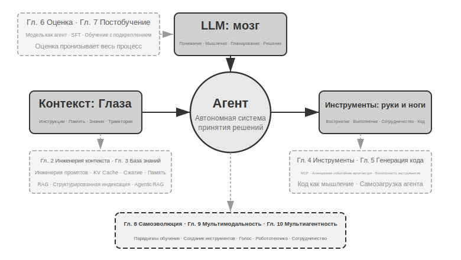

# Введение {.unnumbered}

С августа по октябрь 2025 года я провёл серию технических лекций в «Практическом лагере AI Agent» издательства «Тьюринг». Замысел лекций был прост: перевести проектирование ИИ-агентов из режима «на ощупь» в режим «по принципам»: не просто научить людей запускать демонстрацию, а дать глубокое понимание того, почему агент устроен именно так и какие компромиссы стоят за каждым архитектурным решением. Эта книга как раз и выросла — была собрана и расширена — из конспектов и экспериментов тех лекций.

Стоит отметить, что сама эта книга — от первоначальной идеи до готовой рукописи — была сделана способом, который можно назвать **whisper coding** («надиктованное сотрудничество»): а надиктовывал я её собственному голосовому агенту нашей компании Pine. Готовя очередную лекцию, я сначала надиктовывал агенту примерный план, просил его провести исследование (survey), а затем он готовил черновик; после лекции я, учитывая обратную связь слушателей «Практического лагеря AI Agent», снова и снова обсуждал с ним материал и дорабатывал его — так, шаг за шагом, эти конспекты разрослись и превратились в сегодняшнюю книгу. На протяжении всего процесса я в основном не печатал, а надиктовывал идеи агенту — пропускная способность голоса намного выше, чем печати (обычная скорость речи примерно в четыре раза выше скорости печати), поэтому цикл «надиктовал — исследовал — обсудил — доработал» крутился очень быстро. В каком-то смысле эта книга не только рассказывает об агентах, но и сама сделана при участии агента.

С начала 2025 года, когда вышла DeepSeek R1, и по сей день область ИИ прошла путь от простых базовых моделей (то есть универсального фундамента больших языковых моделей) до глубоководной зоны инженерного внедрения. Прогресс на уровне моделей заметен по двум направлениям: с одной стороны, модели через обучение с подкреплением в агентной среде (Agentic Reinforcement Learning) «вшили» способность к вызову инструментов прямо в параметры модели, благодаря чему модели освоили универсальные навыки в программировании (coding), математике, работе с графическим интерфейсом (computer use). Скорость итераций моделей также растёт: от GPT-5.2 до GPT-5.5, от Claude Opus 4.5 до 4.8 прошло всего по полгода. На уровне продуктов такие универсальные агенты, как Manus, Claude Code, OpenClaw, заново определили способ взаимодействия человека с машиной и вывели архитектурную парадигму «генерация кода + файловая система» в мейнстрим.

Оглядываясь на принципы проектирования архитектуры агентов, которые я обобщил на курсе почти год назад, я делаю одно открытие, одновременно радующее и удивляющее: **эти принципы не только не устарели, но становятся всё более классическими.** Хотя впоследствии в индустрии агентов один за другим появились новые термины вроде Skill, harness, loop engineering, реальная последовательность событий как раз обратная: не Anthropic и подобные компании сначала придумали эти понятия, а множество агентов потом стали их применять; напротив, множество агентов уже давно так работали, а Anthropic лишь обобщил и сформулировал эти практики в виде архитектурных принципов проектирования. Сначала практика, потом название.

Уверенность в этих принципах пришла из реального опыта продвижения агентов в долгие, высокорисковые сценарии. Как главный научный сотрудник Pine AI я вместе с командой создал Pine. Насколько мне известно, это первый универсальный агент, способный самостоятельно взаимодействовать с живыми людьми и надёжно, автономно выполнять чувствительные, сложные, длительные задачи, связанные с деньгами: он звонит от имени пользователя, договаривается с оператором связи по поводу счёта, ведёт переговоры с продавцами о возврате средств и жалобах, отменяет подписки — и всё это без вмешательства человека. Такие задачи нередко требуют десятков раундов переговоров, и любая ошибка на любом шаге оборачивается реальными денежными потерями. Именно почти нетерпимое к ошибкам требование надёжности заставило нас, шаг за шагом, вывести те архитектурные принципы, о которых постоянно говорится в этой книге. Несколько примеров ниже — как раз из этой практики.

- Задолго до того как понятие Skill стало популярным, мы уже применяли динамическую подгрузку промптов для решения проблемы бесконечного разрастания промптов, использовали инструмент выполнения командной строки для решения проблемы бесконечного разрастания списка инструментов, применяли технологию системной строки состояния для решения проблемы, при которой агент не осознаёт среду выполнения, время пользователя, статус работы и тому подобное.
- Задолго до того как понятие harness стало популярным, мы уже применяли подход, похожий на Claude Code, для решения проблем нестабильности вызова инструментов моделью, галлюцинаций, опасных действий, превышения полномочий и несоблюдения инструкций.
- Задолго до того как понятие loop engineering стало популярным, мы уже использовали подход, который в этой книге называется предложитель-рецензент (proposer-reviewer), для решения проблемы преждевременного признания моделью задачи завершённой.

И это не наше эксклюзивное изобретение — насколько мне известно, большинство ведущих компаний, занимающихся моделями и агентами, самостоятельно нащупали схожие подходы. Именно поэтому я в августе 2025 года открыл курс «Практический лагерь AI Agent» в издательстве «Тьюринг», а с 2024 по 2026 год непрерывно веду практический курс по AI Agent в Университете Китайской академии наук. Я решил выпустить эту книгу в открытом доступе, а не закрыть её и собирать роялти, именно потому, что хочу, чтобы эти знания распространились среди как можно большего числа практиков.

**Сначала практика, потом название** — эта последовательность имеет одно очень практическое следствие для корпоративной разработки агентов: **если вы каждый раз ждёте, пока в индустрии станет популярным какой-нибудь термин из мира агентов, прежде чем начать практиковать, вы уже опоздали.** К моменту, когда термин становится популярным, ведущие компании обычно уже прошли соответствующую проблему насквозь. Так как же узнать, что делать, ещё до того, как термин станет модным? Я считаю, что ключевых момента два.

**Первое — иметь реальный бизнес с крайне высокими требованиями к верхнему пределу возможностей агента и постоянно получать реальную обратную связь от бизнеса.** Возьмём Pine: обработка одного случая часто занимает часы, а то и недели, и в процессе может потребоваться неоднократное общение с несколькими заинтересованными сторонами: может понадобиться говорить по телефону несколько часов, заполнять несколько страниц сложных форм на компьютере, обмениваться несколькими письмами по почте; при этом нельзя ошибиться ни в одной цифре и одновременно нужно проявлять осторожность в общении, отстаивая интересы пользователя. Только оказавшись в достаточно сложном сценарии, практика естественным образом заставляет вас строить harness, решать те задачи, которые модель сама по себе пока не умеет делать, но которые бизнес обязан выполнить. И наоборот: если требования бизнеса к верхнему пределу возможностей невысоки и достаточно небольшого апгрейда модели, у вас не будет стимула оттачивать эти архитектурные принципы.

**Второе — необходимо выстроить механизм оценки (Evaluation).** Это ещё одна мысль, которая постоянно повторяется в книге: без оценки нет прогресса. Оценка позволяет отличить, действительно ли изменение стало лучше, или это просто удача, — и тем самым избавляет итерацию агента от зависимости от интуиции. В конечном счёте мы отстаиваем идею научного подхода к инженерии, к разработке агентов, а оценка — это фундамент такой методологии. Шестая глава подробно раскрывает этот метод.

Как бы ни развивалась базовая модель, как бы ни менялась форма продукта, почти все успешные системы агентов следуют одному и тому же архитектурному паттерну. Это не случайность: **хорошие принципы проектирования должны переживать циклы обновления моделей**, потому что они описывают не способ использования какой-то конкретной модели, а базовые паттерны взаимодействия интеллектуальной системы с миром.

Лауреат премии Тьюринга, отец обучения с подкреплением Ричард Саттон говорил, что эволюция вселенной прошла четыре стадии: от пыли до звёзд, от звёзд до жизни, от жизни до агентов (в оригинале — «спроектированных сущностей», designed entities). Биологическая эволюция слепа: случайные мутации, естественный отбор. Большинство живых организмов не понимают принципов собственной работы и не способны самостоятельно проектировать и изменять живые организмы. А агент (Agent) — совершенно новый вид сущности в истории эволюции вселенной: он способен через генерацию кода осуществлять самозагрузку (bootstrap) и самоэволюцию — подобно тому, как программист пишет другого программиста, а тот, новый программист, продолжает писать следующего. Иными словами, агент способен понимать механизм собственной работы и, исходя из цели, создавать совершенно новых агентов и даже улучшать самого себя. Миссия этой книги — помочь вам понять и освоить принципы такого созидания.

Ядро книги умещается в одну формулу: **Агент = LLM + Контекст + Инструменты**. Ни одно из трёх нельзя убрать.

Более наглядно это можно выразить как **мозг + глаза + руки-ноги**. Мозг (LLM) отвечает за мышление и принятие решений, глаза (контекст) определяют, какую информацию видит агент, руки-ноги (инструменты) определяют, что агент может сделать. (Строго говоря, «глаза» — лишь приблизительная аналогия: контекст включает не только информацию о среде и историю диалога, но и, например, определения инструментов, то есть в информацию, которую агент «видит», входит и то, «какими руками-ногами он располагает». Эта метафора призвана передать главную интуицию: контекст — это всё, что модель способна воспринять.)

Для читателей, знакомых с обучением с подкреплением, эти три компонента также можно сопоставить с формальным языком RL. А именно: LLM соответствует Policy (политике), контекст — Observation Space (пространству наблюдений), инструменты — Action Space (пространству действий). Все три формулировки описывают один и тот же объект, лишь на разных уровнях выражения.

## Структура книги {.unnumbered}

Книга состоит из десяти глав и разворачивается на четырёх уровнях (рис. 0-2). Первая глава закладывает базовый каркас агента; главы со второй по пятую посвящены построению агента и последовательно рассматривают контекст, знания, инструменты и генерацию кода; главы с шестой по восьмую обсуждают оценку и непрерывное совершенствование агента — от системы измерений и постобучения модели до непрерывной эволюции, движимой опытом эксплуатации; главы девятая и десятая расширяют поле зрения до мультимодального взаимодействия и мультиагентного сотрудничества.

- **Глава 1 (Основы агента)** на примере нескольких реальных продуктов-агентов формирует интуитивное представление об агенте. Подробно разбирается базовая формула агента: от уровня реализации — LLM + Контекст + Инструменты, через интуитивный уровень — мозг + глаза + руки-ноги, до академического уровня — политика (Policy), пространство наблюдений (Observation Space) и пространство действий (Action Space). На экспериментах также разбирается механизм работы цикла ReAct, то есть итеративный процесс «думать → действовать → наблюдать», и проводится различие между контекстной адаптацией внутри задачи, обновлением внешних артефактов между задачами и обновлением параметров в цикле обучения. В конце обсуждаются паттерны оркестрации — от рабочего процесса до автономного агента, — создающие единую концептуальную рамку для последующих глав.
- **Глава 2 (Инженерия контекста)** — ключевая глава книги, систематически рассматривающая контекст, то есть «глаза» агента. Глава начинается со структуры сообщений API и основного цикла агента, закладывая базовое понимание «контекст — это список сообщений», затем углубляется в фундаментальные принципы KV Cache (механизма повторного использования результатов прошлых вычислений в процессе вывода большой модели), после чего последовательно раскрывает инженерию промптов (Prompt Engineering, включая процессно-ориентированное проектирование, описание инструментов и детализацию бизнес-правил) и защиту от инъекций промпта (Prompt Injection), механизм подгрузки Agent Skills по требованию, технологию строки состояния агента и стратегии сжатия контекста (Context Compression). Полные определения терминов даются при первом появлении в основном тексте.
- **Глава 3 (Память пользователя и база знаний)** расширяет управление контекстом до персистентной межсессионной системы знаний, чтобы агент мог не только помнить содержание текущего диалога, но и накапливать и использовать знания из множества диалогов. Рассматриваются четыре прогрессивные стратегии памяти пользователя, полный технологический стек RAG (генерации с расширением поиском, то есть сначала выполняется поиск релевантных документов, а затем модель генерирует ответ), включая различные методы текстового поиска и оптимизацию ранжирования результатов, извлечение мультимодальной информации, более продвинутые методы организации знаний, а также агентный RAG (Agentic RAG, то есть предоставление агенту возможности самостоятельно решать, когда и что искать).
- **Глава 4 (Инструменты)** исследует мост, соединяющий агента с внешним миром: инструменты служат агенту «руками и ногами», позволяя искать информацию в вебе, вызывать API, работать с базами данных и так далее. Рассматриваются стандарт совместимости инструментов MCP и принципы проектирования пяти категорий инструментов — восприятия, выполнения, сотрудничества, срабатывания событий и коммуникации с пользователем, — с акцентом на механизмах безопасности инструментов выполнения и событийно-ориентированной асинхронной архитектуре агента.
- **Глава 5 (Coding Agent и генерация кода)** обосновывает, что Coding Agent в сочетании с файловой системой представляет собой ключевую техническую основу любого универсального агента. На примере архитектуры OpenClaw разбираются рабочий процесс и приёмы реализации Coding Agent, а также демонстрируется широкая ценность генерации кода за пределами программирования: от поддержки мышления и построения базы знаний до динамического создания новых инструментов и самозагрузки агента.
- **Глава 6 (Оценка агента)** выстраивает научную методологию оценки. Она охватывает среды оценки — два основных паттерна, вызов инструментов и человеко-машинное взаимодействие, а также отдельно рассматриваемые в конце главы имитационные среды, — принципы проектирования датасетов, методы автоматизированной оценки LLM-as-a-Judge, выбор модели на основе оценки и полный замкнутый цикл преобразования результатов оценки в улучшения системы.
- **Глава 7 (Постобучение модели)** углубляется в две технологии постобучения: SFT (дообучение с учителем, то есть обучение модели «делать по образцу» на размеченных данных) и RL (обучение с подкреплением, то есть предоставление модели возможности самостоятельно совершенствоваться через пробы, ошибки и обратную связь в форме вознаграждения). Опираясь на тезисы «SFT запоминает, RL обобщает» и «данные и среда важнее алгоритма», глава охватывает полную картину трёх стадий — предобучение/SFT/RL, классическую теорию RL, проектирование сигнала вознаграждения — от бинарного и процессного вознаграждения до штрафа за нарушение пути проверки в рамках принципа «вознаграждать результат, ограничивать процесс», — однораундовые и многораундовые алгоритмы обучения с подкреплением, а также передовые исследования в области оптимизации эффективности использования выборки.
- **Глава 8 (Непрерывная эволюция агента)** исследует, как преобразовать опыт эксплуатации агента в способности его следующей версии. Сначала выстраиваются сигналы обучения, состоящие из результатов среды, правил процесса и LLM Rubric; затем сравниваются четыре носителя обновлений — документы знаний, Prompt и Skills, программы и Harness, параметры модели; наконец обсуждаются проверка кандидатных версий, поэтапный выпуск, откат и долгосрочная консолидация.
- **Глава 9 (Мультимодальность и взаимодействие в реальном времени)** рассматривает переход агента из текстового мира в физический. Глава охватывает голосовых агентов — от последовательного конвейера до сквозных моделей, — Computer Use, позволяющий агенту управлять графическим интерфейсом подобно человеку, и робототехнические операции, включая управление посредством VLA (моделей «зрение — язык — действие») и перенос Sim2Real, выявляя общие архитектурные вызовы, порождённые мультимодальностью и требованиями реального времени.
- **Глава 10 (Мультиагентное сотрудничество)** обсуждает конечную форму систем AI Agent: распределение труда и сотрудничество между несколькими агентами. Систематически излагается классификационная рамка мультиагентного сотрудничества — общий/независимый контекст × равноправная/управляющая/децентрализованная организация, — на примерах агента-переводчика и связки телефонного и компьютерного агентов демонстрируются методы проектирования архитектуры сотрудничества, а также рассматриваются передовые направления общества и экономики агентов.

## Как читать эту книгу {.unnumbered}

Главы книги относительно независимы друг от друга — вы можете выбрать маршрут чтения, исходя из ваших потребностей:

- **Если вы разработчик агентов**, рекомендуется последовательно прочитать главы с первой по восьмую: первые пять глав дают методы построения, шестая закладывает основу оценки, седьмая объясняет, как обучать модель, а восьмая включает параметры и другие носители обновлений в полный замкнутый цикл непрерывной эволюции. Главы девятую и десятую можно читать выборочно, в зависимости от потребностей в мультимодальном взаимодействии и мультиагентном сотрудничестве.
- **Если у вас мало времени**, в первую очередь прочитайте главу 1, формирующую целостное представление, и главу 2, раскрывающую важнейшую тему — инженерию контекста. Фундаментальные принципы KV Cache во второй главе довольно технические: при первом чтении можно пропустить раздел с принципами и запомнить лишь три ключевых вывода, приведённых в начале, — это не помешает пониманию дальнейшего материала.
- **Если вас интересует обучение моделей**, можно сразу перейти к главе 7 (Постобучение модели); при этом методы оценки из главы 6 являются предпосылкой обучения, поэтому рекомендуется прочитать обе главы, а перед ними — главы 1–2, чтобы сформировать целостное представление.

Каждая глава содержит множество **экспериментов** и **вопросов для размышления**, оформленных в формате «Эксперимент X-Y» (X — номер главы, Y — порядковый номер внутри главы). В заголовках экспериментов и вопросов сложность отмечена звёздами: ★ означает начальный уровень, подходит всем читателям; ★★ означает средний уровень сложности, требующий определённой инженерной практики; ★★★ означает продвинутый вызов, обычно связанный с открытой задачей или сложным системным проектированием. К большинству экспериментов прилагается полностью рабочий код, организованный в сопутствующем открытом репозитории:

> **Сопутствующий репозиторий с кодом**: [https://github.com/bojieli/ai-agent-book](https://github.com/bojieli/ai-agent-book)

Названия проектов в репозитории один в один соответствуют экспериментам в книге, и каждый проект включает полную инструкцию по запуску и настройку зависимостей. Настоятельно рекомендую вам самостоятельно прогнать эти эксперименты. ИИ-агенты — область с чрезвычайно высокой практической составляющей, и многие проектные интуиции по-настоящему складываются только в процессе ручной отладки.

**Терминологическая договорённость**: некоторые английские технические слова при прямом переводе на русский порождают неоднозначность, поэтому в книге специально разграничены два часто встречающихся термина: reasoning (процесс, в котором модель разворачивает промежуточные выводы, «думает») последовательно переводится как «размышление» / «рассуждение» (в русской версии — «мышление» модели), а inference (прямой проход модели, развёртывание и запуск в продакшене) последовательно переводится как «вывод». Использование двух разных слов нужно для того, чтобы одно и то же слово не несло два разных смысла и не запутывало читателя. Поэтому там, где речь идёт о цепочке рассуждений модели (Chain-of-Thought), о думающих моделях (например, серия OpenAI o, DeepSeek-R1 — в книге они называются «думающие модели», «мыслители»), о токенах размышления, о процессе размышления, книга неизменно использует слово «мышление»/«размышление»; там же, где речь идёт о развёртывании и запуске модели (во время вывода, стоимость вывода, стек вывода, масштабирование во время вывода и т. п.), используется слово «вывод». Исключение — несколько составных слов, уже устоявшихся в русском языке: **логический вывод, многошаговый вывод, пространственный вывод, темпоральный вывод**, а также бытовое употребление вроде «игра на логику» — здесь книга сохраняет привычный перевод со словом «вывод»/«рассуждение»; просим читателя понимать их по контексту как общее значение дедуктивного умозаключения, а не как техническое значение inference, указанное выше. Прочие ключевые термины сопровождаются русско-английским соответствием при первом появлении в тексте.

## Необходимые предварительные знания {.unnumbered}

Эта книга рассчитана на читателей с определённой технической подготовкой, но не требует, чтобы вы были экспертом в какой-то конкретной области. Ниже перечислены предварительные знания по двум уровням — «обязательные» и «рекомендуемые», — которые помогут вам оценить свою готовность.

**Обязательные: основа для чтения всей книги**

- **Программирование на Python**: почти все эксперименты в книге основаны на Python. Вам нужно знать базовый синтаксис Python, распространённые структуры данных, базовые понятия управления пакетами (pip). Глубокое владение не требуется, но вы должны уметь читать и модифицировать код средней сложности.
- **Опыт работы с LLM**: вы должны были пользоваться ChatGPT, Claude или похожими продуктами и понимать базовую схему взаимодействия «промпт → ответ модели».
- **Один из инструментов ИИ-ассистированного программирования**: настоятельно рекомендуется установить и освоить хотя бы один такой инструмент — например, Claude Code, Codex, Cursor, Trae и т. п. С одной стороны, эти инструменты значительно повышают эффективность разработки в экспериментах книги, которые включают немало написания и отладки кода. С другой — сами эти инструменты представляют собой зрелые кодинг-агенты, и, работая с ними, вы на собственном опыте почувствуете цикл ReAct, вызов инструмента, управление контекстом и другие ключевые механизмы, которые многократно обсуждаются в книге. Такой непосредственный опыт крайне полезен для понимания принципов проектирования агентов.
- **Общая инженерная грамотность**: знакомство с командной строкой, системой контроля версий Git, форматом данных JSON, REST API и другими базовыми понятиями. Это фундамент для запуска экспериментов и понимания механизма вызова инструментов агентом.

**Рекомендуемые: улучшают восприятие отдельных глав**

- **Основы машинного обучения** (глава 7): понимание обучения и вывода, функции потерь, градиентного спуска, переобучения и других базовых понятий поможет разобраться в постобучении моделей.
- **Базовая математика** (главы 2–3, 7): интуитивное понимание линейной алгебры (например, знание того, что вектор может представлять направление и величину, а матрица — выполнять пакетные операции) поможет разобраться в эмбеддингах и механизме внимания; базовые знания теории вероятностей и статистики пригодятся для понимания метрик оценки и ожидаемой награды в обучении с подкреплением. Математика в книге не включает сложных выкладок и делает упор на интуитивные объяснения.
- **Основы веб-разработки** (главы 4, 9): понимание HTTP, WebSocket, архитектуры с разделением фронтенда и бэкенда поможет разобраться в событийно-ориентированной асинхронной архитектуре агентов и в экспериментах по реал-таймовой коммуникации голосовых агентов.
- **Базовое представление об архитектуре Transformer** (главы 2, 7): Transformer — это базовая архитектура практически всех современных больших языковых моделей. Читателям, желающим системно восполнить знания о больших моделях, рекомендуем книгу «Иллюстрированное объяснение больших моделей» (издательство «Турин»). Она наглядно, с помощью иллюстраций, объясняет архитектуру Transformer, предобучение и тонкую настройку и другие ключевые понятия, хорошо дополняя инженерный взгляд на агентов, представленный в этой книге.

Если у вас недостаёт каких-то из перечисленных знаний, не стоит из-за этого отказываться от чтения. Главная ценность этой книги — в **принципах архитектурного проектирования и методологии инженерной практики**, а не в конкретных алгоритмах или приёмах. За исключением главы 7 о постобучении, требования книги к математике и машинному обучению невысоки, так что она вполне может стать вашей отправной точкой.

Технологии агентов всё ещё быстро развиваются, но **хорошие принципы архитектурного проектирования обладают силой, устойчивой во времени**. Освоив, «почему нужно проектировать именно так», вы сохраните ясное суждение сквозь смену технологических волн. Надеюсь, эта книга станет для вас надёжным руководством по созданию ИИ-агентов.

## Благодарности {.unnumbered}

Благодарю редакторов издательства «Турин» — Мэн Гэ и Лю Мэйин — за кропотливую редакторскую работу, а также за усилия по организации курса «AI Agent Практикум» издательства «Турин»; благодарю преподавателя Лю Цзюньмина за открытие практического курса по ИИ-агентам в Университете Китайской академии наук. Особая благодарность всем слушателям курса «AI Agent Практикум» издательства «Турин», а также всем студентам практического курса по ИИ-агентам в Университете Китайской академии наук — в процессе преподавания этих курсов вы дали мне множество ценных отзывов и предложений, которые помогли мне самому яснее понять эти концепции.

Благодарю всех коллег из Pine AI. Если бы не такой прекрасный продукт, как Pine AI, и все вызовы, которые он принёс, я бы не смог достичь такого глубокого понимания и практического опыта в области агентов; в бесчисленных спорах и обсуждениях коллеги также внесли огромный вклад ценными идеями.

Благодарю также многих друзей из индустрии ИИ (не буду перечислять всех поимённо). В различных отраслевых дискуссиях они честно отзывались о моих взглядах, исправляли немало моих ошибочных суждений и углубляли моё понимание моделей и агентов.

Больше всего я благодарен своей семье, особенно моей жене Мэн Цзяин. Она всегда поддерживала меня в работе над этой книгой и внесла немало ценных предложений.
