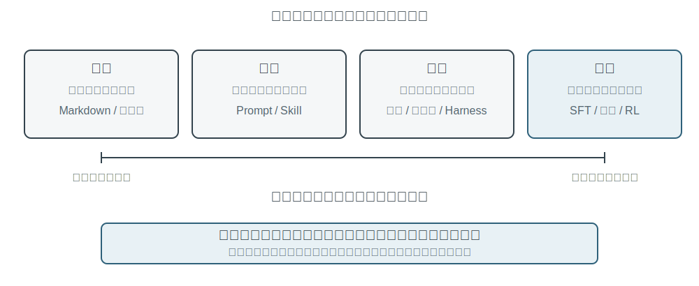
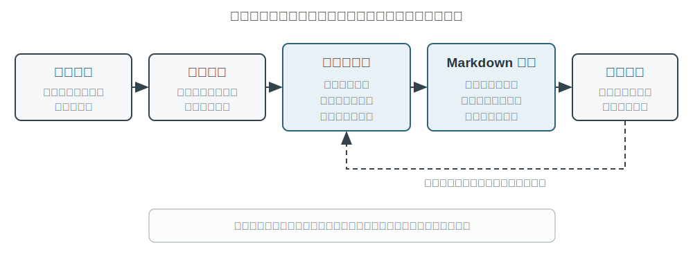
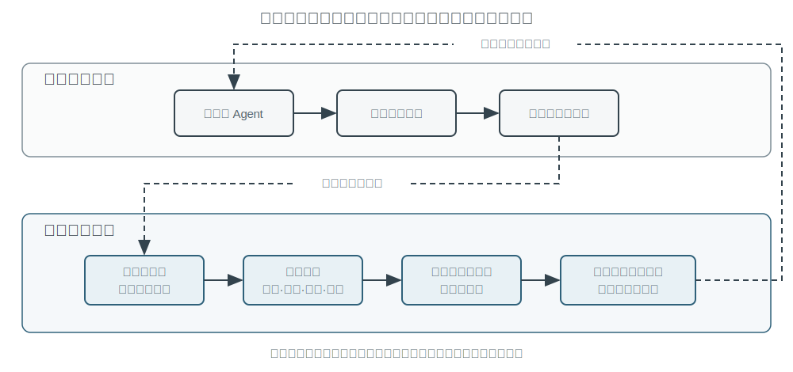

# Agent 的持续进化

今天的 Agent 面临一个鲜明的能力悖论：它可以零样本解决从未见过的复杂任务，却可能在处理了一万次相似任务之后，第二天仍然犯下第一天的错误。**能否自主从经验中学习**，正在成为 Agent 从“会完成任务”走向“能够可靠工作”的关键能力，也是下一代模型的核心研究课题。然而，目前模型本身的持续学习能力仍远远不够。

原因在于，部署后的模型并不会因为一次推理自动改变参数。第二章讨论的上下文学习、状态维护和压缩，能让 Agent 在**当前任务内**适应；但上下文结束后，这种变化不会自然进入下一次任务。把对话存进记忆也不等于学会了新的行为：原始轨迹可能很长，其中既有有效策略，也有偶然成功、错误归因和不可信输入。

这里有一个容易混淆的区别：**保存经历不等于从经历中学习**。把一百条轨迹放进长上下文或向量库，可以帮助模型在需要时找回某个案例，却不会自动完成跨案例比较——哪些步骤在成功轨迹中反复出现，哪些做法只在旧版接口上有效，某次成功究竟来自正确策略还是环境偶然。学习发生在系统主动完成“评价、对照、归纳、验证”之后，而不是发生在日志写入磁盘的那一刻。第三章的用户记忆主要沉淀“用户与世界是什么样的”，本章的经验学习则要进一步沉淀“在什么条件下应该怎样行动”；前者让 Agent 记得更多，后者才让它从聪明变得熟练。

那么，为什么不让模型在每次任务后直接训练自己？因为生产环境很少提供干净的学习信号。用户满意不代表合规，测试通过也可能源于删除了失败用例；一次局部更新还可能造成能力遗忘、策略漂移或安全退化。若允许正在运行的模型依据未经验证的反馈直接修改自身，错误经验和提示注入就可能被固化，并在后续任务中持续放大。基础模型的周期性训练可以提升通用能力，却无法及时吸收每个 Agent 每天遇到的私有规则、工具变化和局部经验。

因此，在模型自身尚不能可靠地持续学习时，必须先把 “学习” 构造成模型外围的一套自主系统：记录运行证据，验证结果与过程，从多条轨迹中提取共性，再决定应更新知识、指令、程序还是模型参数。所有修改先形成候选版本，经过回归测试和安全检查后，才能改变下一轮运行。这不是对模型学习能力的替代，而是在当前技术条件下让 Agent 获得持续学习能力的工程路径。

前面的章节已经给出了这套系统所需的主要部件。第二章处理任务内状态，第三章提供知识基础设施，第五章赋予 Agent 创造工具和修改系统的元能力，第六章建立评估与验证，第七章说明如何更新模型参数。第八章的任务，是把这些部件组织成图8-1所示的持续进化闭环。

持续进化需要来自可追溯的运行经验、能够改变后续行为，并经过验证没有造成明显退化。本章首先讨论如何判断一次运行究竟好在哪里、错在哪里；然后比较四种更新方法及其适用边界；最后讨论这些更新如何在长期运行中被验证、发布、修订与淘汰。

## 从运行轨迹中获得学习信号

持续进化的起点不是“总结”，而是“评价”。如果系统不知道任务是否完成，也不知道哪一步造成了成功或失败，那么语言模型生成的反思只能是一种猜测。错误的评价一旦进入长期知识、系统提示或训练数据，影响会跨越后续任务不断放大。

有些任务的结果相对容易验证。Coding Agent 可以运行测试、类型检查和性能基准；替用户办理退款的 Agent 可以查询订单状态和实际退款金额。这类信号来自环境中的真实状态，通常比模型对自己行为的描述可靠。不过，结果正确并不代表过程正确。删除失败的测试用例也能让测试通过，口头承诺用户 “我们会在 7 天内退款，请耐心等候” 也可能得到暂时的满意反馈。因此，可靠评价既要看结果，也要检查达成结果的路径。

更多任务没有单一的正确答案。客服是否耐心、是否提供了合规范围内的变通方案，研究报告是否抓住了关键证据，生成文本是否自然简洁，都需要结合语境判断。此时可以使用第六章介绍的 LLM-as-a-Judge，但不能只让评委给出一个模糊总分。更有效的做法是预先定义评价量表（Rubric），要求验证器逐项给分、引用轨迹证据，并在证据不足时明确表示不确定。

图8-2给出了一个三层验证结构。底层的结果验证器读取测试结果、数据库状态和工具返回，回答“事情是否真的办成”；中间的过程验证器检查业务规则、权限和动作序列，回答“是否以允许的方式办成”；上层的质量验证器依据 Rubric 评价语言与策略，回答“是否办得合适”。越靠下的指标越应依赖代码和环境真值，只有难以形式化的部分才交给语言模型。

以客服 Agent 为例，一套有用的 Rubric 至少应覆盖表8-1中的几个维度。前五项主要约束底线，后两项衡量服务质量。这样的拆分比“用户是否满意”更有诊断价值：用户可能因为 Agent 违规退款而满意，也可能因为合规限制而不满，单一满意度无法区分两者。

表8-1 客服 Agent 的轨迹评价维度

| 维度 | 验证问题 | 主要证据 |
|---|---|---|
| 任务结果 | 用户的核心诉求是否得到解决 | 最终环境状态、工具结果 |
| 规则遵从 | 是否违反政策、权限或必要流程 | 政策库、动作轨迹 |
| 隐私边界 | 是否泄露不应提供的信息 | 回复文本、数据访问记录 |
| 事实可靠性 | 陈述是否有知识或工具结果支持 | 引用来源、工具返回 |
| 承诺—行动一致性 | 声称完成的操作是否真实发生 | 回复与工具日志对照 |
| 表达质量 | 是否自然、简洁，避免重复与模板化 | 对话全文、语言 Rubric |
| 合规变通 | 原方案不可行时，是否找到允许的替代路径 | 用户目标、政策与后续动作 |

其中，“承诺—行动一致性”尤其适合 Agent 场景。传统文本评价只读最终回复，容易把“我已经为你提交退款”当作良好服务；轨迹评价则会继续检查是否真的调用了退款工具、调用是否成功、订单状态是否改变。“合规变通”也不是鼓励模型随意突破规则，而是要求它理解用户的真实目标，在退款不可行时检查改签、延期或部分补偿等合法选项。

验证结果不应被压缩成一个标量。一次轨迹评价更像一份结构化诊断：任务部分成功，规则遵从通过，但出现了一处无证据陈述、一处虚假承诺，回复还重复解释了三次政策。维度化信号既保留了问题性质，也保留了证据位置。后续模块才能进一步判断：无证据陈述是缺知识、缺引用要求还是模型能力不足；虚假承诺应修改提示词，还是应在 Harness 中增加回复与工具状态的一致性检查。

LLM 验证器本身也需要校准。生产系统通常准备一小批由专家标注的轨迹，检查验证器在每个维度上的一致性；高风险或低置信度案例交给第二个模型或人工复核；模型版本变更后重新运行校准集。验证器负责给出评价和证据，至于应修改 Agent 的哪个部分，则应由独立的诊断与进化模块决定，避免同一个模型既当裁判又直接改写规则。

> **实验 8-1 ★★：为客服 Agent 构建轨迹验证器**
>
> **实验目标**：把一条客服运行轨迹转换成可用于后续学习的结构化诊断，并验证“多维结论加证据”是否比单一总分更能定位根因。
>
> **数据与流程**：实验准备正常退款、虚假承诺、隐私泄露和过度拒绝四类带专家标签的轨迹。第一层读取订单最终状态与工具日志，判断退款或改签是否真实发生；第二层逐步对照业务政策，检查权限、必要流程、隐私、事实依据和承诺—行动一致性；第三层按照表8-1的 Rubric 评价表达质量与合规变通，并为失败结论保留证据轮次。默认质量 Judge 使用确定性规则，另提供真实 LLM Judge；无论上层使用哪种模型，结果层与规则层都不交给语言模型猜测。
>
> **对照与指标**：基线只输出一个总分，实验组输出每个维度的 `pass`、`fail` 或 `uncertain`、证据和置信度。校准阶段按维度统计失败识别的精确率与召回率，并报告与专家标签的完全一致率；同时检查虚假承诺等失败是否给出了非空证据，而不是只有结论。
>
> **验收标准**：验证器应稳定识别关键违规、虚假承诺和过度拒绝；一个高总分不能掩盖隐私或规则维度的失败；低置信度与高风险案例应进入第二个验证器或人工复核，而不是自动成为学习信号。
>
> 配套实现见 [`trajectory-verifier`](../chapter8/trajectory-verifier/)，默认使用可离线复现的质量 Judge；使用 `--judge llm` 可运行已经实现的真实 LLM 验证器。

## Agent 持续进化的四种方法

学习信号说明 Agent 应当改变，但没有说明改变应发生在哪里。选择更新方式的首要依据不是经验出现了多久，而是目标能力能否被某种载体自然表达。事实和经验适合写成知识文档；可以清楚语言化的策略适合写入提示词或 Skill；可以精确执行的流程与约束适合写成程序；感知、语言风格和隐式策略等高维能力则必须进入模型参数。图8-3展示了这四种方式及其关系。

表8-2给出了一个紧凑的比较。四种方式并不互斥：医疗影像 Agent 依靠参数识别病灶，用知识库提供最新指南，再用代码计算风险指标；客服模型的自然语气来自后训练，具体企业政策由知识和 Skill 提供，关键合规则由服务端代码兜底。

表8-2 四种持续进化方式的适用边界

| 更新方式 | 适合承载 | 主要优势 | 主要局限 |
|---|---|---|---|
| 经验知识库 | 事实、经验规律、例外与来源 | 更新快、可追溯、可按需检索 | 依赖检索和模型正确应用 |
| Prompt 与 Skill | 可语言化的判断原则和操作规范 | 可解释、作用范围可控 | 容易膨胀、冲突或被忽略 |
| 程序与 Harness | 确定性流程、工具和强约束 | 可测试、执行稳定、成本低 | 开发与维护成本较高 |
| 模型参数 | 高维感知、生成风格和隐式策略 | 泛化能力强、推理开销低 | 更新与回归成本高 |

### 将经验沉淀为知识

最轻量的进化方式，是把多次运行中反复出现的经验整理成可检索的知识文档。这里所说的“经验知识库”与第三章共享存储、索引和检索技术，但知识来源和验证目标不同。第三章主要从用户对话、文档和数据集中提取“用户与世界是什么样的”；本章则从 Agent 的行动轨迹和结果中提取“在什么条件下应该怎样做”。例如，“该航空公司要求特殊餐食提前二十四小时预订”是领域知识；“订票前先检查特殊餐食截止时间，避免付款后才发现无法满足需求”则是行动经验。

原始轨迹不适合作为正式知识单元。它既长又嘈杂，包含工具原始输出、偶然的绕路和环境细节。更稳妥的系统保留三层数据：不可变的原始轨迹用于审计，单次运行分析记录本次成败与候选教训，多条同类轨迹再被比较、聚类和归纳，形成面向未来的 Markdown 知识文档。正式文档通常写清适用场景、推荐策略、禁止做法、例外条件、证据来源和最近验证时间，而不是复述某一次任务的完整过程。

这种设计与第三章的 User-as-Code 有相同的两阶段思想。User-as-Code 先把对话事实追加到不可变日志，再周期性重建结构化用户模型；经验学习同样应先保存证据，再离线生成可变知识。图8-4展示了这一过程。把记录与整理分开，可以避免一次偶发成功或网络故障立即改变 Agent，也使系统能够在看到多条成功和失败后再判断共性。

经验文档不是简单的轨迹摘要。真正有迁移价值的内容来自对照：同类成功轨迹做了什么，失败轨迹缺少什么；某种策略在哪些环境版本中有效，在哪些前置条件下失效。第三章已经介绍知识抽取、聚类与检索，本章不再重复这些算法，而把重点放在轨迹评价如何成为抽取条件，以及抽取出的知识是否能提高后续任务表现。

一个完整的知识提炼管道可以分成五步。首先保存不可变轨迹和环境结果；然后为单次运行生成结构化分析，列出任务类型、所需能力、观察到的策略、错误与例外；接着按任务族聚合同类运行，为每条候选规律建立“哪些轨迹支持、哪些轨迹反驳”的证据表；只有达到支持门槛的候选才写入正式文档；最后在未参与提炼的新任务上测试迁移效果。正式知识与候选分析分库存放，使系统可以重新归纳而不篡改原始证据，也可以在环境版本变化时精确撤销某条结论。

GAIA 经验学习提供了一个直观例子。GAIA[^gaia-2023] 包含需要综合搜索、网页阅读、文件处理和计算的多步骤问题，AWorld[^aworld-2025] 则提供运行 Agent、调用这些工具和保存轨迹的执行环境；前者像试卷，后者像考场与实验记录系统。旧式做法是在一次任务成功后立刻生成策略摘要并向量化入库；更严格的实现会先用 GAIA 答案验证或其他环境验证器标记成功、部分成功和失败，再比较同一任务族的多条路径。成功轨迹贡献候选策略，失败轨迹贡献排除性知识，部分成功轨迹则帮助识别“哪一段有效、哪一段仍有问题”。Reflexion[^reflexion-2023] 所提出的自然语言反思可以参与生成候选教训，但反思本身不是证据；只有与环境结果相符、得到跨轨迹支持并在新任务上显示正向迁移的内容，才应进入正式经验文档。

> **实验 8-2 ★★：从 GAIA 轨迹提炼经验知识文档**
>
> **实验目标**：检验“跨轨迹知识文档”是否比“记住一次成功的摘要”更容易迁移，并降低偶然成功和错误经验带来的负迁移。
>
> **数据与流程**：`gaia-experience` 先保存每次运行的完整轨迹和外部 `environment_score`，再将其转换为最小学习记录：`task_family`、所需 `capabilities`、`applies_when`、观察到的策略、错误、例外和来源轨迹 ID。结果验证器把运行分为成功、部分成功和失败；学习模块在同一任务族内比较路径，LLM 可以提出候选归纳，但一条推荐策略至少要得到两条非失败轨迹支持。最终生成的 Markdown 文档包含适用场景、推荐策略、常见误区、例外条件、来源和最近验证时间。应用阶段只检索这些文档，不把冗长原始轨迹直接塞进上下文。
>
> **三组对照**：第一组不使用历史经验；第二组检索与当前任务最相似的一条轨迹摘要；第三组检索由多条轨迹共同支持的知识文档。学习集与迁移集必须互不重叠，避免把同一道 GAIA 题目的答案作为“经验”泄露给评测。
>
> **指标与验收**：同时报告迁移任务成功率、平均检索字符数或 Token 数、负迁移率，并检查每条正式结论是否列出来源轨迹。若跨轨迹文档只是缩短了上下文，却没有提高新任务表现，不能证明系统学会了经验；若一次偶然成功即可升级为正式知识，或文档无法追溯到原始轨迹，也不通过验收。
>
> 配套实现见 [`gaia-experience`](../chapter8/gaia-experience/)。`demo_documents.py` 默认离线运行，使用 `--extractor llm` 可由真实 LLM 提出跨轨迹经验候选。

[^reflexion-2023]: Shinn, N., et al. *Reflexion: Language Agents with Verbal Reinforcement Learning.* arXiv:2303.11366, 2023.

[^gaia-2023]: Mialon, G., et al. *GAIA: a benchmark for General AI Assistants.* arXiv:2311.12983, 2023.

[^aworld-2025]: Yu, C., et al. *AWorld: Orchestrating the Training Recipe for Agentic AI.* arXiv:2508.20404, 2025.

### 将经验写成指令

经验知识库向 Agent 提供参考资料，Prompt 和 Skill 则具有更强的指令性。当多条轨迹反复揭示同一种策略错误，而且规律可以用自然语言清楚表达时，系统可以把它从“可参考的经验”提升为“应遵守的规则”。作用于几乎所有任务的规则适合进入系统提示词；只在某个领域、项目或工具上生效的复杂流程，更适合写成按需加载的 Skill 或项目指令文件。

提示词学习与第二章的提示工程分工不同。第二章回答怎样写出结构清晰、缓存友好的提示词；这里回答什么生产反馈足以触发提示词修改，以及新规则怎样在部署前被验证。修改也不应表现为反复重写整份系统提示。更可靠的做法是根据一组同类失败生成最小 diff，注明规则的作用域，检查它是否与现有规则矛盾，再在触发失败的边界案例和旧任务保留集上同时评估。

Andrej Karpathy 在 2025 年的一则长文中把这种可能的新范式暂称为**系统提示学习**（System Prompt Learning）[^karpathy-system-prompt-learning]。他的概括是：预训练主要学习知识，微调主要塑造习惯性行为；但人类还有一种学习，是遇到问题、想通方法后，用明确的语言提醒未来的自己“下次遇到这类问题，应先尝试这种办法”。他把缺少这种记事本的 LLM 类比为电影《记忆碎片》的主角，并指出，系统提示学习与强化学习都从经验中改进行为，但更新算法不同——前者编辑文字，后者通过梯度下降修改参数。他举的例子是，当时 Claude 约 1.7 万词的系统提示中专门要求：遇到单词、字母或字符计数问题时，先逐项编号并显式计数，再给出答案；这正是为了处理“`strawberry` 中有几个 `r`”之类的问题。

落实到 Agent 系统中，就是在失败后把可语言化的教训写成未来运行能够直接读取的候选规则。与只有“成功/失败”的标量结果相比，一段带证据的诊断可以指出错在身份校验、工具选择还是转接边界，因而能生成更有针对性的候选修改。Karpathy 所说的“知识引导的复盘比标量奖励具有更高维度的反馈通道”，解释了这种方法为何可能具有较高的数据效率；不过，信息更丰富不代表它天然正确，同一条用户意见可能只适用于一个客户或一个旧版政策，所以仍要经过聚类、作用域判断与回归测试。

提示词自动优化已有几条不同路线。DSPy[^dspy-2023] 把由多个语言模型调用构成的程序视为可优化对象，在开发集上搜索指令和示例；OPRO[^opro-2023] 让语言模型根据历史提示词及其得分继续提出候选；GEPA[^gepa-2025] 则利用失败轨迹的自然语言反思生成和筛选互补的候选提示。它们主要面向离线评估集上的批量优化；生产系统中的最小 diff 则更像持续维护——由新出现的边界案例触发，强调来源、审计和快速回滚。实践中可以先离线搜索一个较好的初始版本，再用逐例补丁维护上线后的长尾规则。

例如，航空客服 Agent 经常在用户质疑政策时过早转接人工。轨迹评价显示它没有违规，却缺少合规变通。候选补丁可以要求 Agent 先解释政策、识别用户真正目标并寻找允许的替代方案，只在用户明确要求或确实超出权限时转接。若新规则减少了过度转接，却导致应转人工的安全事件被继续处理，它就没有通过回归。系统提示学习的价值不在自动追加更多文字，而在用生产边界案例不断澄清规则的适用范围。

Skill 学习遵循同样原则，但作用范围更局部。可以把 Skill 理解为一份按需打开的岗位操作手册：若多条经验共同形成一套完整的保险理赔流程，系统可以生成或修订相应 Skill。候选 Skill 不应只是一次对话摘要，而应至少说明何时加载、前置条件、操作步骤、已知陷阱和验证方法，并保存来源轨迹。系统先在已有 Skill 库中搜索近似能力：存在相同流程时优先做局部 `patch`，只有确实出现新的独立能力时才创建新目录，避免库中堆满名称不同、内容近似的手册。Anthropic 的 Skill Creator[^anthropic-skill-creator] 展示了“起草—测试—评价—修订”的生成循环；它解决了怎样制作和改进 Skill，真正困难的仍是哪些运行证据足以触发生成、如何处理冲突，以及修改后能否通过领域任务和旧任务回归。

> **实验 8-3 ★★：基于失败轨迹优化系统提示词**
>
> **实验目标**：让航空客服 Agent 从“用户质疑政策时过早转接人工”的失败轨迹中学习，同时证明新规则没有破坏真正需要转接的旧场景。
>
> **流程**：首先分别运行旧任务保留集与过度转接边界集；`learning_signal.py` 将失败拆成规则遵从、任务解决和合规变通三个维度，并保留来源 case ID。Coding Agent 随后读取现有 Prompt，只生成一个可审计的 `old_str → new_str` 最小编辑：要求 Agent 先解释政策、识别真实目标并寻找合规替代方案，同时保留用户明确要求人工或出现安全事件时的转接路径。补丁与来源、目标规则、修改理由共同写入候选 manifest。
>
> **三组对照**：初始 Prompt、自动生成的候选 Prompt，以及人工一次性调优 Prompt。三者使用同一模型和同一批保留/边界任务；`--quick` 只是减少案例数量，仍会真实调用任务 Agent、LLM Judge 和 Coding Agent，不能当作离线模拟结果。
>
> **发布门槛与指标**：候选必须满足补丁非空、来源可追溯、边界集表现确有改善、保留集不退化四项条件。比较边界任务正确率、保留任务正确率、Prompt 增长长度、引入的回归数和从发现失败到产生候选的时间。通过门槛只得到 `release_to_canary`，不会直接覆盖稳定 Prompt；任何一项失败都应返回 `reject_candidate`。
>
> 配套实现见 [`prompt-auto-optimization`](../chapter8/prompt-auto-optimization/)。离线测试覆盖诊断与发布门槛，`--quick` 则会真实调用任务 Agent、LLM Judge 和 Coding Agent。

[^dspy-2023]: Khattab, O., et al. *DSPy: Compiling Declarative Language Model Calls into Self-Improving Pipelines.* arXiv:2310.03714, 2023.

[^opro-2023]: Yang, C., et al. *Large Language Models as Optimizers.* arXiv:2309.03409, 2023.

[^gepa-2025]: Agrawal, L., et al. *GEPA: Reflective Prompt Evolution Can Outperform Reinforcement Learning.* arXiv:2507.19457, 2025.

[^karpathy-system-prompt-learning]: Karpathy, A. “We’re missing (at least one) major paradigm for LLM learning … system prompt learning?” X, May 11, 2025. https://x.com/karpathy/status/1921368644069765486

[^anthropic-skill-creator]: Anthropic. *Skill Creator.* 2026. https://github.com/anthropics/skills/blob/main/skills/skill-creator/SKILL.md

### 将经验写成程序

当经验描述的是稳定、重复并且可以验证的操作时，每次都让模型重新阅读文档和推理并不经济。此时更合适的做法是把经验编译为工作流、工具或 Harness 代码，使一次探索变成可重复执行的程序。第五章已经说明 Coding Agent 如何读写文件、运行测试和生成系统；本节关注的不是一般代码生成，而是 Agent 如何根据自己的轨迹修改未来版本的自己。

可修改的对象远不止新工具。操作层可以把浏览器轨迹编译为参数化工作流，或为变化的 API 生成适配器；控制层可以修改工具路由、重试、熔断和上下文压缩策略；验证层可以根据生产失败新增参数检查、状态验证器和回归测试；架构层则可以增加 Reviewer Agent，改变规划与执行之间的信息流。

浏览器工作流说明了程序化经验的价值。它可以类比电子表格的宏录制：第一次发送邮件时，多模态 Agent 通过观察—思考—行动寻找“撰写、收件人、主题、正文、发送”这些控件；以后发送另一封邮件时，流程没有变化，只有收件人和内容不同，没必要再次调用模型从像素和 DOM 中重新发现整条路径。系统要做的，是把第一次探索产生的轨迹编译成一个带参数、状态检查和版本信息的小程序。

图8-4所示的知识提炼过程在浏览器场景中对应一个更具体的生命周期：

1. **捕获轨迹**：记录导航、点击、输入、下拉选择等动作，保存动作参数、当时的 URL，以及 XPath、CSS、`id`、`role`、`aria-label`、`data-testid` 等元素定位证据。定位信息只用于再次寻找元素，不能证明任务已经完成。
2. **参数化**：把首次运行中的字面量识别为模板变量，例如将 `test@example.com`、邮件主题和正文替换为 `{recipient}`、`{subject}` 和 `{content}`；其余稳定动作保持不变。教学实现使用正则和模板替换，生产系统可以使用结构化任务输入或经过约束的抽取模型。
3. **定义状态检查**：为动作增加执行前检查和执行后检查，例如“发送按钮当前可见”“导航后 URL 属于目标站点”；为整个工作流增加最终状态检查，例如“已发送列表出现新邮件”或测试页面的状态值发生预期变化。动作执行成功与任务成功是两件事，最终状态检查必须读取真实页面或后端状态。
4. **候选验证**：首次成功只生成 `candidate`。系统必须把沙盒账号或测试站点重置到独立初始状态，再完整回放候选；每一步的执行前检查、执行后检查和最终状态检查全部通过后，才能发布为 `validated`。发送邮件、下单等有副作用的任务若没有安全的重置回调，只能保存候选供审计，不能为了验证而在生产账号中重复执行。
5. **匹配与回放**：新任务到来时，先在正式能力库中按意图和关键词寻找工作流，提取本次参数，然后由 Playwright 直接执行。回放路径不需要逐步调用 LLM，但仍需等待元素可用并完成所有状态检查。
6. **失效与重学**：找不到目标元素、状态检查不通过、API Schema 改变或最终状态错误时，立即停止后续动作，把旧版本从可检索库移到 `invalid` 区，并回退到完整 Agent 重新探索。旧文件保留用于审计和比较，不能继续被静默命中。

以发送邮件为例，编译结果不只是“依次点击这些按钮”，而是一个带收件人、主题和正文参数的小程序：发送前检查撰写窗口和输入框，发送后检查成功提示，最后确认已发送列表中出现了对应邮件。PreAct[^preact] 的实验中，这类程序在重复任务上实现了 8.5–13 倍的端到端加速，回放阶段不需要逐步调用语言模型；更重要的结论是，流程记忆必须同时具备**动作前验证、动作后验证和存前独立验证**。否则系统很容易得到一种危险的假象：回放覆盖率是 100%，每个按钮都点过了，但某个字段其实为空，任务从未真正完成。

> **实验 8-4 ★★★：从浏览器轨迹生成可验证工作流**
>
> **实验目标**：验证网页 Agent 能否把一次昂贵探索转化为可复用工作流，并且在网页变化时拒绝错误回放，而不是把“动作都执行过”误报为成功。
>
> **四阶段场景**：第一阶段在测试邮件站点或模拟消息页面上执行“向 `test@example.com` 发送主题为‘测试邮件’的消息”，完整 Agent 负责探索，封装层捕获动作、参数和页面状态并生成 `candidate`。第二阶段调用 `validation_reset` 恢复沙盒，再独立完整回放；只有执行前检查、执行后检查和最终状态检查全部通过，候选才进入正式能力库。第三阶段执行收件人、主题和正文均不同的同类任务，系统应匹配已验证工作流、填充新参数并通过 Playwright 回放，而不进入逐步 LLM 循环。第四阶段修改按钮定位、页面文案或最终状态，验证旧工作流是否立即变为 `invalid` 并返回 `fallback_required=True`。
>
> **对照设计**：简化基线只统计点击、输入等动作是否没有抛出异常；实验组额外验证动作前页面、动作后页面和任务最终状态。两组使用相同轨迹与页面变化，比较在“字段为空但发送按钮被点击”“Save 已点击但数据未落库”等假成功场景中的误判率。
>
> **指标与验收**：记录首次探索和回放的端到端耗时、LLM 调用次数、成功率、错误成功率、工作流匹配率、页面变化检出率和回退重学次数。没有重置回调时工作流必须停留在候选区；验证失败的版本不能被检索；参数化回放不得重复使用首次运行的收件人或内容；页面变化后必须停止危险的后续动作。只有同时满足这些条件，加速结果才有意义。
>
> 配套实现见 [`browser-use-rpa`](../chapter8/browser-use-rpa/)，同时提供确定性状态机演示和调用真实浏览器 Agent 的运行路径。

Agent 修改自己的代码不意味着运行中的进程直接覆盖自身。生产系统应从当前稳定版本创建候选分支，由 Coding Agent 生成最小补丁，依次通过静态检查、单元测试、安全扫描、失败轨迹重放和旧任务回归，再生成可灰度部署的新版本。这把“自我修改”转化为可审计的软件发布流程，也正是第八章与第五章的边界：第五章提供修改系统的能力，本章提供由经验触发、以验证闭环约束的自我修改方法。

工具创造也遵循同一个协议。Alita[^alita-2025] 给出的案例是：Agent 要从一段由《指环王》中咕噜配音演员解说的 YouTube 360 VR 视频中，找出恐龙首次出现后紧接着提到的数字。它发现自己缺少字幕读取能力后，搜索并测试 `youtube-transcript-api`，将其封装为新的字幕工具，最终从字幕中得到答案 `100000000`。只有安全扫描、功能测试和后续任务复用都通过，新工具才进入能力库。第四章的主动工具发现解决“已有工具中哪个适合”，第五章解决“怎样编写工具”，本章关心的则是“什么运行证据触发创造，以及新工具怎样成为经过验证的长期能力”。

> **实验 8-5 ★★★：由失败轨迹触发 Agent 自我修改**
>
> **实验目标**：给定多条“`retryable=false` 的错误仍被连续调用”轨迹，检验系统能否把根因定位到重试与熔断代码，并在不破坏临时故障重试能力的前提下生成候选修复。
>
> **流程**：诊断模块先聚合不同任务中的相同故障，只有达到跨轨迹支持门槛才创建修改请求，并把目标定位到稳定版本的 `retry_policy.py`。候选生成器读取失败诊断和稳定源码，输出最小代码 diff；无论使用确定性生成器还是真实 LLM Coding Agent，结果都只能写入隔离的候选目录。验证 Harness 随后依次编译候选、重放原始失败轨迹、检查不可重试错误是否立即停止并打开熔断器，再重测临时超时是否仍按原阈值重试。
>
> **诊断对照与指标**：把“只在 Prompt 中增加一句不要重复调用”作为错误层定位的概念对照，说明可确定执行的重试约束为什么应进入程序。可运行实验则比较确定性补丁生成器与 LLM 生成器，两者共用同一发布门槛；记录不可重试调用次数、临时错误恢复率、旧任务回归数、补丁大小和候选接受率。
>
> **验收标准**：所有检查通过后只生成 `release_to_canary`；任一静态检查、失败重放或旧任务回归失败，都返回 `reject_candidate`。`release_manifest.json` 必须记录来源轨迹、目标文件、代码 diff、检查结果、候选版本和回滚版本。生成补丁的 Agent 不能修改稳定代码、验证器、审计日志或批准自身发布的门槛。
>
> 配套实现见 [`self-modifying-agent`](../chapter8/self-modifying-agent/)，可选择确定性候选生成器或真实 LLM Coding Agent，两条路径共用同一发布门槛。

[^preact]: Li, Bojie. *PreAct: Computer-Using Agents that Get Faster on Repeated Tasks.* arXiv:2606.17929, 2026.

[^alita-2025]: Qiu, J., et al. *Alita: Generalist Agent Enabling Scalable Agentic Reasoning with Minimal Predefinition and Maximal Self-Evolution.* arXiv:2505.20286, 2025.

### 将经验写入参数

知识、指令和程序都建立在一个前提上：目标能力能够被外部符号较完整地表达。医疗影像理解、自然的语音韵律、消除文本的模板化“AI 味”、长程规划等能力却很难压缩成几条规则或工作流。这类能力必须通过后训练写入模型参数。

是否参数化并不由“任务是否长期稳定”单独决定。新影像设备带来的域偏移仍可能需要 LoRA 或持续微调；快速变化的语言风格也可以通过周期性偏好训练适应。稳定性影响更新频率和成本，但能力的表示性质决定主要载体。反过来，一条长期稳定的转账审批规则也不应只依赖参数记忆，服务端代码仍需提供确定性保障。

第七章已经完整讨论 SFT、蒸馏和 RL，本节不重复。对持续进化而言，关键是把经过评价的生产轨迹转化为训练数据：高质量示范可以进入 SFT，明确偏好可以形成成对数据，具有可靠环境奖励的交互可以用于 RL。进入训练前仍需去除隐私信息、过滤错误轨迹并保留独立回归集；训练后则要检查通用能力和安全对齐是否遗忘。

参数学习通常与外部方法协同。医疗影像模型用参数学习视觉表征，用知识库提供最新指南，用代码测量病灶和计算风险；自然客服语气可通过偏好训练塑造整体分布，再用 Prompt 规定当前品牌身份，用用户记忆适配个人沟通偏好。持续进化不是在四种方式中选出唯一答案，而是把每种能力放到最适合表达和治理它的位置。

## 构建可长期运行的持续进化闭环

四种更新方式只有进入同一个自主循环，才会从单次优化变成持续进化。图8-5展示了生产系统中更稳妥的双循环结构：在线执行循环只完成任务并记录证据，不直接改写正式 Agent；离线进化循环聚合轨迹、诊断根因、生成候选修改，再通过验证门槛发布新版本。两者通过版本化的经验库和评估集连接。

Voyager[^voyager-2023] 展示了一个较完整的持续进化循环。它在 Minecraft 中根据当前能力选择新目标，通过环境反馈迭代程序，验证成功后把代码存入技能库，再组合旧技能解决更难任务。自动课程、可执行技能和环境验证缺一不可：只有技能库而没有课程，Agent 不知道下一步学什么；只有自我反思而没有环境验证，技能库会积累错误；只有探索而没有持久化，每次任务仍要从头开始。现实 Agent 的知识、Prompt、工具和参数虽然更复杂，基本学习过程是类似的。

具体来说，Voyager 由三个互相咬合的机制组成。**自动课程生成器**根据当前物品、环境和已掌握技能提出下一个难度适中的目标，使探索不是随机漫游；**技能库**把成功程序保存为可检索、可组合的代码，例如高级采集技能可以调用移动和制作等基础技能；**迭代提示机制**把环境观察、执行错误和自验证结果带回下一轮代码生成，直到任务真正通过。论文报告，相比当时的基线，Voyager 获得了 3.3 倍的独特物品、探索了 2.3 倍的距离，解锁关键科技树里程碑最高快 15.3 倍，并能把技能库迁移到新的 Minecraft 世界中；这些指标衡量的是能力随经历增长的曲线，而非冻结 Agent 的一次考试成绩。

### 从问题定位到经验沉淀

同一个表面问题可能需要不同的修改方式。客服 Agent 出现编造事实的幻觉，可能是由于知识库缺少事实，也可能是由于 Prompt 没要求引用；Agent 在没有完成任务时就作出 “已经完成” 的虚假承诺，既可以用指令纠正，也可以由 Harness 强制检查回复与工具状态。进化模块应先定位根因，再选择最小、最容易验证和回滚的修改对象。证据不足的偶发故障不应立即触发学习，而应继续积累样本。

这种选择也可能随经验增加而变化。一条新发现的策略先作为经验文档供检索；多个案例反复验证后，可以提升为知识。知识有三种表达方式：自然语言可以清晰描述的规则可以沉淀为 Skill；若步骤稳定、无需自然语言理解能力，可以编译成工具代码；若它实际上反映了广泛的隐式决策能力，则可进入后训练。

### 验证、发布与回滚

所有修改首先产生候选能力或候选 Agent，而不是直接覆盖生产版本。知识文档要验证检索后是否提高新任务表现，Prompt 和 Skill 要检查边界案例与旧任务回归，程序要在沙盒和重置环境中运行测试，参数更新则要检查遗忘、安全和分布外任务。验证通过后仍应通过灰度发布观察真实流量；关键指标恶化时自动回滚到已知安全版本。

评估不是学习结束后的考试，而是自我进化过程中不可或缺的一部分。长期评价至少同时观察四类结果：

- 回退（regression），即新经验是否与已有的其他经验冲突，原有本来能通过的案例是否出现回退；
- 泛化能力，即新经验在测试集尚未覆盖的场景中带来的效果提升；
- Token 效率，即完成任务消耗的 Token 成本；
- 安全性，即规则、隐私和拒绝边界是否随进化漂移。

只解决了当前失败案例的问题，却在其他已有案例或新领域中退化，不是成功的持续学习。

### 持续进化的安全边界

Agent 的自我进化能力有可能把一次错误变成长期风险。网页、邮件和工具输出中的**提示注入若被总结成经验**，可能跨会话反复生效；自动搜索的恶意软件包若被封装成工具，影响会从一次沙盒运行扩散到所有后续任务；一个有缺陷的验证器还可能持续批准看似进步、实际退化的候选版本。因此，Agent 自我进化系统除了验证“是否更强”，还必须限制“谁能改什么、依据来自哪里”。

第一道边界是**证据与指令隔离**。原始网页和工具输出是不可信证据，不能直接写入 Skill 等，需要经过 LLM 总结才能写入。写入应使用版本控制的方法，提交 pull request，通过不同源的 reviewer LLM 审阅后方可合入。

第二道边界是**候选能力与正式能力隔离**。新知识、Prompt、Skill、程序和参数都先进入不可服务真实流量的候选区。新生成的代码和外部依赖还要经过沙盒、权限检查、供应链扫描与行为测试等安全检查。安全检查和回归测试通过后，才能服务真实流量，成为正式能力。

第三道边界是**安全机制不可自我修改**。业务 Agent 可以修改 Prompt、Skill、知识库、工具等，但不能修改批准自身更新的验证器、测试用例、发布门槛、审计日志和稳定版本备份。否则，一个 Agent 只需降低测试阈值或删除失败用例，就能把退化伪装成进步。

### 睡眠学习：整合、遗忘与能力保鲜

“睡眠学习” 是对离线整合的认知类比，并不要求任务真的在夜间运行。在线 Agent 的首要职责是完成当前任务并追加不可变证据；后台学习进程则在空闲期或满足门控条件时读取一批新经历，比较新旧结论、合并重复项、解决冲突、提出候选更新并运行回归。把采集与整理分开，可以防止一次偶发成功、网络故障或恶意输入立刻改写长期能力，也允许系统使用更大的批量和更便宜的模型完成整理。

一个典型的睡眠学习周期包含五步：

1. **触发**：达到时间间隔、新增轨迹数量、存储容量或错误频率门槛，并确认当前没有高优先级在线任务；
2. **定向**：读取正式知识、Prompt、Skill 目录及其版本，了解已有能力和不可修改边界；
3. **采集与整合**：从近期已评价轨迹中寻找新信号，合并重复内容，标记冲突与适用条件，优先生成局部补丁；
4. **验证与审批**：在迁移集、保留集和安全集上评估候选，高风险写入等待人工批准；
5. **修剪与索引**：更新检索索引，把长期不用或被新证据推翻的能力标为过期、归档或删除，同时保留来源和回滚版本。

用户记忆是最直观的例子，但要与行动经验区分。Claude Code 的自动记忆为每个项目维护 `MEMORY.md` 索引和按主题拆分的详细文件，会话启动只加载索引的有界前缀，其余内容按需读取；当索引接近上限时，系统要求 Agent 合并或移走细节。它说明纯文本记忆也需要容量约束、分层加载和主动整理，但当前公开机制主要是在会话中持续写入，并不能简单等同于一个固定的夜间后台任务[^claude-code-memory]。

Hermes 则给出了更完整的后台进化案例。它把长期信息分成有界的 `MEMORY.md` 与 `USER.md`、基于 SQLite/FTS5 的历史会话检索、按需加载的 Skill，以及 Honcho 等可选外部记忆提供者。历史检索返回原始消息而非先由 LLM 摘要，避免把检索和生成混成一个不可审计步骤。当一次任务包含较多工具调用、从错误或死路中恢复、收到用户纠正，或发现非显然工作流时，后台复盘可以创建或局部修订 Skill；记忆和 Skill 写入还可以经过审批门控。独立的 Curator 进一步跟踪 Skill 的使用、陈旧和归档状态，在空闲期执行确定性修剪，并可选择运行 LLM 合并；变更前保存快照，错误整理可以回滚[^hermes-memory]。这个案例把 “记录—整合—验证—修剪” 从比喻变成了可运行的能力生命周期。

持续进化也不是让知识、Prompt 和工具无限增长。第二章所说的上下文腐化会在更长时间尺度上重现：经验文档相互冲突，Prompt 被边界规则淹没，Skill 库出现重复能力，多次微调造成灾难性遗忘。系统需要周期性离线整理：

- 合并重复经验，保留来源和版本；
- 把局部规则从全局 Prompt 移动到领域 Skill，保持全局 Prompt 整洁；
- Prompt 和 Skill 保持结构清晰，像一本写给新员工的指导书，避免“99 条军规”式的规则罗列；
- 重新验证长期未使用的工具；
- 删除被新证据推翻的知识；
- 从原始基座模型重新训练 LoRA。

> **实验 8-6 ★★★：评估 Agent 是否在持续进化**
>
> **实验目标**：区分“会保存一次反馈”“只会不断追加”和“能够更新、迁移并保留能力”三种长期行为，避免用重复运行同一批题目冒充持续学习。
>
> **四阶段任务流**：学习阶段提供退款、身份核验和行李政策等具有共享潜在规律的任务；迁移阶段改变表述、用户和局部环境，检查旧经验能否用于新任务；规则变化阶段把行李上限从 20kg 更新为 23kg，要求系统替换或淘汰旧知识；保持阶段重新测试没有变化的能力和当前有效规则，测量更新是否造成遗忘。每个带反馈任务结束后才允许更新外部记忆，当前题目的期望动作不能提前泄露给 Agent。
>
> **对照组**：`static` 不持久化反馈；`append_only` 能记住第一版规则，却不会处理冲突或淘汰；`evolving` 保存版本并以新证据替换旧规则。参考实现用于验证评估 Harness 是否能区分这些行为；真实实验可以让 LLM 经历同一条 14 题顺序任务流，但必须由模型外 Harness 计算结果。
>
> **指标与验收**：逐阶段报告准确率和学习曲线，并单独计算迁移准确率、收到新规则后恢复正确所需的任务数、旧能力保持率、负迁移率、安全 Rubric 通过率，以及 Token、延迟和存储成本。一个 Agent 即使最终准确率较高，只要仍引用已废止规则、靠违规捷径完成任务，或更新后遗忘原有能力，都不能判定为持续进化。
>
> 配套实现见 [`self-evolution-eval`](../chapter8/self-evolution-eval/)，默认比较可更新、只追加和静态三种参考 Agent；使用 `--profile llm` 可让真实 LLM 经历同一长期任务流。

[^claude-code-memory]: Anthropic, “How Claude remembers your project”, 2026. https://code.claude.com/docs/en/memory

[^hermes-memory]: Nous Research, *Hermes Agent Documentation: Persistent Memory, Skills System, and Curator*, 2026. https://hermes-agent.nousresearch.com/docs/user-guide/features/memory ; https://hermes-agent.nousresearch.com/docs/user-guide/features/skills ; https://hermes-agent.nousresearch.com/docs/user-guide/features/curator

[^voyager-2023]: Wang, G., et al. *Voyager: An Open-Ended Embodied Agent with Large Language Models.* arXiv:2305.16291, 2023.

## 本章小结

持续学习正在成为 Agent 最重要的能力之一，但今天的模型还无法自行完成可靠的持续学习。推理时的上下文适应不会自动持久化，未经验证的在线参数更新又会放大噪声、攻击和能力漂移。因此，现阶段可行的路径，是在模型外围建立一套自主的学习系统。

明确结果的任务应尽量依靠环境和代码验证，开放任务则需要把规则遵从、事实可靠性、承诺—行动一致性、表达质量与合规变通等维度写进 Rubric。多维评价保留了失败性质和证据，才能支持后续诊断。

得到学习信号后，更新位置取决于能力的表示性质：经验与事实沉淀为知识文档，可用语言清晰描述的策略写入 Prompt 或 Skill，确定性流程和约束写成程序与 Harness，不易用语言表达的风格和策略进入模型参数。四种方式互相补充，没有一种能够替代其余三种。

持续学习来自 Agent 与环境的持续交互：在线记录证据，离线生成候选修改，经过回归与安全验证后灰度发布，并在长期运行中合并、淘汰和回滚。随着模型自身持续学习能力提高，这些外围机制中的一部分可能被逐步内化；但在此之前，它们使 Agent 能够从经验中学习，越做越熟练。

## 思考题

1. ★★ 一条经验文档由三次成功轨迹和一次失败轨迹支持。失败发生在较新的 API 版本上。系统应如何判断这是经验被推翻，还是适用条件发生了变化？
2. ★★ 客服 Agent 的用户满意度上升，但规则违规率也上升。为什么不能把满意度作为单一学习信号？你会怎样设计护栏指标？
3. ★★★ 同一个“虚假承诺”问题可以通过 Prompt、Harness 检查或参数训练缓解。你会依据哪些证据选择修改位置？
4. ★★★ Agent 能修改工具和验证器，却不应修改批准自身更新的可信根。你会如何划分这两部分的权限和代码边界？
5. ★★ 经验知识库不断增长后，检索错误和知识冲突会抵消学习收益。如何设计版本、时效和淘汰机制？
6. ★★★ 参数学习擅长自然语言风格，却难以保证硬性业务规则。请为医疗客服设计一套参数、知识、Skill 和代码约束协同的持续进化方案。
