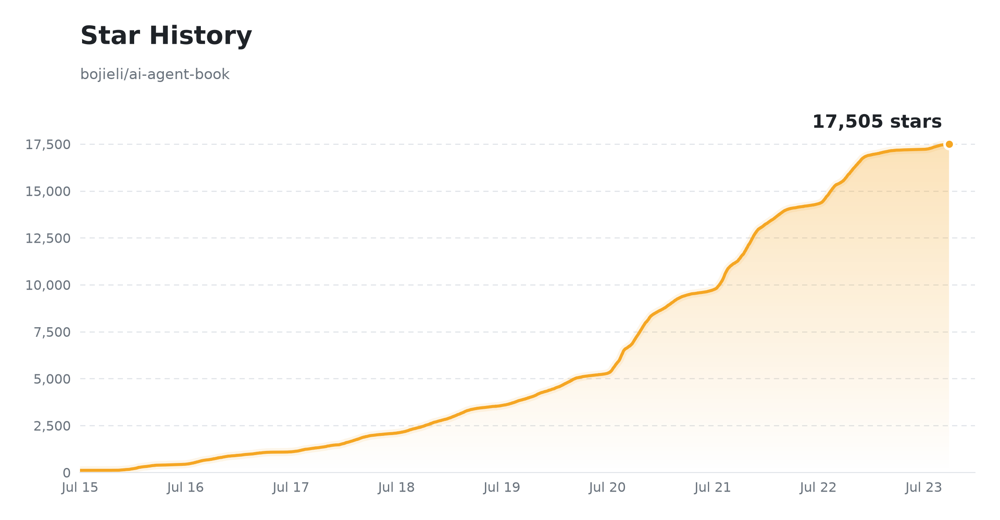

# AI Agent 徹底解説: 設計原理とエンジニアリング実践

[](https://github.com/bojieli/ai-agent-book) [](../../LICENSE) [](#-電子書籍) [](#-電子書籍)

**[中文](../../README.md) · [台灣正體](../zh-TW/README.md) · [English](../en/README.md) · [Tiếng Việt](../vi/README.md) · [தமிழ்](../ta/README.md) · 日本語 ← 現在**

**Agent = LLM + コンテキスト + ツール** — 本書はこの中核となる公式を軸に、全10章を通じて AI エージェントを原理からエンジニアリング実践まで解説します。本文、図版、**88 個の付随実験**はすべてオープンソースです。ぜひ自分の手で実験を動かしてみてください。

| 📚 基礎から本番まで **10 章** の本文 | 📂 **88 個** の付随プロジェクト（70 個以上が単独実行可能） | 🌐 **6 言語**: 中 / 台灣正體 / 英 / タミル / 越 / 日 |
| :---: | :---: | :---: |

## 📖 電子書籍

> 📥 **ダウンロード**（全文、無料でオープンソース）。以下のリンクは常に `main` ブランチの最新ビルドを指します。固定版は [Releases](https://github.com/bojieli/ai-agent-book/releases) ページを参照してください。
> - **中国語（原版）**: [PDF](https://github.com/bojieli/ai-agent-book/releases/download/latest/AI-Agents-in-Depth-zh-CN.pdf) · [EPUB](https://github.com/bojieli/ai-agent-book/releases/download/latest/AI-Agents-in-Depth-zh-CN.epub)
> - **繁体字中国語（台湾）**（コミュニティ翻訳、[@tigercosmos](https://github.com/tigercosmos)）: [PDF](https://github.com/bojieli/ai-agent-book/releases/download/latest/AI-Agents-in-Depth-zh-TW.pdf) · [EPUB](https://github.com/bojieli/ai-agent-book/releases/download/latest/AI-Agents-in-Depth-zh-TW.epub)
> - **英語**（コミュニティ翻訳、[@nsdevaraj](https://github.com/nsdevaraj)）: [PDF](https://github.com/bojieli/ai-agent-book/releases/download/latest/AI-Agents-in-Depth-en.pdf) · [EPUB](https://github.com/bojieli/ai-agent-book/releases/download/latest/AI-Agents-in-Depth-en.epub)
> - **タミル語**（コミュニティ翻訳、[@nsdevaraj](https://github.com/nsdevaraj)）: [PDF](https://github.com/bojieli/ai-agent-book/releases/download/latest/AI-Agents-in-Depth-ta.pdf) · [EPUB](https://github.com/bojieli/ai-agent-book/releases/download/latest/AI-Agents-in-Depth-ta.epub)
> - **ベトナム語**（コミュニティ翻訳、[@toanalien](https://github.com/toanalien)）: [PDF](https://github.com/bojieli/ai-agent-book/releases/download/latest/AI-Agents-in-Depth-vi.pdf) · [EPUB](https://github.com/bojieli/ai-agent-book/releases/download/latest/AI-Agents-in-Depth-vi.epub)
> - **日本語**（コミュニティ翻訳、[@eltociear](https://github.com/eltociear)）: [PDF](https://github.com/bojieli/ai-agent-book/releases/download/latest/AI-Agents-in-Depth-ja.pdf) · [EPUB](https://github.com/bojieli/ai-agent-book/releases/download/latest/AI-Agents-in-Depth-ja.epub)

中国語の本文ソースは [`book/`](../../book/) にあります。繁体字中国語（台湾）/英語/タミル語/ベトナム語/日本語版はコミュニティによる貢献であり（中国語原版より遅れる場合があります）、それぞれ [`book-zhtw/`](../../book-zhtw/)、[`book-en/`](../../book-en/)、[`book-ta/`](../../book-ta/)、[`book-vi/`](../../book-vi/)、[`book-ja/`](../../book-ja/) にあります。

共通のビルドスクリプトで、簡体字中国語、繁体字中国語（台湾）、英語、タミル語、ベトナム語、日本語の EPUB 3 版を生成できます。[EPUB ビルド手順](../../EPUB.md) を参照してください。

<details>
<summary><b>🔧 自分で PDF をビルドしますか？</b>（pandoc / xelatex / ElegantBook が必要）</summary>

- **本文ソース**: `book/introduction.md`（引言）、`book/chapter1.md` ～ `book/chapter10.md`（第1〜10章）、`book/afterword.md`（後記）
- **ビルド**: pandoc、xelatex、ElegantBook ドキュメントクラスと必要なフォントをインストールしてから、次を実行します

  ```bash
  cd book && bash build_pdf.sh
  ```

  図版は `book/gen_*_figs.py` によって生成され、`book/images/` に保存されます。組版の詳細は `book/preamble.tex` と `book/*.lua` を参照してください。

</details>

## 📑 内容早わかり（第1〜10章）

本書は中核となる公式 **Agent = LLM + コンテキスト + ツール** を軸に展開し、10章が段階的に積み上がります。

| 章 | テーマ | 一言でいうと | 本文 | コード |
| :--: | --- | --- | :--: | :--: |
| 1 | 🚀 **Agent の基礎知識** | 「モデルこそが Agent」というパラダイム + **Agent = LLM + コンテキスト + ツール**。Harness エンジニアリングこそが真の競争力 | [読む](../../book-ja/chapter1.ja.md) | [4](../../chapter1/README.ja.md) |
| 2 | 🎯 **コンテキストエンジニアリング** | コンテキストが能力の上限を決める: KV Cache、プロンプトエンジニアリング、Agent Skills、コンテキスト圧縮 | [読む](../../book-ja/chapter2.ja.md) | [9](../../chapter2/README.ja.md) |
| 3 | 📚 **ユーザーメモリと知識ベース** | セッションをまたいでユーザーを記憶し、外部知識を接続する: ユーザーメモリ、RAG、構造化インデックス、ナレッジグラフ | [読む](../../book-ja/chapter3.ja.md) | [13](../../chapter3/README.ja.md) |
| 4 | 🛠️ **ツール** | ツールは Agent の両手: MCP プロトコル、知覚/実行/協調の3種類のツール、イベント駆動の非同期 Agent、能動的なツール発見 | [読む](../../book-ja/chapter4.ja.md) | [7](../../chapter4/README.ja.md) |
| 5 | 💻 **Coding Agent とコード生成** | コードは「新しいツールを生み出せるツール」。本番グレードの Coding Agent の全体像 | [読む](../../book-ja/chapter5.ja.md) | [12](../../chapter5/README.ja.md) |
| 6 | 🎯 **Agent の評価** | パフォーマンスを比較可能なシグナルに変える: 評価環境、指標、統計的有意性、評価駆動の選定 | [読む](../../book-ja/chapter6.ja.md) | [10](../../chapter6/README.ja.md) |
| 7 | 🧠 **モデルのポストトレーニング** | 事前学習/SFT/RL の3段階: いつ SFT を選び、いつ RL を選ぶか、ツール呼び出しの内在化、サンプル効率 | [読む](../../book-ja/chapter7.ja.md) | [14](../../chapter7/README.ja.md) |
| 8 | 🔄 **Agent の自己進化** | 重みを変えずに成長する: 経験からの学習、ツールの利用者から創造者へ | [読む](../../book-ja/chapter8.ja.md) | [6](../../chapter8/README.ja.md) |
| 9 | 🎙️ **マルチモーダルとリアルタイム対話** | テキストから音声、GUI、物理世界へ拡張する: 音声の3パラダイム、Computer Use、ロボティクス | [読む](../../book-ja/chapter9.ja.md) | [7](../../chapter9/README.ja.md) |
| 10 | 🤝 **マルチ Agent 協調** | 集合知は個を上回る: 協調フレームワーク、コンテキストの共有/隔離、創発する「Agent 社会」 | [読む](../../book-ja/chapter10.ja.md) | [6](../../chapter10/README.ja.md) |

> 💡 **読む** = GitHub 上で章の本文（markdown）を読む。**N** = その章の付随プロジェクト数。クリックでコードを表示。プロジェクトの種類（✅ 単独実行 / 📖 再現 / 🚧 設計）は各章の README で説明しています。
>
> 📚 本書を効率的に読むには？ **[学習のヒント](LEARNING.md)**（中核となる考え方、学習パス、難易度レベル、実践のヒント）を参照してください。

## 🔑 API キー

学習を円滑に進めるため、いくつかのプラットフォームで API キーを申請することをおすすめします。モデル選定については [このガイド](https://01.me/2025/07/llm-api-setup/) を参照してください。

| プラットフォーム | リンク | 備考 |
| --- | --- | --- |
| **Kimi**（Moonshot） | <https://platform.moonshot.cn/> | Kimi シリーズ。長文コンテキストと Agent 能力に強い |
| **Zhipu GLM** | <https://open.bigmodel.cn/> | GLM-4.6 など。中国語能力が高くコストパフォーマンスに優れる |
| **Siliconflow** | <https://siliconflow.cn/> | さまざまなオープンソースモデル（DeepSeek、Qwen など） |
| **Volcano Engine** | <https://www.volcengine.com/product/ark> | ByteDance Doubao（クローズドソース）。中国国内で低レイテンシ |
| **OpenRouter** | <https://openrouter.ai/> | Gemini / Claude / GPT-5 などにワンストップでアクセス（公式 API は海外 IP/決済が必要。OpenAI は海外での本人確認も必要） |

## 📦 付録 · 外部リポジトリの取得

第6・7・9・10章のベンチマーク、訓練フレームワーク、ロボットプラットフォーム向けの20個の外部リポジトリは（サイズとライセンスの都合上）**同梱されていません**。対応するディレクトリに clone する必要があります。

### 一括 clone スクリプト

<details>
<summary><b>🔧 clone コマンドを展開</b>（20個の外部リポジトリ）</summary>

```bash
# 第6章 · 評価ベンチマーク
git clone https://github.com/google-research/android_world.git         chapter6/android_world
git clone https://huggingface.co/datasets/gaia-benchmark/GAIA          chapter6/GAIA
git clone https://github.com/xlang-ai/OSWorld.git                      chapter6/OSWorld
git clone https://github.com/SWE-bench/SWE-bench.git                   chapter6/SWE-bench
git clone https://github.com/sierra-research/tau2-bench.git            chapter6/tau2-bench
git clone https://github.com/laude-institute/terminal-bench.git        chapter6/terminal-bench

# 第7章 · 訓練フレームワーク（bojieli/* は書籍向けに調整された fork）
git clone https://github.com/bojieli/minimind.git                      chapter7/MiniMind-pretrain/minimind      # 実験 7-3 LLM をゼロから訓練
git clone https://github.com/bojieli/minimind-v.git                    chapter7/MiniMind-pretrain/minimind-v    # 実験 7-4 VLM をゼロから訓練（投影層）
git clone https://github.com/bojieli/AdaptThink.git                    chapter7/AdaptThink-original
git clone https://github.com/bojieli/AWorld.git                        chapter7/AWorld
git clone https://github.com/bojieli/SFTvsRL.git                       chapter7/SFTvsRL
git clone https://github.com/bojieli/verl.git                          chapter7/verl
git clone https://github.com/thinking-machines-lab/tinker-cookbook.git chapter7/tinker-cookbook
git clone https://github.com/bojieli/lighteval.git                     chapter7/Intuitor/lighteval
git clone https://github.com/19PINE-AI/rlvp.git                        chapter7/RLVP/rlvp                       # 実験 7-14 RLVP 論文コード
git clone https://github.com/PRIME-RL/SimpleVLA-RL.git                 chapter7/SimpleVLA-RL/SimpleVLA-RL       # 実験 7-13 vision-language-action RL

# 第9章 · ブラウザ自動化と Claude サンプル
git clone https://github.com/browser-use/browser-use.git               chapter9/browser-use
git clone https://github.com/anthropics/claude-quickstarts.git         chapter9/claude-quickstarts

# 第10章 · デュアル Agent アーキテクチャ（現在は独立した TalkAct プロジェクト）+ Stanford AI Town
git clone https://github.com/19PINE-AI/TalkAct.git                     chapter10/use-computer-while-calling
git clone https://github.com/joonspk-research/generative_agents.git    chapter10/generative_agents             # 実験 10-7 Stanford AI Town
```

> プロジェクトの README が特定のコミットを指定している場合は、再現性のためにそのバージョンへ `git checkout` してください。第10章の `use-computer-while-calling` は独立して保守される [19PINE-AI/TalkAct](https://github.com/19PINE-AI/TalkAct) へと発展しました。本リポジトリにはポインタのドキュメントのみを残しています。

</details>

### その他の再現方法

以下の実験には専用の clone コマンドはありませんが、固有の再現方法があります。

| 実験 | 種類 | 備考 |
| --- | :--: | --- |
| 6-2 / 6-3 / 6-4 / 6-9 | 📝 読者の演習 | ヒューマンベンチマーク、メモリ評価、JSON Cards vs RAG、メモリ選択 — 第3章の `user-memory` / `user-memory-evaluation` / `contextual-retrieval` を応用 |
| 5-12 | 📝 読者の演習 | Agent を作る Agent — `chapter5/coding-agent` からブートストラップ |
| 7-8 | 📝 読者の演習 | プロンプト蒸留 — `chapter8/prompt-distillation` を参照（章をまたいで再利用） |
| 7-9 | 📝 読者の演習 | CoT 蒸留 `[拡張]` — 設計と受け入れ基準は本文にあり、専用コードなし |
| 6-11 | 🤖 シミュレーション評価 | OpenVLA + RoboTwin2 — VLA 訓練/環境の依存関係は `chapter7/SimpleVLA-RL` の README を参照 |
| 9-8 / 9-9 | 🔧 実機 | XLeRobot の遠隔操作と LLM Agent 制御 — SO-100 アームが必要、[Teleop](https://xlerobot.readthedocs.io/en/latest/software/getting_started/XLeRobot_teleop.html) · [LLM Agent](https://xlerobot.readthedocs.io/en/latest/software/getting_started/LLM_agent.html) |
| 9-10 | 🔧 実機 | RGB ゼロショット Sim2Real 把持 — [`StoneT2000/lerobot-sim2real`](https://github.com/StoneT2000/lerobot-sim2real)（シミュレーションは純粋な GPU で動作。デプロイには SO-100 が必要） |

## 🤝 コントリビュート

本書と付随コードは完全にオープンソースです。Pull Request を大歓迎します。

| 種類 | 備考 |
| --- | --- |
| 📝 **本文の内容** | 誤字修正、加筆、より分かりやすい表現、あるいは新しい動向（本文は `book/chapter*.md`） |
| 🐛 **コードの改善とバグ修正** | 付随プロジェクトをより堅牢に、使いやすく、本番対応にする |
| 🧪 **新しい実践プロジェクト** | 実験のより良い実装を追加/置換、あるいは新しいサンプルを提供 |
| 🎨 **図版の設計** | `book/images/` の図をより明確で洗練されたものにする（`book/gen_*_figs.py` で生成） |
| 🌐 **新しい翻訳** | より多くの言語への翻訳を歓迎します。繁体字中国語/台湾（`book-zhtw/`）、英語（`book-en/`）、タミル語（`book-ta/`）、ベトナム語（`book-vi/`）、日本語（`book-ja/`）を参考にしてください |

提出前に、該当する実験を実行して再現性を確認してください。まず issue を立ててアイデアを議論するのも歓迎です。

## 📄 ライセンス

本プロジェクトは [Apache License 2.0](../../LICENSE) の下でライセンスされています。詳細は [`LICENSE`](../../LICENSE) ファイルを参照してください。一部のサブプロジェクトには独自のライセンス情報が含まれる場合があります。詳しくは各サブプロジェクトを参照してください。

## ⭐ Star 履歴

<a href="https://star-history.com/#bojieli/ai-agent-book&Date">
  <picture>
    <source media="(prefers-color-scheme: dark)" srcset="../../assets/star-history-dark.png" />
    <source media="(prefers-color-scheme: light)" srcset="../../assets/star-history-light.png" />
    
  </picture>
</a>

<sub>[`scripts/gen_star_history.py`](../../scripts/gen_star_history.py) によって生成され、[GitHub Actions](../../.github/workflows/star-history.yml) によって毎日更新されます · 画像をクリックするとライブデータを表示</sub>
